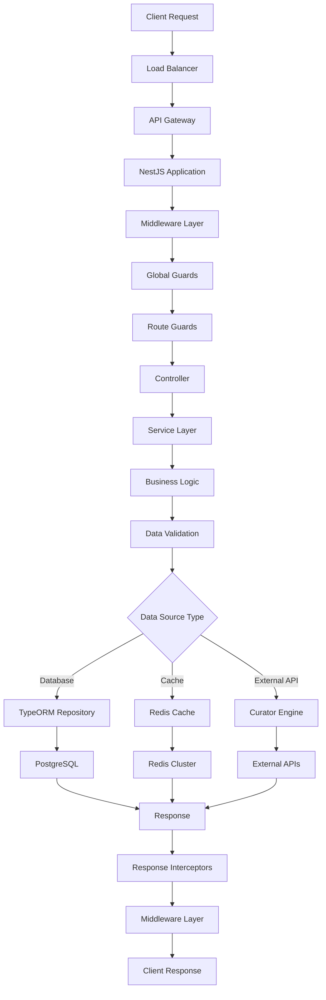
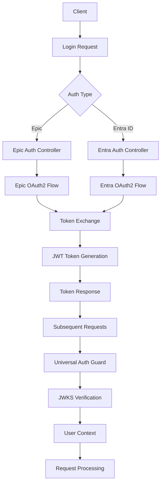
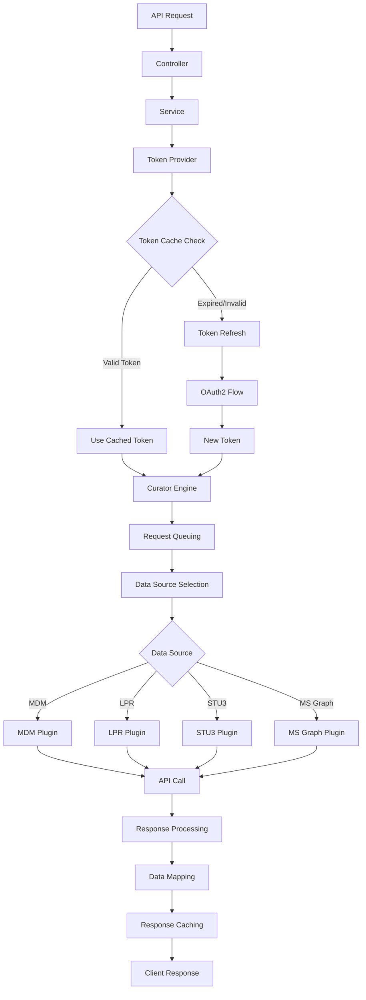

# 🏗️ System Architecture Overview

## 🎯 **Complete System Architecture**

The Mayo Care Team Navigator API is a sophisticated, enterprise-grade healthcare platform built with modern microservices architecture principles.

---

## 📋 **Architecture Components**

### **🏗️ Application Layer (NestJS Framework)**

```
┌─────────────────────────────────────────────────────────────┐
│                    NestJS Application Layer                 │
│  ┌─────────────────────────────────────────────────────┐    │
│  │                Controllers (API Endpoints)          │    │
│  │  ├─ Clinical Summary ─┬─ Appointments               │    │
│  │  ├─ Authentication ──┬─ Preferences                 │    │
│  │  ├─ Data Concepts ───┼─ Secure Chat                 │    │
│  │  └─ Health Checks ───┴─ Access Control              │    │
│  └─────────────────────────────────────────────────────┘    │
│                                                             │
│  ┌─────────────────────────────────────────────────────┐    │
│  │                 Services (Business Logic)          │    │
│  │  ├─ Curator Engine ─┬─ Token Provider              │    │
│  │  ├─ Audit Logging ──┼─ Specialty Mapping           │    │
│  │  └─ Request Context ┴─ Data Validation             │    │
│  └─────────────────────────────────────────────────────┘    │
│                                                             │
│  ┌─────────────────────────────────────────────────────┐    │
│  │            Guards & Security Layer                 │    │
│  │  ├─ Universal Auth Guard ─┬─ Access Blacklist      │    │
│  │  ├─ Epic Auth Guard ──────┼─ Role-based Access     │    │
│  │  └─ Feature Guards ──────┴─ Permission Validation  │    │
│  └─────────────────────────────────────────────────────┘    │
└─────────────────────────────────────────────────────────────┘
```

### **🔄 Request Flow Architecture**

```
┌─────────────┐    ┌─────────────────┐    ┌─────────────────┐
│   Client    │───▶│   Load Balancer │───▶│   API Gateway   │
└─────────────┘    └─────────────────┘    └─────────────────┘
                                                       │
                    ┌──────────────────────────────────┼──────────────────────────────────┐
                    │                                  │                                  │
            ┌───────▼───────┐                  ┌───────▼───────┐                  ┌───────▼───────┐
            │   Middleware  │                  │  Auth Guards   │                  │ Interceptors  │
            │ ├─ Request ID │                  │ ├─ JWT Verify  │                  │ ├─ Audit Log  │
            │ ├─ CORS       │                  │ ├─ User Context│                  │ ├─ Response   │
            │ └─ Logging    │                  │ └─ Permissions │                  │ └─ Metrics    │
            └───────▲───────┘                  └───────▲───────┘                  └───────▲───────┘
                    │                                  │                                  │
            ┌───────▼───────┐                  ┌───────▼───────┐                  ┌───────▼───────┐
            │  Controller   │                  │    Service     │                  │  Repository   │
            │ ├─ Validation │                  │ ├─ Business    │                  │ ├─ Database   │
            │ ├─ Routing    │                  │ │  Logic       │                  │ ├─ Cache      │
            │ └─ Response   │                  │ └─ External    │                  │ └─ External   │
            └───────────────┘                  │    APIs        │                  │   APIs        │
                                              └─────────────────┘                  └───────────────┘
```

### **🗄️ Data Layer Architecture**

```
┌─────────────────────────────────────────────────────────────┐
│                     Data Layer Architecture                │
│  ┌─────────────────────────────────────────────────────┐    │
│  │              Primary Database (PostgreSQL)         │    │
│  │  ├─ User Preferences ─┬─ Audit Logs                │    │
│  │  ├─ Access Blacklist ─┼─ Chat Details              │    │
│  │  └─ Clinical Data ────┴─ System Configuration      │    │
│  └─────────────────────────────────────────────────────┘    │
│                                                             │
│  ┌─────────────────────────────────────────────────────┐    │
│  │                 Caching Layer (Redis)              │    │
│  │  ├─ Authentication Tokens ─┬─ User Sessions        │    │
│  │  ├─ API Responses ─────────┼─ Rate Limiting        │    │
│  │  └─ External API Data ─────┴─ Temporary Data       │    │
│  └─────────────────────────────────────────────────────┘    │
│                                                             │
│  ┌─────────────────────────────────────────────────────┐    │
│  │              External Data Sources                 │    │
│  │  ├─ Epic EHR ──────────┬─ MDM (Master Data)        │    │
│  │  ├─ LPR (Longitudinal)─┼─ STU3 (FHIR Standard)     │    │
│  │  └─ MS Graph ──────────┴─ Custom Healthcare APIs   │    │
│  └─────────────────────────────────────────────────────┘    │
└─────────────────────────────────────────────────────────────┘
```

---

## 🔄 **Complete Data Flow**

### **1. Client Request Flow**



### **2. Authentication Flow**



### **3. External API Integration Flow**



---

## 🏗️ **Component Architecture Details**

### **🎮 Controller Layer Architecture**

```typescript
@Controller('clinical-summary')
export class ClinicalSummaryController {
  constructor(
    private readonly clinicalSummaryService: ClinicalSummaryService,
    private readonly specialty2RoleService: Specialty2RoleService,
  ) {}

  @Post()
  @UsePipes(new ValidationPipe({ whitelist: true }))
  async getSummary(@Body() body: ClinicalSummaryRequestDto) {
    // 1. Input validation
    // 2. Data transformation
    // 3. Service delegation
    // 4. Response formatting
  }
}
```

**Controller Responsibilities:**
- ✅ **Route Definition**: HTTP method and path mapping
- ✅ **Request Validation**: DTO validation with class-validator
- ✅ **Parameter Extraction**: Path params, query params, body
- ✅ **Service Orchestration**: Delegate to business logic services
- ✅ **Response Formatting**: Transform data for API consumers
- ✅ **Error Handling**: Convert exceptions to HTTP responses

### **⚙️ Service Layer Architecture**

```typescript
@Injectable()
export class ClinicalSummaryService {
  constructor(
    private readonly tokenProvider: TokenProviderService,
    private readonly httpService: HttpService,
    @Inject(InferenceEngineConfig.KEY)
    private readonly config: ConfigType<typeof InferenceEngineConfig>,
  ) {}

  async fetchClinicalSummary(input: ClinicalSummaryRequest) {
    // 1. Authentication token management
    // 2. External API communication
    // 3. Data transformation and mapping
    // 4. Error handling and retry logic
    // 5. Response processing
  }
}
```

**Service Responsibilities:**
- ✅ **Business Logic**: Core application functionality
- ✅ **Data Processing**: Transform and validate data
- ✅ **External Integration**: Communicate with external APIs
- ✅ **Caching**: Implement caching strategies
- ✅ **Transaction Management**: Handle database transactions
- ✅ **Error Recovery**: Implement retry and fallback logic

### **🔐 Security Layer Architecture**

```typescript
@Injectable()
export class UniversalAuthenticationGuard implements CanActivate {
  constructor(
    private readonly reflector: Reflector,
    private readonly curatorEngine: CuratorEngineService,
    private readonly configService: ConfigService,
    private readonly introspectService: IntrospectService,
  ) {}

  async canActivate(context: ExecutionContext): Promise<boolean> {
    // 1. Check public routes
    // 2. Extract and validate tokens
    // 3. Determine token type (Epic vs Entra)
    // 4. Verify token signatures
    // 5. Load user context
    // 6. Check permissions
  }
}
```

**Security Components:**
- ✅ **Authentication Guards**: Token validation and user authentication
- ✅ **Authorization Guards**: Permission checking and access control
- ✅ **Interceptors**: Request/response auditing and logging
- ✅ **Middleware**: CORS, security headers, request logging
- ✅ **Decorators**: Metadata for security configuration

### **🗄️ Data Access Layer Architecture**

```typescript
@Injectable()
export class UserPreferencesRepository {
  constructor(
    @InjectRepository(UserPreferences)
    private readonly userPreferencesRepo: Repository<UserPreferences>,
  ) {}

  async findByUserId(userId: string): Promise<UserPreferences> {
    // 1. Query construction
    // 2. Database execution
    // 3. Result mapping
    // 4. Error handling
  }

  async updatePreferences(userId: string, preferences: Preferences): Promise<void> {
    // 1. Data validation
    // 2. Optimistic locking
    // 3. Transaction management
    // 4. Audit logging
  }
}
```

**Data Access Patterns:**
- ✅ **Repository Pattern**: Abstract data access operations
- ✅ **Query Builder**: Dynamic query construction
- ✅ **Connection Pooling**: Efficient database connections
- ✅ **Migration Management**: Schema versioning and updates
- ✅ **Audit Trail**: Track data changes for compliance

---

## 🔄 **Integration Architecture**

### **🌐 External Service Integration**

```typescript
@Injectable()
export class CuratorEngineService implements OnModuleInit {
  private mdm: PluginWithToken;
  private lpr: PluginWithToken;
  private stu3: PluginWithToken;
  private msGraph: PluginWithToken;

  constructor(/* dependencies */) {
    // Initialize external service connections
    this.initializePlugins();
  }

  async onModuleInit() {
    // Setup request queuing system
    await this.initializeQueues();
  }

  async getConceptAsync(parameters: CuratorEngineParameters[]) {
    // 1. Request queuing and throttling
    // 2. Data source selection and routing
    // 3. Authentication token management
    // 4. API call execution with retry logic
    // 5. Response processing and caching
  }
}
```

**Integration Patterns:**
- ✅ **Plugin Architecture**: Extensible service connectors
- ✅ **Request Queuing**: Rate limiting and concurrency control
- ✅ **Circuit Breaker**: Fault tolerance and recovery
- ✅ **Retry Logic**: Exponential backoff and error recovery
- ✅ **Response Caching**: Performance optimization
- ✅ **Data Mapping**: Standardize external data formats

### **📊 Caching Architecture**

```typescript
@Injectable()
export class CacheService {
  constructor(@Inject(CACHE_MANAGER) private cacheManager: Cache) {}

  async get<T>(key: string): Promise<T | undefined> {
    const cached = await this.cacheManager.get<T>(key);
    return cached;
  }

  async set<T>(key: string, value: T, ttl?: number): Promise<void> {
    await this.cacheManager.set(key, value, ttl);
  }

  generateKey(...parts: string[]): string {
    return createHash('sha256')
      .update(parts.join(':'))
      .digest('hex');
  }
}
```

**Caching Strategies:**
- ✅ **Multi-level Caching**: Memory + Redis + Database
- ✅ **Cache Key Generation**: Consistent key naming
- ✅ **TTL Management**: Expiration and invalidation
- ✅ **Cache Warming**: Pre-populate frequently accessed data
- ✅ **Cache Invalidation**: Update strategies for data consistency

---

## 🔧 **Configuration Architecture**

### **⚙️ Environment-Based Configuration**

```typescript
export default registerAs('database', () => {
  const config = {
    type: 'postgres' as const,
    host: get('DATABASE_HOST').asString(),
    port: get('DATABASE_PORT').asPortNumber(),
    username: get('DATABASE_USER').asString(),
    password: get('DATABASE_PASSWORD').asString(),
    database: get('DATABASE_NAME').asString(),
    synchronize: get('DATABASE_SYNCHRONIZE').asBool(),
  };

  // Configuration validation
  validateDatabaseConfig(config);

  return config;
});
```

**Configuration Features:**
- ✅ **Environment Variables**: Runtime configuration
- ✅ **Validation**: Configuration schema validation
- ✅ **Type Safety**: TypeScript interfaces for configs
- ✅ **Feature Flags**: Runtime feature toggles
- ✅ **Multi-environment**: dev/test/staging/prod configs

---

## 📊 **Performance Architecture**

### **🚀 Performance Optimization**

```typescript
@Injectable()
export class PerformanceService {
  private readonly logger = new Logger(PerformanceService.name);

  async measureExecutionTime<T>(
    operation: () => Promise<T>,
    operationName: string,
  ): Promise<T> {
    const startTime = process.hrtime.bigint();

    try {
      const result = await operation();
      const endTime = process.hrtime.bigint();
      const duration = Number(endTime - startTime) / 1e6; // Convert to milliseconds

      this.logger.log(`${operationName} took ${duration}ms`);
      return result;
    } catch (error) {
      const endTime = process.hrtime.bigint();
      const duration = Number(endTime - startTime) / 1e6;

      this.logger.error(`${operationName} failed after ${duration}ms`, error);
      throw error;
    }
  }
}
```

**Performance Features:**
- ✅ **Async Processing**: Non-blocking operations
- ✅ **Connection Pooling**: Database and API connection reuse
- ✅ **Caching**: Multi-level caching strategy
- ✅ **Request Batching**: Group similar requests
- ✅ **Lazy Loading**: On-demand data loading
- ✅ **Monitoring**: Performance metrics and alerting

---

## 🔒 **Security Architecture**

### **🛡️ Security Implementation**

```typescript
@Injectable()
export class SecurityService {
  private readonly logger = new Logger(SecurityService.name);

  async validateRequest(request: Request): Promise<SecurityContext> {
    // 1. Input validation and sanitization
    // 2. Authentication token verification
    // 3. Authorization permission checking
    // 4. Rate limiting validation
    // 5. Threat detection
    // 6. Audit logging
  }

  sanitizeInput(input: any): any {
    // Remove potentially dangerous content
    // SQL injection prevention
    // XSS prevention
    // Command injection prevention
  }

  generateSecureToken(): string {
    return randomBytes(32).toString('hex');
  }
}
```

**Security Layers:**
- ✅ **Input Validation**: Request data sanitization
- ✅ **Authentication**: Multi-factor and multi-provider auth
- ✅ **Authorization**: Role-based and attribute-based access
- ✅ **Encryption**: Data at rest and in transit
- ✅ **Audit Trail**: Comprehensive security logging
- ✅ **Rate Limiting**: DDoS protection and abuse prevention

---

## 📈 **Monitoring & Observability**

### **📊 Monitoring Architecture**

```typescript
@Injectable()
export class MonitoringService {
  constructor(
    private readonly logger: Logger,
    private readonly metrics: MetricsService,
  ) {}

  async trackRequest(
    request: Request,
    response: Response,
    startTime: number,
  ): Promise<void> {
    const duration = Date.now() - startTime;
    const statusCode = response.statusCode;

    // Track metrics
    this.metrics.increment('requests_total', {
      method: request.method,
      endpoint: request.path,
      status: statusCode.toString(),
    });

    this.metrics.histogram('request_duration', duration, {
      method: request.method,
      endpoint: request.path,
    });

    // Log performance issues
    if (duration > 5000) {
      this.logger.warn(`Slow request: ${request.method} ${request.path} took ${duration}ms`);
    }

    // Log errors
    if (statusCode >= 400) {
      this.logger.error(`Request failed: ${request.method} ${request.path} - ${statusCode}`);
    }
  }
}
```

**Monitoring Features:**
- ✅ **Metrics Collection**: Response times, error rates, throughput
- ✅ **Distributed Tracing**: Request correlation across services
- ✅ **Health Checks**: Service availability monitoring
- ✅ **Alerting**: Automated incident response
- ✅ **Log Aggregation**: Centralized logging system
- ✅ **Performance Profiling**: Bottleneck identification

---

## 🎯 **Architecture Principles**

### **🏗️ Design Principles**

1. **SOLID Principles**: Single responsibility, open/closed, etc.
2. **Dependency Injection**: Loose coupling and testability
3. **Repository Pattern**: Data access abstraction
4. **CQRS Pattern**: Command Query Responsibility Segregation
5. **Observer Pattern**: Event-driven architecture
6. **Strategy Pattern**: Pluggable algorithms

### **🔧 Development Principles**

1. **Test-Driven Development**: Tests first, then implementation
2. **Continuous Integration**: Automated testing and deployment
3. **Infrastructure as Code**: Version-controlled infrastructure
4. **Microservices Design**: Service boundaries and communication
5. **API-First Design**: Contract-driven development
6. **Security by Design**: Security integrated throughout

### **📈 Scalability Principles**

1. **Horizontal Scaling**: Load balancing and service replication
2. **Caching Strategy**: Multi-level caching hierarchy
3. **Database Sharding**: Data distribution across instances
4. **Asynchronous Processing**: Queue-based request handling
5. **CDN Integration**: Static asset optimization
6. **Auto-scaling**: Dynamic resource allocation

---

## 🚀 **Deployment Architecture**

### **🐳 Containerization**

```dockerfile
FROM node:20-alpine

# Install system dependencies
RUN apk add --no-cache postgresql-client

# Set working directory
WORKDIR /app

# Install application dependencies
COPY package*.json ./
RUN npm ci --only=production

# Copy application code
COPY . .

# Build application
RUN npm run build

# Expose port
EXPOSE 3000

# Health check
HEALTHCHECK --interval=30s --timeout=3s --start-period=5s --retries=3 \
  CMD curl -f http://localhost:3000/health || exit 1

# Start application
CMD ["npm", "run", "start:prod"]
```

### **☁️ Cloud Architecture**

```
┌─────────────────────────────────────────────────────────────┐
│                    Cloud Infrastructure                     │
│  ┌─────────────────────────────────────────────────────┐    │
│  │                Load Balancer (nginx)               │    │
│  │  ├─ SSL Termination ─┬─ Rate Limiting               │    │
│  │  └─ Request Routing ─┴─ Health Checks               │    │
│  └─────────────────────────────────────────────────────┘    │
│                                                             │
│  ┌─────────────────────────────────────────────────────┐    │
│  │              Application Servers                   │    │
│  │  ├─ API Instances ───┬─ Background Workers         │    │
│  │  ├─ Cache Servers ───┼─ Queue Processors           │    │
│  │  └─ File Storage ────┴─ CDN Integration            │    │
│  └─────────────────────────────────────────────────────┘    │
│                                                             │
│  ┌─────────────────────────────────────────────────────┐    │
│  │                Database Layer                      │    │
│  │  ├─ Primary DB ─────┬─ Read Replicas               │    │
│  │  ├─ Cache Layer ────┼─ Backup Systems              │    │
│  │  └─ Data Warehouse ─┴─ Analytics Systems           │    │
│  └─────────────────────────────────────────────────────┘    │
└─────────────────────────────────────────────────────────────┘
```

---

## 🎯 **Next Steps**

Now that you understand the complete system architecture, dive deeper into specific components:

1. **[Controllers](./../controllers/clinical-summary.md)** - API endpoint implementation
2. **[Services](./../services/curator-engine.md)** - Business logic and external integration
3. **[Security](./../guards/universal-auth-guard.md)** - Authentication and authorization
4. **[Database](./../entities/user-preferences.md)** - Data modeling and persistence
5. **[External APIs](./../external-libs/curator-engine.md)** - Third-party integrations

Each component is thoroughly documented with code examples, data flows, dependencies, and implementation details.

**🎯 [Start with the Clinical Summary Controller](./../controllers/clinical-summary.md)** to see how all these architectural pieces work together!
