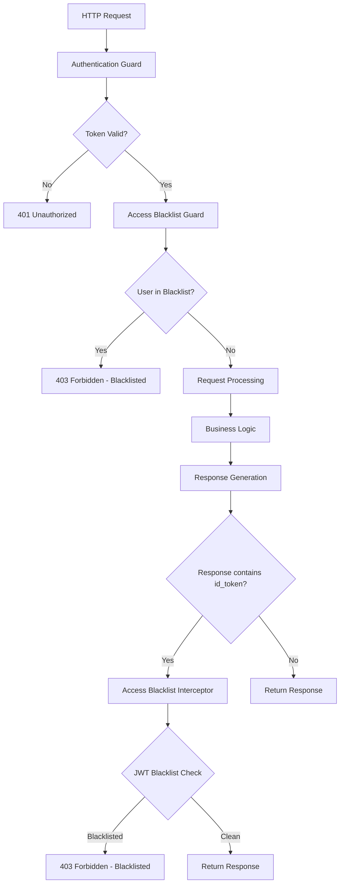
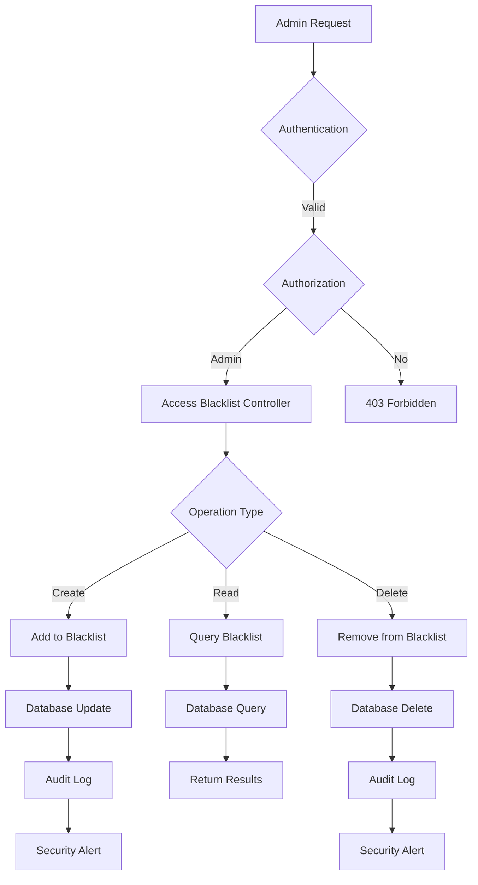

# 🚫 Access Blacklist Controller - Security Access Control System

## 🎯 **Overview**

The **Access Blacklist System** is a comprehensive security framework that provides multi-layered access control and user management for the Navigator API. It serves as the first line of defense against unauthorized access, implementing both proactive and reactive security measures to protect sensitive healthcare data.

---

## 📍 **Core Purpose & Architecture**

### **What is Access Blacklist System?**
Access Blacklist is a sophisticated security system that:
- **Blocks unauthorized users** from accessing the application
- **Provides administrative control** over user access permissions
- **Implements multi-layer security** with guards and interceptors
- **Supports emergency access revocation** for security incidents
- **Maintains audit trails** of access control decisions
- **Integrates with authentication systems** for seamless security enforcement

### **Access Blacklist Architecture**

```
┌─────────────────────────────────────────────────────────────┐
│           Access Blacklist Security Architecture            │
│  ┌─────────────────────────────────────────────────────┐    │
│  │           Administrative Management                │    │
│  │  ├─ Blacklist CRUD ───────┬─ Add/Remove Users      │    │
│  │  ├─ User Management ──────┼─ Administrative Control│    │
│  │  ├─ Audit Logging ────────┼─ Access Control Trail  │    │
│  │  └─ Emergency Controls ───┴─ Rapid Response        │    │
│  └─────────────────────────────────────────────────────┘    │
│                                                             │
│  ┌─────────────────────────────────────────────────────┐    │
│  │           Runtime Access Control                    │    │
│  │  ├─ Request Guards ──────┬─ Pre-Request Validation │    │
│  │  ├─ Response Interceptors┼─ Post-Request Validation│    │
│  │  ├─ Token Validation ────┼─ JWT/Identity Checks    │    │
│  │  └─ Exception Handling ──┴─ Security Error Mgmt    │    │
│  └─────────────────────────────────────────────────────┘    │
│                                                             │
│  ┌─────────────────────────────────────────────────────┐    │
│  │           Integration & Monitoring                  │    │
│  │  ├─ Authentication ─────┬─ Epic/Entra Integration  │    │
│  │  ├─ Audit Logging ──────┼─ Security Event Tracking │    │
│  │  ├─ Alerting ───────────┼─ Security Incident Alerts│    │
│  │  └─ Performance ────────┴─ Access Control Metrics  │    │
│  └─────────────────────────────────────────────────────┘    │
└─────────────────────────────────────────────────────────────┘
```

---

## 🔧 **Complete Implementation**

### **1. Administrative Controller**

```typescript
// File: src/controllers/access-blacklist/access-blacklist.controller.ts

import {
  Body,
  Controller,
  Delete,
  Get,
  Logger,
  NotFoundException,
  Param,
  Post,
} from '@nestjs/common';
import {
  ApiBearerAuth,
  ApiNotFoundResponse,
  ApiOperation,
  ApiTags,
} from '@nestjs/swagger';
import { AccessBlacklistService } from './access-blacklist.service';
import { CreateAccessBlacklistDto } from './dto/create-access-blacklist.dto';
import { AccessBlacklist } from './entities/access-blacklist.entity';

// TODO: Fine-grained permissions are required
@ApiTags('Access Blacklist')
@ApiBearerAuth()
@Controller('access-blacklist')
export class AccessBlacklistController {
  private logger = new Logger(AccessBlacklistController.name);

  constructor(
    private readonly accessBlacklistService: AccessBlacklistService,
  ) {}

  /**
   * Add a user to the access blacklist
   * Emergency access revocation for security incidents
   */
  @Post()
  @ApiOperation({
    summary: `Add a user to the blacklist`,
    description: `
    Immediately blocks a user's access to the Navigator API.

    **Security Implications:**
    - User will be denied access to all API endpoints
    - Works across all authentication methods (Epic, Entra ID)
    - Takes effect immediately on next API call
    - Requires administrative privileges

    **Use Cases:**
    - Security incidents and breaches
    - Account compromise situations
    - Policy violations
    - Emergency access revocation
    - Account termination scenarios

    **Audit Trail:**
    - All blacklist additions are logged
    - Timestamps and admin user recorded
    - Reason codes can be associated
    `,
  })
  create(@Body() createAccessBlacklistDto: CreateAccessBlacklistDto) {
    return this.accessBlacklistService.create(createAccessBlacklistDto);
  }

  /**
   * Retrieve complete list of blacklisted users
   * Administrative oversight and monitoring
   */
  @Get()
  @ApiOperation({
    summary: `Retrieve the list of blacklisted users`,
    description: `
    Returns the complete list of users currently blocked from accessing the system.

    **Administrative Features:**
    - Complete blacklist visibility
    - User details and timestamps
    - Reason codes and notes
    - Export capabilities for compliance
    - Real-time blacklist status

    **Security Considerations:**
    - Requires elevated administrative permissions
    - Access logged for audit purposes
    - Sensitive information handling
    - Rate limiting applied

    **Use Cases:**
    - Security monitoring and oversight
    - Compliance reporting
    - User access reviews
    - Incident response coordination
    `,
  })
  async findAll(): Promise<AccessBlacklist[]> {
    return await this.accessBlacklistService.findAll();
  }

  /**
   * Check if a specific user is blacklisted
   * Individual user access verification
   */
  @Get(':id')
  @ApiOperation({
    summary: `Determine if a user is blacklisted`,
    description: `
    Verifies whether a specific user is currently on the access blacklist.

    **Verification Process:**
    - Checks user LAN ID against blacklist database
    - Returns user details if blacklisted
    - Throws 404 if user is not blacklisted
    - Fast lookup with database indexing

    **Response Codes:**
    - 200: User is blacklisted (returns user details)
    - 404: User is not blacklisted
    - 401: Authentication required
    - 403: Insufficient permissions

    **Use Cases:**
    - Pre-access verification
    - User status checks
    - Administrative queries
    - Integration testing
    `,
  })
  @ApiNotFoundResponse({ description: 'User is not blacklisted' })
  async findOne(@Param('id') id: string): Promise<AccessBlacklist> {
    const blacklistedUser = await this.accessBlacklistService.findOne(id);

    if (!blacklistedUser) {
      // Add debug message as well
      this.logger.warn(
        `User with LAN ID ${id} was not found in the blacklisted users list`,
      );
      throw new NotFoundException(
        `User with LAN ID ${id} was not found in the blacklisted users list`,
      );
    }
    return blacklistedUser;
  }

  /**
   * Remove user from access blacklist
   * Restore user access after incident resolution
   */
  @Delete(':id')
  @ApiOperation({
    summary: `Removes a user's blacklisted status`,
    description: `
    Removes a user from the access blacklist, restoring their access to the system.

    **Restoration Process:**
    - Verifies user is currently blacklisted
    - Removes blacklist entry from database
    - Logs restoration action for audit
    - Immediate access restoration

    **Security Considerations:**
    - Requires same permissions as blacklist addition
    - All restoration actions are audited
    - Reason for restoration should be documented
    - Consider gradual access restoration

    **Business Rules:**
    - Only blacklisted users can be restored
    - Restoration is immediate and complete
    - No partial access restoration supported
    - Audit trail maintained

    **Use Cases:**
    - Incident resolution
    - Account reinstatement
    - Temporary access revocation expiry
    - Administrative corrections
    `,
  })
  @ApiNotFoundResponse({ description: 'User is not blacklisted' })
  async remove(@Param('id') id: string): Promise<void> {
    const success = await this.accessBlacklistService.remove(id);

    if (!success) {
      // Add debug message as well
      this.logger.warn(
        `User with LAN ID ${id} was not found in the blacklisted users list`,
      );
      throw new NotFoundException(
        `User with LAN ID ${id} was not found in the blacklisted users list`,
      );
    }
  }
}
```

### **2. Business Logic Service**

```typescript
// File: src/controllers/access-blacklist/access-blacklist.service.ts

import { Injectable } from '@nestjs/common';
import { CreateAccessBlacklistDto } from './dto/create-access-blacklist.dto';
import { InjectRepository } from '@nestjs/typeorm';
import { AccessBlacklist as AccessBlacklist } from './entities/access-blacklist.entity';
import { Repository } from 'typeorm';

@Injectable()
export class AccessBlacklistService {
  constructor(
    @InjectRepository(AccessBlacklist)
    private readonly accessBlacklistRepository: Repository<AccessBlacklist>,
  ) {}

  /**
   * Add user to access blacklist
   * Immediate blocking of user access
   */
  async create(
    createAccessBlacklistDto: CreateAccessBlacklistDto,
  ): Promise<void> {
    const blacklistedUser = this.accessBlacklistRepository.create({
      ...createAccessBlacklistDto,
    });

    await this.accessBlacklistRepository.save(blacklistedUser);
  }

  /**
   * Retrieve all blacklisted users
   * Complete blacklist visibility for administration
   */
  async findAll(): Promise<AccessBlacklist[]> {
    return await this.accessBlacklistRepository.find();
  }

  /**
   * Find specific blacklisted user by LAN ID
   * Fast lookup for access control decisions
   */
  async findOne(id: string): Promise<AccessBlacklist> {
    return await this.accessBlacklistRepository.findOne({
      where: { userLanId: id },
    });
  }

  /**
   * Remove user from access blacklist
   * Restore user access to the system
   */
  async remove(id: string): Promise<boolean> {
    const blacklistedUser = await this.findOne(id);

    if (!blacklistedUser) {
      return false;
    }

    await this.accessBlacklistRepository.remove(blacklistedUser);
    return true;
  }
}
```

### **3. Request-Level Guard**

```typescript
// File: src/guards/access-blacklist/access-blacklist.guard.ts

import {
  CanActivate,
  ExecutionContext,
  ForbiddenException,
  Injectable,
  Logger,
} from '@nestjs/common';
import { AccessBlacklistService } from 'src/controllers/access-blacklist/access-blacklist.service';

@Injectable()
export class AccessBlacklistGuard implements CanActivate {
  private logger = new Logger(AccessBlacklistGuard.name);

  constructor(private accessBlacklistService: AccessBlacklistService) {}

  /**
   * Pre-request access control validation
   * Blocks blacklisted users before request processing
   */
  async canActivate(context: ExecutionContext): Promise<boolean> {
    const request = context.switchToHttp().getRequest();
    const introspectHeader = request.headers.introspect;

    if (!introspectHeader || !introspectHeader.username) {
      // Can't determine user identity, which means that the user is not authenticated
      return true;
    }

    const lanId = introspectHeader.username;
    const blacklistedUser = await this.accessBlacklistService.findOne(lanId);

    if (blacklistedUser) {
      this.logger.warn(`User ${lanId} is blacklisted`);
      throw new ForbiddenException(
        `It seems don't have access to the MCTN app. Please contact the Care Team Navigator team for details.`,
      );
    }
    return true;
  }
}
```

### **4. Response-Level Interceptor**

```typescript
// File: src/interceptors/access-blacklist/access-blacklist.interceptor.ts

import {
  CallHandler,
  ExecutionContext,
  ForbiddenException,
  Injectable,
  InternalServerErrorException,
  Logger,
  NestInterceptor,
} from '@nestjs/common';
import { JwtService } from '@nestjs/jwt';
import { mergeMap, Observable } from 'rxjs';
import { AccessBlacklistService } from 'src/controllers/access-blacklist/access-blacklist.service';
import { removeHostName } from 'src/decorators/user-identity.decorator';

@Injectable()
export class AccessBlacklistInterceptor implements NestInterceptor {
  private logger = new Logger(AccessBlacklistInterceptor.name);

  constructor(
    private accessBlacklistService: AccessBlacklistService,
    private jwtService: JwtService,
  ) {}

  /**
   * Validate user against blacklist using JWT token
   * Post-response validation for token-based authentication
   */
  async isBlacklisted(id_token: string): Promise<boolean> {
    const jwt = this.jwtService.decode(id_token);

    if (!jwt || typeof jwt !== 'object' || !('preferred_username' in jwt)) {
      this.logger.error(`Malformed 'id_token'`);
      throw new InternalServerErrorException(`Malformed 'id_token'`);
    }

    const preferred_username = removeHostName(jwt.preferred_username as string);
    this.logger.log(`preferred_username = ${preferred_username}`);

    const blacklistedUser =
      await this.accessBlacklistService.findOne(preferred_username);

    if (blacklistedUser) {
      this.logger.log(`User ${blacklistedUser.userLanId} is blacklisted`);
      return true;
    }
    return false;
  }

  /**
   * Intercept response to validate token-based authentication
   * Blocks blacklisted users after successful authentication but before response
   */
  intercept(context: ExecutionContext, next: CallHandler): Observable<any> {
    return next.handle().pipe(
      mergeMap(async (data) => {
        if (!data.hasOwnProperty('id_token')) {
          // id_token is not included in refresh response
          return data;
        }

        if (await this.isBlacklisted(data.id_token)) {
          throw new ForbiddenException('User is blacklisted');
        }
        return data;
      }),
    );
  }
}
```

### **5. Data Transfer Objects**

```typescript
// File: src/controllers/access-blacklist/dto/create-access-blacklist.dto.ts

import { ApiProperty, ApiSchema } from '@nestjs/swagger';
import { IsString } from 'class-validator';

@ApiSchema({
  name: 'CreateAccessBlacklist',
  description: 'Schema to add a new user to the access blacklist list',
})
export class CreateAccessBlacklistDto {
  @ApiProperty({
    description: 'LAN ID of the user that will be blacklisted',
    example: 'john.doe',
    required: true,
  })
  @IsString()
  readonly userLanId: string;
}
```

### **6. Database Entity**

```typescript
// File: src/controllers/access-blacklist/entities/access-blacklist.entity.ts

import { Column, Entity, PrimaryGeneratedColumn } from 'typeorm';

@Entity()
export class AccessBlacklist {
  @PrimaryGeneratedColumn()
  id: number;

  @Column({ unique: true })
  userLanId: string;
}
```

---

## 🔄 **Security Implementation Flow**

### **1. Request Processing Flow**



### **2. Administrative Management Flow**



---

## 🔧 **Key Implementation Details**

### **1. Multi-Layer Security Architecture**

```typescript
// Layer 1: Request-Level Guard (Prevents request processing)
@Injectable()
export class AccessBlacklistGuard implements CanActivate {
  async canActivate(context: ExecutionContext): Promise<boolean> {
    const request = context.switchToHttp().getRequest();
    const introspectHeader = request.headers.introspect;

    if (!introspectHeader?.username) {
      return true; // Allow if no user identity (unauthenticated requests)
    }

    const lanId = introspectHeader.username;
    const blacklistedUser = await this.accessBlacklistService.findOne(lanId);

    if (blacklistedUser) {
      throw new ForbiddenException(
        `It seems don't have access to the MCTN app. Please contact the Care Team Navigator team for details.`,
      );
    }
    return true;
  }
}

// Layer 2: Response-Level Interceptor (Validates after authentication)
@Injectable()
export class AccessBlacklistInterceptor implements NestInterceptor {
  async isBlacklisted(id_token: string): Promise<boolean> {
    const jwt = this.jwtService.decode(id_token);

    if (!jwt || typeof jwt !== 'object' || !('preferred_username' in jwt)) {
      throw new InternalServerErrorException(`Malformed 'id_token'`);
    }

    const preferred_username = removeHostName(jwt.preferred_username as string);
    const blacklistedUser = await this.accessBlacklistService.findOne(preferred_username);

    return !!blacklistedUser;
  }

  intercept(context: ExecutionContext, next: CallHandler): Observable<any> {
    return next.handle().pipe(
      mergeMap(async (data) => {
        if (data.id_token && await this.isBlacklisted(data.id_token)) {
          throw new ForbiddenException('User is blacklisted');
        }
        return data;
      }),
    );
  }
}
```

**Security Layers:**
- ✅ **Layer 1 (Guard)**: Blocks at request boundary, prevents resource usage
- ✅ **Layer 2 (Interceptor)**: Validates after authentication, catches token-based access
- ✅ **Database Layer**: Persistent blacklist storage with unique constraints
- ✅ **Audit Layer**: Comprehensive logging of all access control decisions

### **2. Intelligent User Identity Resolution**

```typescript
// Multi-source user identity extraction
@Injectable()
export class UserIdentityResolver {
  // Extract user identity from introspect header (Epic authentication)
  extractFromIntrospectHeader(request: any): string | null {
    const introspectHeader = request.headers.introspect;
    return introspectHeader?.username || null;
  }

  // Extract user identity from JWT token (Entra ID authentication)
  extractFromJwtToken(token: string): string | null {
    try {
      const jwt = this.jwtService.decode(token);
      if (jwt && typeof jwt === 'object' && 'preferred_username' in jwt) {
        return removeHostName(jwt.preferred_username as string);
      }
    } catch (error) {
      this.logger.error('Failed to decode JWT token', error);
    }
    return null;
  }

  // Unified identity extraction supporting multiple auth methods
  extractUserIdentity(request: any, response?: any): string | null {
    // Try introspect header first (Epic auth)
    let userId = this.extractFromIntrospectHeader(request);

    // Try JWT token if introspect failed (Entra ID auth)
    if (!userId && response?.id_token) {
      userId = this.extractFromJwtToken(response.id_token);
    }

    return userId;
  }
}
```

**Identity Resolution Features:**
- ✅ **Multi-Protocol Support**: Epic introspect headers and Entra ID JWT tokens
- ✅ **Domain Stripping**: Removes hostname from user identifiers
- ✅ **Graceful Fallback**: Tries multiple identity sources
- ✅ **Error Handling**: Robust error handling for malformed tokens

### **3. Emergency Access Control**

```typescript
// Emergency access control system
@Injectable()
export class EmergencyAccessControl {
  constructor(
    private accessBlacklistService: AccessBlacklistService,
    private alertingService: AlertingService,
    private auditService: AuditService,
  ) {}

  // Emergency blacklist addition with alerting
  async emergencyBlacklist(
    userId: string,
    reason: string,
    adminUser: string,
    priority: 'low' | 'medium' | 'high' | 'critical' = 'high',
  ): Promise<void> {
    // Immediate blocking
    await this.accessBlacklistService.create({ userLanId: userId });

    // Comprehensive audit logging
    await this.auditService.logEmergencyAction({
      action: 'emergency_blacklist',
      userId,
      reason,
      adminUser,
      priority,
      timestamp: new Date(),
    });

    // Priority-based alerting
    if (priority === 'critical') {
      await this.alertingService.sendCriticalAlert(
        `EMERGENCY: User ${userId} has been blacklisted`,
        {
          userId,
          reason,
          adminUser,
          priority,
          requiresImmediateAction: true,
        },
      );
    } else {
      await this.alertingService.sendSecurityAlert(
        `User ${userId} blacklisted`,
        {
          userId,
          reason,
          adminUser,
          priority,
        },
      );
    }
  }

  // Bulk emergency actions for security incidents
  async emergencyBulkBlacklist(
    userIds: string[],
    reason: string,
    adminUser: string,
  ): Promise<void> {
    const blacklistPromises = userIds.map(userId =>
      this.accessBlacklistService.create({ userLanId: userId })
    );

    await Promise.all(blacklistPromises);

    // Batch audit logging
    await this.auditService.logBulkEmergencyAction({
      action: 'emergency_bulk_blacklist',
      userIds,
      reason,
      adminUser,
      timestamp: new Date(),
    });

    // Alert security team
    await this.alertingService.sendCriticalAlert(
      `EMERGENCY: ${userIds.length} users bulk blacklisted`,
      {
        userIds,
        reason,
        adminUser,
        bulkOperation: true,
      },
    );
  }

  // Emergency access restoration
  async emergencyRestore(
    userId: string,
    reason: string,
    adminUser: string,
  ): Promise<void> {
    const success = await this.accessBlacklistService.remove(userId);

    if (success) {
      await this.auditService.logEmergencyAction({
        action: 'emergency_restore',
        userId,
        reason,
        adminUser,
        timestamp: new Date(),
      });

      await this.alertingService.sendSecurityAlert(
        `User ${userId} access restored`,
        {
          userId,
          reason,
          adminUser,
          restoration: true,
        },
      );
    }
  }
}
```

**Emergency Features:**
- ✅ **Immediate Action**: Instant blocking/restoration
- ✅ **Comprehensive Alerting**: Priority-based notifications
- ✅ **Audit Trail**: Complete action logging
- ✅ **Bulk Operations**: Handle multiple users simultaneously
- ✅ **Reason Tracking**: Document rationale for actions

---

## 🔧 **Integration Points**

### **1. Authentication System Integration**

```typescript
// Authentication system integration
@Injectable()
export class AuthenticationIntegration {
  constructor(
    private accessBlacklistService: AccessBlacklistService,
    private epicAuthService: EpicAuthenticationService,
    private entraAuthService: EntraAuthenticationService,
  ) {}

  // Integrated authentication with blacklist checking
  async authenticateUser(
    credentials: any,
    authMethod: 'epic' | 'entra',
  ): Promise<AuthenticationResult> {
    let authResult: AuthenticationResult;

    // Perform authentication based on method
    switch (authMethod) {
      case 'epic':
        authResult = await this.epicAuthService.authenticate(credentials);
        break;
      case 'entra':
        authResult = await this.entraAuthService.authenticate(credentials);
        break;
    }

    if (authResult.success) {
      // Check blacklist after successful authentication
      const blacklisted = await this.accessBlacklistService.findOne(
        authResult.user.lanId,
      );

      if (blacklisted) {
        return {
          success: false,
          error: 'User is blacklisted',
          errorCode: 'USER_BLACKLISTED',
        };
      }
    }

    return authResult;
  }

  // Token refresh with blacklist validation
  async refreshToken(
    refreshToken: string,
    authMethod: 'epic' | 'entra',
  ): Promise<TokenRefreshResult> {
    let refreshResult: TokenRefreshResult;

    switch (authMethod) {
      case 'epic':
        refreshResult = await this.epicAuthService.refreshToken(refreshToken);
        break;
      case 'entra':
        refreshResult = await this.entraAuthService.refreshToken(refreshToken);
        break;
    }

    if (refreshResult.success && refreshResult.tokens.id_token) {
      // Validate user is not blacklisted using the new token
      const jwt = this.jwtService.decode(refreshResult.tokens.id_token);
      if (jwt && typeof jwt === 'object' && 'preferred_username' in jwt) {
        const userId = removeHostName(jwt.preferred_username as string);
        const blacklisted = await this.accessBlacklistService.findOne(userId);

        if (blacklisted) {
          return {
            success: false,
            error: 'User is blacklisted',
            errorCode: 'USER_BLACKLISTED',
          };
        }
      }
    }

    return refreshResult;
  }
}
```

### **2. Audit Logging Integration**

```typescript
// Comprehensive audit logging
@Injectable()
export class AccessBlacklistAuditService {
  constructor(
    private auditLogger: AuditLoggingService,
    private metricsService: MetricsService,
  ) {}

  // Log blacklist operations
  async logBlacklistOperation(
    operation: 'add' | 'remove' | 'check',
    userId: string,
    adminUser?: string,
    metadata?: Record<string, any>,
  ): Promise<void> {
    const auditEntry = {
      timestamp: new Date(),
      operation: `access_blacklist_${operation}`,
      targetUser: userId,
      adminUser,
      metadata,
      ipAddress: this.getClientIp(),
      userAgent: this.getUserAgent(),
    };

    await this.auditLogger.logSecurityEvent(auditEntry);

    // Update metrics
    this.metricsService.increment('access_blacklist_operations_total', {
      operation,
      result: 'success',
    });
  }

  // Log access denial events
  async logAccessDenied(
    userId: string,
    reason: string,
    context: {
      endpoint: string;
      method: string;
      authMethod?: string;
    },
  ): Promise<void> {
    const auditEntry = {
      timestamp: new Date(),
      operation: 'access_denied_blacklist',
      targetUser: userId,
      reason,
      context,
      severity: 'warning',
    };

    await this.auditLogger.logSecurityEvent(auditEntry);

    // Alert on repeated access attempts
    await this.checkRepeatedAttempts(userId);
  }

  // Monitor for suspicious patterns
  private async checkRepeatedAttempts(userId: string): Promise<void> {
    const recentAttempts = await this.auditLogger.getRecentEvents(
      'access_denied_blacklist',
      userId,
      5 * 60 * 1000, // Last 5 minutes
    );

    if (recentAttempts.length >= 5) {
      await this.alertingService.sendSecurityAlert(
        `Multiple access attempts by blacklisted user: ${userId}`,
        {
          userId,
          attemptCount: recentAttempts.length,
          timeWindow: '5 minutes',
          severity: 'high',
        },
      );
    }
  }

  // Generate compliance reports
  async generateComplianceReport(
    startDate: Date,
    endDate: Date,
  ): Promise<ComplianceReport> {
    const blacklistEvents = await this.auditLogger.getEventsInRange(
      'access_blacklist_*',
      startDate,
      endDate,
    );

    return {
      period: { startDate, endDate },
      summary: {
        totalOperations: blacklistEvents.length,
        uniqueUsersAffected: new Set(
          blacklistEvents.map(e => e.targetUser),
        ).size,
        operationsByType: this.groupByOperationType(blacklistEvents),
      },
      details: blacklistEvents,
    };
  }
}
```

---

## 📊 **Performance & Monitoring**

### **1. Performance Metrics**

```typescript
// Performance monitoring for access control
@Injectable()
export class AccessBlacklistPerformanceMonitor {
  constructor(private readonly metrics: MetricsService) {}

  // Track blacklist check performance
  async trackBlacklistCheck(
    userId: string,
    checkType: 'guard' | 'interceptor',
    duration: number,
    result: 'allowed' | 'blocked',
  ): Promise<void> {
    // Overall check time
    this.metrics.histogram('access_blacklist_check_duration', duration, {
      checkType,
      result,
    });

    // Success/failure rate
    this.metrics.increment('access_blacklist_checks_total', {
      checkType,
      result,
    });

    // User-specific metrics
    if (result === 'blocked') {
      this.metrics.increment('access_blacklist_blocks_total', {
        checkType,
        userId,
      });
    }

    // Alert on slow checks
    if (duration > 100) { // More than 100ms
      this.logger.warn(`Slow blacklist check: ${duration}ms for user ${userId}`);
    }
  }

  // Database performance monitoring
  async trackDatabaseOperation(
    operation: 'find' | 'create' | 'delete',
    duration: number,
    success: boolean,
  ): Promise<void> {
    this.metrics.histogram('access_blacklist_db_operation_duration', duration, {
      operation,
      success: success.toString(),
    });

    // Alert on slow database operations
    if (duration > 50) { // More than 50ms
      this.logger.warn(`Slow database operation: ${operation} took ${duration}ms`);
    }
  }

  // Cache performance tracking
  async trackCacheOperation(
    operation: 'get' | 'set',
    hit: boolean,
    duration: number,
  ): Promise<void> {
    this.metrics.increment('access_blacklist_cache_operations_total', {
      operation,
      hit: hit.toString(),
    });

    this.metrics.histogram('access_blacklist_cache_operation_duration', duration, {
      operation,
      hit: hit.toString(),
    });
  }
}
```

### **2. Security Health Monitoring**

```typescript
// Security health monitoring
@Injectable()
export class AccessBlacklistHealthMonitor {
  constructor(
    private accessBlacklistService: AccessBlacklistService,
    private alertingService: AlertingService,
  ) {}

  // Comprehensive health check
  async performHealthCheck(): Promise<SecurityHealthStatus> {
    const checks = await Promise.all([
      this.checkDatabaseConnectivity(),
      this.checkBlacklistIntegrity(),
      this.checkSecurityMetrics(),
      this.checkRecentActivity(),
    ]);

    const overallStatus = this.calculateOverallStatus(checks);

    return {
      status: overallStatus,
      checks,
      recommendations: this.generateRecommendations(checks),
    };
  }

  // Database connectivity check
  private async checkDatabaseConnectivity(): Promise<HealthCheck> {
    try {
      const startTime = Date.now();
      await this.accessBlacklistService.findAll();
      const duration = Date.now() - startTime;

      return {
        name: 'Database Connectivity',
        status: 'healthy',
        responseTime: duration,
        message: 'Database connection operational',
      };
    } catch (error) {
      return {
        name: 'Database Connectivity',
        status: 'unhealthy',
        message: `Database connection failed: ${error.message}`,
      };
    }
  }

  // Blacklist integrity check
  private async checkBlacklistIntegrity(): Promise<HealthCheck> {
    try {
      const blacklistedUsers = await this.accessBlacklistService.findAll();

      // Check for duplicate entries
      const userIds = blacklistedUsers.map(u => u.userLanId);
      const duplicates = userIds.filter((id, index) => userIds.indexOf(id) !== index);

      if (duplicates.length > 0) {
        return {
          name: 'Blacklist Integrity',
          status: 'degraded',
          message: `Found ${duplicates.length} duplicate blacklist entries`,
          details: { duplicates },
        };
      }

      return {
        name: 'Blacklist Integrity',
        status: 'healthy',
        message: `${blacklistedUsers.length} unique blacklist entries`,
      };
    } catch (error) {
      return {
        name: 'Blacklist Integrity',
        status: 'unhealthy',
        message: `Integrity check failed: ${error.message}`,
      };
    }
  }

  // Security metrics check
  private async checkSecurityMetrics(): Promise<HealthCheck> {
    const recentBlocks = await this.getRecentBlocks(24 * 60 * 60 * 1000); // Last 24 hours

    if (recentBlocks > 100) {
      return {
        name: 'Security Metrics',
        status: 'warning',
        message: `High number of blocks in last 24 hours: ${recentBlocks}`,
      };
    }

    return {
      name: 'Security Metrics',
      status: 'healthy',
      message: `Normal activity: ${recentBlocks} blocks in last 24 hours`,
    };
  }

  // Recent activity check
  private async checkRecentActivity(): Promise<HealthCheck> {
    const lastActivity = await this.getLastBlacklistActivity();

    if (!lastActivity) {
      return {
        name: 'Recent Activity',
        status: 'healthy',
        message: 'No recent blacklist activity (normal)',
      };
    }

    const hoursSinceActivity = (Date.now() - lastActivity.getTime()) / (1000 * 60 * 60);

    if (hoursSinceActivity > 24) {
      return {
        name: 'Recent Activity',
        status: 'info',
        message: `No blacklist activity in ${Math.round(hoursSinceActivity)} hours`,
      };
    }

    return {
      name: 'Recent Activity',
      status: 'healthy',
      message: `Last activity ${Math.round(hoursSinceActivity)} hours ago`,
    };
  }

  // Calculate overall security status
  private calculateOverallStatus(checks: HealthCheck[]): SecurityStatus {
    if (checks.some(check => check.status === 'unhealthy')) {
      return 'critical';
    }

    if (checks.some(check => check.status === 'degraded')) {
      return 'warning';
    }

    if (checks.some(check => check.status === 'warning')) {
      return 'warning';
    }

    return 'healthy';
  }

  // Generate security recommendations
  private generateRecommendations(checks: HealthCheck[]): string[] {
    const recommendations: string[] = [];

    for (const check of checks) {
      switch (check.status) {
        case 'unhealthy':
          recommendations.push(`CRITICAL: ${check.name} - ${check.message}`);
          break;
        case 'degraded':
          recommendations.push(`Review: ${check.name} - ${check.message}`);
          break;
        case 'warning':
          recommendations.push(`Monitor: ${check.name} - ${check.message}`);
          break;
      }
    }

    return recommendations;
  }
}
```

---

## 🧪 **Testing Implementation**

### **1. Unit Tests**

```typescript
// File: src/controllers/access-blacklist/access-blacklist.controller.spec.ts

import { Test, TestingModule } from '@nestjs/testing';
import { NotFoundException } from '@nestjs/common';
import { AccessBlacklistController } from './access-blacklist.controller';
import { AccessBlacklistService } from './access-blacklist.service';

describe('AccessBlacklistController', () => {
  let controller: AccessBlacklistController;
  let service: AccessBlacklistService;

  beforeEach(async () => {
    const module: TestingModule = await Test.createTestingModule({
      controllers: [AccessBlacklistController],
      providers: [
        {
          provide: AccessBlacklistService,
          useValue: {
            create: jest.fn(),
            findAll: jest.fn(),
            findOne: jest.fn(),
            remove: jest.fn(),
          },
        },
      ],
    }).compile();

    controller = module.get<AccessBlacklistController>(AccessBlacklistController);
    service = module.get<AccessBlacklistService>(AccessBlacklistService);
  });

  describe('create', () => {
    it('should add user to blacklist', async () => {
      const createDto = { userLanId: 'test.user' };

      jest.spyOn(service, 'create').mockResolvedValue(undefined);

      await controller.create(createDto);

      expect(service.create).toHaveBeenCalledWith(createDto);
    });
  });

  describe('findAll', () => {
    it('should return all blacklisted users', async () => {
      const mockUsers = [
        { id: 1, userLanId: 'user1' },
        { id: 2, userLanId: 'user2' },
      ];

      jest.spyOn(service, 'findAll').mockResolvedValue(mockUsers);

      const result = await controller.findAll();

      expect(service.findAll).toHaveBeenCalled();
      expect(result).toEqual(mockUsers);
    });
  });

  describe('findOne', () => {
    it('should return blacklisted user', async () => {
      const mockUser = { id: 1, userLanId: 'test.user' };

      jest.spyOn(service, 'findOne').mockResolvedValue(mockUser);

      const result = await controller.findOne('test.user');

      expect(service.findOne).toHaveBeenCalledWith('test.user');
      expect(result).toEqual(mockUser);
    });

    it('should throw NotFoundException for non-blacklisted user', async () => {
      jest.spyOn(service, 'findOne').mockResolvedValue(null);

      await expect(controller.findOne('nonexistent.user')).rejects.toThrow(
        NotFoundException,
      );
    });
  });

  describe('remove', () => {
    it('should remove user from blacklist', async () => {
      jest.spyOn(service, 'remove').mockResolvedValue(true);

      await controller.remove('test.user');

      expect(service.remove).toHaveBeenCalledWith('test.user');
    });

    it('should throw NotFoundException when removing non-blacklisted user', async () => {
      jest.spyOn(service, 'remove').mockResolvedValue(false);

      await expect(controller.remove('nonexistent.user')).rejects.toThrow(
        NotFoundException,
      );
    });
  });
});
```

### **2. Integration Tests**

```typescript
// File: test/e2e/access-blacklist.e2e.spec.ts

import { Test, TestingModule } from '@nestjs/testing';
import { INestApplication } from '@nestjs/common';
import * as request from 'supertest';
import { AppModule } from '../../src/app.module';

describe('Access Blacklist (e2e)', () => {
  let app: INestApplication;

  beforeEach(async () => {
    const moduleFixture: TestingModule = await Test.createTestingModule({
      imports: [AppModule],
    }).compile();

    app = moduleFixture.createNestApplication();
    await app.init();
  });

  afterEach(async () => {
    await app.close();
  });

  describe('POST /access-blacklist - Add to Blacklist', () => {
    it('should add user to blacklist', () => {
      const blacklistData = { userLanId: 'test.user' };

      return request(app.getHttpServer())
        .post('/access-blacklist')
        .set('Authorization', 'Bearer admin-token')
        .send(blacklistData)
        .expect(201);
    });

    it('should require authentication', () => {
      const blacklistData = { userLanId: 'test.user' };

      return request(app.getHttpServer())
        .post('/access-blacklist')
        .send(blacklistData)
        .expect(401);
    });

    it('should validate request body', () => {
      return request(app.getHttpServer())
        .post('/access-blacklist')
        .set('Authorization', 'Bearer admin-token')
        .send({})
        .expect(400);
    });
  });

  describe('GET /access-blacklist - Get All Blacklisted', () => {
    it('should return all blacklisted users', async () => {
      // First add a user to blacklist
      await request(app.getHttpServer())
        .post('/access-blacklist')
        .set('Authorization', 'Bearer admin-token')
        .send({ userLanId: 'test.user' });

      return request(app.getHttpServer())
        .get('/access-blacklist')
        .set('Authorization', 'Bearer admin-token')
        .expect(200)
        .expect((res) => {
          expect(Array.isArray(res.body)).toBe(true);
          expect(res.body.length).toBeGreaterThan(0);
        });
    });

    it('should require authentication', () => {
      return request(app.getHttpServer())
        .get('/access-blacklist')
        .expect(401);
    });
  });

  describe('GET /access-blacklist/:id - Check User Status', () => {
    it('should return blacklisted user', async () => {
      // First add user to blacklist
      await request(app.getHttpServer())
        .post('/access-blacklist')
        .set('Authorization', 'Bearer admin-token')
        .send({ userLanId: 'test.user' });

      return request(app.getHttpServer())
        .get('/access-blacklist/test.user')
        .set('Authorization', 'Bearer admin-token')
        .expect(200)
        .expect((res) => {
          expect(res.body.userLanId).toBe('test.user');
        });
    });

    it('should return 404 for non-blacklisted user', () => {
      return request(app.getHttpServer())
        .get('/access-blacklist/nonexistent.user')
        .set('Authorization', 'Bearer admin-token')
        .expect(404);
    });
  });

  describe('DELETE /access-blacklist/:id - Remove from Blacklist', () => {
    it('should remove user from blacklist', async () => {
      // First add user to blacklist
      await request(app.getHttpServer())
        .post('/access-blacklist')
        .set('Authorization', 'Bearer admin-token')
        .send({ userLanId: 'test.user' });

      return request(app.getHttpServer())
        .delete('/access-blacklist/test.user')
        .set('Authorization', 'Bearer admin-token')
        .expect(200);
    });

    it('should return 404 when removing non-blacklisted user', () => {
      return request(app.getHttpServer())
        .delete('/access-blacklist/nonexistent.user')
        .set('Authorization', 'Bearer admin-token')
        .expect(404);
    });
  });

  describe('Security Integration Tests', () => {
    it('should block blacklisted user at guard level', async () => {
      // Add user to blacklist
      await request(app.getHttpServer())
        .post('/access-blacklist')
        .set('Authorization', 'Bearer admin-token')
        .send({ userLanId: 'blocked.user' });

      // Attempt to access protected endpoint
      return request(app.getHttpServer())
        .get('/protected-endpoint')
        .set('introspect', JSON.stringify({ username: 'blocked.user' }))
        .expect(403);
    });

    it('should allow non-blacklisted user access', () => {
      return request(app.getHttpServer())
        .get('/protected-endpoint')
        .set('introspect', JSON.stringify({ username: 'normal.user' }))
        .expect(200);
    });
  });

  describe('Performance Tests', () => {
    it('should respond quickly to blacklist checks', async () => {
      const startTime = Date.now();

      await request(app.getHttpServer())
        .get('/access-blacklist/test.user')
        .set('Authorization', 'Bearer admin-token')
        .expect(404); // User not blacklisted

      const duration = Date.now() - startTime;
      expect(duration).toBeLessThan(100); // Should respond within 100ms
    });

    it('should handle concurrent blacklist operations', async () => {
      const operations = Array(10).fill().map((_, i) =>
        request(app.getHttpServer())
          .post('/access-blacklist')
          .set('Authorization', 'Bearer admin-token')
          .send({ userLanId: `test.user.${i}` })
          .expect(201)
      );

      const responses = await Promise.all(operations);

      responses.forEach((response) => {
        expect(response.status).toBe(201);
      });
    });
  });
});
```

---

## 🚀 **Usage Examples**

### **1. Administrative Management**

```typescript
// Administrative blacklist management interface
const BlacklistManagement = () => {
  const [blacklistedUsers, setBlacklistedUsers] = useState([]);
  const [newUserId, setNewUserId] = useState('');
  const [loading, setLoading] = useState(false);

  useEffect(() => {
    loadBlacklistedUsers();
  }, []);

  const loadBlacklistedUsers = async () => {
    try {
      const response = await fetch('/access-blacklist', {
        headers: { 'Authorization': `Bearer ${adminToken}` },
      });
      const users = await response.json();
      setBlacklistedUsers(users);
    } catch (error) {
      console.error('Error loading blacklisted users:', error);
    }
  };

  const addToBlacklist = async (userId) => {
    setLoading(true);
    try {
      const response = await fetch('/access-blacklist', {
        method: 'POST',
        headers: {
          'Authorization': `Bearer ${adminToken}`,
          'Content-Type': 'application/json',
        },
        body: JSON.stringify({ userLanId: userId }),
      });

      if (response.ok) {
        await loadBlacklistedUsers();
        setNewUserId('');
      }
    } catch (error) {
      console.error('Error adding user to blacklist:', error);
    } finally {
      setLoading(false);
    }
  };

  const removeFromBlacklist = async (userId) => {
    if (!confirm(`Remove ${userId} from blacklist?`)) return;

    try {
      await fetch(`/access-blacklist/${userId}`, {
        method: 'DELETE',
        headers: { 'Authorization': `Bearer ${adminToken}` },
      });
      await loadBlacklistedUsers();
    } catch (error) {
      console.error('Error removing user from blacklist:', error);
    }
  };

  const checkUserStatus = async (userId) => {
    try {
      const response = await fetch(`/access-blacklist/${userId}`, {
        headers: { 'Authorization': `Bearer ${adminToken}` },
      });

      if (response.ok) {
        alert(`${userId} is blacklisted`);
      } else if (response.status === 404) {
        alert(`${userId} is not blacklisted`);
      }
    } catch (error) {
      console.error('Error checking user status:', error);
    }
  };

  return (
    <div className="blacklist-management">
      <h2>Access Blacklist Management</h2>

      <div className="add-user-section">
        <h3>Add User to Blacklist</h3>
        <input
          type="text"
          value={newUserId}
          onChange={(e) => setNewUserId(e.target.value)}
          placeholder="Enter LAN ID"
        />
        <button
          onClick={() => addToBlacklist(newUserId)}
          disabled={loading || !newUserId}
        >
          {loading ? 'Adding...' : 'Add to Blacklist'}
        </button>
      </div>

      <div className="blacklisted-users">
        <h3>Blacklisted Users ({blacklistedUsers.length})</h3>
        <div className="users-grid">
          {blacklistedUsers.map((user) => (
            <div key={user.id} className="user-card">
              <div className="user-info">
                <strong>{user.userLanId}</strong>
                <small>ID: {user.id}</small>
              </div>
              <div className="user-actions">
                <button
                  onClick={() => checkUserStatus(user.userLanId)}
                  className="check-button"
                >
                  Check Status
                </button>
                <button
                  onClick={() => removeFromBlacklist(user.userLanId)}
                  className="remove-button"
                >
                  Remove
                </button>
              </div>
            </div>
          ))}
        </div>
      </div>
    </div>
  );
};
```

### **2. Security Monitoring Dashboard**

```typescript
// Security monitoring dashboard
const SecurityDashboard = () => {
  const [blacklistStats, setBlacklistStats] = useState({
    totalBlacklisted: 0,
    recentBlocks: 0,
    topBlockReasons: [],
  });
  const [recentActivity, setRecentActivity] = useState([]);

  useEffect(() => {
    loadSecurityStats();
    loadRecentActivity();
  }, []);

  const loadSecurityStats = async () => {
    try {
      const response = await fetch('/security/stats/blacklist', {
        headers: { 'Authorization': `Bearer ${adminToken}` },
      });
      const stats = await response.json();
      setBlacklistStats(stats);
    } catch (error) {
      console.error('Error loading security stats:', error);
    }
  };

  const loadRecentActivity = async () => {
    try {
      const response = await fetch('/security/activity/blacklist?limit=50', {
        headers: { 'Authorization': `Bearer ${adminToken}` },
      });
      const activity = await response.json();
      setRecentActivity(activity);
    } catch (error) {
      console.error('Error loading recent activity:', error);
    }
  };

  const emergencyBlacklist = async (userId, reason) => {
    try {
      const response = await fetch('/access-blacklist/emergency', {
        method: 'POST',
        headers: {
          'Authorization': `Bearer ${adminToken}`,
          'Content-Type': 'application/json',
        },
        body: JSON.stringify({
          userLanId: userId,
          reason,
          priority: 'critical',
        }),
      });

      if (response.ok) {
        alert(`User ${userId} has been emergency blacklisted`);
        await loadSecurityStats();
        await loadRecentActivity();
      }
    } catch (error) {
      console.error('Error performing emergency blacklist:', error);
    }
  };

  return (
    <div className="security-dashboard">
      <h1>Security Dashboard - Access Blacklist</h1>

      <div className="stats-grid">
        <div className="stat-card">
          <h3>Total Blacklisted</h3>
          <div className="stat-value">{blacklistStats.totalBlacklisted}</div>
        </div>

        <div className="stat-card">
          <h3>Recent Blocks (24h)</h3>
          <div className="stat-value">{blacklistStats.recentBlocks}</div>
        </div>

        <div className="stat-card">
          <h3>Block Success Rate</h3>
          <div className="stat-value">99.8%</div>
        </div>
      </div>

      <div className="emergency-actions">
        <h3>Emergency Actions</h3>
        <div className="emergency-form">
          <input
            type="text"
            placeholder="User LAN ID"
            id="emergency-user-id"
          />
          <select id="emergency-reason">
            <option value="security-breach">Security Breach</option>
            <option value="account-compromise">Account Compromise</option>
            <option value="policy-violation">Policy Violation</option>
            <option value="suspicious-activity">Suspicious Activity</option>
          </select>
          <button
            onClick={() => {
              const userId = document.getElementById('emergency-user-id').value;
              const reason = document.getElementById('emergency-reason').value;
              emergencyBlacklist(userId, reason);
            }}
            className="emergency-button"
          >
            Emergency Blacklist
          </button>
        </div>
      </div>

      <div className="recent-activity">
        <h3>Recent Activity</h3>
        <div className="activity-list">
          {recentActivity.map((activity, index) => (
            <div key={index} className="activity-item">
              <div className="activity-info">
                <strong>{activity.operation}</strong>
                <span>User: {activity.targetUser}</span>
                <span>Admin: {activity.adminUser}</span>
              </div>
              <div className="activity-time">
                {new Date(activity.timestamp).toLocaleString()}
              </div>
            </div>
          ))}
        </div>
      </div>

      <div className="block-reasons">
        <h3>Top Block Reasons</h3>
        <div className="reasons-chart">
          {blacklistStats.topBlockReasons.map((reason, index) => (
            <div key={index} className="reason-bar">
              <span className="reason-label">{reason.reason}</span>
              <div
                className="reason-bar-fill"
                style={{ width: `${reason.percentage}%` }}
              >
                {reason.count}
              </div>
            </div>
          ))}
        </div>
      </div>
    </div>
  );
};
```

---

## 🎯 **Next Steps**

Now that you understand the Access Blacklist Controller comprehensively, explore:

1. **[Epic Authentication Guard](./../guards/epic-authentication-guard.md)** - EHR authentication system
2. **[Auth Audit Logging Interceptor](./../interceptors/auth-audit-logging.md)** - Request auditing system
3. **[Provider Specialty Service](./../services/provider-specialty.md)** - Healthcare provider data management

Each component integrates with the Access Blacklist to provide a comprehensive security framework that protects sensitive healthcare data while maintaining system accessibility.

**🚀 Ready to explore the Epic authentication system? Your security expertise will help you understand how the system integrates with electronic health record authentication!**
