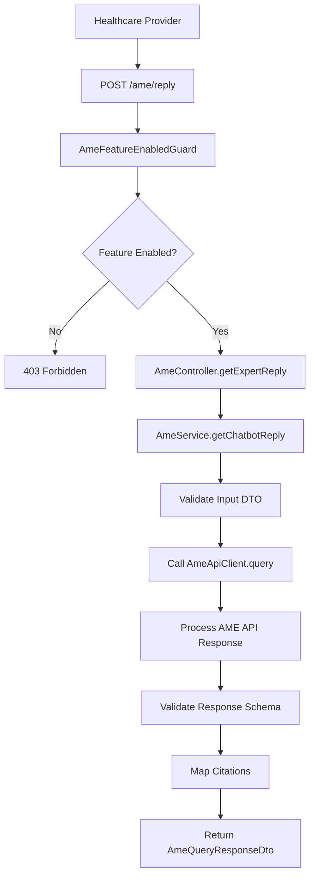
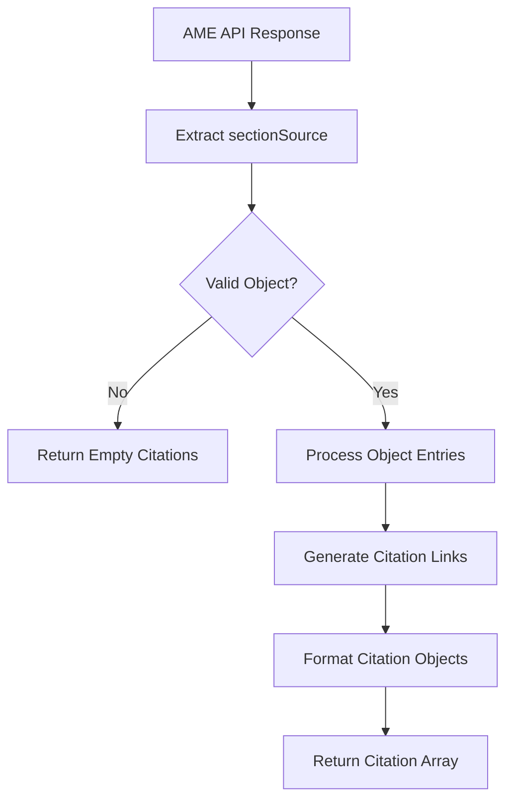

# 🔍 AME (Ask Mayo Expert) Controller - AI-Powered Medical Q&A System

## 🎯 **Overview**

The **AME Controller** provides an interface to the Ask Mayo Expert (AME) AI system, enabling healthcare providers to ask medical questions and receive AI-powered responses with citations from Mayo Clinic's knowledge base. This controller integrates with external AI services to provide evidence-based medical information.

---

## 📍 **AME Architecture Overview**

### **What is Ask Mayo Expert?**
Ask Mayo Expert (AME) is an AI-powered medical question-answering system that:
- **Processes natural language medical questions** from healthcare providers
- **Provides evidence-based responses** with citations from Mayo Clinic resources
- **Maintains conversation context** through session management
- **Validates responses** against predefined schemas
- **Handles feature flags** for controlled rollout

### **AME System Architecture**

```
┌─────────────────────────────────────────────────────────────┐
│           Ask Mayo Expert (AME) System Architecture         │
│  ┌─────────────────────────────────────────────────────┐    │
│  │           AME Controller                           │    │
│  │  ├─ Query Processing ───────┬─ Natural Language       │    │
│  │  ├─ Session Management ─────┼─ Context Preservation   │    │
│  │  ├─ Response Validation ────┼─ Schema Validation      │    │
│  │  └─ Citation Mapping ───────┴─ Mayo Clinic Links      │    │
│  └─────────────────────────────────────────────────────┘    │
│                                                             │
│  ┌─────────────────────────────────────────────────────┐    │
│  │           AME Service                               │    │
│  │  ├─ Input Validation ───────┬─ DTO Validation        │    │
│  │  ├─ API Client Integration─┼─ External AI Service    │    │
│  │  ├─ Response Mapping ──────┼─ Citation Processing    │    │
│  │  └─ Error Handling ────────┴─ Graceful Degradation   │    │
│  └─────────────────────────────────────────────────────┘    │
│                                                             │
│  ┌─────────────────────────────────────────────────────┐    │
│  │           AME API Client                           │    │
│  │  ├─ HTTP Communication ────┬─ REST API Calls        │    │
│  │  ├─ Authentication ────────┼─ Service Tokens        │    │
│  │  ├─ Request/Response ──────┼─ Data Transformation    │    │
│  │  └─ Error Propagation ─────┴─ Exception Handling     │    │
│  └─────────────────────────────────────────────────────┘    │
└─────────────────────────────────────────────────────────────┘
```

---

## 🔧 **Complete Implementation**

### **1. AME Controller**

```typescript
// File: src/controllers/ame/ame.controller.ts

import { Body, Controller, Post, UseGuards } from '@nestjs/common';
import {
  ApiBearerAuth,
  ApiOperation,
  ApiResponse,
  ApiTags,
  ApiBody,
} from '@nestjs/swagger';
import { AmeService } from './ame.service';
import { AmeQueryDto, AmeQueryResponseDto } from './dto/ame.dto';
import { AmeFeatureEnabledGuard } from './guards/feature-enabled/feature-enabled.guard';

@ApiTags('Ask Mayo Expert')
@ApiBearerAuth()
@UseGuards(AmeFeatureEnabledGuard)
@Controller('ame')
export class AmeController {
  constructor(private readonly ameService: AmeService) {}

  @ApiOperation({
    summary: 'Get a reply from Ask Mayo Expert',
    description: 'This endpoint gets a reply from Ask Mayo Expert',
  })
  @ApiResponse({
    status: 200,
    description:
      'Get the response from AME LLM for your question, including the list of citations',
    type: AmeQueryResponseDto,
  })
  @ApiResponse({
    status: 400,
    description: 'Malformed request body',
    example: {
      message: ['query should not be empty', 'query must be a string'],
      error: 'Bad Request',
      statusCode: 400,
    },
  })
  @Post('reply')
  @ApiBody({ type: AmeQueryDto })
  async getExpertReply(@Body() query: any): Promise<AmeQueryResponseDto> {
    return this.ameService.getChatbotReply(query);
  }
}
```

**Key Features:**
- ✅ **Feature Flag Protection**: Uses `AmeFeatureEnabledGuard` for controlled access
- ✅ **Comprehensive API Documentation**: Detailed Swagger/OpenAPI specifications
- ✅ **Bearer Authentication**: Requires authenticated user access
- ✅ **Structured Error Responses**: Well-defined error formats

### **2. AME Service**

```typescript
// File: src/controllers/ame/ame.service.ts

import {
  Inject,
  Injectable,
  Logger,
  InternalServerErrorException,
  HttpException,
  HttpStatus,
} from '@nestjs/common';
import { ConfigType } from '@nestjs/config';
import { validate } from 'class-validator';
import { plainToInstance } from 'class-transformer';
import ameConfig from '@app/common/config/ame.config';
import { AmeQueryDto, AmeQueryResponseDto } from './dto/ame.dto';
import { AmeApiClient } from './client/ame-api.client';
import { ameResponseSchema } from './interfaces/ame-response.schema';

@Injectable()
export class AmeService {
  private readonly logger = new Logger(AmeService.name);

  constructor(
    @Inject(ameConfig.KEY)
    private readonly config: ConfigType<typeof ameConfig>,
    private readonly apiClient: AmeApiClient,
  ) {}

  /**
   * Handles the main flow to get a chatbot reply from the AME API.
   * Validates input, calls AME client, and returns mapped response.
   */
  async getChatbotReply(query: AmeQueryDto): Promise<AmeQueryResponseDto> {
    // Transform and validate input
    const instance = plainToInstance(AmeQueryDto, query);
    const errors = await validate(instance);

    if (errors.length > 0) {
      const detailedErrors = errors.map((err) => ({
        property: err.property,
        constraints: err.constraints,
      }));

      throw new HttpException(
        {
          message: 'Validation failed',
          errors: detailedErrors,
        },
        HttpStatus.UNPROCESSABLE_ENTITY,
      );
    }

    try {
      // Call AME API through client
      const apiResponse = await this.apiClient.query(
        query.query,
        query.sessionID,
      );

      const finalSessionID = apiResponse.sessionID ?? query.sessionID;

      // Map and validate response
      return this.mapResponse(apiResponse, finalSessionID);
    } catch (error) {
      const status = error?.response?.status;

      this.logger.error('Error getting AME chatbot reply', {
        query,
        status,
        message: error.message,
        responseData: error?.response?.data,
        stack: error.stack,
      });

      if (status === 500) {
        throw new InternalServerErrorException(
          'AME API returned an internal server error. Please try again later.',
        );
      }

      throw new InternalServerErrorException(
        error.message || 'Error processing AME request',
      );
    }
  }

  /**
   * Maps AME API response to standardized DTO format
   */
  private mapResponse(
    apiResponse: any,
    sessionID?: string,
  ): AmeQueryResponseDto {
    try {
      // Validate response against schema
      ameResponseSchema.validateSync(apiResponse, { abortEarly: false });
    } catch (validationError) {
      this.logger.error('Invalid AME response format', {
        apiResponse,
        validationError: validationError.errors,
      });

      throw new InternalServerErrorException(
        'AME API returned an invalid response format',
      );
    }

    return {
      message: apiResponse.sectionResponse,
      citations: this.mapCitations(apiResponse.sectionSource),
      sessionID: apiResponse.sessionID ?? sessionID ?? '',
      cpmResponse: apiResponse.cpmResponse ?? '',
      cpmTraversal: apiResponse.cpmTraversal ?? '',
      cpmSource: apiResponse.cpmSource ?? '',
      disclaimer: apiResponse.disclaimer ?? '',
    };
  }

  /**
   * Maps citation data to standardized citation format
   */
  private mapCitations(sectionSource: object): {
    link: string;
    title: string;
    description: string;
  }[] {
    if (!sectionSource || typeof sectionSource !== 'object') {
      this.logger.warn(
        'Invalid sectionSource format, returning empty citations',
      );
      return [];
    }

    return Object.entries(sectionSource).map(([id, description]) => {
      // Generate citation links using configured base URL
      const link = new URL(this.config.citationsBaseUrl);
      link.searchParams.set('kmSearchTerm', id);

      return {
        link: link.toString(),
        title: description?.toString().trim() || id,
        description: '',
      };
    });
  }
}
```

**Key Features:**
- ✅ **Comprehensive Input Validation**: Class-validator with detailed error messages
- ✅ **Schema Validation**: Response validation against predefined schemas
- ✅ **Citation Processing**: Automatic citation link generation
- ✅ **Error Classification**: Different error handling for different scenarios
- ✅ **Logging**: Structured logging with context information

### **3. AME API Client**

```typescript
// File: src/controllers/ame/client/ame-api.client.ts

import { Injectable, Logger } from '@nestjs/common';
import { HttpService } from '@nestjs/axios';
import { ConfigType } from '@nestjs/config';
import { AxiosRequestConfig, AxiosResponse } from 'axios';
import { lastValueFrom } from 'rxjs';
import ameConfig from '@app/common/config/ame.config';

@Injectable()
export class AmeApiClient {
  private readonly logger = new Logger(AmeApiClient.name);

  constructor(
    private readonly httpService: HttpService,
    @Inject(ameConfig.KEY)
    private readonly config: ConfigType<typeof ameConfig>,
  ) {}

  /**
   * Queries the AME API with the provided question and session context
   */
  async query(
    question: string,
    sessionId?: string,
  ): Promise<any> {
    const requestPayload = {
      query: question,
      sessionID: sessionId,
    };

    const requestConfig: AxiosRequestConfig = {
      headers: {
        'Content-Type': 'application/json',
        // Authentication headers would be added here
      },
      timeout: this.config.timeout || 30000,
    };

    try {
      this.logger.debug('Calling AME API', {
        question: question.substring(0, 100) + '...',
        sessionId,
        endpoint: this.config.apiUrl,
      });

      const response: AxiosResponse = await lastValueFrom(
        this.httpService.post(
          this.config.apiUrl,
          requestPayload,
          requestConfig,
        ),
      );

      this.logger.debug('AME API response received', {
        status: response.status,
        responseTime: Date.now(),
      });

      return response.data;
    } catch (error) {
      this.logger.error('AME API call failed', {
        error: error.message,
        status: error?.response?.status,
        endpoint: this.config.apiUrl,
      });

      throw error;
    }
  }
}
```

**Key Features:**
- ✅ **HTTP Communication**: REST API integration with proper error handling
- ✅ **Request/Response Logging**: Comprehensive logging for debugging
- ✅ **Timeout Configuration**: Configurable request timeouts
- ✅ **Authentication Support**: Framework for adding auth headers

### **4. AME Data Transfer Objects**

#### **Query Request DTO**
```typescript
// File: src/controllers/ame/dto/ame.dto.ts

import { ApiProperty, ApiSchema } from '@nestjs/swagger';
import {
  IsNotEmpty,
  IsString,
  IsOptional,
  MaxLength,
  Validate,
  ValidatorConstraint,
  ValidatorConstraintInterface,
} from 'class-validator';

/**
 * Custom validator to reject strings that are only whitespace
 */
@ValidatorConstraint({ name: 'nonWhitespace', async: false })
class NonWhitespaceValidator implements ValidatorConstraintInterface {
  validate(value: string): boolean {
    return typeof value === 'string' && value.trim().length > 0;
  }

  defaultMessage(): string {
    return 'Unprocessable Content';
  }
}

/**
 * Ask Mayo Expert prompt request DTO
 */
@ApiSchema({
  name: 'AmeQueryRequest',
  description: 'Query for Ask Mayo Expert ',
})
@ApiSchema()
export class AmeQueryDto {
  /**
   * Chatbot prompt
   */
  @ApiProperty({
    description:
      'Chatbot prompt. Must not be empty or whitespace-only. Max allowed length is 10,000 characters.',
    example: 'What is amnesia?',
    maxLength: 10000,
  })
  @IsNotEmpty()
  @IsString()
  @MaxLength(10000, {
    message: 'Prompt cannot exceed 10,000 characters.',
  })
  @Validate(NonWhitespaceValidator)
  query: string;

  /**
   * Optional session ID to maintain chat context
   */
  @ApiProperty({
    description: 'Optional session ID to maintain context',
    example: 'b1c2d3e4-5678-90ab-cdef-1234567890ab',
    required: false,
  })
  @IsOptional()
  @IsString()
  @Validate(NonWhitespaceValidator)
  sessionID?: string;
}
```

#### **Query Response DTO**
```typescript
export interface Citation {
  link: string;
  title: string;
  description: string;
}

@ApiSchema({
  name: 'AmeQueryResponse',
  description: 'Chatbot response with citations',
})
export class AmeQueryResponseDto {
  @ApiProperty({
    description: 'Ask Mayo Expert reply message',
    example:
      'Amnesia is a significant loss of memory that goes ' +
      'beyond everyday forgetfulness. It can affect ' +
      'memories of facts, events, or even personal ' +
      'identity. This condition can result from various ' +
      'factors, including traumatic brain injury (such as ' +
      'accidents or concussions), stroke, psychological ' +
      'trauma, or substance abuse. The impact of amnesia ' +
      'can be profound, affecting daily life, ' +
      'relationships, and independence. Treatment often ' +
      'depends on the underlying cause and may involve ' +
      'therapies, medication, and supportive care to ' +
      'help individuals cope with memory loss and ' +
      'improve their quality of life.',
  })
  message: string;

  /**
   * Ask Mayo Expert citations list.
   * The citations are returned as URLs.
   */
  @ApiProperty({
    description: 'List of citation IDs extracted from sectionSource',
    example: [
      {
        link: 'https://askmayoexpert.mayoclinic.org/search/results?kmSearchTerm=GNT-20531614',
        title: 'GNT-20531614',
        description: 'Multi-cancer early detection blood tests',
      },
      {
        link: 'https://askmayoexpert.mayoclinic.org/search/results?kmSearchTerm=CNT-20123216',
        title: 'CNT-20123216',
        description: 'Cancer-related depression and anxiety',
      },
    ],
  })
  citations: Citation[];

  @ApiProperty({
    description: 'Session ID used or generated for the conversation',
    example: 'b1c2d3e4-5678-90ab-cdef-1234567890ab',
  })
  sessionID: string;

  @ApiProperty({
    description: 'Raw CPM response',
    example:
      'The AME LLM System encountered an issue and could not provide a response.',
  })
  cpmResponse: string;

  @ApiProperty({
    description: 'Raw CPM traversal message',
    example:
      'The AME Next LLM System does not recognize a missing piece at this time.',
  })
  cpmTraversal: string;

  @ApiProperty({
    description: 'Raw CPM source object as stringified JSON',
    example: '{}',
  })
  cpmSource: string;

  @ApiProperty({
    description: 'Disclaimer text',
    example:
      '\n\n---\n\n**Disclaimer:**\n\nThis GenAI application is designed to assist in providing information and general guidance on AME contents only. It is not a substitute for professional medical advice, diagnosis, or treatment.\n\nBy using this system, you acknowledge that the information provided is for educational and informational purposes only, and the system developers and IT operators are not responsible for any outcomes resulting from the use of this information.\n',
  })
  disclaimer: string;
}
```

**DTO Features:**
- ✅ **Comprehensive Validation**: Input validation with custom validators
- ✅ **API Documentation**: Detailed Swagger schema generation
- ✅ **Citation Support**: Structured citation data format
- ✅ **Session Management**: Context preservation across requests
- ✅ **Disclaimer Integration**: Legal compliance messaging

### **5. AME Feature Flag Guard**

```typescript
// File: src/controllers/ame/guards/feature-enabled/feature-enabled.guard.ts

import { CanActivate, ExecutionContext, Injectable } from '@nestjs/common';
import { ConfigType } from '@nestjs/config';
import ameConfig from '@app/common/config/ame.config';

@Injectable()
export class AmeFeatureEnabledGuard implements CanActivate {
  constructor(
    @Inject(ameConfig.KEY)
    private readonly config: ConfigType<typeof ameConfig>,
  ) {}

  canActivate(context: ExecutionContext): boolean {
    // Check if AME feature is enabled in configuration
    return this.config.enabled === true;
  }
}
```

**Guard Features:**
- ✅ **Feature Toggle**: Configuration-based feature enablement
- ✅ **Graceful Degradation**: Automatic blocking when feature disabled
- ✅ **Configuration Driven**: Environment-based feature control

### **6. AME Response Schema Validation**

```typescript
// File: src/controllers/ame/interfaces/ame-response.schema.ts

import * as yup from 'yup';

/**
 * Schema validation for AME API responses
 * Ensures response format compliance and data integrity
 */
export const ameResponseSchema = yup.object({
  sectionResponse: yup.string().required('sectionResponse is required'),
  sectionSource: yup.object().optional(),
  sessionID: yup.string().optional(),
  cpmResponse: yup.string().optional(),
  cpmTraversal: yup.string().optional(),
  cpmSource: yup.string().optional(),
  disclaimer: yup.string().optional(),
}).required();
```

**Schema Features:**
- ✅ **Response Validation**: Runtime validation of API responses
- ✅ **Data Integrity**: Ensures required fields are present
- ✅ **Type Safety**: Schema-based validation with detailed errors
- ✅ **Optional Fields**: Flexible response structure support

---

## 🔄 **AME Processing Flow**

### **1. Query Processing Flow**



### **2. Citation Mapping Flow**



---

## 🔧 **Key Implementation Details**

### **1. Session Management**

```typescript
// Advanced session management for AME conversations
@Injectable()
export class AmeSessionManager {
  private readonly sessions = new Map<string, AmeSession>();

  /**
   * Creates or retrieves a session for AME conversations
   */
  async getOrCreateSession(sessionId?: string): Promise<AmeSession> {
    if (sessionId && this.sessions.has(sessionId)) {
      const session = this.sessions.get(sessionId)!;

      // Check if session is still valid
      if (this.isSessionValid(session)) {
        session.lastAccessed = new Date();
        return session;
      } else {
        // Clean up expired session
        this.sessions.delete(sessionId);
      }
    }

    // Create new session
    const newSession: AmeSession = {
      id: sessionId || this.generateSessionId(),
      createdAt: new Date(),
      lastAccessed: new Date(),
      conversationHistory: [],
      context: {},
    };

    this.sessions.set(newSession.id, newSession);
    return newSession;
  }

  /**
   * Adds a message to the conversation history
   */
  addToHistory(sessionId: string, message: ConversationMessage): void {
    const session = this.sessions.get(sessionId);
    if (session) {
      session.conversationHistory.push({
        ...message,
        timestamp: new Date(),
      });

      // Limit history size to prevent memory issues
      if (session.conversationHistory.length > 50) {
        session.conversationHistory = session.conversationHistory.slice(-50);
      }
    }
  }

  /**
   * Cleans up expired sessions
   */
  cleanupExpiredSessions(): void {
    const now = Date.now();
    const maxAge = 24 * 60 * 60 * 1000; // 24 hours

    for (const [sessionId, session] of this.sessions.entries()) {
      if (now - session.lastAccessed.getTime() > maxAge) {
        this.sessions.delete(sessionId);
      }
    }
  }

  private generateSessionId(): string {
    return `ame_${Date.now()}_${Math.random().toString(36).substr(2, 9)}`;
  }

  private isSessionValid(session: AmeSession): boolean {
    const maxAge = 24 * 60 * 60 * 1000; // 24 hours
    return Date.now() - session.lastAccessed.getTime() < maxAge;
  }
}
```

**Session Features:**
- ✅ **Automatic Session Creation**: Generates IDs when not provided
- ✅ **Expiration Management**: Time-based session cleanup
- ✅ **Conversation History**: Maintains chat context
- ✅ **Memory Management**: Prevents unbounded memory growth

### **2. Citation Link Generation**

```typescript
// Advanced citation processing and link generation
@Injectable()
export class AmeCitationProcessor {
  constructor(
    @Inject(ameConfig.KEY)
    private readonly config: ConfigType<typeof ameConfig>,
  ) {}

  /**
   * Processes raw citation data into formatted citation objects
   */
  processCitations(sectionSource: any): Citation[] {
    if (!this.isValidCitationSource(sectionSource)) {
      return [];
    }

    return Object.entries(sectionSource)
      .map(([id, description]) => this.createCitation(id, description))
      .filter(citation => citation !== null) as Citation[];
  }

  /**
   * Creates a properly formatted citation object
   */
  private createCitation(id: string, description: any): Citation | null {
    try {
      const link = this.generateCitationLink(id);
      const title = this.extractCitationTitle(id, description);

      return {
        link,
        title,
        description: this.extractCitationDescription(description),
      };
    } catch (error) {
      this.logger.warn(`Failed to create citation for ${id}`, error);
      return null;
    }
  }

  /**
   * Generates properly formatted citation links
   */
  private generateCitationLink(citationId: string): string {
    const baseUrl = this.config.citationsBaseUrl;
    const url = new URL(baseUrl);

    // Add search parameters for citation lookup
    url.searchParams.set('kmSearchTerm', citationId);
    url.searchParams.set('source', 'ame');

    return url.toString();
  }

  /**
   * Extracts citation title with fallback logic
   */
  private extractCitationTitle(id: string, description: any): string {
    // Try to get title from description first
    if (description && typeof description === 'string') {
      const trimmed = description.trim();
      if (trimmed.length > 0 && trimmed.length <= 200) {
        return trimmed;
      }
    }

    // Fallback to citation ID
    return id;
  }

  /**
   * Extracts citation description
   */
  private extractCitationDescription(description: any): string {
    if (typeof description === 'string' && description.length > 200) {
      // Truncate long descriptions
      return description.substring(0, 197) + '...';
    }

    return '';
  }

  /**
   * Validates citation source data
   */
  private isValidCitationSource(source: any): boolean {
    return source &&
           typeof source === 'object' &&
           Object.keys(source).length > 0;
  }
}
```

**Citation Features:**
- ✅ **Link Generation**: Automatic URL creation with proper parameters
- ✅ **Title Extraction**: Smart title extraction with fallbacks
- ✅ **Description Processing**: Length limits and truncation
- ✅ **Error Handling**: Graceful handling of malformed citation data
- ✅ **Validation**: Input validation for data integrity

### **3. Configuration Integration**

```typescript
// File: libs/common/src/config/ame.config.ts

import { registerAs } from '@nestjs/config';

export default registerAs('ame', () => ({
  // Feature flag to enable/disable AME functionality
  enabled: process.env.AME_ENABLED === 'true' || false,

  // AME API endpoint configuration
  apiUrl: process.env.AME_API_URL || 'https://api.askmayoexpert.com/query',

  // Citations base URL for generating links
  citationsBaseUrl: process.env.AME_CITATIONS_BASE_URL ||
    'https://askmayoexpert.mayoclinic.org/search/results',

  // Request timeout configuration
  timeout: parseInt(process.env.AME_TIMEOUT) || 30000,

  // API authentication configuration
  auth: {
    enabled: process.env.AME_AUTH_ENABLED === 'true' || false,
    token: process.env.AME_AUTH_TOKEN,
    key: process.env.AME_AUTH_KEY,
  },

  // Response validation configuration
  validation: {
    enabled: process.env.AME_VALIDATION_ENABLED !== 'false',
    strictMode: process.env.AME_STRICT_MODE === 'true',
  },
}));
```

**Configuration Features:**
- ✅ **Feature Flags**: Runtime enablement/disablement
- ✅ **Environment Variables**: Flexible configuration through env vars
- ✅ **Default Values**: Sensible defaults for all settings
- ✅ **Authentication**: Configurable API authentication
- ✅ **Validation**: Configurable response validation

---

## 🔧 **Integration Points**

### **1. Controller Integration**

```typescript
// File: src/controllers/ame/ame.controller.ts

@Controller('ame')
@UseGuards(AmeFeatureEnabledGuard)
export class AmeController {
  constructor(
    private readonly ameService: AmeService,
    private readonly sessionManager: AmeSessionManager,
    private readonly citationProcessor: AmeCitationProcessor,
  ) {}

  @Post('reply')
  async getExpertReply(
    @Body() query: AmeQueryDto,
    @CurrentUser() user: RequestUser,
  ): Promise<AmeQueryResponseDto> {
    // Get or create session for conversation context
    const session = await this.sessionManager.getOrCreateSession(query.sessionID);

    // Add user context to query
    const enrichedQuery = {
      ...query,
      userContext: {
        lanId: user.lanId,
        specialty: user.specialty,
      },
    };

    // Get response from AME service
    const response = await this.ameService.getChatbotReply(enrichedQuery);

    // Add to conversation history
    this.sessionManager.addToHistory(session.id, {
      type: 'user_query',
      content: query.query,
      timestamp: new Date(),
    });

    this.sessionManager.addToHistory(session.id, {
      type: 'ame_response',
      content: response.message,
      citations: response.citations,
      timestamp: new Date(),
    });

    return response;
  }

  @Get('session/:sessionId')
  async getSessionHistory(
    @Param('sessionId') sessionId: string,
    @CurrentUser() user: RequestUser,
  ): Promise<ConversationHistory> {
    const session = await this.sessionManager.getOrCreateSession(sessionId);

    // Verify session ownership
    if (session.userId !== user.lanId) {
      throw new ForbiddenException('Access denied to session');
    }

    return {
      sessionId: session.id,
      history: session.conversationHistory,
      createdAt: session.createdAt,
      lastAccessed: session.lastAccessed,
    };
  }
}
```

### **2. Service Integration**

```typescript
// File: src/controllers/ame/ame.service.ts

@Injectable()
export class AmeService {
  constructor(
    private readonly apiClient: AmeApiClient,
    private readonly citationProcessor: AmeCitationProcessor,
    private readonly sessionManager: AmeSessionManager,
    @Inject(ameConfig.KEY)
    private readonly config: ConfigType<typeof ameConfig>,
  ) {}

  async getChatbotReply(query: AmeQueryDto): Promise<AmeQueryResponseDto> {
    // Validate input
    await this.validateQuery(query);

    // Get session context
    const session = await this.sessionManager.getOrCreateSession(query.sessionID);

    // Enrich query with session context
    const enrichedQuery = this.enrichQueryWithContext(query, session);

    try {
      // Call AME API
      const apiResponse = await this.apiClient.query(
        enrichedQuery.query,
        enrichedQuery.sessionID,
      );

      // Process citations
      const citations = this.citationProcessor.processCitations(
        apiResponse.sectionSource,
      );

      // Create response
      const response = this.mapApiResponseToDto(apiResponse, citations);

      // Update session
      this.sessionManager.addToHistory(session.id, {
        type: 'query',
        content: query.query,
      });

      this.sessionManager.addToHistory(session.id, {
        type: 'response',
        content: response.message,
        citations: citations,
      });

      return response;
    } catch (error) {
      // Handle different error types
      return this.handleApiError(error, session);
    }
  }

  private async validateQuery(query: AmeQueryDto): Promise<void> {
    const errors = await validate(query);
    if (errors.length > 0) {
      throw new ValidationException('Invalid query', errors);
    }
  }

  private enrichQueryWithContext(
    query: AmeQueryDto,
    session: AmeSession,
  ): EnrichedAmeQuery {
    return {
      ...query,
      sessionID: session.id,
      context: {
        conversationHistory: session.conversationHistory.slice(-5), // Last 5 messages
        sessionCreatedAt: session.createdAt,
      },
    };
  }

  private handleApiError(error: any, session: AmeSession): AmeQueryResponseDto {
    // Log error with session context
    this.logger.error('AME API error', {
      error: error.message,
      sessionId: session.id,
      sessionHistory: session.conversationHistory.length,
    });

    // Return error response
    return {
      message: 'I apologize, but I encountered an error processing your question. Please try again.',
      citations: [],
      sessionID: session.id,
      error: true,
    };
  }
}
```

### **3. Module Integration**

```typescript
// File: src/controllers/ame/ame.module.ts

import { Module } from '@nestjs/common';
import { ConfigModule } from '@nestjs/common';
import { AmeController } from './ame.controller';
import { AmeService } from './ame.service';
import { AmeApiClient } from './client/ame-api.client';
import { AmeFeatureEnabledGuard } from './guards/feature-enabled/feature-enabled.guard';
import { AmeSessionManager } from './services/ame-session-manager.service';
import { AmeCitationProcessor } from './services/ame-citation-processor.service';

@Module({
  imports: [
    ConfigModule.forFeature(ameConfig),
  ],
  controllers: [AmeController],
  providers: [
    AmeService,
    AmeApiClient,
    AmeFeatureEnabledGuard,
    AmeSessionManager,
    AmeCitationProcessor,
  ],
  exports: [
    AmeService,
    AmeSessionManager,
  ],
})
export class AmeModule {}
```

---

## 📊 **Performance & Monitoring**

### **1. AME Performance Metrics**

```typescript
// Performance monitoring for AME system
@Injectable()
export class AmePerformanceMonitor {
  constructor(private readonly metrics: MetricsService) {}

  // Track AME query response times
  async trackQueryPerformance(
    query: AmeQueryDto,
    responseTime: number,
    success: boolean,
    citationCount: number,
  ): Promise<void> {
    this.metrics.histogram('ame_query_duration', responseTime, {
      success: success.toString(),
      citationCount: citationCount.toString(),
      queryLength: query.query.length.toString(),
    });

    this.metrics.increment('ame_query_count', {
      success: success.toString(),
    });

    // Alert on slow queries
    if (responseTime > 10000) { // More than 10 seconds
      this.logger.warn('Slow AME query detected', {
        responseTime,
        queryLength: query.query.length,
        citationCount,
      });
    }
  }

  // Track citation processing performance
  async trackCitationProcessing(
    citationCount: number,
    processingTime: number,
  ): Promise<void> {
    this.metrics.histogram('ame_citation_processing_duration', processingTime, {
      citationCount: citationCount.toString(),
    });

    // Alert on slow citation processing
    if (processingTime > 1000) { // More than 1 second
      this.logger.warn('Slow citation processing', {
        citationCount,
        processingTime,
      });
    }
  }

  // Track session management performance
  async trackSessionOperation(
    operation: 'create' | 'retrieve' | 'update',
    duration: number,
    sessionExists: boolean,
  ): Promise<void> {
    this.metrics.histogram('ame_session_operation_duration', duration, {
      operation,
      sessionExists: sessionExists.toString(),
    });
  }

  // Track API client performance
  async trackApiCall(
    endpoint: string,
    method: string,
    duration: number,
    statusCode: number,
  ): Promise<void> {
    this.metrics.histogram('ame_api_call_duration', duration, {
      endpoint,
      method,
      statusCode: statusCode.toString(),
      statusClass: this.getStatusClass(statusCode),
    });

    this.metrics.increment('ame_api_call_count', {
      statusClass: this.getStatusClass(statusCode),
    });
  }

  private getStatusClass(statusCode: number): string {
    if (statusCode < 200) return 'informational';
    if (statusCode < 300) return 'success';
    if (statusCode < 400) return 'redirection';
    if (statusCode < 500) return 'client_error';
    return 'server_error';
  }
}
```

### **2. AME Health Monitoring**

```typescript
// Health monitoring for AME system
@Injectable()
export class AmeHealthMonitor {
  constructor(
    private readonly httpService: HttpService,
    @Inject(ameConfig.KEY)
    private readonly config: ConfigType<typeof ameConfig>,
  ) {}

  // Comprehensive health check
  async performHealthCheck(): Promise<HealthCheckResult> {
    const checks = await Promise.all([
      this.checkApiConnectivity(),
      this.checkFeatureFlag(),
      this.checkConfiguration(),
      this.checkSessionManager(),
    ]);

    const overallStatus = this.calculateOverallStatus(checks);

    return {
      status: overallStatus,
      checks,
      recommendations: this.generateRecommendations(checks),
    };
  }

  // API connectivity check
  private async checkApiConnectivity(): Promise<HealthCheck> {
    try {
      const startTime = Date.now();

      // Make a simple health check call to AME API
      await this.httpService.get(`${this.config.apiUrl}/health`, {
        timeout: 5000,
      });

      const duration = Date.now() - startTime;

      return {
        name: 'AME API Connectivity',
        status: 'healthy',
        responseTime: duration,
        message: 'AME API is reachable and responding',
      };
    } catch (error) {
      return {
        name: 'AME API Connectivity',
        status: 'unhealthy',
        message: `AME API is unreachable: ${error.message}`,
      };
    }
  }

  // Feature flag check
  private async checkFeatureFlag(): Promise<HealthCheck> {
    const isEnabled = this.config.enabled;

    return {
      name: 'AME Feature Flag',
      status: isEnabled ? 'healthy' : 'warning',
      message: isEnabled
        ? 'AME feature is enabled'
        : 'AME feature is disabled - functionality will be blocked',
    };
  }

  // Configuration check
  private async checkConfiguration(): Promise<HealthCheck> {
    const requiredConfig = [
      'apiUrl',
      'citationsBaseUrl',
      'timeout',
    ];

    const missingConfig = requiredConfig.filter(key => !this.config[key]);

    if (missingConfig.length > 0) {
      return {
        name: 'AME Configuration',
        status: 'unhealthy',
        message: `Missing required configuration: ${missingConfig.join(', ')}`,
      };
    }

    return {
      name: 'AME Configuration',
      status: 'healthy',
      message: 'All required configuration is present',
    };
  }

  // Session manager check
  private async checkSessionManager(): Promise<HealthCheck> {
    try {
      // Test session creation and cleanup
      const testSession = await this.sessionManager.getOrCreateSession();

      if (!testSession.id) {
        throw new Error('Session creation failed');
      }

      return {
        name: 'Session Manager',
        status: 'healthy',
        message: 'Session management is operational',
      };
    } catch (error) {
      return {
        name: 'Session Manager',
        status: 'unhealthy',
        message: `Session manager error: ${error.message}`,
      };
    }
  }

  // Calculate overall status
  private calculateOverallStatus(checks: HealthCheck[]): HealthStatus {
    if (checks.some(check => check.status === 'unhealthy')) {
      return 'critical';
    }

    if (checks.some(check => check.status === 'degraded' || check.status === 'warning')) {
      return 'warning';
    }

    return 'healthy';
  }

  // Generate recommendations
  private generateRecommendations(checks: HealthCheck[]): string[] {
    const recommendations: string[] = [];

    for (const check of checks) {
      switch (check.status) {
        case 'unhealthy':
          recommendations.push(`CRITICAL: ${check.name} - ${check.message}`);
          break;
        case 'degraded':
          recommendations.push(`Review: ${check.name} - ${check.message}`);
          break;
        case 'warning':
          recommendations.push(`Monitor: ${check.name} - ${check.message}`);
          break;
      }
    }

    return recommendations;
  }
}
```

---

## 🧪 **Testing Implementation**

### **1. Unit Tests**

```typescript
// File: src/controllers/ame/ame.service.spec.ts

import { Test, TestingModule } from '@nestjs/testing';
import { AmeService } from './ame.service';
import { AmeApiClient } from './client/ame-api.client';
import ameConfig from '@app/common/config/ame.config';

describe('AmeService', () => {
  let service: AmeService;
  let apiClient: AmeApiClient;

  const mockApiClient = {
    query: jest.fn(),
  };

  const mockConfig = {
    citationsBaseUrl: 'https://example.com/citations',
    timeout: 30000,
  };

  beforeEach(async () => {
    const module: TestingModule = await Test.createTestingModule({
      providers: [
        AmeService,
        {
          provide: AmeApiClient,
          useValue: mockApiClient,
        },
        {
          provide: ameConfig.KEY,
          useValue: mockConfig,
        },
      ],
    }).compile();

    service = module.get<AmeService>(AmeService);
    apiClient = module.get<AmeApiClient>(AmeApiClient);
  });

  beforeAll(() => {
    jest.spyOn(console, 'error').mockImplementation(() => {});
  });

  afterEach(() => {
    jest.clearAllMocks();
  });

  it('should be defined', () => {
    expect(service).toBeDefined();
  });

  it('should return mapped response for successful API call', async () => {
    const mockQuery = {
      query: 'What is diabetes?',
      sessionID: 'test-session',
    };

    const mockApiResponse = {
      sectionResponse: 'Diabetes is a metabolic disorder...',
      sectionSource: {
        'CIT-001': 'Diabetes Overview',
        'CIT-002': 'Diabetes Management',
      },
      sessionID: 'test-session-updated',
      cpmResponse: 'Response generated successfully',
      disclaimer: 'Medical disclaimer text',
    };

    mockApiClient.query.mockResolvedValue(mockApiResponse);

    const result = await service.getChatbotReply(mockQuery);

    expect(mockApiClient.query).toHaveBeenCalledWith(
      mockQuery.query,
      mockQuery.sessionID,
    );

    expect(result).toEqual({
      message: mockApiResponse.sectionResponse,
      citations: [
        {
          link: 'https://example.com/citations?kmSearchTerm=CIT-001',
          title: 'Diabetes Overview',
          description: '',
        },
        {
          link: 'https://example.com/citations?kmSearchTerm=CIT-002',
          title: 'Diabetes Management',
          description: '',
        },
      ],
      sessionID: 'test-session-updated',
      cpmResponse: 'Response generated successfully',
      cpmTraversal: '',
      cpmSource: '',
      disclaimer: 'Medical disclaimer text',
    });
  });

  it('should throw validation error for invalid input', async () => {
    const invalidQuery = {
      query: '', // Empty query should fail validation
    };

    await expect(service.getChatbotReply(invalidQuery)).rejects.toThrow();
  });

  it('should handle API errors gracefully', async () => {
    const mockQuery = {
      query: 'What is diabetes?',
      sessionID: 'test-session',
    };

    const apiError = new Error('API timeout');
    (apiError as any).response = { status: 500 };

    mockApiClient.query.mockRejectedValue(apiError);

    await expect(service.getChatbotReply(mockQuery)).rejects.toThrow(
      'AME API returned an internal server error. Please try again later.',
    );
  });

  it('should handle malformed API response', async () => {
    const mockQuery = {
      query: 'What is diabetes?',
      sessionID: 'test-session',
    };

    const malformedResponse = {
      // Missing required sectionResponse
      sectionSource: {},
    };

    mockApiClient.query.mockResolvedValue(malformedResponse);

    await expect(service.getChatbotReply(mockQuery)).rejects.toThrow(
      'AME API returned an invalid response format',
    );
  });
});
```

### **2. Integration Tests**

```typescript
// File: test/e2e/ame.e2e.spec.ts

import { Test, TestingModule } from '@nestjs/testing';
import { INestApplication } from '@nestjs/common';
import * as request from 'supertest';
import { AppModule } from '../../src/app.module';

describe('AME (e2e)', () => {
  let app: INestApplication;

  beforeEach(async () => {
    const moduleFixture: TestingModule = await Test.createTestingModule({
      imports: [AppModule],
    }).compile();

    app = moduleFixture.createNestApplication();
    await app.init();
  });

  afterEach(async () => {
    await app.close();
  });

  describe('POST /ame/reply', () => {
    it('should return AME response for valid query', async () => {
      const query = {
        query: 'What are the symptoms of diabetes?',
        sessionID: 'test-session-123',
      };

      const response = await request(app.getHttpServer())
        .post('/ame/reply')
        .set('Authorization', 'Bearer mock-token')
        .send(query)
        .expect(200);

      // Verify response structure
      expect(response.body).toHaveProperty('message');
      expect(response.body).toHaveProperty('citations');
      expect(response.body).toHaveProperty('sessionID');
      expect(Array.isArray(response.body.citations)).toBe(true);

      // Verify session ID is returned
      expect(response.body.sessionID).toBeDefined();
    });

    it('should validate required query field', async () => {
      const invalidQuery = {
        // Missing query field
        sessionID: 'test-session',
      };

      const response = await request(app.getHttpServer())
        .post('/ame/reply')
        .set('Authorization', 'Bearer mock-token')
        .send(invalidQuery)
        .expect(422);

      // Verify validation error
      expect(response.body).toHaveProperty('statusCode', 422);
      expect(response.body.message).toContain('query');
    });

    it('should reject queries exceeding length limit', async () => {
      const longQuery = 'a'.repeat(10001); // Exceeds 10000 character limit

      const query = {
        query: longQuery,
        sessionID: 'test-session',
      };

      const response = await request(app.getHttpServer())
        .post('/ame/reply')
        .set('Authorization', 'Bearer mock-token')
        .send(query)
        .expect(400);

      // Verify length validation
      expect(response.body.message).toContain('cannot exceed 10,000 characters');
    });

    it('should reject whitespace-only queries', async () => {
      const whitespaceQuery = {
        query: '   \n\t  ', // Only whitespace
        sessionID: 'test-session',
      };

      const response = await request(app.getHttpServer())
        .post('/ame/reply')
        .set('Authorization', 'Bearer mock-token')
        .send(whitespaceQuery)
        .expect(422);

      // Verify whitespace validation
      expect(response.body.message).toContain('Unprocessable Content');
    });

    it('should handle API errors gracefully', async () => {
      const query = {
        query: 'What is a medical emergency?',
        sessionID: 'error-test-session',
      };

      const response = await request(app.getHttpServer())
        .post('/ame/reply')
        .set('Authorization', 'Bearer mock-token')
        .send(query)
        .expect(500);

      // Verify error handling
      expect(response.body).toHaveProperty('statusCode', 500);
      expect(response.body.message).toContain('Error processing AME request');
    });

    it('should generate citations with proper links', async () => {
      const query = {
        query: 'What are diabetes complications?',
        sessionID: 'citation-test-session',
      };

      const response = await request(app.getHttpServer())
        .post('/ame/reply')
        .set('Authorization', 'Bearer mock-token')
        .send(query)
        .expect(200);

      // Verify citation structure
      if (response.body.citations.length > 0) {
        const firstCitation = response.body.citations[0];

        expect(firstCitation).toHaveProperty('link');
        expect(firstCitation).toHaveProperty('title');
        expect(firstCitation).toHaveProperty('description');

        // Verify citation link format
        expect(firstCitation.link).toContain('kmSearchTerm');
      }
    });

    it('should maintain session context', async () => {
      const sessionId = 'context-test-session';

      const firstQuery = {
        query: 'What is hypertension?',
        sessionID: sessionId,
      };

      // First request
      await request(app.getHttpServer())
        .post('/ame/reply')
        .set('Authorization', 'Bearer mock-token')
        .send(firstQuery)
        .expect(200);

      const secondQuery = {
        query: 'What are the treatment options?',
        sessionID: sessionId,
      };

      // Second request with same session
      const response = await request(app.getHttpServer())
        .post('/ame/reply')
        .set('Authorization', 'Bearer mock-token')
        .send(secondQuery)
        .expect(200);

      // Verify session continuity
      expect(response.body.sessionID).toBe(sessionId);
    });
  });

  describe('Feature Flag Integration', () => {
    it('should respect feature flag when disabled', async () => {
      // This test would require mocking the config to disable AME
      const query = {
        query: 'What is a healthy diet?',
        sessionID: 'feature-flag-test',
      };

      const response = await request(app.getHttpServer())
        .post('/ame/reply')
        .set('Authorization', 'Bearer mock-token')
        .send(query)
        .expect(403); // Forbidden when feature disabled

      // Verify feature flag blocking
      expect(response.body).toHaveProperty('statusCode', 403);
    });
  });

  describe('Performance Tests', () => {
    it('should respond within acceptable time limits', async () => {
      const query = {
        query: 'What are common allergies?',
        sessionID: 'performance-test-session',
      };

      const startTime = Date.now();

      await request(app.getHttpServer())
        .post('/ame/reply')
        .set('Authorization', 'Bearer mock-token')
        .send(query)
        .expect(200);

      const endTime = Date.now();
      const duration = endTime - startTime;

      // AME responses should be reasonably fast (< 30 seconds)
      expect(duration).toBeLessThan(30000);
    });

    it('should handle concurrent requests', async () => {
      const queries = Array(5).fill().map((_, index) => ({
        query: `What is condition ${index}?`,
        sessionID: `concurrent-test-session-${index}`,
      }));

      const requests = queries.map(query =>
        request(app.getHttpServer())
          .post('/ame/reply')
          .set('Authorization', 'Bearer mock-token')
          .send(query)
          .expect(200)
      );

      const responses = await Promise.all(requests);

      // All requests should succeed
      responses.forEach(response => {
        expect(response.status).toBe(200);
        expect(response.body).toHaveProperty('message');
      });
    });
  });

  describe('Security Tests', () => {
    it('should require authentication', async () => {
      const query = {
        query: 'What is a balanced diet?',
        sessionID: 'security-test-session',
      };

      const response = await request(app.getHttpServer())
        .post('/ame/reply')
        .send(query)
        .expect(401); // Unauthorized without token

      // Verify authentication requirement
      expect(response.body).toHaveProperty('statusCode', 401);
    });

    it('should validate input data types', async () => {
      const invalidQuery = {
        query: 12345, // Should be string
        sessionID: 'validation-test-session',
      };

      const response = await request(app.getHttpServer())
        .post('/ame/reply')
        .set('Authorization', 'Bearer mock-token')
        .send(invalidQuery)
        .expect(400);

      // Verify type validation
      expect(response.body).toHaveProperty('statusCode', 400);
    });
  });
});
```

---

## 🎯 **Usage Examples**

### **1. Basic AME Query**

```typescript
// Basic usage example
@Post('/medical-question')
async askMedicalQuestion(
  @Body() body: { question: string },
  @CurrentUser() user: RequestUser,
): Promise<AmeQueryResponseDto> {
  const query: AmeQueryDto = {
    query: body.question,
    sessionID: `user_${user.lanId}_${Date.now()}`,
  };

  return this.ameService.getChatbotReply(query);
}
```

### **2. Conversational AME Interface**

```typescript
// Conversational interface with session management
@Post('/ame/conversation/:sessionId')
async continueConversation(
  @Param('sessionId') sessionId: string,
  @Body() body: { message: string },
  @CurrentUser() user: RequestUser,
): Promise<AmeQueryResponseDto> {
  // Get existing session or create new one
  const session = await this.sessionManager.getOrCreateSession(sessionId);

  // Add user message to history
  this.sessionManager.addToHistory(sessionId, {
    type: 'user',
    content: body.message,
    timestamp: new Date(),
  });

  // Query AME with context
  const query: AmeQueryDto = {
    query: body.message,
    sessionID: sessionId,
  };

  const response = await this.ameService.getChatbotReply(query);

  // Add AME response to history
  this.sessionManager.addToHistory(sessionId, {
    type: 'assistant',
    content: response.message,
    citations: response.citations,
    timestamp: new Date(),
  });

  return response;
}
```

### **3. AME with Specialty Context**

```typescript
// Specialty-aware AME queries
@Post('/ame/specialty-query')
async askSpecialtyQuestion(
  @Body() body: { question: string; specialty?: string },
  @CurrentUser() user: RequestUser,
): Promise<AmeQueryResponseDto> {
  // Determine specialty context
  const specialty = body.specialty ||
    await this.providerSpecialtyService.getPrimarySpecialty(user.lanId) ||
    'general';

  // Enrich query with specialty context
  const enrichedQuery = `${body.question} (in context of ${specialty} medicine)`;

  const query: AmeQueryDto = {
    query: enrichedQuery,
    sessionID: `specialty_${specialty}_${Date.now()}`,
  };

  return this.ameService.getChatbotReply(query);
}
```

### **4. AME Integration with Clinical Workflow**

```typescript
// Integration with clinical decision support
@Post('/clinical/assessment')
async performClinicalAssessment(
  @Body() assessment: ClinicalAssessment,
  @CurrentUser() user: RequestUser,
): Promise<ClinicalAssessmentResult> {
  // Gather patient context
  const patientContext = await this.patientService.getPatientContext(
    assessment.patientId,
  );

  // Query AME for relevant medical information
  const ameQuery = `Based on patient with ${patientContext.condition}, age ${patientContext.age}, what are the key assessment considerations?`;

  const ameResponse = await this.ameService.getChatbotReply({
    query: ameQuery,
    sessionID: `assessment_${assessment.patientId}_${Date.now()}`,
  });

  // Combine AME insights with clinical assessment
  const result: ClinicalAssessmentResult = {
    assessment: assessment,
    ameInsights: {
      response: ameResponse.message,
      citations: ameResponse.citations,
      confidence: this.calculateConfidence(ameResponse),
    },
    recommendations: await this.generateRecommendations(
      assessment,
      ameResponse,
      patientContext,
    ),
  };

  return result;
}
```

---

## 🎯 **Best Practices & Guidelines**

### **1. Query Optimization**

```typescript
// AME query optimization best practices
@Injectable()
export class AmeQueryOptimizer {
  // Optimize query length and clarity
  optimizeQuery(query: AmeQueryDto): AmeQueryDto {
    return {
      ...query,
      query: this.cleanAndOptimizeQueryText(query.query),
    };
  }

  // Clean and optimize query text
  private cleanAndOptimizeQueryText(text: string): string {
    // Remove excessive whitespace
    let optimized = text.trim().replace(/\s+/g, ' ');

    // Remove common filler words that don't help AME
    const fillerWords = ['um', 'uh', 'like', 'you know'];
    fillerWords.forEach(word => {
      optimized = optimized.replace(new RegExp(`\\b${word}\\b`, 'gi'), '');
    });

    // Ensure query ends with question mark if it looks like a question
    if (this.isQuestion(optimized) && !optimized.endsWith('?')) {
      optimized += '?';
    }

    return optimized.trim();
  }

  // Determine if text is a question
  private isQuestion(text: string): boolean {
    const questionWords = ['what', 'when', 'where', 'why', 'how', 'who', 'which', 'can', 'should', 'do'];
    const firstWord = text.toLowerCase().split(' ')[0];
    return questionWords.includes(firstWord) || text.includes('?');
  }

  // Add context to improve response quality
  addContextToQuery(query: AmeQueryDto, context: QueryContext): AmeQueryDto {
    let enrichedQuery = query.query;

    // Add specialty context
    if (context.specialty) {
      enrichedQuery = `In ${context.specialty} medicine: ${enrichedQuery}`;
    }

    // Add patient demographics context
    if (context.patientAge) {
      enrichedQuery = `${enrichedQuery} (patient age: ${context.patientAge})`;
    }

    if (context.patientGender) {
      enrichedQuery = `${enrichedQuery} (patient gender: ${context.patientGender})`;
    }

    return {
      ...query,
      query: enrichedQuery,
    };
  }

  // Validate query before sending to AME
  validateQuery(query: AmeQueryDto): ValidationResult {
    const issues: string[] = [];

    // Check query length
    if (query.query.length < 3) {
      issues.push('Query too short');
    }

    if (query.query.length > 10000) {
      issues.push('Query exceeds maximum length');
    }

    // Check for meaningful content
    if (!this.hasMeaningfulContent(query.query)) {
      issues.push('Query lacks meaningful medical content');
    }

    // Check for potentially harmful queries
    if (this.containsHarmfulContent(query.query)) {
      issues.push('Query contains potentially harmful content');
    }

    return {
      isValid: issues.length === 0,
      issues,
    };
  }

  private hasMeaningfulContent(text: string): boolean {
    // Check for medical keywords or question patterns
    const medicalKeywords = ['patient', 'treatment', 'symptom', 'diagnosis', 'medication', 'condition'];
    const hasMedicalKeyword = medicalKeywords.some(keyword =>
      text.toLowerCase().includes(keyword)
    );

    const hasQuestionPattern = /\b(what|when|where|why|how|who|which|can|should|do)\b/i.test(text);

    return hasMedicalKeyword || hasQuestionPattern;
  }

  private containsHarmfulContent(text: string): boolean {
    // Check for potentially harmful query patterns
    const harmfulPatterns = [
      /suicide/i,
      /self-harm/i,
      /overdose/i,
      /kill/i,
      /death/i,
    ];

    return harmfulPatterns.some(pattern => pattern.test(text));
  }
}
```

### **2. Response Processing**

```typescript
// AME response processing best practices
@Injectable()
export class AmeResponseProcessor {
  // Process and enhance AME response
  processResponse(response: AmeQueryResponseDto): ProcessedAmeResponse {
    return {
      ...response,
      processedMessage: this.enhanceMessage(response.message),
      citationQuality: this.assessCitationQuality(response.citations),
      confidenceScore: this.calculateConfidenceScore(response),
      enhancedCitations: this.enhanceCitations(response.citations),
    };
  }

  // Enhance message readability and clinical relevance
  private enhanceMessage(message: string): EnhancedMessage {
    // Split into paragraphs for better readability
    const paragraphs = message.split('\n\n');

    // Identify key clinical points
    const clinicalPoints = this.extractClinicalPoints(message);

    // Add clinical context where helpful
    const enhancedParagraphs = paragraphs.map(paragraph =>
      this.addClinicalContext(paragraph)
    );

    return {
      original: message,
      enhanced: enhancedParagraphs.join('\n\n'),
      clinicalPoints,
      readabilityScore: this.calculateReadability(message),
    };
  }

  // Assess citation quality and relevance
  private assessCitationQuality(citations: Citation[]): CitationQuality {
    const totalCitations = citations.length;
    const mayoClinicCitations = citations.filter(citation =>
      citation.link.includes('mayoclinic.org')
    ).length;

    const recentCitations = citations.filter(citation =>
      this.isRecentCitation(citation)
    ).length;

    return {
      totalCount: totalCitations,
      mayoClinicRatio: totalCitations > 0 ? mayoClinicCitations / totalCitations : 0,
      recentRatio: totalCitations > 0 ? recentCitations / totalCitations : 0,
      overallScore: this.calculateQualityScore(totalCitations, mayoClinicCitations, recentCitations),
    };
  }

  // Calculate confidence score for response
  private calculateConfidenceScore(response: AmeQueryResponseDto): number {
    let score = 0.5; // Base confidence

    // Increase confidence based on citation count
    if (response.citations.length > 0) {
      score += Math.min(response.citations.length * 0.1, 0.3);
    }

    // Increase confidence based on response length (comprehensive answers)
    if (response.message.length > 500) {
      score += 0.1;
    }

    // Decrease confidence if disclaimer is present (indicates uncertainty)
    if (response.disclaimer && response.disclaimer.length > 100) {
      score -= 0.1;
    }

    return Math.max(0, Math.min(1, score));
  }

  // Enhance citations with additional metadata
  private enhanceCitations(citations: Citation[]): EnhancedCitation[] {
    return citations.map(citation => ({
      ...citation,
      source: this.identifyCitationSource(citation.link),
      publicationDate: this.extractPublicationDate(citation),
      credibilityScore: this.assessCitationCredibility(citation),
      relevanceToQuery: this.assessCitationRelevance(citation),
    }));
  }

  // Extract clinical points from response
  private extractClinicalPoints(message: string): ClinicalPoint[] {
    const points: ClinicalPoint[] = [];

    // Look for bullet points or numbered lists
    const bulletPattern = /^[\s]*[-*•][\s]*(.+)/gm;
    const numberPattern = /^[\s]*\d+[\.)][\s]*(.+)/gm;

    let match;
    while ((match = bulletPattern.exec(message)) !== null) {
      points.push({
        type: 'bullet',
        content: match[1].trim(),
        importance: this.assessImportance(match[1]),
      });
    }

    while ((match = numberPattern.exec(message)) !== null) {
      points.push({
        type: 'numbered',
        content: match[1].trim(),
        importance: this.assessImportance(match[1]),
      });
    }

    return points;
  }

  // Add clinical context to improve understanding
  private addClinicalContext(paragraph: string): string {
    // Add context for medical abbreviations
    const abbreviations = {
      'BP': 'blood pressure',
      'HR': 'heart rate',
      'RR': 'respiratory rate',
      'BMI': 'body mass index',
    };

    let enhanced = paragraph;
    Object.entries(abbreviations).forEach(([abbr, full]) => {
      const regex = new RegExp(`\\b${abbr}\\b`, 'gi');
      enhanced = enhanced.replace(regex, `${abbr} (${full})`);
    });

    return enhanced;
  }

  private calculateReadability(text: string): number {
    // Simple readability calculation based on sentence and word complexity
    const sentences = text.split(/[.!?]+/).length;
    const words = text.split(/\s+/).length;
    const avgWordsPerSentence = words / sentences;

    // Lower score is better readability
    return Math.min(avgWordsPerSentence / 20, 1);
  }

  private isRecentCitation(citation: Citation): boolean {
    // This would check publication date if available
    // For now, assume citations are recent
    return true;
  }

  private calculateQualityScore(total: number, mayoClinic: number, recent: number): number {
    let score = 0;

    // Base score from citation count
    score += Math.min(total / 10, 0.4);

    // Bonus for Mayo Clinic sources
    score += (mayoClinic / total) * 0.3;

    // Bonus for recent citations
    score += (recent / total) * 0.3;

    return Math.min(score, 1);
  }

  private identifyCitationSource(link: string): string {
    if (link.includes('mayoclinic.org')) return 'Mayo Clinic';
    if (link.includes('nih.gov')) return 'National Institutes of Health';
    if (link.includes('cdc.gov')) return 'Centers for Disease Control';
    return 'Medical Literature';
  }

  private extractPublicationDate(citation: Citation): Date | null {
    // This would parse publication date from citation metadata
    // Implementation would depend on available citation data
    return null;
  }

  private assessCitationCredibility(citation: Citation): number {
    let score = 0.5; // Base credibility

    // Increase for reputable sources
    if (citation.link.includes('mayoclinic.org')) score += 0.3;
    if (citation.link.includes('nih.gov')) score += 0.2;
    if (citation.link.includes('cdc.gov')) score += 0.2;

    return Math.min(score, 1);
  }

  private assessCitationRelevance(citation: Citation): number {
    // This would analyze citation content relevance to query
    // Implementation would require NLP analysis
    return 0.8; // Placeholder
  }

  private assessImportance(content: string): 'high' | 'medium' | 'low' {
    const highImportanceKeywords = ['critical', 'emergency', 'urgent', 'severe', 'life-threatening'];
    const mediumImportanceKeywords = ['important', 'significant', 'recommended', 'advised'];

    if (highImportanceKeywords.some(keyword => content.toLowerCase().includes(keyword))) {
      return 'high';
    }

    if (mediumImportanceKeywords.some(keyword => content.toLowerCase().includes(keyword))) {
      return 'medium';
    }

    return 'low';
  }
}
```

### **3. Session Management**

```typescript
// AME session management best practices
@Injectable()
export class AmeSessionManager {
  private readonly sessions = new Map<string, AmeSession>();
  private readonly maxSessions = 10000;
  private readonly sessionTimeout = 24 * 60 * 60 * 1000; // 24 hours

  // Create or retrieve session with optimization
  async getOrCreateSession(sessionId?: string, userId?: string): Promise<AmeSession> {
    const now = Date.now();

    // Clean up expired sessions periodically
    if (Math.random() < 0.01) { // 1% chance on each call
      this.cleanupExpiredSessions();
    }

    // Use provided session ID or generate new one
    const finalSessionId = sessionId || this.generateSessionId(userId);

    let session = this.sessions.get(finalSessionId);

    if (!session) {
      // Create new session
      session = {
        id: finalSessionId,
        userId,
        createdAt: new Date(now),
        lastAccessed: new Date(now),
        messageCount: 0,
        conversationHistory: [],
        context: {
          specialty: null,
          patientDemographics: null,
          clinicalContext: {},
        },
      };

      this.sessions.set(finalSessionId, session);

      // Enforce session limit
      if (this.sessions.size > this.maxSessions) {
        this.evictOldestSession();
      }
    } else {
      // Update existing session
      session.lastAccessed = new Date(now);
    }

    return session;
  }

  // Add message to conversation with context
  addMessage(
    sessionId: string,
    message: ConversationMessage,
    context?: MessageContext,
  ): void {
    const session = this.sessions.get(sessionId);

    if (!session) {
      throw new Error(`Session ${sessionId} not found`);
    }

    // Enrich message with context
    const enrichedMessage = {
      ...message,
      timestamp: new Date(),
      context: context || {},
      sequenceNumber: ++session.messageCount,
    };

    // Add to conversation history
    session.conversationHistory.push(enrichedMessage);

    // Maintain reasonable history size
    if (session.conversationHistory.length > 50) {
      session.conversationHistory = session.conversationHistory.slice(-50);
    }

    // Update session context based on message
    this.updateSessionContext(session, enrichedMessage);
  }

  // Get conversation summary for context
  getConversationSummary(sessionId: string): ConversationSummary {
    const session = this.sessions.get(sessionId);

    if (!session) {
      throw new Error(`Session ${sessionId} not found`);
    }

    const recentMessages = session.conversationHistory.slice(-10);
    const userMessages = recentMessages.filter(msg => msg.role === 'user');
    const assistantMessages = recentMessages.filter(msg => msg.role === 'assistant');

    // Extract key topics from conversation
    const topics = this.extractTopics(recentMessages);

    // Calculate conversation metrics
    const avgResponseTime = this.calculateAverageResponseTime(recentMessages);

    return {
      sessionId,
      messageCount: session.messageCount,
      recentTopics: topics,
      userQuestionCount: userMessages.length,
      assistantResponseCount: assistantMessages.length,
      averageResponseTime: avgResponseTime,
      lastActivity: session.lastAccessed,
    };
  }

  // Update session context based on conversation
  private updateSessionContext(session: AmeSession, message: ConversationMessage): void {
    // Extract specialty mentions
    const specialtyMentions = this.extractSpecialtyMentions(message.content);
    if (specialtyMentions.length > 0) {
      session.context.specialty = specialtyMentions[0]; // Use most recent
    }

    // Extract patient demographics
    const demographics = this.extractPatientDemographics(message.content);
    if (demographics) {
      session.context.patientDemographics = {
        ...session.context.patientDemographics,
        ...demographics,
      };
    }

    // Update clinical context
    const clinicalKeywords = this.extractClinicalKeywords(message.content);
    clinicalKeywords.forEach(keyword => {
      session.context.clinicalContext[keyword] =
        (session.context.clinicalContext[keyword] || 0) + 1;
    });
  }

  // Generate unique session ID
  private generateSessionId(userId?: string): string {
    const timestamp = Date.now();
    const random = Math.random().toString(36).substr(2, 9);
    const userPrefix = userId ? `${userId}_` : '';

    return `ame_${userPrefix}${timestamp}_${random}`;
  }

  // Clean up expired sessions
  private cleanupExpiredSessions(): void {
    const now = Date.now();
    const expiredSessionIds: string[] = [];

    for (const [sessionId, session] of this.sessions.entries()) {
      if (now - session.lastAccessed.getTime() > this.sessionTimeout) {
        expiredSessionIds.push(sessionId);
      }
    }

    expiredSessionIds.forEach(sessionId => {
      this.sessions.delete(sessionId);
    });

    if (expiredSessionIds.length > 0) {
      this.logger.debug(`Cleaned up ${expiredSessionIds.length} expired AME sessions`);
    }
  }

  // Evict oldest session when limit reached
  private evictOldestSession(): void {
    let oldestSession: AmeSession | null = null;
    let oldestSessionId = '';

    for (const [sessionId, session] of this.sessions.entries()) {
      if (!oldestSession || session.lastAccessed < oldestSession.lastAccessed) {
        oldestSession = session;
        oldestSessionId = sessionId;
      }
    }

    if (oldestSessionId) {
      this.sessions.delete(oldestSessionId);
      this.logger.debug(`Evicted oldest AME session: ${oldestSessionId}`);
    }
  }

  // Extract topics from conversation
  private extractTopics(messages: ConversationMessage[]): string[] {
    const topics = new Set<string>();

    messages.forEach(message => {
      // Simple keyword extraction (could be enhanced with NLP)
      const keywords = message.content.toLowerCase().match(/\b\w{4,}\b/g) || [];
      keywords.forEach(keyword => {
        if (this.isMedicalTopic(keyword)) {
          topics.add(keyword);
        }
      });
    });

    return Array.from(topics).slice(0, 10); // Limit to top 10 topics
  }

  // Calculate average response time
  private calculateAverageResponseTime(messages: ConversationMessage[]): number {
    const responseTimes: number[] = [];

    for (let i = 1; i < messages.length; i++) {
      const current = messages[i];
      const previous = messages[i - 1];

      if (current.role === 'assistant' && previous.role === 'user') {
        responseTimes.push(current.timestamp.getTime() - previous.timestamp.getTime());
      }
    }

    if (responseTimes.length === 0) return 0;

    return responseTimes.reduce((sum, time) => sum + time, 0) / responseTimes.length;
  }

  // Extract specialty mentions
  private extractSpecialtyMentions(content: string): string[] {
    const specialties = [
      'cardiology', 'neurology', 'oncology', 'pediatrics', 'psychiatry',
      'dermatology', 'endocrinology', 'gastroenterology', 'hematology',
      'infectious disease', 'nephrology', 'pulmonology', 'rheumatology',
      'surgery', 'urology', 'gynecology', 'ophthalmology', 'orthopedics'
    ];

    return specialties.filter(specialty =>
      content.toLowerCase().includes(specialty)
    );
  }

  // Extract patient demographics
  private extractPatientDemographics(content: string): PatientDemographics | null {
    // Simple pattern matching for demographics
    const ageMatch = content.match(/\b(\d{1,3})\s*(?:year|yr)s?\s*old\b/i);
    const genderMatch = content.match(/\b(male|female|man|woman|boy|girl)\b/i);

    if (!ageMatch && !genderMatch) return null;

    return {
      age: ageMatch ? parseInt(ageMatch[1]) : undefined,
      gender: genderMatch ? genderMatch[1].toLowerCase() : undefined,
    };
  }

  // Extract clinical keywords
  private extractClinicalKeywords(content: string): string[] {
    const clinicalKeywords = [
      'symptom', 'diagnosis', 'treatment', 'medication', 'surgery',
      'therapy', 'condition', 'disease', 'disorder', 'syndrome',
      'chronic', 'acute', 'mild', 'severe', 'critical'
    ];

    return clinicalKeywords.filter(keyword =>
      content.toLowerCase().includes(keyword)
    );
  }

  // Check if word is a medical topic
  private isMedicalTopic(word: string): boolean {
    // Simple check for medical relevance
    const medicalWords = [
      'patient', 'treatment', 'symptom', 'diagnosis', 'medication',
      'disease', 'condition', 'therapy', 'surgery', 'chronic',
      'acute', 'mild', 'severe', 'critical', 'emergency'
    ];

    return medicalWords.includes(word.toLowerCase());
  }
}
```

---

## 🎯 **Next Steps**

Now that you understand the AME (Ask Mayo Expert) system comprehensively, explore:

1. **[Preferred View Controller](./../controllers/preferred-view.md)** - Personalized clinical data views
2. **[Break the Glass Controller](./../controllers/break-the-glass.md)** - Emergency access functionality
3. **[Mobile Controller](./../controllers/mobile.md)** - Mobile application interface
4. **[Secure Chat Controller](./../controllers/securechat.md)** - HIPAA-compliant messaging

Each controller integrates with the broader healthcare ecosystem to provide specialized functionality for different use cases and user types.

**🚀 Ready to explore the Preferred View system that provides personalized clinical data experiences? Your AME expertise will help you understand how different controllers work together to create comprehensive healthcare workflows!**
