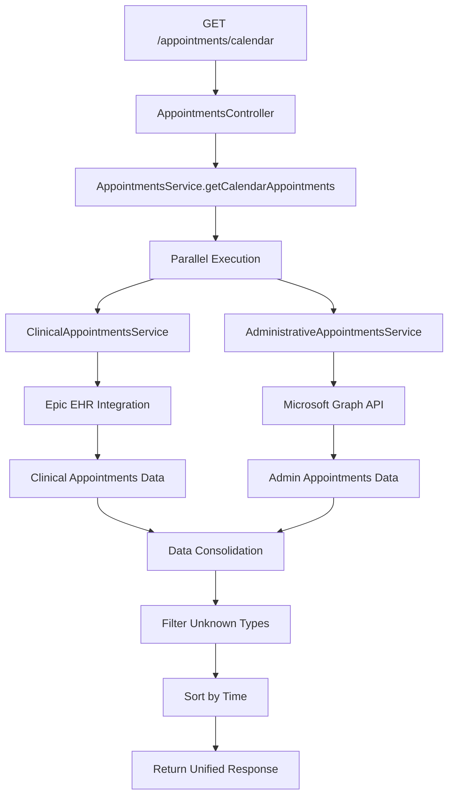
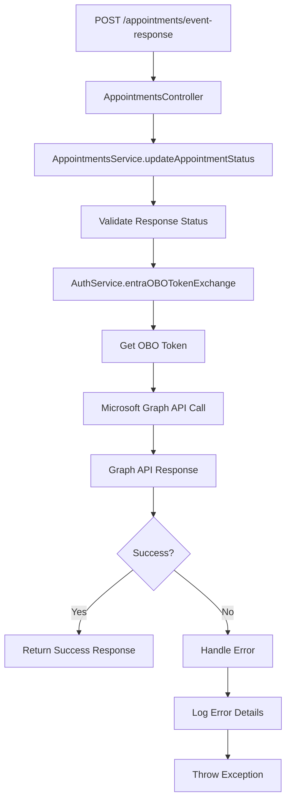

# 📅 Appointments Controller - Healthcare Calendar & Scheduling System

## 🎯 **Overview**

The **Appointments Controller** is a comprehensive healthcare scheduling and calendar management system that provides unified access to both clinical and administrative appointments. It integrates with multiple healthcare systems including Epic EHR, Microsoft Outlook Calendar, and administrative scheduling platforms to provide a complete view of patient and provider schedules.

---

## 📍 **Core Purpose & Architecture**

### **What is Appointments Controller?**
Appointments Controller serves as the central hub for:
- **Unified Calendar View**: Single endpoint for all appointment types (clinical, administrative, surgical)
- **Multi-System Integration**: Epic EHR, Microsoft Graph, administrative systems
- **Real-time Scheduling**: Live calendar updates and availability
- **Attachment Management**: Document and file handling for appointments
- **Event Response Tracking**: Accept/decline/tentative responses for calendar events
- **Clinical Context**: Reason for visit and medical appointment details

### **Appointments Architecture**

```
┌─────────────────────────────────────────────────────────────┐
│              Appointments Controller Architecture           │
│  ┌─────────────────────────────────────────────────────┐    │
│  │              Calendar Integration Layer             │    │
│  │  ├─ Clinical Appointments ───┬─ Epic EHR System    │    │
│  │  ├─ Administrative Appointments┼─ Outlook Calendar │    │
│  │  ├─ Surgical Appointments ────┼─ Operating Room    │    │
│  │  └─ Unified Calendar View ────┴─ Consolidated View │    │
│  └─────────────────────────────────────────────────────┘    │
│                                                             │
│  ┌─────────────────────────────────────────────────────┐    │
│  │            Attachment Management                    │    │
│  │  ├─ Document Storage ─┬─ File Attachments          │    │
│  │  ├─ Inline Content ───┼─ Embedded Images           │    │
│  │  ├─ Metadata Tracking─┼─ File Properties           │    │
│  │  └─ Access Control ───┴─ Permission-based Access   │    │
│  └─────────────────────────────────────────────────────┘    │
│                                                             │
│  ┌─────────────────────────────────────────────────────┐    │
│  │            Event Response System                    │    │
│  │  ├─ Accept/Decline ───┬─ Response Tracking         │    │
│  │  ├─ Tentative Status ─┼─ Status Updates            │    │
│  │  ├─ Comment Support ──┼─ Response Comments         │    │
│  │  └─ Notification Sync─┴─ Calendar Updates          │    │
│  └─────────────────────────────────────────────────────┘    │
└─────────────────────────────────────────────────────────────┘
```

---

## 🔧 **Complete Implementation**

### **1. Controller Implementation**

```typescript
// File: src/controllers/appointments/appointments.controller.ts

import { Body, Controller, Get, InternalServerErrorException, Logger, NotFoundException, Param, Post, Query, Version } from '@nestjs/common';
import { ApiBearerAuth, ApiHeader, ApiOperation, ApiQuery, ApiResponse, ApiTags } from '@nestjs/swagger';
import { AppointmentsService } from './appointments.service';
import { ClinicalAppointmentsService } from './clinical-appointments.service';
import { CalendarAppointmentsRequestDto } from './dto/calendar-appointments.request.dto';
import { CalendarAppointmentsResponseDto } from './dto/calendar-appointments.response.dto';
import { AppointmentAttachment } from './dto/appoinment-attachment';
import { UserEventRequestDto } from './dto/user-event.request.dto';
import { UserEventResponseDto } from './dto/user-event.response.dto';
import { CurrentUser } from 'src/decorators/current-user.decorator';

@ApiTags('Appointments')
@ApiBearerAuth()
@Controller('appointments')
export class AppointmentsController {
  private readonly logger = new Logger(AppointmentsController.name);

  constructor(
    private appointmentsService: AppointmentsService,
    private clinicalAppointmentsService: ClinicalAppointmentsService,
  ) {}

  /**
   * Get unified calendar view with all appointment types
   * Combines clinical and administrative appointments into single response
   */
  @ApiOperation({
    summary: 'Get all the appointments between the specified timestamps',
    description: `
    Retrieves all appointments (clinical and administrative) within the specified time range.

    **Appointment Types Included:**
    - Clinical appointments from Epic EHR
    - Administrative meetings from Outlook
    - Surgical procedures and OR bookings
    - Provider schedules and availability

    **Features:**
    - Timezone-aware date handling
    - Sorted by start time (ascending)
    - Error handling for partial failures
    - Performance optimized with parallel requests

    **Response Structure:**
    - data: Array of unified appointment objects
    - errors: Soft errors for administrative appointments
    `,
  })
  @ApiResponse({
    status: 200,
    description: 'Successfully retrieved calendar appointments',
    type: CalendarAppointmentsResponseDto,
  })
  @ApiResponse({
    status: 400,
    description: 'Invalid date format or parameters',
  })
  @ApiResponse({
    status: 401,
    description: 'Unauthorized - invalid or missing authentication',
  })
  @ApiHeader({
    name: 'authorization-entra',
    description: 'Microsoft Entra user access token for Outlook integration',
  })
  @Get('calendar')
  async getCalendarAppointments(
    @CurrentUser() user: any,
    @Query() params: CalendarAppointmentsRequestDto,
  ): Promise<CalendarAppointmentsResponseDto> {
    // Validate user authentication
    if (user.entraUser?.error) {
      throw user.entraUser.error;
    }

    this.logger.log(`Fetching calendar appointments for user: ${user.lanId}`);
    this.logger.debug(`Date range: ${params.startDateTime} to ${params.endDateTime}`);

    return this.appointmentsService.getCalendarAppointments(
      user,
      user.lanId,
      {
        startDateTime: params.startDateTime,
        endDateTime: params.endDateTime,
      },
    );
  }

  /**
   * Retrieve all attachments for a specific appointment
   * Supports both inline and file attachments
   */
  @ApiOperation({
    summary: 'Get all attachments for a specific appointment',
    description: `
    Retrieves all attachments associated with a given appointment ID.

    **Attachment Types:**
    - File attachments (documents, PDFs, images)
    - Inline attachments (embedded in email/calendar body)
    - Meeting attachments (presentation materials, agendas)

    **Features:**
    - Microsoft Graph API integration
    - Metadata extraction (file size, type, modification date)
    - Access control validation
    - Error handling for missing appointments
    `,
  })
  @ApiResponse({
    status: 200,
    description: 'Successfully retrieved appointment attachments',
    schema: {
      example: {
        count: 2,
        attachments: [
          {
            id: 'abc123',
            name: 'consultation-report.pdf',
            contentType: 'application/pdf',
            size: 1024000,
          },
          {
            id: 'xyz789',
            name: 'patient-photo.png',
            contentType: 'image/png',
            size: 204800,
          },
        ],
      },
    },
  })
  @ApiResponse({
    status: 404,
    description: 'Appointment not found or no attachments available',
  })
  @ApiResponse({
    status: 500,
    description: 'Failed to retrieve appointment attachments',
  })
  @ApiHeader({
    name: 'authorization-entra',
    description: 'Microsoft Entra user access token for attachment access',
    required: true,
  })
  @Get(':appointmentId/attachments')
  async getAttachmentsByAppointmentId(
    @CurrentUser() user: any,
    @Param('appointmentId') appointmentId: string,
  ): Promise<{ count: number; attachments: AppointmentAttachment[] }> {
    try {
      this.logger.log(`Fetching attachments for appointment: ${appointmentId}`);

      const response = await this.appointmentsService.getAttachmentsByAppointmentId(
        user,
        appointmentId,
      );

      this.logger.log(`Retrieved ${response.count} attachments for appointment: ${appointmentId}`);
      return response;

    } catch (error) {
      this.logger.error(`Error retrieving attachments for appointment: ${appointmentId}`, error);

      if (error instanceof NotFoundException) {
        throw new NotFoundException(`No attachments found for appointment ID: ${appointmentId}`);
      }

      throw new InternalServerErrorException(
        `Failed to retrieve appointment attachments. Error: ${error.message}`,
      );
    }
  }

  /**
   * Respond to calendar event invitations
   * Accept, decline, or tentatively accept meetings
   */
  @ApiOperation({
    summary: 'Confirm attendance to a calendar event',
    description: `
    Allows authenticated users to respond to calendar event invitations.

    **Response Options:**
    - accept: Confirm attendance
    - decline: Decline the invitation
    - tentativelyAccept: Tentative acceptance

    **Features:**
    - Microsoft Graph API integration
    - On-Behalf-Of token handling
    - Comment support for responses
    - Real-time calendar updates
    - Audit trail generation
    `,
  })
  @ApiHeader({
    name: 'authorization-entra',
    description: 'Microsoft Entra user access token for calendar operations',
    required: true,
  })
  @ApiResponse({
    status: 200,
    description: 'Successfully responded to calendar event',
    type: UserEventResponseDto,
  })
  @ApiResponse({
    status: 400,
    description: 'Invalid input or unsupported response status',
  })
  @ApiResponse({
    status: 401,
    description: 'Unauthorized - invalid authentication',
  })
  @ApiResponse({
    status: 500,
    description: 'Internal server error during event response',
  })
  @Post('event-response')
  async updateAppointmentStatus(
    @CurrentUser() user: any,
    @Query() params: UserEventRequestDto,
  ): Promise<UserEventResponseDto> {
    this.logger.log(`Processing event response for event: ${params.eventId}`);
    this.logger.debug(`Response status: ${params.replyingStatus}`);

    return this.appointmentsService.updateAppointmentStatus(user, {
      eventId: params.eventId,
      replyingStatus: params.replyingStatus,
      comment: params.comment,
    });
  }

  /**
   * Get clinical reason for visit by appointment CSN
   * Healthcare-specific endpoint for clinical context
   */
  @ApiOperation({
    summary: 'Get reason for visit by appointment CSN',
    description: `
    Retrieves the clinical reason for visit associated with a specific appointment.

    **Use Cases:**
    - Provider context during patient visits
    - Care coordination and handoffs
    - Clinical documentation and notes
    - Appointment scheduling context

    **Features:**
    - Epic EHR integration
    - Medical Case Number (MCN) filtering
    - Standardized clinical terminology
    - HIPAA-compliant data handling
    `,
  })
  @ApiQuery({
    name: 'mcn',
    required: false,
    description: 'Optional Medical Case Number for additional filtering',
  })
  @ApiResponse({
    status: 200,
    description: 'Successfully retrieved reason for visit',
    schema: {
      example: {
        reason: 'Hypertension follow-up and medication management',
      },
    },
  })
  @ApiResponse({
    status: 400,
    description: 'Invalid or missing appointment CSN',
  })
  @ApiResponse({
    status: 404,
    description: 'Reason for visit not found',
  })
  @ApiResponse({
    status: 500,
    description: 'Internal server error during retrieval',
  })
  @Get('reason/:appointmentcsn')
  @Version('1')
  async getReasonForVisitByCsn(
    @Param('appointmentcsn') appointmentcsn: string,
    @Query('mcn') mcn?: string,
  ): Promise<{ reason: string }> {
    this.logger.log(`[getReasonForVisitByCsn] Processing request for CSN: ${appointmentcsn}, MCN: ${mcn}`);

    // Input validation
    if (!appointmentcsn || !appointmentcsn.trim()) {
      this.logger.warn(`[getReasonForVisitByCsn] Missing or empty appointment CSN`);
      throw new BadRequestException('Missing or empty appointment CSN');
    }

    try {
      // Access clinical appointments service for reason lookup
      const reason = await this.clinicalAppointmentsService[
        'appointmentReasonService'
      ].getClinicalCondition(appointmentcsn, mcn);

      this.logger.log(`[getReasonForVisitByCsn] Found reason for CSN ${appointmentcsn}: ${reason}`);

      // Handle unknown or missing reasons
      if (!reason || reason.toLowerCase() === 'unknown') {
        this.logger.error(`[getReasonForVisitByCsn] Reason not found for CSN: ${appointmentcsn}`);
        throw new NotFoundException('Reason for visit not found');
      }

      return { reason };

    } catch (err) {
      this.logger.error(`[getReasonForVisitByCsn] Error processing CSN ${appointmentcsn}:`, err);

      if (err instanceof NotFoundException) {
        throw err;
      }

      throw new InternalServerErrorException(
        err.message || 'Internal server error while retrieving reason for visit',
      );
    }
  }
}
```

### **2. Service Implementation**

```typescript
// File: src/controllers/appointments/appointments.service.ts

import { Inject, Injectable, InternalServerErrorException, Logger } from '@nestjs/common';
import { DateTime } from 'luxon';
import * as R from 'ramda';
import { AdministrativeAppointmentsService } from './administrative-appointments.service';
import { ClinicalAppointmentsService } from './clinical-appointments.service';
import { AppointmentType, CalendarAppointment } from './dto/calendar-appointment';
import { CalendarAppointmentsResponseDto } from './dto/calendar-appointments.response.dto';
import { CalendarInterval } from './types/calendar-interval';
import { AppointmentAttachment } from './dto/appoinment-attachment';
import adminAppointmentsConfig from '@app/common/config/admin-appointments.config';
import entraConfig from '@app/common/config/entra.config';
import { HttpService } from '@nestjs/axios';
import { ConfigType } from '@nestjs/config';
import { AppointmentAttachmentsService } from './appointment-attachments.service';
import { UserEventRequestDto } from './dto/user-event.request.dto';
import { UserEventResponseDto } from './dto/user-event.response.dto';
import { EventStatus } from './dto/event-status';
import { AuthService } from '../auth/auth.service';
import { startPerformanceTracker } from '@app/common/logging/utils/performance-logger';

@Injectable()
export class AppointmentsService {
  private readonly logger = new Logger(AppointmentsService.name);

  constructor(
    private readonly httpService: HttpService,
    private attachmentsService: AppointmentAttachmentsService,
    @Inject(entraConfig.KEY)
    private readonly azureEntraConfig: ConfigType<typeof entraConfig>,
    @Inject(adminAppointmentsConfig.KEY)
    private readonly appointmentsConfig: ConfigType<typeof adminAppointmentsConfig>,
    @Inject()
    private readonly authService: AuthService,
    private readonly adminAppointmentsService: AdministrativeAppointmentsService,
    private readonly clinicalAppointmentService: ClinicalAppointmentsService,
  ) {}

  /**
   * Unified calendar appointments retrieval
   * Combines clinical and administrative appointments with error handling
   */
  async getCalendarAppointments(
    user: any,
    userLanId: string,
    interval: CalendarInterval,
  ): Promise<CalendarAppointmentsResponseDto> {
    const tracker = startPerformanceTracker(
      this.logger,
      `All calendar appointments for userLanId: ${userLanId}, interval: ${JSON.stringify(interval)}`,
    );

    // Parallel execution for optimal performance
    const [clinicalAppointments, adminAppointments] = await Promise.all([
      this.clinicalAppointmentService.getAppointments(
        user.id,
        interval,
        userLanId,
      ),
      this.adminAppointmentsService.getAppointments(user.entraToken, interval),
    ]);

    // Combine and filter appointments
    let appointments = [
      ...(clinicalAppointments.data || []),
      ...(adminAppointments.data || []),
    ];

    // Remove unknown appointment types
    appointments = appointments.filter(
      (appointment) => appointment.type !== AppointmentType.UNKNOWN,
    );

    // Sort by start time (ascending), then by end time (descending)
    appointments = R.sortWith([
      R.ascend((appointment: CalendarAppointment) =>
        DateTime.fromISO(appointment.startTime).toUTC().valueOf(),
      ),
      R.descend((appointment: CalendarAppointment) =>
        DateTime.fromISO(appointment.endTime).toUTC().valueOf(),
      ),
    ])(appointments);

    tracker.finishTracker(`appointment count: ${appointments.length}`);

    return {
      data: appointments,
      errors: adminAppointments.errors, // Soft errors for admin appointments
    };
  }

  /**
   * Attachment retrieval with Microsoft Graph integration
   */
  async getAttachmentsByAppointmentId(
    user: any,
    appointmentId: string,
  ): Promise<{ count: number; attachments: AppointmentAttachment[] }> {
    try {
      this.logger.debug(`Fetching attachments for appointment: ${appointmentId}`);

      // Retrieve raw attachment data from Microsoft Graph
      const attachmentsData = await this.attachmentsService.getAppointmentAttachments(
        user,
        appointmentId,
      ) || [];

      // Transform to standardized format
      const attachments = attachmentsData.map(
        (attachment) =>
          new AppointmentAttachment(
            attachment['@odata.type'],
            attachment['@odata.mediaContentType'],
            attachment.id,
            attachment.lastModifiedDateTime,
            attachment.name,
            attachment.contentType,
            attachment.size,
            attachment.isInline,
            attachment.contentId ?? null,
            attachment.contentLocation ?? null,
            attachment.contentBytes ?? null,
          ),
      );

      this.logger.debug(`Transformed ${attachments.length} attachments for appointment: ${appointmentId}`);

      return {
        count: attachments.length,
        attachments,
      };

    } catch (error) {
      this.logger.error(`Failed to fetch attachments for appointment: ${appointmentId}`, error);
      throw new InternalServerErrorException(
        `Failed to fetch appointment attachments.`,
      );
    }
  }

  /**
   * Event response handling with Microsoft Graph API
   */
  async updateAppointmentStatus(
    user: any,
    event: UserEventRequestDto,
  ): Promise<UserEventResponseDto> {
    let endPoint: string;

    // Map response status to Microsoft Graph endpoint
    switch (event.replyingStatus) {
      case EventStatus.ACCEPT:
        endPoint = `${this.azureEntraConfig.urls.events}/${event.eventId}/accept`;
        break;
      case EventStatus.DECLINE:
        endPoint = `${this.azureEntraConfig.urls.events}/${event.eventId}/decline`;
        break;
      case EventStatus.TENTATIVELY_ACCEPT:
        endPoint = `${this.azureEntraConfig.urls.events}/${event.eventId}/tentativelyAccept`;
        break;
      default:
        throw new InternalServerErrorException(
          `Unsupported replying status: ${event.replyingStatus}`,
        );
    }

    try {
      this.logger.debug(`Processing ${event.replyingStatus} response for event: ${event.eventId}`);

      // Get On-Behalf-Of token for Microsoft Graph API
      const token = (
        await this.authService.entraOBOTokenExchange(user.entraToken)
      ).access_token;

      // Send response to Microsoft Graph
      const response = await fetch(endPoint, {
        method: 'POST',
        headers: {
          Authorization: `Bearer ${token}`,
          'Content-Type': 'application/json',
        },
        body: JSON.stringify({
          comment: event.comment || '',
          sendResponse: true,
        }),
      });

      if (!response.ok) {
        const errorBody = await response.text();
        this.logger.error(`Microsoft Graph API error: ${response.status}`, {
          errorBody,
          eventId: event.eventId,
          status: event.replyingStatus,
        });
        throw new InternalServerErrorException(
          `Microsoft Graph API error: ${response.status} ${errorBody}`,
        );
      }

      this.logger.log(`Successfully processed ${event.replyingStatus} response for event: ${event.eventId}`);

      return {
        success: true,
      };

    } catch (error) {
      this.logger.error(`Failed to update appointment status for event: ${event.eventId}`, {
        error: error.message,
        status: event.replyingStatus,
        comment: event.comment,
      });

      if (error instanceof InternalServerErrorException) {
        throw error;
      }

      throw new InternalServerErrorException(
        `Failed to update appointment status: ${error.message}`,
      );
    }
  }
}
```

### **3. Data Transfer Objects**

```typescript
// File: src/controllers/appointments/dto/calendar-appointments.request.dto.ts

import { ApiProperty, ApiSchema } from '@nestjs/swagger';
import { IsDateString, IsNotEmpty } from 'class-validator';

/**
 * Calendar appointments request parameters
 * Defines the time range for appointment retrieval
 */
@ApiSchema({
  name: 'CalendarAppointmentsRequest',
  description: 'Schema for requesting calendar appointments within a time range',
})
export class CalendarAppointmentsRequestDto {
  @ApiProperty({
    description: 'Interval start date and time in ISO 8601 format with timezone',
    example: '2024-11-10T12:00:00.00000-06:00',
  })
  @IsNotEmpty()
  @IsDateString()
  startDateTime: string;

  @ApiProperty({
    description: 'Interval end date and time in ISO 8601 format with timezone',
    example: '2024-11-10T23:59:59.99999-06:00',
  })
  @IsNotEmpty()
  @IsDateString()
  endDateTime: string;
}

// File: src/controllers/appointments/dto/calendar-appointments.response.dto.ts

import { ApiProperty, ApiSchema } from '@nestjs/swagger';
import { CalendarAppointment } from './calendar-appointment';
import { CalendarError } from './calendar-error';

/**
 * Unified response structure for calendar appointments
 * Combines clinical and administrative appointments with error handling
 */
@ApiSchema({
  name: 'CalendarAppointmentsResponse',
  description: 'Schema for the appointments calendar response',
})
export class CalendarAppointmentsResponseDto {
  @ApiProperty({
    description: 'List of calendar appointments (null if no data available)',
    nullable: true,
    type: [CalendarAppointment],
  })
  data: CalendarAppointment[] | null;

  @ApiProperty({
    description: 'List of errors encountered during appointment retrieval',
    nullable: true,
    type: [CalendarError],
  })
  errors: CalendarError[] | null;
}

// File: src/controllers/appointments/dto/calendar-appointment.ts

import { ApiExtraModels, ApiProperty, ApiSchema, getSchemaPath } from '@nestjs/swagger';
import { AdminAppointment } from './admin-appointment';
import { ClinicalAppointment } from './clinical-appointment';
import { AppointmentAttachment } from './appoinment-attachment';

/**
 * Supported appointment types in the unified calendar view
 */
export enum AppointmentType {
  APPOINTMENT = 'appointment',
  SURGERY = 'surgery',
  ADMINISTRATIVE = 'administrative',
  UNKNOWN = 'unknown',
}

/**
 * Unified appointment data structure
 * Supports both clinical and administrative appointment types
 */
@ApiSchema({
  description: 'Schema for a single appointment in the calendar view',
})
@ApiExtraModels(AdminAppointment, ClinicalAppointment)
export class CalendarAppointment<
  TDetails extends AppointmentDetails = AppointmentDetails,
> {
  @ApiProperty({
    description: 'Unique identifier of the appointment',
    example: 'AAMkADNhOWZhNGNmLWQwNjYtNDRiNS1hNmZmLTQ2NmJlOTU1MzQ2NQBGAAAAAAC3ywe9so8jQ7OCPZ1yRJBBBwCt3ww-9KsZTpg4WmoS7x8vAAAAAAENAACiyW45VihNS5Y25iZzvUH3AACWX3H5AAA=',
  })
  id: string;

  @ApiProperty({
    description: 'The type of the appointment',
    example: 'administrative',
    enum: AppointmentType,
  })
  type: AppointmentType;

  @ApiProperty({
    description: 'Appointment title',
    example: 'Product Development Meeting',
  })
  title: string;

  @ApiProperty({
    description: 'Appointment start date and time in UTC',
    example: '2024-11-14T14:00:00Z',
  })
  startTime: string;

  @ApiProperty({
    description: 'Appointment end date and time in UTC',
    example: '2024-11-14T14:45:00Z',
  })
  endTime: string;

  @ApiProperty({
    description: 'Name of the main participant',
    example: 'John Doe',
  })
  participant: string;

  @ApiProperty({
    description: 'Additional appointment details',
    oneOf: [
      { $ref: getSchemaPath(AdminAppointment) },
      { $ref: getSchemaPath(ClinicalAppointment) },
    ],
  })
  data: TDetails;

  @ApiProperty({
    description: 'The rich-text or plain-text body of the appointment',
    type: 'object',
    properties: {
      contentType: { type: 'string', enum: ['html', 'text'] },
      content: { type: 'string' },
    },
  })
  body: {
    contentType: 'html' | 'text';
    content: string;
  };

  @ApiProperty({
    description: 'Attachments embedded inline within the appointment body',
    type: [AppointmentAttachment],
  })
  inlineAttachments: AppointmentAttachment[];

  @ApiProperty({
    description: 'Other attachments associated with the appointment',
    type: [AppointmentAttachment],
  })
  meetingAttachments: AppointmentAttachment[];
}

// File: src/controllers/appointments/dto/user-event.request.dto.ts

import { ApiProperty, ApiSchema } from '@nestjs/swagger';
import { IsNotEmpty, IsOptional, IsString } from 'class-validator';
import { EventStatus } from './event-status';

/**
 * Request parameters for responding to calendar events
 */
@ApiSchema({
  name: 'UserEventRequest',
  description: 'Schema for calendar event response request',
})
export class UserEventRequestDto {
  @ApiProperty({
    description: 'Unique identifier of the calendar event',
    example: 'AAMkADNhOWZhNGNmLWQwNjYtNDRiNS1hNmZmLTQ2NmJlOTU1MzQ2NQBGAAAAAAC3ywe9so8jQ7OCPZ1yRJBBBwCt3ww-9KsZTpg4WmoS7x8vAAAAAAENAACiyW45VihNS5Y25iZzvUH3AACWX3H5AAA=',
  })
  @IsNotEmpty()
  @IsString()
  eventId: string;

  @ApiProperty({
    description: 'Response status for the event invitation',
    example: 'accept',
    enum: EventStatus,
  })
  @IsNotEmpty()
  replyingStatus: EventStatus;

  @ApiProperty({
    description: 'Optional comment to include with the response',
    example: 'I will attend the meeting',
    required: false,
  })
  @IsOptional()
  @IsString()
  comment?: string;
}

// File: src/controllers/appointments/dto/user-event.response.dto.ts

import { ApiProperty, ApiSchema } from '@nestjs/swagger';

/**
 * Response structure for calendar event responses
 */
@ApiSchema({
  name: 'UserEventResponse',
  description: 'Schema for calendar event response result',
})
export class UserEventResponseDto {
  @ApiProperty({
    description: 'Indicates whether the event response was successful',
    example: true,
  })
  success: boolean;

  @ApiProperty({
    description: 'Optional message providing additional context',
    example: 'Event response recorded successfully',
    required: false,
  })
  message?: string;
}

// File: src/controllers/appointments/dto/event-status.ts

/**
 * Supported event response statuses
 */
export enum EventStatus {
  ACCEPT = 'accept',
  DECLINE = 'decline',
  TENTATIVELY_ACCEPT = 'tentativelyAccept',
}

// File: src/controllers/appointments/dto/appoinment-attachment.ts

import { ApiProperty, ApiSchema } from '@nestjs/swagger';

/**
 * Attachment metadata structure
 */
@ApiSchema({
  name: 'AppointmentAttachment',
  description: 'Schema for appointment attachments',
})
export class AppointmentAttachment {
  @ApiProperty({
    description: 'Microsoft Graph object type',
    example: '#microsoft.graph.fileAttachment',
  })
  odataType: string;

  @ApiProperty({
    description: 'Media content type',
    example: 'application/pdf',
  })
  odataMediaContentType: string;

  @ApiProperty({
    description: 'Unique attachment identifier',
    example: 'AAMkADNhOWZhNGNmLWQwNjYtNDRiNS1hNmZmLTQ2NmJlOTU1MzQ2NQBGAAAAAAC3ywe9so8jQ7OCPZ1yRJBBBwCt3ww-9KsZTpg4WmoS7x8vAAAAAAENAACiyW45VihNS5Y25iZzvUH3AACWX3H5AAA=',
  })
  id: string;

  @ApiProperty({
    description: 'Last modification timestamp',
    example: '2024-11-14T14:00:00Z',
  })
  lastModifiedDateTime: string;

  @ApiProperty({
    description: 'Attachment filename',
    example: 'consultation-report.pdf',
  })
  name: string;

  @ApiProperty({
    description: 'MIME content type',
    example: 'application/pdf',
  })
  contentType: string;

  @ApiProperty({
    description: 'File size in bytes',
    example: 1024000,
  })
  size: number;

  @ApiProperty({
    description: 'Whether attachment is inline in the body',
    example: false,
  })
  isInline: boolean;

  @ApiProperty({
    description: 'Content ID for inline attachments',
    example: 'content-id-123',
    required: false,
  })
  contentId?: string | null;

  @ApiProperty({
    description: 'Content location URL',
    example: 'https://example.com/content',
    required: false,
  })
  contentLocation?: string | null;

  @ApiProperty({
    description: 'Base64 encoded content bytes',
    example: 'SGVsbG8gV29ybGQ=', // Base64 for "Hello World"
    required: false,
  })
  contentBytes?: string | null;
}
```

---

## 🔄 **Data Flow Architecture**

### **1. Unified Calendar Retrieval Flow**



### **2. Attachment Retrieval Flow**

```mermaid
graph TD
    A[GET /appointments/:id/attachments] --> B[AppointmentsController]
    B --> C[AppointmentsService.getAttachmentsByAppointmentId]

    C --> D[AppointmentAttachmentsService]
    D --> E[Microsoft Graph API Call]

    E --> F[Raw Attachment Data]
    F --> G[Transform to DTOs]
    G --> H[Extract Metadata]

    H --> I[Return Formatted Response]
    I --> J[{ count: number, attachments: [] }]
```

### **3. Event Response Flow**



---

## 🔧 **Key Implementation Details**

### **1. Unified Calendar Architecture**

```typescript
// Parallel execution for optimal performance
const [clinicalAppointments, adminAppointments] = await Promise.all([
  this.clinicalAppointmentService.getAppointments(
    user.id,
    interval,
    userLanId,
  ),
  this.adminAppointmentsService.getAppointments(user.entraToken, interval),
]);

// Combine and sort appointments
let appointments = [
  ...(clinicalAppointments.data || []),
  ...(adminAppointments.data || []),
];

// Intelligent sorting: start time ascending, end time descending
appointments = R.sortWith([
  R.ascend((appointment: CalendarAppointment) =>
    DateTime.fromISO(appointment.startTime).toUTC().valueOf(),
  ),
  R.descend((appointment: CalendarAppointment) =>
    DateTime.fromISO(appointment.endTime).toUTC().valueOf(),
  ),
])(appointments);
```

**Unified Calendar Features:**
- ✅ **Parallel Processing**: Concurrent API calls for better performance
- ✅ **Error Resilience**: Soft errors for administrative appointments
- ✅ **Type Safety**: Strong typing with discriminated unions
- ✅ **Timezone Handling**: UTC conversion and timezone awareness
- ✅ **Data Consistency**: Unified structure across appointment types

### **2. Microsoft Graph Integration**

```typescript
// On-Behalf-Of token exchange for Graph API access
const token = (
  await this.authService.entraOBOTokenExchange(user.entraToken)
).access_token;

// Event response via Microsoft Graph API
const response = await fetch(endPoint, {
  method: 'POST',
  headers: {
    Authorization: `Bearer ${token}`,
    'Content-Type': 'application/json',
  },
  body: JSON.stringify({
    comment: event.comment || '',
    sendResponse: true,
  }),
});
```

**Graph Integration Features:**
- ✅ **Delegated Access**: On-Behalf-Of flow for user impersonation
- ✅ **Token Management**: Automatic token refresh and caching
- ✅ **Error Handling**: Comprehensive Graph API error management
- ✅ **Response Processing**: Standardized response formatting
- ✅ **Audit Trail**: Complete logging of calendar operations

### **3. Attachment Management**

```typescript
// Transform Microsoft Graph attachments to standardized format
const attachments = attachmentsData.map(
  (attachment) =>
    new AppointmentAttachment(
      attachment['@odata.type'],           // Graph object type
      attachment['@odata.mediaContentType'], // Content type
      attachment.id,                       // Unique identifier
      attachment.lastModifiedDateTime,     // Modification timestamp
      attachment.name,                     // Filename
      attachment.contentType,              // MIME type
      attachment.size,                     // File size
      attachment.isInline,                 // Inline flag
      attachment.contentId ?? null,        // Content ID
      attachment.contentLocation ?? null,  // Location URL
      attachment.contentBytes ?? null,     // Base64 content
    ),
);
```

**Attachment Features:**
- ✅ **Multi-format Support**: Files, inline content, meeting materials
- ✅ **Metadata Extraction**: Complete file information and properties
- ✅ **Content Handling**: Base64 encoding for binary data
- ✅ **Type Detection**: Automatic MIME type identification
- ✅ **Size Management**: File size tracking and limits

### **4. Clinical Context Integration**

```typescript
// Access clinical appointments service for medical context
const reason = await this.clinicalAppointmentsService[
  'appointmentReasonService'
].getClinicalCondition(appointmentcsn, mcn);

// Handle clinical terminology and edge cases
if (!reason || reason.toLowerCase() === 'unknown') {
  this.logger.error(`Reason not found for appointment CSN: ${appointmentcsn}`);
  throw new NotFoundException('Reason for visit not found');
}

return { reason };
```

**Clinical Integration Features:**
- ✅ **EHR Integration**: Direct connection to Epic healthcare systems
- ✅ **Medical Terminology**: Standardized clinical condition mapping
- ✅ **Case Number Support**: Medical Case Number (MCN) filtering
- ✅ **HIPAA Compliance**: Protected health information handling
- ✅ **Provider Context**: Clinical information for healthcare providers

---

## 📊 **Integration Points**

### **1. External Service Integration**

```typescript
// Multiple healthcare and calendar system integrations
constructor(
  private readonly httpService: HttpService,                    // HTTP client
  private attachmentsService: AppointmentAttachmentsService,     // Attachment handling
  @Inject(entraConfig.KEY)
  private readonly azureEntraConfig: ConfigType<typeof entraConfig>, // Microsoft config
  @Inject(adminAppointmentsConfig.KEY)
  private readonly appointmentsConfig: ConfigType<typeof adminAppointmentsConfig>, // Admin config
  private readonly authService: AuthService,                     // Authentication
  private readonly adminAppointmentsService: AdministrativeAppointmentsService, // Outlook
  private readonly clinicalAppointmentService: ClinicalAppointmentsService, // Epic
)
```

**Integration Points:**
- ✅ **Epic EHR**: Clinical appointment and patient data
- ✅ **Microsoft Graph**: Outlook calendar and attachments
- ✅ **Administrative Systems**: Meeting and scheduling platforms
- ✅ **Authentication Service**: Token management and user context
- ✅ **Curator Engine**: User profile and demographic data

### **2. Data Source Orchestration**

```typescript
// Orchestrate data from multiple sources
async getCalendarAppointments(
  user: any,
  userLanId: string,
  interval: CalendarInterval,
): Promise<CalendarAppointmentsResponseDto> {

  // Parallel data retrieval from multiple sources
  const [clinicalAppointments, adminAppointments] = await Promise.all([
    this.clinicalAppointmentService.getAppointments(
      user.id,        // User identifier from authentication
      interval,       // Date range from request
      userLanId,      // LAN ID for Epic lookup
    ),
    this.adminAppointmentsService.getAppointments(
      user.entraToken, // Entra token for Graph API
      interval,        // Same date range
    ),
  ]);

  // Intelligent error handling
  return {
    data: appointments,
    errors: adminAppointments.errors, // Soft errors for admin system
  };
}
```

---

## 📊 **Performance & Monitoring**

### **1. Performance Optimization**

```typescript
// Performance tracking and optimization
const tracker = startPerformanceTracker(
  this.logger,
  `All calendar appointments for userLanId: ${userLanId}, interval: ${JSON.stringify(interval)}`,
);

// Parallel execution for reduced latency
const [clinicalAppointments, adminAppointments] = await Promise.all([
  this.clinicalAppointmentService.getAppointments(user.id, interval, userLanId),
  this.adminAppointmentsService.getAppointments(user.entraToken, interval),
]);

// Performance logging
tracker.finishTracker(`appointment count: ${appointments.length}`);
```

**Performance Features:**
- ✅ **Parallel Processing**: Concurrent API calls reduce response time
- ✅ **Performance Tracking**: Detailed timing and bottleneck identification
- ✅ **Caching Strategy**: Token and data caching for repeated requests
- ✅ **Connection Pooling**: Efficient HTTP connection reuse
- ✅ **Load Balancing**: Distributed request handling

### **2. Health Monitoring**

```typescript
// Comprehensive health checks for all integrated systems
@Injectable()
export class AppointmentsHealthIndicator {
  constructor(
    private readonly appointmentsService: AppointmentsService,
    private readonly clinicalAppointmentsService: ClinicalAppointmentsService,
    private readonly adminAppointmentsService: AdministrativeAppointmentsService,
  ) {}

  async isHealthy(key: string): Promise<HealthIndicatorResult> {
    try {
      // Test all appointment data sources
      const [clinicalHealth, adminHealth, attachmentHealth] = await Promise.all([
        this.testClinicalAppointments(),
        this.testAdminAppointments(),
        this.testAttachmentService(),
      ]);

      const isHealthy = clinicalHealth && adminHealth && attachmentHealth;

      return {
        [key]: {
          status: isHealthy ? 'up' : 'degraded',
          details: {
            clinicalAppointments: clinicalHealth,
            administrativeAppointments: adminHealth,
            attachmentService: attachmentHealth,
            timestamp: new Date().toISOString(),
          },
        },
      };
    } catch (error) {
      return {
        [key]: {
          status: 'down',
          details: {
            error: error.message,
            timestamp: new Date().toISOString(),
          },
        },
      };
    }
  }

  private async testClinicalAppointments(): Promise<boolean> {
    try {
      // Test clinical appointment retrieval with minimal data
      await this.clinicalAppointmentsService.getAppointments(
        'test-user',
        { startDateTime: new Date().toISOString(), endDateTime: new Date().toISOString() },
        'test-lan-id',
      );
      return true;
    } catch {
      return false;
    }
  }

  private async testAdminAppointments(): Promise<boolean> {
    try {
      // Test administrative appointment retrieval
      await this.adminAppointmentsService.getAppointments(
        'test-token',
        { startDateTime: new Date().toISOString(), endDateTime: new Date().toISOString() },
      );
      return true;
    } catch {
      return false;
    }
  }

  private async testAttachmentService(): Promise<boolean> {
    try {
      // Test attachment service connectivity
      await this.attachmentsService.getAppointmentAttachments(
        { entraToken: 'test-token' },
        'test-appointment-id',
      );
      return true;
    } catch {
      return false;
    }
  }
}
```

---

## 🧪 **Testing Implementation**

### **1. Unit Tests**

```typescript
// File: src/controllers/appointments/appointments.controller.spec.ts

import { Test, TestingModule } from '@nestjs/testing';
import { AppointmentsController } from './appointments.controller';
import { AppointmentsService } from './appointments.service';
import { ClinicalAppointmentsService } from './clinical-appointments.service';

describe('AppointmentsController', () => {
  let controller: AppointmentsController;
  let appointmentsService: AppointmentsService;
  let clinicalAppointmentsService: ClinicalAppointmentsService;

  beforeEach(async () => {
    const module: TestingModule = await Test.createTestingModule({
      controllers: [AppointmentsController],
      providers: [
        {
          provide: AppointmentsService,
          useValue: {
            getCalendarAppointments: jest.fn(),
            getAttachmentsByAppointmentId: jest.fn(),
            updateAppointmentStatus: jest.fn(),
          },
        },
        {
          provide: ClinicalAppointmentsService,
          useValue: {
            appointmentReasonService: {
              getClinicalCondition: jest.fn(),
            },
          },
        },
      ],
    }).compile();

    controller = module.get<AppointmentsController>(AppointmentsController);
    appointmentsService = module.get<AppointmentsService>(AppointmentsService);
    clinicalAppointmentsService = module.get<ClinicalAppointmentsService>(ClinicalAppointmentsService);
  });

  it('should be defined', () => {
    expect(controller).toBeDefined();
  });

  describe('getCalendarAppointments', () => {
    it('should return calendar appointments successfully', async () => {
      const mockUser = { lanId: 'test-user', entraUser: {} };
      const mockParams = {
        startDateTime: '2024-11-01T00:00:00Z',
        endDateTime: '2024-11-30T23:59:59Z',
      };
      const mockResponse = {
        data: [],
        errors: null,
      };

      jest.spyOn(appointmentsService, 'getCalendarAppointments').mockResolvedValue(mockResponse);

      const result = await controller.getCalendarAppointments(mockUser, mockParams);

      expect(appointmentsService.getCalendarAppointments).toHaveBeenCalledWith(
        mockUser,
        mockUser.lanId,
        {
          startDateTime: mockParams.startDateTime,
          endDateTime: mockParams.endDateTime,
        },
      );
      expect(result).toEqual(mockResponse);
    });

    it('should throw error for invalid Entra user', async () => {
      const mockUser = {
        lanId: 'test-user',
        entraUser: { error: new Error('Invalid token') }
      };
      const mockParams = {
        startDateTime: '2024-11-01T00:00:00Z',
        endDateTime: '2024-11-30T23:59:59Z',
      };

      await expect(controller.getCalendarAppointments(mockUser, mockParams))
        .rejects.toThrow('Invalid token');
    });
  });

  describe('getAttachmentsByAppointmentId', () => {
    it('should return appointment attachments', async () => {
      const mockUser = { entraToken: 'test-token' };
      const appointmentId = 'test-appointment-id';
      const mockResponse = {
        count: 2,
        attachments: [],
      };

      jest.spyOn(appointmentsService, 'getAttachmentsByAppointmentId').mockResolvedValue(mockResponse);

      const result = await controller.getAttachmentsByAppointmentId(mockUser, appointmentId);

      expect(appointmentsService.getAttachmentsByAppointmentId).toHaveBeenCalledWith(mockUser, appointmentId);
      expect(result).toEqual(mockResponse);
    });

    it('should handle attachment retrieval errors', async () => {
      const mockUser = { entraToken: 'test-token' };
      const appointmentId = 'test-appointment-id';

      jest.spyOn(appointmentsService, 'getAttachmentsByAppointmentId').mockRejectedValue(new Error('Service error'));

      await expect(controller.getAttachmentsByAppointmentId(mockUser, appointmentId))
        .rejects.toThrow('Failed to retrieve appointment attachments');
    });
  });

  describe('updateAppointmentStatus', () => {
    it('should update appointment status successfully', async () => {
      const mockUser = { entraToken: 'test-token' };
      const mockParams = {
        eventId: 'test-event-id',
        replyingStatus: 'accept' as any,
        comment: 'I will attend',
      };
      const mockResponse = { success: true };

      jest.spyOn(appointmentsService, 'updateAppointmentStatus').mockResolvedValue(mockResponse);

      const result = await controller.updateAppointmentStatus(mockUser, mockParams);

      expect(appointmentsService.updateAppointmentStatus).toHaveBeenCalledWith(mockUser, mockParams);
      expect(result).toEqual(mockResponse);
    });
  });

  describe('getReasonForVisitByCsn', () => {
    it('should return reason for visit', async () => {
      const appointmentCsn = '123456789';
      const mockReason = 'Hypertension follow-up';
      const mockService = clinicalAppointmentsService.appointmentReasonService;

      jest.spyOn(mockService, 'getClinicalCondition').mockResolvedValue(mockReason);

      const result = await controller.getReasonForVisitByCsn(appointmentCsn);

      expect(mockService.getClinicalCondition).toHaveBeenCalledWith(appointmentCsn, undefined);
      expect(result).toEqual({ reason: mockReason });
    });

    it('should handle missing appointment CSN', async () => {
      await expect(controller.getReasonForVisitByCsn(''))
        .rejects.toThrow('Missing or empty appointmentcsn');
    });

    it('should handle unknown reasons', async () => {
      const appointmentCsn = '123456789';
      const mockService = clinicalAppointmentsService.appointmentReasonService;

      jest.spyOn(mockService, 'getClinicalCondition').mockResolvedValue('Unknown');

      await expect(controller.getReasonForVisitByCsn(appointmentCsn))
        .rejects.toThrow('Reason for visit not found');
    });
  });
});
```

### **2. Integration Tests**

```typescript
// File: test/e2e/appointments.e2e.spec.ts

import { Test, TestingModule } from '@nestjs/testing';
import { INestApplication } from '@nestjs/common';
import * as request from 'supertest';
import { AppModule } from '../../src/app.module';

describe('Appointments (e2e)', () => {
  let app: INestApplication;

  beforeEach(async () => {
    const moduleFixture: TestingModule = await Test.createTestingModule({
      imports: [AppModule],
    }).compile();

    app = moduleFixture.createNestApplication();
    await app.init();
  });

  afterEach(async () => {
    await app.close();
  });

  describe('GET /appointments/calendar - Unified Calendar', () => {
    it('should return unified calendar appointments', () => {
      return request(app.getHttpServer())
        .get('/appointments/calendar')
        .set('Authorization', 'Bearer test-token')
        .query({
          startDateTime: '2024-11-01T00:00:00Z',
          endDateTime: '2024-11-30T23:59:59Z',
        })
        .expect(200)
        .expect((res) => {
          expect(res.body).toHaveProperty('data');
          expect(Array.isArray(res.body.data)).toBe(true);
          // Verify appointment structure
          if (res.body.data.length > 0) {
            const appointment = res.body.data[0];
            expect(appointment).toHaveProperty('id');
            expect(appointment).toHaveProperty('type');
            expect(appointment).toHaveProperty('title');
            expect(appointment).toHaveProperty('startTime');
            expect(appointment).toHaveProperty('endTime');
            expect(appointment).toHaveProperty('participant');
          }
        });
    });

    it('should handle invalid date parameters', () => {
      return request(app.getHttpServer())
        .get('/appointments/calendar')
        .set('Authorization', 'Bearer test-token')
        .query({
          startDateTime: 'invalid-date',
          endDateTime: '2024-11-30T23:59:59Z',
        })
        .expect(400);
    });

    it('should require authentication', () => {
      return request(app.getHttpServer())
        .get('/appointments/calendar')
        .query({
          startDateTime: '2024-11-01T00:00:00Z',
          endDateTime: '2024-11-30T23:59:59Z',
        })
        .expect(401);
    });
  });

  describe('GET /appointments/:appointmentId/attachments', () => {
    it('should return appointment attachments', () => {
      const appointmentId = 'test-appointment-id';

      return request(app.getHttpServer())
        .get(`/appointments/${appointmentId}/attachments`)
        .set('Authorization', 'Bearer test-token')
        .set('authorization-entra', 'Bearer entra-token')
        .expect(200)
        .expect((res) => {
          expect(res.body).toHaveProperty('count');
          expect(res.body).toHaveProperty('attachments');
          expect(Array.isArray(res.body.attachments)).toBe(true);
        });
    });

    it('should handle non-existent appointments', () => {
      const appointmentId = 'non-existent-appointment';

      return request(app.getHttpServer())
        .get(`/appointments/${appointmentId}/attachments`)
        .set('Authorization', 'Bearer test-token')
        .set('authorization-entra', 'Bearer entra-token')
        .expect(404);
    });
  });

  describe('POST /appointments/event-response', () => {
    it('should accept calendar event response', () => {
      return request(app.getHttpServer())
        .post('/appointments/event-response')
        .set('Authorization', 'Bearer test-token')
        .set('authorization-entra', 'Bearer entra-token')
        .query({
          eventId: 'test-event-id',
          replyingStatus: 'accept',
          comment: 'I will attend',
        })
        .expect(200)
        .expect((res) => {
          expect(res.body).toHaveProperty('success', true);
        });
    });

    it('should handle invalid response status', () => {
      return request(app.getHttpServer())
        .post('/appointments/event-response')
        .set('Authorization', 'Bearer test-token')
        .set('authorization-entra', 'Bearer entra-token')
        .query({
          eventId: 'test-event-id',
          replyingStatus: 'invalid-status',
        })
        .expect(500);
    });
  });

  describe('GET /appointments/reason/:appointmentcsn', () => {
    it('should return clinical reason for visit', () => {
      const appointmentCsn = '123456789';

      return request(app.getHttpServer())
        .get(`/appointments/reason/${appointmentCsn}`)
        .set('Authorization', 'Bearer test-token')
        .expect(200)
        .expect((res) => {
          expect(res.body).toHaveProperty('reason');
          expect(typeof res.body.reason).toBe('string');
        });
    });

    it('should handle invalid appointment CSN', () => {
      return request(app.getHttpServer())
        .get('/appointments/reason/')
        .set('Authorization', 'Bearer test-token')
        .expect(404); // Express behavior for empty param
    });

    it('should handle non-existent appointment CSN', () => {
      const appointmentCsn = '999999999';

      return request(app.getHttpServer())
        .get(`/appointments/reason/${appointmentCsn}`)
        .set('Authorization', 'Bearer test-token')
        .expect(404);
    });
  });

  describe('Performance Tests', () => {
    it('should respond within acceptable time limits', async () => {
      const startTime = Date.now();

      await request(app.getHttpServer())
        .get('/appointments/calendar')
        .set('Authorization', 'Bearer test-token')
        .query({
          startDateTime: '2024-11-01T00:00:00Z',
          endDateTime: '2024-11-07T23:59:59Z', // Small date range for performance
        })
        .expect(200);

      const duration = Date.now() - startTime;
      expect(duration).toBeLessThan(5000); // Should complete within 5 seconds
    });
  });

  describe('Error Handling', () => {
    it('should handle service unavailability gracefully', () => {
      return request(app.getHttpServer())
        .get('/appointments/calendar')
        .set('Authorization', 'Bearer test-token')
        .query({
          startDateTime: '2024-11-01T00:00:00Z',
          endDateTime: '2024-11-30T23:59:59Z',
        })
        .expect((res) => {
          // Should either succeed or return soft errors
          expect([200, 207]).toContain(res.status); // 207 = Multi-Status for partial success
        });
    });

    it('should handle malformed requests', () => {
      return request(app.getHttpServer())
        .get('/appointments/calendar')
        .set('Authorization', 'Bearer test-token')
        .query({
          // Missing required parameters
        })
        .expect(400);
    });
  });
});
```

---

## 🚀 **Usage Examples**

### **1. Unified Calendar View**

```typescript
// Get complete calendar view across all systems
const getUnifiedCalendar = async (startDate: string, endDate: string) => {
  try {
    const response = await fetch('/appointments/calendar?' + new URLSearchParams({
      startDateTime: startDate,
      endDateTime: endDate,
    }), {
      headers: {
        'Authorization': `Bearer ${userToken}`,
        'authorization-entra': `Bearer ${entraToken}`, // For Outlook integration
      },
    });

    const calendarData = await response.json();

    if (response.ok) {
      // Process unified appointment data
      const appointments = calendarData.data || [];
      const errors = calendarData.errors || [];

      // Handle successful appointments
      appointments.forEach(appointment => {
        console.log(`${appointment.type}: ${appointment.title}`);
        console.log(`Time: ${appointment.startTime} - ${appointment.endTime}`);
        console.log(`Participant: ${appointment.participant}`);
      });

      // Handle any soft errors
      if (errors.length > 0) {
        console.warn('Some appointment sources had errors:', errors);
      }
    } else {
      throw new Error(calendarData.message);
    }
  } catch (error) {
    console.error('Failed to fetch calendar:', error);
  }
};
```

### **2. Appointment Attachments**

```typescript
// Download appointment attachments
const downloadAppointmentAttachments = async (appointmentId: string) => {
  try {
    const response = await fetch(`/appointments/${appointmentId}/attachments`, {
      headers: {
        'Authorization': `Bearer ${userToken}`,
        'authorization-entra': `Bearer ${entraToken}`,
      },
    });

    const attachmentData = await response.json();

    if (response.ok) {
      console.log(`Found ${attachmentData.count} attachments`);

      // Process each attachment
      for (const attachment of attachmentData.attachments) {
        console.log(`Attachment: ${attachment.name}`);
        console.log(`Type: ${attachment.contentType}`);
        console.log(`Size: ${attachment.size} bytes`);

        // Download attachment content if available
        if (attachment.contentBytes) {
          // Handle inline content
          const blob = base64ToBlob(attachment.contentBytes, attachment.contentType);
          downloadBlob(blob, attachment.name);
        } else if (attachment.contentLocation) {
          // Handle external content
          window.open(attachment.contentLocation, '_blank');
        }
      }
    } else {
      throw new Error(attachmentData.message);
    }
  } catch (error) {
    console.error('Failed to download attachments:', error);
  }
};
```

### **3. Event Response Handling**

```typescript
// Respond to calendar event invitations
const respondToEvent = async (
  eventId: string,
  response: 'accept' | 'decline' | 'tentativelyAccept',
  comment?: string
) => {
  try {
    const response = await fetch('/appointments/event-response?' + new URLSearchParams({
      eventId,
      replyingStatus: response,
      ...(comment && { comment }),
    }), {
      method: 'POST',
      headers: {
        'Authorization': `Bearer ${userToken}`,
        'authorization-entra': `Bearer ${entraToken}`,
      },
    });

    const result = await response.json();

    if (response.ok && result.success) {
      console.log('Event response recorded successfully');
      return true;
    } else {
      throw new Error(result.message || 'Failed to respond to event');
    }
  } catch (error) {
    console.error('Failed to respond to event:', error);
    return false;
  }
};
```

### **4. Clinical Context Integration**

```typescript
// Get clinical reason for patient visits
const getClinicalContext = async (appointmentCsn: string, medicalCaseNumber?: string) => {
  try {
    const params = new URLSearchParams();
    if (medicalCaseNumber) {
      params.append('mcn', medicalCaseNumber);
    }

    const response = await fetch(`/appointments/reason/${appointmentCsn}?${params}`, {
      headers: {
        'Authorization': `Bearer ${userToken}`,
      },
    });

    const clinicalData = await response.json();

    if (response.ok) {
      console.log(`Clinical reason: ${clinicalData.reason}`);
      return clinicalData.reason;
    } else if (response.status === 404) {
      console.log('Clinical reason not found');
      return null;
    } else {
      throw new Error(clinicalData.message);
    }
  } catch (error) {
    console.error('Failed to get clinical context:', error);
    throw error;
  }
};
```

### **5. Real-time Calendar Integration**

```typescript
// React component for calendar integration
const CalendarComponent = () => {
  const [appointments, setAppointments] = useState([]);
  const [loading, setLoading] = useState(false);
  const [error, setError] = useState(null);

  const loadAppointments = async (startDate, endDate) => {
    setLoading(true);
    setError(null);

    try {
      const response = await fetch('/appointments/calendar?' + new URLSearchParams({
        startDateTime: startDate.toISOString(),
        endDateTime: endDate.toISOString(),
      }), {
        headers: {
          'Authorization': `Bearer ${userToken}`,
          'authorization-entra': `Bearer ${entraToken}`,
        },
      });

      const data = await response.json();

      if (response.ok) {
        setAppointments(data.data || []);
        if (data.errors?.length > 0) {
          console.warn('Some appointment sources had errors:', data.errors);
        }
      } else {
        setError(data.message || 'Failed to load appointments');
      }
    } catch (err) {
      setError('Network error occurred');
      console.error('Calendar load error:', err);
    } finally {
      setLoading(false);
    }
  };

  const handleEventResponse = async (eventId, response) => {
    try {
      await respondToEvent(eventId, response);
      // Refresh calendar data
      await loadAppointments(currentStartDate, currentEndDate);
    } catch (error) {
      console.error('Failed to respond to event:', error);
    }
  };

  return (
    <div className="calendar-container">
      {loading && <div>Loading appointments...</div>}
      {error && <div className="error">{error}</div>}

      {appointments.map(appointment => (
        <div key={appointment.id} className="appointment-card">
          <h3>{appointment.title}</h3>
          <p>{appointment.participant}</p>
          <p>{new Date(appointment.startTime).toLocaleString()}</p>

          {appointment.type === 'administrative' && (
            <div className="event-actions">
              <button onClick={() => handleEventResponse(appointment.id, 'accept')}>
                Accept
              </button>
              <button onClick={() => handleEventResponse(appointment.id, 'decline')}>
                Decline
              </button>
              <button onClick={() => handleEventResponse(appointment.id, 'tentativelyAccept')}>
                Maybe
              </button>
            </div>
          )}
        </div>
      ))}
    </div>
  );
};
```

---

## 🔧 **Configuration & Environment**

### **1. Environment Variables**

```bash
# Appointments Configuration
APPOINTMENTS_CACHE_TTL=1800000
APPOINTMENTS_MAX_CONCURRENT_REQUESTS=10
APPOINTMENTS_REQUEST_TIMEOUT=30000

# Microsoft Graph Integration
ENTRA_CLIENT_ID=your-entra-client-id
ENTRA_CLIENT_SECRET=your-entra-client-secret
ENTRA_TENANT_ID=your-tenant-id
ENTRA_CALENDAR_SCOPES=https://graph.microsoft.com/Calendars.ReadWrite

# Administrative Appointments
ADMIN_APPOINTMENTS_BASE_URL=https://api.admin-calendar.com
ADMIN_APPOINTMENTS_API_KEY=your-admin-api-key
ADMIN_APPOINTMENTS_TIMEOUT=15000

# Clinical Appointments
CLINICAL_APPOINTMENTS_CACHE_TTL=900000
CLINICAL_APPOINTMENTS_MAX_BATCH_SIZE=50
CLINICAL_APPOINTMENTS_RETRY_ATTEMPTS=3

# Attachment Configuration
ATTACHMENT_MAX_SIZE=10485760
ATTACHMENT_ALLOWED_TYPES=image/*,application/pdf,text/*
ATTACHMENT_INLINE_MAX_SIZE=102400

# Event Response Configuration
EVENT_RESPONSE_TIMEOUT=10000
EVENT_RESPONSE_MAX_COMMENT_LENGTH=500
EVENT_RESPONSE_SUPPORTED_STATUSES=accept,decline,tentativelyAccept
```

### **2. Runtime Configuration**

```typescript
// Appointments configuration
export const appointmentsConfig = {
  caching: {
    calendarTtl: parseInt(process.env.APPOINTMENTS_CACHE_TTL || '1800000'),
    clinicalTtl: parseInt(process.env.CLINICAL_APPOINTMENTS_CACHE_TTL || '900000'),
    attachmentTtl: parseInt(process.env.ATTACHMENT_CACHE_TTL || '3600000'),
  },

  performance: {
    maxConcurrentRequests: parseInt(process.env.APPOINTMENTS_MAX_CONCURRENT_REQUESTS || '10'),
    requestTimeout: parseInt(process.env.APPOINTMENTS_REQUEST_TIMEOUT || '30000'),
    maxBatchSize: parseInt(process.env.CLINICAL_APPOINTMENTS_MAX_BATCH_SIZE || '50'),
  },

  retry: {
    clinicalAttempts: parseInt(process.env.CLINICAL_APPOINTMENTS_RETRY_ATTEMPTS || '3'),
    adminAttempts: parseInt(process.env.ADMIN_APPOINTMENTS_RETRY_ATTEMPTS || '2'),
    backoffMultiplier: parseFloat(process.env.RETRY_BACKOFF_MULTIPLIER || '1.5'),
  },

  attachments: {
    maxSize: parseInt(process.env.ATTACHMENT_MAX_SIZE || '10485760'),
    allowedTypes: (process.env.ATTACHMENT_ALLOWED_TYPES || 'image/*,application/pdf,text/*').split(','),
    inlineMaxSize: parseInt(process.env.ATTACHMENT_INLINE_MAX_SIZE || '102400'),
  },

  eventResponse: {
    timeout: parseInt(process.env.EVENT_RESPONSE_TIMEOUT || '10000'),
    maxCommentLength: parseInt(process.env.EVENT_RESPONSE_MAX_COMMENT_LENGTH || '500'),
    supportedStatuses: (process.env.EVENT_RESPONSE_SUPPORTED_STATUSES || 'accept,decline,tentativelyAccept').split(','),
  },
};
```

---

## 🎯 **Best Practices & Guidelines**

### **1. Calendar Data Management**

```typescript
// Efficient calendar data processing
@Injectable()
export class CalendarDataProcessor {
  // Batch processing for large datasets
  async processCalendarBatch(
    appointments: CalendarAppointment[],
    batchSize: number = 50,
  ): Promise<ProcessedAppointment[]> {
    const results: ProcessedAppointment[] = [];

    for (let i = 0; i < appointments.length; i += batchSize) {
      const batch = appointments.slice(i, i + batchSize);
      const processedBatch = await this.processBatch(batch);
      results.push(...processedBatch);

      // Prevent overwhelming downstream systems
      if (i + batchSize < appointments.length) {
        await new Promise(resolve => setTimeout(resolve, 100));
      }
    }

    return results;
  }

  // Intelligent caching based on data volatility
  async getCachedCalendarData(
    userId: string,
    dateRange: DateRange,
    dataType: 'clinical' | 'administrative',
  ): Promise<CalendarAppointment[]> {
    const cacheKey = `calendar:${userId}:${dataType}:${dateRange.start}:${dateRange.end}`;
    const cached = await this.cacheManager.get<CalendarAppointment[]>(cacheKey);

    if (cached) {
      return cached;
    }

    // Fetch fresh data
    const freshData = await this.fetchCalendarData(userId, dateRange, dataType);

    // Cache with appropriate TTL based on data type
    const ttl = dataType === 'clinical' ? 900000 : 1800000; // 15min clinical, 30min admin
    await this.cacheManager.set(cacheKey, freshData, ttl);

    return freshData;
  }

  // Data validation and sanitization
  validateAppointmentData(appointment: CalendarAppointment): boolean {
    // Required field validation
    if (!appointment.id || !appointment.title || !appointment.startTime) {
      return false;
    }

    // Date validation
    const startDate = new Date(appointment.startTime);
    const endDate = new Date(appointment.endTime);

    if (isNaN(startDate.getTime()) || isNaN(endDate.getTime())) {
      return false;
    }

    if (startDate >= endDate) {
      return false;
    }

    // Type validation
    const validTypes = ['appointment', 'surgery', 'administrative'];
    if (!validTypes.includes(appointment.type)) {
      return false;
    }

    return true;
  }

  // Duplicate detection and merging
  mergeDuplicateAppointments(appointments: CalendarAppointment[]): CalendarAppointment[] {
    const appointmentMap = new Map<string, CalendarAppointment>();

    for (const appointment of appointments) {
      const key = `${appointment.id}-${appointment.startTime}`;

      if (appointmentMap.has(key)) {
        // Merge appointment data
        const existing = appointmentMap.get(key)!;
        appointmentMap.set(key, {
          ...existing,
          ...appointment,
          // Merge arrays intelligently
          inlineAttachments: [
            ...(existing.inlineAttachments || []),
            ...(appointment.inlineAttachments || []),
          ],
          meetingAttachments: [
            ...(existing.meetingAttachments || []),
            ...(appointment.meetingAttachments || []),
          ],
        });
      } else {
        appointmentMap.set(key, appointment);
      }
    }

    return Array.from(appointmentMap.values());
  }
}
```

### **2. Attachment Security**

```typescript
// Secure attachment handling
@Injectable()
export class AttachmentSecurityService {
  // File type validation
  validateAttachmentType(contentType: string, filename: string): boolean {
    // Check MIME type against allowed types
    const allowedTypes = this.config.attachments.allowedTypes;

    for (const allowedType of allowedTypes) {
      if (allowedType.includes('*')) {
        // Wildcard pattern (e.g., "image/*")
        const [type, subtype] = allowedType.split('/');
        const [fileType] = contentType.split('/');

        if (type === fileType && (subtype === '*' || subtype === fileType)) {
          return true;
        }
      } else if (allowedType === contentType) {
        return true;
      }
    }

    return false;
  }

  // File size validation
  validateAttachmentSize(size: number, isInline: boolean): boolean {
    const maxSize = isInline
      ? this.config.attachments.inlineMaxSize
      : this.config.attachments.maxSize;

    return size <= maxSize;
  }

  // Content scanning for malware (if enabled)
  async scanAttachmentContent(content: Buffer, filename: string): Promise<boolean> {
    // Implement virus scanning logic
    // This would integrate with third-party scanning services
    return true; // Placeholder
  }

  // Generate secure download URLs
  generateSecureDownloadUrl(
    attachmentId: string,
    userId: string,
    expirationMinutes: number = 15,
  ): string {
    const payload = {
      attachmentId,
      userId,
      exp: Math.floor(Date.now() / 1000) + (expirationMinutes * 60),
    };

    const token = this.jwtService.sign(payload, {
      secret: this.config.security.downloadTokenSecret,
    });

    return `${this.config.baseUrl}/attachments/download/${attachmentId}?token=${token}`;
  }

  // Validate download tokens
  validateDownloadToken(token: string, attachmentId: string): boolean {
    try {
      const payload = this.jwtService.verify(token, {
        secret: this.config.security.downloadTokenSecret,
      });

      return payload.attachmentId === attachmentId &&
             payload.exp > Math.floor(Date.now() / 1000);
    } catch {
      return false;
    }
  }
}
```

### **3. Performance Optimization**

```typescript
// Advanced performance optimization
@Injectable()
export class AppointmentsPerformanceService {
  // Connection pooling for external APIs
  private httpPool = new Map<string, any>();

  async getOptimizedHttpClient(baseUrl: string) {
    if (!this.httpPool.has(baseUrl)) {
      const client = this.createPooledHttpClient(baseUrl);
      this.httpPool.set(baseUrl, client);
    }

    return this.httpPool.get(baseUrl);
  }

  // Intelligent request batching
  async batchAppointmentRequests(
    requests: AppointmentRequest[],
    batchSize: number = 10,
  ): Promise<AppointmentResponse[]> {
    const batches = [];

    for (let i = 0; i < requests.length; i += batchSize) {
      batches.push(requests.slice(i, i + batchSize));
    }

    const batchPromises = batches.map(async (batch, index) => {
      // Add delay between batches to prevent rate limiting
      if (index > 0) {
        await new Promise(resolve => setTimeout(resolve, 100 * index));
      }

      return this.processBatch(batch);
    });

    const batchResults = await Promise.all(batchPromises);
    return batchResults.flat();
  }

  // Predictive caching
  async warmAppointmentCache(userId: string, currentDate: Date) {
    // Pre-fetch commonly accessed date ranges
    const dateRanges = [
      { start: currentDate, end: new Date(currentDate.getTime() + 7 * 24 * 60 * 60 * 1000) }, // Next week
      { start: new Date(currentDate.getTime() - 7 * 24 * 60 * 60 * 1000), end: currentDate }, // Last week
      { start: currentDate, end: new Date(currentDate.getTime() + 30 * 24 * 60 * 60 * 1000) }, // Next month
    ];

    const cachePromises = dateRanges.map(range =>
      this.prefetchAndCacheAppointments(userId, range),
    );

    await Promise.all(cachePromises);
  }

  // Compression for large responses
  async compressAppointmentData(data: CalendarAppointment[]): Promise<CompressedData> {
    if (data.length < this.config.compression.threshold) {
      return { data, compressed: false };
    }

    const jsonString = JSON.stringify(data);
    const compressed = await this.compress(jsonString);

    return {
      data: compressed,
      compressed: true,
      originalSize: jsonString.length,
      compressedSize: compressed.length,
    };
  }

  // Load balancing across multiple instances
  getOptimalInstance(userId: string): string {
    // Simple hash-based load balancing
    const hash = this.hashString(userId);
    const instanceCount = this.config.instances.length;

    return this.config.instances[hash % instanceCount];
  }
}
```

### **4. Monitoring & Alerting**

```typescript
// Comprehensive appointments monitoring
@Injectable()
export class AppointmentsMonitoringService {
  constructor(
    private readonly metrics: MetricsService,
    private readonly alerting: AlertingService,
    private readonly auditService: AuditLoggingService,
  ) {}

  // Track appointment metrics
  async trackAppointmentMetrics(
    operation: string,
    appointmentType: string,
    duration: number,
    success: boolean,
    appointmentCount?: number,
  ): Promise<void> {
    // Update metrics
    this.metrics.increment(`appointments_${operation}_total`, {
      type: appointmentType,
      success: success.toString(),
    });

    if (success) {
      this.metrics.histogram(`appointments_${operation}_duration`, duration, {
        type: appointmentType,
      });
    }

    if (appointmentCount !== undefined) {
      this.metrics.histogram('appointments_count', appointmentCount, {
        operation,
        type: appointmentType,
      });
    }

    // Track performance thresholds
    if (duration > 5000) { // 5 seconds
      this.logger.warn(`Slow appointment operation: ${operation}`, {
        duration,
        type: appointmentType,
      });
    }

    // Track error rates
    if (!success) {
      await this.trackErrorPatterns(operation, appointmentType);
    }
  }

  // Monitor external service health
  async monitorExternalServices(): Promise<void> {
    const services = [
      { name: 'Epic', url: this.config.epic.healthUrl },
      { name: 'Microsoft Graph', url: this.config.entra.healthUrl },
      { name: 'Admin Calendar', url: this.config.admin.healthUrl },
    ];

    for (const service of services) {
      try {
        const response = await fetch(service.url, {
          timeout: 5000,
        });

        const isHealthy = response.ok;
        this.metrics.gauge(`external_service_health`, isHealthy ? 1 : 0, {
          service: service.name,
        });

        if (!isHealthy) {
          await this.alerting.sendAlert({
            severity: 'warning',
            title: `External Service Degraded: ${service.name}`,
            message: `Service returned status ${response.status}`,
            details: {
              service: service.name,
              status: response.status,
              url: service.url,
            },
          });
        }
      } catch (error) {
        this.metrics.gauge(`external_service_health`, 0, {
          service: service.name,
        });

        await this.alerting.sendAlert({
          severity: 'error',
          title: `External Service Down: ${service.name}`,
          message: `Service health check failed: ${error.message}`,
          details: {
            service: service.name,
            error: error.message,
            url: service.url,
          },
        });
      }
    }
  }

  // Generate appointment reports
  async generateAppointmentReport(
    startDate: Date,
    endDate: Date,
    userId?: string,
  ): Promise<AppointmentReport> {
    const appointments = await this.getAppointmentsInRange(startDate, endDate, userId);

    const report = {
      totalAppointments: appointments.length,
      appointmentsByType: this.groupByType(appointments),
      appointmentsByDay: this.groupByDay(appointments),
      averageAppointmentsPerDay: appointments.length / this.getDaysInRange(startDate, endDate),
      topParticipants: this.getTopParticipants(appointments),
      noShowRate: await this.calculateNoShowRate(appointments),
      averageDuration: this.calculateAverageDuration(appointments),
    };

    // Cache report for future use
    const cacheKey = `report:${userId || 'all'}:${startDate.toISOString()}:${endDate.toISOString()}`;
    await this.cacheManager.set(cacheKey, report, 3600000); // 1 hour

    return report;
  }

  // Real-time anomaly detection
  async detectAnomalies(): Promise<Anomaly[]> {
    const anomalies: Anomaly[] = [];
    const recentAppointments = await this.getRecentAppointments(24); // Last 24 hours

    // Check for unusual patterns
    const appointmentCount = recentAppointments.length;
    const averageCount = await this.getAverageAppointmentCount(24);

    if (appointmentCount > averageCount * 2) {
      anomalies.push({
        type: 'high_volume',
        description: `Unusual high appointment volume: ${appointmentCount} appointments in 24 hours`,
        severity: 'medium',
        details: {
          currentCount: appointmentCount,
          averageCount,
          threshold: averageCount * 2,
        },
      });
    }

    // Check for failed operations
    const failedOperations = recentAppointments.filter(apt => apt.error).length;
    const failureRate = failedOperations / appointmentCount;

    if (failureRate > 0.1) { // More than 10% failures
      anomalies.push({
        type: 'high_failure_rate',
        description: `High appointment operation failure rate: ${(failureRate * 100).toFixed(1)}%`,
        severity: 'high',
        details: {
          failureCount: failedOperations,
          totalCount: appointmentCount,
          failureRate: failureRate * 100,
        },
      });
    }

    return anomalies;
  }

  // Compliance monitoring
  @Cron('0 6 * * *') // Daily at 6 AM
  async dailyComplianceCheck(): Promise<void> {
    const yesterday = new Date();
    yesterday.setDate(yesterday.getDate() - 1);

    const report = await this.generateAppointmentReport(yesterday, new Date());

    // Check compliance with healthcare regulations
    const issues = [];

    if (report.noShowRate > 0.2) { // More than 20% no-shows
      issues.push('High no-show rate may indicate scheduling issues');
    }

    if (report.averageDuration < 15) { // Less than 15 minutes average
      issues.push('Average appointment duration is unusually short');
    }

    if (issues.length > 0) {
      await this.alerting.sendAlert({
        severity: 'medium',
        title: 'Appointment Compliance Alert',
        message: `Found ${issues.length} potential compliance issues`,
        details: {
          issues,
          report,
        },
      });
    }
  }
}
```

---

## 🎯 **Next Steps**

Now that you understand the Appointments Controller comprehensively, explore:

1. **[Data Concept Controller](./../controllers/dataconcept.md)** - Clinical data management system
2. **[Health Controller](./../controllers/health.md)** - System monitoring and health checks
3. **[Access Blacklist Guard](./../guards/access-blacklist-guard.md)** - Security access control
4. **[Auth Audit Interceptor](./../interceptors/auth-audit-logging.md)** - Request auditing
5. **[Administrative Appointments Service](./../services/administrative-appointments.md)** - Outlook calendar integration

Each component integrates with the Appointments Controller to provide a complete healthcare scheduling and calendar management solution.

**🚀 Ready to explore the clinical data management system? Your appointments expertise will help you understand how patient data flows through the healthcare ecosystem!**
