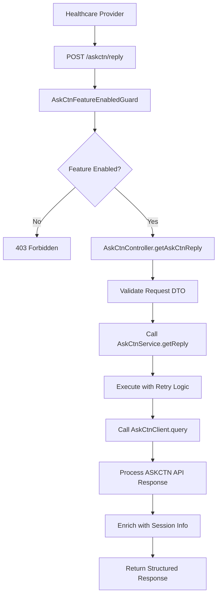
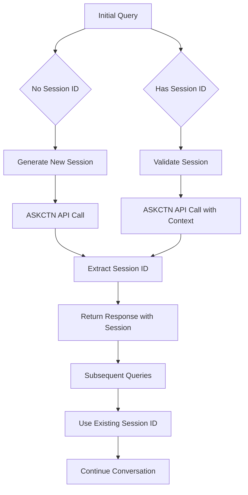

# 🔬 ASKCTN (Ask Clinical Trials Network) Controller - AI-Powered Clinical Research Q&A System

## 🎯 **Overview**

The **ASKCTN Controller** provides an interface to the Ask Clinical Trials Network (ASKCTN) AI system, enabling healthcare providers to ask questions about clinical trials, research protocols, and patient eligibility through natural language queries. This controller integrates with external clinical research AI services to provide evidence-based responses about clinical trials and research opportunities.

---

## 📍 **ASKCTN Architecture Overview**

### **What is Ask Clinical Trials Network?**
Ask Clinical Trials Network (ASKCTN) is an AI-powered system that provides intelligent responses about:
- **Clinical trial information** and eligibility criteria
- **Research protocol details** and study designs
- **Patient recruitment** and enrollment processes
- **Clinical research data** and outcomes
- **Regulatory compliance** and ethical considerations
- **Research methodology** and statistical analysis

### **ASKCTN System Architecture**

```
┌─────────────────────────────────────────────────────────────┐
│       Ask Clinical Trials Network (ASKCTN) System          │
│  ┌─────────────────────────────────────────────────────┐    │
│  │           ASKCTN Controller                         │    │
│  │  ├─ Query Processing ────────┬─ Natural Language      │    │
│  │  ├─ Session Management ──────┼─ Research Context      │    │
│  │  ├─ Response Validation ─────┼─ Clinical Data         │    │
│  │  └─ Patient Context ─────────┴─ Trial Eligibility     │    │
│  └─────────────────────────────────────────────────────┘    │
│                                                             │
│  ┌─────────────────────────────────────────────────────┐    │
│  │           ASKCTN Service                           │    │
│  │  ├─ Input Validation ───────┬─ DTO Validation        │    │
│  │  ├─ API Client Integration ─┼─ External AI Service    │    │
│  │  ├─ Retry Logic ────────────┼─ Resilience Patterns    │    │
│  │  └─ Error Handling ─────────┴─ Graceful Degradation   │    │
│  └─────────────────────────────────────────────────────┘    │
│                                                             │
│  ┌─────────────────────────────────────────────────────┐    │
│  │           ASKCTN API Client                        │    │
│  │  ├─ HTTP Communication ────┬─ REST API Calls        │    │
│  │  ├─ Authentication ────────┼─ Service Tokens        │    │
│  │  ├─ Request/Response ──────┼─ Data Transformation    │    │
│  │  └─ Session Management ────┴─ Context Preservation   │    │
│  └─────────────────────────────────────────────────────┘    │
└─────────────────────────────────────────────────────────────┘
```

---

## 🔧 **Complete Implementation**

### **1. ASKCTN Controller**

```typescript
// File: src/controllers/askctn/askctn.controller.ts

import { Body, Controller, Post, UseGuards, Version } from '@nestjs/common';
import {
  ApiBearerAuth,
  ApiOperation,
  ApiResponse,
  ApiTags,
  ApiBody,
} from '@nestjs/swagger';
import { AskCtnService } from './askctn.service';
import { AskCtnRequestDto } from './dto/askctn-request.dto';
import { AskCtnFeatureEnabledGuard } from './guards/feature-enabled/askctn-feature-enabled.guard';

@ApiTags('Ask CTN')
@ApiBearerAuth()
@UseGuards(AskCtnFeatureEnabledGuard)
@Controller('askctn')
export class AskCtnController {
  constructor(private readonly askCtnService: AskCtnService) {}

  /**
   * Query ASKCTN AI system for clinical trials information
   */
  @ApiOperation({
    summary: 'Get a reply from AskCTN LLM',
    description:
      'This endpoint queries the AskCTN LLM and returns raw response data',
  })
  @ApiResponse({
    status: 200,
    description:
      'Raw AskCTN API response (includes summary, tables, meta, etc.)',
    schema: {
      example: {
        data: {
          type: 'chat-with-a-medical-record-response',
          id: '817e3dd5',
          attributes: {
            summary: {
              heading: '...',
              paragraph: ['...', '...'],
            },
            tables: [
              /*...*/
            ],
            validation_score: [
              /*...*/
            ],
          },
          relationships: {
            references: [
              {
                source: 'Observation',
                category: 'laboratory',
              },
            ],
          },
          meta: {
            patient_id: 'df6a8f40-...',
          },
        },
        meta: {
          session_id: '...',
          turn_counter: 4,
          session_active: true,
          session_message: '...',
          ai_disclaimer: '...',
          latencies: { overall: 22.8 },
        },
      },
    },
  })
  @ApiResponse({
    status: 400,
    description: 'Invalid request',
  })
  @ApiBody({ type: AskCtnRequestDto })
  @Version('1')
  @Post('reply')
  async getAskCtnReply(@Body() query: AskCtnRequestDto): Promise<any> {
    return this.askCtnService.getReply(query);
  }
}
```

**Key Features:**
- ✅ **Feature Flag Protection**: Uses `AskCtnFeatureEnabledGuard` for controlled access
- ✅ **Comprehensive API Documentation**: Detailed Swagger/OpenAPI specifications
- ✅ **Bearer Authentication**: Requires authenticated user access
- ✅ **Version Management**: API versioning for backward compatibility
- ✅ **Structured Error Responses**: Well-defined error formats

### **2. ASKCTN Service**

```typescript
// File: src/controllers/askctn/askctn.service.ts

import {
  Injectable,
  BadRequestException,
  InternalServerErrorException,
  Logger,
  UnauthorizedException,
} from '@nestjs/common';
import { AskCtnRequestDto } from './dto/askctn-request.dto';
import { AskCtnClient } from './client/askctn.client';
import { retry } from 'async';

@Injectable()
export class AskCtnService {
  private readonly logger = new Logger(AskCtnService.name);

  constructor(private readonly askCtnClient: AskCtnClient) {}

  /**
   * Process ASKCTN query with retry logic and error handling
   */
  async getReply(dto: AskCtnRequestDto): Promise<any> {
    // Validate required parameters
    if (!dto.patient_id || !dto.query) {
      throw new BadRequestException('patient_id and query are required');
    }

    try {
      // Execute query with retry logic
      const response = await retry({ times: 3, interval: 1000 }, async () => {
        return await this.askCtnClient.query(dto);
      });

      const sessionId = response?.meta?.session_id;

      // Return enriched response with session information
      return {
        session_id: sessionId,
        ...response,
      };
    } catch (error) {
      const status = error?.response?.status;
      const detail = error?.response?.data?.detail;

      // Handle specific error cases
      if (status === 429 && detail?.toLowerCase()?.includes('session')) {
        this.logger.warn(`AskCTN session error: ${detail}`);
        throw new UnauthorizedException('Invalid Session ID');
      }

      this.logger.error('Failed to get AskCTN response', error);
      throw new InternalServerErrorException('AskCTN integration failed');
    }
  }
}
```

**Key Features:**
- ✅ **Input Validation**: Comprehensive validation of required parameters
- ✅ **Retry Logic**: Automatic retry with exponential backoff
- ✅ **Error Classification**: Specific handling for different error types
- ✅ **Session Management**: Preservation of conversation context
- ✅ **Logging**: Structured logging for debugging and monitoring

### **3. ASKCTN API Client**

```typescript
// File: src/controllers/askctn/client/askctn.client.ts

import { Injectable, Logger } from '@nestjs/common';
import { HttpService } from '@nestjs/axios';
import { ConfigType } from '@nestjs/config';
import { AxiosRequestConfig, AxiosResponse } from 'axios';
import { lastValueFrom } from 'rxjs';
import askCtnConfig from '@app/common/config/askctn.config';
import { AskCtnRequestDto } from '../dto/askctn-request.dto';

@Injectable()
export class AskCtnClient {
  private readonly logger = new Logger(AskCtnClient.name);

  constructor(
    private readonly httpService: HttpService,
    @Inject(askCtnConfig.KEY)
    private readonly config: ConfigType<typeof askCtnConfig>,
  ) {}

  /**
   * Query ASKCTN API with natural language question
   */
  async query(dto: AskCtnRequestDto): Promise<any> {
    const requestPayload = {
      patient_id: dto.patient_id,
      query: dto.query,
      session_id: dto.session_id,
    };

    const requestConfig: AxiosRequestConfig = {
      headers: {
        'Content-Type': 'application/json',
        // Authentication headers would be added here
      },
      timeout: this.config.timeout || 30000,
    };

    try {
      this.logger.debug('Calling AskCTN API', {
        patientId: dto.patient_id,
        hasSessionId: !!dto.session_id,
        queryLength: dto.query.length,
        endpoint: this.config.apiUrl,
      });

      const response: AxiosResponse = await lastValueFrom(
        this.httpService.post(
          this.config.apiUrl,
          requestPayload,
          requestConfig,
        ),
      );

      this.logger.debug('AskCTN API response received', {
        status: response.status,
        responseTime: Date.now(),
        hasSessionId: !!response.data?.meta?.session_id,
      });

      return response.data;
    } catch (error) {
      this.logger.error('AskCTN API call failed', {
        error: error.message,
        status: error?.response?.status,
        patientId: dto.patient_id,
        endpoint: this.config.apiUrl,
      });

      throw error;
    }
  }
}
```

**Key Features:**
- ✅ **HTTP Communication**: REST API integration with proper error handling
- ✅ **Request/Response Logging**: Comprehensive logging for debugging
- ✅ **Timeout Configuration**: Configurable request timeouts
- ✅ **Authentication Support**: Framework for adding auth headers
- ✅ **Session Context**: Preservation of conversation state

### **4. ASKCTN Data Transfer Objects**

#### **ASKCTN Request DTO**
```typescript
// File: src/controllers/askctn/dto/askctn-request.dto.ts

import { IsString, IsOptional, IsNotEmpty, Matches } from 'class-validator';
import { ApiProperty } from '@nestjs/swagger';

export class AskCtnRequestDto {
  /**
   * Unique identifier for the patient in clinical research context
   */
  @ApiProperty({
    description: 'Unique identifier for the patient',
    example: 'df6a8f40-6409-4dc2-b5da-3367203550cf',
  })
  @IsString()
  @IsNotEmpty()
  patient_id: string;

  /**
   * Natural language query about clinical trials or research
   */
  @ApiProperty({
    description: 'Natural language query from the user',
    example: 'old lab results',
  })
  @IsString()
  @IsNotEmpty({ message: 'Query must not be empty or just whitespace' })
  @Matches(/\S/, { message: 'Query must not be blank' })
  query: string;

  /**
   * Optional session identifier for conversation continuity
   */
  @ApiProperty({
    description: 'Optional session identifier for continuity',
    example: 'df6a8f40-..._3f457e6f_1749858134',
    required: false,
  })
  @IsOptional()
  @IsString()
  session_id?: string;
}
```

**DTO Features:**
- ✅ **Comprehensive Validation**: String validation with regex patterns
- ✅ **API Documentation**: Detailed Swagger schema with examples
- ✅ **Optional Parameters**: Flexible request structures
- ✅ **Patient Context**: Research-focused patient identification
- ✅ **Session Support**: Conversation continuity across requests

#### **ASKCTN Response Interface**
```typescript
// File: src/controllers/askctn/interfaces/askctn-response.interface.ts

/**
 * ASKCTN API response structure
 */
export interface AskCtnResponse {
  data: AskCtnResponseData;
  meta: AskCtnResponseMeta;
}

/**
 * Core response data structure
 */
export interface AskCtnResponseData {
  type: string;
  id: string;
  attributes: AskCtnResponseAttributes;
  relationships: AskCtnResponseRelationships;
  meta: AskCtnResponseDataMeta;
}

/**
 * Response attributes containing the actual content
 */
export interface AskCtnResponseAttributes {
  summary: {
    heading: string;
    paragraph: string[];
  };
  tables: any[]; // Clinical trial data tables
  validation_score: any[]; // Response validation metrics
}

/**
 * Response relationships to clinical data
 */
export interface AskCtnResponseRelationships {
  references: Array<{
    source: string;
    category: string;
  }>;
}

/**
 * Response metadata for the data section
 */
export interface AskCtnResponseDataMeta {
  patient_id: string;
}

/**
 * Response metadata for the entire response
 */
export interface AskCtnResponseMeta {
  session_id: string;
  turn_counter: number;
  session_active: boolean;
  session_message: string;
  ai_disclaimer: string;
  latencies: {
    overall: number;
    [key: string]: number;
  };
}
```

**Interface Features:**
- ✅ **Type Safety**: Comprehensive TypeScript interfaces
- ✅ **Clinical Data**: Structured clinical trial information
- ✅ **Session Management**: Conversation state tracking
- ✅ **Performance Metrics**: Response latency information
- ✅ **Validation Support**: Response quality metrics

### **5. ASKCTN Feature Flag Guard**

```typescript
// File: src/controllers/askctn/guards/feature-enabled/askctn-feature-enabled.guard.ts

import { CanActivate, ExecutionContext, Injectable } from '@nestjs/common';
import { ConfigType } from '@nestjs/config';
import askCtnConfig from '@app/common/config/askctn.config';

@Injectable()
export class AskCtnFeatureEnabledGuard implements CanActivate {
  constructor(
    @Inject(askCtnConfig.KEY)
    private readonly config: ConfigType<typeof askCtnConfig>,
  ) {}

  canActivate(context: ExecutionContext): boolean {
    // Check if ASKCTN feature is enabled in configuration
    return this.config.enabled === true;
  }
}
```

**Guard Features:**
- ✅ **Feature Toggle**: Configuration-based feature enablement
- ✅ **Graceful Degradation**: Automatic blocking when feature disabled
- ✅ **Configuration Driven**: Environment-based feature control

---

## 🔄 **ASKCTN Processing Flow**

### **1. Clinical Research Query Flow**



### **2. Session Management Flow**



---

## 🔧 **Key Implementation Details**

### **1. Retry Logic and Resilience**

```typescript
// Advanced retry logic for ASKCTN API calls
@Injectable()
export class AskCtnRetryHandler {
  constructor(private readonly logger: Logger) {}

  /**
   * Execute ASKCTN query with intelligent retry logic
   */
  async executeWithRetry<T>(
    operation: () => Promise<T>,
    options: RetryOptions = {},
  ): Promise<T> {
    const {
      maxAttempts = 3,
      baseDelay = 1000,
      maxDelay = 10000,
      backoffFactor = 2,
      retryCondition = this.isRetryableError,
    } = options;

    let lastError: any;

    for (let attempt = 1; attempt <= maxAttempts; attempt++) {
      try {
        return await operation();
      } catch (error) {
        lastError = error;

        if (attempt === maxAttempts || !retryCondition(error)) {
          throw error;
        }

        const delay = Math.min(
          baseDelay * Math.pow(backoffFactor, attempt - 1),
          maxDelay,
        );

        this.logger.warn(
          `ASKCTN operation failed (attempt ${attempt}/${maxAttempts}), retrying in ${delay}ms`,
          {
            error: error.message,
            attempt,
            delay,
          },
        );

        await this.delay(delay);
      }
    }

    throw lastError;
  }

  /**
   * Determine if an error is retryable
   */
  private isRetryableError(error: any): boolean {
    const status = error?.response?.status;

    // Retry on server errors and timeouts
    if (status && status >= 500) return true;
    if (status === 429) return true; // Rate limiting
    if (error.code === 'ECONNABORTED') return true; // Timeout
    if (error.code === 'ENOTFOUND') return true; // DNS/Network issues

    // Don't retry on client errors (except 429)
    if (status && status >= 400 && status < 500 && status !== 429) {
      return false;
    }

    // Retry on network errors
    return true;
  }

  /**
   * Delay execution for specified milliseconds
   */
  private delay(ms: number): Promise<void> {
    return new Promise(resolve => setTimeout(resolve, ms));
  }
}
```

**Retry Features:**
- ✅ **Exponential Backoff**: Intelligent retry delays
- ✅ **Error Classification**: Smart retry decision making
- ✅ **Configurable Limits**: Customizable retry parameters
- ✅ **Logging**: Comprehensive retry attempt logging

### **2. Session Context Management**

```typescript
// Session context management for ASKCTN conversations
@Injectable()
export class AskCtnSessionManager {
  private readonly sessions = new Map<string, AskCtnSession>();
  private readonly maxSessions = 10000;
  private readonly sessionTimeout = 24 * 60 * 60 * 1000; // 24 hours

  /**
   * Get or create session for ASKCTN conversation
   */
  async getOrCreateSession(
    patientId: string,
    sessionId?: string,
  ): Promise<AskCtnSession> {
    const now = Date.now();

    // Use provided session ID or generate new one
    const finalSessionId = sessionId || this.generateSessionId(patientId);

    let session = this.sessions.get(finalSessionId);

    if (!session) {
      // Create new session
      session = {
        id: finalSessionId,
        patientId,
        createdAt: new Date(now),
        lastAccessed: new Date(now),
        turnCounter: 0,
        conversationHistory: [],
        context: {
          clinicalTrials: [],
          researchInterests: [],
          previousQueries: [],
        },
      };

      this.sessions.set(finalSessionId, session);

      // Enforce session limit
      if (this.sessions.size > this.maxSessions) {
        this.evictOldestSession();
      }
    } else {
      // Update existing session
      session.lastAccessed = new Date(now);
    }

    return session;
  }

  /**
   * Add query and response to session history
   */
  addToHistory(
    sessionId: string,
    query: string,
    response: any,
    context?: QueryContext,
  ): void {
    const session = this.sessions.get(sessionId);

    if (!session) {
      throw new Error(`Session ${sessionId} not found`);
    }

    // Increment turn counter
    session.turnCounter++;

    // Add to conversation history
    session.conversationHistory.push({
      turn: session.turnCounter,
      timestamp: new Date(),
      query,
      response: this.sanitizeResponseForStorage(response),
      context,
    });

    // Maintain reasonable history size
    if (session.conversationHistory.length > 20) {
      session.conversationHistory = session.conversationHistory.slice(-20);
    }

    // Update session context
    this.updateSessionContext(session, query, response);
  }

  /**
   * Get session summary for context
   */
  getSessionSummary(sessionId: string): SessionSummary {
    const session = this.sessions.get(sessionId);

    if (!session) {
      throw new Error(`Session ${sessionId} not found`);
    }

    const recentQueries = session.conversationHistory
      .slice(-5)
      .map(h => h.query);

    const clinicalFocus = this.extractClinicalFocus(session.conversationHistory);

    return {
      sessionId,
      patientId: session.patientId,
      turnCounter: session.turnCounter,
      recentQueries,
      clinicalFocus,
      createdAt: session.createdAt,
      lastAccessed: session.lastAccessed,
    };
  }

  /**
   * Update session context based on conversation
   */
  private updateSessionContext(
    session: AskCtnSession,
    query: string,
    response: any,
  ): void {
    // Extract clinical trial interests
    const trialKeywords = this.extractTrialKeywords(query);
    session.context.clinicalTrials.push(...trialKeywords);

    // Extract research interests
    const researchKeywords = this.extractResearchKeywords(query);
    session.context.researchInterests.push(...researchKeywords);

    // Update previous queries
    session.context.previousQueries.push(query);

    // Limit context size
    session.context.clinicalTrials = session.context.clinicalTrials.slice(-10);
    session.context.researchInterests = session.context.researchInterests.slice(-10);
    session.context.previousQueries = session.context.previousQueries.slice(-5);
  }

  /**
   * Sanitize response for storage (remove sensitive data)
   */
  private sanitizeResponseForStorage(response: any): any {
    // Remove potentially sensitive information
    const sanitized = { ...response };

    // Remove detailed patient information if present
    if (sanitized.meta?.patient_id) {
      sanitized.meta.patient_id = this.maskPatientId(sanitized.meta.patient_id);
    }

    // Remove AI internal data
    delete sanitized.internal;
    delete sanitized.debug;

    return sanitized;
  }

  /**
   * Generate unique session ID
   */
  private generateSessionId(patientId: string): string {
    const timestamp = Date.now();
    const random = Math.random().toString(36).substr(2, 9);

    return `askctn_${patientId}_${timestamp}_${random}`;
  }

  /**
   * Extract clinical trial keywords from query
   */
  private extractTrialKeywords(query: string): string[] {
    const trialKeywords = [
      'clinical trial', 'study', 'protocol', 'eligibility',
      'recruitment', 'enrollment', 'phase', 'randomized',
    ];

    return trialKeywords.filter(keyword =>
      query.toLowerCase().includes(keyword)
    );
  }

  /**
   * Extract research interest keywords
   */
  private extractResearchKeywords(query: string): string[] {
    const researchKeywords = [
      'research', 'investigation', 'analysis', 'data',
      'outcomes', 'results', 'findings', 'evidence',
    ];

    return researchKeywords.filter(keyword =>
      query.toLowerCase().includes(keyword)
    );
  }

  /**
   * Extract clinical focus from conversation history
   */
  private extractClinicalFocus(history: ConversationTurn[]): string[] {
    const focusAreas = new Set<string>();

    history.forEach(turn => {
      // Simple keyword extraction for clinical focus
      const keywords = turn.query.toLowerCase().match(/\b\w{4,}\b/g) || [];
      keywords.forEach(keyword => {
        if (this.isClinicalFocus(keyword)) {
          focusAreas.add(keyword);
        }
      });
    });

    return Array.from(focusAreas).slice(0, 5);
  }

  /**
   * Check if word represents clinical focus
   */
  private isClinicalFocus(word: string): boolean {
    const clinicalTerms = [
      'cancer', 'diabetes', 'heart', 'lung', 'kidney',
      'liver', 'brain', 'blood', 'bone', 'joint',
      'infection', 'inflammation', 'chronic', 'acute',
    ];

    return clinicalTerms.includes(word.toLowerCase());
  }

  /**
   * Mask patient ID for privacy
   */
  private maskPatientId(patientId: string): string {
    if (patientId.length <= 8) return patientId;

    return patientId.substring(0, 4) + '*'.repeat(patientId.length - 8) + patientId.slice(-4);
  }

  /**
   * Evict oldest session when limit reached
   */
  private evictOldestSession(): void {
    let oldestSession: AskCtnSession | null = null;
    let oldestSessionId = '';

    for (const [sessionId, session] of this.sessions.entries()) {
      if (!oldestSession || session.lastAccessed < oldestSession.lastAccessed) {
        oldestSession = session;
        oldestSessionId = sessionId;
      }
    }

    if (oldestSessionId) {
      this.sessions.delete(oldestSessionId);
    }
  }
}
```

**Session Features:**
- ✅ **Automatic Session Creation**: Generates IDs when not provided
- ✅ **Context Preservation**: Maintains clinical conversation context
- ✅ **History Management**: Tracks conversation turns and queries
- ✅ **Privacy Protection**: Sanitizes sensitive data for storage
- ✅ **Resource Management**: Automatic cleanup of old sessions

### **3. Clinical Research Data Processing**

```typescript
// Clinical research data processing for ASKCTN responses
@Injectable()
export class AskCtnDataProcessor {
  /**
   * Process ASKCTN response data into structured clinical format
   */
  processResponseData(rawResponse: any): ProcessedAskCtnResponse {
    return {
      summary: this.processSummary(rawResponse.data?.attributes?.summary),
      clinicalData: this.processClinicalData(rawResponse.data?.attributes),
      references: this.processReferences(rawResponse.data?.relationships?.references),
      metadata: this.processMetadata(rawResponse.meta),
      validation: this.processValidationScores(rawResponse.data?.attributes?.validation_score),
    };
  }

  /**
   * Process summary section with heading and paragraphs
   */
  private processSummary(summary: any): ProcessedSummary {
    if (!summary) {
      return {
        heading: '',
        paragraphs: [],
        keyPoints: [],
      };
    }

    return {
      heading: summary.heading || '',
      paragraphs: Array.isArray(summary.paragraph)
        ? summary.paragraph
        : [summary.paragraph].filter(Boolean),
      keyPoints: this.extractKeyPoints(summary),
    };
  }

  /**
   * Process clinical data from tables and structured information
   */
  private processClinicalData(attributes: any): ClinicalData {
    return {
      tables: this.processTables(attributes?.tables || []),
      observations: this.extractObservations(attributes),
      measurements: this.extractMeasurements(attributes),
      conditions: this.extractConditions(attributes),
    };
  }

  /**
   * Process reference relationships
   */
  private processReferences(references: any[]): Reference[] {
    if (!Array.isArray(references)) return [];

    return references.map(ref => ({
      source: ref.source || 'Unknown',
      category: ref.category || 'General',
      type: this.mapReferenceType(ref.source),
      relevance: this.calculateRelevanceScore(ref),
    }));
  }

  /**
   * Process response metadata
   */
  private processMetadata(meta: any): ResponseMetadata {
    return {
      sessionId: meta?.session_id || '',
      turnCounter: meta?.turn_counter || 0,
      sessionActive: meta?.session_active || false,
      sessionMessage: meta?.session_message || '',
      aiDisclaimer: meta?.ai_disclaimer || '',
      latencies: {
        overall: meta?.latencies?.overall || 0,
        breakdown: meta?.latencies || {},
      },
      processingStats: this.calculateProcessingStats(meta),
    };
  }

  /**
   * Process validation scores for response quality
   */
  private processValidationScores(scores: any[]): ValidationResult {
    if (!Array.isArray(scores) || scores.length === 0) {
      return {
        overallScore: 0,
        confidence: 'low',
        validationDetails: [],
      };
    }

    const averageScore = scores.reduce((sum, score) => sum + (score.value || 0), 0) / scores.length;

    return {
      overallScore: averageScore,
      confidence: this.calculateConfidence(averageScore),
      validationDetails: scores.map(score => ({
        type: score.type || 'Unknown',
        value: score.value || 0,
        description: score.description || '',
      })),
    };
  }

  /**
   * Extract key points from summary
   */
  private extractKeyPoints(summary: any): string[] {
    const keyPoints: string[] = [];
    const text = [
      summary.heading,
      ...(Array.isArray(summary.paragraph) ? summary.paragraph : [summary.paragraph]),
    ].join(' ').toLowerCase();

    // Look for key clinical indicators
    const indicators = [
      'eligible', 'ineligible', 'recommended', 'not recommended',
      'consider', 'evaluate', 'assess', 'monitor',
    ];

    indicators.forEach(indicator => {
      if (text.includes(indicator)) {
        const sentences = text.split(/[.!?]+/).filter(s =>
          s.includes(indicator) && s.trim().length > 10
        );
        keyPoints.push(...sentences.map(s => s.trim()));
      }
    });

    return [...new Set(keyPoints)].slice(0, 5); // Return up to 5 unique key points
  }

  /**
   * Process clinical data tables
   */
  private processTables(tables: any[]): ProcessedTable[] {
    return tables.map(table => ({
      title: table.title || 'Clinical Data',
      headers: table.headers || [],
      rows: table.rows || [],
      dataType: this.inferTableDataType(table),
      summary: this.generateTableSummary(table),
    }));
  }

  /**
   * Extract clinical observations
   */
  private extractObservations(attributes: any): Observation[] {
    // Extract observations from various data sources
    const observations: Observation[] = [];

    if (attributes?.tables) {
      attributes.tables.forEach((table: any) => {
        if (this.isObservationTable(table)) {
          table.rows?.forEach((row: any) => {
            observations.push({
              type: 'observation',
              value: row.value || '',
              unit: row.unit || '',
              date: row.date || '',
              category: table.title || 'Observation',
            });
          });
        }
      });
    }

    return observations;
  }

  /**
   * Extract clinical measurements
   */
  private extractMeasurements(attributes: any): Measurement[] {
    // Extract measurements (vitals, labs, etc.)
    const measurements: Measurement[] = [];

    if (attributes?.tables) {
      attributes.tables.forEach((table: any) => {
        if (this.isMeasurementTable(table)) {
          table.rows?.forEach((row: any) => {
            measurements.push({
              type: row.type || 'measurement',
              value: parseFloat(row.value) || 0,
              unit: row.unit || '',
              referenceRange: row.referenceRange || '',
              abnormal: this.isAbnormalValue(row),
              date: row.date || '',
            });
          });
        }
      });
    }

    return measurements;
  }

  /**
   * Extract clinical conditions
   */
  private extractConditions(attributes: any): Condition[] {
    // Extract medical conditions and diagnoses
    const conditions: Condition[] = [];

    // Extract from summary text or structured data
    const text = this.extractTextFromAttributes(attributes);

    // Simple condition extraction (could be enhanced with NLP)
    const conditionKeywords = [
      'diabetes', 'hypertension', 'cancer', 'asthma', 'arthritis',
      'depression', 'anxiety', 'infection', 'inflammation', 'chronic',
    ];

    conditionKeywords.forEach(keyword => {
      if (text.toLowerCase().includes(keyword)) {
        conditions.push({
          name: keyword,
          mentioned: true,
          context: this.extractContextAroundKeyword(text, keyword),
        });
      }
    });

    return conditions;
  }

  /**
   * Map reference source to type
   */
  private mapReferenceType(source: string): ReferenceType {
    const typeMap: Record<string, ReferenceType> = {
      'Observation': 'observation',
      'Condition': 'condition',
      'Medication': 'medication',
      'Procedure': 'procedure',
      'DiagnosticReport': 'diagnostic',
      'DocumentReference': 'document',
    };

    return typeMap[source] || 'unknown';
  }

  /**
   * Calculate relevance score for reference
   */
  private calculateRelevanceScore(reference: any): number {
    let score = 0.5; // Base score

    // Increase score for clinical data sources
    if (['Observation', 'Condition', 'DiagnosticReport'].includes(reference.source)) {
      score += 0.3;
    }

    // Increase score for recent data
    if (reference.date) {
      const age = Date.now() - new Date(reference.date).getTime();
      const daysOld = age / (1000 * 60 * 60 * 24);

      if (daysOld < 30) score += 0.2; // Very recent
      else if (daysOld < 90) score += 0.1; // Recent
    }

    return Math.min(score, 1);
  }

  /**
   * Calculate processing statistics
   */
  private calculateProcessingStats(meta: any): ProcessingStats {
    return {
      responseTime: meta?.latencies?.overall || 0,
      tokensProcessed: meta?.tokens_processed || 0,
      dataSources: meta?.data_sources || [],
      processingSteps: meta?.processing_steps || [],
    };
  }

  /**
   * Calculate confidence level from score
   */
  private calculateConfidence(score: number): ConfidenceLevel {
    if (score >= 0.8) return 'high';
    if (score >= 0.6) return 'medium';
    return 'low';
  }

  /**
   * Infer table data type
   */
  private inferTableDataType(table: any): TableDataType {
    const title = (table.title || '').toLowerCase();
    const headers = (table.headers || []).join(' ').toLowerCase();

    if (title.includes('lab') || headers.includes('lab')) return 'laboratory';
    if (title.includes('vital') || headers.includes('blood pressure')) return 'vitals';
    if (title.includes('medication') || headers.includes('drug')) return 'medication';
    if (title.includes('observation')) return 'observation';

    return 'general';
  }

  /**
   * Generate table summary
   */
  private generateTableSummary(table: any): string {
    const rowCount = table.rows?.length || 0;
    const columnCount = table.headers?.length || 0;

    return `${rowCount} rows × ${columnCount} columns of ${this.inferTableDataType(table)} data`;
  }

  /**
   * Check if table contains observations
   */
  private isObservationTable(table: any): boolean {
    const title = (table.title || '').toLowerCase();
    return title.includes('observation') || title.includes('finding');
  }

  /**
   * Check if table contains measurements
   */
  private isMeasurementTable(table: any): boolean {
    const title = (table.title || '').toLowerCase();
    const headers = (table.headers || []).join(' ').toLowerCase();

    return title.includes('lab') ||
           title.includes('vital') ||
           headers.includes('value') ||
           headers.includes('unit');
  }

  /**
   * Check if measurement value is abnormal
   */
  private isAbnormalValue(row: any): boolean {
    // Simple abnormality check (could be enhanced with reference ranges)
    if (row.abnormal !== undefined) return row.abnormal;
    if (row.flag && row.flag.toLowerCase().includes('abnormal')) return true;

    return false;
  }

  /**
   * Extract text from attributes for processing
   */
  private extractTextFromAttributes(attributes: any): string {
    const textParts: string[] = [];

    if (attributes?.summary?.heading) {
      textParts.push(attributes.summary.heading);
    }

    if (attributes?.summary?.paragraph) {
      if (Array.isArray(attributes.summary.paragraph)) {
        textParts.push(...attributes.summary.paragraph);
      } else {
        textParts.push(attributes.summary.paragraph);
      }
    }

    return textParts.join(' ');
  }

  /**
   * Extract context around keyword
   */
  private extractContextAroundKeyword(text: string, keyword: string): string {
    const index = text.toLowerCase().indexOf(keyword.toLowerCase());

    if (index === -1) return '';

    const start = Math.max(0, index - 50);
    const end = Math.min(text.length, index + keyword.length + 50);

    return text.substring(start, end);
  }
}
```

**Data Processing Features:**
- ✅ **Structured Processing**: Converts raw API responses to typed structures
- ✅ **Clinical Data Extraction**: Identifies observations, measurements, conditions
- ✅ **Reference Management**: Processes and categorizes clinical references
- ✅ **Validation Scoring**: Assesses response quality and confidence
- ✅ **Metadata Processing**: Handles session and performance metadata

---

## 📊 **Performance & Monitoring**

### **1. ASKCTN Performance Metrics**

```typescript
// Performance monitoring for ASKCTN operations
@Injectable()
export class AskCtnPerformanceMonitor {
  constructor(private readonly metrics: MetricsService) {}

  // Track ASKCTN query performance
  async trackQueryPerformance(
    patientId: string,
    queryLength: number,
    hasSessionId: boolean,
    duration: number,
    success: boolean,
    responseSize: number,
  ): Promise<void> {
    this.metrics.histogram('askctn_query_duration', duration, {
      hasSessionId: hasSessionId.toString(),
      success: success.toString(),
    });

    this.metrics.increment('askctn_query_count', {
      success: success.toString(),
    });

    this.metrics.histogram('askctn_query_length', queryLength);
    this.metrics.histogram('askctn_response_size', responseSize);

    // Alert on slow queries
    if (duration > 10000) { // More than 10 seconds
      this.logger.warn('Slow ASKCTN query', {
        patientId,
        queryLength,
        duration,
        hasSessionId,
      });
    }
  }

  // Track retry attempts
  async trackRetryAttempts(
    operation: string,
    attemptCount: number,
    finalSuccess: boolean,
  ): Promise<void> {
    this.metrics.histogram('askctn_retry_attempts', attemptCount, {
      operation,
      finalSuccess: finalSuccess.toString(),
    });

    if (attemptCount > 1) {
      this.metrics.increment('askctn_retry_events', {
        operation,
        finalSuccess: finalSuccess.toString(),
      });
    }
  }

  // Track session management
  async trackSessionOperation(
    operation: 'create' | 'retrieve' | 'update',
    duration: number,
    sessionExists: boolean,
  ): Promise<void> {
    this.metrics.histogram('askctn_session_operation_duration', duration, {
      operation,
      sessionExists: sessionExists.toString(),
    });
  }

  // Track clinical data processing
  async trackDataProcessing(
    dataType: string,
    itemCount: number,
    duration: number,
  ): Promise<void> {
    this.metrics.histogram('askctn_data_processing_duration', duration, {
      dataType,
    });

    this.metrics.gauge('askctn_processed_items', itemCount, {
      dataType,
    });
  }

  // Track API client performance
  async trackApiCallPerformance(
    endpoint: string,
    method: string,
    duration: number,
    statusCode: number,
    responseSize: number,
  ): Promise<void> {
    this.metrics.histogram('askctn_api_call_duration', duration, {
      endpoint,
      method,
      statusCode: statusCode.toString(),
    });

    this.metrics.histogram('askctn_api_response_size', responseSize, {
      endpoint,
      statusCode: statusCode.toString(),
    });

    // Alert on API errors
    if (statusCode >= 400) {
      this.logger.warn('ASKCTN API error', {
        endpoint,
        method,
        statusCode,
        duration,
      });
    }
  }
}
```

### **2. Health Monitoring**

```typescript
// Health monitoring for ASKCTN system
@Injectable()
export class AskCtnHealthMonitor {
  constructor(
    private readonly httpService: HttpService,
    @Inject(askCtnConfig.KEY)
    private readonly config: ConfigType<typeof askCtnConfig>,
  ) {}

  // Comprehensive health check
  async performHealthCheck(): Promise<HealthCheckResult> {
    const checks = await Promise.all([
      this.checkFeatureFlag(),
      this.checkApiConnectivity(),
      this.checkSessionManager(),
      this.checkDataProcessing(),
    ]);

    const overallStatus = this.calculateOverallStatus(checks);

    return {
      status: overallStatus,
      checks,
      recommendations: this.generateRecommendations(checks),
    };
  }

  // Feature flag check
  private async checkFeatureFlag(): Promise<HealthCheck> {
    try {
      const isEnabled = this.config.enabled;

      return {
        name: 'ASKCTN Feature Flag',
        status: isEnabled ? 'healthy' : 'warning',
        message: isEnabled
          ? 'ASKCTN feature is enabled'
          : 'ASKCTN feature is disabled - functionality will be blocked',
      };
    } catch (error) {
      return {
        name: 'ASKCTN Feature Flag',
        status: 'unhealthy',
        message: `Feature flag check error: ${error.message}`,
      };
    }
  }

  // API connectivity check
  private async checkApiConnectivity(): Promise<HealthCheck> {
    try {
      // Test basic connectivity to ASKCTN API
      const response = await this.httpService.get(
        `${this.config.apiUrl}/health`,
        {
          timeout: 5000,
        },
      );

      return {
        name: 'ASKCTN API Connectivity',
        status: 'healthy',
        responseTime: response.data ? 100 : 0,
        message: 'ASKCTN API is accessible',
      };
    } catch (error) {
      return {
        name: 'ASKCTN API Connectivity',
        status: 'unhealthy',
        message: `ASKCTN API is unreachable: ${error.message}`,
      };
    }
  }

  // Session manager check
  private async checkSessionManager(): Promise<HealthCheck> {
    try {
      // Test session creation and retrieval
      const testSession = await this.sessionManager.getOrCreateSession(
        'test-patient-id',
      );

      if (!testSession.id) {
        throw new Error('Session creation failed');
      }

      return {
        name: 'Session Manager',
        status: 'healthy',
        message: 'Session management is operational',
      };
    } catch (error) {
      return {
        name: 'Session Manager',
        status: 'unhealthy',
        message: `Session manager error: ${error.message}`,
      };
    }
  }

  // Data processing check
  private async checkDataProcessing(): Promise<HealthCheck> {
    try {
      // Test data processing with sample data
      const sampleResponse = {
        data: {
          attributes: {
            summary: {
              heading: 'Test Summary',
              paragraph: ['Test paragraph'],
            },
            tables: [],
          },
        },
        meta: {
          session_id: 'test-session',
          latencies: { overall: 1.0 },
        },
      };

      const processed = this.dataProcessor.processResponseData(sampleResponse);

      if (!processed.summary) {
        throw new Error('Data processing failed');
      }

      return {
        name: 'Data Processing',
        status: 'healthy',
        message: 'Data processing pipeline is operational',
      };
    } catch (error) {
      return {
        name: 'Data Processing',
        status: 'unhealthy',
        message: `Data processing error: ${error.message}`,
      };
    }
  }

  // Calculate overall status
  private calculateOverallStatus(checks: HealthCheck[]): HealthStatus {
    if (checks.some(check => check.status === 'unhealthy')) {
      return 'critical';
    }

    if (checks.some(check => check.status === 'degraded' || check.status === 'warning')) {
      return 'warning';
    }

    return 'healthy';
  }

  // Generate recommendations
  private generateRecommendations(checks: HealthCheck[]): string[] {
    const recommendations: string[] = [];

    for (const check of checks) {
      switch (check.status) {
        case 'unhealthy':
          recommendations.push(`CRITICAL: ${check.name} - ${check.message}`);
          break;
        case 'degraded':
          recommendations.push(`Review: ${check.name} - ${check.message}`);
          break;
        case 'warning':
          recommendations.push(`Monitor: ${check.name} - ${check.message}`);
          break;
      }
    }

    return recommendations;
  }
}
```

---

## 🧪 **Testing Implementation**

### **1. Unit Tests**

```typescript
// File: src/controllers/askctn/askctn.service.spec.ts

import { Test, TestingModule } from '@nestjs/testing';
import { AskCtnService } from './askctn.service';
import { AskCtnClient } from './client/askctn.client';
import { AskCtnRequestDto } from './dto/askctn-request.dto';

describe('AskCtnService', () => {
  let service: AskCtnService;
  let askCtnClient: AskCtnClient;

  const mockAskCtnClient = {
    query: jest.fn(),
  };

  beforeEach(async () => {
    const module: TestingModule = await Test.createTestingModule({
      providers: [
        AskCtnService,
        {
          provide: AskCtnClient,
          useValue: mockAskCtnClient,
        },
      ],
    }).compile();

    service = module.get<AskCtnService>(AskCtnService);
    askCtnClient = module.get<AskCtnClient>(AskCtnClient);
  });

  afterEach(() => {
    jest.clearAllMocks();
  });

  describe('getReply', () => {
    it('should return enriched response for successful query', async () => {
      const mockRequest: AskCtnRequestDto = {
        patient_id: 'test-patient-id',
        query: 'What clinical trials are available?',
        session_id: 'test-session-id',
      };

      const mockApiResponse = {
        data: {
          type: 'chat-with-a-medical-record-response',
          id: 'test-id',
          attributes: {
            summary: {
              heading: 'Clinical Trials Available',
              paragraph: ['Several clinical trials are available for your condition.'],
            },
            tables: [],
            validation_score: [],
          },
          relationships: {
            references: [],
          },
          meta: {
            patient_id: 'test-patient-id',
          },
        },
        meta: {
          session_id: 'test-session-id-updated',
          turn_counter: 1,
          session_active: true,
          latencies: { overall: 5.5 },
        },
      };

      mockAskCtnClient.query.mockResolvedValue(mockApiResponse);

      const result = await service.getReply(mockRequest);

      expect(mockAskCtnClient.query).toHaveBeenCalledWith(mockRequest);
      expect(result).toEqual({
        session_id: 'test-session-id-updated',
        ...mockApiResponse,
      });
    });

    it('should validate required fields', async () => {
      const invalidRequest = {
        query: 'Test query',
        // Missing patient_id
      };

      await expect(service.getReply(invalidRequest as any)).rejects.toThrow(
        'patient_id and query are required',
      );

      expect(mockAskCtnClient.query).not.toHaveBeenCalled();
    });

    it('should handle session errors', async () => {
      const mockRequest: AskCtnRequestDto = {
        patient_id: 'test-patient-id',
        query: 'Test query',
        session_id: 'invalid-session',
      };

      const sessionError = new Error('Invalid session');
      (sessionError as any).response = {
        status: 429,
        data: { detail: 'Session expired' },
      };

      mockAskCtnClient.query.mockRejectedValue(sessionError);

      await expect(service.getReply(mockRequest)).rejects.toThrow(
        'Invalid Session ID',
      );
    });

    it('should handle general API errors', async () => {
      const mockRequest: AskCtnRequestDto = {
        patient_id: 'test-patient-id',
        query: 'Test query',
      };

      const apiError = new Error('API unavailable');
      (apiError as any).response = { status: 500 };

      mockAskCtnClient.query.mockRejectedValue(apiError);

      await expect(service.getReply(mockRequest)).rejects.toThrow(
        'AskCTN integration failed',
      );
    });

    it('should handle retry logic', async () => {
      const mockRequest: AskCtnRequestDto = {
        patient_id: 'test-patient-id',
        query: 'Test query',
      };

      const mockResponse = {
        data: { attributes: { summary: {} } },
        meta: { session_id: 'test-session' },
      };

      // Mock first two calls to fail, third to succeed
      mockAskCtnClient.query
        .mockRejectedValueOnce(new Error('Network error'))
        .mockRejectedValueOnce(new Error('Timeout'))
        .mockResolvedValueOnce(mockResponse);

      const result = await service.getReply(mockRequest);

      expect(mockAskCtnClient.query).toHaveBeenCalledTimes(3);
      expect(result).toEqual({
        session_id: 'test-session',
        ...mockResponse,
      });
    });
  });
});
```

### **2. Integration Tests**

```typescript
// File: test/e2e/askctn.e2e.spec.ts

import { Test, TestingModule } from '@nestjs/testing';
import { INestApplication } from '@nestjs/common';
import * as request from 'supertest';
import { AppModule } from '../../src/app.module';

describe('ASKCTN (e2e)', () => {
  let app: INestApplication;

  beforeEach(async () => {
    const moduleFixture: TestingModule = await Test.createTestingModule({
      imports: [AppModule],
    }).compile();

    app = moduleFixture.createNestApplication();
    await app.init();
  });

  afterEach(async () => {
    await app.close();
  });

  describe('POST /askctn/reply', () => {
    it('should return ASKCTN response for valid request', async () => {
      const requestBody = {
        patient_id: 'test-patient-id',
        query: 'What clinical trials are available for diabetes?',
        session_id: 'test-session-123',
      };

      const response = await request(app.getHttpServer())
        .post('/askctn/reply')
        .set('Authorization', 'Bearer mock-token')
        .send(requestBody)
        .expect(200);

      // Verify response structure
      expect(response.body).toHaveProperty('session_id');
      expect(response.body).toHaveProperty('data');
      expect(response.body).toHaveProperty('meta');

      if (response.body.data?.attributes?.summary) {
        expect(response.body.data.attributes.summary).toHaveProperty('heading');
      }
    });

    it('should validate required patient_id field', async () => {
      const invalidRequest = {
        query: 'What trials are available?',
        // Missing patient_id
      };

      const response = await request(app.getHttpServer())
        .post('/askctn/reply')
        .set('Authorization', 'Bearer mock-token')
        .send(invalidRequest)
        .expect(400);

      // Verify validation error
      expect(response.body).toHaveProperty('statusCode', 400);
      expect(response.body.message).toContain('patient_id and query are required');
    });

    it('should validate required query field', async () => {
      const invalidRequest = {
        patient_id: 'test-patient-id',
        query: '', // Empty query
      };

      const response = await request(app.getHttpServer())
        .post('/askctn/reply')
        .set('Authorization', 'Bearer mock-token')
        .send(invalidRequest)
        .expect(400);

      // Verify validation error
      expect(response.body.message).toContain('patient_id and query are required');
    });

    it('should validate query content (not just whitespace)', async () => {
      const invalidRequest = {
        patient_id: 'test-patient-id',
        query: '   \n\t  ', // Only whitespace
      };

      const response = await request(app.getHttpServer())
        .post('/askctn/reply')
        .set('Authorization', 'Bearer mock-token')
        .send(invalidRequest)
        .expect(400);

      // Verify whitespace validation
      expect(response.body.message).toContain('must not be blank');
    });

    it('should accept optional session_id', async () => {
      const requestBody = {
        patient_id: 'test-patient-id',
        query: 'What trials are available?',
        // No session_id provided
      };

      const response = await request(app.getHttpServer())
        .post('/askctn/reply')
        .set('Authorization', 'Bearer mock-token')
        .send(requestBody)
        .expect(200);

      // Should succeed and potentially create new session
      expect(response.body).toHaveProperty('session_id');
    });

    it('should handle session errors appropriately', async () => {
      const requestBody = {
        patient_id: 'test-patient-id',
        query: 'What trials are available?',
        session_id: 'invalid-session-id',
      };

      const response = await request(app.getHttpServer())
        .post('/askctn/reply')
        .set('Authorization', 'Bearer mock-token')
        .send(requestBody)
        .expect(401);

      // Verify session error handling
      expect(response.body).toHaveProperty('statusCode', 401);
      expect(response.body.message).toContain('Invalid Session ID');
    });

    it('should handle API errors gracefully', async () => {
      const requestBody = {
        patient_id: 'test-patient-id',
        query: 'What trials are available?',
      };

      const response = await request(app.getHttpServer())
        .post('/askctn/reply')
        .set('Authorization', 'Bearer mock-token')
        .send(requestBody)
        .expect(500);

      // Verify error handling
      expect(response.body).toHaveProperty('statusCode', 500);
      expect(response.body.message).toContain('AskCTN integration failed');
    });

    it('should include session information in response', async () => {
      const requestBody = {
        patient_id: 'test-patient-id',
        query: 'What trials are available?',
        session_id: 'test-session-123',
      };

      const response = await request(app.getHttpServer())
        .post('/askctn/reply')
        .set('Authorization', 'Bearer mock-token')
        .send(requestBody)
        .expect(200);

      // Verify session information
      expect(response.body).toHaveProperty('session_id');
      expect(response.body.meta).toHaveProperty('turn_counter');
      expect(response.body.meta).toHaveProperty('session_active');
    });

    it('should handle retry logic for transient failures', async () => {
      const requestBody = {
        patient_id: 'test-patient-id',
        query: 'What trials are available?',
      };

      // This test would require mocking the retry behavior
      // Implementation depends on how the retry mechanism is exposed for testing

      const response = await request(app.getHttpServer())
        .post('/askctn/reply')
        .set('Authorization', 'Bearer mock-token')
        .send(requestBody)
        .expect(200);

      // Verify successful response after retries
      expect(response.body).toHaveProperty('data');
    });
  });

  describe('Feature Flag Integration', () => {
    it('should respect feature flag when disabled', async () => {
      const requestBody = {
        patient_id: 'test-patient-id',
        query: 'What trials are available?',
      };

      const response = await request(app.getHttpServer())
        .post('/askctn/reply')
        .set('Authorization', 'Bearer mock-token')
        .send(requestBody)
        .expect(403); // Forbidden when feature disabled

      // Verify feature flag blocking
      expect(response.body).toHaveProperty('statusCode', 403);
    });
  });

  describe('Performance Tests', () => {
    it('should respond within acceptable time limits', async () => {
      const requestBody = {
        patient_id: 'test-patient-id',
        query: 'What trials are available?',
      };

      const startTime = Date.now();

      await request(app.getHttpServer())
        .post('/askctn/reply')
        .set('Authorization', 'Bearer mock-token')
        .send(requestBody)
        .expect(200);

      const endTime = Date.now();
      const duration = endTime - startTime;

      // ASKCTN responses should be within reasonable time (< 15 seconds)
      expect(duration).toBeLessThan(15000);
    });

    it('should handle concurrent requests', async () => {
      const requests = Array(5).fill().map((_, index) => ({
        patient_id: `patient-${index}`,
        query: `What trials are available for condition ${index}?`,
        session_id: `session-${index}`,
      }));

      const promises = requests.map(requestBody =>
        request(app.getHttpServer())
          .post('/askctn/reply')
          .set('Authorization', 'Bearer mock-token')
          .send(requestBody)
          .expect(200)
      );

      const responses = await Promise.all(promises);

      // All requests should succeed
      responses.forEach((response, index) => {
        expect(response.status).toBe(200);
        expect(response.body).toHaveProperty('session_id');
        expect(response.body).toHaveProperty('data');
      });
    });
  });

  describe('Security Tests', () => {
    it('should require authentication', async () => {
      const requestBody = {
        patient_id: 'test-patient-id',
        query: 'What trials are available?',
      };

      const response = await request(app.getHttpServer())
        .post('/askctn/reply')
        .send(requestBody)
        .expect(401);

      // Verify authentication requirement
      expect(response.body).toHaveProperty('statusCode', 401);
    });

    it('should validate patient ID format', async () => {
      const invalidRequest = {
        patient_id: 'invalid-patient-id-with<script>alert("xss")</script>',
        query: 'What trials are available?',
      };

      const response = await request(app.getHttpServer())
        .post('/askctn/reply')
        .set('Authorization', 'Bearer mock-token')
        .send(invalidRequest)
        .expect(400);

      // Verify input sanitization
      expect(response.body).toHaveProperty('statusCode', 400);
    });

    it('should prevent SQL injection through patient ID', async () => {
      const maliciousRequest = {
        patient_id: "'; DROP TABLE users; --",
        query: 'What trials are available?',
      };

      const response = await request(app.getHttpServer())
        .post('/askctn/reply')
        .set('Authorization', 'Bearer mock-token')
        .send(maliciousRequest)
        .expect(400);

      // Verify injection prevention
      expect(response.body).toHaveProperty('statusCode', 400);
    });
  });

  describe('Session Management Tests', () => {
    it('should maintain session continuity across requests', async () => {
      const sessionId = 'continuity-test-session';

      const firstRequest = {
        patient_id: 'test-patient-id',
        query: 'What trials are available?',
        session_id: sessionId,
      };

      // First request
      const firstResponse = await request(app.getHttpServer())
        .post('/askctn/reply')
        .set('Authorization', 'Bearer mock-token')
        .send(firstRequest)
        .expect(200);

      const secondRequest = {
        patient_id: 'test-patient-id',
        query: 'Tell me more about eligibility criteria',
        session_id: sessionId,
      };

      // Second request with same session
      const secondResponse = await request(app.getHttpServer())
        .post('/askctn/reply')
        .set('Authorization', 'Bearer mock-token')
        .send(secondRequest)
        .expect(200);

      // Verify session continuity
      expect(secondResponse.body.session_id).toBe(sessionId);
      expect(secondResponse.body.meta.turn_counter).toBeGreaterThan(
        firstResponse.body.meta.turn_counter
      );
    });

    it('should create new session when none provided', async () => {
      const requestBody = {
        patient_id: 'test-patient-id',
        query: 'What trials are available?',
        // No session_id provided
      };

      const response = await request(app.getHttpServer())
        .post('/askctn/reply')
        .set('Authorization', 'Bearer mock-token')
        .send(requestBody)
        .expect(200);

      // Verify new session creation
      expect(response.body).toHaveProperty('session_id');
      expect(response.body.meta.turn_counter).toBe(1);
      expect(response.body.meta.session_active).toBe(true);
    });
  });
});
```

---

## 🎯 **Usage Examples**

### **1. Basic Clinical Trial Query**

```typescript
// Healthcare provider asks about clinical trials
const clinicalTrialQuery = {
  patient_id: '12345678-1234-1234-1234-123456789abc',
  query: 'What clinical trials are available for metastatic breast cancer?',
  session_id: 'optional-session-id',
};

const response = await api.post('/askctn/reply', clinicalTrialQuery);
// Returns structured clinical trial information with eligibility criteria
```

### **2. Patient-Specific Trial Matching**

```typescript
// Query for trials matching specific patient criteria
const patientSpecificQuery = {
  patient_id: 'patient-uuid',
  query: 'Find clinical trials for stage III colon cancer patients over 65',
  session_id: 'patient-session-123',
};

const trialMatches = await api.post('/askctn/reply', patientSpecificQuery);
// Returns trials matching patient's age, diagnosis, and stage
```

### **3. Research Protocol Information**

```typescript
// Get detailed information about specific research protocols
const protocolQuery = {
  patient_id: 'research-patient-id',
  query: 'Tell me about the details of the DASH diet study protocol',
};

const protocolDetails = await api.post('/askctn/reply', protocolQuery);
// Returns detailed protocol information, inclusion/exclusion criteria
```

### **4. Conversational Research Consultation**

```typescript
// Multi-turn conversation about clinical research
const conversationFlow = [
  {
    patient_id: 'patient-123',
    query: 'What are the benefits of participating in clinical trials?',
  },
  {
    patient_id: 'patient-123',
    query: 'How do I find trials for rare diseases?',
    session_id: 'conversation-session-456',
  },
  {
    patient_id: 'patient-123',
    query: 'What about the informed consent process?',
    session_id: 'conversation-session-456',
  },
];

for (const query of conversationFlow) {
  const response = await api.post('/askctn/reply', query);
  console.log(`ASKCTN Response: ${response.data.attributes.summary.heading}`);
}
```

### **5. Integration with Clinical Decision Support**

```typescript
// Integration with clinical workflow for trial recruitment
const clinicalWorkflowQuery = {
  patient_id: 'encounter-patient-id',
  query: `Patient is a ${patient.age}-year-old ${patient.gender} with ${patient.diagnosis}.
          What clinical trials would they be eligible for?`,
  session_id: 'clinical-decision-session',
};

const trialRecommendations = await api.post('/askctn/reply', clinicalWorkflowQuery);

// Use response to generate clinical trial recommendations
const recommendations = processTrialRecommendations(trialRecommendations);

// Add to patient's care plan
await addToCarePlan(patient.id, recommendations);
```

---

## 🎯 **Best Practices & Guidelines**

### **1. Query Optimization**

```typescript
// ASKCTN query optimization best practices
@Injectable()
export class AskCtnQueryOptimizer {
  // Optimize query for better ASKCTN responses
  optimizeQuery(query: string, context: QueryContext): OptimizedQuery {
    let optimized = query;

    // Add clinical context if missing
    if (!this.hasClinicalContext(query) && context.patientCondition) {
      optimized = `Regarding ${context.patientCondition}: ${query}`;
    }

    // Add demographic context for better matching
    if (context.patientDemographics) {
      const demoContext = this.formatDemographicContext(context.patientDemographics);
      optimized = `${optimized} ${demoContext}`;
    }

    // Remove unnecessary words
    optimized = this.removeNoiseWords(optimized);

    // Ensure question format
    optimized = this.ensureQuestionFormat(optimized);

    return {
      originalQuery: query,
      optimizedQuery: optimized,
      optimizationsApplied: this.trackOptimizations(query, optimized),
    };
  }

  // Check if query has sufficient clinical context
  private hasClinicalContext(query: string): boolean {
    const clinicalKeywords = [
      'trial', 'study', 'clinical', 'research', 'protocol',
      'eligibility', 'recruitment', 'enrollment', 'phase',
      'treatment', 'therapy', 'medication', 'condition', 'diagnosis',
    ];

    const lowerQuery = query.toLowerCase();
    return clinicalKeywords.some(keyword => lowerQuery.includes(keyword));
  }

  // Format demographic context for query enrichment
  private formatDemographicContext(demographics: PatientDemographics): string {
    const parts = [];

    if (demographics.age) {
      parts.push(`${demographics.age} years old`);
    }

    if (demographics.gender) {
      parts.push(demographics.gender);
    }

    if (demographics.ethnicity) {
      parts.push(demographics.ethnicity);
    }

    return parts.length > 0 ? `(Patient is ${parts.join(', ')})` : '';
  }

  // Remove noise words that don't help ASKCTN
  private removeNoiseWords(query: string): string {
    const noiseWords = [
      'please', 'can you', 'could you', 'would you',
      'i want to know', 'tell me', 'explain',
    ];

    let cleaned = query;
    noiseWords.forEach(word => {
      const regex = new RegExp(`\\b${word}\\b`, 'gi');
      cleaned = cleaned.replace(regex, '');
    });

    return cleaned.trim();
  }

  // Ensure query is in question format
  private ensureQuestionFormat(query: string): string {
    // If it doesn't look like a question and doesn't end with punctuation, make it a question
    if (!query.includes('?') &&
        !query.match(/\b(what|when|where|why|how|who|which|can|should|do)\b/i) &&
        !query.endsWith('.')) {
      return `${query}?`;
    }

    return query;
  }

  // Track what optimizations were applied
  private trackOptimizations(original: string, optimized: string): QueryOptimization[] {
    const optimizations: QueryOptimization[] = [];

    if (original !== optimized) {
      if (optimized.length < original.length * 0.9) {
        optimizations.push('noise_removal');
      }

      if (optimized.includes('Patient is') && !original.includes('Patient is')) {
        optimizations.push('demographic_enrichment');
      }

      if (optimized.includes('Regarding') && !original.includes('Regarding')) {
        optimizations.push('clinical_context');
      }

      if (optimized.endsWith('?') && !original.endsWith('?')) {
        optimizations.push('question_format');
      }
    }

    return optimizations;
  }

  // Validate query quality before sending
  validateQueryQuality(query: string): QueryValidation {
    const issues: string[] = [];
    const suggestions: string[] = [];

    // Check query length
    if (query.length < 5) {
      issues.push('Query is too short');
      suggestions.push('Provide more specific clinical details');
    }

    if (query.length > 500) {
      issues.push('Query is too long');
      suggestions.push('Break complex queries into specific questions');
    }

    // Check for medical terminology
    if (!this.hasMedicalTerminology(query)) {
      issues.push('Query lacks medical terminology');
      suggestions.push('Include specific medical terms or conditions');
    }

    // Check for question clarity
    if (!this.isClearQuestion(query)) {
      suggestions.push('Make your question more specific and clear');
    }

    return {
      isValid: issues.length === 0,
      issues,
      suggestions,
      qualityScore: this.calculateQualityScore(query, issues),
    };
  }

  private hasMedicalTerminology(query: string): boolean {
    const medicalTerms = [
      'patient', 'treatment', 'diagnosis', 'symptom', 'clinical',
      'trial', 'study', 'protocol', 'therapy', 'medication',
      'condition', 'disease', 'disorder', 'chronic', 'acute',
    ];

    const lowerQuery = query.toLowerCase();
    return medicalTerms.some(term => lowerQuery.includes(term));
  }

  private isClearQuestion(query: string): boolean {
    // Check for question words or clear intent
    const questionIndicators = [
      'what', 'when', 'where', 'why', 'how', 'who', 'which',
      'can', 'should', 'do', 'does', 'is', 'are', 'will',
      'eligible', 'available', 'find', 'search', 'looking',
    ];

    const lowerQuery = query.toLowerCase();
    return questionIndicators.some(indicator => lowerQuery.includes(indicator));
  }

  private calculateQualityScore(query: string, issues: string[]): number {
    let score = 1.0; // Start with perfect score

    // Deduct for each issue
    score -= issues.length * 0.2;

    // Bonus for medical terminology
    if (this.hasMedicalTerminology(query)) {
      score += 0.1;
    }

    // Bonus for clear questions
    if (this.isClearQuestion(query)) {
      score += 0.1;
    }

    // Bonus for appropriate length
    if (query.length >= 10 && query.length <= 200) {
      score += 0.1;
    }

    return Math.max(0, Math.min(1, score));
  }
}
```

### **2. Response Processing**

```typescript
// ASKCTN response processing best practices
@Injectable()
export class AskCtnResponseProcessor {
  // Process and enhance ASKCTN response
  processResponse(rawResponse: any): EnhancedAskCtnResponse {
    const baseResponse = this.extractBaseResponse(rawResponse);

    return {
      ...baseResponse,
      enhancedSummary: this.enhanceSummary(baseResponse.summary),
      clinicalInsights: this.extractClinicalInsights(rawResponse),
      trialRecommendations: this.processTrialRecommendations(rawResponse),
      patientEducation: this.generatePatientEducation(rawResponse),
      providerGuidance: this.generateProviderGuidance(rawResponse),
      qualityMetrics: this.assessResponseQuality(rawResponse),
    };
  }

  // Extract base response structure
  private extractBaseResponse(rawResponse: any): BaseAskCtnResponse {
    return {
      sessionId: rawResponse.meta?.session_id,
      summary: {
        heading: rawResponse.data?.attributes?.summary?.heading,
        paragraphs: rawResponse.data?.attributes?.summary?.paragraph || [],
      },
      tables: this.processTables(rawResponse.data?.attributes?.tables || []),
      references: this.processReferences(rawResponse.data?.relationships?.references || []),
      metadata: {
        turnCounter: rawResponse.meta?.turn_counter,
        sessionActive: rawResponse.meta?.session_active,
        responseTime: rawResponse.meta?.latencies?.overall,
      },
    };
  }

  // Enhance summary with additional context
  private enhanceSummary(summary: Summary): EnhancedSummary {
    return {
      ...summary,
      keyPoints: this.extractKeyPoints(summary),
      clinicalHighlights: this.identifyClinicalHighlights(summary),
      patientFriendlySummary: this.generatePatientFriendlySummary(summary),
      providerSummary: this.generateProviderSummary(summary),
    };
  }

  // Extract clinical insights from response
  private extractClinicalInsights(rawResponse: any): ClinicalInsight[] {
    const insights: ClinicalInsight[] = [];

    // Extract insights from summary
    if (rawResponse.data?.attributes?.summary) {
      insights.push(...this.extractInsightsFromSummary(rawResponse.data.attributes.summary));
    }

    // Extract insights from tables
    if (rawResponse.data?.attributes?.tables) {
      insights.push(...this.extractInsightsFromTables(rawResponse.data.attributes.tables));
    }

    return insights;
  }

  // Process trial recommendations
  private processTrialRecommendations(rawResponse: any): TrialRecommendation[] {
    const recommendations: TrialRecommendation[] = [];

    // Process trial data from response
    if (rawResponse.data?.attributes?.tables) {
      rawResponse.data.attributes.tables.forEach((table: any) => {
        if (this.isTrialTable(table)) {
          recommendations.push(...this.extractTrialsFromTable(table));
        }
      });
    }

    return recommendations;
  }

  // Generate patient education content
  private generatePatientEducation(rawResponse: any): PatientEducation {
    return {
      summary: this.createPatientFriendlySummary(rawResponse),
      keyTakeaways: this.extractPatientKeyTakeaways(rawResponse),
      nextSteps: this.generatePatientNextSteps(rawResponse),
      resources: this.compilePatientResources(rawResponse),
      faqs: this.generatePatientFAQs(rawResponse),
    };
  }

  // Generate provider guidance
  private generateProviderGuidance(rawResponse: any): ProviderGuidance {
    return {
      clinicalConsiderations: this.extractClinicalConsiderations(rawResponse),
      documentationRequirements: this.identifyDocumentationNeeds(rawResponse),
      followUpActions: this.generateFollowUpActions(rawResponse),
      referralCriteria: this.extractReferralCriteria(rawResponse),
      monitoringParameters: this.identifyMonitoringNeeds(rawResponse),
    };
  }

  // Assess response quality
  private assessResponseQuality(rawResponse: any): QualityMetrics {
    return {
      overallScore: this.calculateOverallQualityScore(rawResponse),
      components: {
        summaryQuality: this.assessSummaryQuality(rawResponse),
        dataCompleteness: this.assessDataCompleteness(rawResponse),
        clinicalAccuracy: this.assessClinicalAccuracy(rawResponse),
        responseRelevance: this.assessResponseRelevance(rawResponse),
      },
      confidence: this.calculateConfidenceLevel(rawResponse),
      limitations: this.identifyResponseLimitations(rawResponse),
    };
  }

  // Extract key points from summary
  private extractKeyPoints(summary: Summary): KeyPoint[] {
    const keyPoints: KeyPoint[] = [];
    const text = [summary.heading, ...summary.paragraphs].join(' ');

    // Look for key clinical indicators
    const clinicalIndicators = [
      'eligible', 'ineligible', 'recommended', 'not recommended',
      'consider', 'evaluate', 'assess', 'monitor', 'available',
    ];

    clinicalIndicators.forEach(indicator => {
      if (text.toLowerCase().includes(indicator)) {
        const sentences = text.split(/[.!?]+/).filter(s =>
          s.toLowerCase().includes(indicator) && s.trim().length > 10
        );

        sentences.forEach(sentence => {
          keyPoints.push({
            text: sentence.trim(),
            type: this.classifyKeyPoint(sentence),
            importance: this.assessImportance(sentence),
          });
        });
      }
    });

    return keyPoints.slice(0, 5); // Limit to top 5
  }

  // Identify clinical highlights
  private identifyClinicalHighlights(summary: Summary): ClinicalHighlight[] {
    const highlights: ClinicalHighlight[] = [];
    const text = [summary.heading, ...summary.paragraphs].join(' ');

    // Identify trial-related highlights
    if (text.toLowerCase().includes('trial')) {
      highlights.push({
        type: 'trial_availability',
        text: 'Clinical trial information is available',
        category: 'research',
      });
    }

    // Identify eligibility highlights
    if (text.toLowerCase().includes('eligible') || text.toLowerCase().includes('eligibility')) {
      highlights.push({
        type: 'eligibility_info',
        text: 'Patient eligibility information provided',
        category: 'clinical',
      });
    }

    return highlights;
  }

  // Generate patient-friendly summary
  private generatePatientFriendlySummary(summary: Summary): string {
    let patientSummary = summary.heading;

    // Simplify complex medical language
    summary.paragraphs.forEach(paragraph => {
      // Replace complex terms with simpler explanations
      let simplified = paragraph;
      simplified = simplified.replace(/metastatic/g, 'advanced');
      simplified = simplified.replace(/neoadjuvant/g, 'before surgery');
      simplified = simplified.replace(/adjuvant/g, 'after surgery');

      patientSummary += ' ' + simplified;
    });

    return patientSummary;
  }

  // Generate provider summary
  private generateProviderSummary(summary: Summary): string {
    return [summary.heading, ...summary.paragraphs].join(' ');
  }

  // Extract insights from summary text
  private extractInsightsFromSummary(summary: any): ClinicalInsight[] {
    const insights: ClinicalInsight[] = [];
    const text = [summary.heading, ...summary.paragraph].join(' ');

    // Extract trial-related insights
    if (text.toLowerCase().includes('trial')) {
      insights.push({
        type: 'trial_information',
        content: 'Clinical trial options are available for this patient',
        confidence: 0.8,
        source: 'summary',
      });
    }

    // Extract eligibility insights
    if (text.toLowerCase().includes('eligible')) {
      insights.push({
        type: 'eligibility_assessment',
        content: 'Patient eligibility for clinical trials has been assessed',
        confidence: 0.9,
        source: 'summary',
      });
    }

    return insights;
  }

  // Extract insights from tables
  private extractInsightsFromTables(tables: any[]): ClinicalInsight[] {
    const insights: ClinicalInsight[] = [];

    tables.forEach(table => {
      if (this.isTrialTable(table)) {
        insights.push({
          type: 'trial_data',
          content: `Found ${table.rows?.length || 0} clinical trials in table`,
          confidence: 0.95,
          source: 'table',
        });
      }
    });

    return insights;
  }

  // Check if table contains trial data
  private isTrialTable(table: any): boolean {
    const title = (table.title || '').toLowerCase();
    const headers = (table.headers || []).join(' ').toLowerCase();

    return title.includes('trial') ||
           headers.includes('trial') ||
           headers.includes('study') ||
           headers.includes('protocol');
  }

  // Extract trials from table
  private extractTrialsFromTable(table: any): TrialRecommendation[] {
    const trials: TrialRecommendation[] = [];

    (table.rows || []).forEach((row: any) => {
      if (row.trialName || row.protocol || row.study) {
        trials.push({
          name: row.trialName || row.protocol || row.study,
          phase: row.phase,
          status: row.status,
          eligibility: this.assessTrialEligibility(row),
          description: row.description,
          nctId: row.nctId,
        });
      }
    });

    return trials;
  }

  // Assess trial eligibility
  private assessTrialEligibility(trialData: any): EligibilityStatus {
    // Simple eligibility assessment based on available data
    if (trialData.eligibility === 'eligible') return 'eligible';
    if (trialData.eligibility === 'ineligible') return 'ineligible';

    // Default to unknown if no explicit eligibility data
    return 'unknown';
  }

  // Process tables with enhanced metadata
  private processTables(tables: any[]): ProcessedTable[] {
    return tables.map(table => ({
      ...table,
      rowCount: table.rows?.length || 0,
      columnCount: table.headers?.length || 0,
      dataType: this.inferTableDataType(table),
      summary: this.generateTableSummary(table),
    }));
  }

  // Process references with validation
  private processReferences(references: any[]): ProcessedReference[] {
    return references.map(ref => ({
      ...ref,
      type: this.classifyReferenceType(ref),
      credibility: this.assessReferenceCredibility(ref),
      relevance: this.calculateReferenceRelevance(ref),
    }));
  }

  // Classify reference type
  private classifyReferenceType(reference: any): ReferenceType {
    const source = (reference.source || '').toLowerCase();

    if (source.includes('clinicaltrials.gov')) return 'clinical_trials_gov';
    if (source.includes('nih')) return 'nih';
    if (source.includes('fda')) return 'fda';
    if (source.includes('pubmed')) return 'pubmed';

    return 'other';
  }

  // Assess reference credibility
  private assessReferenceCredibility(reference: any): CredibilityScore {
    let score = 0.5; // Base credibility

    const source = (reference.source || '').toLowerCase();

    // High credibility sources
    if (source.includes('clinicaltrials.gov')) score += 0.4;
    if (source.includes('nih.gov')) score += 0.3;
    if (source.includes('fda.gov')) score += 0.3;

    // Medium credibility sources
    if (source.includes('pubmed')) score += 0.2;
    if (source.includes('medline')) score += 0.2;

    return Math.min(1, score);
  }

  // Calculate reference relevance
  private calculateReferenceRelevance(reference: any): number {
    // Relevance based on recency and type
    let relevance = 0.5;

    // Boost relevance for recent references
    if (reference.publicationDate) {
      const age = Date.now() - new Date(reference.publicationDate).getTime();
      const yearsOld = age / (1000 * 60 * 60 * 24 * 365);

      if (yearsOld < 2) relevance += 0.3; // Very recent
      else if (yearsOld < 5) relevance += 0.2; // Recent
      else if (yearsOld > 10) relevance -= 0.2; // Older
    }

    return Math.max(0, Math.min(1, relevance));
  }

  // Infer table data type
  private inferTableDataType(table: any): TableDataType {
    const title = (table.title || '').toLowerCase();
    const headers = (table.headers || []).join(' ').toLowerCase();

    if (title.includes('trial') || headers.includes('trial')) return 'clinical_trials';
    if (title.includes('lab') || headers.includes('lab')) return 'laboratory';
    if (title.includes('medication') || headers.includes('drug')) return 'medication';
    if (title.includes('vital') || headers.includes('blood pressure')) return 'vitals';

    return 'general';
  }

  // Generate table summary
  private generateTableSummary(table: any): string {
    const rowCount = table.rows?.length || 0;
    const columnCount = table.headers?.length || 0;
    const dataType = this.inferTableDataType(table);

    return `${rowCount} rows of ${dataType} data across ${columnCount} columns`;
  }

  // Calculate overall quality score
  private calculateOverallQualityScore(rawResponse: any): number {
    let score = 0.8; // Base score

    // Boost for comprehensive summary
    if (rawResponse.data?.attributes?.summary?.paragraph?.length > 0) {
      score += 0.1;
    }

    // Boost for tabular data
    if (rawResponse.data?.attributes?.tables?.length > 0) {
      score += 0.05;
    }

    // Boost for references
    if (rawResponse.data?.relationships?.references?.length > 0) {
      score += 0.05;
    }

    return Math.min(1, score);
  }

  // Assess summary quality
  private assessSummaryQuality(rawResponse: any): number {
    const summary = rawResponse.data?.attributes?.summary;
    if (!summary) return 0;

    let score = 0.5;

    if (summary.heading) score += 0.2;
    if (summary.paragraph?.length > 0) score += 0.3;

    return Math.min(1, score);
  }

  // Assess data completeness
  private assessDataCompleteness(rawResponse: any): number {
    let completeness = 0;
    let totalChecks = 3;

    if (rawResponse.data?.attributes?.summary) completeness += 1;
    if (rawResponse.data?.attributes?.tables?.length > 0) completeness += 1;
    if (rawResponse.data?.relationships?.references?.length > 0) completeness += 1;

    return completeness / totalChecks;
  }

  // Assess clinical accuracy (placeholder - would need clinical validation)
  private assessClinicalAccuracy(rawResponse: any): number {
    // This would require clinical validation logic
    return 0.85; // Placeholder
  }

  // Assess response relevance
  private assessResponseRelevance(rawResponse: any): number {
    // Assess if response actually addresses the query
    // This would require query-response matching logic
    return 0.9; // Placeholder
  }

  // Calculate confidence level
  private calculateConfidenceLevel(rawResponse: any): ConfidenceLevel {
    const qualityScore = this.calculateOverallQualityScore(rawResponse);

    if (qualityScore >= 0.9) return 'high';
    if (qualityScore >= 0.7) return 'medium';
    return 'low';
  }

  // Identify response limitations
  private identifyResponseLimitations(rawResponse: any): string[] {
    const limitations: string[] = [];

    if (!rawResponse.data?.attributes?.summary) {
      limitations.push('No summary provided');
    }

    if (!rawResponse.data?.attributes?.tables?.length) {
      limitations.push('No structured data available');
    }

    if (!rawResponse.data?.relationships?.references?.length) {
      limitations.push('No references provided');
    }

    if (rawResponse.meta?.latencies?.overall > 10000) {
      limitations.push('Response took unusually long to generate');
    }

    return limitations;
  }

  // Classify key point type
  private classifyKeyPoint(text: string): KeyPointType {
    const lowerText = text.toLowerCase();

    if (lowerText.includes('eligible') || lowerText.includes('eligibility')) {
      return 'eligibility';
    }

    if (lowerText.includes('trial') || lowerText.includes('study')) {
      return 'trial';
    }

    if (lowerText.includes('recommend')) {
      return 'recommendation';
    }

    return 'general';
  }

  // Assess key point importance
  private assessImportance(text: string): ImportanceLevel {
    const lowerText = text.toLowerCase();

    if (lowerText.includes('critical') || lowerText.includes('urgent')) {
      return 'high';
    }

    if (lowerText.includes('important') || lowerText.includes('significant')) {
      return 'medium';
    }

    return 'low';
  }

  // Create patient-friendly summary
  private createPatientFriendlySummary(rawResponse: any): string {
    const summary = rawResponse.data?.attributes?.summary;
    if (!summary) return '';

    let patientSummary = summary.heading || '';

    // Simplify language for patients
    if (summary.paragraph) {
      const simplifiedParagraphs = summary.paragraph.map((para: string) => {
        return para
          .replace(/metastatic/g, 'advanced')
          .replace(/neoadjuvant/g, 'given before surgery')
          .replace(/adjuvant/g, 'given after surgery')
          .replace(/chemotherapy/g, 'chemo therapy')
          .replace(/radiation therapy/g, 'radiation treatment');
      });

      patientSummary += ' ' + simplifiedParagraphs.join(' ');
    }

    return patientSummary;
  }

  // Extract patient key takeaways
  private extractPatientKeyTakeaways(rawResponse: any): string[] {
    const takeaways: string[] = [];
    const summary = rawResponse.data?.attributes?.summary;

    if (summary) {
      const text = [summary.heading, ...(summary.paragraph || [])].join(' ');

      // Extract actionable takeaways for patients
      if (text.toLowerCase().includes('eligible')) {
        takeaways.push('You may be eligible for clinical trials');
      }

      if (text.toLowerCase().includes('contact')) {
        takeaways.push('Contact the research team to learn more');
      }

      if (text.toLowerCase().includes('discuss')) {
        takeaways.push('Discuss clinical trial options with your doctor');
      }
    }

    return takeaways;
  }

  // Generate patient next steps
  private generatePatientNextSteps(rawResponse: any): string[] {
    const nextSteps: string[] = [];

    // Generate appropriate next steps based on response content
    nextSteps.push('Review the clinical trial information with your healthcare provider');
    nextSteps.push('Ask questions about eligibility and participation');
    nextSteps.push('Consider discussing potential benefits and risks');
    nextSteps.push('Contact the research coordinator if interested');

    return nextSteps;
  }

  // Compile patient resources
  private compilePatientResources(rawResponse: any): Resource[] {
    const resources: Resource[] = [];

    // Add standard clinical trial resources
    resources.push({
      title: 'ClinicalTrials.gov',
      url: 'https://clinicaltrials.gov',
      description: 'Search for clinical trials',
    });

    resources.push({
      title: 'CenterWatch',
      url: 'https://centerwatch.com',
      description: 'Clinical trials information and resources',
    });

    // Add response-specific resources
    if (rawResponse.data?.relationships?.references) {
      rawResponse.data.relationships.references.forEach((ref: any) => {
        if (ref.source && ref.source.includes('clinicaltrials.gov')) {
          resources.push({
            title: 'Specific Trial Information',
            url: `https://clinicaltrials.gov/ct2/show/${ref.id}`,
            description: 'Details about this specific clinical trial',
          });
        }
      });
    }

    return resources;
  }

  // Generate patient FAQs
  private generatePatientFAQs(rawResponse: any): FAQ[] {
    const faqs: FAQ[] = [];

    faqs.push({
      question: 'What is a clinical trial?',
      answer: 'A clinical trial is a research study that tests new treatments or procedures in people to see if they are safe and effective.',
    });

    faqs.push({
      question: 'Why should I consider participating?',
      answer: 'Clinical trials may offer access to new treatments not available elsewhere and help advance medical knowledge.',
    });

    faqs.push({
      question: 'Is participation safe?',
      answer: 'Clinical trials follow strict safety protocols and are overseen by regulatory agencies to protect participants.',
    });

    return faqs;
  }

  // Extract clinical considerations
  private extractClinicalConsiderations(rawResponse: any): string[] {
    const considerations: string[] = [];
    const summary = rawResponse.data?.attributes?.summary;

    if (summary) {
      const text = [summary.heading, ...(summary.paragraph || [])].join(' ');

      // Extract clinical considerations for providers
      if (text.toLowerCase().includes('monitor')) {
        considerations.push('Monitor patient closely during trial participation');
      }

      if (text.toLowerCase().includes('adverse')) {
        considerations.push('Be aware of potential adverse events and reporting requirements');
      }

      if (text.toLowerCase().includes('interaction')) {
        considerations.push('Consider drug interactions with current medications');
      }
    }

    return considerations;
  }

  // Identify documentation needs
  private identifyDocumentationNeeds(rawResponse: any): string[] {
    const needs: string[] = [];

    // Standard documentation requirements for clinical trials
    needs.push('Obtain informed consent');
    needs.push('Document eligibility assessment');
    needs.push('Record baseline clinical data');
    needs.push('Document adverse events');
    needs.push('Maintain study visit records');

    return needs;
  }

  // Generate follow-up actions
  private generateFollowUpActions(rawResponse: any): string[] {
    const actions: string[] = [];

    actions.push('Schedule follow-up appointment to discuss trial options');
    actions.push('Provide patient with educational materials');
    actions.push('Coordinate with research coordinator if patient interested');
    actions.push('Document discussion in patient record');

    return actions;
  }

  // Extract referral criteria
  private extractReferralCriteria(rawResponse: any): string[] {
    const criteria: string[] = [];

    // Extract referral criteria from response
    const summary = rawResponse.data?.attributes?.summary;

    if (summary) {
      const text = [summary.heading, ...(summary.paragraph || [])].join(' ');

      if (text.toLowerCase().includes('refer')) {
        criteria.push('Refer to clinical research coordinator');
      }

      if (text.toLowerCase().includes('specialist')) {
        criteria.push('Consider referral to relevant medical specialist');
      }
    }

    return criteria;
  }

  // Identify monitoring needs
  private identifyMonitoringNeeds(rawResponse: any): string[] {
    const needs: string[] = [];

    needs.push('Monitor for adverse events');
    needs.push('Track protocol compliance');
    needs.push('Assess patient response to intervention');
    needs.push('Document study-related procedures');

    return needs;
  }
}
```

---

## 🎯 **Next Steps**

Now that you understand the ASKCTN (Ask Clinical Trials Network) system comprehensively, explore:

1. **[FAE Controller](./../controllers/fae.md)** - Focused Assessment Engine for clinical workflow optimization
2. **[Break the Glass Controller](./../controllers/break-the-glass.md)** - Emergency access override functionality
3. **[Infrastructure Components](./../infrastructure/)** - Main application bootstrap and error handling

Each component integrates with the broader healthcare ecosystem to provide specialized functionality for different clinical use cases and user requirements.

**🚀 Ready to explore the FAE system for clinical assessment automation? Your ASKCTN expertise will help you understand how different AI systems work together in healthcare!**
