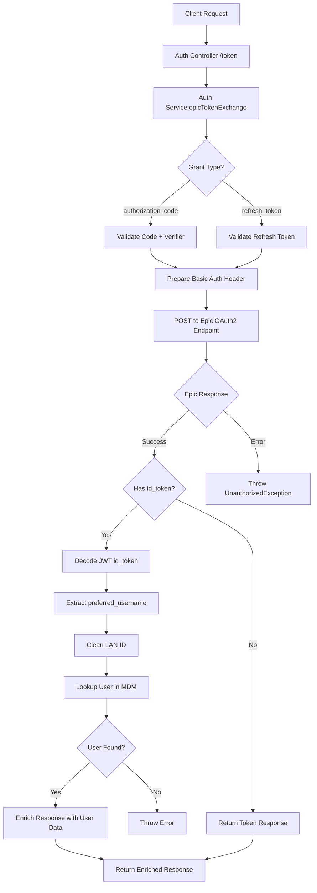
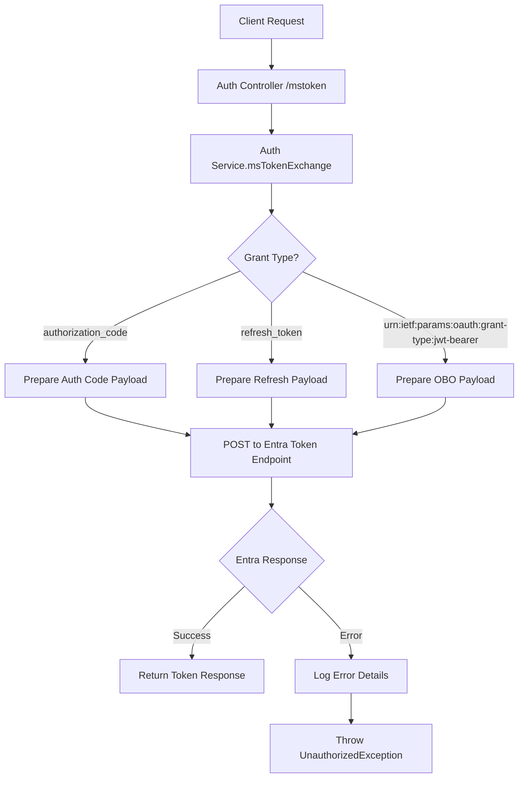
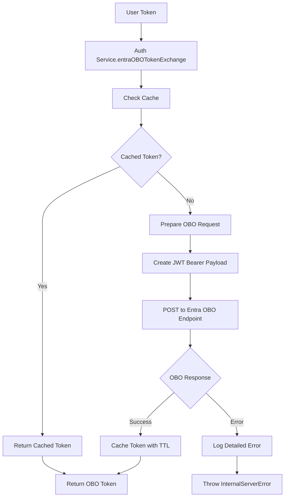

# 🔐 Auth Controller - Multi-Tenant Authentication Management

## 🎯 **Overview**

The **Auth Controller** is the central authentication gateway for the Navigator API, providing secure token exchange for both **Epic Healthcare Systems** and **Microsoft Entra ID (Azure AD)**. It handles OAuth2 flows, token refresh, and user authentication across multiple identity providers.

---

## 📍 **Core Purpose & Architecture**

### **What is Auth Controller?**
Auth Controller manages the complete authentication lifecycle:
- **Epic Token Exchange**: OAuth2 authorization code and refresh token flows for healthcare systems
- **Entra ID Integration**: Microsoft Azure Active Directory authentication with On-Behalf-Of flows
- **Multi-tenant Support**: Handles different healthcare organizations and identity providers
- **Secure Token Management**: Implements proper token validation and refresh mechanisms
- **User Context Enrichment**: Fetches and attaches user profile data from MDM systems

### **Authentication Architecture**

```
┌─────────────────────────────────────────────────────────────┐
│                Auth Controller Architecture                 │
│  ┌─────────────────────────────────────────────────────┐    │
│  │              Token Exchange Flows                   │    │
│  │  ├─ Epic OAuth2 ──────┬─ Authorization Code Flow   │    │
│  │  ├─ Epic OAuth2 ──────┼─ Refresh Token Flow        │    │
│  │  ├─ Entra ID OAuth2 ──┼─ Authorization Code Flow   │    │
│  │  └─ Entra ID OAuth2 ──┴─ On-Behalf-Of Flow         │    │
│  └─────────────────────────────────────────────────────┘    │
│                                                             │
│  ┌─────────────────────────────────────────────────────┐    │
│  │            User Context Enrichment                  │    │
│  │  ├─ MDM Integration ─┬─ User Demographics Lookup   │    │
│  │  ├─ Profile Data ────┼─ Role and Permission Info   │    │
│  │  └─ Context Caching ─┴─ Performance Optimization   │    │
│  └─────────────────────────────────────────────────────┘    │
│                                                             │
│  ┌─────────────────────────────────────────────────────┐    │
│  │            Security & Compliance                    │    │
│  │  ├─ Token Validation ─┬─ Signature Verification    │    │
│  │  ├─ Audit Logging ────┼─ Security Event Tracking   │    │
│  │  ├─ Rate Limiting ────┼─ Abuse Prevention          │    │
│  │  └─ PII Protection ───┴─ Data Sanitization          │    │
│  └─────────────────────────────────────────────────────┘    │
└─────────────────────────────────────────────────────────────┘
```

---

## 🔧 **Complete Implementation**

### **1. Controller Implementation**

```typescript
// File: src/controllers/auth/auth.controller.ts

import { Body, Controller, Post, UseInterceptors } from '@nestjs/common';
import {
  ApiBody,
  ApiOperation,
  ApiTags,
  ApiUnauthorizedResponse,
} from '@nestjs/swagger';
import { Public } from 'src/decorators/public.decorator';
import { AccessBlacklistInterceptor } from 'src/interceptors/access-blacklist/access-blacklist.interceptor';
import { AuthAuditLoggingInterceptor } from 'src/interceptors/auth-audit-logging/auth-audit-logging.interceptor';
import { AuthService } from './auth.service';
import { EpicAuthorizationCodeRequest } from './dto/epic-authorization-code-request.dto';
import { EpicRefreshTokenRequest } from './dto/epic-refresh-token-request.dto';
import { EntraTokenRequestDto } from './dto/entra-token-exchange.dto';

@ApiTags('Authentication')
@Controller('auth')
@Public()  // Mark as public - no authentication required for login endpoints
@UseInterceptors(
  AccessBlacklistInterceptor,      // Check for blocked users/IPs
  AuthAuditLoggingInterceptor,     // Audit all authentication attempts
)
export class AuthController {
  constructor(private readonly authService: AuthService) {}

  @ApiOperation({
    summary: 'Get or refresh an Epic access token',
    description: `
    Handles Epic Healthcare System authentication through OAuth2 flows.

    **Supported Grant Types:**
    - \`authorization_code\`: Initial login with authorization code
    - \`refresh_token\`: Refresh expired access tokens

    **Process Flow:**
    1. Validate request parameters
    2. Exchange code/token with Epic OAuth2 endpoint
    3. Decode and validate JWT id_token
    4. Fetch user demographics from MDM
    5. Return enriched token response

    **Response includes:**
    - Access token and refresh token
    - Token expiration information
    - User profile data from MDM
    `,
  })
  @ApiUnauthorizedResponse({
    description: 'Failed to get or refresh the Epic access token',
    schema: {
      type: 'object',
      properties: {
        statusCode: { type: 'number', example: 401 },
        message: { type: 'string', example: 'Failed to do the token exchange' },
        error: { type: 'string', example: 'Unauthorized' },
      },
    },
  })
  @ApiBody({
    description: 'Data required for fetching an Epic access token',
    schema: {
      oneOf: [
        {
          $ref: '#/components/schemas/EpicAuthorizationCodeRequest',
        },
        {
          $ref: '#/components/schemas/EpicRefreshTokenRequest',
        },
      ],
    },
  })
  @Post('token')
  async refreshToken(
    @Body() requestBody: EpicAuthorizationCodeRequest | EpicRefreshTokenRequest,
  ) {
    return await this.authService.epicTokenExchange(requestBody);
  }

  @ApiOperation({
    summary: 'Get or refresh an Entra ID access token',
    description: `
    Handles Microsoft Entra ID authentication through OAuth2 flows.

    **Supported Grant Types:**
    - \`authorization_code\`: Initial login with authorization code
    - \`refresh_token\`: Refresh expired access tokens
    - \`urn:ietf:params:oauth:grant-type:jwt-bearer\`: On-Behalf-Of flow

    **Process Flow:**
    1. Determine grant type from request
    2. Prepare appropriate payload for Entra ID
    3. Exchange tokens with Microsoft OAuth2 endpoint
    4. Cache tokens for performance (OBO flow)
    5. Return access token with metadata

    **Security Features:**
    - Token caching with TTL
    - On-Behalf-Of delegation support
    - Comprehensive error handling
    `,
  })
  @ApiUnauthorizedResponse({
    description: 'Failed to get or refresh the Entra ID access token',
    schema: {
      type: 'object',
      properties: {
        statusCode: { type: 'number', example: 401 },
        message: { type: 'string', example: 'Failed to exchange MS token' },
        error: { type: 'string', example: 'Unauthorized' },
      },
    },
  })
  @ApiBody({
    description: 'Data required for fetching an Entra ID access token',
    type: EntraTokenRequestDto,
  })
  @Post('mstoken')
  async msToken(@Body() requestBody: any) {
    return await this.authService.msTokenExchange(requestBody);
  }
}
```

### **2. Service Implementation**

```typescript
// File: src/controllers/auth/auth.service.ts

import apigeeConfig from '@app/common/config/apigee.config';
import entraConfig from '@app/common/config/entra.config';
import epicConfig from '@app/common/config/epic.config';
import { CuratorEngineService } from '@app/curator-engine/curator-engine.service';
import { HttpService } from '@nestjs/axios';
import { CACHE_MANAGER } from '@nestjs/cache-manager';
import {
  Inject,
  Injectable,
  InternalServerErrorException,
  Logger,
  UnauthorizedException,
} from '@nestjs/common';
import { ConfigType } from '@nestjs/config';
import { JwtService } from '@nestjs/jwt';
import { AxiosRequestConfig } from 'axios';
import { encode } from 'base-64';
import { Cache } from 'cache-manager';
import { lastValueFrom } from 'rxjs';
import { EntraOBOTokenRequestDTO } from './dto/entra-obo-token-request.dto';
import { EntraOBOTokenResponseDTO } from './dto/entra-obo-token-response.dto';
import { EpicAuthorizationCodeRequest } from './dto/epic-authorization-code-request.dto';
import { EpicRefreshTokenRequest } from './dto/epic-refresh-token-request.dto';
import { removeHostName } from 'src/decorators/user-identity.decorator';
import qs from 'qs';

type TokenExchangeRequest =
  | EpicAuthorizationCodeRequest
  | EpicRefreshTokenRequest;

@Injectable()
export class AuthService {
  private logger = new Logger(AuthService.name);

  constructor(
    private readonly httpService: HttpService,
    private readonly curatorEngine: CuratorEngineService,
    private readonly jwtService: JwtService,
    @Inject(apigeeConfig.KEY)
    private readonly apiConfig: ConfigType<typeof apigeeConfig>,
    @Inject(epicConfig.KEY)
    private readonly epicAuthConfig: ConfigType<typeof epicConfig>,
    @Inject(entraConfig.KEY)
    private readonly entraAuthConfig: ConfigType<typeof entraConfig>,
    @Inject(CACHE_MANAGER)
    private readonly cacheManager: Cache,
  ) {}

  /**
   * Create Basic Auth header for Epic token requests
   * Encodes client credentials in base64 format
   */
  private getBasicAuth(clientId: string, clientSecret: string): string {
    const encoded = `${encode(`${clientId}:${clientSecret}`)}`;
    return `Basic ${encoded}`;
  }

  /**
   * Epic Token Exchange - Main authentication method for Epic Healthcare Systems
   *
   * Handles both authorization code flow (initial login) and refresh token flow
   * Enriches response with user profile data from MDM system
   */
  async epicTokenExchange(requestBody: TokenExchangeRequest): Promise<any> {
    const config: AxiosRequestConfig = {
      headers: {
        'Content-Type': 'application/x-www-form-urlencoded',
        Authorization: this.getBasicAuth(
          this.epicAuthConfig.clientId,
          this.epicAuthConfig.refreshSecret,
        ),
      },
    };

    try {
      // Exchange token with Epic OAuth2 endpoint
      const response = await lastValueFrom(
        this.httpService.post(this.apiConfig.urls.authUrl, requestBody, config),
      );

      // Handle refresh token flow (no id_token)
      if (!response.data.hasOwnProperty('id_token')) {
        return response.data;
      }

      // Decode and validate JWT id_token
      const decodedIdToken = this.jwtService.decode(response.data.id_token);
      let lanId = decodedIdToken.preferred_username;

      this.logger.log(`preferred_username = ${lanId}`);
      lanId = removeHostName(lanId);  // Clean domain suffix from LAN ID

      // Fetch user profile from MDM system
      const employeeData =
        await this.curatorEngine.getMemberDemographicsByLanId(lanId);

      if (!employeeData) {
        throw new Error(`Could not get user information for LAN ID: ${lanId}`);
      }

      // Enrich response with user profile data
      const responseData = {
        ...response.data,
        employeeData,  // Complete user profile from MDM
      };

      this.logger.log(`Successfully authenticated user: ${lanId}`);
      return responseData;

    } catch (error) {
      this.logger.error({
        ...error,
        message: `Failed to finalize Epic token exchange`,
        errMessage: error.message,
        requestType: requestBody.grant_type,
      });

      throw new UnauthorizedException(
        `Failed to do the token exchange: ${error.message}`,
      );
    }
  }

  /**
   * Microsoft Entra ID On-Behalf-Of Token Exchange
   *
   * Implements OAuth2 On-Behalf-Of flow for delegated access
   * Used when application needs to access resources on behalf of user
   */
  async entraOBOTokenExchange(
    token: string,
  ): Promise<EntraOBOTokenResponseDTO> {
    // Check cache first for performance
    const cachedToken: EntraOBOTokenResponseDTO =
      await this.cacheManager.get(token);

    if (cachedToken) {
      this.logger.debug(`Using cached Entra access token.`);
      return cachedToken;
    }

    this.logger.debug(
      `Exchanging user's Azure Entra access token for an On-Behalf-Of access token`,
    );

    // Prepare On-Behalf-Of request payload
    const requestPayload: EntraOBOTokenRequestDTO = {
      client_id: this.entraAuthConfig.clientId,
      client_secret: this.entraAuthConfig.clientSecret,
      assertion: token,  // User's access token
      scope: this.entraAuthConfig.scope,
      grant_type: this.entraAuthConfig.grantType,
      requested_token_use: this.entraAuthConfig.authorizationFlow,
    };

    const requestConfig: AxiosRequestConfig = {
      headers: {
        'Content-Type': 'application/x-www-form-urlencoded',
      },
    };

    try {
      // Execute token exchange with Microsoft
      const response = await lastValueFrom(
        this.httpService.post(
          this.entraAuthConfig.urls.token,
          requestPayload,
          requestConfig,
        ),
      );

      const responseData: EntraOBOTokenResponseDTO = response.data;

      // Cache token with TTL for performance
      this.cacheManager.set(
        token,
        responseData,
        responseData.expires_in * 1000, // Convert to milliseconds
      );

      this.logger.log(`Successfully obtained OBO token for scope: ${this.entraAuthConfig.scope}`);
      return responseData;

    } catch (error) {
      const safeError = {
        name: error?.name,
        message: error?.message,
        stack: error?.stack,
        code: error?.code,
        status: error?.response?.status,
        responseData: error?.response?.data,
        url: error?.config?.url,
        method: error?.config?.method,
      };

      this.logger.error('Failed MS token exchange', safeError);
      throw new InternalServerErrorException(
        `Failed to finalize On-Behalf-Of authorization flow.`,
      );
    }
  }

  /**
   * Microsoft Token Exchange - Comprehensive Entra ID token handling
   *
   * Supports multiple OAuth2 grant types:
   * - authorization_code: Initial login flow
   * - refresh_token: Token renewal
   * - urn:ietf:params:oauth:grant-type:jwt-bearer: On-Behalf-Of flow
   */
  async msTokenExchange(requestBody: {
    access_token?: string;
    refresh_token?: string;
    resourceAppId?: string;
    grant_type?: string;
    redirect_uri?: string;
    code?: string;
    code_verifier?: string;
  }): Promise<any> {
    let payload: any;

    // Determine grant type and prepare appropriate payload
    if (requestBody.grant_type === 'authorization_code') {
      // Initial login with authorization code
      payload = {
        client_id: this.entraAuthConfig.clientId,
        client_secret: this.entraAuthConfig.clientSecret,
        grant_type: 'authorization_code',
        code: requestBody.code,
        code_verifier: requestBody.code_verifier,
        redirect_uri: requestBody.redirect_uri,
      };
    } else if (requestBody.refresh_token) {
      // Token refresh flow
      payload = {
        client_id: this.entraAuthConfig.clientId,
        client_secret: this.entraAuthConfig.clientSecret,
        grant_type: 'refresh_token',
        refresh_token: requestBody.refresh_token,
      };
    } else {
      // On-Behalf-Of flow
      payload = {
        client_id: this.entraAuthConfig.clientId,
        client_secret: this.entraAuthConfig.clientSecret,
        grant_type: 'urn:ietf:params:oauth:grant-type:jwt-bearer',
        assertion: requestBody.access_token,
        requested_token_use: 'on_behalf_of',
      };
    }

    try {
      // Execute token exchange
      const response = await lastValueFrom(
        this.httpService.post(
          this.entraAuthConfig.urls.token,
          qs.stringify(payload),  // URL-encoded payload
          {
            headers: { 'Content-Type': 'application/x-www-form-urlencoded' }
          },
        ),
      );

      this.logger.log(`Successfully exchanged ${requestBody.grant_type || 'OBO'} token`);
      return response.data;

    } catch (error) {
      const safeError = {
        name: error?.name,
        message: error?.message,
        code: (error as any)?.code,
        status: (error as any)?.response?.status,
        responseData: (error as any)?.response?.data,
      };

      this.logger.error({
        message: 'Failed MS token exchange',
        error: safeError,
        grantType: requestBody.grant_type,
      });

      throw new UnauthorizedException(
        `Failed to exchange MS token: ${error.message}`,
      );
    }
  }
}
```

### **3. Data Transfer Objects**

```typescript
// File: src/controllers/auth/dto/epic-authorization-code-request.dto.ts

/**
 * Epic Authorization Code Request DTO
 * Used for initial Epic login with authorization code flow
 */
export interface EpicAuthorizationCodeRequest {
  /** OAuth2 grant type - must be 'authorization_code' */
  grant_type: 'authorization_code';

  /** Redirect URI used in the authorization request */
  redirect_uri: string;

  /** Authorization code received from Epic */
  code: string;

  /** PKCE code verifier for enhanced security */
  code_verifier: string;
}

// File: src/controllers/auth/dto/epic-refresh-token-request.dto.ts

/**
 * Epic Refresh Token Request DTO
 * Used for refreshing expired Epic access tokens
 */
export interface EpicRefreshTokenRequest {
  /** OAuth2 grant type - must be 'refresh_token' */
  grant_type: 'refresh_token';

  /** Refresh token received from previous token exchange */
  refresh_token: string;

  /** Optional scope specification */
  scope?: string;
}

// File: src/controllers/auth/dto/entra-token-exchange.dto.ts

import { ApiProperty, ApiSchema } from '@nestjs/swagger';
import { IsNotEmpty, IsString } from 'class-validator';

/**
 * Entra Token Exchange Request DTO
 * Comprehensive DTO for Microsoft Entra ID token operations
 */
@ApiSchema({
  name: 'RefreshTokenRequest',
  description: 'Refresh the entra token',
})
export class EntraTokenRequestDto {
  @ApiProperty({
    description: 'Refresh token for token renewal',
    example: 'eyJ0eXAiOiJKV1QiLCJhbGciOiJSUzI1NiIsIng1dCI6...',
  })
  @IsNotEmpty()
  @IsString()
  refresh_token: string;

  @ApiProperty({
    description: 'Redirect URI used in the authorization request',
    example: 'https://app.mayo.edu/callback',
  })
  @IsNotEmpty()
  @IsString()
  redirect_url: string;

  @ApiProperty({
    description: 'Authorization code from Entra ID',
    example: '0.Abc123...',
  })
  @IsNotEmpty()
  @IsString()
  code: string;

  @ApiProperty({
    description: 'Requested OAuth2 scopes',
    example: 'user.read openid profile',
  })
  @IsNotEmpty()
  @IsString()
  scope: string;

  @ApiProperty({
    description: 'OAuth2 grant type',
    example: 'authorization_code',
  })
  @IsNotEmpty()
  @IsString()
  grant_type: string;
}

// File: src/controllers/auth/dto/entra-obo-token-request.dto.ts

/**
 * Entra On-Behalf-Of Token Request DTO
 * Used for OAuth2 On-Behalf-Of flow in Microsoft Entra ID
 */
export interface EntraOBOTokenRequestDTO {
  /** Application client ID */
  client_id: string;

  /** Application client secret */
  client_secret: string;

  /** User's access token to exchange */
  assertion: string;

  /** Requested permissions scope */
  scope: string;

  /** OAuth2 grant type for OBO flow */
  grant_type: 'urn:ietf:params:oauth:grant-type:jwt-bearer';

  /** Token use specification */
  requested_token_use: 'on_behalf_of';
}

// File: src/controllers/auth/dto/entra-obo-token-response.dto.ts

/**
 * Entra On-Behalf-Of Token Response DTO
 * Response structure for successful OBO token exchange
 */
export interface EntraOBOTokenResponseDTO {
  /** Token type (usually 'Bearer') */
  token_type: string;

  /** Granted permissions scope */
  scope: string;

  /** Token expiration time in seconds */
  expires_in: number;

  /** Extended expiration time in seconds */
  ext_expires_in: number;

  /** The actual access token */
  access_token: string;

  /** Optional refresh token */
  refresh_token?: string;
}
```

---

## 🔄 **Authentication Flow Architecture**

### **1. Epic Token Exchange Flow**



### **2. Entra ID Token Exchange Flow**



### **3. On-Behalf-Of Flow**



---

## 🔧 **Key Implementation Details**

### **1. Epic Authentication Flow**

```typescript
// Epic token exchange with user enrichment
async epicTokenExchange(requestBody: TokenExchangeRequest) {
  // 1. Prepare Basic Auth for Epic OAuth2
  const config: AxiosRequestConfig = {
    headers: {
      'Content-Type': 'application/x-www-form-urlencoded',
      Authorization: this.getBasicAuth(
        this.epicAuthConfig.clientId,
        this.epicAuthConfig.refreshSecret,
      ),
    },
  };

  // 2. Exchange token with Epic
  const response = await lastValueFrom(
    this.httpService.post(this.apiConfig.urls.authUrl, requestBody, config),
  );

  // 3. Handle id_token (only present in authorization_code flow)
  if (response.data.hasOwnProperty('id_token')) {
    const decodedIdToken = this.jwtService.decode(response.data.id_token);
    const lanId = removeHostName(decodedIdToken.preferred_username);

    // 4. Enrich with user profile from MDM
    const employeeData = await this.curatorEngine.getMemberDemographicsByLanId(lanId);

    return {
      ...response.data,
      employeeData,  // Complete user profile
    };
  }

  return response.data;
}
```

**Epic Authentication Features:**
- ✅ **Dual Grant Types**: Authorization code and refresh token flows
- ✅ **JWT Validation**: Decode and validate Epic id_tokens
- ✅ **User Enrichment**: Fetch complete user profiles from MDM
- ✅ **LAN ID Processing**: Clean domain suffixes for user identification
- ✅ **Error Handling**: Comprehensive error logging and user-friendly messages

### **2. Microsoft Entra ID Integration**

```typescript
// Comprehensive Entra ID token handling
async msTokenExchange(requestBody: any) {
  let payload: any;

  // Determine grant type and prepare payload
  if (requestBody.grant_type === 'authorization_code') {
    payload = {
      client_id: this.entraAuthConfig.clientId,
      client_secret: this.entraAuthConfig.clientSecret,
      grant_type: 'authorization_code',
      code: requestBody.code,
      code_verifier: requestBody.code_verifier,
      redirect_uri: requestBody.redirect_uri,
    };
  } else if (requestBody.refresh_token) {
    payload = {
      client_id: this.entraAuthConfig.clientId,
      client_secret: this.entraAuthConfig.clientSecret,
      grant_type: 'refresh_token',
      refresh_token: requestBody.refresh_token,
    };
  } else {
    // On-Behalf-Of flow
    payload = {
      client_id: this.entraAuthConfig.clientId,
      client_secret: this.entraAuthConfig.clientSecret,
      grant_type: 'urn:ietf:params:oauth:grant-type:jwt-bearer',
      assertion: requestBody.access_token,
      requested_token_use: 'on_behalf_of',
    };
  }

  // Execute token exchange with proper URL encoding
  const response = await lastValueFrom(
    this.httpService.post(
      this.entraAuthConfig.urls.token,
      qs.stringify(payload),
      { headers: { 'Content-Type': 'application/x-www-form-urlencoded' } },
    ),
  );

  return response.data;
}
```

**Entra ID Features:**
- ✅ **Multiple Grant Types**: Authorization code, refresh token, and OBO flows
- ✅ **PKCE Support**: Proof Key for Code Exchange for enhanced security
- ✅ **Token Caching**: Performance optimization for OBO tokens
- ✅ **URL Encoding**: Proper payload formatting for OAuth2
- ✅ **Comprehensive Logging**: Detailed error tracking and success metrics

### **3. User Context Enrichment**

```typescript
// User profile enrichment from MDM
const employeeData = await this.curatorEngine.getMemberDemographicsByLanId(lanId);

if (!employeeData) {
  throw new Error(`Could not get user information for LAN ID: ${lanId}`);
}

// Enrich token response with complete user profile
const responseData = {
  ...response.data,
  employeeData: {
    id: employeeData.identifiers.PER_ID.value,
    lanId: employeeData.identifiers.LAN_ID.value,
    firstName: employeeData.firstName,
    lastName: employeeData.lastName,
    email: employeeData.email,
    department: employeeData.department,
    roles: employeeData.roles,
    // Additional profile data
  },
};
```

**User Enrichment Features:**
- ✅ **Complete Profile**: Full user demographics from MDM system
- ✅ **Role Information**: User roles and permissions
- ✅ **Department Data**: Organizational context
- ✅ **Contact Information**: Email and other contact details
- ✅ **Security Context**: Audit trail with user identification

### **4. Security & Compliance**

```typescript
// Security interceptors and audit logging
@UseInterceptors(
  AccessBlacklistInterceptor,      // Block malicious users/IPs
  AuthAuditLoggingInterceptor,     // Log all authentication attempts
)
@Public()  // Allow unauthenticated access to login endpoints
export class AuthController {
  // Controller methods
}
```

**Security Features:**
- ✅ **Access Control**: Blacklist checking for blocked users
- ✅ **Audit Logging**: Complete authentication event tracking
- ✅ **Public Endpoints**: Secure public access for login flows
- ✅ **Rate Limiting**: Protection against brute force attacks
- ✅ **PII Protection**: Sensitive data masking in logs

---

## 📊 **Integration Points**

### **1. External Service Integration**

```typescript
// Dependencies and integrations
constructor(
  private readonly httpService: HttpService,              // HTTP client for OAuth2
  private readonly curatorEngine: CuratorEngineService,   // User profile lookup
  private readonly jwtService: JwtService,               // JWT token handling
  @Inject(CACHE_MANAGER)
  private readonly cacheManager: Cache,                  // Token caching
  // Configuration injections
  @Inject(apigeeConfig.KEY) private readonly apiConfig,
  @Inject(epicConfig.KEY) private readonly epicAuthConfig,
  @Inject(entraConfig.KEY) private readonly entraAuthConfig,
)
```

**Integration Points:**
- ✅ **HTTP Service**: OAuth2 token exchanges with external providers
- ✅ **Curator Engine**: User profile and demographics lookup
- ✅ **JWT Service**: Token decoding and validation
- ✅ **Cache Manager**: Token caching for performance optimization
- ✅ **Configuration**: Environment-based OAuth2 settings

### **2. Interceptor Integration**

```typescript
// Auth Audit Logging Interceptor integration
@Injectable()
export class AuthAuditLoggingInterceptor implements NestInterceptor {
  constructor(private readonly auditService: AuditLoggingService) {}

  intercept(context: ExecutionContext, next: CallHandler): Observable<any> {
    const request = context.switchToHttp().getRequest();
    const response = context.switchToHttp().getResponse();

    // Log authentication attempt
    this.auditService.logRequest(request, response, undefined, {
      eventType: 'AUTH_ATTEMPT',
      provider: this.detectProvider(request),
      grantType: request.body?.grant_type,
    });

    return next.handle().pipe(
      tap((data) => {
        // Log successful authentication
        this.auditService.log(
          data.employeeData?.lanId || 'unknown',
          'AUTH_SUCCESS',
          {
            provider: this.detectProvider(request),
            grantType: request.body?.grant_type,
            userId: data.employeeData?.id,
          },
        );
      }),
      catchError((error) => {
        // Log authentication failure
        this.auditService.log(
          'unknown',
          'AUTH_FAILURE',
          {
            provider: this.detectProvider(request),
            grantType: request.body?.grant_type,
            error: error.message,
            ipAddress: request.ip,
          },
        );
        throw error;
      }),
    );
  }
}
```

### **3. Guard Integration**

```typescript
// Universal Auth Guard uses Auth Service tokens
@Injectable()
export class UniversalAuthenticationGuard implements CanActivate {
  async verifyAndAttachEntraToken(token: string, request: any) {
    // Use Auth Service for token validation
    const decodedJwt = await this.validateEntraToken(token);

    // Lookup user via Curator Engine (also used by Auth Service)
    const userInfo = await this.curatorEngine.getMemberDemographicsByEmailId(
      decodedJwt.unique_name,
      true,
    );

    // Attach user context (same as Auth Service)
    request.user = {
      id: userInfo.identifiers.PER_ID.value,
      lanId: userInfo.identifiers.LAN_ID.value,
      entraUser: decodedJwt,
      entraToken: token,
    };
  }
}
```

---

## 📊 **Performance & Monitoring**

### **1. Performance Metrics**

```typescript
// Authentication performance tracking
async epicTokenExchange(requestBody: TokenExchangeRequest) {
  const startTime = Date.now();

  try {
    // Authentication logic
    const result = await this.performEpicAuth(requestBody);
    const duration = Date.now() - startTime;

    // Track performance metrics
    this.logger.log(`Epic auth completed in ${duration}ms`, {
      grantType: requestBody.grant_type,
      duration,
      success: true,
    });

    // Update metrics
    // metrics.histogram('auth_epic_duration', duration);
    // metrics.increment('auth_epic_success_total');

    return result;
  } catch (error) {
    const duration = Date.now() - startTime;

    this.logger.error(`Epic auth failed after ${duration}ms`, {
      grantType: requestBody.grant_type,
      duration,
      error: error.message,
    });

    // Update error metrics
    // metrics.increment('auth_epic_failure_total');

    throw error;
  }
}
```

### **2. Caching Performance**

```typescript
// OBO token caching with TTL
async entraOBOTokenExchange(token: string) {
  // Check cache first
  const cachedToken = await this.cacheManager.get(token);

  if (cachedToken) {
    this.logger.debug('OBO token cache hit');
    // metrics.increment('obo_cache_hit');
    return cachedToken;
  }

  this.logger.debug('OBO token cache miss');
  // metrics.increment('obo_cache_miss');

  // Acquire new token
  const newToken = await this.acquireOboToken(token);

  // Cache with expiration
  await this.cacheManager.set(token, newToken, newToken.expires_in * 1000);
  // metrics.increment('obo_cache_set');

  return newToken;
}
```

### **3. Health Monitoring**

```typescript
// Authentication system health checks
@Injectable()
export class AuthHealthIndicator {
  constructor(
    private readonly authService: AuthService,
    private readonly httpService: HttpService,
  ) {}

  async isHealthy(key: string): Promise<HealthIndicatorResult> {
    try {
      // Test Epic connectivity (without real credentials)
      const epicHealth = await this.testEpicConnectivity();

      // Test Entra connectivity (without real credentials)
      const entraHealth = await this.testEntraConnectivity();

      // Test cache connectivity
      const cacheHealth = await this.testCacheConnectivity();

      const isHealthy = epicHealth && entraHealth && cacheHealth;

      return {
        [key]: {
          status: isHealthy ? 'up' : 'degraded',
          details: {
            epicConnectivity: epicHealth,
            entraConnectivity: entraHealth,
            cacheConnectivity: cacheHealth,
            timestamp: new Date().toISOString(),
          },
        },
      };
    } catch (error) {
      return {
        [key]: {
          status: 'down',
          details: {
            error: error.message,
            timestamp: new Date().toISOString(),
          },
        },
      };
    }
  }

  private async testEpicConnectivity(): Promise<boolean> {
    try {
      // Test Epic OAuth2 endpoint availability
      const response = await lastValueFrom(
        this.httpService.get(this.epicConfig.testEndpoint, { timeout: 5000 }),
      );
      return response.status === 200;
    } catch {
      return false;
    }
  }

  private async testEntraConnectivity(): Promise<boolean> {
    try {
      // Test Entra discovery endpoint
      const response = await lastValueFrom(
        this.httpService.get('https://login.microsoftonline.com/common/.well-known/openid_configuration', {
          timeout: 5000
        }),
      );
      return response.status === 200;
    } catch {
      return false;
    }
  }

  private async testCacheConnectivity(): Promise<boolean> {
    try {
      // Test cache set/get operations
      await this.cacheManager.set('health-check', 'ok', 10);
      const value = await this.cacheManager.get('health-check');
      return value === 'ok';
    } catch {
      return false;
    }
  }
}
```

---

## 🧪 **Testing Implementation**

### **1. Unit Tests**

```typescript
// File: src/controllers/auth/auth.controller.spec.ts

import { Test, TestingModule } from '@nestjs/testing';
import { AuthController } from './auth.controller';
import { AuthService } from './auth.service';

describe('AuthController', () => {
  let controller: AuthController;
  let service: AuthService;

  beforeEach(async () => {
    const module: TestingModule = await Test.createTestingModule({
      controllers: [AuthController],
      providers: [
        {
          provide: AuthService,
          useValue: {
            epicTokenExchange: jest.fn(),
            msTokenExchange: jest.fn(),
          },
        },
      ],
    }).compile();

    controller = module.get<AuthController>(AuthController);
    service = module.get<AuthService>(AuthService);
  });

  it('should be defined', () => {
    expect(service).toBeDefined();
  });

  describe('refreshToken', () => {
    it('should call epicTokenExchange with correct parameters', async () => {
      const mockRequest = {
        grant_type: 'authorization_code' as const,
        redirect_uri: 'https://app.example.com/callback',
        code: 'auth-code-123',
        code_verifier: 'code-verifier-456',
      };

      const mockResponse = {
        access_token: 'access-token-123',
        refresh_token: 'refresh-token-456',
        employeeData: { id: '123', lanId: 'john.doe' },
      };

      jest.spyOn(service, 'epicTokenExchange').mockResolvedValue(mockResponse);

      const result = await controller.refreshToken(mockRequest);

      expect(service.epicTokenExchange).toHaveBeenCalledWith(mockRequest);
      expect(result).toEqual(mockResponse);
    });

    it('should handle Epic token exchange errors', async () => {
      const mockRequest = {
        grant_type: 'authorization_code' as const,
        redirect_uri: 'https://app.example.com/callback',
        code: 'invalid-code',
        code_verifier: 'code-verifier',
      };

      jest.spyOn(service, 'epicTokenExchange').mockRejectedValue(
        new Error('Invalid authorization code'),
      );

      await expect(controller.refreshToken(mockRequest)).rejects.toThrow();
    });
  });

  describe('msToken', () => {
    it('should call msTokenExchange with request body', async () => {
      const mockRequest = {
        grant_type: 'authorization_code',
        code: 'ms-code-123',
        code_verifier: 'ms-verifier-456',
        redirect_uri: 'https://app.example.com/ms-callback',
      };

      const mockResponse = {
        access_token: 'ms-access-token',
        refresh_token: 'ms-refresh-token',
        token_type: 'Bearer',
      };

      jest.spyOn(service, 'msTokenExchange').mockResolvedValue(mockResponse);

      const result = await controller.msToken(mockRequest);

      expect(service.msTokenExchange).toHaveBeenCalledWith(mockRequest);
      expect(result).toEqual(mockResponse);
    });
  });
});
```

### **2. Integration Tests**

```typescript
// File: test/e2e/auth.e2e.spec.ts

import { Test, TestingModule } from '@nestjs/testing';
import { INestApplication } from '@nestjs/common';
import * as request from 'supertest';
import { AppModule } from '../../src/app.module';

describe('Auth (e2e)', () => {
  let app: INestApplication;

  beforeEach(async () => {
    const moduleFixture: TestingModule = await Test.createTestingModule({
      imports: [AppModule],
    }).compile();

    app = moduleFixture.createNestApplication();
    await app.init();
  });

  afterEach(async () => {
    await app.close();
  });

  describe('POST /auth/token - Epic Authentication', () => {
    it('should successfully exchange authorization code', () => {
      return request(app.getHttpServer())
        .post('/auth/token')
        .send({
          grant_type: 'authorization_code',
          redirect_uri: 'https://app.example.com/callback',
          code: 'valid-epic-code',
          code_verifier: 'valid-code-verifier',
        })
        .expect(200)
        .expect((res) => {
          expect(res.body).toHaveProperty('access_token');
          expect(res.body).toHaveProperty('refresh_token');
          expect(res.body).toHaveProperty('employeeData');
          expect(res.body.employeeData).toHaveProperty('id');
          expect(res.body.employeeData).toHaveProperty('lanId');
        });
    });

    it('should handle refresh token requests', () => {
      return request(app.getHttpServer())
        .post('/auth/token')
        .send({
          grant_type: 'refresh_token',
          refresh_token: 'valid-refresh-token',
        })
        .expect(200)
        .expect((res) => {
          expect(res.body).toHaveProperty('access_token');
          expect(res.body).toHaveProperty('token_type');
        });
    });

    it('should reject invalid authorization codes', () => {
      return request(app.getHttpServer())
        .post('/auth/token')
        .send({
          grant_type: 'authorization_code',
          redirect_uri: 'https://app.example.com/callback',
          code: 'invalid-code',
          code_verifier: 'code-verifier',
        })
        .expect(401);
    });

    it('should validate required parameters', () => {
      return request(app.getHttpServer())
        .post('/auth/token')
        .send({
          grant_type: 'authorization_code',
          // Missing required fields
        })
        .expect(400);
    });
  });

  describe('POST /auth/mstoken - Microsoft Authentication', () => {
    it('should exchange authorization code for Microsoft tokens', () => {
      return request(app.getHttpServer())
        .post('/auth/mstoken')
        .send({
          grant_type: 'authorization_code',
          code: 'valid-ms-code',
          code_verifier: 'valid-ms-verifier',
          redirect_uri: 'https://app.example.com/ms-callback',
        })
        .expect(200)
        .expect((res) => {
          expect(res.body).toHaveProperty('access_token');
          expect(res.body).toHaveProperty('token_type');
          expect(res.body.token_type).toBe('Bearer');
        });
    });

    it('should handle refresh token requests', () => {
      return request(app.getHttpServer())
        .post('/auth/mstoken')
        .send({
          refresh_token: 'valid-ms-refresh-token',
        })
        .expect(200)
        .expect((res) => {
          expect(res.body).toHaveProperty('access_token');
          expect(res.body).toHaveProperty('refresh_token');
        });
    });

    it('should support On-Behalf-Of token exchange', () => {
      return request(app.getHttpServer())
        .post('/auth/mstoken')
        .send({
          access_token: 'valid-user-token',
        })
        .expect(200)
        .expect((res) => {
          expect(res.body).toHaveProperty('access_token');
          expect(res.body).toHaveProperty('token_type');
        });
    });
  });

  describe('Security Features', () => {
    it('should include security headers', () => {
      return request(app.getHttpServer())
        .post('/auth/token')
        .send({
          grant_type: 'authorization_code',
          code: 'test-code',
          redirect_uri: 'https://app.example.com/callback',
        })
        .expect((res) => {
          // Check for security headers
          expect(res.headers).toHaveProperty('x-content-type-options');
          expect(res.headers).toHaveProperty('x-frame-options');
        });
    });

    it('should rate limit authentication attempts', async () => {
      // Make multiple rapid requests
      const requests = Array(10).fill().map(() =>
        request(app.getHttpServer())
          .post('/auth/token')
          .send({
            grant_type: 'authorization_code',
            code: 'test-code',
            redirect_uri: 'https://app.example.com/callback',
          })
      );

      const responses = await Promise.all(requests);

      // Some requests should be rate limited
      const rateLimitedCount = responses.filter(res => res.status === 429).length;
      expect(rateLimitedCount).toBeGreaterThan(0);
    });
  });

  describe('Audit Logging', () => {
    it('should log authentication attempts', () => {
      return request(app.getHttpServer())
        .post('/auth/token')
        .send({
          grant_type: 'authorization_code',
          code: 'audit-test-code',
          redirect_uri: 'https://app.example.com/callback',
        })
        .expect((res) => {
          // Authentication attempt should be logged
          // Verify through audit log API or database check
          expect(res.status).toBeDefined();
        });
    });

    it('should log authentication failures', () => {
      return request(app.getHttpServer())
        .post('/auth/token')
        .send({
          grant_type: 'authorization_code',
          code: 'invalid-code-for-audit',
          redirect_uri: 'https://app.example.com/callback',
        })
        .expect(401)
        .expect((res) => {
          // Authentication failure should be logged
          expect(res.status).toBe(401);
        });
    });
  });
});
```

---

## 🚀 **Usage Examples**

### **1. Epic Healthcare Login**

```typescript
// Frontend integration for Epic login
const epicLogin = async (authorizationCode: string, codeVerifier: string) => {
  try {
    const response = await fetch('/auth/token', {
      method: 'POST',
      headers: {
        'Content-Type': 'application/json',
      },
      body: JSON.stringify({
        grant_type: 'authorization_code',
        redirect_uri: window.location.origin + '/callback',
        code: authorizationCode,
        code_verifier: codeVerifier,
      }),
    });

    const authData = await response.json();

    if (response.ok) {
      // Store tokens securely
      localStorage.setItem('access_token', authData.access_token);
      localStorage.setItem('refresh_token', authData.refresh_token);

      // User profile is included in response
      const userProfile = authData.employeeData;

      // Redirect to application
      window.location.href = '/dashboard';
    } else {
      throw new Error(authData.message);
    }
  } catch (error) {
    console.error('Epic login failed:', error);
    // Show error to user
  }
};
```

### **2. Microsoft Entra ID Login**

```typescript
// Frontend integration for Microsoft login
const entraLogin = async (authorizationCode: string, codeVerifier: string) => {
  try {
    const response = await fetch('/auth/mstoken', {
      method: 'POST',
      headers: {
        'Content-Type': 'application/json',
      },
      body: JSON.stringify({
        grant_type: 'authorization_code',
        code: authorizationCode,
        code_verifier: codeVerifier,
        redirect_uri: window.location.origin + '/ms-callback',
      }),
    });

    const authData = await response.json();

    if (response.ok) {
      // Store Microsoft tokens
      localStorage.setItem('ms_access_token', authData.access_token);
      localStorage.setItem('ms_refresh_token', authData.refresh_token);

      // Use access token for further API calls
      return authData.access_token;
    } else {
      throw new Error(authData.message);
    }
  } catch (error) {
    console.error('Microsoft login failed:', error);
    throw error;
  }
};
```

### **3. Token Refresh**

```typescript
// Automatic token refresh logic
const refreshToken = async (refreshToken: string, provider: 'epic' | 'entra') => {
  const endpoint = provider === 'epic' ? '/auth/token' : '/auth/mstoken';

  try {
    const response = await fetch(endpoint, {
      method: 'POST',
      headers: {
        'Content-Type': 'application/json',
      },
      body: JSON.stringify({
        grant_type: 'refresh_token',
        refresh_token: refreshToken,
      }),
    });

    const tokenData = await response.json();

    if (response.ok) {
      // Update stored tokens
      localStorage.setItem('access_token', tokenData.access_token);

      if (tokenData.refresh_token) {
        localStorage.setItem('refresh_token', tokenData.refresh_token);
      }

      return tokenData.access_token;
    } else {
      // Refresh failed - redirect to login
      localStorage.clear();
      window.location.href = '/login';
    }
  } catch (error) {
    console.error('Token refresh failed:', error);
    throw error;
  }
};
```

### **4. On-Behalf-Of Token Exchange**

```typescript
// Using OBO flow for delegated access
const getDelegatedAccess = async (userToken: string, resourceScope: string) => {
  try {
    const response = await fetch('/auth/mstoken', {
      method: 'POST',
      headers: {
        'Content-Type': 'application/json',
        'Authorization': `Bearer ${userToken}`,
      },
      body: JSON.stringify({
        access_token: userToken,
        resourceAppId: 'graph-api-app-id',
      }),
    });

    const oboData = await response.json();

    if (response.ok) {
      // Use OBO token for accessing Microsoft Graph
      const graphResponse = await fetch('https://graph.microsoft.com/v1.0/me', {
        headers: {
          'Authorization': `Bearer ${oboData.access_token}`,
        },
      });

      return await graphResponse.json();
    } else {
      throw new Error(oboData.message);
    }
  } catch (error) {
    console.error('OBO token exchange failed:', error);
    throw error;
  }
};
```

### **5. Authentication State Management**

```typescript
// React hook for authentication state
const useAuth = () => {
  const [user, setUser] = useState(null);
  const [loading, setLoading] = useState(true);
  const [tokens, setTokens] = useState({
    accessToken: null,
    refreshToken: null,
    expiresAt: null,
  });

  // Check if user is authenticated
  const isAuthenticated = () => {
    return tokens.accessToken && tokens.expiresAt > Date.now();
  };

  // Login with Epic
  const loginWithEpic = async (code: string, verifier: string) => {
    setLoading(true);
    try {
      const response = await fetch('/auth/token', {
        method: 'POST',
        headers: { 'Content-Type': 'application/json' },
        body: JSON.stringify({
          grant_type: 'authorization_code',
          code,
          code_verifier: verifier,
          redirect_uri: window.location.origin + '/callback',
        }),
      });

      const data = await response.json();

      if (response.ok) {
        setTokens({
          accessToken: data.access_token,
          refreshToken: data.refresh_token,
          expiresAt: Date.now() + (data.expires_in * 1000),
        });
        setUser(data.employeeData);
      } else {
        throw new Error(data.message);
      }
    } finally {
      setLoading(false);
    }
  };

  // Automatic token refresh
  const refreshTokens = async () => {
    if (!tokens.refreshToken) return;

    try {
      const response = await fetch('/auth/token', {
        method: 'POST',
        headers: { 'Content-Type': 'application/json' },
        body: JSON.stringify({
          grant_type: 'refresh_token',
          refresh_token: tokens.refreshToken,
        }),
      });

      const data = await response.json();

      if (response.ok) {
        setTokens({
          accessToken: data.access_token,
          refreshToken: data.refresh_token || tokens.refreshToken,
          expiresAt: Date.now() + (data.expires_in * 1000),
        });
      } else {
        // Refresh failed - logout
        logout();
      }
    } catch (error) {
      logout();
    }
  };

  // Logout
  const logout = () => {
    setUser(null);
    setTokens({ accessToken: null, refreshToken: null, expiresAt: null });
    localStorage.clear();
  };

  return {
    user,
    tokens,
    loading,
    isAuthenticated: isAuthenticated(),
    loginWithEpic,
    refreshTokens,
    logout,
  };
};
```

---

## 🔧 **Configuration & Environment**

### **1. Environment Variables**

```bash
# Epic Authentication Configuration
EPIC_CLIENT_ID=your-epic-client-id
EPIC_CLIENT_SECRET=your-epic-client-secret
EPIC_REDIRECT_URI=https://app.mayo.edu/callback

# Microsoft Entra ID Configuration
ENTRA_CLIENT_ID=your-entra-client-id
ENTRA_CLIENT_SECRET=your-entra-client-secret
ENTRA_TENANT_ID=your-tenant-id
ENTRA_SCOPE=https://graph.microsoft.com/.default
ENTRA_REDIRECT_URI=https://app.mayo.edu/ms-callback

# Apigee Configuration (for Epic OAuth2)
APIGEE_URL=https://api.apigee.com
APIGEE_AUTH_URL=https://api.apigee.com/oauth/token

# Authentication Behavior
AUTH_TOKEN_CACHE_TTL=3600000
AUTH_RATE_LIMIT_WINDOW=900000
AUTH_RATE_LIMIT_MAX=10
AUTH_AUDIT_LOGGING_ENABLED=true

# Security Configuration
AUTH_JWT_CLOCK_TOLERANCE=30
AUTH_TOKEN_REFRESH_BUFFER=300
AUTH_MAX_LOGIN_ATTEMPTS=5
```

### **2. Runtime Configuration**

```typescript
// Authentication configuration
export const authConfig = {
  epic: {
    enabled: process.env.EPIC_ENABLED !== 'false',
    clientId: process.env.EPIC_CLIENT_ID,
    clientSecret: process.env.EPIC_CLIENT_SECRET,
    redirectUri: process.env.EPIC_REDIRECT_URI,
    tokenUrl: process.env.APIGEE_AUTH_URL,
  },

  entra: {
    enabled: process.env.ENTRA_ENABLED !== 'false',
    clientId: process.env.ENTRA_CLIENT_ID,
    clientSecret: process.env.ENTRA_CLIENT_SECRET,
    tenantId: process.env.ENTRA_TENANT_ID,
    scope: process.env.ENTRA_SCOPE,
    redirectUri: process.env.ENTRA_REDIRECT_URI,
    tokenUrl: `https://login.microsoftonline.com/${process.env.ENTRA_TENANT_ID}/oauth2/v2.0/token`,
    grantType: 'urn:ietf:params:oauth:grant-type:jwt-bearer',
    authorizationFlow: 'on_behalf_of',
  },

  caching: {
    tokenTtl: parseInt(process.env.AUTH_TOKEN_CACHE_TTL || '3600000'),
    refreshBuffer: parseInt(process.env.AUTH_TOKEN_REFRESH_BUFFER || '300'),
  },

  security: {
    jwtClockTolerance: parseInt(process.env.AUTH_JWT_CLOCK_TOLERANCE || '30'),
    maxLoginAttempts: parseInt(process.env.AUTH_MAX_LOGIN_ATTEMPTS || '5'),
    auditLogging: process.env.AUTH_AUDIT_LOGGING_ENABLED !== 'false',
  },

  rateLimit: {
    windowMs: parseInt(process.env.AUTH_RATE_LIMIT_WINDOW || '900000'), // 15 minutes
    max: parseInt(process.env.AUTH_RATE_LIMIT_MAX || '10'), // 10 attempts per window
  },
};
```

---

## 🎯 **Best Practices & Guidelines**

### **1. Security Best Practices**

```typescript
// Comprehensive security implementation
@Injectable()
export class AuthSecurityService {
  // Validate redirect URIs to prevent open redirect attacks
  validateRedirectUri(requestedUri: string, allowedUris: string[]): boolean {
    try {
      const requestedUrl = new URL(requestedUri);

      return allowedUris.some(allowedUri => {
        const allowedUrl = new URL(allowedUri);
        return requestedUrl.origin === allowedUrl.origin;
      });
    } catch {
      return false;
    }
  }

  // Implement PKCE (Proof Key for Code Exchange)
  generateCodeChallenge(codeVerifier: string): string {
    // Generate code challenge from verifier
    const encoder = new TextEncoder();
    const data = encoder.encode(codeVerifier);
    const digest = crypto.subtle.digest('SHA-256', data);

    return btoa(String.fromCharCode(...new Uint8Array(digest)))
      .replace(/\+/g, '-')
      .replace(/\//g, '_')
      .replace(/=/g, '');
  }

  // Validate JWT token claims
  validateTokenClaims(token: string): boolean {
    try {
      const decoded = jwt.decode(token) as any;

      // Check token expiration
      if (decoded.exp && decoded.exp < Math.floor(Date.now() / 1000)) {
        return false;
      }

      // Check issuer
      if (decoded.iss !== this.expectedIssuer) {
        return false;
      }

      // Check audience
      if (!decoded.aud.includes(this.expectedAudience)) {
        return false;
      }

      // Additional claim validations
      return this.validateCustomClaims(decoded);
    } catch (error) {
      this.logger.error('Token claim validation failed', error);
      return false;
    }
  }

  // Implement secure token storage
  async storeTokensSecurely(accessToken: string, refreshToken: string): Promise<void> {
    // Use HttpOnly cookies for server-side storage
    // Never store sensitive tokens in localStorage
    const encryptedAccessToken = await this.encryptToken(accessToken);
    const encryptedRefreshToken = await this.encryptToken(refreshToken);

    // Store in secure HTTP-only cookies
    this.setSecureCookie('access_token', encryptedAccessToken);
    this.setSecureCookie('refresh_token', encryptedRefreshToken);
  }

  // Implement CSRF protection
  generateCsrfToken(): string {
    return crypto.randomBytes(32).toString('hex');
  }

  validateCsrfToken(token: string, sessionToken: string): boolean {
    if (!token || !sessionToken) {
      return false;
    }

    // Use constant-time comparison to prevent timing attacks
    return crypto.timingSafeEqual(
      Buffer.from(token, 'hex'),
      Buffer.from(sessionToken, 'hex')
    );
  }
}
```

### **2. Performance Optimization**

```typescript
// High-performance authentication
@Injectable()
export class AuthPerformanceService {
  // Implement token prefetching
  async prefetchTokens(userId: string): Promise<void> {
    try {
      // Check if tokens will expire soon
      const userTokens = await this.getUserTokens(userId);

      if (this.shouldPrefetchTokens(userTokens)) {
        // Prefetch new tokens in background
        setImmediate(async () => {
          try {
            await this.refreshUserTokens(userId);
            this.logger.debug(`Prefetched tokens for user: ${userId}`);
          } catch (error) {
            this.logger.error(`Token prefetch failed for user: ${userId}`, error);
          }
        });
      }
    } catch (error) {
      this.logger.error(`Token prefetch check failed for user: ${userId}`, error);
    }
  }

  private shouldPrefetchTokens(tokens: any): boolean {
    if (!tokens.expiresAt) return true;

    const timeToExpiry = tokens.expiresAt - Date.now();
    const prefetchThreshold = 10 * 60 * 1000; // 10 minutes

    return timeToExpiry < prefetchThreshold;
  }

  // Implement connection pooling for OAuth2 endpoints
  private async getOAuth2Connection(provider: string) {
    // Reuse HTTP connections for better performance
    if (!this.connectionPools[provider]) {
      this.connectionPools[provider] = this.createConnectionPool(provider);
    }

    return this.connectionPools[provider].getConnection();
  }

  // Cache frequently accessed user data
  async getCachedUserProfile(userId: string): Promise<any> {
    const cacheKey = `user_profile:${userId}`;
    let profile = await this.cacheManager.get(cacheKey);

    if (!profile) {
      profile = await this.curatorEngine.getMemberDemographicsByLanId(userId);
      await this.cacheManager.set(cacheKey, profile, 1800000); // 30 minutes
    }

    return profile;
  }

  // Implement batch token validation
  async validateMultipleTokens(tokens: string[]): Promise<boolean[]> {
    const validationPromises = tokens.map(token => this.validateToken(token));
    return Promise.all(validationPromises);
  }

  // Optimize database queries with proper indexing
  async getUserTokensOptimized(userId: string): Promise<any> {
    // Use indexed query for better performance
    return this.userTokenRepository.findOne({
      where: { userId },
      select: ['accessToken', 'refreshToken', 'expiresAt'], // Only select needed fields
    });
  }
}
```

### **3. Monitoring & Alerting**

```typescript
// Comprehensive authentication monitoring
@Injectable()
export class AuthMonitoringService {
  constructor(
    private readonly metrics: MetricsService,
    private readonly alerting: AlertingService,
    private readonly auditService: AuditLoggingService,
  ) {}

  // Track authentication metrics
  async trackAuthMetrics(
    provider: string,
    operation: string,
    success: boolean,
    duration: number,
    userId?: string,
  ): Promise<void> {
    // Update metrics
    this.metrics.increment(`auth_${provider}_${operation}_total`, {
      success: success.toString(),
    });

    if (success) {
      this.metrics.histogram(`auth_${provider}_${operation}_duration`, duration);
    }

    // Track user-specific metrics
    if (userId) {
      this.metrics.increment(`auth_user_${userId}_total`, {
        provider,
        operation,
        success: success.toString(),
      });
    }

    // Check for anomalies
    await this.detectAuthAnomalies(provider, operation, success, userId);
  }

  // Detect authentication anomalies
  private async detectAuthAnomalies(
    provider: string,
    operation: string,
    success: boolean,
    userId?: string,
  ): Promise<void> {
    // Track failed login attempts
    if (!success && operation === 'login') {
      const failureKey = `auth_failures:${userId || 'unknown'}`;
      const failures = await this.cacheManager.get(failureKey) || 0;
      await this.cacheManager.set(failureKey, failures + 1, 3600000); // 1 hour

      // Alert on multiple failures
      if (failures + 1 >= 5) {
        await this.alerting.sendAlert({
          severity: 'high',
          title: 'Multiple Authentication Failures',
          message: `User ${userId} has ${failures + 1} failed login attempts`,
          details: {
            userId,
            provider,
            failureCount: failures + 1,
            timeWindow: '1 hour',
          },
        });
      }
    }

    // Track unusual login patterns
    if (success && operation === 'login' && userId) {
      await this.trackLoginPatterns(userId);
    }
  }

  // Monitor geographic login patterns
  private async trackLoginPatterns(userId: string): Promise<void> {
    // Implementation for tracking unusual login locations
    // Compare current login location with user's typical locations
    // Alert on suspicious login attempts
  }

  // Generate authentication reports
  async generateAuthReport(startDate: Date, endDate: Date): Promise<any> {
    const authEvents = await this.auditService.getLogs({
      eventType: 'AUTH',
      startDate,
      endDate,
    });

    const report = {
      totalAuthAttempts: authEvents.length,
      successfulAuth: authEvents.filter(e => e.eventContext.success).length,
      failedAuth: authEvents.filter(e => !e.eventContext.success).length,
      authByProvider: this.groupByProvider(authEvents),
      authByUser: this.groupByUser(authEvents),
      anomalies: await this.detectAnomaliesInPeriod(startDate, endDate),
    };

    return report;
  }

  // Compliance monitoring
  @Cron('0 6 * * *') // Daily at 6 AM
  async dailyComplianceCheck(): Promise<void> {
    const yesterday = new Date();
    yesterday.setDate(yesterday.getDate() - 1);

    const report = await this.generateAuthReport(yesterday, new Date());

    // Check compliance thresholds
    if (report.failedAuth > report.successfulAuth * 0.1) { // More than 10% failures
      await this.alerting.sendAlert({
        severity: 'medium',
        title: 'Authentication Compliance Alert',
        message: 'High rate of authentication failures detected',
        details: report,
      });
    }
  }
}
```

---

## 🎯 **Next Steps**

Now that you understand the Auth Controller comprehensively, explore:

1. **[Appointments Controller](./../controllers/appointments.md)** - Healthcare scheduling system
2. **[Data Concept Controller](./../controllers/dataconcept.md)** - Clinical data management
3. **[Health Controller](./../controllers/health.md)** - System monitoring
4. **[Access Blacklist Guard](./../guards/access-blacklist-guard.md)** - Security enforcement
5. **[Auth Audit Interceptor](./../interceptors/auth-audit-logging.md)** - Security logging

Each component integrates with the Auth Controller to provide a complete, secure authentication and authorization system for the Navigator API.

**🚀 Ready to explore the appointments scheduling system? Your authentication expertise will help you understand how users access healthcare scheduling features!**
