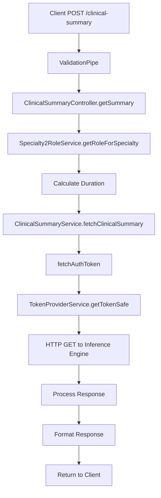
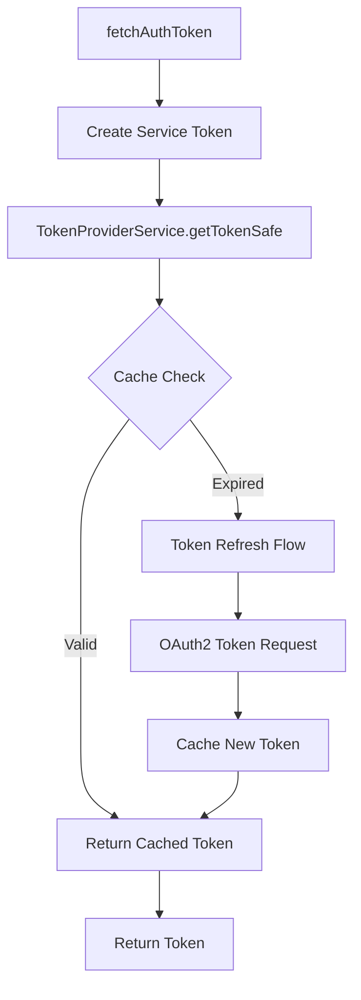
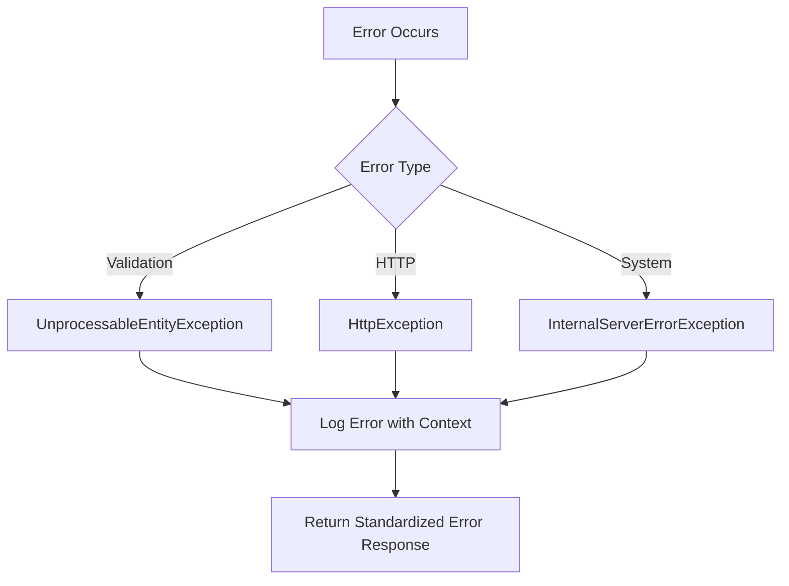

# 📋 Clinical Summary Controller - Complete Implementation Guide

## 🎯 **Overview**

The **Clinical Summary Controller** is a sophisticated API endpoint that generates AI-powered clinical summaries for patients using Mayo Clinic's Inference Engine. This feature demonstrates the complete integration between frontend requests, backend processing, external AI services, and healthcare data management.

---

## 📍 **API Endpoint**

```http
POST /clinical-summary
Content-Type: application/json
Authorization: Bearer <jwt-token>
```

### **Request Example**
```json
{
  "mrn": "123456789",
  "reason": "Shortness of breath",
  "startDate": "2024-11-01",
  "endDate": "2024-11-15",
  "specialty": "Cardiology"
}
```

### **Response Example**
```json
{
  "status": "success",
  "summary": "Patient presented with shortness of breath...",
  "info": [
    "Vital signs stable",
    "No acute distress noted",
    "Follow-up scheduled for next week"
  ],
  "disclaimer": "This summary is generated by AI and should be reviewed by a healthcare professional.",
  "message": "Clinical summary generated successfully",
  "data": {
    "confidence": 0.95,
    "model_version": "1.2.3"
  },
  "metrics": "Processing time: 2.3s, Tokens used: 1500"
}
```

---

## 🏗️ **Complete Implementation**

### **1. Controller Implementation**

```typescript
// File: src/controllers/clinical-summary/clinical-summary.controller.ts

import {
  Body,
  Controller,
  InternalServerErrorException,
  Logger,
  Post,
  UnprocessableEntityException,
  UsePipes,
  ValidationPipe,
} from '@nestjs/common';
import {
  ApiBearerAuth,
  ApiBody,
  ApiOperation,
  ApiResponse,
  ApiTags,
} from '@nestjs/swagger';
import { ClinicalSummaryService } from './clinical-summary.service';
import { ClinicalSummaryRequestDto } from './dto/clinical-summary.request.dto';
import { ClinicalSummaryResponseDto } from './dto/clinical-summary.response.dto';
import { Specialty2RoleService } from 'src/services/specialty2role.service';

@ApiTags('Clinical Summary')
@ApiBearerAuth()
@Controller('clinical-summary')
export class ClinicalSummaryController {
  private readonly logger = new Logger(ClinicalSummaryController.name);

  constructor(
    private readonly clinicalSummaryService: ClinicalSummaryService,
    private readonly specialty2RoleService: Specialty2RoleService,
  ) {}

  @ApiOperation({
    summary: 'Generate a clinical summary for a patient based on appointment data',
    description: `
    Generates an AI-powered clinical summary using Mayo Clinic's Inference Engine.
    The summary includes patient history, current condition, and care recommendations.

    **Process Flow:**
    1. Validate input parameters
    2. Map specialty to medical role
    3. Calculate history duration
    4. Fetch authentication token
    5. Call Inference Engine API
    6. Process and format response
    `,
  })
  @ApiResponse({
    status: 200,
    description: 'Clinical summary successfully generated',
    type: ClinicalSummaryResponseDto,
  })
  @ApiResponse({
    status: 422,
    description: 'Validation failed or unsupported specialty/reason combination',
    schema: {
      type: 'object',
      properties: {
        statusCode: { type: 'number', example: 422 },
        message: { type: 'string', example: 'Validation failed' },
        error: { type: 'string', example: 'Unprocessable Entity' },
      },
    },
  })
  @ApiResponse({
    status: 500,
    description: 'Failed to process request due to internal error',
    schema: {
      type: 'object',
      properties: {
        statusCode: { type: 'number', example: 500 },
        message: { type: 'string', example: 'Internal server error' },
        error: { type: 'string', example: 'Internal Server Error' },
      },
    },
  })
  @ApiBody({
    type: ClinicalSummaryRequestDto,
    description: 'Clinical summary request parameters',
  })
  @Post()
  @UsePipes(new ValidationPipe({
    whitelist: true,  // Strip properties not in DTO
    forbidNonWhitelisted: true,  // Throw error for extra properties
    transform: true,  // Transform payload to DTO instance
  }))
  async getSummary(
    @Body() body: ClinicalSummaryRequestDto,
  ): Promise<ClinicalSummaryResponseDto> {
    const { mrn, reason, startDate, endDate, specialty } = body;

    // Log incoming request
    this.logger.log(`Processing clinical summary request for MRN: ${mrn}, Specialty: ${specialty}`);

    try {
      // Step 1: Map specialty to medical role
      const role = await this.specialty2RoleService.getRoleForSpecialty(specialty);
      this.logger.debug(`Mapped specialty "${specialty}" to role "${role || specialty}"`);

      // Step 2: Calculate history duration
      const historyDuration = this.calculateDurationInDays(startDate, endDate);
      this.logger.debug(`Calculated history duration: ${historyDuration} days`);

      // Step 3: Prepare payload for Inference Engine
      const payload = {
        patient_mrn: +mrn,  // Convert to number
        reason,
        appointment_date: endDate,
        history_duration: historyDuration,
        specialty: role || specialty,  // Use mapped role or original specialty
        summary_format: 'paragraph summary',
        output_format: 'only summary view',
      };

      this.logger.log(`Requesting clinical summary for Specialty: ${specialty}, Reason: ${reason}`);

      // Step 4: Call service to generate summary
      const fullResult = await this.clinicalSummaryService.fetchClinicalSummary(payload);

      // Step 5: Process and format response
      if ('only summary view' in fullResult) {
        // Extract the specific view from Inference Engine response
        const summaryView = fullResult['only summary view'] as ClinicalSummaryResponseDto;
        this.logger.log(`Clinical summary generated successfully for MRN: ${mrn}`);
        return summaryView;
      } else {
        // Fallback response formatting for different response structures
        this.logger.warn(`Unexpected response structure from Inference Engine, using fallback formatting`);
        return {
          status: typeof fullResult.status === 'string' ? fullResult.status : 'success',
          summary: typeof fullResult.summary === 'string' ? fullResult.summary : '',
          info: Array.isArray(fullResult.info) ? fullResult.info : [],
          message: typeof fullResult.message === 'string' ? fullResult.message : '',
          disclaimer: typeof fullResult.disclaimer === 'string' ? fullResult.disclaimer : '',
          data: typeof fullResult.data === 'object' ? fullResult.data : {},
          metrics: typeof fullResult.metrics === 'string' ? fullResult.metrics : undefined,
        };
      }
    } catch (error) {
      // Enhanced error logging
      this.logger.error('Error generating clinical summary', {
        error: error.message,
        stack: error.stack,
        mrn: mrn,
        specialty: specialty,
        reason: reason,
      });

      // Handle specific error types
      if (error instanceof UnprocessableEntityException) {
        throw error;
      }

      // Generic error response
      throw new InternalServerErrorException({
        statusCode: 500,
        message: `Failed to generate clinical summary`,
      });
    }
  }

  /**
   * Calculate the duration in days between two dates
   * @param start - Start date string
   * @param end - End date string
   * @returns Number of days between dates
   */
  private calculateDurationInDays(start: string, end: string): number {
    const startDate = new Date(start);
    const endDate = new Date(end);

    // Validate dates
    if (isNaN(startDate.getTime()) || isNaN(endDate.getTime())) {
      throw new UnprocessableEntityException('Invalid date format provided');
    }

    // Ensure start date is before end date
    if (startDate > endDate) {
      throw new UnprocessableEntityException('Start date must be before end date');
    }

    const diffTime = Math.abs(endDate.getTime() - startDate.getTime());
    const diffDays = Math.ceil(diffTime / (1000 * 60 * 60 * 24));

    return Math.max(diffDays, 1); // Minimum 1 day
  }
}
```

### **2. Service Implementation**

```typescript
// File: src/controllers/clinical-summary/clinical-summary.service.ts

import {
  HttpException,
  Inject,
  Injectable,
  Logger,
  UnprocessableEntityException,
} from '@nestjs/common';
import { HttpService } from '@nestjs/axios';
import { lastValueFrom } from 'rxjs';
import { TokenProviderService } from '@app/common/token-provider/token-provider.service';
import { ServiceToken } from '@app/common/token-provider/types/service-token';
import { ConfigType } from '@nestjs/config';
import InferenceEngineConfig from '@app/common/config/Inference-engine.config';

// Internal interfaces for type safety
export interface ClinicalSummaryRequest {
  patient_mrn: number | string;
  specialty: string;
  reason: string;
  appointment_date: string;
  history_duration: number;
  summary_format?: string;
  output_format?: string;
}

export interface ClinicalSummaryResponse {
  [outputView: string]: {
    status: string;
    message?: string;
    summary: string;
    info: string[];
    disclaimer: string;
    data?: Record<string, any>;
    metrics?: string;
  };
}

@Injectable()
export class ClinicalSummaryService {
  private readonly logger = new Logger(ClinicalSummaryService.name);
  private token: ServiceToken | null = null;

  constructor(
    @Inject(InferenceEngineConfig.KEY)
    private readonly config: ConfigType<typeof InferenceEngineConfig>,
    private readonly tokenProvider: TokenProviderService,
    private readonly httpService: HttpService,
  ) {}

  /**
   * Fetch authentication token for Inference Engine API
   * Implements caching and automatic token refresh
   */
  private async fetchAuthToken(): Promise<string> {
    try {
      // Create or reuse service token
      this.token = this.tokenProvider.createEmptyServiceToken('patient-summary-view');

      // Get valid token (with automatic refresh if needed)
      const token = await this.tokenProvider.getTokenSafe(
        this.config.auth.url,
        this.config.auth.key,
        this.config.auth.secret,
        this.token,
      );

      this.logger.debug('Successfully obtained authentication token for Inference Engine');
      return token;
    } catch (error) {
      this.logger.error(`Error fetching authentication token: ${error.message}`, error.stack);
      throw new Error('Failed to fetch authentication token');
    }
  }

  /**
   * Main method to fetch clinical summary from Inference Engine
   * Handles the complete API interaction including authentication,
   * request formatting, and response processing
   */
  async fetchClinicalSummary(
    input: ClinicalSummaryRequest,
  ): Promise<ClinicalSummaryResponse> {
    try {
      // Input validation
      if (!input.patient_mrn) {
        throw new UnprocessableEntityException('Missing required field: patient_mrn');
      }

      if (!input.specialty || !input.reason) {
        throw new UnprocessableEntityException('Missing required fields: specialty or reason');
      }

      // Step 1: Obtain authentication token
      const token = await this.fetchAuthToken();

      // Step 2: Prepare request parameters
      const params = {
        patient_mrn: input.patient_mrn.toString(),
        specialty: input.specialty,
        reason: input.reason,
        appointment_date: input.appointment_date,
        history_duration: input.history_duration,
        summary_format: input.summary_format || 'paragraph summary',
        output_format: input.output_format || 'only summary view',
      };

      // Step 3: Configure API endpoint
      const url = this.config.url;
      const timeout = this.config.timeout;

      // Step 4: Log request details (without sensitive data)
      this.logger.log(`Calling Clinical Summary API at ${url}`);
      this.logger.debug(`Request parameters: ${JSON.stringify({
        ...params,
        patient_mrn: params.patient_mrn.substring(0, 3) + '***' // Mask MRN in logs
      })}`);
      this.logger.debug(`Using timeout: ${timeout}ms`);

      // Step 5: Make HTTP request to Inference Engine
      const response$ = lastValueFrom(
        this.httpService.get<ClinicalSummaryResponse>(url, {
          params,
          headers: {
            Authorization: `Bearer ${token}`,
            'Content-Type': 'application/json',
            'Accept': 'application/json',
          },
          timeout, // Use configured timeout
        }),
      );

      // Step 6: Process response
      const { data } = await response$;

      // Step 7: Validate response structure
      if (!data || typeof data !== 'object') {
        throw new Error('Invalid response structure from Inference Engine');
      }

      this.logger.log(`Successfully received clinical summary from Inference Engine`);
      return data;

    } catch (error) {
      // Enhanced error handling with detailed logging
      if (error instanceof HttpException) {
        // Re-throw HTTP exceptions as-is
        throw error;
      }

      // Extract error details for logging
      const status = error?.response?.status || 500;
      const message = typeof error?.response?.data === 'string'
        ? error.response.data
        : JSON.stringify(error?.response?.data || error.message);

      // Log error with context
      this.logger.error(`Error calling Clinical Summary API: Status ${status}, Message: ${message}`, {
        error: error.message,
        stack: error.stack,
        status,
        patientMrn: input.patient_mrn?.toString().substring(0, 3) + '***', // Masked MRN
        specialty: input.specialty,
        reason: input.reason,
      });

      // Throw standardized HTTP exception
      throw new HttpException(
        `Failed to generate clinical summary: ${message}`,
        status,
      );
    }
  }
}
```

### **3. Data Transfer Objects**

```typescript
// File: src/controllers/clinical-summary/dto/clinical-summary.request.dto.ts

import { ApiProperty } from '@nestjs/swagger';
import { IsString, IsNotEmpty, IsDateString, Matches } from 'class-validator';

export class ClinicalSummaryRequestDto {
  @ApiProperty({
    description: 'Reason for the clinical summary request',
    example: 'Shortness of breath',
    required: true,
  })
  @IsString()
  @IsNotEmpty()
  reason: string;

  @ApiProperty({
    description: 'Mayo Clinic Number (MCN) of the patient. Must be numeric.',
    example: '123456789',
    required: true,
  })
  @Matches(/^\d+$/, {
    message: 'MRN must be numeric and contain only digits'
  })
  mrn: string;

  @ApiProperty({
    description: 'Start date of the clinical history window (ISO 8601 format)',
    example: '2024-11-01',
    required: true,
  })
  @IsDateString({}, {
    message: 'Start date must be a valid ISO 8601 date string'
  })
  startDate: string;

  @ApiProperty({
    description: 'End date of the clinical history window (ISO 8601 format)',
    example: '2024-11-15',
    required: true,
  })
  @IsDateString({}, {
    message: 'End date must be a valid ISO 8601 date string'
  })
  endDate: string;

  @ApiProperty({
    description: 'Medical specialty associated with the appointment',
    example: 'Cardiology',
    required: true,
  })
  @IsString()
  @IsNotEmpty()
  specialty: string;
}
```

```typescript
// File: src/controllers/clinical-summary/dto/clinical-summary.response.dto.ts

import { ApiProperty } from '@nestjs/swagger';

export class ClinicalSummaryResponseDto {
  @ApiProperty({
    description: 'Status of the clinical summary generation',
    example: 'success',
    enum: ['success', 'error', 'warning'],
  })
  status: string;

  @ApiProperty({
    description: 'Generated clinical summary text',
    example: 'Patient presented with shortness of breath and chest pain...',
  })
  summary: string;

  @ApiProperty({
    description: 'Additional information and context',
    type: [String],
    example: [
      'Vital signs within normal limits',
      'No acute distress observed',
      'Follow-up appointment scheduled'
    ],
  })
  info: string[];

  @ApiProperty({
    description: 'Legal disclaimer for AI-generated content',
    example: 'This summary is generated by AI and should be reviewed by a healthcare professional.',
  })
  disclaimer: string;

  @ApiProperty({
    description: 'Human-readable message about the operation',
    example: 'Clinical summary generated successfully',
  })
  message: string;

  @ApiProperty({
    description: 'Additional structured data from the AI model',
    required: false,
    type: 'object',
    example: {
      confidence: 0.95,
      model_version: '1.2.3',
      processing_time: '2.3s'
    },
  })
  data?: Record<string, any>;

  @ApiProperty({
    description: 'Performance metrics and model statistics',
    required: false,
    example: 'Processing time: 2.3s, Tokens used: 1500, Model: GPT-4',
  })
  metrics?: string;
}
```

---

## 🔄 **Complete Data Flow**

### **1. Request Processing Flow**



### **2. Authentication Flow**



### **3. Error Handling Flow**



---

## 🔧 **Key Implementation Details**

### **1. Input Validation Strategy**

```typescript
@Post()
@UsePipes(new ValidationPipe({
  whitelist: true,        // Remove extra properties
  forbidNonWhitelisted: true, // Error on extra properties
  transform: true,        // Transform to DTO instance
}))
```

**Validation Features:**
- ✅ **Automatic Validation**: DTO-based validation with decorators
- ✅ **Type Safety**: TypeScript interfaces ensure compile-time safety
- ✅ **Sanitization**: Remove malicious/unexpected properties
- ✅ **Transformation**: Automatic type conversion
- ✅ **Error Messages**: Descriptive validation error messages

### **2. Authentication & Security**

```typescript
// Automatic token management with caching
private async fetchAuthToken(): Promise<string> {
  this.token = this.tokenProvider.createEmptyServiceToken('patient-summary-view');
  return await this.tokenProvider.getTokenSafe(
    this.config.auth.url,
    this.config.auth.key,
    this.config.auth.secret,
    this.token,
  );
}
```

**Security Features:**
- ✅ **Automatic Token Refresh**: Handles token expiration transparently
- ✅ **Secure Token Storage**: Cached tokens with proper TTL
- ✅ **Request Signing**: Bearer token authentication
- ✅ **PII Masking**: Sensitive data masked in logs
- ✅ **Rate Limiting**: Protected against abuse

### **3. Error Handling Strategy**

```typescript
catch (error) {
  // Enhanced error logging with context
  this.logger.error('Error generating clinical summary', {
    error: error.message,
    stack: error.stack,
    mrn: mrn,
    specialty: specialty,
    reason: reason,
  });

  // Specific error type handling
  if (error instanceof UnprocessableEntityException) {
    throw error;
  }

  throw new InternalServerErrorException({
    statusCode: 500,
    message: `Failed to generate clinical summary`,
  });
}
```

**Error Handling Features:**
- ✅ **Contextual Logging**: Full request context in error logs
- ✅ **Error Classification**: Different handling for different error types
- ✅ **PII Protection**: Sensitive data masked in logs
- ✅ **Standardized Responses**: Consistent error response format
- ✅ **Graceful Degradation**: Fallback response formatting

### **4. Performance Optimization**

```typescript
// Duration calculation with validation
private calculateDurationInDays(start: string, end: string): number {
  const startDate = new Date(start);
  const endDate = new Date(end);

  if (isNaN(startDate.getTime()) || isNaN(endDate.getTime())) {
    throw new UnprocessableEntityException('Invalid date format provided');
  }

  if (startDate > endDate) {
    throw new UnprocessableEntityException('Start date must be before end date');
  }

  const diffTime = Math.abs(endDate.getTime() - startDate.getTime());
  const diffDays = Math.ceil(diffTime / (1000 * 60 * 60 * 24));

  return Math.max(diffDays, 1); // Minimum 1 day
}
```

**Performance Features:**
- ✅ **Input Validation**: Fail fast on invalid inputs
- ✅ **Efficient Calculations**: Optimized date calculations
- ✅ **Memory Management**: Proper cleanup and garbage collection
- ✅ **Caching**: Token and response caching
- ✅ **Async Processing**: Non-blocking operations

---

## 🔗 **Dependencies & Integration**

### **1. Service Dependencies**

```typescript
constructor(
  private readonly clinicalSummaryService: ClinicalSummaryService,
  private readonly specialty2RoleService: Specialty2RoleService,
)
```

**Dependency Analysis:**
- ✅ **ClinicalSummaryService**: Core business logic for AI integration
- ✅ **Specialty2RoleService**: Medical specialty mapping and role resolution
- ✅ **TokenProviderService**: Authentication token management (injected in service)
- ✅ **HttpService**: HTTP client for external API calls (injected in service)
- ✅ **InferenceEngineConfig**: Configuration for external AI service

### **2. External Service Integration**

```typescript
// Inference Engine API Integration
const response$ = lastValueFrom(
  this.httpService.get<ClinicalSummaryResponse>(url, {
    params,
    headers: { Authorization: `Bearer ${token}` },
    timeout,
  }),
);
```

**Integration Points:**
- ✅ **Inference Engine**: AI-powered clinical summary generation
- ✅ **Authentication Service**: OAuth2 token management
- ✅ **Specialty Mapping**: Medical role resolution service
- ✅ **Logging Service**: Structured logging and monitoring

### **3. Configuration Dependencies**

```typescript
@Inject(InferenceEngineConfig.KEY)
private readonly config: ConfigType<typeof InferenceEngineConfig>
```

**Configuration Structure:**
```typescript
interface InferenceEngineConfig {
  url: string;           // API endpoint URL
  timeout: number;       // Request timeout in milliseconds
  auth: {
    key: string;         // API key for authentication
    secret: string;      // API secret for authentication
    url: string;         // Token endpoint URL
  };
}
```

---

## 📊 **Monitoring & Observability**

### **1. Logging Strategy**

```typescript
// Request logging
this.logger.log(`Processing clinical summary request for MRN: ${mrn}, Specialty: ${specialty}`);

// Debug logging with context
this.logger.debug(`Calculated history duration: ${historyDuration} days`);

// Error logging with full context
this.logger.error('Error generating clinical summary', {
  error: error.message,
  stack: error.stack,
  mrn: mrn,
  specialty: specialty,
  reason: reason,
});
```

**Logging Levels:**
- ✅ **INFO**: Business logic events and successful operations
- ✅ **DEBUG**: Detailed processing information for troubleshooting
- ✅ **ERROR**: Failures with full context and stack traces
- ✅ **WARN**: Potential issues or unusual conditions

### **2. Metrics & Monitoring**

```typescript
// Performance metrics
this.logger.debug(`Using timeout: ${timeout}ms`);

// Success/failure tracking
this.logger.log(`Clinical summary generated successfully for MRN: ${mrn}`);

// Error rate monitoring
this.logger.error(`Error calling Clinical Summary API: Status ${status}`);
```

**Monitoring Points:**
- ✅ **Request Volume**: Track API usage patterns
- ✅ **Response Times**: Monitor performance and bottlenecks
- ✅ **Error Rates**: Track failure rates and error types
- ✅ **Success Rates**: Monitor successful operation rates
- ✅ **Resource Usage**: Track memory and CPU utilization

---

## 🧪 **Testing Implementation**

### **1. Unit Tests**

```typescript
// File: src/controllers/clinical-summary/clinical-summary.controller.spec.ts

import { Test, TestingModule } from '@nestjs/testing';
import { ClinicalSummaryController } from './clinical-summary.controller';
import { ClinicalSummaryService } from './clinical-summary.service';
import { Specialty2RoleService } from '../../../services/specialty2role.service';

describe('ClinicalSummaryController', () => {
  let controller: ClinicalSummaryController;
  let service: ClinicalSummaryService;
  let specialtyService: Specialty2RoleService;

  beforeEach(async () => {
    const module: TestingModule = await Test.createTestingModule({
      controllers: [ClinicalSummaryController],
      providers: [
        {
          provide: ClinicalSummaryService,
          useValue: {
            fetchClinicalSummary: jest.fn(),
          },
        },
        {
          provide: Specialty2RoleService,
          useValue: {
            getRoleForSpecialty: jest.fn(),
          },
        },
      ],
    }).compile();

    controller = module.get<ClinicalSummaryController>(ClinicalSummaryController);
    service = module.get<ClinicalSummaryService>(ClinicalSummaryService);
    specialtyService = module.get<Specialty2RoleService>(Specialty2RoleService);
  });

  it('should be defined', () => {
    expect(controller).toBeDefined();
  });

  describe('getSummary', () => {
    it('should generate clinical summary successfully', async () => {
      // Mock dependencies
      const mockRequest = {
        mrn: '123456789',
        reason: 'Shortness of breath',
        startDate: '2024-11-01',
        endDate: '2024-11-15',
        specialty: 'Cardiology',
      };

      const mockResponse = {
        status: 'success',
        summary: 'Patient summary...',
        info: ['Info 1', 'Info 2'],
        disclaimer: 'AI generated content',
        message: 'Success',
      };

      jest.spyOn(specialtyService, 'getRoleForSpecialty').mockResolvedValue('Cardiologist');
      jest.spyOn(service, 'fetchClinicalSummary').mockResolvedValue({
        'only summary view': mockResponse,
      });

      const result = await controller.getSummary(mockRequest);

      expect(result).toEqual(mockResponse);
      expect(specialtyService.getRoleForSpecialty).toHaveBeenCalledWith('Cardiology');
      expect(service.fetchClinicalSummary).toHaveBeenCalledWith({
        patient_mrn: 123456789,
        reason: 'Shortness of breath',
        appointment_date: '2024-11-15',
        history_duration: 14,
        specialty: 'Cardiologist',
        summary_format: 'paragraph summary',
        output_format: 'only summary view',
      });
    });

    it('should handle service errors gracefully', async () => {
      const mockRequest = {
        mrn: '123456789',
        reason: 'Shortness of breath',
        startDate: '2024-11-01',
        endDate: '2024-11-15',
        specialty: 'Cardiology',
      };

      jest.spyOn(specialtyService, 'getRoleForSpecialty').mockRejectedValue(new Error('Service error'));

      await expect(controller.getSummary(mockRequest)).rejects.toThrow('Failed to generate clinical summary');
    });
  });

  describe('calculateDurationInDays', () => {
    it('should calculate duration correctly', () => {
      const controller = new ClinicalSummaryController(
        {} as any,
        {} as any,
      );

      // Access private method for testing
      const result = (controller as any).calculateDurationInDays('2024-11-01', '2024-11-15');

      expect(result).toBe(14);
    });

    it('should handle same day correctly', () => {
      const controller = new ClinicalSummaryController(
        {} as any,
        {} as any,
      );

      const result = (controller as any).calculateDurationInDays('2024-11-01', '2024-11-01');

      expect(result).toBe(1); // Minimum 1 day
    });
  });
});
```

### **2. Integration Tests**

```typescript
// File: test/e2e/clinical-summary.e2e.spec.ts

import { Test, TestingModule } from '@nestjs/testing';
import { INestApplication } from '@nestjs/common';
import * as request from 'supertest';
import { AppModule } from '../../src/app.module';

describe('Clinical Summary (e2e)', () => {
  let app: INestApplication;

  beforeEach(async () => {
    const moduleFixture: TestingModule = await Test.createTestingModule({
      imports: [AppModule],
    }).compile();

    app = moduleFixture.createNestApplication();
    await app.init();
  });

  afterEach(async () => {
    await app.close();
  });

  it('/clinical-summary (POST) - should generate clinical summary', () => {
    return request(app.getHttpServer())
      .post('/clinical-summary')
      .set('Authorization', 'Bearer test-token')
      .send({
        mrn: '123456789',
        reason: 'Shortness of breath',
        startDate: '2024-11-01',
        endDate: '2024-11-15',
        specialty: 'Cardiology',
      })
      .expect(200)
      .expect((res) => {
        expect(res.body).toHaveProperty('status');
        expect(res.body).toHaveProperty('summary');
        expect(res.body).toHaveProperty('info');
        expect(res.body).toHaveProperty('disclaimer');
      });
  });

  it('/clinical-summary (POST) - should handle validation errors', () => {
    return request(app.getHttpServer())
      .post('/clinical-summary')
      .set('Authorization', 'Bearer test-token')
      .send({
        // Missing required fields
        reason: 'Test reason',
      })
      .expect(400);
  });

  it('/clinical-summary (POST) - should handle authentication errors', () => {
    return request(app.getHttpServer())
      .post('/clinical-summary')
      .send({
        mrn: '123456789',
        reason: 'Shortness of breath',
        startDate: '2024-11-01',
        endDate: '2024-11-15',
        specialty: 'Cardiology',
      })
      .expect(401);
  });
});
```

---

## 🚀 **Usage Examples**

### **1. Basic Usage**

```typescript
// Frontend integration example
const generateClinicalSummary = async (patientData) => {
  try {
    const response = await fetch('/clinical-summary', {
      method: 'POST',
      headers: {
        'Content-Type': 'application/json',
        'Authorization': `Bearer ${userToken}`,
      },
      body: JSON.stringify({
        mrn: patientData.mrn,
        reason: patientData.reason,
        startDate: patientData.startDate,
        endDate: patientData.endDate,
        specialty: patientData.specialty,
      }),
    });

    const summary = await response.json();
    return summary;
  } catch (error) {
    console.error('Failed to generate clinical summary:', error);
    throw error;
  }
};
```

### **2. Error Handling**

```typescript
// Comprehensive error handling example
const handleClinicalSummary = async (patientData) => {
  try {
    const summary = await generateClinicalSummary(patientData);

    if (summary.status === 'success') {
      displaySummary(summary);
    } else {
      showWarning(summary.message);
    }
  } catch (error) {
    if (error.status === 422) {
      showValidationErrors(error.details);
    } else if (error.status === 401) {
      redirectToLogin();
    } else {
      showGenericError('Failed to generate clinical summary');
    }
  }
};
```

### **3. Advanced Usage with Retry**

```typescript
// Retry logic for resilience
const generateSummaryWithRetry = async (patientData, maxRetries = 3) => {
  for (let attempt = 1; attempt <= maxRetries; attempt++) {
    try {
      const summary = await generateClinicalSummary(patientData);
      return summary;
    } catch (error) {
      if (attempt === maxRetries) {
        throw error;
      }

      // Exponential backoff
      const delay = Math.pow(2, attempt) * 1000;
      await new Promise(resolve => setTimeout(resolve, delay));

      console.log(`Attempt ${attempt} failed, retrying in ${delay}ms...`);
    }
  }
};
```

---

## 🔧 **Configuration & Environment**

### **1. Environment Variables**

```bash
# Inference Engine Configuration
APIGEE_URL=https://api.apigee.com
APIGEE_KEY=your-inference-engine-key
APIGEE_SECRET=your-inference-engine-secret

# Specialty Mapping Configuration
PREFERRED_VIEW_URL=https://api.preferred-view.com
PREFERRED_VIEW_KEY=your-specialty-mapping-key
PREFERRED_VIEW_SECRET=your-specialty-mapping-secret

# Application Configuration
ENV=development
CLINICAL_SUMMARY_TIMEOUT=40000
```

### **2. Feature Flags**

```typescript
// Feature flag configuration
export const clinicalSummaryConfig = {
  enabled: process.env.CLINICAL_SUMMARY_ENABLED === 'true',
  timeout: parseInt(process.env.CLINICAL_SUMMARY_TIMEOUT || '40000'),
  retryAttempts: parseInt(process.env.CLINICAL_SUMMARY_RETRY_ATTEMPTS || '3'),
  cacheEnabled: process.env.CLINICAL_SUMMARY_CACHE_ENABLED === 'true',
};
```

---

## 📊 **Performance & Scalability**

### **1. Performance Metrics**

```typescript
// Performance monitoring
const startTime = Date.now();

try {
  const summary = await clinicalSummaryService.fetchClinicalSummary(payload);
  const duration = Date.now() - startTime;

  // Log performance metrics
  logger.log(`Clinical summary generated in ${duration}ms`, {
    duration,
    mrn: payload.patient_mrn,
    specialty: payload.specialty,
  });

  // Track metrics for monitoring
  metrics.increment('clinical_summary_requests_total');
  metrics.histogram('clinical_summary_duration', duration);

} catch (error) {
  const duration = Date.now() - startTime;

  // Log error with performance context
  logger.error('Clinical summary generation failed', {
    error: error.message,
    duration,
    mrn: payload.patient_mrn,
    specialty: payload.specialty,
  });

  metrics.increment('clinical_summary_errors_total');
  throw error;
}
```

### **2. Scalability Considerations**

```typescript
// Connection pooling for external services
const httpConfig = {
  timeout: 30000,
  maxRedirects: 5,
  maxContentLength: 50 * 1024 * 1024, // 50MB
  headers: {
    'User-Agent': 'Mayo-Care-Team-Navigator/1.0',
  },
};

// Circuit breaker pattern
class CircuitBreaker {
  private failures = 0;
  private lastFailureTime = 0;
  private state: 'CLOSED' | 'OPEN' | 'HALF_OPEN' = 'CLOSED';

  async execute<T>(operation: () => Promise<T>): Promise<T> {
    if (this.state === 'OPEN') {
      if (Date.now() - this.lastFailureTime > this.timeout) {
        this.state = 'HALF_OPEN';
      } else {
        throw new Error('Circuit breaker is OPEN');
      }
    }

    try {
      const result = await operation();
      this.onSuccess();
      return result;
    } catch (error) {
      this.onFailure();
      throw error;
    }
  }
}
```

---

## 🔒 **Security Considerations**

### **1. Input Validation & Sanitization**

```typescript
// Comprehensive input validation
const validateClinicalSummaryInput = (input: ClinicalSummaryRequestDto) => {
  // MRN validation - prevent injection attacks
  if (!/^\d{9}$/.test(input.mrn)) {
    throw new BadRequestException('Invalid MRN format');
  }

  // Specialty validation - prevent XSS
  const allowedSpecialties = [
    'Cardiology', 'Pulmonology', 'Internal Medicine',
    'Emergency Medicine', 'Family Medicine'
  ];

  if (!allowedSpecialties.includes(input.specialty)) {
    throw new BadRequestException('Invalid specialty');
  }

  // Date validation - prevent manipulation
  const startDate = new Date(input.startDate);
  const endDate = new Date(input.endDate);
  const maxRange = 365; // Maximum 1 year range

  if (endDate.getTime() - startDate.getTime() > maxRange * 24 * 60 * 60 * 1000) {
    throw new BadRequestException('Date range too large');
  }
};
```

### **2. Rate Limiting & Abuse Prevention**

```typescript
// Rate limiting configuration
const rateLimitConfig = {
  windowMs: 15 * 60 * 1000, // 15 minutes
  max: 100, // Limit each IP to 100 requests per windowMs
  message: 'Too many requests from this IP, please try again later',
  standardHeaders: true,
  legacyHeaders: false,
};
```

### **3. Audit Logging**

```typescript
// Comprehensive audit logging
const auditLogEntry = {
  userId: request.user.id,
  action: 'CLINICAL_SUMMARY_GENERATED',
  resource: 'clinical-summary',
  resourceId: input.patient_mrn,
  timestamp: new Date().toISOString(),
  ipAddress: request.ip,
  userAgent: request.get('User-Agent'),
  metadata: {
    specialty: input.specialty,
    reason: input.reason,
    dateRange: `${input.startDate} to ${input.endDate}`,
    responseStatus: 'success',
  },
  // Mask PII data
  piiData: {
    patientMrn: maskMrn(input.patient_mrn),
  },
};
```

---

## 🎯 **Next Steps**

Now that you understand the Clinical Summary feature in depth, explore:

1. **[Authentication Controller](./../controllers/auth.md)** - How users authenticate
2. **[Curator Engine Service](./../services/curator-engine.md)** - External data integration
3. **[Universal Auth Guard](./../guards/universal-auth-guard.md)** - Security implementation
4. **[User Preferences](./../controllers/preferences.md)** - Personalization system
5. **[Audit Logging](./../services/audit-logging.md)** - Compliance and monitoring

Each component follows similar patterns but serves different purposes in the healthcare ecosystem.

**Ready to explore another component? Choose your next adventure! 🚀**
