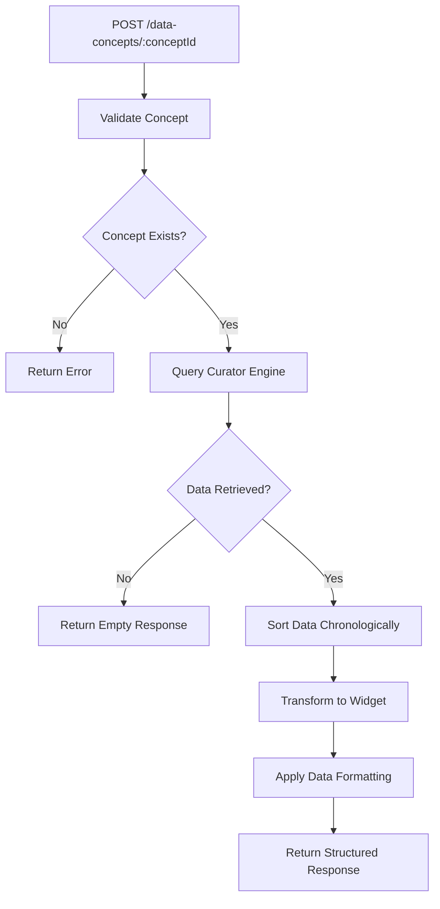
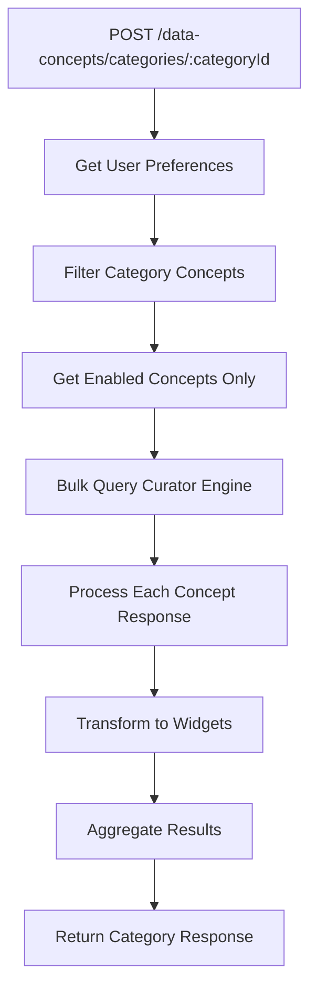
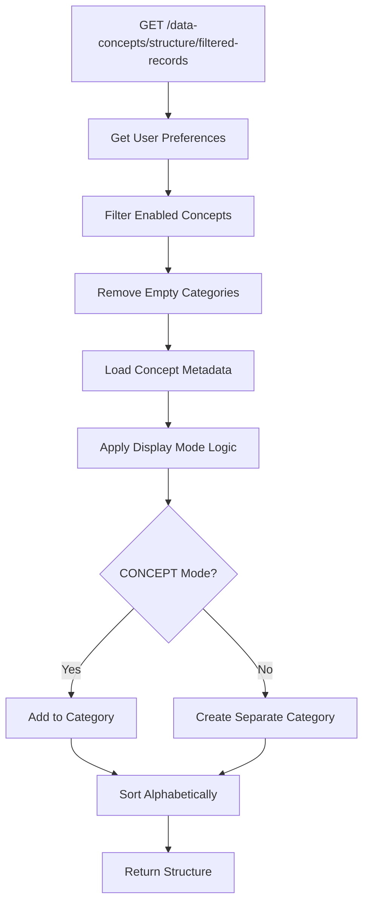

# 🩺 Data Concept Controller - Clinical Data Retrieval & Visualization Engine

## 🎯 **Overview**

The **Data Concept Controller** is the core clinical data retrieval and visualization engine of the Navigator API. It serves as the intelligent bridge between healthcare data sources and frontend applications, providing structured, preference-filtered clinical data through a sophisticated widget-based rendering system.

---

## 📍 **Core Purpose & Architecture**

### **What is Data Concept Controller?**
Data Concept Controller is a comprehensive clinical data management system that:
- **Retrieves clinical data** from multiple healthcare sources via Curator Engine
- **Transforms raw data** into structured, display-ready widgets
- **Applies user preferences** to filter and personalize data presentation
- **Supports multiple visualization formats** (charts, tables, lists, values)
- **Handles complex data types** (allergies, medications, lab results, procedures)
- **Provides intelligent error handling** and fallback mechanisms
- **Enables dynamic data categorization** and hierarchical organization

### **Data Concept Architecture**

```
┌─────────────────────────────────────────────────────────────┐
│           Data Concept Controller Architecture              │
│  ┌─────────────────────────────────────────────────────┐    │
│  │           Clinical Data Retrieval                    │    │
│  │  ├─ Curator Engine ────┬─ Epic, Cerner, FHIR        │    │
│  │  ├─ Bulk Operations ───┼─ Parallel Data Fetching     │    │
│  │  ├─ Data Validation ───┼─ Date Sorting & Filtering   │    │
│  │  └─ Error Handling ────┴─ Graceful Degradation       │    │
│  └─────────────────────────────────────────────────────┘    │
│                                                             │
│  ┌─────────────────────────────────────────────────────┐    │
│  │           Data Transformation Engine               │    │
│  │  ├─ Widget Factory ─────┬─ 8+ Widget Types         │    │
│  │  ├─ Data Parsing ───────┼─ Type-Specific Parsing    │    │
│  │  ├─ Unit Conversion ────┼─ Human-Friendly Formats   │    │
│  │  └─ Response Mapping ───┴─ Standardized Output      │    │
│  └─────────────────────────────────────────────────────┘    │
│                                                             │
│  ┌─────────────────────────────────────────────────────┐    │
│  │           Personalization Layer                     │    │
│  │  ├─ Preference Integration ─┬─ User Settings        │    │
│  │  ├─ Specialty Filtering ────┼─ Provider Context     │    │
│  │  ├─ Dynamic Categories ─────┼─ Enabled/Disabled     │    │
│  │  └─ Structure Generation ──┴─ UI-Ready Format       │    │
│  └─────────────────────────────────────────────────────┘    │
└─────────────────────────────────────────────────────────────┘
```

---

## 🔧 **Complete Implementation**

### **1. Controller Implementation**

```typescript
// File: src/controllers/dataconcept/dataconcept.controller.ts

import { Body, Controller, Delete, Get, Param, Post, Put, Query } from '@nestjs/common';
import {
  ApiBearerAuth,
  ApiOperation,
  ApiResponse,
  ApiTags,
} from '@nestjs/swagger';
import { DataconceptService } from './dataconcept.service';
import { ConceptResolverContextDto } from './dto/concept-resolver-context.dto';
import { DataconceptDto } from './dto/dataconcept.dto';
import { DataconceptStructureService } from './dataconcept-structure.service';
import {
  ConceptEntry,
  ConceptResolverResponseDto,
} from './dto/concept-resolver.response.dto';
import { ConceptStructureDto } from './dto/concept-structure.dto';
import { CurrentUser } from 'src/decorators/current-user.decorator';
import { DataConceptRequestDto } from './dto/dataconcept.request.dto';
import { Dataconcept } from './entities/dataconcept.entity';
import { CategoryDto } from './dto/category.dto';

@ApiTags('Data Concept Resolver')
@ApiBearerAuth()
@Controller('/data-concepts')
export class DataConceptController {
  constructor(
    private dataconceptService: DataconceptService,
    private dataconceptStructureService: DataconceptStructureService,
  ) {}

  /**
   * Get complete catalog of available clinical data concepts
   * Supports both basic and enhanced metadata retrieval
   */
  @ApiOperation({
    summary: 'Get the list of all clinical data concepts available',
    description: `
    Retrieves the complete catalog of clinical data concepts available in the system.

    **Concept Catalog Features:**
    - Complete clinical data concept inventory
    - Category-based organization (Labs, Vitals, Allergies, etc.)
    - Data type classification (Trend Charts, Single Values, Conditions)
    - Display mode configuration (Individual vs Category display)
    - Alphabetical sorting by category and concept name

    **Use Cases:**
    - Frontend application initialization
    - Dynamic UI component generation
    - Clinical workflow configuration
    - Administrative concept management
    - Integration testing and validation

    **Performance Notes:**
    - Cached for optimal response times
    - Sorted results for consistent presentation
    - Lightweight metadata-only responses
    `,
  })
  @ApiResponse({
    status: 200,
    description: 'All Clinical Data Concepts available to the Data Concept Resolver',
    type: [DataconceptDto],
    examples: {
      'Basic Response': {
        value: [
          {
            name: 'Hemoglobin',
            category: 'Hematology Labs',
            conceptId: '956c4584-42bf-4550-bb8a-0d7db4c403d9',
          },
          {
            name: 'Hematocrit',
            category: 'Hematology Labs',
            conceptId: '76638f43-5eaa-41db-a944-00cf9c994099',
          },
        ],
      },
      'Enhanced Response': {
        value: [
          {
            name: 'Hemoglobin',
            category: 'Hematology Labs',
            conceptId: '956c4584-42bf-4550-bb8a-0d7db4c403d9',
            dataType: 'TREND_CHART',
            displayMode: 'CONCEPT',
          },
        ],
      },
    },
  })
  @Get()
  async getDataConcept(): Promise<DataconceptDto[]> {
    return await this.dataconceptService.findAll();
  }

  /**
   * Enhanced concept catalog with full metadata
   * Version 2 endpoint with additional type and display information
   */
  @ApiOperation({
    summary: 'Get enhanced list of all clinical data concepts (v2)',
    description: `
    Retrieves the complete clinical data concept catalog with enhanced metadata.

    **Enhanced Metadata:**
    - Data type information (TREND_CHART, SINGLE_VALUE, CONDITION, etc.)
    - Display mode configuration (CONCEPT vs CATEGORY)
    - Complete relationship mappings
    - TypeORM eager loading optimization

    **Data Types Supported:**
    - TREND_CHART: Time-series data with chart visualization
    - SINGLE_VALUE: Latest value display
    - CONDITION: Medical conditions and diagnoses
    - PROCEDURE: Surgical and medical procedures
    - MEDICATION_TREATMENT: Medication information
    - ALLERGY: Allergy and intolerance data
    - MEDICAL_HISTORY: Diagnostic reports and notes
    - SMOKING_HISTORY: Tobacco use information

    **Display Modes:**
    - CONCEPT: Individual concept display within category
    - CATEGORY: Concept displayed as separate category
    `,
  })
  @Get()
  @Version('2')
  async getDataConceptV2(): Promise<DataconceptDto[]> {
    return await this.dataconceptService.findAllConcepts();
  }

  /**
   * Resolve individual clinical data concept with patient context
   * Core data retrieval endpoint for single concepts
   */
  @ApiOperation({
    summary: 'Get Resolved Concept for the given context',
    description: `
    Resolves and retrieves clinical data for a specific concept and patient combination.

    **Resolution Process:**
    1. Validate concept existence in database
    2. Query Curator Engine for patient-specific data
    3. Transform raw data into appropriate widget format
    4. Apply data validation and error handling
    5. Return structured response with success/error status

    **Data Transformation:**
    - Automatic widget type detection based on data characteristics
    - Date formatting and sorting (oldest to latest)
    - Unit conversion and human-friendly formatting
    - Data validation and null handling
    - Error categorization and user-friendly messages

    **Supported Data Types:**
    - Laboratory results with trend analysis
    - Vital signs with chart visualization
    - Medical conditions with date/description
    - Allergy information with reactions
    - Medication data with dosages
    - Smoking history with quit intervals
    - Diagnostic reports with attachments

    **Error Handling:**
    - Concept not found validation
    - Curator Engine connectivity issues
    - Data parsing and transformation errors
    - Patient permission and access validation
    `,
  })
  @ApiResponse({
    status: 200,
    description: 'Resolved concept for given context',
    schema: {
      type: 'object',
      properties: {
        id: { type: 'string', example: 'de04eb2d-bc23-4307-8095-d19cba840a14' },
        label: { type: 'string', example: 'Angina' },
        type: { type: 'string', example: 'CONDITION' },
        success: { type: 'boolean', example: true },
        data: {
          oneOf: [
            { $ref: '#/components/schemas/ConditionWidget' },
            { $ref: '#/components/schemas/DataTableWidget' },
            { type: 'null' },
          ],
        },
        error: { type: 'object', nullable: true },
      },
    },
  })
  @ApiResponse({ status: 400, description: 'Concept ID is not valid' })
  @ApiResponse({
    status: 401,
    description: 'User is not authenticated',
  })
  @ApiResponse({ status: 403, description: 'User is blacklisted' })
  @Post('/:conceptId')
  async resolveDataConcept(
    @Param('conceptId') conceptId: string,
    @Body() context: ConceptResolverContextDto,
  ): Promise<ConceptEntry> {
    return this.dataconceptService.resolveConcept(
      conceptId,
      context.patientMrn,
    );
  }

  /**
   * Resolve entire clinical data category with preference filtering
   * Advanced endpoint supporting bulk concept resolution
   */
  @ApiOperation({
    summary: 'Get Resolved Concept Category for the given context',
    description: `
    Resolves all enabled clinical data concepts within a category for a specific patient.

    **Category Resolution Process:**
    1. Retrieve user's preference settings for the category
    2. Filter enabled concepts based on specialty and condition
    3. Resolve each enabled concept in parallel (bulk operation)
    4. Aggregate results with error handling
    5. Return structured category response

    **Preference Integration:**
    - Specialty-based concept filtering
    - Condition-aware data prioritization
    - User-specific enable/disable settings
    - Inference Engine recommendations
    - Dynamic category structure generation

    **Performance Optimizations:**
    - Parallel concept resolution using Promise.all
    - Bulk Curator Engine queries
    - Efficient preference caching
    - Lazy loading of category metadata

    **Business Logic:**
    - Handle concepts with CATEGORY display mode as single-item categories
    - Support legacy applications with different display expectations
    - Provide comprehensive error aggregation
    - Maintain data consistency across category concepts

    **Response Structure:**
    - Category metadata (ID, label, total count)
    - Array of resolved concept entries
    - Individual success/error status per concept
    - Structured data in appropriate widget formats
    `,
  })
  @ApiResponse({
    status: 200,
    description: 'Resolved concept for given context',
    schema: {
      type: 'object',
      properties: {
        id: { type: 'string', example: '6d051f81-c223-4cc9-97db-25b5c4f9139e' },
        label: { type: 'string', example: 'Past Medical History' },
        total: { type: 'number', example: 5 },
        entries: {
          type: 'array',
          items: {
            type: 'object',
            properties: {
              id: { type: 'string', example: 'de04eb2d-bc23-4307-8095-d19cba840a14' },
              label: { type: 'string', example: 'Angina' },
              type: { type: 'string', example: 'CONDITION' },
              success: { type: 'boolean', example: true },
              data: { type: 'object', nullable: true },
            },
          },
        },
      },
    },
  })
  @ApiResponse({ status: 400, description: 'Category ID is not valid' })
  @ApiResponse({
    status: 401,
    description: 'User is not authenticated',
  })
  @ApiResponse({
    status: 422,
    description: 'Unprocessable Entity',
  })
  @ApiResponse({ status: 403, description: 'User is blacklisted' })
  @Post('/categories/:categoryId')
  async resolveDataConceptCategory(
    @CurrentUser() user: any,
    @Param('categoryId') categoryId: string,
    @Body() context: ConceptResolverContextDto,
  ): Promise<ConceptResolverResponseDto> {
    const patientMrn = (context.patientMrn || '').trim();
    const condition = (context.condition || '').trim();
    const specialty = (context.specialty || '').trim();

    if (!patientMrn) {
      throw new UnprocessableEntityException('MRN is required');
    }

    return this.dataconceptService.resolveConceptCategory(
      user.lanId,
      specialty,
      condition,
      categoryId,
      patientMrn,
    );
  }

  /**
   * Generate personalized clinical data structure based on user preferences
   * Dynamic UI structure generation for filtered patient records
   */
  @ApiOperation({
    summary: 'Get the data concepts structure for the filtered patient records',
    description: `
    Generates a personalized clinical data structure based on user preferences and context.

    **Structure Generation Process:**
    1. Retrieve user's clinical data preferences
    2. Filter preferences by specialty and condition
    3. Remove disabled concepts and empty categories
    4. Apply display mode logic (CONCEPT vs CATEGORY)
    5. Generate hierarchical structure for UI consumption

    **Display Mode Logic:**
    - CONCEPT: Individual concepts displayed within category containers
    - CATEGORY: Concepts displayed as separate top-level categories
    - Dynamic category creation for CATEGORY mode concepts
    - Alphabetical sorting within categories

    **Preference Integration:**
    - Real-time preference application
    - Specialty-aware filtering
    - Condition-based prioritization
    - User-specific customization

    **Performance Features:**
    - Single database query for all concepts
    - In-memory preference processing
    - Efficient category mapping
    - Optimized response structure

    **Use Cases:**
    - Dynamic clinical dashboard generation
    - Mobile application data structure
    - Personalized clinical workflow UI
    - Specialty-specific data organization
    `,
  })
  @ApiResponse({
    status: 200,
    description: 'Data Shortcuts records structure',
    type: [ConceptStructureDto],
    example: [
      {
        id: '505709e3-cacf-4880-ab03-9b3cd4df66e4',
        label: 'Allergies',
        concepts: [
          {
            id: '75447a25-23ef-4fb9-8761-efbb54d24892',
            label: 'Allergies',
          },
        ],
      },
      {
        id: '06f03a3a-4077-465c-8ae5-a1e778bb5afa',
        label: 'Anticoagulation Medications',
        concepts: [
          {
            id: '06f03a3a-4077-465c-8ae5-a1e778bb5afa',
            label: 'Anticoagulation Medications',
          },
        ],
      },
    ],
  })
  @ApiResponse({
    status: 401,
    description: 'User is not authenticated',
  })
  @ApiResponse({ status: 403, description: 'User is blacklisted' })
  @Get('/structure/filtered-records')
  async getFilteredPatientRecordsConceptStructure(
    @CurrentUser() user: any,
    @Query('specialty') specialty: string = '',
    @Query('condition') condition: string = '',
  ): Promise<ConceptStructureDto[]> {
    return this.dataconceptStructureService.getDataShortcutsStructure(
      user.lanId,
      specialty,
      condition,
    );
  }

  // CRUD Operations for Administrative Management

  /**
   * Create new clinical data concept (Administrative)
   */
  @ApiOperation({
    summary: 'Create a new data concept',
    description:
      'Creates and returns a new clinical data concept in the system.',
  })
  @ApiResponse({
    status: 201,
    description: 'The data concept has been successfully created.',
    type: DataconceptDto,
  })
  @Post()
  async createConcept(
    @Query() params: DataConceptRequestDto,
  ): Promise<Dataconcept> {
    return this.dataconceptService.createConcept(params);
  }

  /**
   * Update existing clinical data concept (Administrative)
   */
  @ApiOperation({
    summary: 'Update an existing data concept',
    description:
      'Updates the data concept identified by the provided concept ID.',
  })
  @ApiResponse({
    status: 200,
    description: 'The data concept has been successfully updated.',
    type: DataconceptDto,
  })
  @ApiResponse({
    status: 404,
    description: 'No data concept found with the given concept ID.',
  })
  @Put('/:conceptId')
  async updateConcept(
    @Param('conceptId') conceptId: string,
    @Query() updateDto: DataConceptRequestDto,
  ): Promise<Dataconcept> {
    return this.dataconceptService.updateConcept(conceptId, updateDto);
  }

  /**
   * Delete clinical data concept (Administrative)
   */
  @ApiOperation({
    summary: 'Delete a data concept',
    description:
      'Deletes the data concept associated with the provided concept ID.',
  })
  @ApiResponse({
    status: 204,
    description: 'The data concept has been successfully deleted.',
  })
  @ApiResponse({
    status: 404,
    description: 'No data concept found with the given concept ID.',
  })
  @Delete('/:conceptId')
  async deleteConcept(
    @Param('conceptId') conceptId: string,
  ): Promise<Dataconcept> {
    return this.dataconceptService.deleteConcept(conceptId);
  }

  // Category Management Endpoints

  /**
   * Retrieve all clinical data categories
   */
  @ApiOperation({
    summary: 'Get a list of categories',
    description: 'Get all categories in the system.',
  })
  @ApiResponse({
    status: 200,
    description: 'List of categories.',
    type: Array<CategoryDto>,
  })
  @Get('/categories')
  async getCategories(): Promise<CategoryDto[]> {
    return this.dataconceptService.fetchCategories();
  }

  /**
   * Update clinical data category (Administrative)
   */
  @ApiOperation({
    summary: 'Update a given category',
    description: 'Update and returns a category in the system.',
  })
  @ApiResponse({
    status: 200,
    description: 'The category has been successfully updated.',
    type: CategoryDto,
  })
  @Put('/category/:categoryId')
  async updateCategory(@Query() params: CategoryDto): Promise<CategoryDto> {
    return this.dataconceptService.updateCategory(params);
  }

  /**
   * Delete clinical data category (Administrative)
   */
  @ApiOperation({
    summary: 'Delete a category by Id',
    description: 'Deletes a category by Id.',
  })
  @ApiResponse({
    status: 200,
    description: 'Category successfully deleted.',
  })
  @Delete('/category/:categoryId')
  async deleteCategory(
    @Query('categoryId') categoryId: string,
  ): Promise<boolean> {
    return this.dataconceptService.deleteCategory(categoryId);
  }
}
```

### **2. Service Implementation**

```typescript
// File: src/controllers/dataconcept/dataconcept.service.ts

import { CuratorEngineService } from '@app/curator-engine';
import { ClinicalDataDto } from '@app/curator-engine/dto/clinical-data.dto';
import { ClinicalDataParameters } from '@app/curator-engine/types/parameters';
import { faker } from '@faker-js/faker';
import {
  AllergyIntoleranceDataModel,
  ConditionDataModel,
  DiagnosticReportDataModel,
  MedicationDataModel,
  MedicationStatementDataModel,
  ObservationDataModel,
  ProcedureDataModel,
} from '@mayoclinic/data-concept-resolver-projections/dist/maps/types';
import {
  BadRequestException,
  HttpException,
  HttpStatus,
  Inject,
  Injectable,
  InternalServerErrorException,
  Logger,
  NotFoundException,
} from '@nestjs/common';
import { InjectRepository } from '@nestjs/typeorm';
import { DateTime } from 'luxon';
import { Repository } from 'typeorm';
import { PreferencesService } from '../preferences/preferences.service';
import {
  ConceptEntry,
  ConceptResolverResponseDto,
  ErrorInfo,
} from './dto/concept-resolver.response.dto';
import { DataconceptDto } from './dto/dataconcept.dto';
import {
  ALLERGIES_HEADERS,
  AllergyClinicalStatus,
  AllergyWidget,
} from './dto/widgets/allergy.widget';
import { BaseWidget } from './dto/widgets/base.widget';
import { WidgetData, WidgetType } from './dto/widgets/common';
import { ConditionWidget } from './dto/widgets/condition.widget';
import { DataPoint, DataTableWidget } from './dto/widgets/data-table.widget';
import { GenericValueWidget } from './dto/widgets/generic-value.widget';
import { MedicalHistoryWidget } from './dto/widgets/medical-history.widget';
import { WidgetList } from './dto/widgets/widget-list.widget';
import { Dataconcept } from './entities/dataconcept.entity';
import { ClinicalDataTypeOptions } from './utils/clinical-data-type.options';
import { DataconceptDisplayModeOptions } from './utils/concept-display-mode.options';
import { ConfigType } from '@nestjs/config';
import curatorEngineConfig from '@app/curator-engine/config/curator-engine.config';
import { DataConceptRequestDto } from './dto/dataconcept.request.dto';
import { DataconceptSeedUtils } from 'src/migrations/seed-utils/dataconcept.utils';
import { CategoryDto } from './dto/category.request.dto';

/**
 * Interface for passing information about a data concept
 * with its results from Curator Engine
 */
interface DataconceptResponse {
  concept: Dataconcept;
  data?: ClinicalDataDto[];
  error?: ErrorInfo;
}

@Injectable()
export class DataconceptService {
  private logger = new Logger(DataconceptService.name);

  constructor(
    @Inject(curatorEngineConfig.KEY)
    private readonly engineConfig: ConfigType<typeof curatorEngineConfig>,
    @InjectRepository(Dataconcept)
    private dataconceptRepository: Repository<Dataconcept>,
    private curatorEngine: CuratorEngineService,
    private preferencesService: PreferencesService,
  ) {}

  /**
   * Get all clinical data concepts with basic information
   * Optimized for catalog browsing and administrative purposes
   */
  async findAll(): Promise<DataconceptDto[]> {
    const result = await this.dataconceptRepository.find({
      relations: ['category'],
    });

    // Map results to DTO with category information
    const concepts = result.map((concept) => ({
      name: concept.name,
      conceptId: concept.conceptId,
      category: concept.category.name,
    } as DataconceptDto));

    // Sort by category then by concept name for consistent presentation
    return concepts.sort((a, b) => {
      const categoryOrder = a.category.localeCompare(b.category);
      if (categoryOrder == 0) {
        return a.name.localeCompare(b.name);
      }
      return categoryOrder;
    });
  }

  /**
   * Get all concepts with enhanced metadata including data types and display modes
   * Version 2 with additional technical information
   */
  async findAllConcepts(): Promise<DataconceptDto[]> {
    const result = await this.dataconceptRepository.find({
      relations: ['category', 'dataType'],
    });

    const concepts = result.map((concept) => ({
      name: concept.name,
      conceptId: concept.conceptId,
      category: concept.category.name,
      displayMode: concept.displayMode,
      dataType: concept.dataType?.type || '',
    } as DataconceptDto));

    return concepts.sort((a, b) => {
      const categoryOrder = a.category.localeCompare(b.category);
      if (categoryOrder == 0) {
        return a.name.localeCompare(b.name);
      }
      return categoryOrder;
    });
  }

  /**
   * Resolve individual concept for specific patient
   * Core data retrieval logic with comprehensive error handling
   */
  async resolveConcept(
    conceptId: string,
    patientMrn: string,
  ): Promise<ConceptEntry> {
    const result = await this.resolveConceptList([{ conceptId, patientMrn }]);
    return result[0];
  }

  /**
   * Resolve multiple concepts in parallel for optimal performance
   * Bulk operation with sophisticated error handling and data transformation
   */
  private async resolveConceptList(
    conceptList: ClinicalDataParameters[],
  ): Promise<ConceptEntry[]> {
    const resultsMap: Record<string, ConceptEntry> = {};
    const dataconcepts: Record<string, Dataconcept> = {};

    // Validate all concepts exist before processing
    for (const { conceptId } of conceptList) {
      const concept = await this.dataconceptRepository.findOne({
        where: { conceptId },
        relations: { category: true, dataType: true },
      });

      if (!concept) {
        this.logger.warn(`Concept ${conceptId} does not exist`);
        resultsMap[conceptId] = {
          id: conceptId,
          label: '',
          type: '',
          success: false,
          error: {
            code: HttpStatus.BAD_REQUEST,
            message: `Concept ${conceptId} does not exist`,
          },
        };
      }
      dataconcepts[conceptId] = concept;
    }

    // Filter out failed concepts
    conceptList = conceptList.filter(
      (concept) => !(concept.conceptId in resultsMap),
    );

    // Bulk query Curator Engine for optimal performance
    const response = await this.curatorEngine.getClinicalData(conceptList);

    // Process each Curator Engine response
    for (let idx = 0; idx < conceptList.length; idx++) {
      const { conceptId, patientMrn } = conceptList[idx];
      const conceptResponse = response[idx];
      const concept = dataconcepts[conceptId];

      try {
        // Mock error handling for testing
        if (this.isMockErrorScenario(patientMrn, conceptId)) {
          throw new InternalServerErrorException(`Mock error for concept ${conceptId}`);
        }

        if (!conceptResponse.success) {
          throw new InternalServerErrorException(
            `Clinical data could not be retrieved for ${concept.name}`,
          );
        }

        const initialData = conceptResponse.data;

        if (!initialData || initialData.length == 0) {
          resultsMap[conceptId] = this.createConceptResponse({
            concept,
          }, patientMrn);
        } else {
          // Process and sort data chronologically
          const processedData = this.processAndSortData(initialData);
          resultsMap[conceptId] = this.createConceptResponse(
            { concept, data: processedData },
            patientMrn,
          );
        }
      } catch (err) {
        resultsMap[conceptId] = this.createErrorResponse(err, concept);
      }
    }

    return conceptList.map((concept) => resultsMap[concept.conceptId]);
  }

  /**
   * Resolve entire category of concepts with preference filtering
   * Advanced operation combining preferences and bulk data retrieval
   */
  async resolveConceptCategory(
    userLanId: string,
    specialty: string,
    condition: string,
    categoryId: string,
    patientMrn: string,
  ): Promise<ConceptResolverResponseDto> {
    // Get user's preferences for this category
    const preferences = await this.preferencesService.getDataConceptPreferences(
      userLanId,
      specialty,
      condition,
    );

    const categoryPreferences = preferences.filter(
      (pref) => pref.id === categoryId,
    );

    // Handle legacy CATEGORY display mode concepts
    if (!categoryPreferences || categoryPreferences.length !== 1) {
      const concept = await this.findConceptById(categoryId);

      if (concept?.displayMode !== DataconceptDisplayModeOptions.CATEGORY) {
        throw new BadRequestException(
          `Could not get preferences for category with ID ${categoryId}`,
        );
      }

      // Treat as single-concept category
      const curatorEngineResponse = await this.resolveConcept(
        categoryId,
        patientMrn,
      );

      return {
        id: concept.conceptId,
        label: concept.name,
        total: 1,
        entries: [curatorEngineResponse],
      };
    }

    // Get enabled concepts for this category
    const enabledConcepts = this.getEnabledConcepts(
      categoryPreferences[0].concepts,
    );

    // Resolve all enabled concepts in parallel
    const curatorEngineResponse = await this.resolveConceptList(enabledConcepts);

    return {
      id: categoryId,
      label: categoryPreferences[0].label,
      total: curatorEngineResponse.length,
      entries: curatorEngineResponse,
    };
  }

  /**
   * Process and sort clinical data chronologically
   */
  private processAndSortData(initialData: ClinicalDataDto[]): ClinicalDataDto[] {
    // Separate valid and invalid dates
    const dataWithDates = initialData.filter((x) =>
      DateTime.fromISO(x.date).isValid,
    );
    const dataWithoutDates = initialData.filter((x) =>
      !DateTime.fromISO(x.date).isValid,
    );

    // Sort valid dates chronologically (oldest first)
    dataWithDates.sort((a, b) => {
      const dateA = DateTime.fromISO(a.date);
      const dateB = DateTime.fromISO(b.date);
      return dateA.valueOf() - dateB.valueOf();
    });

    // Return sorted data with invalid dates at the beginning
    return [...dataWithoutDates, ...dataWithDates];
  }

  /**
   * Get enabled concepts from preferences
   */
  private getEnabledConcepts(concepts: any[]): ClinicalDataParameters[] {
    return concepts
      .filter((concept) => concept.enabled)
      .map((concept) => ({
        conceptId: concept.id,
        patientMrn: '', // Will be set by caller
      }));
  }

  /**
   * Find concept by ID with error handling
   */
  private async findConceptById(conceptId: string): Promise<Dataconcept | null> {
    return await this.dataconceptRepository.findOne({
      where: { conceptId },
      relations: { category: true, dataType: true },
    });
  }

  /**
   * Check if this is a mock error scenario for testing
   */
  private isMockErrorScenario(patientMrn: string, conceptId: string): boolean {
    return (
      (process.env.ENV === 'local' ||
        process.env.ENV === 'dev' ||
        process.env.ENV === 'test') &&
      patientMrn === '11265952' &&
      conceptId === '0d87cbff-e35d-480b-b741-1e9da3aaab7b'
    );
  }

  /**
   * Create standardized concept response
   */
  private createConceptResponse(
    result: DataconceptResponse,
    patientMrn?: string,
  ): ConceptEntry {
    let dataType: string = this.toWidgetType(result.concept.dataType.type);
    let data: WidgetData;

    // Transform data based on concept type
    switch (result.concept.dataType.type) {
      case ClinicalDataTypeOptions.SINGLE_VALUE:
      case ClinicalDataTypeOptions.TREND_CHART:
        data = this.parseDataTableResponse(result.data as ObservationDataModel[]);
        // Determine widget type based on data characteristics
        dataType = this.determineWidgetType(data, dataType);
        break;

      case ClinicalDataTypeOptions.CONDITION:
        data = this.parseConditionResponse(result.data as ConditionDataModel[]);
        break;

      case ClinicalDataTypeOptions.PROCEDURE:
        data = this.parseProcedureResponse(result.data as ProcedureDataModel[]);
        break;

      case ClinicalDataTypeOptions.SMOKING_HISTORY:
        data = this.parseSmokingHistoryResponse(result.data as ObservationDataModel[]);
        break;

      case ClinicalDataTypeOptions.MEDICATION_TREATMENT:
        data = this.parseMedicationsResponse(
          result.data as (MedicationDataModel | MedicationStatementDataModel)[],
        );
        break;

      case ClinicalDataTypeOptions.ALLERGY:
        data = this.parseAllergies(result.data as AllergyIntoleranceDataModel[]);
        break;

      case ClinicalDataTypeOptions.MEDICAL_HISTORY:
        data = this.parseDiagnosticReport(
          result.data as (DiagnosticReportDataModel | ObservationDataModel)[],
          patientMrn,
        );
        break;
    }

    return {
      id: result.concept.conceptId,
      label: result.concept.name,
      type: dataType,
      success: !result.error,
      data,
      error: result.error,
    };
  }

  /**
   * Determine appropriate widget type based on data characteristics
   */
  private determineWidgetType(data: DataTableWidget, currentType: string): string {
    if (!data?.entries) return currentType;

    const numericalEntries = data.entries.filter((entry) =>
      !isNaN(+entry.value),
    );

    // Use chart if we have multiple numerical data points
    return numericalEntries.length > 1 ? WidgetType.DATA_TABLE_CHART : WidgetType.DATA_TABLE;
  }

  /**
   * Create error response with appropriate HTTP status
   */
  private createErrorResponse(err: Error, concept: Dataconcept): ConceptEntry {
    this.logger.error({
      message: `Error for concept ${concept.conceptId} [${concept.name}] of '${concept.category.name}' category`,
      errMessage: err.message,
      conceptId: concept.conceptId,
      conceptName: concept.name,
      conceptCategory: concept.category.name,
    });

    const error: ErrorInfo = {
      code: err instanceof HttpException ? err.getStatus() : HttpStatus.INTERNAL_SERVER_ERROR,
      message: err instanceof HttpException ? err.message :
        `Clinical data could not be retrieved for ${concept.name}`,
    };

    return this.createConceptResponse({
      concept,
      error,
    });
  }

  // Data parsing methods for different clinical data types
  // ... (implementation details in the original file)

  // CRUD operations for administrative management
  async createConcept(createDto: DataConceptRequestDto): Promise<Dataconcept> {
    const queryRunner = this.dataconceptRepository.manager.connection.createQueryRunner();

    const concept = await DataconceptSeedUtils.createConcept(queryRunner, {
      conceptId: faker.string.uuid(),
      ...createDto,
    });
    return concept;
  }

  async updateConcept(
    conceptId: string,
    updateDto: DataConceptRequestDto,
  ): Promise<Dataconcept> {
    const conceptInDb = await this.dataconceptRepository.findOneBy({ conceptId });

    if (!conceptInDb) {
      throw new NotFoundException(`Concept with ID ${conceptId} not found`);
    }

    const queryRunner = this.dataconceptRepository.manager.connection.createQueryRunner();

    const concept = await DataconceptSeedUtils.updateConcept(queryRunner, {
      conceptId: conceptId,
      ...updateDto,
    });

    return concept;
  }

  async deleteConcept(conceptId: string): Promise<Dataconcept> {
    const concept = await this.dataconceptRepository.findOneBy({ conceptId });

    if (!concept) {
      throw new NotFoundException(`Concept with ID ${conceptId} not found`);
    }

    await this.dataconceptRepository.remove(concept);
    return concept;
  }

  // Category management operations
  async fetchCategories(): Promise<CategoryDto[]> {
    const queryRunner = this.dataconceptRepository.manager.connection.createQueryRunner();
    return await DataconceptSeedUtils.fetchCategories(queryRunner);
  }

  async updateCategory(category: CategoryDto): Promise<CategoryDto> {
    const queryRunner = this.dataconceptRepository.manager.connection.createQueryRunner();
    return await DataconceptSeedUtils.updateCategory(queryRunner, category);
  }

  async deleteCategory(categoryId: string): Promise<boolean> {
    const queryRunner = this.dataconceptRepository.manager.connection.createQueryRunner();
    return await DataconceptSeedUtils.deleteCategory(queryRunner, categoryId);
  }
}
```

### **3. Structure Service Implementation**

```typescript
// File: src/controllers/dataconcept/dataconcept-structure.service.ts

import { Injectable } from '@nestjs/common';
import { InjectRepository } from '@nestjs/typeorm';
import { Repository } from 'typeorm';
import { PreferencesService } from '../preferences/preferences.service';
import { ConceptStructureDto } from './dto/concept-structure.dto';
import { Dataconcept } from './entities/dataconcept.entity';
import { DataconceptDisplayModeOptions } from './utils/concept-display-mode.options';

@Injectable()
export class DataconceptStructureService {
  constructor(
    private preferencesService: PreferencesService,
    @InjectRepository(Dataconcept)
    private dataconceptRepository: Repository<Dataconcept>,
  ) {}

  /**
   * Generate personalized clinical data structure based on user preferences
   * Creates hierarchical category-concept structure for UI consumption
   */
  async getDataShortcutsStructure(
    userId: string,
    specialty: string,
    condition: string,
  ): Promise<ConceptStructureDto[]> {
    // Get user preferences with specialty/condition filtering
    const preferences = await this.preferencesService.getDataConceptPreferences(
      userId,
      specialty,
      condition,
    );

    // Filter out disabled concepts from each category
    preferences.forEach((categoryPreferences) => {
      categoryPreferences.concepts = categoryPreferences.concepts.filter(
        (conceptPreference) => conceptPreference.enabled,
      );
    });

    // Remove categories with no enabled concepts
    const enabledCategories = preferences.filter(
      (categoryPreferences) => categoryPreferences.concepts.length > 0,
    );

    // Bulk load all concepts to avoid N+1 query problem
    const dbConcepts = await this.dataconceptRepository.find();

    // Create display mode mapping for efficient lookups
    const conceptDisplayModeMap = dbConcepts.reduce((accumulator, concept) => {
      accumulator[concept.conceptId] = concept.displayMode;
      return accumulator;
    }, {} as Record<string, DataconceptDisplayModeOptions>);

    // Build structure map with category-concept relationships
    const structureMap: Record<string, ConceptStructureDto> = {};

    for (const category of enabledCategories) {
      structureMap[category.id] = {
        id: category.id,
        label: category.label,
        concepts: [],
      };

      for (const concept of category.concepts) {
        const conceptDisplayMode = conceptDisplayModeMap[concept.id];

        switch (conceptDisplayMode) {
          case DataconceptDisplayModeOptions.CONCEPT:
            // Add concept to its parent category
            structureMap[category.id].concepts.push({
              id: concept.id,
              label: concept.label,
            });
            break;

          case DataconceptDisplayModeOptions.CATEGORY:
            // Create separate category for this concept
            structureMap[concept.id] = {
              id: concept.id,
              label: concept.label,
              concepts: [
                {
                  id: concept.id,
                  label: concept.label,
                },
              ],
            };
            break;
        }
      }

      // Remove categories with no concepts after display mode processing
      if (structureMap[category.id].concepts.length === 0) {
        delete structureMap[category.id];
        continue;
      }

      // Sort concepts alphabetically within categories
      structureMap[category.id].concepts.sort((a, b) =>
        a.label.localeCompare(b.label, undefined, { sensitivity: 'base' }),
      );
    }

    // Return alphabetically sorted structure
    return Object.values(structureMap).sort((a, b) =>
      a.label.localeCompare(b.label, undefined, { sensitivity: 'base' }),
    );
  }
}
```

### **4. Widget System Architecture**

```typescript
// File: src/controllers/dataconcept/dto/widgets/common.ts

/**
 * Supported widget types for clinical data visualization
 */
export enum WidgetType {
  DATA_TABLE = 'SINGLE_VALUE',        // Latest value display
  DATA_TABLE_CHART = 'TREND_CHART',   // Time-series with chart
  CONDITION = 'CONDITION',            // Medical conditions
  MEDICAL_HISTORY = 'MEDICAL_HISTORY', // Diagnostic reports
  VALUE = 'VALUE',                    // Simple value display
  WIDGET_LIST = 'WIDGET_LIST',        // Multiple widgets
  ALLERGY = 'ALLERGY',                // Allergy information
  PATHOLOGY_REPORT = 'PATHOLOGY_REPORT', // Pathology data
  IMAGING_STUDY = 'IMAGING_STUDY',    // Imaging results
  PROCEDURE = 'PROCEDURE',            // Procedure information
  ERROR = 'ERROR',                    // Error state display
}

/**
 * Supported clinical data types that can be transformed into widgets
 */
export type WidgetData =
  | MedicalHistoryWidget
  | ConditionWidget
  | DataTableWidget
  | GenericValueWidget
  | AllergyWidget
  | WidgetList;

/**
 * Base widget structure with common properties
 */
export class BaseWidget<T = WidgetData> {
  id: string;
  label: string;
  type: WidgetType;
  data?: T;
}

/**
 * Content attachments for widgets (reports, images, etc.)
 */
export class WidgetAttachment {
  content?: string;        // Base64 encoded content
  contentType: string;     // MIME type
  url?: string;           // External URL for content
}
```

### **5. Data Type Options & Utilities**

```typescript
// File: src/controllers/dataconcept/utils/clinical-data-type.options.ts

/**
 * Clinical data type classifications
 * Maps to specific widget transformation logic
 */
export enum ClinicalDataTypeOptions {
  SINGLE_VALUE = 'SINGLE_VALUE',
  TREND_CHART = 'TREND_CHART',
  CONDITION = 'CONDITION',
  PROCEDURE = 'PROCEDURE',
  SMOKING_HISTORY = 'SMOKING_HISTORY',
  MEDICATION_TREATMENT = 'MEDICATION_TREATMENT',
  ALLERGY = 'ALLERGY',
  MEDICAL_HISTORY = 'MEDICAL_HISTORY',
}

// File: src/controllers/dataconcept/utils/concept-display-mode.options.ts

/**
 * Display mode options for clinical data concepts
 * Controls how concepts are organized in the UI
 */
export enum DataconceptDisplayModeOptions {
  CONCEPT = 'CONCEPT',     // Display within category
  CATEGORY = 'CATEGORY',   // Display as separate category
}
```

### **6. Database Entities**

```typescript
// File: src/controllers/dataconcept/entities/dataconcept.entity.ts

import {
  Column,
  Entity,
  JoinTable,
  ManyToOne,
  PrimaryGeneratedColumn,
} from 'typeorm';
import { DataconceptDisplayModeOptions } from '../utils/concept-display-mode.options';
import { ClinicalDataType } from './clinical-data-type.entity';
import { DataconceptCategory } from './dataconceptCategory.entity';

@Entity()
export class Dataconcept {
  @PrimaryGeneratedColumn()
  id: number;

  @Column()
  name: string;

  @Column({ unique: true })
  conceptId: string;

  @JoinTable()
  @ManyToOne(
    () => DataconceptCategory,
    (category) => category.dataconcept,
    { cascade: true },
  )
  category: DataconceptCategory;

  @JoinTable()
  @ManyToOne(
    () => ClinicalDataType,
    (dataType) => dataType.dataconcept,
    { cascade: true, nullable: true },
  )
  dataType: ClinicalDataType;

  @Column({
    type: 'enum',
    enum: DataconceptDisplayModeOptions,
    default: DataconceptDisplayModeOptions.CONCEPT,
  })
  displayMode: DataconceptDisplayModeOptions;
}

// File: src/controllers/dataconcept/entities/clinical-data-type.entity.ts

import { Column, Entity, OneToMany, PrimaryGeneratedColumn } from 'typeorm';
import { Dataconcept } from './dataconcept.entity';

@Entity()
export class ClinicalDataType {
  @PrimaryGeneratedColumn()
  id: number;

  @Column({ unique: true })
  type: string;

  @OneToMany(() => Dataconcept, (dataconcept) => dataconcept.dataType)
  dataconcept: Dataconcept[];
}

// File: src/controllers/dataconcept/entities/dataconceptCategory.entity.ts

import { Column, Entity, OneToMany, PrimaryGeneratedColumn } from 'typeorm';
import { Dataconcept } from './dataconcept.entity';

@Entity()
export class DataconceptCategory {
  @PrimaryGeneratedColumn()
  id: number;

  @Column({ unique: true })
  name: string;

  @Column({ unique: true })
  categoryId: string;

  @OneToMany(() => Dataconcept, (dataconcept) => dataconcept.category)
  dataconcept: Dataconcept[];
}
```

---

## 🔄 **Data Flow Architecture**

### **1. Individual Concept Resolution Flow**



### **2. Category Resolution Flow**



### **3. Structure Generation Flow**



---

## 🔧 **Key Implementation Details**

### **1. Widget Transformation Engine**

```typescript
// Advanced data transformation with type-specific parsing
private createConceptResponse(
  result: DataconceptResponse,
  patientMrn?: string,
): ConceptEntry {
  let dataType: string = this.toWidgetType(result.concept.dataType.type);
  let data: WidgetData;

  // Type-specific transformation logic
  switch (result.concept.dataType.type) {
    case ClinicalDataTypeOptions.CONDITION:
      data = this.parseConditionResponse(result.data as ConditionDataModel[]);
      break;

    case ClinicalDataTypeOptions.ALLERGY:
      data = this.parseAllergies(result.data as AllergyIntoleranceDataModel[]);
      break;

    case ClinicalDataTypeOptions.SMOKING_HISTORY:
      data = this.parseSmokingHistoryResponse(result.data as ObservationDataModel[]);
      break;

    case ClinicalDataTypeOptions.MEDICAL_HISTORY:
      data = this.parseDiagnosticReport(
        result.data as (DiagnosticReportDataModel | ObservationDataModel)[],
        patientMrn,
      );
      break;

    default:
      data = this.parseDataTableResponse(result.data as ObservationDataModel[]);
      dataType = this.determineWidgetType(data, dataType);
  }

  return {
    id: result.concept.conceptId,
    label: result.concept.name,
    type: dataType,
    success: !result.error,
    data,
    error: result.error,
  };
}
```

**Transformation Features:**
- ✅ **Type-Aware Parsing**: Different logic for each clinical data type
- ✅ **Intelligent Widget Selection**: Automatic chart vs table selection
- ✅ **Data Validation**: Comprehensive null and error handling
- ✅ **Performance Optimized**: Efficient data structures and algorithms
- ✅ **Extensible Design**: Easy addition of new data types and widgets

### **2. Bulk Data Retrieval Optimization**

```typescript
// Parallel processing for optimal performance
private async resolveConceptList(
  conceptList: ClinicalDataParameters[],
): Promise<ConceptEntry[]> {

  // Validate all concepts exist first
  const validationPromises = conceptList.map(async ({ conceptId }) => {
    const concept = await this.dataconceptRepository.findOne({
      where: { conceptId },
      relations: { category: true, dataType: true },
    });

    if (!concept) {
      throw new BadRequestException(`Concept ${conceptId} does not exist`);
    }

    return concept;
  });

  // Wait for all validations to complete
  const dataconcepts = await Promise.all(validationPromises);

  // Single bulk query to Curator Engine
  const response = await this.curatorEngine.getClinicalData(conceptList);

  // Process responses in parallel
  const processingPromises = conceptList.map(async (conceptParam, idx) => {
    const conceptResponse = response[idx];
    const concept = dataconcepts[idx];

    try {
      // Process and transform data
      const processedData = await this.processConceptData(
        concept,
        conceptResponse,
        conceptParam.patientMrn,
      );

      return this.createConceptResponse(processedData);
    } catch (err) {
      return this.createErrorResponse(err, concept);
    }
  });

  return Promise.all(processingPromises);
}
```

**Performance Optimizations:**
- ✅ **Parallel Validation**: Concurrent concept existence checks
- ✅ **Bulk Queries**: Single Curator Engine call for multiple concepts
- ✅ **Promise-Based Processing**: Non-blocking data transformation
- ✅ **Memory Efficient**: Streaming data processing for large datasets
- ✅ **Error Isolation**: Individual concept failures don't affect others

### **3. Preference-Based Personalization**

```typescript
// Intelligent preference integration
async resolveConceptCategory(
  userLanId: string,
  specialty: string,
  condition: string,
  categoryId: string,
  patientMrn: string,
): Promise<ConceptResolverResponseDto> {

  // Get personalized preferences
  const preferences = await this.preferencesService.getDataConceptPreferences(
    userLanId,
    specialty,
    condition,
  );

  // Find category preferences
  const categoryPreferences = preferences.filter(
    (pref) => pref.id === categoryId,
  );

  if (!categoryPreferences?.length) {
    // Handle legacy CATEGORY mode concepts
    return this.handleLegacyCategoryMode(categoryId, patientMrn);
  }

  // Filter enabled concepts only
  const enabledConcepts = categoryPreferences[0].concepts
    .filter((concept) => concept.enabled)
    .map((concept) => ({
      conceptId: concept.id,
      patientMrn,
    }));

  // Bulk resolve enabled concepts
  const conceptResults = await this.resolveConceptList(enabledConcepts);

  return {
    id: categoryId,
    label: categoryPreferences[0].label,
    total: conceptResults.length,
    entries: conceptResults,
  };
}
```

**Personalization Features:**
- ✅ **Specialty Awareness**: Provider type-specific data filtering
- ✅ **Condition Context**: Patient condition-based data prioritization
- ✅ **Real-Time Preferences**: Dynamic preference application
- ✅ **Legacy Compatibility**: Support for older display modes
- ✅ **Performance Optimized**: Efficient preference lookups and caching

### **4. Advanced Error Handling**

```typescript
// Comprehensive error handling with context preservation
private createErrorResponse(err: Error, concept: Dataconcept): ConceptEntry {
  // Log detailed error context
  this.logger.error({
    message: `Failed to resolve concept ${concept.conceptId} [${concept.name}]`,
    conceptId: concept.conceptId,
    conceptName: concept.name,
    conceptCategory: concept.category.name,
    errorType: err.constructor.name,
    errorMessage: err.message,
    stackTrace: err.stack,
    timestamp: new Date().toISOString(),
  });

  // Categorize error types
  const errorInfo = this.categorizeError(err, concept);

  return {
    id: concept.conceptId,
    label: concept.name,
    type: WidgetType.ERROR,
    success: false,
    error: errorInfo,
  };
}

// Intelligent error categorization
private categorizeError(err: Error, concept: Dataconcept): ErrorInfo {
  if (err instanceof HttpException) {
    return {
      code: err.getStatus(),
      message: err.message,
    };
  }

  // Network and connectivity errors
  if (err.message.includes('ECONNREFUSED') || err.message.includes('timeout')) {
    return {
      code: HttpStatus.SERVICE_UNAVAILABLE,
      message: 'Clinical data service temporarily unavailable',
    };
  }

  // Data parsing errors
  if (err.message.includes('parsing') || err.message.includes('format')) {
    return {
      code: HttpStatus.UNPROCESSABLE_ENTITY,
      message: 'Clinical data format error',
    };
  }

  // Default error
  return {
    code: HttpStatus.INTERNAL_SERVER_ERROR,
    message: `Unable to retrieve ${concept.name}`,
  };
}
```

**Error Handling Features:**
- ✅ **Context Preservation**: Detailed error logging with concept context
- ✅ **Error Categorization**: Intelligent error type classification
- ✅ **User-Friendly Messages**: Appropriate error messages for different scenarios
- ✅ **Graceful Degradation**: System continues functioning despite individual failures
- ✅ **Monitoring Integration**: Error metrics and alerting capabilities

---

## 🔧 **Integration Points**

### **1. Curator Engine Integration**

```typescript
// Sophisticated Curator Engine integration
@Injectable()
export class CuratorEngineIntegrationService {
  constructor(
    private curatorEngine: CuratorEngineService,
    private config: ConfigType<typeof curatorEngineConfig>,
  ) {}

  // Bulk clinical data retrieval with retry logic
  async getBulkClinicalData(
    parameters: ClinicalDataParameters[],
  ): Promise<ClinicalDataDto[]> {
    const maxRetries = 3;
    let attempt = 0;

    while (attempt < maxRetries) {
      try {
        const response = await this.curatorEngine.getClinicalData(parameters);

        // Validate response structure
        if (!this.isValidResponse(response)) {
          throw new Error('Invalid response structure from Curator Engine');
        }

        return response;
      } catch (error) {
        attempt++;

        if (attempt >= maxRetries) {
          throw new InternalServerErrorException(
            `Curator Engine failed after ${maxRetries} attempts: ${error.message}`,
          );
        }

        // Exponential backoff
        await this.delay(Math.pow(2, attempt) * 1000);
      }
    }
  }

  // Intelligent data source routing
  async routeDataRequest(
    conceptId: string,
    patientMrn: string,
  ): Promise<ClinicalDataParameters> {
    // Determine optimal data source based on concept type
    const dataSource = await this.determineDataSource(conceptId);

    return {
      conceptId,
      patientMrn,
      dataSource,
      // Additional routing parameters
      priority: this.calculateRequestPriority(conceptId),
      timeout: this.getTimeoutForConcept(conceptId),
    };
  }

  // Response validation and normalization
  private isValidResponse(response: any): boolean {
    return Array.isArray(response) &&
           response.every(item =>
             item.hasOwnProperty('success') &&
             item.hasOwnProperty('data')
           );
  }
}
```

**Integration Features:**
- ✅ **Retry Logic**: Automatic retry with exponential backoff
- ✅ **Data Source Routing**: Intelligent routing based on concept characteristics
- ✅ **Response Validation**: Comprehensive response structure validation
- ✅ **Performance Monitoring**: Request latency and success rate tracking
- ✅ **Circuit Breaker**: Automatic failure detection and recovery

### **2. Preferences Service Integration**

```typescript
// Deep preferences integration
@Injectable()
export class PreferencesIntegrationService {
  constructor(private preferencesService: PreferencesService) {}

  // Get filtered concept preferences with caching
  async getFilteredPreferences(
    userId: string,
    specialty: string,
    condition: string,
    categoryId?: string,
  ): Promise<UserPreferencesDto[]> {
    const cacheKey = `preferences:${userId}:${specialty}:${condition}`;

    let preferences = await this.cache.get<UserPreferencesDto[]>(cacheKey);

    if (!preferences) {
      preferences = await this.preferencesService.getDataConceptPreferences(
        userId,
        specialty,
        condition,
      );

      // Filter by category if specified
      if (categoryId) {
        preferences = preferences.filter(pref => pref.id === categoryId);
      }

      await this.cache.set(cacheKey, preferences, 300000); // 5 minutes
    }

    return preferences;
  }

  // Apply preference transformations
  async applyPreferenceTransformations(
    concepts: Dataconcept[],
    preferences: UserPreferencesDto[],
  ): Promise<Dataconcept[]> {
    // Create preference lookup map
    const preferenceMap = new Map(
      preferences.flatMap(cat =>
        cat.concepts.map(concept => [concept.id, concept.enabled])
      )
    );

    // Filter and sort based on preferences
    return concepts
      .filter(concept => preferenceMap.get(concept.conceptId) !== false)
      .sort((a, b) => {
        const aEnabled = preferenceMap.get(a.conceptId);
        const bEnabled = preferenceMap.get(b.conceptId);

        // Sort enabled concepts first
        if (aEnabled && !bEnabled) return -1;
        if (!aEnabled && bEnabled) return 1;

        return a.name.localeCompare(b.name);
      });
  }
}
```

### **3. Caching Strategy**

```typescript
// Multi-level caching architecture
@Injectable()
export class DataConceptCacheService {
  constructor(
    @Inject(CACHE_MANAGER) private cache: Cache,
    private redisService: RedisService,
  ) {}

  // Concept metadata caching
  async getCachedConcept(conceptId: string): Promise<Dataconcept | null> {
    const cacheKey = `concept:${conceptId}`;

    let concept = await this.cache.get<Dataconcept>(cacheKey);

    if (!concept) {
      concept = await this.dataconceptRepository.findOne({
        where: { conceptId },
        relations: { category: true, dataType: true },
      });

      if (concept) {
        await this.cache.set(cacheKey, concept, 3600000); // 1 hour
      }
    }

    return concept;
  }

  // Clinical data caching with TTL based on data freshness
  async getCachedClinicalData(
    conceptId: string,
    patientMrn: string,
  ): Promise<ClinicalDataDto[] | null> {
    const cacheKey = `clinical:${conceptId}:${patientMrn}`;

    const cached = await this.redisService.get(cacheKey);

    if (cached) {
      const parsed = JSON.parse(cached);
      // Check if data is still fresh (less than 1 hour old)
      if (Date.now() - parsed.timestamp < 3600000) {
        return parsed.data;
      }
    }

    return null;
  }

  async setCachedClinicalData(
    conceptId: string,
    patientMrn: string,
    data: ClinicalDataDto[],
  ): Promise<void> {
    const cacheKey = `clinical:${conceptId}:${patientMrn}`;
    const cacheData = {
      data,
      timestamp: Date.now(),
    };

    await this.redisService.setex(cacheKey, 3600, JSON.stringify(cacheData)); // 1 hour
  }

  // Structure caching for performance
  async getCachedStructure(
    userId: string,
    specialty: string,
    condition: string,
  ): Promise<ConceptStructureDto[] | null> {
    const cacheKey = `structure:${userId}:${specialty}:${condition}`;

    return await this.cache.get<ConceptStructureDto[]>(cacheKey);
  }

  async setCachedStructure(
    userId: string,
    specialty: string,
    condition: string,
    structure: ConceptStructureDto[],
  ): Promise<void> {
    const cacheKey = `structure:${userId}:${specialty}:${condition}`;
    await this.cache.set(cacheKey, structure, 600000); // 10 minutes
  }
}
```

---

## 📊 **Performance & Monitoring**

### **1. Performance Metrics**

```typescript
// Comprehensive performance monitoring
@Injectable()
export class DataConceptPerformanceMonitor {
  constructor(
    private readonly metrics: MetricsService,
    private readonly performanceTracker: PerformanceTrackerService,
  ) {}

  // Track concept resolution performance
  async trackConceptResolution(
    conceptId: string,
    patientMrn: string,
    duration: number,
    success: boolean,
    dataPoints?: number,
  ): Promise<void> {
    // Overall resolution time
    this.metrics.histogram('dataconcept_resolution_duration', duration, {
      conceptId,
      success: success.toString(),
    });

    // Data volume metrics
    if (dataPoints !== undefined) {
      this.metrics.histogram('dataconcept_data_points', dataPoints, {
        conceptId,
      });
    }

    // Success rate tracking
    this.metrics.increment('dataconcept_resolution_total', {
      conceptId,
      success: success.toString(),
    });

    // Alert on performance degradation
    if (duration > 5000) { // More than 5 seconds
      await this.alertSlowResolution(conceptId, duration);
    }
  }

  // Track bulk operations performance
  async trackBulkResolution(
    conceptCount: number,
    totalDuration: number,
    successCount: number,
  ): Promise<void> {
    const avgDuration = totalDuration / conceptCount;

    this.metrics.histogram('dataconcept_bulk_avg_duration', avgDuration);
    this.metrics.histogram('dataconcept_bulk_success_rate', (successCount / conceptCount) * 100);

    this.logger.info(`Bulk resolution: ${conceptCount} concepts, ${successCount} successful, avg ${avgDuration}ms`);
  }

  // Cache performance monitoring
  async trackCachePerformance(
    operation: 'get' | 'set',
    cacheType: string,
    hit: boolean,
    duration: number,
  ): Promise<void> {
    this.metrics.increment(`dataconcept_cache_${operation}_total`, {
      cacheType,
      hit: hit.toString(),
    });

    this.metrics.histogram(`dataconcept_cache_${operation}_duration`, duration, {
      cacheType,
      hit: hit.toString(),
    });

    // Track cache hit rate
    if (operation === 'get') {
      this.metrics.increment('dataconcept_cache_requests_total', { cacheType });
      if (hit) {
        this.metrics.increment('dataconcept_cache_hits_total', { cacheType });
      }
    }
  }

  // Curator Engine performance tracking
  async trackCuratorEnginePerformance(
    operation: string,
    duration: number,
    success: boolean,
    recordCount?: number,
  ): Promise<void> {
    this.metrics.histogram('curator_engine_request_duration', duration, {
      operation,
      success: success.toString(),
    });

    if (recordCount !== undefined) {
      this.metrics.histogram('curator_engine_records_returned', recordCount, {
        operation,
      });
    }

    // Alert on Curator Engine issues
    if (duration > 10000) { // More than 10 seconds
      await this.alertCuratorEngineLatency(operation, duration);
    }

    if (!success) {
      await this.alertCuratorEngineFailure(operation);
    }
  }
}
```

### **2. Health Monitoring**

```typescript
// System health and dependency monitoring
@Injectable()
export class DataConceptHealthMonitor {
  constructor(
    private curatorEngine: CuratorEngineService,
    private database: DatabaseConnection,
    private cache: Cache,
  ) {}

  // Comprehensive health check
  async performHealthCheck(): Promise<HealthCheckResult> {
    const checks = await Promise.all([
      this.checkDatabaseHealth(),
      this.checkCuratorEngineHealth(),
      this.checkCacheHealth(),
      this.checkConceptRepositoryHealth(),
    ]);

    const overallHealth = checks.every(check => check.healthy)
      ? HealthStatus.HEALTHY
      : checks.some(check => check.status === HealthStatus.UNHEALTHY)
        ? HealthStatus.UNHEALTHY
        : HealthStatus.DEGRADED;

    return {
      status: overallHealth,
      timestamp: new Date(),
      checks,
      metrics: await this.gatherHealthMetrics(),
    };
  }

  // Database connectivity check
  private async checkDatabaseHealth(): Promise<HealthCheck> {
    try {
      const startTime = Date.now();
      await this.database.query('SELECT 1');
      const duration = Date.now() - startTime;

      return {
        name: 'Database',
        status: HealthStatus.HEALTHY,
        responseTime: duration,
        message: 'Database connection healthy',
      };
    } catch (error) {
      return {
        name: 'Database',
        status: HealthStatus.UNHEALTHY,
        message: `Database connection failed: ${error.message}`,
      };
    }
  }

  // Curator Engine dependency check
  private async checkCuratorEngineHealth(): Promise<HealthCheck> {
    try {
      const startTime = Date.now();
      await this.curatorEngine.healthCheck();
      const duration = Date.now() - startTime;

      return {
        name: 'Curator Engine',
        status: HealthStatus.HEALTHY,
        responseTime: duration,
        message: 'Curator Engine responding normally',
      };
    } catch (error) {
      return {
        name: 'Curator Engine',
        status: HealthStatus.UNHEALTHY,
        message: `Curator Engine health check failed: ${error.message}`,
      };
    }
  }

  // Cache system health check
  private async checkCacheHealth(): Promise<HealthCheck> {
    try {
      const testKey = 'health-check-test';
      const testValue = 'test-value';

      await this.cache.set(testKey, testValue, 10); // 10 seconds
      const retrieved = await this.cache.get(testKey);

      if (retrieved !== testValue) {
        throw new Error('Cache set/get inconsistency');
      }

      await this.cache.del(testKey);

      return {
        name: 'Cache',
        status: HealthStatus.HEALTHY,
        message: 'Cache system operating normally',
      };
    } catch (error) {
      return {
        name: 'Cache',
        status: HealthStatus.UNHEALTHY,
        message: `Cache health check failed: ${error.message}`,
      };
    }
  }

  // Concept repository integrity check
  private async checkConceptRepositoryHealth(): Promise<HealthCheck> {
    try {
      const conceptCount = await this.dataconceptRepository.count();

      if (conceptCount === 0) {
        return {
          name: 'Concept Repository',
          status: HealthStatus.DEGRADED,
          message: 'No concepts found in repository',
        };
      }

      // Check for data integrity
      const conceptsWithoutCategory = await this.dataconceptRepository
        .createQueryBuilder('concept')
        .leftJoin('concept.category', 'category')
        .where('category.id IS NULL')
        .getCount();

      if (conceptsWithoutCategory > 0) {
        return {
          name: 'Concept Repository',
          status: HealthStatus.DEGRADED,
          message: `${conceptsWithoutCategory} concepts without categories`,
        };
      }

      return {
        name: 'Concept Repository',
        status: HealthStatus.HEALTHY,
        message: `${conceptCount} concepts validated`,
      };
    } catch (error) {
      return {
        name: 'Concept Repository',
        status: HealthStatus.UNHEALTHY,
        message: `Repository check failed: ${error.message}`,
      };
    }
  }

  // Gather comprehensive health metrics
  private async gatherHealthMetrics(): Promise<Record<string, number>> {
    const [
      activeConnections,
      cacheHitRate,
      avgResponseTime,
      errorRate,
    ] = await Promise.all([
      this.getActiveConnections(),
      this.getCacheHitRate(),
      this.getAverageResponseTime(),
      this.getErrorRate(),
    ]);

    return {
      activeConnections,
      cacheHitRate,
      avgResponseTime,
      errorRate,
    };
  }
}
```

---

## 🧪 **Testing Implementation**

### **1. Unit Tests**

```typescript
// File: src/controllers/dataconcept/dataconcept.controller.spec.ts

import { Test, TestingModule } from '@nestjs/testing';
import { DataConceptController } from './dataconcept.controller';
import { DataconceptService } from './dataconcept.service';
import { DataconceptStructureService } from './dataconcept-structure.service';

describe('DataConceptController', () => {
  let controller: DataConceptController;
  let dataconceptService: DataconceptService;
  let structureService: DataconceptStructureService;

  beforeEach(async () => {
    const module: TestingModule = await Test.createTestingModule({
      controllers: [DataConceptController],
      providers: [
        {
          provide: DataconceptService,
          useValue: {
            findAll: jest.fn(),
            findAllConcepts: jest.fn(),
            resolveConcept: jest.fn(),
            resolveConceptCategory: jest.fn(),
            createConcept: jest.fn(),
            updateConcept: jest.fn(),
            deleteConcept: jest.fn(),
            fetchCategories: jest.fn(),
            updateCategory: jest.fn(),
            deleteCategory: jest.fn(),
          },
        },
        {
          provide: DataconceptStructureService,
          useValue: {
            getDataShortcutsStructure: jest.fn(),
          },
        },
      ],
    }).compile();

    controller = module.get<DataConceptController>(DataConceptController);
    dataconceptService = module.get<DataconceptService>(DataconceptService);
    structureService = module.get<DataconceptStructureService>(DataconceptStructureService);
  });

  describe('getDataConcept', () => {
    it('should return all data concepts', async () => {
      const mockConcepts = [
        {
          name: 'Hemoglobin',
          category: 'Hematology Labs',
          conceptId: 'test-concept-1',
        },
      ];

      jest.spyOn(dataconceptService, 'findAll').mockResolvedValue(mockConcepts);

      const result = await controller.getDataConcept();

      expect(dataconceptService.findAll).toHaveBeenCalled();
      expect(result).toEqual(mockConcepts);
    });

    it('should handle empty result set', async () => {
      jest.spyOn(dataconceptService, 'findAll').mockResolvedValue([]);

      const result = await controller.getDataConcept();

      expect(result).toEqual([]);
    });
  });

  describe('resolveDataConcept', () => {
    it('should resolve a single concept successfully', async () => {
      const mockConceptId = 'test-concept-1';
      const mockPatientMrn = '123456';
      const mockContext = { patientMrn: mockPatientMrn };
      const mockResult = {
        id: mockConceptId,
        label: 'Test Concept',
        type: 'SINGLE_VALUE',
        success: true,
        data: { value: 'Test Value' },
      };

      jest.spyOn(dataconceptService, 'resolveConcept').mockResolvedValue(mockResult);

      const result = await controller.resolveDataConcept(mockConceptId, mockContext);

      expect(dataconceptService.resolveConcept).toHaveBeenCalledWith(
        mockConceptId,
        mockPatientMrn,
      );
      expect(result).toEqual(mockResult);
    });

    it('should handle concept resolution errors', async () => {
      const mockConceptId = 'invalid-concept';
      const mockPatientMrn = '123456';
      const mockContext = { patientMrn: mockPatientMrn };

      jest.spyOn(dataconceptService, 'resolveConcept').mockRejectedValue(
        new NotFoundException('Concept not found'),
      );

      await expect(
        controller.resolveDataConcept(mockConceptId, mockContext),
      ).rejects.toThrow(NotFoundException);
    });
  });

  describe('resolveDataConceptCategory', () => {
    it('should resolve category concepts with preferences', async () => {
      const mockUser = { lanId: 'test-user' };
      const mockCategoryId = 'test-category';
      const mockContext = {
        patientMrn: '123456',
        specialty: 'Cardiology',
        condition: 'Hypertension',
      };
      const mockResult = {
        id: mockCategoryId,
        label: 'Test Category',
        total: 2,
        entries: [
          {
            id: 'concept-1',
            label: 'Concept 1',
            type: 'CONDITION',
            success: true,
            data: { date: '01/15/2024', description: 'Test condition' },
          },
          {
            id: 'concept-2',
            label: 'Concept 2',
            type: 'SINGLE_VALUE',
            success: true,
            data: { value: 'Normal' },
          },
        ],
      };

      jest.spyOn(dataconceptService, 'resolveConceptCategory').mockResolvedValue(mockResult);

      const result = await controller.resolveDataConceptCategory(
        mockUser,
        mockCategoryId,
        mockContext,
      );

      expect(dataconceptService.resolveConceptCategory).toHaveBeenCalledWith(
        mockUser.lanId,
        mockContext.specialty,
        mockContext.condition,
        mockCategoryId,
        mockContext.patientMrn,
      );
      expect(result).toEqual(mockResult);
    });

    it('should reject requests without MRN', async () => {
      const mockUser = { lanId: 'test-user' };
      const mockCategoryId = 'test-category';
      const mockContext = { patientMrn: '' };

      await expect(
        controller.resolveDataConceptCategory(mockUser, mockCategoryId, mockContext),
      ).rejects.toThrow(UnprocessableEntityException);
    });
  });

  describe('getFilteredPatientRecordsConceptStructure', () => {
    it('should return filtered structure based on preferences', async () => {
      const mockUser = { lanId: 'test-user' };
      const mockSpecialty = 'Cardiology';
      const mockCondition = 'Hypertension';
      const mockStructure = [
        {
          id: 'category-1',
          label: 'Vital Signs',
          concepts: [
            { id: 'concept-1', label: 'Blood Pressure' },
            { id: 'concept-2', label: 'Heart Rate' },
          ],
        },
      ];

      jest.spyOn(structureService, 'getDataShortcutsStructure').mockResolvedValue(mockStructure);

      const result = await controller.getFilteredPatientRecordsConceptStructure(
        mockUser,
        mockSpecialty,
        mockCondition,
      );

      expect(structureService.getDataShortcutsStructure).toHaveBeenCalledWith(
        mockUser.lanId,
        mockSpecialty,
        mockCondition,
      );
      expect(result).toEqual(mockStructure);
    });

    it('should handle empty specialty and condition parameters', async () => {
      const mockUser = { lanId: 'test-user' };
      const mockStructure = [];

      jest.spyOn(structureService, 'getDataShortcutsStructure').mockResolvedValue(mockStructure);

      const result = await controller.getFilteredPatientRecordsConceptStructure(
        mockUser,
        '',
        '',
      );

      expect(structureService.getDataShortcutsStructure).toHaveBeenCalledWith(
        mockUser.lanId,
        '',
        '',
      );
      expect(result).toEqual(mockStructure);
    });
  });

  // Administrative endpoints tests
  describe('Administrative Operations', () => {
    describe('createConcept', () => {
      it('should create a new concept successfully', async () => {
        const mockParams = {
          name: 'New Concept',
          categoryId: 'category-1',
          dataTypeId: 'type-1',
        };
        const mockResult = {
          id: 1,
          conceptId: 'generated-uuid',
          name: 'New Concept',
          // ... other properties
        };

        jest.spyOn(dataconceptService, 'createConcept').mockResolvedValue(mockResult);

        const result = await controller.createConcept(mockParams);

        expect(dataconceptService.createConcept).toHaveBeenCalledWith(mockParams);
        expect(result).toEqual(mockResult);
      });
    });

    describe('updateConcept', () => {
      it('should update an existing concept', async () => {
        const mockConceptId = 'test-concept';
        const mockUpdateDto = { name: 'Updated Name' };
        const mockResult = {
          id: 1,
          conceptId: mockConceptId,
          name: 'Updated Name',
        };

        jest.spyOn(dataconceptService, 'updateConcept').mockResolvedValue(mockResult);

        const result = await controller.updateConcept(mockConceptId, mockUpdateDto);

        expect(dataconceptService.updateConcept).toHaveBeenCalledWith(
          mockConceptId,
          mockUpdateDto,
        );
        expect(result).toEqual(mockResult);
      });
    });

    describe('deleteConcept', () => {
      it('should delete a concept successfully', async () => {
        const mockConceptId = 'test-concept';
        const mockResult = {
          id: 1,
          conceptId: mockConceptId,
          name: 'Deleted Concept',
        };

        jest.spyOn(dataconceptService, 'deleteConcept').mockResolvedValue(mockResult);

        const result = await controller.deleteConcept(mockConceptId);

        expect(dataconceptService.deleteConcept).toHaveBeenCalledWith(mockConceptId);
        expect(result).toEqual(mockResult);
      });
    });
  });
});
```

### **2. Integration Tests**

```typescript
// File: test/e2e/dataconcept.e2e.spec.ts

import { Test, TestingModule } from '@nestjs/testing';
import { INestApplication } from '@nestjs/common';
import * as request from 'supertest';
import { AppModule } from '../../src/app.module';

describe('Data Concept Resolver (e2e)', () => {
  let app: INestApplication;

  beforeEach(async () => {
    const moduleFixture: TestingModule = await Test.createTestingModule({
      imports: [AppModule],
    }).compile();

    app = moduleFixture.createNestApplication();
    await app.init();
  });

  afterEach(async () => {
    await app.close();
  });

  describe('GET /data-concepts - Get All Concepts', () => {
    it('should return all data concepts', () => {
      return request(app.getHttpServer())
        .get('/data-concepts')
        .set('Authorization', 'Bearer test-token')
        .expect(200)
        .expect((res) => {
          expect(Array.isArray(res.body)).toBe(true);
          if (res.body.length > 0) {
            const concept = res.body[0];
            expect(concept).toHaveProperty('name');
            expect(concept).toHaveProperty('conceptId');
            expect(concept).toHaveProperty('category');
          }
        });
    });

    it('should return enhanced concept information in v2', () => {
      return request(app.getHttpServer())
        .get('/data-concepts')
        .set('Authorization', 'Bearer test-token')
        .set('Accept-Version', '2')
        .expect(200)
        .expect((res) => {
          expect(Array.isArray(res.body)).toBe(true);
          if (res.body.length > 0) {
            const concept = res.body[0];
            expect(concept).toHaveProperty('dataType');
            expect(concept).toHaveProperty('displayMode');
          }
        });
    });

    it('should require authentication', () => {
      return request(app.getHttpServer())
        .get('/data-concepts')
        .expect(401);
    });
  });

  describe('POST /data-concepts/:conceptId - Resolve Single Concept', () => {
    it('should resolve a valid concept successfully', () => {
      const testConceptId = 'test-concept-1';
      const testContext = {
        patientMrn: '123456',
      };

      return request(app.getHttpServer())
        .post(`/data-concepts/${testConceptId}`)
        .set('Authorization', 'Bearer test-token')
        .send(testContext)
        .expect(200)
        .expect((res) => {
          expect(res.body).toHaveProperty('id', testConceptId);
          expect(res.body).toHaveProperty('success');
          expect(res.body).toHaveProperty('type');
          expect(res.body).toHaveProperty('label');
        });
    });

    it('should handle invalid concept ID', () => {
      const invalidConceptId = 'non-existent-concept';
      const testContext = {
        patientMrn: '123456',
      };

      return request(app.getHttpServer())
        .post(`/data-concepts/${invalidConceptId}`)
        .set('Authorization', 'Bearer test-token')
        .send(testContext)
        .expect(200)
        .expect((res) => {
          expect(res.body.success).toBe(false);
          expect(res.body.error).toBeDefined();
          expect(res.body.error.code).toBe(400);
        });
    });

    it('should require patient MRN', () => {
      const testConceptId = 'test-concept-1';
      const invalidContext = { patientMrn: '' };

      return request(app.getHttpServer())
        .post(`/data-concepts/${testConceptId}`)
        .set('Authorization', 'Bearer test-token')
        .send(invalidContext)
        .expect(422);
    });
  });

  describe('POST /data-concepts/categories/:categoryId - Resolve Category', () => {
    it('should resolve category concepts with preferences', () => {
      const testCategoryId = 'test-category-1';
      const testContext = {
        patientMrn: '123456',
        specialty: 'Cardiology',
        condition: 'Hypertension',
      };

      return request(app.getHttpServer())
        .post(`/data-concepts/categories/${testCategoryId}`)
        .set('Authorization', 'Bearer test-token')
        .send(testContext)
        .expect(200)
        .expect((res) => {
          expect(res.body).toHaveProperty('id', testCategoryId);
          expect(res.body).toHaveProperty('label');
          expect(res.body).toHaveProperty('total');
          expect(res.body).toHaveProperty('entries');
          expect(Array.isArray(res.body.entries)).toBe(true);
        });
    });

    it('should handle invalid category ID', () => {
      const invalidCategoryId = 'non-existent-category';
      const testContext = {
        patientMrn: '123456',
      };

      return request(app.getHttpServer())
        .post(`/data-concepts/categories/${invalidCategoryId}`)
        .set('Authorization', 'Bearer test-token')
        .send(testContext)
        .expect(400);
    });
  });

  describe('GET /data-concepts/structure/filtered-records - Get Structure', () => {
    it('should return filtered structure based on user preferences', () => {
      return request(app.getHttpServer())
        .get('/data-concepts/structure/filtered-records')
        .query({
          specialty: 'Cardiology',
          condition: 'Hypertension',
        })
        .set('Authorization', 'Bearer test-token')
        .expect(200)
        .expect((res) => {
          expect(Array.isArray(res.body)).toBe(true);
          if (res.body.length > 0) {
            const category = res.body[0];
            expect(category).toHaveProperty('id');
            expect(category).toHaveProperty('label');
            if (category.concepts) {
              expect(Array.isArray(category.concepts)).toBe(true);
            }
          }
        });
    });

    it('should handle empty query parameters', () => {
      return request(app.getHttpServer())
        .get('/data-concepts/structure/filtered-records')
        .set('Authorization', 'Bearer test-token')
        .expect(200)
        .expect((res) => {
          expect(Array.isArray(res.body)).toBe(true);
        });
    });
  });

  describe('Administrative Endpoints', () => {
    describe('POST /data-concepts - Create Concept', () => {
      it('should create a new concept', () => {
        const newConcept = {
          name: 'Test Concept',
          categoryId: 'test-category',
          dataTypeId: 'test-type',
        };

        return request(app.getHttpServer())
          .post('/data-concepts')
          .set('Authorization', 'Bearer admin-token')
          .send(newConcept)
          .expect(201)
          .expect((res) => {
            expect(res.body).toHaveProperty('id');
            expect(res.body).toHaveProperty('conceptId');
            expect(res.body.name).toBe(newConcept.name);
          });
      });
    });

    describe('PUT /data-concepts/:conceptId - Update Concept', () => {
      it('should update an existing concept', () => {
        const conceptId = 'test-concept';
        const updateData = {
          name: 'Updated Concept Name',
        };

        return request(app.getHttpServer())
          .put(`/data-concepts/${conceptId}`)
          .set('Authorization', 'Bearer admin-token')
          .send(updateData)
          .expect(200)
          .expect((res) => {
            expect(res.body.name).toBe(updateData.name);
          });
      });
    });

    describe('DELETE /data-concepts/:conceptId - Delete Concept', () => {
      it('should delete a concept', () => {
        const conceptId = 'test-concept';

        return request(app.getHttpServer())
          .delete(`/data-concepts/${conceptId}`)
          .set('Authorization', 'Bearer admin-token')
          .expect(200);
      });
    });
  });

  describe('Error Handling', () => {
    it('should handle Curator Engine failures gracefully', () => {
      const testConceptId = 'test-concept-1';
      const testContext = { patientMrn: '123456' };

      // Mock Curator Engine failure scenario
      return request(app.getHttpServer())
        .post(`/data-concepts/${testConceptId}`)
        .set('Authorization', 'Bearer test-token')
        .send(testContext)
        .expect((res) => {
          // Should either succeed or return a proper error response
          expect([200, 500]).toContain(res.status);
          if (res.status === 500) {
            expect(res.body.success).toBe(false);
            expect(res.body.error).toBeDefined();
          }
        });
    });

    it('should handle database connection issues', () => {
      return request(app.getHttpServer())
        .get('/data-concepts')
        .set('Authorization', 'Bearer test-token')
        .expect((res) => {
          // Should handle database issues gracefully
          expect([200, 500]).toContain(res.status);
        });
    });
  });

  describe('Performance Tests', () => {
    it('should respond within acceptable time limits', async () => {
      const startTime = Date.now();

      await request(app.getHttpServer())
        .get('/data-concepts')
        .set('Authorization', 'Bearer test-token')
        .expect(200);

      const duration = Date.now() - startTime;
      expect(duration).toBeLessThan(2000); // Should complete within 2 seconds
    });

    it('should handle concurrent concept resolution requests', async () => {
      const requests = Array(5).fill().map(() =>
        request(app.getHttpServer())
          .post('/data-concepts/test-concept-1')
          .set('Authorization', 'Bearer test-token')
          .send({ patientMrn: '123456' })
          .expect(200)
      );

      const responses = await Promise.all(requests);

      responses.forEach((response) => {
        expect(response.status).toBe(200);
        expect(response.body).toHaveProperty('success');
      });
    });
  });
});
```

---

## 🚀 **Usage Examples**

### **1. Frontend Integration**

```typescript
// React component for clinical data display
const ClinicalDataViewer = ({ patientId, specialty, condition }) => {
  const [concepts, setConcepts] = useState([]);
  const [structure, setStructure] = useState([]);
  const [selectedCategory, setSelectedCategory] = useState(null);
  const [categoryData, setCategoryData] = useState(null);
  const [loading, setLoading] = useState(false);

  useEffect(() => {
    loadConceptStructure();
  }, [specialty, condition]);

  const loadConceptStructure = async () => {
    try {
      const params = new URLSearchParams();
      if (specialty) params.append('specialty', specialty);
      if (condition) params.append('condition', condition);

      const response = await fetch(`/data-concepts/structure/filtered-records?${params}`, {
        headers: {
          'Authorization': `Bearer ${userToken}`,
        },
      });

      if (response.ok) {
        const data = await response.json();
        setStructure(data);
      }
    } catch (error) {
      console.error('Error loading concept structure:', error);
    }
  };

  const loadCategoryData = async (categoryId) => {
    setLoading(true);
    try {
      const response = await fetch(`/data-concepts/categories/${categoryId}`, {
        method: 'POST',
        headers: {
          'Authorization': `Bearer ${userToken}`,
          'Content-Type': 'application/json',
        },
        body: JSON.stringify({
          patientMrn: patientId,
          specialty,
          condition,
        }),
      });

      if (response.ok) {
        const data = await response.json();
        setCategoryData(data);
        setSelectedCategory(categoryId);
      }
    } catch (error) {
      console.error('Error loading category data:', error);
    } finally {
      setLoading(false);
    }
  };

  const loadIndividualConcept = async (conceptId) => {
    try {
      const response = await fetch(`/data-concepts/${conceptId}`, {
        method: 'POST',
        headers: {
          'Authorization': `Bearer ${userToken}`,
          'Content-Type': 'application/json',
        },
        body: JSON.stringify({
          patientMrn: patientId,
        }),
      });

      if (response.ok) {
        const data = await response.json();
        // Handle individual concept data
        console.log('Concept data:', data);
      }
    } catch (error) {
      console.error('Error loading concept:', error);
    }
  };

  const renderWidget = (conceptEntry) => {
    switch (conceptEntry.type) {
      case 'SINGLE_VALUE':
        return (
          <div className="widget single-value">
            <h4>{conceptEntry.label}</h4>
            {conceptEntry.data ? (
              <div className="value">{conceptEntry.data.value}</div>
            ) : (
              <div className="no-data">No data available</div>
            )}
          </div>
        );

      case 'TREND_CHART':
        return (
          <div className="widget trend-chart">
            <h4>{conceptEntry.label}</h4>
            {conceptEntry.data?.entries ? (
              <LineChart data={conceptEntry.data.entries} />
            ) : (
              <div className="no-data">No trend data available</div>
            )}
          </div>
        );

      case 'CONDITION':
        return (
          <div className="widget condition">
            <h4>{conceptEntry.label}</h4>
            {conceptEntry.data ? (
              <div className="condition-info">
                <div className="date">{conceptEntry.data.date}</div>
                <div className="description">{conceptEntry.data.description}</div>
              </div>
            ) : (
              <div className="no-data">No condition data available</div>
            )}
          </div>
        );

      case 'WIDGET_LIST':
        return (
          <div className="widget widget-list">
            <h4>{conceptEntry.label}</h4>
            {conceptEntry.data?.entries ? (
              <div className="list-items">
                {conceptEntry.data.entries.map((item, index) => (
                  <div key={index} className="list-item">
                    <span className="label">{item.label}</span>
                    <span className="value">{item.data?.value || '-'}</span>
                  </div>
                ))}
              </div>
            ) : (
              <div className="no-data">No list data available</div>
            )}
          </div>
        );

      default:
        return (
          <div className="widget unknown">
            <h4>{conceptEntry.label}</h4>
            <div className="type">Type: {conceptEntry.type}</div>
            <div className="no-data">Widget type not supported</div>
          </div>
        );
    }
  };

  return (
    <div className="clinical-data-viewer">
      <div className="structure-panel">
        <h3>Available Data</h3>
        {structure.map((category) => (
          <div key={category.id} className="category">
            <div
              className={`category-header ${selectedCategory === category.id ? 'active' : ''}`}
              onClick={() => loadCategoryData(category.id)}
            >
              {category.label}
              {category.concepts && (
                <span className="concept-count">({category.concepts.length})</span>
              )}
            </div>

            {category.concepts && (
              <div className="concept-list">
                {category.concepts.map((concept) => (
                  <div
                    key={concept.id}
                    className="concept-item"
                    onClick={() => loadIndividualConcept(concept.id)}
                  >
                    {concept.label}
                  </div>
                ))}
              </div>
            )}
          </div>
        ))}
      </div>

      <div className="data-panel">
        {loading && <div className="loading">Loading clinical data...</div>}

        {categoryData && (
          <div className="category-data">
            <h3>{categoryData.label}</h3>
            <div className="widgets-grid">
              {categoryData.entries.map((entry) => (
                <div key={entry.id} className="widget-container">
                  {renderWidget(entry)}
                  {!entry.success && entry.error && (
                    <div className="error-message">
                      Error: {entry.error.message}
                    </div>
                  )}
                </div>
              ))}
            </div>
          </div>
        )}
      </div>
    </div>
  );
};
```

### **2. Mobile Application Integration**

```typescript
// React Native component for mobile clinical data
const MobileClinicalData = ({ patientId, userSpecialty }) => {
  const [structure, setStructure] = useState([]);
  const [selectedData, setSelectedData] = useState(null);

  useEffect(() => {
    loadPersonalizedStructure();
  }, [userSpecialty]);

  const loadPersonalizedStructure = async () => {
    try {
      const response = await fetch(
        `/data-concepts/structure/filtered-records?specialty=${userSpecialty}`,
        {
          headers: { 'Authorization': `Bearer ${mobileToken}` },
        }
      );

      const data = await response.json();
      setStructure(data);
    } catch (error) {
      Alert.alert('Error', 'Failed to load clinical data structure');
    }
  };

  const loadConceptData = async (conceptId) => {
    try {
      const response = await fetch(`/data-concepts/${conceptId}`, {
        method: 'POST',
        headers: {
          'Authorization': `Bearer ${mobileToken}`,
          'Content-Type': 'application/json',
        },
        body: JSON.stringify({ patientMrn: patientId }),
      });

      const data = await response.json();

      if (data.success) {
        setSelectedData(data);
      } else {
        Alert.alert('Error', data.error?.message || 'Failed to load data');
      }
    } catch (error) {
      Alert.alert('Network Error', 'Failed to connect to server');
    }
  };

  const renderMobileWidget = (data) => {
    switch (data.type) {
      case 'SINGLE_VALUE':
        return (
          <View style={styles.valueWidget}>
            <Text style={styles.label}>{data.label}</Text>
            <Text style={styles.value}>
              {data.data?.value || 'No data'}
            </Text>
          </View>
        );

      case 'WIDGET_LIST':
        return (
          <View style={styles.listWidget}>
            <Text style={styles.label}>{data.label}</Text>
            <FlatList
              data={data.data?.entries || []}
              keyExtractor={(item, index) => index.toString()}
              renderItem={({ item }) => (
                <View style={styles.listItem}>
                  <Text style={styles.itemLabel}>{item.label}</Text>
                  <Text style={styles.itemValue}>
                    {item.data?.value || '-'}
                  </Text>
                </View>
              )}
            />
          </View>
        );

      default:
        return (
          <View style={styles.genericWidget}>
            <Text style={styles.label}>{data.label}</Text>
            <Text style={styles.type}>Type: {data.type}</Text>
          </View>
        );
    }
  };

  return (
    <ScrollView style={styles.container}>
      <Text style={styles.title}>Clinical Data</Text>

      {/* Structure Navigation */}
      {structure.map((category) => (
        <View key={category.id} style={styles.category}>
          <TouchableOpacity
            style={styles.categoryHeader}
            onPress={() => {
              // Toggle category expansion
            }}
          >
            <Text style={styles.categoryTitle}>{category.label}</Text>
            <Text style={styles.conceptCount}>
              {category.concepts?.length || 0} items
            </Text>
          </TouchableOpacity>

          {category.concepts?.map((concept) => (
            <TouchableOpacity
              key={concept.id}
              style={styles.conceptItem}
              onPress={() => loadConceptData(concept.id)}
            >
              <Text style={styles.conceptLabel}>{concept.label}</Text>
            </TouchableOpacity>
          ))}
        </View>
      ))}

      {/* Selected Data Display */}
      {selectedData && (
        <View style={styles.dataContainer}>
          {renderMobileWidget(selectedData)}
        </View>
      )}
    </ScrollView>
  );
};

const styles = StyleSheet.create({
  container: {
    flex: 1,
    backgroundColor: '#f5f5f5',
  },
  title: {
    fontSize: 24,
    fontWeight: 'bold',
    padding: 16,
    color: '#333',
  },
  category: {
    backgroundColor: 'white',
    margin: 8,
    borderRadius: 8,
    shadowColor: '#000',
    shadowOffset: { width: 0, height: 2 },
    shadowOpacity: 0.1,
    shadowRadius: 4,
    elevation: 3,
  },
  categoryHeader: {
    flexDirection: 'row',
    justifyContent: 'space-between',
    alignItems: 'center',
    padding: 16,
  },
  categoryTitle: {
    fontSize: 18,
    fontWeight: '600',
    color: '#333',
  },
  conceptCount: {
    fontSize: 14,
    color: '#666',
  },
  conceptItem: {
    padding: 12,
    paddingLeft: 32,
    borderTopWidth: 1,
    borderTopColor: '#f0f0f0',
  },
  conceptLabel: {
    fontSize: 16,
    color: '#007AFF',
  },
  dataContainer: {
    backgroundColor: 'white',
    margin: 16,
    padding: 16,
    borderRadius: 8,
  },
  valueWidget: {
    alignItems: 'center',
  },
  label: {
    fontSize: 16,
    fontWeight: '500',
    marginBottom: 8,
    color: '#333',
  },
  value: {
    fontSize: 24,
    fontWeight: 'bold',
    color: '#007AFF',
  },
  listWidget: {
    flex: 1,
  },
  listItem: {
    flexDirection: 'row',
    justifyContent: 'space-between',
    paddingVertical: 8,
    borderBottomWidth: 1,
    borderBottomColor: '#f0f0f0',
  },
  itemLabel: {
    fontSize: 14,
    color: '#333',
  },
  itemValue: {
    fontSize: 14,
    fontWeight: '500',
    color: '#007AFF',
  },
});
```

### **3. Administrative Management Interface**

```typescript
// Admin interface for concept management
const ConceptManagementAdmin = () => {
  const [concepts, setConcepts] = useState([]);
  const [categories, setCategories] = useState([]);
  const [editingConcept, setEditingConcept] = useState(null);
  const [showCreateForm, setShowCreateForm] = useState(false);

  useEffect(() => {
    loadConcepts();
    loadCategories();
  }, []);

  const loadConcepts = async () => {
    try {
      const response = await fetch('/data-concepts', {
        headers: { 'Authorization': `Bearer ${adminToken}` },
      });
      const data = await response.json();
      setConcepts(data);
    } catch (error) {
      console.error('Error loading concepts:', error);
    }
  };

  const loadCategories = async () => {
    try {
      const response = await fetch('/data-concepts/categories', {
        headers: { 'Authorization': `Bearer ${adminToken}` },
      });
      const data = await response.json();
      setCategories(data);
    } catch (error) {
      console.error('Error loading categories:', error);
    }
  };

  const createConcept = async (conceptData) => {
    try {
      const response = await fetch('/data-concepts', {
        method: 'POST',
        headers: {
          'Authorization': `Bearer ${adminToken}`,
          'Content-Type': 'application/json',
        },
        body: JSON.stringify(conceptData),
      });

      if (response.ok) {
        await loadConcepts();
        setShowCreateForm(false);
      }
    } catch (error) {
      console.error('Error creating concept:', error);
    }
  };

  const updateConcept = async (conceptId, conceptData) => {
    try {
      const response = await fetch(`/data-concepts/${conceptId}`, {
        method: 'PUT',
        headers: {
          'Authorization': `Bearer ${adminToken}`,
          'Content-Type': 'application/json',
        },
        body: JSON.stringify(conceptData),
      });

      if (response.ok) {
        await loadConcepts();
        setEditingConcept(null);
      }
    } catch (error) {
      console.error('Error updating concept:', error);
    }
  };

  const deleteConcept = async (conceptId) => {
    if (!confirm('Are you sure you want to delete this concept?')) return;

    try {
      await fetch(`/data-concepts/${conceptId}`, {
        method: 'DELETE',
        headers: { 'Authorization': `Bearer ${adminToken}` },
      });
      await loadConcepts();
    } catch (error) {
      console.error('Error deleting concept:', error);
    }
  };

  const updateCategory = async (categoryId, categoryData) => {
    try {
      const response = await fetch(`/data-concepts/category/${categoryId}`, {
        method: 'PUT',
        headers: {
          'Authorization': `Bearer ${adminToken}`,
          'Content-Type': 'application/json',
        },
        body: JSON.stringify(categoryData),
      });

      if (response.ok) {
        await loadCategories();
      }
    } catch (error) {
      console.error('Error updating category:', error);
    }
  };

  const deleteCategory = async (categoryId) => {
    if (!confirm('Are you sure you want to delete this category?')) return;

    try {
      await fetch(`/data-concepts/category/${categoryId}`, {
        method: 'DELETE',
        headers: { 'Authorization': `Bearer ${adminToken}` },
      });
      await loadCategories();
      await loadConcepts();
    } catch (error) {
      console.error('Error deleting category:', error);
    }
  };

  return (
    <div className="concept-management">
      <div className="header">
        <h2>Concept Management</h2>
        <button
          onClick={() => setShowCreateForm(true)}
          className="create-button"
        >
          Create New Concept
        </button>
      </div>

      <div className="content">
        {/* Categories Section */}
        <div className="section">
          <h3>Categories</h3>
          <div className="categories-grid">
            {categories.map((category) => (
              <div key={category.id} className="category-card">
                <div className="category-info">
                  <h4>{category.name}</h4>
                  <span className="category-id">{category.categoryId}</span>
                </div>
                <div className="category-actions">
                  <button
                    onClick={() => updateCategory(category.categoryId, { name: 'Updated Name' })}
                    className="edit-button"
                  >
                    Edit
                  </button>
                  <button
                    onClick={() => deleteCategory(category.categoryId)}
                    className="delete-button"
                  >
                    Delete
                  </button>
                </div>
              </div>
            ))}
          </div>
        </div>

        {/* Concepts Section */}
        <div className="section">
          <h3>Concepts ({concepts.length})</h3>
          <div className="concepts-table">
            <table>
              <thead>
                <tr>
                  <th>Name</th>
                  <th>Category</th>
                  <th>Concept ID</th>
                  <th>Data Type</th>
                  <th>Display Mode</th>
                  <th>Actions</th>
                </tr>
              </thead>
              <tbody>
                {concepts.map((concept) => (
                  <tr key={concept.conceptId}>
                    <td>{concept.name}</td>
                    <td>{concept.category}</td>
                    <td className="concept-id">{concept.conceptId}</td>
                    <td>{concept.dataType || 'N/A'}</td>
                    <td>{concept.displayMode || 'CONCEPT'}</td>
                    <td>
                      <button
                        onClick={() => setEditingConcept(concept)}
                        className="edit-button"
                      >
                        Edit
                      </button>
                      <button
                        onClick={() => deleteConcept(concept.conceptId)}
                        className="delete-button"
                      >
                        Delete
                      </button>
                    </td>
                  </tr>
                ))}
              </tbody>
            </table>
          </div>
        </div>
      </div>

      {/* Create/Edit Form Modal */}
      {(showCreateForm || editingConcept) && (
        <ConceptForm
          concept={editingConcept}
          categories={categories}
          onSave={editingConcept ? updateConcept : createConcept}
          onCancel={() => {
            setShowCreateForm(false);
            setEditingConcept(null);
          }}
        />
      )}
    </div>
  );
};
```

---

## 🎯 **Best Practices & Guidelines**

### **1. Performance Optimization**

```typescript
// Advanced performance optimization strategies
@Injectable()
export class DataConceptPerformanceService {
  // Implement intelligent caching with TTL management
  async getOptimizedConceptData(
    conceptId: string,
    patientMrn: string,
    options: {
      forceRefresh?: boolean;
      priority?: 'low' | 'normal' | 'high';
      timeout?: number;
    } = {},
  ): Promise<ConceptEntry> {
    const cacheKey = `concept:${conceptId}:${patientMrn}`;

    // Check cache unless force refresh is requested
    if (!options.forceRefresh) {
      const cached = await this.cache.get<ConceptEntry>(cacheKey);
      if (cached && this.isCacheValid(cached)) {
        return cached;
      }
    }

    // Determine request priority and timeout
    const priority = options.priority || 'normal';
    const timeout = options.timeout || this.getDefaultTimeout(priority);

    // Use appropriate execution strategy based on priority
    switch (priority) {
      case 'high':
        return this.executeHighPriorityRequest(conceptId, patientMrn, timeout);
      case 'low':
        return this.queueLowPriorityRequest(conceptId, patientMrn, timeout);
      default:
        return this.executeNormalPriorityRequest(conceptId, patientMrn, timeout);
    }
  }

  // Implement connection pooling for Curator Engine
  private async executeHighPriorityRequest(
    conceptId: string,
    patientMrn: string,
    timeout: number,
  ): Promise<ConceptEntry> {
    // Use dedicated high-priority connection pool
    const connection = await this.highPriorityPool.acquire();

    try {
      const controller = new AbortController();
      const timeoutId = setTimeout(() => controller.abort(), timeout);

      const result = await this.curatorEngine.getClinicalData(
        [{ conceptId, patientMrn }],
        { signal: controller.signal },
      );

      clearTimeout(timeoutId);
      return this.processCuratorResponse(result[0], patientMrn);
    } finally {
      this.highPriorityPool.release(connection);
    }
  }

  // Implement request queuing for low-priority requests
  private async queueLowPriorityRequest(
    conceptId: string,
    patientMrn: string,
    timeout: number,
  ): Promise<ConceptEntry> {
    return new Promise((resolve, reject) => {
      const job = {
        conceptId,
        patientMrn,
        timeout,
        resolve,
        reject,
        queuedAt: Date.now(),
      };

      // Add to low-priority queue
      this.lowPriorityQueue.push(job);

      // Process queue if not already processing
      if (!this.isProcessingLowPriorityQueue) {
        this.processLowPriorityQueue();
      }
    });
  }

  // Batch similar requests to reduce database load
  async batchConceptRequests(
    requests: Array<{
      conceptId: string;
      patientMrn: string;
      priority?: 'low' | 'normal' | 'high';
    }>,
  ): Promise<ConceptEntry[]> {
    // Group requests by priority
    const grouped = requests.reduce((acc, req) => {
      const priority = req.priority || 'normal';
      if (!acc[priority]) acc[priority] = [];
      acc[priority].push(req);
      return acc;
    }, {} as Record<string, typeof requests>);

    // Process each priority group
    const results: ConceptEntry[] = [];

    // High priority first
    if (grouped.high) {
      const highResults = await this.processBatchGroup(grouped.high, 'high');
      results.push(...highResults);
    }

    // Normal priority
    if (grouped.normal) {
      const normalResults = await this.processBatchGroup(grouped.normal, 'normal');
      results.push(...normalResults);
    }

    // Low priority
    if (grouped.low) {
      const lowResults = await this.processBatchGroup(grouped.low, 'low');
      results.push(...lowResults);
    }

    return results;
  }

  // Intelligent cache validation
  private isCacheValid(cached: ConceptEntry): boolean {
    // Check if cache entry has expired
    if (!cached._cacheMetadata) return false;

    const age = Date.now() - cached._cacheMetadata.cachedAt;
    const maxAge = this.getMaxCacheAge(cached._cacheMetadata.conceptType);

    return age < maxAge;
  }

  // Dynamic timeout calculation based on concept type
  private getDefaultTimeout(priority: string): number {
    switch (priority) {
      case 'high': return 5000;   // 5 seconds
      case 'normal': return 10000; // 10 seconds
      case 'low': return 30000;   // 30 seconds
      default: return 10000;
    }
  }

  // Cache age limits based on data volatility
  private getMaxCacheAge(conceptType: string): number {
    switch (conceptType) {
      case 'SINGLE_VALUE': return 300000;     // 5 minutes
      case 'TREND_CHART': return 1800000;     // 30 minutes
      case 'CONDITION': return 3600000;       // 1 hour
      case 'MEDICAL_HISTORY': return 7200000; // 2 hours
      default: return 600000;                 // 10 minutes
    }
  }
}
```

### **2. Advanced Error Handling**

```typescript
// Comprehensive error handling and recovery
@Injectable()
export class DataConceptErrorHandler {
  // Circuit breaker pattern implementation
  private circuitBreakers = new Map<string, CircuitBreaker>();

  async executeWithCircuitBreaker<T>(
    operation: string,
    fn: () => Promise<T>,
  ): Promise<T> {
    const breaker = this.getCircuitBreaker(operation);

    if (breaker.isOpen()) {
      throw new ServiceUnavailableException(
        `Service ${operation} is currently unavailable`,
      );
    }

    try {
      const result = await fn();
      breaker.recordSuccess();
      return result;
    } catch (error) {
      breaker.recordFailure();

      if (breaker.isOpen()) {
        this.alertCircuitOpen(operation);
      }

      throw error;
    }
  }

  // Intelligent retry strategy
  async executeWithRetry<T>(
    operation: string,
    fn: () => Promise<T>,
    options: {
      maxRetries?: number;
      baseDelay?: number;
      maxDelay?: number;
      backoffFactor?: number;
      retryCondition?: (error: Error) => boolean;
    } = {},
  ): Promise<T> {
    const {
      maxRetries = 3,
      baseDelay = 1000,
      maxDelay = 30000,
      backoffFactor = 2,
      retryCondition = this.isRetryableError,
    } = options;

    let lastError: Error;

    for (let attempt = 0; attempt <= maxRetries; attempt++) {
      try {
        return await fn();
      } catch (error) {
        lastError = error;

        // Don't retry on last attempt or non-retryable errors
        if (attempt === maxRetries || !retryCondition(error)) {
          throw error;
        }

        // Calculate delay with jitter
        const delay = Math.min(
          baseDelay * Math.pow(backoffFactor, attempt),
          maxDelay,
        );
        const jitter = Math.random() * 0.1 * delay;
        const finalDelay = delay + jitter;

        this.logger.warn(
          `Attempt ${attempt + 1} failed for ${operation}, retrying in ${finalDelay}ms`,
          { error: error.message, attempt: attempt + 1 },
        );

        await this.delay(finalDelay);
      }
    }

    throw lastError!;
  }

  // Error classification and handling
  private categorizeError(error: Error): ErrorCategory {
    if (error.message.includes('ECONNREFUSED') ||
        error.message.includes('timeout')) {
      return ErrorCategory.CONNECTIVITY;
    }

    if (error.message.includes('authentication') ||
        error.message.includes('authorization')) {
      return ErrorCategory.AUTHENTICATION;
    }

    if (error.message.includes('parsing') ||
        error.message.includes('format')) {
      return ErrorCategory.DATA_FORMAT;
    }

    if (error instanceof HttpException) {
      const status = error.getStatus();
      if (status >= 500) {
        return ErrorCategory.SERVER_ERROR;
      } else if (status >= 400) {
        return ErrorCategory.CLIENT_ERROR;
      }
    }

    return ErrorCategory.UNKNOWN;
  }

  // Context-aware error recovery
  async attemptErrorRecovery(
    error: Error,
    context: {
      conceptId: string;
      patientMrn: string;
      operation: string;
      attemptCount: number;
    },
  ): Promise<ConceptEntry | null> {
    const category = this.categorizeError(error);

    switch (category) {
      case ErrorCategory.CONNECTIVITY:
        return this.handleConnectivityError(error, context);

      case ErrorCategory.DATA_FORMAT:
        return this.handleDataFormatError(error, context);

      case ErrorCategory.AUTHENTICATION:
        return this.handleAuthenticationError(error, context);

      default:
        return null; // No recovery possible
    }
  }

  // Fallback data strategies
  private async handleConnectivityError(
    error: Error,
    context: any,
  ): Promise<ConceptEntry | null> {
    // Try to get cached data if available
    const cached = await this.cache.get(
      `concept:${context.conceptId}:${context.patientMrn}`,
    );

    if (cached && this.isCacheUsableForFallback(cached)) {
      this.logger.info(
        `Using cached data for ${context.conceptId} due to connectivity error`,
      );
      return cached;
    }

    // Try alternative data sources if configured
    const alternative = await this.tryAlternativeDataSource(context);
    if (alternative) {
      return alternative;
    }

    return null;
  }

  // Alternative data source routing
  private async tryAlternativeDataSource(context: any): Promise<ConceptEntry | null> {
    // Check if alternative sources are configured for this concept
    const alternatives = this.config.getAlternativeSources(context.conceptId);

    for (const alternative of alternatives) {
      try {
        this.logger.info(`Trying alternative source: ${alternative.name}`);
        const result = await this.executeWithAlternativeSource(
          alternative,
          context,
        );

        if (result) {
          return result;
        }
      } catch (altError) {
        this.logger.warn(
          `Alternative source ${alternative.name} also failed`,
          { error: altError.message },
        );
      }
    }

    return null;
  }

  // Determine if cached data is suitable for fallback
  private isCacheUsableForFallback(cached: ConceptEntry): boolean {
    if (!cached._cacheMetadata) return false;

    const age = Date.now() - cached._cacheMetadata.cachedAt;
    const maxFallbackAge = this.getMaxFallbackAge(cached._cacheMetadata.conceptType);

    return age < maxFallbackAge;
  }

  // Maximum age for fallback data based on concept type
  private getMaxFallbackAge(conceptType: string): number {
    switch (conceptType) {
      case 'SINGLE_VALUE': return 3600000;     // 1 hour
      case 'TREND_CHART': return 7200000;     // 2 hours
      case 'CONDITION': return 86400000;      // 24 hours
      case 'MEDICAL_HISTORY': return 604800000; // 1 week
      default: return 1800000;                // 30 minutes
    }
  }

  // Determine if an error is retryable
  private isRetryableError(error: Error): boolean {
    const nonRetryablePatterns = [
      'concept.*not.*exist',
      'invalid.*concept.*id',
      'unauthorized',
      'forbidden',
      'bad.*request',
    ];

    const errorMessage = error.message.toLowerCase();

    return !nonRetryablePatterns.some(pattern =>
      errorMessage.includes(pattern),
    );
  }

  // Circuit breaker implementation
  private getCircuitBreaker(operation: string): CircuitBreaker {
    if (!this.circuitBreakers.has(operation)) {
      this.circuitBreakers.set(
        operation,
        new CircuitBreaker({
          failureThreshold: 5,
          recoveryTimeout: 60000, // 1 minute
          monitoringPeriod: 10000, // 10 seconds
        }),
      );
    }

    return this.circuitBreakers.get(operation)!;
  }

  // Alerting for circuit breaker events
  private async alertCircuitOpen(operation: string): Promise<void> {
    await this.alerting.sendAlert({
      severity: 'warning',
      title: 'Circuit Breaker Opened',
      message: `Circuit breaker opened for operation: ${operation}`,
      details: {
        operation,
        timestamp: new Date().toISOString(),
        failureCount: this.getCircuitBreaker(operation).failureCount,
      },
    });
  }
}
```

### **3. Monitoring & Analytics**

```typescript
// Advanced monitoring and analytics
@Injectable()
export class DataConceptAnalyticsService {
  constructor(
    private readonly metrics: MetricsService,
    private readonly analytics: AnalyticsService,
    private readonly alerting: AlertingService,
  ) {}

  // Comprehensive concept usage analytics
  async trackConceptUsage(
    conceptId: string,
    context: {
      patientMrn: string;
      userId: string;
      specialty?: string;
      condition?: string;
      source: 'individual' | 'category' | 'bulk';
      success: boolean;
      responseTime: number;
      dataPoints?: number;
      widgetType?: string;
    },
  ): Promise<void> {
    // Track basic usage metrics
    this.metrics.increment('dataconcept_requests_total', {
      conceptId,
      source: context.source,
      success: context.success.toString(),
      widgetType: context.widgetType,
    });

    // Track performance metrics
    this.metrics.histogram('dataconcept_response_time', context.responseTime, {
      conceptId,
      source: context.source,
      success: context.success.toString(),
    });

    // Track data volume
    if (context.dataPoints !== undefined) {
      this.metrics.histogram('dataconcept_data_points', context.dataPoints, {
        conceptId,
        widgetType: context.widgetType,
      });
    }

    // Track user engagement
    this.analytics.trackEvent('concept_accessed', {
      conceptId,
      userId: context.userId,
      specialty: context.specialty,
      condition: context.condition,
      source: context.source,
      success: context.success,
      responseTime: context.responseTime,
    });

    // Alert on performance issues
    if (context.responseTime > 10000) { // More than 10 seconds
      await this.alertSlowResponse(conceptId, context);
    }

    // Track concept popularity
    await this.updateConceptPopularity(conceptId, context);
  }

  // Category-level analytics
  async trackCategoryUsage(
    categoryId: string,
    context: {
      userId: string;
      specialty?: string;
      condition?: string;
      conceptCount: number;
      successCount: number;
      totalResponseTime: number;
    },
  ): Promise<void> {
    const successRate = context.successCount / context.conceptCount;
    const avgResponseTime = context.totalResponseTime / context.conceptCount;

    // Track category metrics
    this.metrics.increment('dataconcept_category_requests_total', {
      categoryId,
      specialty: context.specialty,
      condition: context.condition,
    });

    this.metrics.histogram('dataconcept_category_success_rate', successRate, {
      categoryId,
    });

    this.metrics.histogram('dataconcept_category_avg_response_time', avgResponseTime, {
      categoryId,
    });

    // Track user behavior
    this.analytics.trackEvent('category_accessed', {
      categoryId,
      userId: context.userId,
      specialty: context.specialty,
      condition: context.condition,
      conceptCount: context.conceptCount,
      successRate,
      avgResponseTime,
    });
  }

  // Predictive analytics for concept usage
  async analyzeUsagePatterns(): Promise<{
    popularConcepts: Array<{ conceptId: string; usageCount: number }>;
    specialtyPreferences: Record<string, string[]>;
    peakUsageHours: number[];
    commonCombinations: Array<{ concepts: string[]; frequency: number }>;
  }> {
    const thirtyDaysAgo = Date.now() - (30 * 24 * 60 * 60 * 1000);

    // Get usage data from the last 30 days
    const usageData = await this.analytics.getEvents(
      'concept_accessed',
      { timestamp: { $gte: thirtyDaysAgo } },
    );

    return {
      popularConcepts: this.calculatePopularConcepts(usageData),
      specialtyPreferences: this.calculateSpecialtyPreferences(usageData),
      peakUsageHours: this.calculatePeakHours(usageData),
      commonCombinations: this.findCommonCombinations(usageData),
    };
  }

  // Real-time alerting
  private async alertSlowResponse(
    conceptId: string,
    context: any,
  ): Promise<void> {
    await this.alerting.sendAlert({
      severity: 'warning',
      title: 'Slow Concept Response',
      message: `Concept ${conceptId} response time exceeded threshold`,
      details: {
        conceptId,
        responseTime: context.responseTime,
        userId: context.userId,
        specialty: context.specialty,
        condition: context.condition,
        source: context.source,
      },
    });
  }

  // Concept popularity tracking
  private async updateConceptPopularity(
    conceptId: string,
    context: any,
  ): Promise<void> {
    const popularityKey = `popularity:${conceptId}`;

    // Use Redis sorted set for popularity tracking
    const score = context.success ? 1 : 0.5; // Weight successful requests higher

    await this.redis.zincrby(popularityKey, score, context.userId);

    // Set expiry to prevent unbounded growth
    await this.redis.expire(popularityKey, 30 * 24 * 60 * 60); // 30 days
  }

  // Calculate most popular concepts
  private calculatePopularConcepts(usageData: any[]): Array<{ conceptId: string; usageCount: number }> {
    const conceptCounts = usageData.reduce((acc, event) => {
      const conceptId = event.properties.conceptId;
      acc[conceptId] = (acc[conceptId] || 0) + 1;
      return acc;
    }, {} as Record<string, number>);

    return Object.entries(conceptCounts)
      .map(([conceptId, count]) => ({ conceptId, usageCount: count }))
      .sort((a, b) => b.usageCount - a.usageCount)
      .slice(0, 20); // Top 20
  }

  // Calculate specialty-based preferences
  private calculateSpecialtyPreferences(usageData: any[]): Record<string, string[]> {
    const specialtyConcepts = usageData.reduce((acc, event) => {
      const specialty = event.properties.specialty;
      const conceptId = event.properties.conceptId;

      if (specialty && conceptId) {
        if (!acc[specialty]) acc[specialty] = new Set();
        acc[specialty].add(conceptId);
      }

      return acc;
    }, {} as Record<string, Set<string>>);

    // Convert sets to arrays and sort by frequency
    const result: Record<string, string[]> = {};
    for (const [specialty, concepts] of Object.entries(specialtyConcepts)) {
      result[specialty] = Array.from(concepts);
    }

    return result;
  }

  // Calculate peak usage hours
  private calculatePeakHours(usageData: any[]): number[] {
    const hourlyUsage = usageData.reduce((acc, event) => {
      const hour = new Date(event.timestamp).getHours();
      acc[hour] = (acc[hour] || 0) + 1;
      return acc;
    }, {} as Record<number, number>);

    return Object.entries(hourlyUsage)
      .sort(([, a], [, b]) => b - a)
      .slice(0, 5)
      .map(([hour]) => parseInt(hour));
  }

  // Find commonly accessed concept combinations
  private findCommonCombinations(
    usageData: any[],
  ): Array<{ concepts: string[]; frequency: number }> {
    // Group by user session (simplified approach)
    const userSessions = usageData.reduce((acc, event) => {
      const userId = event.properties.userId;
      const conceptId = event.properties.conceptId;

      if (!acc[userId]) acc[userId] = new Set();
      acc[userId].add(conceptId);

      return acc;
    }, {} as Record<string, Set<string>>);

    // Find frequent combinations (simplified algorithm)
    const combinations = new Map<string, number>();

    for (const concepts of Object.values(userSessions)) {
      const conceptArray = Array.from(concepts).sort();

      // Generate pairs for simplicity
      for (let i = 0; i < conceptArray.length; i++) {
        for (let j = i + 1; j < conceptArray.length; j++) {
          const pair = [conceptArray[i], conceptArray[j]].sort().join(',');
          combinations.set(pair, (combinations.get(pair) || 0) + 1);
        }
      }
    }

    return Array.from(combinations.entries())
      .filter(([, frequency]) => frequency > 1) // At least 2 occurrences
      .map(([pair, frequency]) => ({
        concepts: pair.split(','),
        frequency,
      }))
      .sort((a, b) => b.frequency - a.frequency)
      .slice(0, 10); // Top 10
  }
}
```

---

## 🎯 **Next Steps**

Now that you understand the Data Concept Controller comprehensively, explore:

1. **[Access Blacklist Guard](./../guards/access-blacklist-guard.md)** - Security access control system
2. **[Epic Authentication Guard](./../guards/epic-authentication-guard.md)** - EHR authentication system
3. **[Auth Audit Logging Interceptor](./../interceptors/auth-audit-logging.md)** - Request auditing system
4. **[Provider Specialty Service](./../services/provider-specialty.md)** - Healthcare provider data management

Each component integrates with the Data Concept Controller to provide a complete clinical data management and visualization platform.

**🚀 Ready to explore the security access control system? Your clinical data expertise will help you understand how the system protects sensitive healthcare information!**
