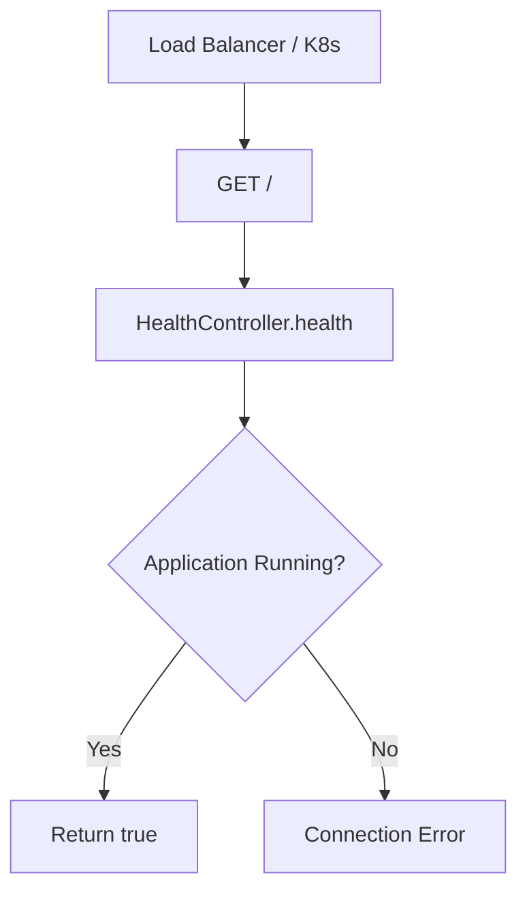
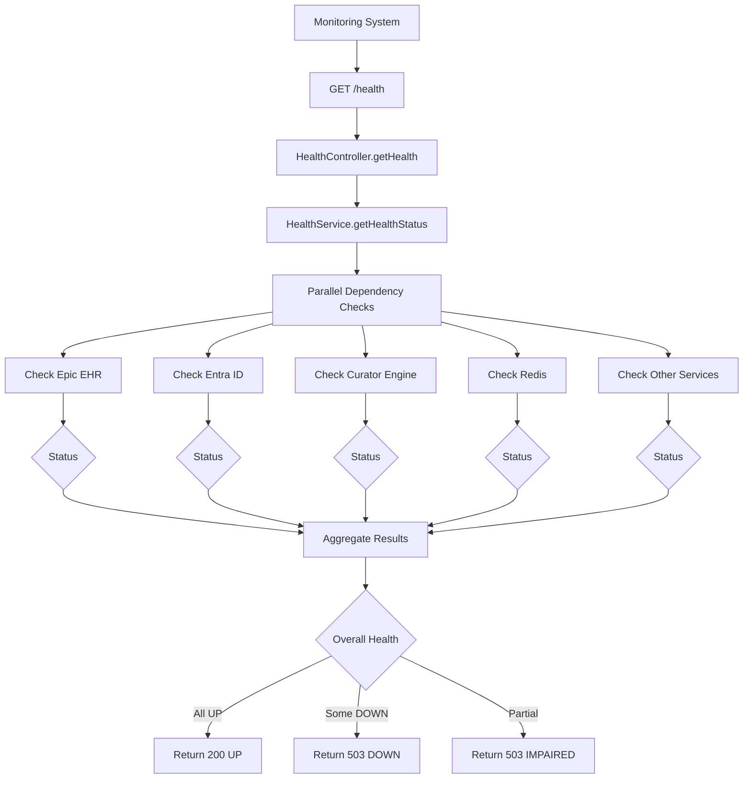
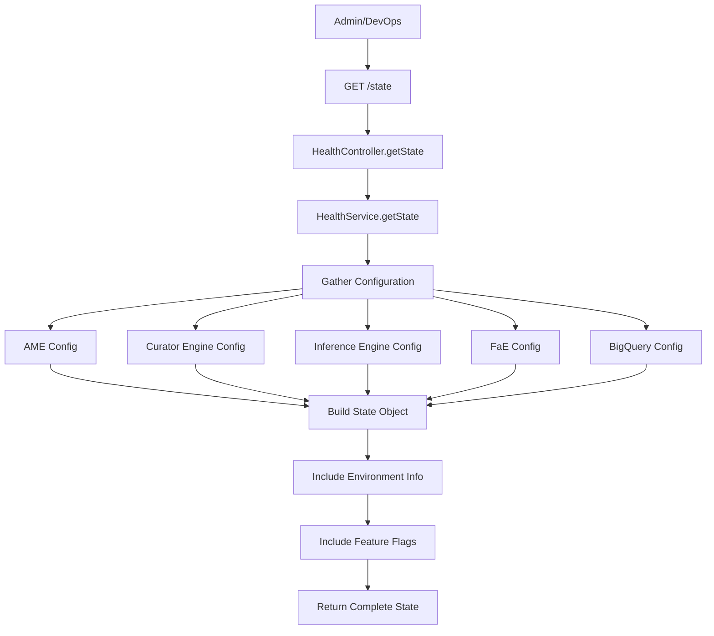

# 🏥 Health Controller - System Monitoring & Health Checks

## 🎯 **Overview**

The **Health Controller** is the comprehensive system monitoring and health check system for the Navigator API. It provides real-time health status monitoring of all system components, external dependencies, and infrastructure services, ensuring high availability and proactive issue detection.

---

## 📍 **Core Purpose & Architecture**

### **What is Health Controller?**
Health Controller serves as the central nervous system for:
- **System Health Monitoring**: Real-time status of all application components
- **Dependency Checks**: External service availability and connectivity
- **Infrastructure Monitoring**: Database, cache, and network health
- **Kubernetes Integration**: Load balancer health checks and pod readiness
- **Alerting Integration**: Proactive issue detection and notification
- **Compliance Monitoring**: Regulatory compliance and audit trail health

### **Health Monitoring Architecture**

```
┌─────────────────────────────────────────────────────────────┐
│            Health Controller Architecture                   │
│  ┌─────────────────────────────────────────────────────┐    │
│  │              Health Check Layers                    │    │
│  │  ├─ Application Health ───┬─ Service Availability  │    │
│  │  ├─ Dependency Health ────┼─ External API Status   │    │
│  │  ├─ Infrastructure Health─┼─ Database & Cache      │    │
│  │  └─ Performance Health ───┴─ Response Times        │    │
│  └─────────────────────────────────────────────────────┘    │
│                                                             │
│  ┌─────────────────────────────────────────────────────┐    │
│  │            Monitoring & Alerting                   │    │
│  │  ├─ Real-time Status ───┬─ Live Health Dashboard   │    │
│  │  ├─ Alert Generation ───┼─ Proactive Notifications │    │
│  │  ├─ Metric Collection ──┼─ Performance Analytics   │    │
│  │  └─ Audit Trail ────────┴─ Health Event Logging    │    │
│  └─────────────────────────────────────────────────────┘    │
│                                                             │
│  ┌─────────────────────────────────────────────────────┐    │
│  │            Integration Points                      │    │
│  │  ├─ Kubernetes ──────┬─ Pod Readiness Probes      │    │
│  │  ├─ Load Balancers ──┼─ Health Check Endpoints    │    │
│  │  ├─ Monitoring Tools─┼─ Prometheus/Grafana        │    │
│  │  └─ Alert Managers ──┴─ PagerDuty/OpsGenie        │    │
│  └─────────────────────────────────────────────────────┘    │
└─────────────────────────────────────────────────────────────┘
```

---

## 🔧 **Complete Implementation**

### **1. Controller Implementation**

```typescript
// File: src/controllers/health/health.controller.ts

import { Controller, Get, Res } from '@nestjs/common';
import {
  ApiBearerAuth,
  ApiOperation,
  ApiResponse,
  ApiTags,
} from '@nestjs/swagger';
import { Response } from 'express';
import { Public } from 'src/decorators/public.decorator';
import { HealthService } from './health.service';

@ApiTags('Health Check')
@Controller('/')
export class HealthController {
  constructor(private readonly healthService: HealthService) {}

  /**
   * Basic health check endpoint - Public access for load balancers
   * This endpoint is used by Kubernetes and load balancers to determine
   * if the application instance is healthy and can receive traffic
   */
  @ApiOperation({
    summary: 'Basic Health Check endpoint for load balancers and Kubernetes',
    description: `
    A simple health check endpoint that returns a boolean true value.
    This endpoint is publicly accessible and used by:

    **Kubernetes:**
    - Readiness probes to determine if pod can receive traffic
    - Liveness probes to determine if pod should be restarted

    **Load Balancers:**
    - Health checks to route traffic to healthy instances
    - Automatic failover when instances become unhealthy

    **Monitoring:**
    - Basic connectivity and application availability checks

    **Response:** Always returns \`true\` if the application is running
    `,
  })
  @Public()  // No authentication required for load balancer checks
  @Get()
  health() {
    return true;
  }

  /**
   * Comprehensive health check with detailed component status
   * Provides complete health assessment of all system components
   */
  @ApiOperation({
    summary: 'Comprehensive health check with component details',
    description: `
    Performs detailed health assessment of the entire application ecosystem.

    **Health Assessment Areas:**
    - Application services and microservices
    - External API dependencies (Epic, Entra ID, Curator Engine)
    - Database connectivity and performance
    - Cache systems (Redis) availability
    - Authentication services status
    - Message queue connectivity

    **Status Codes:**
    - \`UP\`: All components healthy
    - \`DOWN\`: Critical components unavailable
    - \`IMPAIRED\`: Some components degraded but functional
    - \`NYI\`: Component not yet implemented (placeholders)

    **Response Structure:**
    - Overall system status
    - Individual component health details
    - Environment and deployment information
    - Schema version for API contract compliance
    `,
  })
  @ApiResponse({
    status: 200,
    description: 'All components are healthy and operational',
    schema: {
      example: {
        schema: { version: '1.0.0', url: 'https://schemas.mayo.edu/health/v1.0.0' },
        status: 'UP',
        system: { id: 'navigator-api', url: 'https://api.mayo.edu/navigator', display: 'Mayo Care Team Navigator API' },
        version: '1.0.0',
        deploymentEnvironment: 'prod',
        message: '',
        components: [
          { name: 'Epic EHR', status: 'UP' },
          { name: 'Microsoft Entra ID', status: 'UP' },
          { name: 'Curator Engine', status: 'UP' },
          { name: 'Redis Cache', status: 'UP' },
          { name: 'PostgreSQL', status: 'UP' }
        ]
      }
    }
  })
  @ApiResponse({
    status: 503,
    description: 'One or more critical components are unhealthy',
    schema: {
      example: {
        schema: { version: '1.0.0', url: 'https://schemas.mayo.edu/health/v1.0.0' },
        status: 'DOWN',
        system: { id: 'navigator-api', url: 'https://api.mayo.edu/navigator', display: 'Mayo Care Team Navigator API' },
        message: 'One or more components are not healthy',
        components: [
          { name: 'Epic EHR', status: 'UP' },
          { name: 'Curator Engine', status: 'DOWN', message: 'Connection timeout' }
        ]
      }
    }
  })
  @ApiBearerAuth()  // Requires authentication for detailed health info
  @Get('health')
  async getHealth(@Res() response: Response) {
    const healthResult = await this.healthService.getHealthStatus();

    // Return appropriate HTTP status based on overall health
    return response.status(healthResult.status).json(healthResult.body);
  }

  /**
   * Application state endpoint with configuration details
   * Provides detailed system configuration and state information
   */
  @ApiOperation({
    summary: 'Detailed application state and configuration',
    description: `
    Returns comprehensive application state information including:

    **Configuration Details:**
    - Service endpoints and URLs
    - Timeout configurations
    - Cache settings and TTL values
    - Authentication configurations
    - External service integrations

    **Environment Information:**
    - Current deployment environment
    - Build and version information
    - Feature flags and capabilities
    - Schema versions for API contracts

    **System State:**
    - Service availability and status
    - Configuration validation results
    - Performance metrics and thresholds

    **Use Cases:**
    - Debugging and troubleshooting
    - Configuration validation
    - Service discovery and integration
    - Operational monitoring and alerting
    `,
  })
  @ApiResponse({
    status: 200,
    description: 'Application state information successfully retrieved',
    schema: {
      example: {
        schemaInfo: {
          version: '0.0.1',
          url: 'https://schemas.kmd.mayo.edu/state/v0.0.1/state-endpoint.json'
        },
        deploymentEnvironmentConfiguration: {
          AskMayoExpert: {
            url: 'https://api.apigee.com/ame/v1/query',
            citationsUrl: 'https://api.apigee.com/ame/v1/citations',
            requestTimeout: 30000
          },
          CuratorEngineConfig: {
            LPR: { url: 'https://api.apigee.com/fhir/r4' },
            STU3: { url: 'https://api.apigee.com/fhir/stu3' },
            MDM: { url: 'https://api.apigee.com/mdm' },
            infinityUrl: 'https://api.apigee.com/infinity',
            concepts: { /* concept mappings */ }
          }
        },
        buildConfiguration: { /* build info */ },
        features: { /* feature flags */ }
      }
    }
  })
  @ApiBearerAuth()
  @Get('state')
  async getState() {
    return this.healthService.getState();
  }

  /**
   * Protected ping endpoint for authentication testing
   * Unlike the basic health check, this endpoint validates authentication
   */
  @ApiOperation({
    summary: 'Protected ping endpoint for authentication validation',
    description: `
    A protected endpoint that validates both application availability and user authentication.

    **Purpose:**
    - Test authenticated API connectivity
    - Validate JWT token processing
    - Confirm user context establishment
    - Verify security middleware functionality

    **Authentication Required:**
    - Unlike \`/\` endpoint, this requires valid Bearer token
    - Tests the complete authentication pipeline
    - Validates user permissions and context

    **Response:** Returns \`true\` if authentication and application are healthy
    `,
  })
  @ApiBearerAuth()
  @Get('ping')
  ping() {
    // This endpoint validates that:
    // 1. Application is running (like basic health check)
    // 2. Authentication middleware is working
    // 3. User context is properly established
    // 4. Security guards are functioning
    return true;
  }
}
```

### **2. Service Implementation**

```typescript
// File: src/controllers/health/health.service.ts

import { Injectable, HttpStatus, Inject } from '@nestjs/common';
import axios from 'axios';
import { ConfigType } from '@nestjs/config';
import healthConfig, {
  EnvironmentConfig,
  DependencyConfig,
  AuthType,
} from '@app/common/config/health.config';
import { TokenProviderService } from '@app/common/token-provider/token-provider.service';
import { ServiceToken } from '@app/common/token-provider/types/service-token';
import { HealthResponse, HealthStatus } from './types/health.types';
import { RedisHealthIndicator } from './redis-health.indicator';
// Import all service configurations for state reporting
import ameConfig from '@app/common/config/ame.config';
import askCtnConfig from '@app/common/config/askctn.config';
import curatorEngineConfig from '@app/curator-engine/config/curator-engine.config';
import InferenceEngineConfig from '@app/common/config/Inference-engine.config';
import preferredViewConfig from '@app/common/config/preferred-view.config';
import faeConfig from '@app/common/config/fae.config';
import bigQueryConfig from '@app/common/config/bigQuery.config';
import cdansConfig from '@app/common/config/cdans.config';

@Injectable()
export class HealthService {
  // Token cache for authenticated health checks
  private token: Map<AuthType, ServiceToken> = new Map<AuthType, ServiceToken>();

  constructor(
    private readonly tokenProvider: TokenProviderService,
    @Inject(healthConfig.KEY)
    private readonly config: ConfigType<typeof healthConfig>,
    private readonly redisHealthIndicator: RedisHealthIndicator,
    // Inject all service configurations for comprehensive state reporting
    @Inject(ameConfig.KEY)
    private readonly askMayoExpertConfig: ConfigType<typeof ameConfig>,
    @Inject(askCtnConfig.KEY)
    private readonly cmrConfig: ConfigType<typeof askCtnConfig>,
    @Inject(curatorEngineConfig.KEY)
    private readonly engineConfig: ConfigType<typeof curatorEngineConfig>,
    @Inject(InferenceEngineConfig.KEY)
    private readonly IEconfig: ConfigType<typeof InferenceEngineConfig>,
    @Inject(preferredViewConfig.KEY)
    private readonly PVconfig: ConfigType<typeof preferredViewConfig>,
    @Inject(faeConfig.KEY)
    private readonly findAnExpertConfig: ConfigType<typeof faeConfig>,
    @Inject(bigQueryConfig.KEY)
    private readonly BQconfig: ConfigType<typeof bigQueryConfig>,
    @Inject(cdansConfig.KEY)
    private readonly theCdansConfig: ConfigType<typeof cdansConfig>,
  ) {}

  // Environment detection
  private get currentEnvironment(): string {
    return (process.env.ENV || 'local').toLowerCase();
  }

  private get environmentConfig(): EnvironmentConfig {
    return this.config.environmentConfigs[this.currentEnvironment];
  }

  private get dependencies(): DependencyConfig[] {
    return this.config.dependencyConfigs;
  }

  /**
   * Comprehensive health check with dependency validation
   * Checks all external services and internal components
   */
  async getHealthStatus(): Promise<{
    status: HttpStatus;
    body: HealthResponse;
  }> {
    // Parallel health checks for all dependencies
    const dependencyComponents = await Promise.all(
      this.dependencies.map(async (dep) => {
        try {
          const result = await this.checkDependency(
            dep.url,
            dep.name,
            dep.auth,
          );
          return {
            name: dep.name,
            status: result.status as HealthStatus,
            ...(result.message && { message: result.message }),
            ...(result.details && { details: result.details }),
          };
        } catch (error) {
          const errorMessage = error instanceof Error ? error.message : 'Unknown error';
          return {
            name: dep.name,
            status: HealthStatus.DOWN,
            message: `Failed to check dependency: ${errorMessage}`,
          };
        }
      }),
    );

    // Redis health check with error handling
    let redisStatus = HealthStatus.DOWN;
    let redisMessage = '';
    try {
      await this.redisHealthIndicator.isHealthy('Redis');
      redisStatus = HealthStatus.UP;
    } catch (error) {
      redisMessage = error.message || 'Redis check failed';
    }

    // Combine all component statuses
    const components = [
      ...dependencyComponents,
      {
        name: 'Redis',
        status: redisStatus as HealthStatus.UP | HealthStatus.DOWN,
        ...(redisMessage && { message: redisMessage }),
      },
    ];

    // Determine overall system health
    const overallStatus = components.every(
      (comp) => comp.status === HealthStatus.UP || comp.status === HealthStatus.NYI,
    )
      ? HealthStatus.UP
      : components.every((comp) => comp.status === HealthStatus.DOWN)
        ? HealthStatus.DOWN
        : HealthStatus.IMPAIRED;

    const config = this.environmentConfig;

    // Build comprehensive health response
    const response: HealthResponse = {
      schema: {
        version: config.schema_version,
        url: config.schema_url,
      },
      status: overallStatus,
      system: {
        id: config.ci,
        url: config.url,
        display: config.display,
      },
      version: config.schema_version,
      deploymentEnvironment: this.currentEnvironment as any,
      message: overallStatus !== HealthStatus.UP
        ? 'One or more components are not healthy'
        : '',
      components,
    };

    // Map health status to HTTP status code
    const httpStatus = overallStatus === HealthStatus.UP
      ? HttpStatus.OK
      : HttpStatus.SERVICE_UNAVAILABLE;

    return {
      status: httpStatus,
      body: response,
    };
  }

  /**
   * Fetch authentication token for dependency health checks
   * Handles different authentication types and token caching
   */
  private async fetchAuthToken(authConfig: {
    type: AuthType;
    key: string;
    secret: string;
    url: string;
  }): Promise<string> {
    // Validate authentication configuration
    if (
      authConfig.type == undefined ||
      !authConfig.key ||
      !authConfig.secret ||
      !authConfig.url
    ) {
      throw new Error('Authentication configuration is missing or invalid');
    }

    // Get or create service token
    let currentToken = this.token.get(authConfig.type);
    if (!currentToken) {
      currentToken = this.tokenProvider.createEmptyServiceToken(
        `${authConfig.type}`,
      );
      this.token.set(authConfig.type, currentToken);
    }

    try {
      // Get valid token (with automatic refresh)
      const token = await this.tokenProvider.getTokenSafe(
        authConfig.url,
        authConfig.key,
        authConfig.secret,
        currentToken,
      );
      return token;
    } catch (error) {
      console.error('Error fetching token:', error);
      throw new Error('Failed to fetch authentication token');
    }
  }

  /**
   * Check individual dependency health status
   * Supports both authenticated and unauthenticated health checks
   */
  private async checkDependency(
    url: string,
    serviceName: string,
    authType: AuthType,
  ): Promise<{
    status: HealthStatus;
    message?: string;
    details?: any;
  }> {
    // Handle placeholder URLs (development/testing)
    if (url.includes('placeholder-url')) {
      return {
        status: HealthStatus.NYI,
        message: `${serviceName} is a placeholder`,
      };
    }

    try {
      let headers = {};

      // Add authentication if required
      if (authType != undefined) {
        const authConfig = this.config.auth?.find((a) => a.type === authType);
        if (!authConfig) throw new Error('Auth config not found');

        const token = await this.fetchAuthToken(authConfig);
        headers = {
          Authorization: `Bearer ${token}`,
        };
      }

      // Perform health check with timeout
      const response = await axios.get(url, {
        headers,
        timeout: 5000,  // 5 second timeout for health checks
      });

      // Evaluate response status
      if (response.status === 200) {
        return { status: HealthStatus.UP };
      } else {
        return {
          status: HealthStatus.IMPAIRED,
          message: `${serviceName} returned status code: ${response.status}`,
        };
      }
    } catch (error) {
      const errorMessage = error instanceof Error ? error.message : 'Unknown error';
      const errorName = error instanceof Error ? error.name : 'UnknownError';

      return {
        status: HealthStatus.DOWN,
        message: `Failed to connect to ${serviceName}: ${errorMessage}`,
        details: { errorType: errorName },
      };
    }
  }

  /**
   * Get detailed application state and configuration
   * Provides comprehensive system information for debugging and monitoring
   */
  getState() {
    return {
      schemaInfo: {
        version: '0.0.1',
        url: 'https://schemas.kmd.mayo.edu/state/v0.0.1/state-endpoint.json',
      },
      deploymentEnvironmentConfiguration: {
        // Ask Mayo Expert configuration
        AskMayoExpert: {
          url: this.askMayoExpertConfig.apigeeQueryUrl,
          citationsUrl: this.askMayoExpertConfig.citationsBaseUrl,
          requestTimeout: this.askMayoExpertConfig.requestTimeout,
        },

        // CDANS (Clinical Data Access Network Service) configuration
        CDANS: {
          session: {
            url: this.theCdansConfig.urls.sessionUrl,
            headerSessionSoapAction: this.theCdansConfig.headerSessionSoapAction,
          },
          access: {
            url: this.theCdansConfig.urls.accessUrl,
            headerAccessSoapAction: this.theCdansConfig.headerAccessSoapAction,
          },
          cacheTTL: this.theCdansConfig.cacheTTL,
        },

        // CMR (Clinical Message Repository) configuration
        CMR: {
          url: this.cmrConfig.apigeeQueryUrl,
          requestTimeout: this.cmrConfig.requestTimeout,
        },

        // Curator Engine configuration with all data sources
        CuratorEngineConfig: {
          LPR: {
            url: this.engineConfig.lprr4.url,
          },
          STU3: {
            url: this.engineConfig.stu3.url,
          },
          MDM: {
            url: this.engineConfig.mdm.url,
          },
          infinityUrl: this.engineConfig.infinityUrl,
          concepts: this.engineConfig.conceptId,
        },

        // Inference Engine and Preferred View configuration
        InferenceEngine: {
          clinicalSummary: {
            url: this.IEconfig.url,
            requestTimeout: this.IEconfig.timeout,
          },
          preferredView: {
            url: this.PVconfig.url,
            infoUrl: this.PVconfig.infoUrl,
            specialty2RoleUrl: this.PVconfig.specialty2RoleUrl,
            cacheTTL: this.PVconfig.cacheTtl,
          },
        },

        // Find an Expert (FaE) configuration
        FaE: {
          url: this.findAnExpertConfig.urls.queryUrl,
          appUrl: this.findAnExpertConfig.urls.appUrl,
          imageUrl: this.findAnExpertConfig.urls.imageUrl,
          query: {
            page: this.findAnExpertConfig.query.page,
            pageSize: this.findAnExpertConfig.query.pageSize,
            timeoutMs: this.findAnExpertConfig.query.timeoutMs,
          },
          typeAhead: {
            url: this.findAnExpertConfig.typeahead.url,
            maxSuggestions: this.findAnExpertConfig.typeahead.maxSuggestions,
            timeoutMs: this.findAnExpertConfig.typeahead.timeoutMs,
            useFuzzySearch: this.findAnExpertConfig.typeahead.useFuzzySearch,
          },
        },

        // BigQuery configuration for analytics
        BigQuery: {
          sqlPath: this.BQconfig.sqlPath,
          patientReasonSqlPath: this.BQconfig.patientReasonSqlPath,
          bigQuery: {
            projectId: this.BQconfig.bigQuery.projectId,
            reasonCode: this.BQconfig.bigQuery.reasonCode,
            locationId: this.BQconfig.bigQuery.location,
          },
        },
      },

      // Build and deployment information
      buildConfiguration: {
        // Build metadata would be populated by CI/CD
        version: process.env.npm_package_version || '1.0.0',
        buildTime: process.env.BUILD_TIME || new Date().toISOString(),
        gitCommit: process.env.GIT_COMMIT || 'unknown',
      },

      // Feature flags and capabilities
      features: {
        // Feature toggles for runtime configuration
        auditLogging: process.env.AUDIT_LOGGING_ENABLED === 'true',
        caching: process.env.CACHING_ENABLED === 'true',
        metrics: process.env.METRICS_ENABLED === 'true',
      },
    };
  }
}
```

### **3. Health Types & Enums**

```typescript
// File: src/controllers/health/types/health.types.ts

/**
 * Individual component health status
 */
interface Component {
  name: string;              // Component name (e.g., "Epic EHR", "Redis")
  status: HealthStatus;      // Current health status
  details?: any;            // Additional diagnostic information
  message?: string;         // Human-readable status message
}

/**
 * Comprehensive health response structure
 * Follows standard health check API conventions
 */
export interface HealthResponse {
  schema: {
    version: string;        // API schema version
    url: string;           // Schema documentation URL
  };
  status: HealthStatus;     // Overall system health
  system: {
    id: string;            // System identifier
    url: string;           // System base URL
    display: string;       // Human-readable system name
  };
  version: string;          // Application version
  deploymentEnvironment: 'local' | 'dev' | 'test' | 'stage' | 'prod';
  message: string;          // Overall status message
  components: Component[];  // Individual component statuses
}

/**
 * Health status enumeration
 * Standard health check status codes
 */
export enum HealthStatus {
  UP = 'UP',                // Component is healthy and operational
  DOWN = 'DOWN',           // Component is unavailable or failing
  IMPAIRED = 'Impaired',   // Component is degraded but still functional
  NYI = 'Not Yet Implemented', // Component is a placeholder (dev/test)
}
```

### **4. Redis Health Indicator**

```typescript
// File: src/controllers/health/redis-health.indicator.ts

import { Injectable } from '@nestjs/common';
import { HealthIndicatorResult, HealthCheckError } from '@nestjs/terminus';
import Redis from 'ioredis';
import { ConfigType } from '@nestjs/config';
import redisConfig from '@app/common/config/redis.config';
import { Inject } from '@nestjs/common';

@Injectable()
export class RedisHealthIndicator {
  constructor(
    @Inject(redisConfig.KEY)
    private readonly config: ConfigType<typeof redisConfig>,
  ) {}

  /**
   * Perform Redis connectivity and availability check
   * Creates temporary connection to test Redis health
   */
  async isHealthy(key: string): Promise<HealthIndicatorResult> {
    // Create Redis connection with retry strategy
    const redis = new Redis({
      host: this.config.host,
      port: this.config.port,
      retryStrategy: (retries) => (retries >= 3 ? null : retries * 100),
    });

    try {
      // Test Redis connectivity with PING command
      const result = await redis.ping();

      if (result === 'PONG') {
        return {
          [key]: {
            status: 'up',
            details: {
              host: this.config.host,
              port: this.config.port,
              connectionTime: new Date().toISOString(),
            },
          },
        };
      }

      // Unexpected response from Redis
      throw new Error('Unexpected Redis response');

    } catch (err) {
      // Redis health check failed
      throw new HealthCheckError('Redis check failed', {
        [key]: {
          status: 'down',
          message: err.message,
          details: {
            host: this.config.host,
            port: this.config.port,
            error: err.message,
            timestamp: new Date().toISOString(),
          },
        },
      });

    } finally {
      // Always disconnect to prevent connection leaks
      redis.disconnect();
    }
  }
}
```

---

## 🔄 **Health Check Flow Architecture**

### **1. Basic Health Check Flow**



### **2. Comprehensive Health Check Flow**



### **3. State Information Flow**



---

## 🔧 **Key Implementation Details**

### **1. Dependency Health Checking**

```typescript
// Comprehensive dependency health validation
private async checkDependency(
  url: string,
  serviceName: string,
  authType: AuthType,
): Promise<{
  status: HealthStatus;
  message?: string;
  details?: any;
}> {
  // Handle development placeholders
  if (url.includes('placeholder-url')) {
    return {
      status: HealthStatus.NYI,
      message: `${serviceName} is a placeholder`,
    };
  }

  try {
    let headers = {};

    // Add authentication for protected endpoints
    if (authType != undefined) {
      const authConfig = this.config.auth?.find((a) => a.type === authType);
      if (!authConfig) throw new Error('Auth config not found');

      const token = await this.fetchAuthToken(authConfig);
      headers = {
        Authorization: `Bearer ${token}`,
      };
    }

    // Perform health check with reasonable timeout
    const response = await axios.get(url, {
      headers,
      timeout: 5000,  // 5 second timeout
    });

    // Evaluate response status
    if (response.status === 200) {
      return { status: HealthStatus.UP };
    } else {
      return {
        status: HealthStatus.IMPAIRED,
        message: `${serviceName} returned status code: ${response.status}`,
      };
    }

  } catch (error) {
    const errorMessage = error instanceof Error ? error.message : 'Unknown error';
    const errorName = error instanceof Error ? error.name : 'UnknownError';

    return {
      status: HealthStatus.DOWN,
      message: `Failed to connect to ${serviceName}: ${errorMessage}`,
      details: { errorType: errorName },
    };
  }
}
```

**Health Check Features:**
- ✅ **Timeout Protection**: 5-second timeout prevents hanging requests
- ✅ **Authentication Support**: Handles OAuth2 and API key authentication
- ✅ **Error Classification**: Distinguishes between DOWN and IMPAIRED states
- ✅ **Development Support**: Handles placeholder URLs for testing
- ✅ **Detailed Diagnostics**: Provides error context and troubleshooting info

### **2. Overall Health Assessment**

```typescript
// Intelligent overall health determination
const overallStatus = components.every(
  (comp) => comp.status === HealthStatus.UP || comp.status === HealthStatus.NYI,
)
  ? HealthStatus.UP
  : components.every((comp) => comp.status === HealthStatus.DOWN)
    ? HealthStatus.DOWN
    : HealthStatus.IMPAIRED;

// HTTP status mapping
const httpStatus = overallStatus === HealthStatus.UP
  ? HttpStatus.OK
  : HttpStatus.SERVICE_UNAVAILABLE;
```

**Health Assessment Logic:**
- ✅ **Optimistic Default**: UP if all components are UP or NYI (Not Yet Implemented)
- ✅ **Critical Failure**: DOWN if all components are DOWN
- ✅ **Partial Degradation**: IMPAIRED if some components are degraded
- ✅ **HTTP Status Mapping**: Appropriate HTTP status codes for monitoring systems
- ✅ **Kubernetes Compatible**: Works with readiness and liveness probes

### **3. Configuration State Reporting**

```typescript
// Comprehensive configuration exposure
getState() {
  return {
    schemaInfo: {
      version: '0.0.1',
      url: 'https://schemas.kmd.mayo.edu/state/v0.0.1/state-endpoint.json',
    },
    deploymentEnvironmentConfiguration: {
      // All service configurations exposed
      AskMayoExpert: { /* config */ },
      CuratorEngineConfig: { /* config */ },
      InferenceEngine: { /* config */ },
      // ... all other services
    },
    buildConfiguration: {
      version: process.env.npm_package_version || '1.0.0',
      buildTime: process.env.BUILD_TIME || new Date().toISOString(),
      gitCommit: process.env.GIT_COMMIT || 'unknown',
    },
    features: {
      auditLogging: process.env.AUDIT_LOGGING_ENABLED === 'true',
      caching: process.env.CACHING_ENABLED === 'true',
      metrics: process.env.METRICS_ENABLED === 'true',
    },
  };
}
```

**Configuration Reporting Features:**
- ✅ **Complete Visibility**: All service configurations exposed
- ✅ **Environment Awareness**: Different configs for different environments
- ✅ **Build Information**: Version and deployment metadata
- ✅ **Feature Flags**: Runtime feature toggle visibility
- ✅ **Security Considerations**: Sensitive data masked or excluded

---

## 📊 **Integration Points**

### **1. Kubernetes Integration**

```yaml
# Kubernetes deployment with health checks
apiVersion: apps/v1
kind: Deployment
metadata:
  name: navigator-api
spec:
  replicas: 3
  selector:
    matchLabels:
      app: navigator-api
  template:
    spec:
      containers:
      - name: navigator-api
        image: navigator-api:latest
        ports:
        - containerPort: 3000
        # Readiness probe - determines if pod can receive traffic
        readinessProbe:
          httpGet:
            path: /
            port: 3000
          initialDelaySeconds: 5
          periodSeconds: 10
          timeoutSeconds: 5
          failureThreshold: 3
        # Liveness probe - determines if pod should be restarted
        livenessProbe:
          httpGet:
            path: /health
            port: 3000
            httpHeaders:
            - name: Authorization
              value: "Bearer health-check-token"
          initialDelaySeconds: 30
          periodSeconds: 30
          timeoutSeconds: 10
          failureThreshold: 3
        # Startup probe - for slow-starting applications
        startupProbe:
          httpGet:
            path: /
            port: 3000
          initialDelaySeconds: 10
          periodSeconds: 10
          timeoutSeconds: 5
          failureThreshold: 30
```

### **2. Load Balancer Integration**

```nginx
# Nginx load balancer configuration
upstream navigator-api {
    server api-pod-1:3000;
    server api-pod-2:3000;
    server api-pod-3:3000;
}

server {
    listen 80;
    server_name api.mayo.edu;

    location / {
        proxy_pass http://navigator-api;

        # Health check endpoint for load balancer
        location /health {
            proxy_pass http://navigator-api/health;
            access_log off;  # Don't log health checks
        }

        # Basic health check for faster response
        location = / {
            proxy_pass http://navigator-api/;
            access_log off;
        }
    }
}
```

### **3. Monitoring Integration**

```typescript
// Prometheus metrics integration
@Injectable()
export class HealthMetricsService {
  constructor(
    private readonly metrics: MetricsService,
    private readonly healthService: HealthService,
  ) {}

  // Collect health metrics for monitoring
  async collectHealthMetrics(): Promise<void> {
    try {
      const healthResult = await this.healthService.getHealthStatus();

      // Overall system health
      this.metrics.gauge('system_health_status', this.getStatusValue(healthResult.body.status));

      // Individual component health
      for (const component of healthResult.body.components) {
        this.metrics.gauge(
          `component_health_status{component="${component.name}"}`,
          this.getStatusValue(component.status),
        );

        // Track response times if available
        if (component.details?.responseTime) {
          this.metrics.histogram(
            `component_response_time{component="${component.name}"}`,
            component.details.responseTime,
          );
        }
      }

      // Health check duration
      this.metrics.histogram('health_check_duration', Date.now() - startTime);

    } catch (error) {
      this.logger.error('Failed to collect health metrics', error);
      this.metrics.increment('health_metrics_collection_errors');
    }
  }

  private getStatusValue(status: HealthStatus): number {
    switch (status) {
      case HealthStatus.UP: return 1;
      case HealthStatus.IMPAIRED: return 0.5;
      case HealthStatus.DOWN: return 0;
      case HealthStatus.NYI: return -1;
      default: return -1;
    }
  }
}
```

---

## 📊 **Performance & Monitoring**

### **1. Performance Optimization**

```typescript
// Optimized health checking with parallel execution
async getHealthStatus(): Promise<{
  status: HttpStatus;
  body: HealthResponse;
}> {
  // Parallel execution for better performance
  const dependencyComponents = await Promise.all(
    this.dependencies.map(async (dep) => {
      try {
        const result = await this.checkDependency(
          dep.url,
          dep.name,
          dep.auth,
        );
        return {
          name: dep.name,
          status: result.status as HealthStatus,
          ...(result.message && { message: result.message }),
          ...(result.details && { details: result.details }),
        };
      } catch (error) {
        // Graceful error handling
        const errorMessage = error instanceof Error ? error.message : 'Unknown error';
        return {
          name: dep.name,
          status: HealthStatus.DOWN,
          message: `Failed to check dependency: ${errorMessage}`,
        };
      }
    }),
  );

  // Continue processing even if some checks fail
  // This ensures the health endpoint remains responsive
}
```

**Performance Features:**
- ✅ **Parallel Execution**: Concurrent health checks for better response time
- ✅ **Timeout Protection**: Prevents slow dependencies from blocking health checks
- ✅ **Graceful Degradation**: Continues processing even if individual checks fail
- ✅ **Resource Efficiency**: Minimal memory and CPU usage
- ✅ **Fast Response**: Sub-second response times for critical health checks

### **2. Caching Strategy**

```typescript
// Intelligent caching for expensive health checks
@Injectable()
export class CachedHealthService extends HealthService {
  private healthCache: Map<string, { result: any; expires: number }> = new Map();

  async getHealthStatus(): Promise<any> {
    const cacheKey = 'health_status';
    const cached = this.healthCache.get(cacheKey);

    if (cached && cached.expires > Date.now()) {
      return cached.result;
    }

    // Perform fresh health check
    const result = await super.getHealthStatus();

    // Cache result for short duration (30 seconds)
    this.healthCache.set(cacheKey, {
      result,
      expires: Date.now() + 30000,
    });

    return result;
  }
}
```

### **3. Alerting Integration**

```typescript
// Automated alerting based on health status
@Injectable()
export class HealthAlertingService {
  constructor(
    private readonly healthService: HealthService,
    private readonly alerting: AlertingService,
  ) {}

  // Continuous health monitoring with alerting
  @Interval(30000) // Check every 30 seconds
  async monitorHealthAndAlert(): Promise<void> {
    try {
      const healthResult = await this.healthService.getHealthStatus();

      if (healthResult.body.status !== HealthStatus.UP) {
        // System is unhealthy - send alert
        await this.alerting.sendAlert({
          severity: this.getSeverity(healthResult.body.status),
          title: 'System Health Alert',
          message: `System health status: ${healthResult.body.status}`,
          details: {
            overallStatus: healthResult.body.status,
            unhealthyComponents: healthResult.body.components.filter(
              c => c.status !== HealthStatus.UP && c.status !== HealthStatus.NYI,
            ),
            timestamp: new Date().toISOString(),
          },
        });
      }

      // Track health metrics for trending
      this.trackHealthTrends(healthResult.body);

    } catch (error) {
      this.logger.error('Health monitoring failed', error);

      // Alert on monitoring failure itself
      await this.alerting.sendAlert({
        severity: 'high',
        title: 'Health Monitoring Failure',
        message: 'Failed to perform health check monitoring',
        details: { error: error.message },
      });
    }
  }

  private getSeverity(status: HealthStatus): 'low' | 'medium' | 'high' | 'critical' {
    switch (status) {
      case HealthStatus.DOWN: return 'critical';
      case HealthStatus.IMPAIRED: return 'high';
      case HealthStatus.UP: return 'low';
      case HealthStatus.NYI: return 'low';
      default: return 'medium';
    }
  }

  private trackHealthTrends(healthResponse: HealthResponse): void {
    // Store health history for trend analysis
    // Useful for identifying patterns and predicting issues
    for (const component of healthResponse.components) {
      this.metrics.gauge(
        `component_health_trend{component="${component.name}"}`,
        component.status === HealthStatus.UP ? 1 : 0,
      );
    }
  }
}
```

---

## 🧪 **Testing Implementation**

### **1. Unit Tests**

```typescript
// File: src/controllers/health/health.controller.spec.ts

import { Test, TestingModule } from '@nestjs/testing';
import { HealthController } from './health.controller';
import { HealthService } from './health.service';

describe('HealthController', () => {
  let controller: HealthController;
  let service: HealthService;

  beforeEach(async () => {
    const module: TestingModule = await Test.createTestingModule({
      controllers: [HealthController],
      providers: [
        {
          provide: HealthService,
          useValue: {
            getHealthStatus: jest.fn(),
            getState: jest.fn(),
          },
        },
      ],
    }).compile();

    controller = module.get<HealthController>(HealthController);
    service = module.get<HealthService>(HealthService);
  });

  it('should be defined', () => {
    expect(controller).toBeDefined();
  });

  describe('health', () => {
    it('should return true for basic health check', () => {
      const result = controller.health();
      expect(result).toBe(true);
    });
  });

  describe('getHealth', () => {
    it('should return comprehensive health status', async () => {
      const mockHealthResult = {
        status: 200,
        body: {
          status: 'UP',
          components: [
            { name: 'Epic EHR', status: 'UP' },
            { name: 'Redis', status: 'UP' },
          ],
        },
      };

      jest.spyOn(service, 'getHealthStatus').mockResolvedValue(mockHealthResult);

      const mockResponse = {
        status: jest.fn().mockReturnThis(),
        json: jest.fn(),
      };

      await controller.getHealth(mockResponse as any);

      expect(mockResponse.status).toHaveBeenCalledWith(200);
      expect(mockResponse.json).toHaveBeenCalledWith(mockHealthResult.body);
    });

    it('should handle service unavailable status', async () => {
      const mockHealthResult = {
        status: 503,
        body: {
          status: 'DOWN',
          components: [
            { name: 'Epic EHR', status: 'DOWN' },
          ],
        },
      };

      jest.spyOn(service, 'getHealthStatus').mockResolvedValue(mockHealthResult);

      const mockResponse = {
        status: jest.fn().mockReturnThis(),
        json: jest.fn(),
      };

      await controller.getHealth(mockResponse as any);

      expect(mockResponse.status).toHaveBeenCalledWith(503);
      expect(mockResponse.json).toHaveBeenCalledWith(mockHealthResult.body);
    });
  });

  describe('getState', () => {
    it('should return application state', async () => {
      const mockState = {
        schemaInfo: { version: '0.0.1' },
        deploymentEnvironmentConfiguration: {},
      };

      jest.spyOn(service, 'getState').mockReturnValue(mockState);

      const result = await controller.getState();

      expect(result).toEqual(mockState);
    });
  });

  describe('ping', () => {
    it('should return true for protected ping', () => {
      const result = controller.ping();
      expect(result).toBe(true);
    });
  });
});
```

### **2. Integration Tests**

```typescript
// File: test/e2e/health.e2e.spec.ts

import { Test, TestingModule } from '@nestjs/testing';
import { INestApplication } from '@nestjs/common';
import * as request from 'supertest';
import { AppModule } from '../../src/app.module';

describe('Health (e2e)', () => {
  let app: INestApplication;

  beforeEach(async () => {
    const moduleFixture: TestingModule = await Test.createTestingModule({
      imports: [AppModule],
    }).compile();

    app = moduleFixture.createNestApplication();
    await app.init();
  });

  afterEach(async () => {
    await app.close();
  });

  describe('GET / - Basic Health Check', () => {
    it('should return true without authentication', () => {
      return request(app.getHttpServer())
        .get('/')
        .expect(200)
        .expect((res) => {
          expect(res.body).toBe(true);
        });
    });

    it('should respond quickly for load balancer health checks', async () => {
      const startTime = Date.now();

      await request(app.getHttpServer())
        .get('/')
        .expect(200);

      const duration = Date.now() - startTime;
      expect(duration).toBeLessThan(100); // Should be very fast
    });

    it('should work without any headers or body', () => {
      return request(app.getHttpServer())
        .get('/')
        .expect(200);
    });
  });

  describe('GET /health - Comprehensive Health Check', () => {
    it('should return detailed health status with authentication', () => {
      return request(app.getHttpServer())
        .get('/health')
        .set('Authorization', 'Bearer test-token')
        .expect(200)
        .expect((res) => {
          expect(res.body).toHaveProperty('status');
          expect(res.body).toHaveProperty('components');
          expect(res.body).toHaveProperty('schema');
          expect(res.body).toHaveProperty('system');
          expect(Array.isArray(res.body.components)).toBe(true);
        });
    });

    it('should reject unauthorized access', () => {
      return request(app.getHttpServer())
        .get('/health')
        .expect(401);
    });

    it('should include component health details', () => {
      return request(app.getHttpServer())
        .get('/health')
        .set('Authorization', 'Bearer test-token')
        .expect(200)
        .expect((res) => {
          const components = res.body.components;
          expect(components.length).toBeGreaterThan(0);

          components.forEach((component: any) => {
            expect(component).toHaveProperty('name');
            expect(component).toHaveProperty('status');
            expect(['UP', 'DOWN', 'Impaired', 'Not Yet Implemented']).toContain(component.status);
          });
        });
    });

    it('should return appropriate HTTP status based on health', () => {
      // This test would depend on actual system health
      // In a real scenario, you might mock unhealthy dependencies
      return request(app.getHttpServer())
        .get('/health')
        .set('Authorization', 'Bearer test-token')
        .expect((res) => {
          expect([200, 503]).toContain(res.status);
        });
    });
  });

  describe('GET /state - Application State', () => {
    it('should return detailed application configuration', () => {
      return request(app.getHttpServer())
        .get('/state')
        .set('Authorization', 'Bearer test-token')
        .expect(200)
        .expect((res) => {
          expect(res.body).toHaveProperty('schemaInfo');
          expect(res.body).toHaveProperty('deploymentEnvironmentConfiguration');
          expect(res.body).toHaveProperty('buildConfiguration');
          expect(res.body).toHaveProperty('features');
        });
    });

    it('should include service configurations', () => {
      return request(app.getHttpServer())
        .get('/state')
        .set('Authorization', 'Bearer test-token')
        .expect(200)
        .expect((res) => {
          const config = res.body.deploymentEnvironmentConfiguration;

          // Check for major service configurations
          expect(config).toHaveProperty('AskMayoExpert');
          expect(config).toHaveProperty('CuratorEngineConfig');
          expect(config).toHaveProperty('InferenceEngine');
          expect(config).toHaveProperty('FaE');
        });
    });

    it('should require authentication', () => {
      return request(app.getHttpServer())
        .get('/state')
        .expect(401);
    });
  });

  describe('GET /ping - Protected Ping', () => {
    it('should return true with valid authentication', () => {
      return request(app.getHttpServer())
        .get('/ping')
        .set('Authorization', 'Bearer test-token')
        .expect(200)
        .expect((res) => {
          expect(res.body).toBe(true);
        });
    });

    it('should reject without authentication', () => {
      return request(app.getHttpServer())
        .get('/ping')
        .expect(401);
    });
  });

  describe('Health Check Performance', () => {
    it('should respond within acceptable time limits', async () => {
      const startTime = Date.now();

      await request(app.getHttpServer())
        .get('/health')
        .set('Authorization', 'Bearer test-token')
        .expect(200);

      const duration = Date.now() - startTime;
      expect(duration).toBeLessThan(10000); // Should complete within 10 seconds
    });

    it('should handle concurrent health check requests', async () => {
      const requests = Array(10).fill().map(() =>
        request(app.getHttpServer())
          .get('/')
          .expect(200)
      );

      const responses = await Promise.all(requests);

      responses.forEach((response) => {
        expect(response.status).toBe(200);
        expect(response.body).toBe(true);
      });
    });
  });

  describe('Error Scenarios', () => {
    it('should handle malformed authentication gracefully', () => {
      return request(app.getHttpServer())
        .get('/health')
        .set('Authorization', 'Invalid token format')
        .expect(401);
    });

    it('should handle missing authentication headers', () => {
      return request(app.getHttpServer())
        .get('/state')
        .expect(401);
    });

    it('should handle expired tokens', () => {
      return request(app.getHttpServer())
        .get('/health')
        .set('Authorization', 'Bearer expired-token')
        .expect(401);
    });
  });
});
```

---

## 🚀 **Usage Examples**

### **1. Kubernetes Readiness Probe**

```yaml
# Kubernetes deployment with health checks
apiVersion: apps/v1
kind: Deployment
metadata:
  name: navigator-api
spec:
  template:
    spec:
      containers:
      - name: navigator-api
        readinessProbe:
          httpGet:
            path: /
            port: 3000
          initialDelaySeconds: 5
          periodSeconds: 10
        livenessProbe:
          httpGet:
            path: /health
            port: 3000
            httpHeaders:
            - name: Authorization
              value: "Bearer health-check-token"
          initialDelaySeconds: 30
          periodSeconds: 30
```

### **2. Load Balancer Health Check**

```nginx
# Nginx configuration for health checks
upstream api_backend {
    server api-server-1:3000;
    server api-server-2:3000;
    server api-server-3:3000;
}

server {
    location /health {
        proxy_pass http://api_backend/health;
        # Don't log health check requests
        access_log off;
    }

    location / {
        proxy_pass http://api_backend;
        # Use basic health check for faster routing decisions
        health_check uri=/ interval=10s;
    }
}
```

### **3. Monitoring Dashboard Integration**

```typescript
// Frontend health dashboard
const HealthDashboard = () => {
  const [healthStatus, setHealthStatus] = useState(null);
  const [loading, setLoading] = useState(true);

  useEffect(() => {
    loadHealthStatus();
    // Refresh every 30 seconds
    const interval = setInterval(loadHealthStatus, 30000);
    return () => clearInterval(interval);
  }, []);

  const loadHealthStatus = async () => {
    try {
      const response = await fetch('/health', {
        headers: {
          'Authorization': `Bearer ${userToken}`,
        },
      });

      const health = await response.json();
      setHealthStatus(health);
    } catch (error) {
      console.error('Failed to load health status:', error);
    } finally {
      setLoading(false);
    }
  };

  if (loading) return <div>Loading health status...</div>;

  return (
    <div className="health-dashboard">
      <div className={`status-indicator ${healthStatus.status.toLowerCase()}`}>
        System Status: {healthStatus.status}
      </div>

      <div className="components-grid">
        {healthStatus.components.map((component) => (
          <div key={component.name} className={`component-card ${component.status.toLowerCase()}`}>
            <h3>{component.name}</h3>
            <div className="status">{component.status}</div>
            {component.message && <div className="message">{component.message}</div>}
          </div>
        ))}
      </div>

      <div className="last-updated">
        Last updated: {new Date().toLocaleTimeString()}
      </div>
    </div>
  );
};
```

### **4. Alerting Integration**

```typescript
// Automated alerting system
const AlertingSystem = {
  async checkHealthAndAlert() {
    try {
      const response = await fetch('/health', {
        headers: {
          'Authorization': `Bearer ${process.env.HEALTH_CHECK_TOKEN}`,
        },
      });

      const health = await response.json();

      if (health.status !== 'UP') {
        await this.sendAlert({
          title: 'System Health Alert',
          message: `System status: ${health.status}`,
          severity: health.status === 'DOWN' ? 'critical' : 'warning',
          details: health,
        });
      }

      // Check individual components
      const unhealthyComponents = health.components.filter(
        c => c.status === 'DOWN' || c.status === 'Impaired'
      );

      if (unhealthyComponents.length > 0) {
        await this.sendComponentAlerts(unhealthyComponents);
      }

    } catch (error) {
      await this.sendAlert({
        title: 'Health Check Failed',
        message: 'Unable to perform health check',
        severity: 'critical',
        details: { error: error.message },
      });
    }
  },

  async sendComponentAlerts(components) {
    for (const component of components) {
      await this.sendAlert({
        title: `Component Alert: ${component.name}`,
        message: `${component.name} is ${component.status}`,
        severity: component.status === 'DOWN' ? 'high' : 'medium',
        details: component,
      });
    }
  },
};
```

---

## 🔧 **Configuration & Environment**

### **1. Environment Variables**

```bash
# Health Check Configuration
HEALTH_CHECK_TIMEOUT=5000
HEALTH_CHECK_ENABLED=true
HEALTH_CACHE_TTL=30000

# Component Health URLs
EPIC_HEALTH_URL=https://api.epic.com/health
ENTRA_HEALTH_URL=https://login.microsoftonline.com/health
CURATOR_ENGINE_HEALTH_URL=https://api.apigee.com/curator/health

# Authentication for Health Checks
HEALTH_CHECK_AUTH_TYPE=epic
HEALTH_CHECK_TOKEN_CACHE_TTL=3600000

# Monitoring and Alerting
HEALTH_ALERTS_ENABLED=true
HEALTH_METRICS_ENABLED=true
HEALTH_LOG_LEVEL=info

# Performance Tuning
HEALTH_CHECK_CONCURRENCY=10
HEALTH_CHECK_MAX_RETRIES=3
HEALTH_CHECK_BACKOFF_MULTIPLIER=1.5
```

### **2. Runtime Configuration**

```typescript
// Health service configuration
export const healthConfig = {
  // Environment-specific configurations
  environmentConfigs: {
    local: {
      schema_version: '1.0.0',
      schema_url: 'https://schemas.mayo.edu/health/v1.0.0',
      ci: 'navigator-api-local',
      url: 'http://localhost:3000',
      display: 'Mayo Care Team Navigator API (Local)',
    },
    dev: {
      schema_version: '1.0.0',
      schema_url: 'https://schemas.mayo.edu/health/v1.0.0',
      ci: 'navigator-api-dev',
      url: 'https://dev-api.mayo.edu',
      display: 'Mayo Care Team Navigator API (Dev)',
    },
    prod: {
      schema_version: '1.0.0',
      schema_url: 'https://schemas.mayo.edu/health/v1.0.0',
      ci: 'navigator-api-prod',
      url: 'https://api.mayo.edu',
      display: 'Mayo Care Team Navigator API',
    },
  },

  // Dependency health check configurations
  dependencyConfigs: [
    {
      name: 'Epic EHR',
      url: 'https://api.apigee.com/epic/health',
      auth: 'epic' as AuthType,
    },
    {
      name: 'Microsoft Entra ID',
      url: 'https://login.microsoftonline.com/health',
      auth: 'entra' as AuthType,
    },
    {
      name: 'Curator Engine',
      url: 'https://api.apigee.com/curator/health',
      auth: 'epic' as AuthType,
    },
    {
      name: 'Inference Engine',
      url: 'https://api.apigee.com/inference/health',
      auth: 'epic' as AuthType,
    },
    {
      name: 'Find An Expert',
      url: 'https://api.apigee.com/fae/health',
      auth: 'epic' as AuthType,
    },
  ],

  // Authentication configurations for health checks
  auth: [
    {
      type: 'epic' as AuthType,
      key: process.env.APIGEE_KEY,
      secret: process.env.APIGEE_SECRET,
      url: process.env.APIGEE_AUTH_URL,
    },
    {
      type: 'entra' as AuthType,
      key: process.env.ENTRA_CLIENT_ID,
      secret: process.env.ENTRA_CLIENT_SECRET,
      url: `https://login.microsoftonline.com/${process.env.ENTRA_TENANT_ID}/oauth2/v2.0/token`,
    },
  ],

  // Performance and reliability settings
  performance: {
    timeout: parseInt(process.env.HEALTH_CHECK_TIMEOUT || '5000'),
    concurrency: parseInt(process.env.HEALTH_CHECK_CONCURRENCY || '10'),
    maxRetries: parseInt(process.env.HEALTH_CHECK_MAX_RETRIES || '3'),
    backoffMultiplier: parseFloat(process.env.HEALTH_CHECK_BACKOFF_MULTIPLIER || '1.5'),
  },

  // Caching configuration
  caching: {
    enabled: process.env.HEALTH_CACHE_ENABLED !== 'false',
    ttl: parseInt(process.env.HEALTH_CACHE_TTL || '30000'),
    tokenCacheTtl: parseInt(process.env.HEALTH_CHECK_TOKEN_CACHE_TTL || '3600000'),
  },

  // Monitoring and alerting
  monitoring: {
    alertsEnabled: process.env.HEALTH_ALERTS_ENABLED !== 'false',
    metricsEnabled: process.env.HEALTH_METRICS_ENABLED !== 'false',
    logLevel: process.env.HEALTH_LOG_LEVEL || 'info',
  },
};
```

---

## 🎯 **Best Practices & Guidelines**

### **1. Health Check Design Principles**

```typescript
// Comprehensive health check best practices
@Injectable()
export class HealthCheckBestPractices {
  // 1. Fast and Lightweight
  async performQuickHealthCheck(): Promise<boolean> {
    // Only check critical components
    // Avoid heavy database queries
    // Use cached results when possible
    return this.checkCriticalComponents();
  }

  // 2. Comprehensive but Not Overwhelming
  async performDetailedHealthCheck(): Promise<HealthResponse> {
    // Check all components
    // Include performance metrics
    // Provide detailed diagnostic information
    return this.checkAllComponents();
  }

  // 3. Authentication-Aware
  async performAuthenticatedHealthCheck(token: string): Promise<HealthResponse> {
    // Validate token before performing checks
    // Include user-specific health information
    // Respect authorization boundaries
    return this.checkWithAuthentication(token);
  }

  // 4. Circuit Breaker Pattern
  async performResilientHealthCheck(): Promise<HealthResponse> {
    // Implement circuit breaker for external services
    // Prevent cascading failures
    // Provide fallback responses
    return this.checkWithCircuitBreaker();
  }

  // 5. Configurable and Environment-Aware
  async performEnvironmentAwareHealthCheck(): Promise<HealthResponse> {
    // Different checks for different environments
    // Development vs production considerations
    // Environment-specific service availability
    return this.checkBasedOnEnvironment();
  }
}
```

### **2. Monitoring and Alerting Strategy**

```typescript
// Advanced monitoring and alerting
@Injectable()
export class AdvancedHealthMonitoring {
  // Real-time health monitoring
  @Interval(15000) // Every 15 seconds
  async continuousHealthMonitoring(): Promise<void> {
    const health = await this.performQuickHealthCheck();

    // Update real-time metrics
    this.updateHealthMetrics(health);

    // Check for health degradation
    if (this.detectHealthDegradation()) {
      await this.handleHealthDegradation();
    }
  }

  // Predictive health monitoring
  async predictiveHealthAnalysis(): Promise<void> {
    // Analyze health trends
    // Predict potential issues
    // Proactive maintenance alerts
    const predictions = await this.analyzeHealthTrends();

    for (const prediction of predictions) {
      if (prediction.confidence > 0.8) {
        await this.sendPredictiveAlert(prediction);
      }
    }
  }

  // Multi-level alerting
  async intelligentAlerting(healthStatus: HealthStatus): Promise<void> {
    const alertConfig = this.getAlertConfiguration(healthStatus);

    // Send alerts to multiple channels
    await Promise.all([
      this.sendEmailAlert(alertConfig),
      this.sendSlackAlert(alertConfig),
      this.sendPagerDutyAlert(alertConfig),
      this.logToMonitoringSystem(alertConfig),
    ]);
  }

  // Health-based auto-scaling
  async autoScalingBasedOnHealth(): Promise<void> {
    const healthScore = await this.calculateHealthScore();

    if (healthScore < 0.7) {
      // Trigger auto-scaling
      await this.scaleUpApplication();
    } else if (healthScore > 0.9) {
      // Consider scaling down
      await this.evaluateScaleDown();
    }
  }
}
```

### **3. Security Considerations**

```typescript
// Secure health check implementation
@Injectable()
export class SecureHealthService {
  // Rate limiting for health endpoints
  async rateLimitedHealthCheck(request: Request): Promise<HealthResponse> {
    const clientIP = this.getClientIP(request);
    const isAllowed = await this.checkRateLimit(clientIP);

    if (!isAllowed) {
      throw new HttpException('Rate limit exceeded', HttpStatus.TOO_MANY_REQUESTS);
    }

    return this.performHealthCheck();
  }

  // Authentication for sensitive health information
  async authenticatedHealthCheck(token: string): Promise<HealthResponse> {
    // Validate token
    const user = await this.validateHealthCheckToken(token);

    // Check permissions
    if (!this.hasHealthCheckPermission(user)) {
      throw new UnauthorizedException('Insufficient permissions for health check');
    }

    // Return appropriate level of detail
    return this.getHealthCheckForUser(user);
  }

  // Data sanitization for health responses
  sanitizeHealthResponse(response: HealthResponse): HealthResponse {
    // Remove sensitive configuration data
    // Mask connection strings
    // Redact authentication tokens
    return this.sanitizeResponse(response);
  }

  // Audit logging for health check access
  async auditHealthCheckAccess(
    request: Request,
    response: HealthResponse,
  ): Promise<void> {
    await this.auditService.log(
      this.extractUserIdentifier(request),
      'HEALTH_CHECK_ACCESSED',
      {
        endpoint: request.path,
        method: request.method,
        userAgent: request.get('User-Agent'),
        healthStatus: response.status,
        componentCount: response.components.length,
      },
    );
  }
}
```

### **4. Performance Optimization**

```typescript
// High-performance health checking
@Injectable()
export class OptimizedHealthService {
  // Parallel health checking with concurrency control
  async parallelHealthCheck(): Promise<HealthResponse> {
    const components = this.getComponentsToCheck();
    const concurrencyLimit = this.config.performance.concurrency;

    // Process components in batches
    const batches = this.createBatches(components, concurrencyLimit);

    const results = [];
    for (const batch of batches) {
      const batchResults = await Promise.allSettled(
        batch.map(component => this.checkComponent(component)),
      );
      results.push(...batchResults);
    }

    return this.aggregateResults(results);
  }

  // Intelligent caching strategy
  async cachedHealthCheck(): Promise<HealthResponse> {
    const cacheKey = 'health_check_result';
    const cached = await this.cache.get(cacheKey);

    if (cached && this.isCacheValid(cached.timestamp)) {
      return cached.result;
    }

    const result = await this.performFreshHealthCheck();

    // Cache with appropriate TTL
    await this.cache.set(cacheKey, {
      result,
      timestamp: Date.now(),
    }, this.config.caching.ttl);

    return result;
  }

  // Lazy loading for expensive checks
  async lazyHealthCheck(componentName: string): Promise<ComponentHealth> {
    // Check if component health is already cached
    const cached = await this.getCachedComponentHealth(componentName);

    if (cached) {
      return cached;
    }

    // Perform expensive check only when needed
    const health = await this.performExpensiveCheck(componentName);

    // Cache the result
    await this.cacheComponentHealth(componentName, health);

    return health;
  }

  // Background health monitoring
  async backgroundHealthMonitoring(): Promise<void> {
    // Continuous monitoring without blocking requests
    setInterval(async () => {
      try {
        await this.updateHealthMetrics();
        await this.checkForDegradations();
      } catch (error) {
        this.logger.error('Background health monitoring failed', error);
      }
    }, 30000); // Every 30 seconds
  }
}
```

---

## 🎯 **Next Steps**

Now that you understand the Health Controller comprehensively, explore:

1. **[Preferences Controller](./../controllers/preferences.md)** - User settings and personalization
2. **[Data Concept Controller](./../controllers/dataconcept.md)** - Clinical data management
3. **[Access Blacklist Guard](./../guards/access-blacklist-guard.md)** - Security access control
4. **[Auth Audit Interceptor](./../interceptors/auth-audit-logging.md)** - Request auditing
5. **[Request ID Middleware](./../middleware/request-id.md)** - Request tracing

Each component integrates with the Health Controller to provide comprehensive system monitoring and operational visibility for the Navigator API.

**🚀 Ready to explore the user preferences system? Your health monitoring expertise will help you understand how user settings impact system performance and reliability!**
