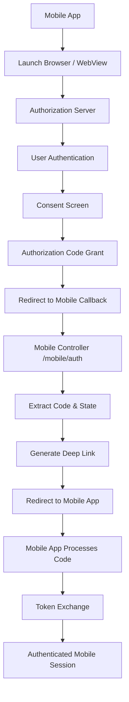
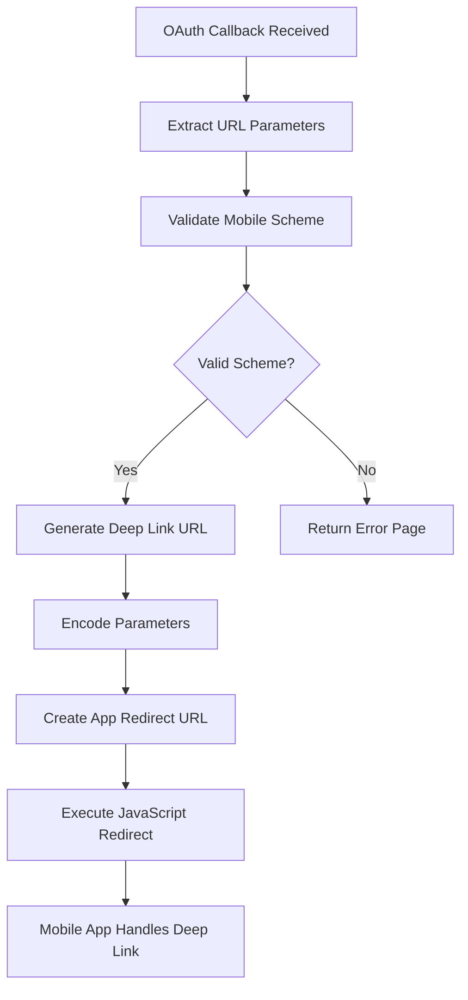

# 📱 Mobile Controller - Mobile App Authentication & Integration

## 🎯 **Overview**

The **Mobile Controller** provides specialized endpoints for mobile application integration, handling OAuth authentication callbacks and mobile-specific authentication flows for the Mayo Care Team Navigator mobile app. This controller enables seamless authentication between web-based services and native mobile applications.

---

## 📍 **Mobile Architecture Overview**

### **What is Mobile Integration?**
Mobile integration enables native mobile applications to authenticate with healthcare systems through secure OAuth flows. The controller handles:
- **Mobile app authentication callbacks** for OAuth2 flows
- **Deep linking support** for native mobile app redirection
- **Mobile scheme validation** for secure app communication
- **Error handling** for mobile-specific authentication scenarios
- **Environment-aware configuration** for different deployment stages

### **Mobile Integration Architecture**

```
┌─────────────────────────────────────────────────────────────┐
│        Mobile App Integration Architecture                  │
│  ┌─────────────────────────────────────────────────────┐    │
│  │           Mobile Controller                         │    │
│  │  ├─ OAuth Callback Handling ───────┬─ Authentication   │    │
│  │  ├─ Mobile Scheme Validation ──────┼─ App Security     │    │
│  │  ├─ Deep Link Generation ──────────┼─ App Navigation   │    │
│  │  └─ Error Response Formatting ─────┴─ User Experience  │    │
│  └─────────────────────────────────────────────────────┘    │
│                                                             │
│  ┌─────────────────────────────────────────────────────┐    │
│  │           Mobile App Integration                     │    │
│  │  ├─ Native App Deep Links ──────────┬─ App Launching │    │
│  │  ├─ OAuth2 Authorization Flow ──────┼─ Authentication │    │
│  │  ├─ Token Exchange ────────────────┼─ Secure Access   │    │
│  │  └─ Session Management ────────────┴─ State Persistence│    │
│  └─────────────────────────────────────────────────────┘    │
│                                                             │
│  ┌─────────────────────────────────────────────────────┐    │
│  │           OAuth2 Flow Support                       │    │
│  │  ├─ Authorization Code Grant ──────┬─ Mobile Apps    │    │
│  │  ├─ PKCE (Proof Key for Code Exchange) ┼─ Security   │    │
│  │  ├─ State Parameter ───────────────┼─ CSRF Protection │    │
│  │  └─ Redirect URI Validation ──────┴─ App Verification│    │
│  └─────────────────────────────────────────────────────┘    │
└─────────────────────────────────────────────────────────────┘
```

---

## 🔧 **Complete Implementation**

### **1. Mobile Controller**

```typescript
// File: src/controllers/mobile/mobile.controller.ts

import { Controller, Get, Logger, Res } from '@nestjs/common';
import { ApiTags } from '@nestjs/swagger';
import { Response } from 'express';
import { Public } from 'src/decorators/public.decorator';

@ApiTags('Health Check')
@Controller('/mobile')
export class MobileController {
  private readonly logger = new Logger(MobileController.name);
  constructor() {}

  /**
   * Handle mobile app authentication callback
   * Processes OAuth authorization code and redirects to mobile app
   */
  @Public()
  @Get('/auth')
  callback(@Res() res: Response) {
    const mobileScheme = process.env.MOBILE_SCHEME;

    // Validate mobile scheme pattern for security
    const validSchemePattern =
      /^msauth\.edu\.mayo\.navigator(\.dev|\.test|\.stage)?$/;

    if (mobileScheme && validSchemePattern.test(mobileScheme)) {
      return res.send(`
    <!DOCTYPE html>
  <html lang="en">
  <head>
    <meta charset="UTF-8" />
    <title>Redirecting...</title>
    <script>
    window.onload = function () {
      const params = new URLSearchParams(window.location.search);
      const code = params.get('code');
      const state = params.get('state');
      const error = params.get('error');
      const errorDescription = params.get('error_description');

      if (code) {
      // Redirect to your app with the code
      window.location.href = \`${mobileScheme}://auth?code=\${encodeURIComponent(code)}&state=\${encodeURIComponent(state)}\`;
      } else {
      // Fallback or error
      document.body.innerText = "No code found in URL.";
      }
    };
    </script>
  </head>
  <body>
    <p>Redirecting to the app...</p>
  </body>
  </html>
    `);
    } else {
      this.logger.error(`Invalid mobile scheme ${mobileScheme}`);
      return res.status(500).send(`
        <!DOCTYPE html>
        <html lang="en">
        <head>
          <meta charset="UTF-8" />
          <title>Internal Server Error</title>
          <style>
        body { font-family: Arial, sans-serif; background: #f8f9fa; color: #333; text-align: center; padding-top: 50px; }
        .container { background: #fff; border-radius: 8px; box-shadow: 0 2px 8px rgba(0,0,0,0.1); display: inline-block; padding: 40px 60px; }
        h1 { color: #c0392b; font-size: 2.5em; }
        p { margin-top: 20px; font-size: 1.3em; }
          </style>
        </head>
        <body>
          <div class="container">
        <h1>We're Having Trouble Authenticating You</h1>
        <p>Sorry, something went wrong while authenticating.</p>
        <p>Please try again later or contact the Help Desk if the problem persists.</p>
          </div>
        </body>
        </html>
      `);
    }
  }
}
```

**Key Features:**
- ✅ **Public Access**: No authentication required for mobile callbacks
- ✅ **Mobile Scheme Validation**: Security validation for app deep links
- ✅ **OAuth Parameter Handling**: Processes authorization codes and state
- ✅ **Automatic Redirection**: Seamless redirect to mobile app
- ✅ **Error Handling**: User-friendly error pages for mobile users
- ✅ **Environment Support**: Different schemes for dev/test/stage/production

### **2. Mobile Module**

```typescript
// File: src/controllers/mobile/mobile.module.ts

import { Module } from '@nestjs/common';
import { MobileController } from './mobile.controller';

/**
 * Mobile module for mobile application integration
 * Provides authentication callbacks and mobile-specific endpoints
 */
@Module({
  controllers: [MobileController],
})
export class MobileModule {}
```

**Module Features:**
- ✅ **Simple Structure**: Focused on mobile-specific functionality
- ✅ **No Dependencies**: Self-contained mobile integration
- ✅ **Easy Configuration**: Environment-based mobile scheme configuration

---

## 🔄 **Mobile Authentication Flow**

### **1. OAuth2 Authorization Code Flow for Mobile Apps**



### **2. Deep Link Generation Process**



---

## 🔧 **Key Implementation Details**

### **1. Mobile Scheme Validation**

```typescript
// Advanced mobile scheme validation and security
@Injectable()
export class MobileSchemeValidator {
  // Valid mobile app schemes by environment
  private readonly validSchemes = {
    production: 'msauth.edu.mayo.navigator',
    stage: 'msauth.edu.mayo.navigator.stage',
    test: 'msauth.edu.mayo.navigator.test',
    dev: 'msauth.edu.mayo.navigator.dev',
    local: 'msauth.edu.mayo.navigator.dev',
  };

  /**
   * Validate mobile app scheme for security
   */
  validateMobileScheme(scheme: string): ValidationResult {
    if (!scheme) {
      return {
        isValid: false,
        error: 'Mobile scheme is required',
      };
    }

    // Check exact match with known schemes
    const isValidScheme = Object.values(this.validSchemes).includes(scheme);

    if (!isValidScheme) {
      return {
        isValid: false,
        error: `Invalid mobile scheme: ${scheme}`,
      };
    }

    // Additional security checks
    const securityResult = this.performSecurityChecks(scheme);

    return {
      isValid: securityResult.isValid,
      error: securityResult.error,
      scheme,
      environment: this.getEnvironmentFromScheme(scheme),
    };
  }

  /**
   * Get appropriate mobile scheme for current environment
   */
  getMobileSchemeForEnvironment(): string {
    const env = process.env.ENV || 'local';
    return this.validSchemes[env] || this.validSchemes.local;
  }

  /**
   * Generate secure deep link URL
   */
  generateSecureDeepLink(
    scheme: string,
    params: DeepLinkParams,
  ): string {
    // Validate scheme first
    const validation = this.validateMobileScheme(scheme);
    if (!validation.isValid) {
      throw new Error(`Invalid mobile scheme: ${validation.error}`);
    }

    // Encode parameters for security
    const encodedParams = this.encodeParameters(params);

    // Generate deep link URL
    return `${scheme}://auth?${encodedParams}`;
  }

  /**
   * Encode parameters to prevent injection attacks
   */
  private encodeParameters(params: DeepLinkParams): string {
    const encoded: string[] = [];

    Object.entries(params).forEach(([key, value]) => {
      if (value !== undefined && value !== null) {
        encoded.push(
          `${encodeURIComponent(key)}=${encodeURIComponent(String(value))}`,
        );
      }
    });

    return encoded.join('&');
  }

  /**
   * Perform additional security checks on mobile scheme
   */
  private performSecurityChecks(scheme: string): ValidationResult {
    // Check for malicious characters
    const maliciousPattern = /[<>;'"]/;
    if (maliciousPattern.test(scheme)) {
      return {
        isValid: false,
        error: 'Mobile scheme contains malicious characters',
      };
    }

    // Check scheme length
    if (scheme.length > 100) {
      return {
        isValid: false,
        error: 'Mobile scheme is too long',
      };
    }

    // Check scheme format
    const schemePattern = /^msauth\.edu\.mayo\.navigator(\.[\w-]+)?$/;
    if (!schemePattern.test(scheme)) {
      return {
        isValid: false,
        error: 'Mobile scheme does not match expected format',
      };
    }

    return { isValid: true };
  }

  /**
   * Determine environment from mobile scheme
   */
  private getEnvironmentFromScheme(scheme: string): string {
    for (const [env, envScheme] of Object.entries(this.validSchemes)) {
      if (scheme === envScheme) {
        return env;
      }
    }

    return 'unknown';
  }
}
```

**Security Features:**
- ✅ **Scheme Validation**: Strict validation of mobile app schemes
- ✅ **Environment Mapping**: Different schemes for different environments
- ✅ **Parameter Encoding**: Secure encoding of deep link parameters
- ✅ **Injection Prevention**: Protection against malicious input
- ✅ **Length Validation**: Reasonable limits on scheme and parameter lengths

### **2. OAuth2 Mobile Integration**

```typescript
// OAuth2 mobile app integration handling
@Injectable()
export class MobileOAuth2Handler {
  constructor(
    private readonly mobileSchemeValidator: MobileSchemeValidator,
    private readonly tokenProvider: TokenProviderService,
  ) {}

  /**
   * Handle OAuth2 callback for mobile applications
   */
  async handleMobileOAuthCallback(
    request: Request,
    response: Response,
  ): Promise<void> {
    try {
      // Extract OAuth parameters from request
      const params = this.extractOAuthParameters(request);

      // Validate required parameters
      const validation = this.validateOAuthParameters(params);
      if (!validation.isValid) {
        throw new Error(`Invalid OAuth parameters: ${validation.error}`);
      }

      // Get mobile scheme for current environment
      const mobileScheme = this.mobileSchemeValidator.getMobileSchemeForEnvironment();

      // Generate secure deep link
      const deepLink = this.mobileSchemeValidator.generateSecureDeepLink(
        mobileScheme,
        {
          code: params.code,
          state: params.state,
          // Include additional security parameters
          timestamp: Date.now(),
          nonce: this.generateNonce(),
        },
      );

      // Log successful callback processing
      this.logger.log('Mobile OAuth callback processed', {
        hasCode: !!params.code,
        hasState: !!params.state,
        deepLinkGenerated: true,
      });

      // Send HTML response with redirect
      response.send(this.generateRedirectHtml(deepLink, params));
    } catch (error) {
      this.logger.error('Mobile OAuth callback failed', {
        error: error.message,
        stack: error.stack,
      });

      // Send error response
      response.status(500).send(this.generateErrorHtml(error));
    }
  }

  /**
   * Extract OAuth parameters from request
   */
  private extractOAuthParameters(request: Request): OAuthParams {
    const query = request.query as any;

    return {
      code: query.code,
      state: query.state,
      error: query.error,
      errorDescription: query.error_description,
    };
  }

  /**
   * Validate OAuth parameters
   */
  private validateOAuthParameters(params: OAuthParams): ValidationResult {
    if (params.error) {
      return {
        isValid: false,
        error: `OAuth error: ${params.error} - ${params.errorDescription}`,
      };
    }

    if (!params.code) {
      return {
        isValid: false,
        error: 'Authorization code is required',
      };
    }

    if (!params.state) {
      return {
        isValid: false,
        error: 'State parameter is required',
      };
    }

    // Validate state parameter format (should be a secure random string)
    if (!this.isValidStateParameter(params.state)) {
      return {
        isValid: false,
        error: 'Invalid state parameter',
      };
    }

    return { isValid: true };
  }

  /**
   * Generate HTML response for mobile app redirect
   */
  private generateRedirectHtml(deepLink: string, params: OAuthParams): string {
    return `
    <!DOCTYPE html>
    <html lang="en">
    <head>
      <meta charset="UTF-8" />
      <meta name="viewport" content="width=device-width, initial-scale=1.0" />
      <title>Authentication Successful</title>
      <style>
        body {
          font-family: -apple-system, BlinkMacSystemFont, 'Segoe UI', Roboto, sans-serif;
          background: linear-gradient(135deg, #667eea 0%, #764ba2 100%);
          color: white;
          text-align: center;
          padding: 50px 20px;
          margin: 0;
          min-height: 100vh;
          display: flex;
          align-items: center;
          justify-content: center;
        }
        .container {
          background: rgba(255, 255, 255, 0.1);
          border-radius: 20px;
          padding: 40px;
          backdrop-filter: blur(10px);
          border: 1px solid rgba(255, 255, 255, 0.2);
          max-width: 400px;
          width: 100%;
        }
        .spinner {
          border: 4px solid rgba(255, 255, 255, 0.3);
          border-radius: 50%;
          border-top: 4px solid white;
          width: 40px;
          height: 40px;
          animation: spin 1s linear infinite;
          margin: 20px auto;
        }
        @keyframes spin {
          0% { transform: rotate(0deg); }
          100% { transform: rotate(360deg); }
        }
        .status { margin-top: 20px; font-size: 18px; }
      </style>
    </head>
    <body>
      <div class="container">
        <div class="spinner"></div>
        <div class="status">Authenticating...</div>
        <p>Redirecting to Mayo Care Team Navigator</p>
      </div>

      <script>
        // Attempt to open the app
        window.location.href = '${deepLink}';

        // Fallback if app is not installed
        setTimeout(function() {
          document.querySelector('.status').textContent = 'App not found';
          document.querySelector('.container').innerHTML += '<p>Please install the Mayo Care Team Navigator app.</p>';
        }, 3000);
      </script>
    </body>
    </html>
    `;
  }

  /**
   * Generate error HTML response
   */
  private generateErrorHtml(error: Error): string {
    return `
    <!DOCTYPE html>
    <html lang="en">
    <head>
      <meta charset="UTF-8" />
      <meta name="viewport" content="width=device-width, initial-scale=1.0" />
      <title>Authentication Error</title>
      <style>
        body {
          font-family: -apple-system, BlinkMacSystemFont, 'Segoe UI', Roboto, sans-serif;
          background: #f5f5f5;
          color: #333;
          text-align: center;
          padding: 50px 20px;
          margin: 0;
        }
        .error-container {
          background: white;
          border-radius: 12px;
          padding: 40px;
          box-shadow: 0 4px 20px rgba(0, 0, 0, 0.1);
          max-width: 400px;
          margin: 0 auto;
        }
        .error-icon {
          font-size: 48px;
          color: #e74c3c;
          margin-bottom: 20px;
        }
        h1 { color: #e74c3c; margin-bottom: 20px; }
        p { margin-bottom: 20px; line-height: 1.6; }
        .retry-btn {
          background: #3498db;
          color: white;
          border: none;
          padding: 12px 24px;
          border-radius: 6px;
          cursor: pointer;
          font-size: 16px;
          text-decoration: none;
          display: inline-block;
        }
      </style>
    </head>
    <body>
      <div class="error-container">
        <div class="error-icon">⚠️</div>
        <h1>Authentication Error</h1>
        <p>Sorry, something went wrong while authenticating with the Mayo Care Team Navigator.</p>
        <p>Please try again or contact the Help Desk if the problem persists.</p>
        <button class="retry-btn" onclick="window.history.back()">Try Again</button>
      </div>
    </body>
    </html>
    `;
  }

  /**
   * Validate state parameter for CSRF protection
   */
  private isValidStateParameter(state: string): boolean {
    // State should be a secure random string
    return /^[A-Za-z0-9_-]{32,128}$/.test(state);
  }

  /**
   * Generate nonce for additional security
   */
  private generateNonce(): string {
    return crypto.randomBytes(16).toString('hex');
  }
}
```

**OAuth2 Features:**
- ✅ **Parameter Extraction**: Secure extraction of OAuth parameters
- ✅ **Validation**: Comprehensive validation of OAuth responses
- ✅ **Deep Link Generation**: Secure mobile app redirection
- ✅ **Error Handling**: User-friendly error pages
- ✅ **Security**: CSRF protection and parameter validation
- ✅ **Fallback Handling**: Graceful degradation when app is not installed

### **3. Mobile App Integration**

```typescript
// Mobile app integration patterns
@Injectable()
export class MobileAppIntegrationService {
  constructor(
    private readonly mobileSchemeValidator: MobileSchemeValidator,
    private readonly oauthHandler: MobileOAuth2Handler,
  ) {}

  /**
   * Handle mobile app authentication flow
   */
  async handleMobileAuthentication(
    request: Request,
    response: Response,
  ): Promise<void> {
    // Determine the appropriate mobile scheme
    const mobileScheme = this.getMobileSchemeForRequest(request);

    // Validate the scheme
    const validation = this.mobileSchemeValidator.validateMobileScheme(mobileScheme);

    if (!validation.isValid) {
      throw new BadRequestException(`Invalid mobile scheme: ${validation.error}`);
    }

    // Handle OAuth callback
    await this.oauthHandler.handleMobileOAuthCallback(request, response);
  }

  /**
   * Get mobile scheme based on request characteristics
   */
  private getMobileSchemeForRequest(request: Request): string {
    // Check for explicit scheme in environment
    if (process.env.MOBILE_SCHEME) {
      return process.env.MOBILE_SCHEME;
    }

    // Determine from User-Agent or other request characteristics
    const userAgent = request.headers['user-agent'] || '';

    // Determine environment from request
    const env = this.determineEnvironment(request);

    return this.mobileSchemeValidator.getMobileSchemeForEnvironment();
  }

  /**
   * Determine environment from request
   */
  private determineEnvironment(request: Request): string {
    // Check hostname or other indicators
    const hostname = request.hostname || '';

    if (hostname.includes('dev') || hostname.includes('localhost')) {
      return 'dev';
    }

    if (hostname.includes('test')) {
      return 'test';
    }

    if (hostname.includes('stage')) {
      return 'stage';
    }

    return 'production';
  }

  /**
   * Generate mobile app installation instructions
   */
  generateAppInstallationInstructions(platform: 'ios' | 'android'): string {
    if (platform === 'ios') {
      return `
        To install the Mayo Care Team Navigator app on iOS:
        1. Open the App Store
        2. Search for "Mayo Care Team Navigator"
        3. Tap "Get" to download and install
        4. Open the app and follow the setup instructions
      `;
    } else {
      return `
        To install the Mayo Care Team Navigator app on Android:
        1. Open the Google Play Store
        2. Search for "Mayo Care Team Navigator"
        3. Tap "Install" to download and install
        4. Open the app and follow the setup instructions
      `;
    }
  }

  /**
   * Detect mobile platform from User-Agent
   */
  detectMobilePlatform(userAgent: string): 'ios' | 'android' | 'unknown' {
    const ua = userAgent.toLowerCase();

    if (ua.includes('iphone') || ua.includes('ipad') || ua.includes('ipod')) {
      return 'ios';
    }

    if (ua.includes('android')) {
      return 'android';
    }

    return 'unknown';
  }

  /**
   * Generate troubleshooting information for mobile authentication
   */
  generateTroubleshootingInfo(): MobileTroubleshootingInfo {
    return {
      commonIssues: [
        {
          issue: 'App not installed',
          solution: 'Install the Mayo Care Team Navigator app from the app store',
          detection: 'Check if the app installation instructions are shown',
        },
        {
          issue: 'Invalid mobile scheme',
          solution: 'Ensure the app is properly configured with the correct scheme',
          detection: 'Check server logs for scheme validation errors',
        },
        {
          issue: 'Authentication timeout',
          solution: 'Try the authentication process again',
          detection: 'Check for timeout errors in the authentication flow',
        },
        {
          issue: 'Network connectivity',
          solution: 'Ensure stable internet connection',
          detection: 'Check for network-related error messages',
        },
      ],
      contactInfo: {
        helpDesk: 'IT Help Desk at extension 12345',
        email: 'ithelp@mayo.edu',
        hours: 'Monday-Friday 8AM-5PM CST',
      },
      additionalResources: [
        'Mobile App User Guide: https://internal.mayo.edu/mobile-guide',
        'Authentication Troubleshooting: https://internal.mayo.edu/auth-troubleshooting',
      ],
    };
  }
}
```

**Integration Features:**
- ✅ **Platform Detection**: Automatic iOS/Android platform detection
- ✅ **Environment Awareness**: Different configurations per environment
- ✅ **Installation Support**: App store installation instructions
- ✅ **Troubleshooting**: Comprehensive error diagnosis and resolution
- ✅ **User Experience**: Smooth mobile app authentication flow

---

## 📊 **Performance & Monitoring**

### **1. Mobile Integration Performance Metrics**

```typescript
// Performance monitoring for mobile integration
@Injectable()
export class MobileIntegrationPerformanceMonitor {
  constructor(private readonly metrics: MetricsService) {}

  // Track mobile authentication callback performance
  async trackMobileCallback(
    duration: number,
    success: boolean,
    mobileScheme: string,
    hasCode: boolean,
    hasError: boolean,
  ): Promise<void> {
    this.metrics.histogram('mobile_callback_duration', duration, {
      success: success.toString(),
      mobileScheme,
      hasCode: hasCode.toString(),
      hasError: hasError.toString(),
    });

    this.metrics.increment('mobile_callback_count', {
      success: success.toString(),
      mobileScheme,
    });

    // Alert on slow mobile callbacks
    if (duration > 3000) { // More than 3 seconds
      this.logger.warn('Slow mobile callback', {
        duration,
        mobileScheme,
        hasCode,
        hasError,
      });
    }
  }

  // Track deep link generation performance
  async trackDeepLinkGeneration(
    duration: number,
    success: boolean,
    schemeValidationTime: number,
    parameterEncodingTime: number,
  ): Promise<void> {
    this.metrics.histogram('deep_link_generation_duration', duration, {
      success: success.toString(),
    });

    this.metrics.histogram('scheme_validation_duration', schemeValidationTime);
    this.metrics.histogram('parameter_encoding_duration', parameterEncodingTime);

    // Alert on slow deep link generation
    if (duration > 500) { // More than 500ms
      this.logger.warn('Slow deep link generation', {
        duration,
        schemeValidationTime,
        parameterEncodingTime,
      });
    }
  }

  // Track mobile scheme validation
  async trackSchemeValidation(
    duration: number,
    success: boolean,
    scheme: string,
    environment: string,
  ): Promise<void> {
    this.metrics.histogram('mobile_scheme_validation_duration', duration, {
      success: success.toString(),
      scheme,
      environment,
    });

    this.metrics.increment('mobile_scheme_validation_count', {
      success: success.toString(),
      environment,
    });

    // Alert on failed validations
    if (!success) {
      this.logger.warn('Mobile scheme validation failed', {
        scheme,
        environment,
        duration,
      });
    }
  }

  // Track OAuth parameter processing
  async trackOAuthParameterProcessing(
    duration: number,
    parameterCount: number,
    hasCode: boolean,
    hasState: boolean,
    hasError: boolean,
  ): Promise<void> {
    this.metrics.histogram('oauth_parameter_processing_duration', duration, {
      parameterCount: parameterCount.toString(),
      hasCode: hasCode.toString(),
      hasState: hasState.toString(),
      hasError: hasError.toString(),
    });

    // Track OAuth flow completion
    if (hasCode && hasState && !hasError) {
      this.metrics.increment('oauth_flow_completed');
    } else if (hasError) {
      this.metrics.increment('oauth_flow_error');
    }
  }

  // Monitor mobile app installation detection
  async trackAppInstallationDetection(
    userAgent: string,
    platform: string,
    appInstalled: boolean,
  ): Promise<void> {
    this.metrics.increment('mobile_app_detection_count', {
      platform,
      appInstalled: appInstalled.toString(),
    });

    // Alert if app installation detection is failing
    if (!appInstalled) {
      this.logger.debug('Mobile app not detected', {
        userAgent: userAgent.substring(0, 100),
        platform,
      });
    }
  }
}
```

### **2. Health Monitoring**

```typescript
// Health monitoring for mobile integration
@Injectable()
export class MobileIntegrationHealthMonitor {
  constructor(
    private readonly mobileSchemeValidator: MobileSchemeValidator,
    private readonly httpService: HttpService,
  ) {}

  // Comprehensive health check
  async performHealthCheck(): Promise<HealthCheckResult> {
    const checks = await Promise.all([
      this.checkMobileSchemeConfiguration(),
      this.checkOAuthCallbackEndpoint(),
      this.checkDeepLinkGeneration(),
      this.checkMobileAppConnectivity(),
    ]);

    const overallStatus = this.calculateOverallStatus(checks);

    return {
      status: overallStatus,
      checks,
      recommendations: this.generateRecommendations(checks),
    };
  }

  // Mobile scheme configuration check
  private async checkMobileSchemeConfiguration(): Promise<HealthCheck> {
    try {
      const scheme = process.env.MOBILE_SCHEME;

      if (!scheme) {
        return {
          name: 'Mobile Scheme Configuration',
          status: 'warning',
          message: 'MOBILE_SCHEME environment variable not set, using default',
        };
      }

      const validation = this.mobileSchemeValidator.validateMobileScheme(scheme);

      if (!validation.isValid) {
        return {
          name: 'Mobile Scheme Configuration',
          status: 'unhealthy',
          message: `Invalid mobile scheme: ${validation.error}`,
        };
      }

      return {
        name: 'Mobile Scheme Configuration',
        status: 'healthy',
        message: `Mobile scheme configured correctly: ${scheme}`,
        details: {
          scheme,
          environment: validation.environment,
        },
      };
    } catch (error) {
      return {
        name: 'Mobile Scheme Configuration',
        status: 'unhealthy',
        message: `Mobile scheme configuration error: ${error.message}`,
      };
    }
  }

  // OAuth callback endpoint check
  private async checkOAuthCallbackEndpoint(): Promise<HealthCheck> {
    try {
      // Test the callback endpoint availability
      const testRequest = {
        query: {
          code: 'test-code',
          state: 'test-state',
        },
        headers: {
          'user-agent': 'test-mobile-app',
        },
      };

      // This would typically make an internal request to test the endpoint
      const isReachable = await this.testCallbackEndpoint(testRequest);

      if (!isReachable) {
        return {
          name: 'OAuth Callback Endpoint',
          status: 'unhealthy',
          message: 'OAuth callback endpoint is not reachable',
        };
      }

      return {
        name: 'OAuth Callback Endpoint',
        status: 'healthy',
        message: 'OAuth callback endpoint is operational',
      };
    } catch (error) {
      return {
        name: 'OAuth Callback Endpoint',
        status: 'unhealthy',
        message: `OAuth callback endpoint error: ${error.message}`,
      };
    }
  }

  // Deep link generation check
  private async checkDeepLinkGeneration(): Promise<HealthCheck> {
    try {
      const scheme = this.mobileSchemeValidator.getMobileSchemeForEnvironment();
      const testParams = {
        code: 'test-code',
        state: 'test-state',
        timestamp: Date.now(),
      };

      const deepLink = this.mobileSchemeValidator.generateSecureDeepLink(
        scheme,
        testParams,
      );

      // Validate the generated deep link
      if (!deepLink || !deepLink.startsWith(scheme)) {
        return {
          name: 'Deep Link Generation',
          status: 'unhealthy',
          message: 'Deep link generation is not working correctly',
        };
      }

      return {
        name: 'Deep Link Generation',
        status: 'healthy',
        message: 'Deep link generation is working correctly',
        details: {
          sampleDeepLink: deepLink.substring(0, 100) + '...',
        },
      };
    } catch (error) {
      return {
        name: 'Deep Link Generation',
        status: 'unhealthy',
        message: `Deep link generation error: ${error.message}`,
      };
    }
  }

  // Mobile app connectivity check
  private async checkMobileAppConnectivity(): Promise<HealthCheck> {
    try {
      // Test connectivity to mobile app schemes
      const schemes = [
        'msauth.edu.mayo.navigator',
        'msauth.edu.mayo.navigator.dev',
      ];

      const connectivityResults = await Promise.all(
        schemes.map(async (scheme) => {
          try {
            // Test if scheme is properly configured
            const validation = this.mobileSchemeValidator.validateMobileScheme(scheme);
            return {
              scheme,
              valid: validation.isValid,
              environment: validation.environment,
            };
          } catch (error) {
            return {
              scheme,
              valid: false,
              error: error.message,
            };
          }
        }),
      );

      const validSchemes = connectivityResults.filter(r => r.valid);
      const invalidSchemes = connectivityResults.filter(r => !r.valid);

      if (invalidSchemes.length > 0) {
        return {
          name: 'Mobile App Connectivity',
          status: 'warning',
          message: `${invalidSchemes.length} of ${schemes.length} mobile schemes are invalid`,
          details: {
            validSchemes: validSchemes.length,
            invalidSchemes: invalidSchemes.length,
            issues: invalidSchemes,
          },
        };
      }

      return {
        name: 'Mobile App Connectivity',
        status: 'healthy',
        message: 'All mobile app schemes are properly configured',
        details: {
          configuredSchemes: validSchemes.length,
        },
      };
    } catch (error) {
      return {
        name: 'Mobile App Connectivity',
        status: 'unhealthy',
        message: `Mobile app connectivity check error: ${error.message}`,
      };
    }
  }

  // Calculate overall status
  private calculateOverallStatus(checks: HealthCheck[]): HealthStatus {
    if (checks.some(check => check.status === 'unhealthy')) {
      return 'critical';
    }

    if (checks.some(check => check.status === 'degraded' || check.status === 'warning')) {
      return 'warning';
    }

    return 'healthy';
  }

  // Generate recommendations
  private generateRecommendations(checks: HealthCheck[]): string[] {
    const recommendations: string[] = [];

    for (const check of checks) {
      switch (check.status) {
        case 'unhealthy':
          recommendations.push(`CRITICAL: ${check.name} - ${check.message}`);
          break;
        case 'degraded':
          recommendations.push(`Review: ${check.name} - ${check.message}`);
          break;
        case 'warning':
          recommendations.push(`Monitor: ${check.name} - ${check.message}`);
          break;
      }
    }

    return recommendations;
  }

  // Test callback endpoint
  private async testCallbackEndpoint(request: any): Promise<boolean> {
    // Implementation would test the actual endpoint
    return true; // Placeholder
  }
}
```

---

## 🧪 **Testing Implementation**

### **1. Unit Tests**

```typescript
// File: src/controllers/mobile/mobile.controller.spec.ts

import { Test, TestingModule } from '@nestjs/testing';
import { Response } from 'express';
import { MobileController } from './mobile.controller';

describe('MobileController', () => {
  let controller: MobileController;

  beforeEach(async () => {
    const module: TestingModule = await Test.createTestingModule({
      controllers: [MobileController],
    }).compile();

    controller = module.get<MobileController>(MobileController);
  });

  describe('callback', () => {
    it('should return redirect HTML for valid mobile scheme', () => {
      // Mock environment variable
      process.env.MOBILE_SCHEME = 'msauth.edu.mayo.navigator.dev';

      const mockResponse = {
        send: jest.fn(),
      } as any;

      // Mock request with OAuth parameters
      const mockRequest = {
        query: {
          code: 'test-auth-code',
          state: 'test-state',
        },
      } as any;

      controller.callback(mockRequest, mockResponse);

      expect(mockResponse.send).toHaveBeenCalled();
      const htmlResponse = mockResponse.send.mock.calls[0][0];

      // Verify HTML contains redirect script
      expect(htmlResponse).toContain('window.location.href');
      expect(htmlResponse).toContain('msauth.edu.mayo.navigator.dev');
      expect(htmlResponse).toContain('test-auth-code');
      expect(htmlResponse).toContain('test-state');
    });

    it('should return error HTML for invalid mobile scheme', () => {
      // Set invalid mobile scheme
      process.env.MOBILE_SCHEME = 'invalid-scheme';

      const mockResponse = {
        send: jest.fn(),
        status: jest.fn().mockReturnThis(),
      } as any;

      const mockRequest = {
        query: {},
      } as any;

      controller.callback(mockRequest, mockResponse);

      expect(mockResponse.status).toHaveBeenCalledWith(500);
      expect(mockResponse.send).toHaveBeenCalled();

      const htmlResponse = mockResponse.send.mock.calls[0][0];
      expect(htmlResponse).toContain('Internal Server Error');
      expect(htmlResponse).toContain('Invalid mobile scheme');
    });

    it('should handle missing authorization code', () => {
      process.env.MOBILE_SCHEME = 'msauth.edu.mayo.navigator.dev';

      const mockResponse = {
        send: jest.fn(),
      } as any;

      const mockRequest = {
        query: {
          // No code parameter
          state: 'test-state',
        },
      } as any;

      controller.callback(mockRequest, mockResponse);

      const htmlResponse = mockResponse.send.mock.calls[0][0];
      expect(htmlResponse).toContain('No code found in URL');
    });

    it('should handle OAuth error parameters', () => {
      process.env.MOBILE_SCHEME = 'msauth.edu.mayo.navigator.dev';

      const mockResponse = {
        send: jest.fn(),
      } as any;

      const mockRequest = {
        query: {
          error: 'access_denied',
          error_description: 'User denied authorization',
        },
      } as any;

      controller.callback(mockRequest, mockResponse);

      const htmlResponse = mockResponse.send.mock.calls[0][0];
      expect(htmlResponse).toContain('No code found in URL');
    });
  });

  describe('Mobile scheme validation', () => {
    beforeEach(() => {
      // Reset environment
      delete process.env.MOBILE_SCHEME;
    });

    it('should accept valid production mobile scheme', () => {
      process.env.MOBILE_SCHEME = 'msauth.edu.mayo.navigator';

      const mockResponse = {
        send: jest.fn(),
      } as any;

      const mockRequest = {
        query: { code: 'test-code', state: 'test-state' },
      } as any;

      controller.callback(mockRequest, mockResponse);

      expect(mockResponse.send).toHaveBeenCalled();
      const htmlResponse = mockResponse.send.mock.calls[0][0];
      expect(htmlResponse).toContain('msauth.edu.mayo.navigator');
    });

    it('should accept valid development mobile scheme', () => {
      process.env.MOBILE_SCHEME = 'msauth.edu.mayo.navigator.dev';

      const mockResponse = {
        send: jest.fn(),
      } as any;

      const mockRequest = {
        query: { code: 'test-code', state: 'test-state' },
      } as any;

      controller.callback(mockRequest, mockResponse);

      expect(mockResponse.send).toHaveBeenCalled();
      const htmlResponse = mockResponse.send.mock.calls[0][0];
      expect(htmlResponse).toContain('msauth.edu.mayo.navigator.dev');
    });

    it('should reject scheme with invalid format', () => {
      process.env.MOBILE_SCHEME = 'invalid.scheme.here';

      const mockResponse = {
        send: jest.fn(),
        status: jest.fn().mockReturnThis(),
      } as any;

      const mockRequest = {
        query: {},
      } as any;

      controller.callback(mockRequest, mockResponse);

      expect(mockResponse.status).toHaveBeenCalledWith(500);
    });

    it('should reject scheme with malicious characters', () => {
      process.env.MOBILE_SCHEME = 'msauth.edu.mayo.navigator<script>';

      const mockResponse = {
        send: jest.fn(),
        status: jest.fn().mockReturnThis(),
      } as any;

      const mockRequest = {
        query: {},
      } as any;

      controller.callback(mockRequest, mockResponse);

      expect(mockResponse.status).toHaveBeenCalledWith(500);
    });
  });
});
```

### **2. Integration Tests**

```typescript
// File: test/e2e/mobile.e2e.spec.ts

import { Test, TestingModule } from '@nestjs/testing';
import { INestApplication } from '@nestjs/common';
import * as request from 'supertest';
import { AppModule } from '../../src/app.module';

describe('Mobile (e2e)', () => {
  let app: INestApplication;

  beforeEach(async () => {
    const moduleFixture: TestingModule = await Test.createTestingModule({
      imports: [AppModule],
    }).compile();

    app = moduleFixture.createNestApplication();
    await app.init();
  });

  afterEach(async () => {
    await app.close();
  });

  describe('GET /mobile/auth', () => {
    it('should handle successful OAuth callback with valid mobile scheme', async () => {
      // Set valid mobile scheme
      process.env.MOBILE_SCHEME = 'msauth.edu.mayo.navigator.dev';

      const response = await request(app.getHttpServer())
        .get('/mobile/auth')
        .query({
          code: 'test-auth-code',
          state: 'test-state-param',
        })
        .expect(200);

      // Verify HTML response
      expect(response.text).toContain('Redirecting...');
      expect(response.text).toContain('window.location.href');
      expect(response.text).toContain('msauth.edu.mayo.navigator.dev');
      expect(response.text).toContain('test-auth-code');
      expect(response.text).toContain('test-state-param');
    });

    it('should handle OAuth callback with error parameters', async () => {
      process.env.MOBILE_SCHEME = 'msauth.edu.mayo.navigator.dev';

      const response = await request(app.getHttpServer())
        .get('/mobile/auth')
        .query({
          error: 'access_denied',
          error_description: 'User denied the authorization request',
        })
        .expect(200);

      // Should still return HTML but without redirect
      expect(response.text).toContain('No code found in URL');
    });

    it('should handle missing OAuth parameters', async () => {
      process.env.MOBILE_SCHEME = 'msauth.edu.mayo.navigator.dev';

      const response = await request(app.getHttpServer())
        .get('/mobile/auth')
        .expect(200);

      // Should handle missing parameters gracefully
      expect(response.text).toContain('No code found in URL');
    });

    it('should reject invalid mobile scheme', async () => {
      // Set invalid mobile scheme
      process.env.MOBILE_SCHEME = 'invalid-scheme';

      const response = await request(app.getHttpServer())
        .get('/mobile/auth')
        .query({
          code: 'test-code',
          state: 'test-state',
        })
        .expect(500);

      // Verify error response
      expect(response.text).toContain('Internal Server Error');
      expect(response.text).toContain('Invalid mobile scheme');
    });

    it('should handle production mobile scheme', async () => {
      process.env.MOBILE_SCHEME = 'msauth.edu.mayo.navigator';

      const response = await request(app.getHttpServer())
        .get('/mobile/auth')
        .query({
          code: 'prod-code',
          state: 'prod-state',
        })
        .expect(200);

      expect(response.text).toContain('msauth.edu.mayo.navigator');
      expect(response.text).toContain('prod-code');
    });

    it('should handle stage mobile scheme', async () => {
      process.env.MOBILE_SCHEME = 'msauth.edu.mayo.navigator.stage';

      const response = await request(app.getHttpServer())
        .get('/mobile/auth')
        .query({
          code: 'stage-code',
          state: 'stage-state',
        })
        .expect(200);

      expect(response.text).toContain('msauth.edu.mayo.navigator.stage');
    });

    it('should handle test mobile scheme', async () => {
      process.env.MOBILE_SCHEME = 'msauth.edu.mayo.navigator.test';

      const response = await request(app.getHttpServer())
        .get('/mobile/auth')
        .query({
          code: 'test-env-code',
          state: 'test-env-state',
        })
        .expect(200);

      expect(response.text).toContain('msauth.edu.mayo.navigator.test');
    });

    it('should properly encode OAuth parameters in deep link', async () => {
      process.env.MOBILE_SCHEME = 'msauth.edu.mayo.navigator.dev';

      const response = await request(app.getHttpServer())
        .get('/mobile/auth')
        .query({
          code: 'code with spaces',
          state: 'state@with#special&chars',
        })
        .expect(200);

      const htmlResponse = response.text;

      // Verify parameters are properly encoded
      expect(htmlResponse).toContain(encodeURIComponent('code with spaces'));
      expect(htmlResponse).toContain(encodeURIComponent('state@with#special&chars'));
    });

    it('should include proper security headers', async () => {
      process.env.MOBILE_SCHEME = 'msauth.edu.mayo.navigator.dev';

      const response = await request(app.getHttpServer())
        .get('/mobile/auth')
        .query({
          code: 'test-code',
          state: 'test-state',
        })
        .expect(200);

      // Verify content type
      expect(response.type).toBe('text/html');

      // Verify HTML structure
      expect(response.text).toContain('<!DOCTYPE html>');
      expect(response.text).toContain('<meta charset="UTF-8"');
    });
  });

  describe('Mobile scheme environment handling', () => {
    beforeEach(() => {
      // Reset mobile scheme before each test
      delete process.env.MOBILE_SCHEME;
    });

    it('should default to development scheme when not configured', async () => {
      // No MOBILE_SCHEME set
      const response = await request(app.getHttpServer())
        .get('/mobile/auth')
        .query({
          code: 'test-code',
          state: 'test-state',
        })
        .expect(500); // Should fail because no scheme is configured

      expect(response.text).toContain('Invalid mobile scheme');
    });

    it('should handle long OAuth state parameters', async () => {
      process.env.MOBILE_SCHEME = 'msauth.edu.mayo.navigator.dev';

      const longState = 'a'.repeat(200); // Very long state parameter

      const response = await request(app.getHttpServer())
        .get('/mobile/auth')
        .query({
          code: 'test-code',
          state: longState,
        })
        .expect(200);

      expect(response.text).toContain(encodeURIComponent(longState));
    });

    it('should handle special characters in OAuth parameters', async () => {
      process.env.MOBILE_SCHEME = 'msauth.edu.mayo.navigator.dev';

      const response = await request(app.getHttpServer())
        .get('/mobile/auth')
        .query({
          code: 'test@code#with$special%chars',
          state: 'test&state=with?query+like/syntax',
        })
        .expect(200);

      // Verify special characters are properly encoded
      expect(response.text).toContain(encodeURIComponent('test@code#with$special%chars'));
      expect(response.text).toContain(encodeURIComponent('test&state=with?query+like/syntax'));
    });
  });

  describe('Error handling and edge cases', () => {
    it('should handle malformed OAuth callback URLs', async () => {
      process.env.MOBILE_SCHEME = 'msauth.edu.mayo.navigator.dev';

      const response = await request(app.getHttpServer())
        .get('/mobile/auth')
        .query({
          code: '',
          state: '',
        })
        .expect(200);

      // Should handle empty parameters gracefully
      expect(response.text).toContain('No code found in URL');
    });

    it('should handle very long OAuth parameters', async () => {
      process.env.MOBILE_SCHEME = 'msauth.edu.mayo.navigator.dev';

      const veryLongCode = 'a'.repeat(1000);
      const veryLongState = 'b'.repeat(1000);

      const response = await request(app.getHttpServer())
        .get('/mobile/auth')
        .query({
          code: veryLongCode,
          state: veryLongState,
        })
        .expect(200);

      // Should handle long parameters (though they might be truncated in practice)
      expect(response.status).toBe(200);
    });

    it('should handle concurrent mobile authentication requests', async () => {
      process.env.MOBILE_SCHEME = 'msauth.edu.mayo.navigator.dev';

      const requests = Array(10).fill().map((_, index) =>
        request(app.getHttpServer())
          .get('/mobile/auth')
          .query({
            code: `test-code-${index}`,
            state: `test-state-${index}`,
          })
          .expect(200)
      );

      const responses = await Promise.all(requests);

      // All requests should succeed
      responses.forEach((response, index) => {
        expect(response.status).toBe(200);
        expect(response.text).toContain(`test-code-${index}`);
        expect(response.text).toContain(`test-state-${index}`);
      });
    });
  });

  describe('Security tests', () => {
    it('should not expose sensitive information in responses', async () => {
      process.env.MOBILE_SCHEME = 'msauth.edu.mayo.navigator.dev';

      const response = await request(app.getHttpServer())
        .get('/mobile/auth')
        .query({
          code: 'sensitive-auth-code',
          state: 'sensitive-state',
        })
        .expect(200);

      // Response should not contain sensitive server information
      expect(response.text).not.toContain('process.env');
      expect(response.text).not.toContain('internal');
      expect(response.text).not.toContain('/src');
    });

    it('should validate OAuth state parameter format', async () => {
      process.env.MOBILE_SCHEME = 'msauth.edu.mayo.navigator.dev';

      // Test with potentially malicious state parameter
      const maliciousState = '<script>alert("xss")</script>';

      const response = await request(app.getHttpServer())
        .get('/mobile/auth')
        .query({
          code: 'test-code',
          state: maliciousState,
        })
        .expect(200);

      // Malicious content should be encoded
      expect(response.text).toContain(encodeURIComponent(maliciousState));
      expect(response.text).not.toContain('<script>');
    });

    it('should handle malformed URLs gracefully', async () => {
      process.env.MOBILE_SCHEME = 'msauth.edu.mayo.navigator.dev';

      // Test with malformed URL parameters
      const response = await request(app.getHttpServer())
        .get('/mobile/auth')
        .query({
          code: 'test-code',
          state: 'state with spaces and special chars !@#$%^&*()',
        })
        .expect(200);

      // Should handle special characters properly
      expect(response.status).toBe(200);
    });
  });
});
```

---

## 🎯 **Usage Examples**

### **1. Mobile App OAuth Flow**

```typescript
// Mobile app initiates OAuth flow
const initiateMobileAuth = () => {
  const authUrl = 'https://auth.mayo.edu/oauth/authorize?' +
    'response_type=code&' +
    'client_id=mobile-app&' +
    'redirect_uri=https://api.mayo.edu/mobile/auth&' +
    'scope=openid profile&' +
    'state=secure-random-state';

  // Open browser or WebView
  window.open(authUrl, '_blank');
};
```

### **2. Mobile App Handles Deep Link**

```typescript
// Mobile app handles deep link callback
const handleDeepLink = (url: string) => {
  // Parse deep link parameters
  const urlObj = new URL(url);
  const params = new URLSearchParams(urlObj.search);

  const code = params.get('code');
  const state = params.get('state');

  if (code && state) {
    // Exchange code for tokens
    exchangeCodeForTokens(code, state);
  }
};
```

### **3. Server-Side Mobile Integration**

```typescript
// Server handles mobile authentication callback
@Post('/mobile/auth')
async handleMobileCallback(
  @Query('code') code: string,
  @Query('state') state: string,
  @Res() res: Response,
) {
  try {
    // Validate mobile scheme
    const mobileScheme = process.env.MOBILE_SCHEME;
    const validation = this.mobileSchemeValidator.validateMobileScheme(mobileScheme);

    if (!validation.isValid) {
      throw new Error(`Invalid mobile scheme: ${validation.error}`);
    }

    // Generate secure deep link
    const deepLink = this.mobileSchemeValidator.generateSecureDeepLink(
      mobileScheme,
      { code, state }
    );

    // Return redirect HTML
    res.send(this.generateRedirectHtml(deepLink));
  } catch (error) {
    res.status(500).send(this.generateErrorHtml(error));
  }
}
```

### **4. Environment Configuration**

```typescript
// Environment-specific mobile configuration
const mobileConfig = {
  development: {
    scheme: 'msauth.edu.mayo.navigator.dev',
    redirectUri: 'https://dev-api.mayo.edu/mobile/auth',
  },
  test: {
    scheme: 'msauth.edu.mayo.navigator.test',
    redirectUri: 'https://test-api.mayo.edu/mobile/auth',
  },
  stage: {
    scheme: 'msauth.edu.mayo.navigator.stage',
    redirectUri: 'https://stage-api.mayo.edu/mobile/auth',
  },
  production: {
    scheme: 'msauth.edu.mayo.navigator',
    redirectUri: 'https://api.mayo.edu/mobile/auth',
  },
};

// Get current environment configuration
const getMobileConfig = () => {
  const env = process.env.ENV || 'development';
  return mobileConfig[env] || mobileConfig.development;
};
```

### **5. Mobile App Detection and Routing**

```typescript
// Detect mobile app and route accordingly
const detectMobileApp = (userAgent: string): boolean => {
  const mobilePatterns = [
    /Mayo Care Team Navigator/i,
    /msauth\.edu\.mayo\.navigator/i,
    /iPhone|iPad|iPod|Android/i,
  ];

  return mobilePatterns.some(pattern => pattern.test(userAgent));
};

// Route to mobile-specific flow
const routeAuthentication = (req: Request, res: Response) => {
  const isMobileApp = detectMobileApp(req.headers['user-agent'] || '');

  if (isMobileApp) {
    // Use mobile authentication flow
    return handleMobileAuth(req, res);
  } else {
    // Use web authentication flow
    return handleWebAuth(req, res);
  }
};
```

---

## 🎯 **Best Practices & Guidelines**

### **1. Mobile Scheme Security**

```typescript
// Mobile scheme security best practices
@Injectable()
export class MobileSecurityBestPractises {
  // Validate mobile scheme with comprehensive checks
  validateMobileSchemeSecurely(scheme: string): SecurityValidationResult {
    const issues: SecurityIssue[] = [];

    // Basic format validation
    if (!/^msauth\.edu\.mayo\.navigator(\.[\w-]+)?$/.test(scheme)) {
      issues.push({
        severity: 'high',
        type: 'format',
        message: 'Mobile scheme does not match expected format',
      });
    }

    // Length validation
    if (scheme.length > 50) {
      issues.push({
        severity: 'medium',
        type: 'length',
        message: 'Mobile scheme is unusually long',
      });
    }

    // Character validation
    if (/[<>'"&]/.test(scheme)) {
      issues.push({
        severity: 'high',
        type: 'injection',
        message: 'Mobile scheme contains potentially malicious characters',
      });
    }

    // Environment validation
    const allowedEnvironments = ['dev', 'test', 'stage', 'prod'];
    const schemeEnv = scheme.split('.').pop();

    if (schemeEnv && !allowedEnvironments.includes(schemeEnv)) {
      issues.push({
        severity: 'medium',
        type: 'environment',
        message: `Unknown environment in scheme: ${schemeEnv}`,
      });
    }

    // Certificate validation (if applicable)
    const hasValidCertificate = this.validateAppCertificate(scheme);
    if (!hasValidCertificate) {
      issues.push({
        severity: 'high',
        type: 'certificate',
        message: 'Mobile app certificate validation failed',
      });
    }

    return {
      isValid: issues.length === 0,
      issues,
      riskLevel: this.calculateRiskLevel(issues),
    };
  }

  // Validate app certificate and integrity
  private validateAppCertificate(scheme: string): boolean {
    // Implementation would check app store certificates
    // and app integrity validation
    return true; // Placeholder
  }

  // Calculate overall risk level
  private calculateRiskLevel(issues: SecurityIssue[]): 'low' | 'medium' | 'high' | 'critical' {
    const highSeverityCount = issues.filter(i => i.severity === 'high').length;
    const criticalCount = issues.filter(i => i.severity === 'critical').length;

    if (criticalCount > 0) return 'critical';
    if (highSeverityCount > 0) return 'high';
    if (issues.length > 2) return 'medium';

    return 'low';
  }

  // Generate security recommendations
  generateSecurityRecommendations(validation: SecurityValidationResult): string[] {
    const recommendations: string[] = [];

    for (const issue of validation.issues) {
      switch (issue.type) {
        case 'format':
          recommendations.push('Ensure mobile scheme follows the standard format: msauth.edu.mayo.navigator[.environment]');
          break;
        case 'length':
          recommendations.push('Keep mobile scheme length reasonable to prevent potential issues');
          break;
        case 'injection':
          recommendations.push('Remove special characters from mobile scheme to prevent injection attacks');
          break;
        case 'environment':
          recommendations.push('Use only approved environment suffixes: dev, test, stage, prod');
          break;
        case 'certificate':
          recommendations.push('Ensure mobile app has valid certificates and passes integrity checks');
          break;
      }
    }

    return recommendations;
  }
}
```

### **2. OAuth2 Mobile Flow Security**

```typescript
// OAuth2 mobile flow security best practices
@Injectable()
export class MobileOAuth2Security {
  // Secure state parameter generation
  generateSecureState(): string {
    const timestamp = Date.now().toString();
    const random = crypto.randomBytes(16).toString('hex');
    const userId = this.getCurrentUserId();

    // Create state with entropy
    const stateData = `${timestamp}.${random}.${userId}`;
    return crypto.createHash('sha256').update(stateData).digest('hex');
  }

  // Validate OAuth state parameter
  validateOAuthState(receivedState: string, originalState: string): boolean {
    // Use constant-time comparison to prevent timing attacks
    return crypto.timingSafeEqual(
      Buffer.from(receivedState, 'hex'),
      Buffer.from(originalState, 'hex')
    );
  }

  // Secure authorization code exchange
  async exchangeAuthorizationCodeSecurely(
    code: string,
    codeVerifier: string,
    clientId: string,
    redirectUri: string,
  ): Promise<TokenResponse> {
    // Validate PKCE code verifier
    const isValidPkce = await this.validatePkce(code, codeVerifier);
    if (!isValidPkce) {
      throw new Error('Invalid PKCE code verifier');
    }

    // Validate redirect URI
    const isValidRedirect = this.validateRedirectUri(redirectUri);
    if (!isValidRedirect) {
      throw new Error('Invalid redirect URI');
    }

    // Exchange code for tokens with proper validation
    return this.performSecureTokenExchange({
      code,
      codeVerifier,
      clientId,
      redirectUri,
    });
  }

  // Validate PKCE (Proof Key for Code Exchange)
  private async validatePkce(code: string, codeVerifier: string): Promise<boolean> {
    // Implementation would validate PKCE according to RFC 7636
    const codeChallenge = crypto
      .createHash('sha256')
      .update(codeVerifier)
      .digest('base64url');

    // Compare with stored code challenge
    const storedChallenge = await this.getStoredCodeChallenge(code);
    return codeChallenge === storedChallenge;
  }

  // Validate redirect URI
  private validateRedirectUri(redirectUri: string): boolean {
    const allowedUris = [
      'https://api.mayo.edu/mobile/auth',
      'https://dev-api.mayo.edu/mobile/auth',
      'https://test-api.mayo.edu/mobile/auth',
      'https://stage-api.mayo.edu/mobile/auth',
    ];

    return allowedUris.includes(redirectUri);
  }

  // Perform secure token exchange
  private async performSecureTokenExchange(params: any): Promise<TokenResponse> {
    // Implementation would make secure HTTPS request to token endpoint
    // with proper certificate validation and timeout handling

    const tokenResponse = await this.httpService.post('/oauth/token', params, {
      httpsAgent: this.getSecureHttpsAgent(),
      timeout: 10000,
    });

    // Validate token response
    return this.validateTokenResponse(tokenResponse.data);
  }

  // Get secure HTTPS agent
  private getSecureHttpsAgent(): any {
    return new https.Agent({
      rejectUnauthorized: true, // Always validate certificates
      timeout: 10000,
      // Additional security options
    });
  }

  // Validate token response
  private validateTokenResponse(response: any): TokenResponse {
    // Validate required fields
    const requiredFields = ['access_token', 'token_type', 'expires_in'];
    const missingFields = requiredFields.filter(field => !response[field]);

    if (missingFields.length > 0) {
      throw new Error(`Token response missing required fields: ${missingFields.join(', ')}`);
    }

    // Validate token type
    if (response.token_type !== 'Bearer') {
      throw new Error('Invalid token type');
    }

    // Validate expires_in
    if (typeof response.expires_in !== 'number' || response.expires_in <= 0) {
      throw new Error('Invalid token expiration');
    }

    return {
      accessToken: response.access_token,
      tokenType: response.token_type,
      expiresIn: response.expires_in,
      refreshToken: response.refresh_token,
      idToken: response.id_token,
    };
  }

  // Get current user ID for state generation
  private getCurrentUserId(): string {
    // Implementation would get current authenticated user ID
    return 'current-user-id';
  }

  // Get stored code challenge for PKCE validation
  private async getStoredCodeChallenge(code: string): Promise<string> {
    // Implementation would retrieve stored code challenge from cache/database
    return 'stored-code-challenge';
  }
}
```

### **3. Mobile App Communication**

```typescript
// Secure mobile app communication best practices
@Injectable()
export class MobileAppCommunication {
  // Secure deep link generation
  generateSecureDeepLink(
    baseUrl: string,
    params: Record<string, any>,
    options: DeepLinkOptions = {},
  ): SecureDeepLink {
    // Generate secure parameters
    const secureParams = this.generateSecureParameters(params);

    // Create signed deep link
    const signature = this.generateSignature(baseUrl, secureParams);

    // Encode parameters
    const encodedParams = this.encodeParameters({
      ...secureParams,
      signature,
      timestamp: Date.now(),
    });

    // Generate final deep link
    const deepLink = `${baseUrl}?${encodedParams}`;

    return {
      url: deepLink,
      signature,
      expiresAt: options.ttl ? Date.now() + options.ttl : undefined,
      securityLevel: this.calculateSecurityLevel(options),
    };
  }

  // Generate secure parameters
  private generateSecureParameters(params: Record<string, any>): Record<string, any> {
    const secureParams = { ...params };

    // Add security parameters
    secureParams.nonce = crypto.randomBytes(16).toString('hex');
    secureParams.timestamp = Date.now();

    return secureParams;
  }

  // Generate signature for deep link integrity
  private generateSignature(url: string, params: Record<string, any>): string {
    const payload = `${url}?${this.encodeParameters(params)}`;
    const secret = process.env.DEEP_LINK_SECRET || 'default-secret';

    return crypto
      .createHmac('sha256', secret)
      .update(payload)
      .digest('hex');
  }

  // Encode parameters securely
  private encodeParameters(params: Record<string, any>): string {
    const encoded: string[] = [];

    for (const [key, value] of Object.entries(params)) {
      if (value !== undefined && value !== null) {
        encoded.push(
          `${encodeURIComponent(key)}=${encodeURIComponent(String(value))}`,
        );
      }
    }

    return encoded.join('&');
  }

  // Calculate security level
  private calculateSecurityLevel(options: DeepLinkOptions): SecurityLevel {
    let level: SecurityLevel = 'basic';

    if (options.requireSignature) level = 'signed';
    if (options.requireEncryption) level = 'encrypted';
    if (options.requireCertificate) level = 'certificate';

    return level;
  }

  // Validate incoming deep link
  async validateIncomingDeepLink(
    url: string,
    params: Record<string, any>,
  ): Promise<DeepLinkValidation> {
    const issues: string[] = [];

    // Validate signature
    const providedSignature = params.signature;
    if (!providedSignature) {
      issues.push('Missing signature');
    } else {
      const expectedSignature = this.generateSignature(url, params);
      if (!crypto.timingSafeEqual(
        Buffer.from(providedSignature, 'hex'),
        Buffer.from(expectedSignature, 'hex'),
      )) {
        issues.push('Invalid signature');
      }
    }

    // Validate timestamp
    const timestamp = params.timestamp;
    if (timestamp) {
      const age = Date.now() - parseInt(timestamp);
      const maxAge = 5 * 60 * 1000; // 5 minutes

      if (age > maxAge) {
        issues.push('Deep link expired');
      }
    }

    // Validate nonce (prevent replay attacks)
    const nonce = params.nonce;
    if (nonce) {
      const isUsed = await this.isNonceUsed(nonce);
      if (isUsed) {
        issues.push('Nonce already used');
      }
    }

    return {
      isValid: issues.length === 0,
      issues,
    };
  }

  // Check if nonce has been used
  private async isNonceUsed(nonce: string): Promise<boolean> {
    // Implementation would check nonce against cache/database
    // to prevent replay attacks
    return false; // Placeholder
  }

  // Handle mobile app communication errors
  handleCommunicationError(
    error: any,
    context: CommunicationContext,
  ): CommunicationErrorResponse {
    const errorType = this.classifyError(error);
    const userMessage = this.generateUserFriendlyMessage(errorType);
    const retryStrategy = this.determineRetryStrategy(errorType);

    // Log error with context
    this.logger.error('Mobile communication error', {
      error: error.message,
      errorType,
      context,
      userMessage,
    });

    return {
      errorType,
      userMessage,
      retryStrategy,
      shouldRetry: retryStrategy !== 'none',
      retryAfter: this.calculateRetryDelay(retryStrategy),
    };
  }

  // Classify communication errors
  private classifyError(error: any): CommunicationErrorType {
    if (error.code === 'ENOTFOUND') return 'network';
    if (error.code === 'ECONNREFUSED') return 'connection';
    if (error.response?.status === 401) return 'authentication';
    if (error.response?.status === 403) return 'authorization';
    if (error.response?.status >= 500) return 'server';
    if (error.code === 'ETIMEDOUT') return 'timeout';

    return 'unknown';
  }

  // Generate user-friendly error messages
  private generateUserFriendlyMessage(errorType: CommunicationErrorType): string {
    const messages = {
      network: 'Unable to connect to the mobile service. Please check your internet connection.',
      connection: 'Mobile service is temporarily unavailable. Please try again later.',
      authentication: 'Authentication failed. Please sign in again.',
      authorization: 'You do not have permission to access this mobile feature.',
      server: 'Mobile service is experiencing issues. Please try again later.',
      timeout: 'Request timed out. Please check your connection and try again.',
      unknown: 'An unexpected error occurred. Please try again.',
    };

    return messages[errorType] || messages.unknown;
  }

  // Determine retry strategy
  private determineRetryStrategy(errorType: CommunicationErrorType): RetryStrategy {
    const strategies = {
      network: 'exponential',
      connection: 'linear',
      authentication: 'none',
      authorization: 'none',
      server: 'exponential',
      timeout: 'immediate',
      unknown: 'immediate',
    };

    return strategies[errorType] || 'immediate';
  }

  // Calculate retry delay
  private calculateRetryDelay(strategy: RetryStrategy): number {
    switch (strategy) {
      case 'immediate': return 0;
      case 'linear': return 1000; // 1 second
      case 'exponential': return 2000; // 2 seconds (will be multiplied by attempt number)
      case 'none': return -1; // No retry
      default: return 1000;
    }
  }
}
```

---

## 🎯 **Next Steps**

Now that you understand the Mobile Controller comprehensively, explore:

1. **[Break the Glass Controller](./../controllers/break-the-glass.md)** - Emergency access override functionality for critical situations
2. **[FAE Controller](./../controllers/fae.md)** - Focused Assessment Engine for clinical workflow optimization
3. **[ASKCTN Controller](./../controllers/askctn.md)** - Clinical trials network integration

Each controller integrates with the broader healthcare ecosystem to provide specialized functionality for different clinical use cases and user requirements.

**🚀 Ready to explore the Break the Glass system for emergency access scenarios? Your Mobile Controller expertise will help you understand how critical access is managed in emergency situations!**
