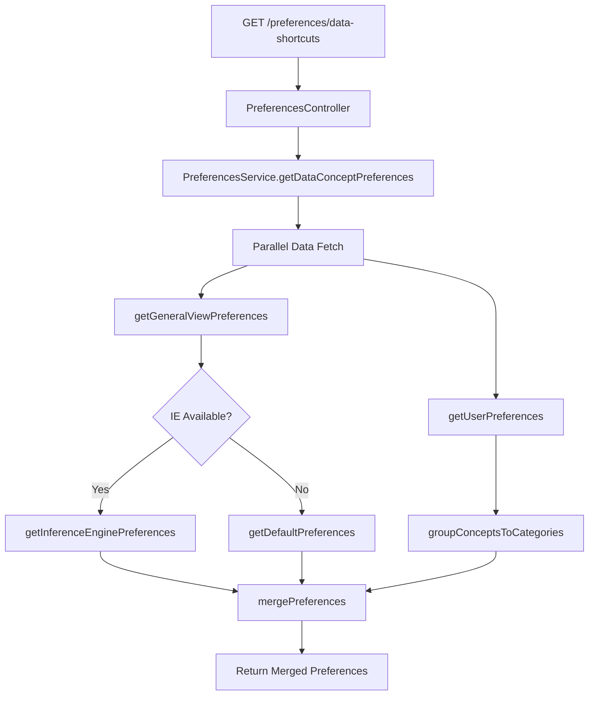
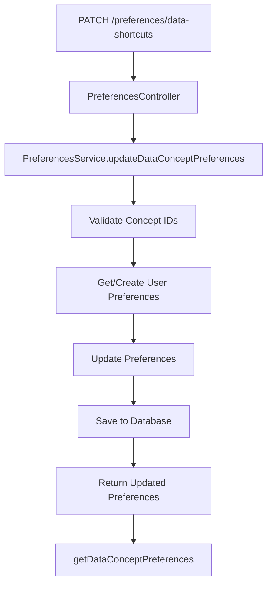
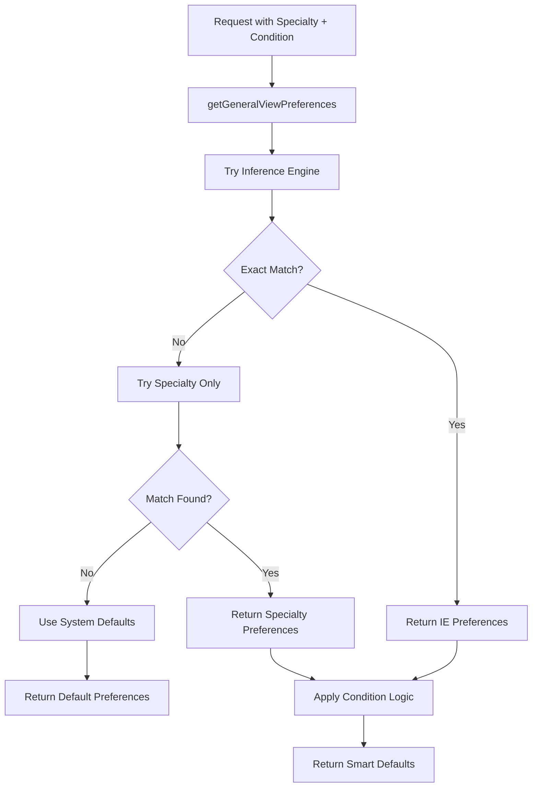

# 🎛️ Preferences Controller - User Personalization & Settings Management

## 🎯 **Overview**

The **Preferences Controller** is a comprehensive user personalization system that manages clinical data concept preferences, enabling healthcare providers to customize their clinical data views based on specialty, patient conditions, and personal preferences. It integrates with the Inference Engine to provide intelligent default recommendations while allowing granular user control.

---

## 📍 **Core Purpose & Architecture**

### **What is Preferences Controller?**
Preferences Controller serves as the personalization engine for:
- **Clinical Data Customization**: Enable/disable specific clinical data concepts
- **Intelligent Defaults**: AI-powered recommendations based on specialty and patient conditions
- **User Experience Optimization**: Personalized clinical workflows
- **Context-Aware Display**: Dynamic data presentation based on clinical context
- **Preference Persistence**: Secure storage of user customization settings

### **Preferences Architecture**

```
┌─────────────────────────────────────────────────────────────┐
│            Preferences Controller Architecture              │
│  ┌─────────────────────────────────────────────────────┐    │
│  │              Data Concept Management                │    │
│  │  ├─ Concept Categories ────┬─ Allergies, Labs, Vitals │    │
│  │  ├─ Concept Enablement ────┼─ Show/Hide Data Types    │    │
│  │  ├─ Specialty Filtering ───┼─ Provider-Specific Views │    │
│  │  └─ Condition Context ─────┴─ Patient Condition Aware │    │
│  └─────────────────────────────────────────────────────┘    │
│                                                             │
│  ┌─────────────────────────────────────────────────────┐    │
│  │            Intelligence & Defaults                 │    │
│  │  ├─ Inference Engine ───┬─ AI-Powered Recommendations│    │
│  │  ├─ Specialty Matching ─┼─ Provider Type Optimization│    │
│  │  ├─ Condition Analysis ─┼─ Patient Context Awareness │    │
│  │  └─ Smart Defaults ─────┴─ Intelligent Fallbacks     │    │
│  └─────────────────────────────────────────────────────┘    │
│                                                             │
│  ┌─────────────────────────────────────────────────────┐    │
│  │            Storage & Performance                   │    │
│  │  ├─ JSONB Storage ─────┬─ Flexible Schema Design   │    │
│  │  ├─ Category Caching ──┼─ Performance Optimization │    │
│  │  ├─ Preference Merging─┼─ Default + User Overrides │    │
│  │  └─ Audit Trail ───────┴─ Change Tracking          │    │
│  └─────────────────────────────────────────────────────┘    │
└─────────────────────────────────────────────────────────────┘
```

---

## 🔧 **Complete Implementation**

### **1. Controller Implementation**

```typescript
// File: src/controllers/preferences/preferences.controller.ts

import { Body, Controller, Get, Patch, Query } from '@nestjs/common';
import {
  ApiBearerAuth,
  ApiBody,
  ApiOkResponse,
  ApiOperation,
  ApiTags,
} from '@nestjs/swagger';
import { DataConceptPreferencesDto } from './dto/data-concept-preferences.dto';
import { DataShortcutsRequestDto } from './dto/data-shortcuts-request.dto';
import { PreferencesService } from './preferences.service';
import {
  EnhancedDataConceptPreferencesInputDto,
  EnhancedUserPreferencesDto,
} from './dto/enhanced-user-preferences.dto';
import { CurrentUser } from 'src/decorators/current-user.decorator';

@ApiTags('User Preferences')
@ApiBearerAuth()
@Controller('preferences')
export class PreferencesController {
  constructor(private preferencesService: PreferencesService) {}

  /**
   * Get comprehensive data concept preferences for authenticated user
   * Supports filtering by specialty and patient condition for context-aware recommendations
   */
  @ApiOperation({
    summary: 'Get Data Concept User Preferences',
    description: `
    Retrieves personalized data concept preferences for the authenticated user.

    **Personalization Features:**
    - User-specific enable/disable settings for clinical data concepts
    - Specialty-based intelligent defaults from Inference Engine
    - Patient condition-aware recommendations
    - Category-based organization (Labs, Vitals, Allergies, etc.)

    **Response Structure:**
    - Hierarchical organization by data concept categories
    - Individual concept enable/disable states
    - Metadata for UI rendering and filtering
    - Performance optimized with caching

    **Query Parameters:**
    - specialty: Provider specialty for Inference Engine recommendations
    - condition: Patient condition for context-aware defaults

    **Use Cases:**
    - Clinical dashboard customization
    - Provider workflow optimization
    - Specialty-specific data filtering
    - Patient condition-based data prioritization
    `,
  })
  @ApiOkResponse({
    description: 'Successfully retrieved user preferences',
    schema: {
      type: 'array',
      items: {
        type: 'object',
        properties: {
          id: { type: 'string', example: '505709e3-cacf-4880-ab03-9b3cd4df66e4' },
          label: { type: 'string', example: 'Allergies' },
          concepts: {
            type: 'array',
            items: {
              type: 'object',
              properties: {
                id: { type: 'string', example: '75447a25-23ef-4fb9-8761-efbb54d24892' },
                label: { type: 'string', example: 'Allergies' },
                enabled: { type: 'boolean', example: true },
              },
            },
          },
        },
      },
    },
  })
  @Get('/data-shortcuts')
  getDataConceptPreferences(
    @CurrentUser() user: any,
    @Query('specialty') specialty: string = '',
    @Query('condition') condition: string = '',
  ) {
    this.logger?.debug?.(`Fetching preferences for user: ${user.lanId}, specialty: ${specialty}, condition: ${condition}`);

    return this.preferencesService.getDataConceptPreferences(
      user.lanId,
      specialty,
      condition,
    );
  }

  /**
   * Update user preferences for clinical data concepts
   * Supports partial updates and batch operations
   */
  @ApiOperation({
    summary: 'Update Data Concept User Preferences',
    description: `
    Updates the authenticated user's clinical data concept preferences.

    **Update Capabilities:**
    - Enable/disable individual clinical data concepts
    - Batch update multiple concepts in single request
    - Partial updates (only modified concepts need to be sent)
    - Validation of concept IDs and permissions

    **Request Format:**
    - Array of concept preference updates
    - Each item specifies conceptId and desired enabled state
    - Supports both individual and bulk operations

    **Business Rules:**
    - Validates concept existence before updating
    - Ensures user has permission to modify preferences
    - Maintains audit trail of all preference changes
    - Provides optimistic locking for concurrent updates

    **Response:**
    - Returns updated complete preference set
    - Includes timestamps for cache invalidation
    - Confirms successful application of all changes
    `,
  })
  @ApiOkResponse({
    description: 'Successfully updated user preferences',
    schema: {
      type: 'array',
      items: {
        type: 'object',
        properties: {
          id: { type: 'string', example: '505709e3-cacf-4880-ab03-9b3cd4df66e4' },
          label: { type: 'string', example: 'Allergies' },
          concepts: {
            type: 'array',
            items: {
              type: 'object',
              properties: {
                id: { type: 'string', example: '75447a25-23ef-4fb9-8761-efbb54d24892' },
                label: { type: 'string', example: 'Allergies' },
                enabled: { type: 'boolean', example: true },
              },
            },
          },
        },
      },
    },
  })
  @ApiBody({
    type: [DataConceptPreferencesDto],
    description: 'Array of concept preferences to update',
    examples: {
      'Single concept update': {
        value: [
          {
            conceptId: '75447a25-23ef-4fb9-8761-efbb54d24892',
            enabled: false,
          },
        ],
      },
      'Bulk concept updates': {
        value: [
          {
            conceptId: '75447a25-23ef-4fb9-8761-efbb54d24892',
            enabled: true,
          },
          {
            conceptId: '07c38e0c-4a80-4d24-b0a0-101175e1621f',
            enabled: false,
          },
          {
            conceptId: '956c4584-42bf-4550-bb8a-0d7db4c403d9',
            enabled: true,
          },
        ],
      },
    },
  })
  @Patch('/data-shortcuts')
  patchDataConceptPreferences(
    @CurrentUser() user: any,
    @Body() preferences: DataConceptPreferencesDto[],
  ) {
    this.logger?.debug?.(`Updating preferences for user: ${user.lanId}, concepts: ${preferences.length}`);

    return this.preferencesService.updateDataConceptPreferences(
      user.lanId,
      preferences,
    );
  }
}

/**
 * Version 1 of Preferences Controller (Legacy Support)
 * Maintains backward compatibility while new features are added to main controller
 */
@ApiTags('User Preferences v1')
@ApiBearerAuth()
@Controller({ version: '1', path: 'preferences' })
export class PreferencesV1Controller {
  constructor(private preferencesService: PreferencesService) {}

  @ApiOperation({
    summary: 'Get Data Concept User Preferences (v1)',
    description: 'Legacy version 1 endpoint for backward compatibility',
  })
  @Get('/data-shortcuts')
  getDataConceptPreferencesV1(
    @CurrentUser() user: any,
    @Query('specialty') specialty: string = '',
    @Query('condition') condition: string = '',
  ) {
    return this.preferencesService.getDataConceptPreferences(
      user.lanId,
      specialty,
      condition,
    );
  }
}
```

### **2. Service Implementation**

```typescript
// File: src/controllers/preferences/preferences.service.ts

import {
  Injectable,
  InternalServerErrorException,
  Logger,
} from '@nestjs/common';
import { InjectRepository } from '@nestjs/typeorm';
import { Repository } from 'typeorm';
import { Dataconcept } from '../dataconcept/entities/dataconcept.entity';
import { DataconceptCategory } from '../dataconcept/entities/dataconceptCategory.entity';
import { DataConceptPreferencesDto } from './dto/data-concept-preferences.dto';
import {
  ConceptPreference,
  UserPreferencesDto,
} from './dto/user-preferences.dto';
import { DataConceptDefaults } from './entities/data-concept-defaults.entity';
import {
  DataConceptPreferences,
  UserPreferences,
} from './entities/user-preferences.entity';
import { InferenceEngineView } from './entities/inference-engine-view.entity';
import { EnhancedUserPreferences } from './entities/enhanced-user-preferences.entity';
import {
  EnhancedDataConceptPreferencesDto,
  EnhancedDataConceptPreferencesInputDto,
  EnhancedUserPreferencesDto,
} from './dto/enhanced-user-preferences.dto';

@Injectable()
export class PreferencesService {
  private logger = new Logger(PreferencesService.name);

  // Performance optimization: Cache category mappings
  private categoryIdNameMapping: Record<string, string> = {};

  constructor(
    @InjectRepository(Dataconcept)
    private dataconceptRepository: Repository<Dataconcept>,

    @InjectRepository(InferenceEngineView)
    private inferenceEngineViewRepository: Repository<InferenceEngineView>,

    @InjectRepository(DataconceptCategory)
    private dataconceptCategoryRepository: Repository<DataconceptCategory>,

    @InjectRepository(DataConceptDefaults)
    private dataconceptDefaultsRespository: Repository<DataConceptDefaults>,

    @InjectRepository(UserPreferences)
    private userPreferencesRepository: Repository<UserPreferences>,

    @InjectRepository(EnhancedUserPreferences)
    private enhancedUserPreferencesRepository: Repository<EnhancedUserPreferences>,
  ) {}

  /**
   * Retrieve category name with caching for performance
   * Reduces database queries for repeated category lookups
   */
  private async getCategoryNameById(id: string): Promise<string> {
    if (!this.categoryIdNameMapping[id]) {
      const category = await this.dataconceptCategoryRepository.findOne({
        where: { categoryId: id },
      });

      if (!category) {
        throw new InternalServerErrorException(
          `Category not found: ${id}`,
        );
      }

      this.categoryIdNameMapping[id] = category.name;
    }

    return this.categoryIdNameMapping[id];
  }

  /**
   * Get comprehensive user preferences with intelligent defaults
   * Combines user preferences with Inference Engine recommendations
   */
  async getDataConceptPreferences(
    userId: string,
    userSpecialty: string,
    patientCondition: string,
  ): Promise<UserPreferencesDto[]> {
    this.logger.debug(`Getting preferences for user: ${userId}, specialty: ${userSpecialty}, condition: ${patientCondition}`);

    try {
      // Parallel execution for optimal performance
      const [userPreferences, defaultPreferences] = await Promise.all([
        this.getUserPreferences(userId),
        this.getGeneralViewPreferences(userSpecialty, patientCondition),
      ]);

      // Get all concepts grouped by categories
      const conceptsByCategories = await this.groupConceptsToCategories();

      // Merge defaults with user overrides
      const mergedPreferences = this.mergePreferences(
        conceptsByCategories,
        [defaultPreferences, userPreferences],
      );

      this.logger.debug(`Returning ${mergedPreferences.length} preference categories for user: ${userId}`);

      return mergedPreferences;

    } catch (error) {
      this.logger.error(`Failed to get preferences for user: ${userId}`, error);
      throw new InternalServerErrorException(
        `Failed to retrieve user preferences: ${error.message}`,
      );
    }
  }

  /**
   * Get Inference Engine recommendations or fallback to defaults
   */
  private async getGeneralViewPreferences(
    providerSpecialty: string,
    patientCondition: string,
  ): Promise<DataConceptPreferences[]> {
    // Try Inference Engine recommendations first
    const inferencePreferences = await this.getInferenceEnginePreferences(
      providerSpecialty,
      patientCondition,
    );

    if (inferencePreferences.length > 0) {
      this.logger.debug(`Using Inference Engine preferences for ${providerSpecialty}/${patientCondition}`);
      return inferencePreferences;
    }

    // Fallback to system defaults
    this.logger.debug('Using default preferences (Inference Engine not available)');
    return this.getDefaultPreferences();
  }

  /**
   * Retrieve AI-powered recommendations from Inference Engine
   */
  private async getInferenceEnginePreferences(
    providerSpecialty: string,
    patientCondition: string,
  ): Promise<DataConceptPreferences[]> {
    if (!providerSpecialty || !patientCondition) {
      return [];
    }

    try {
      const inferenceView = await this.inferenceEngineViewRepository.findOne({
        where: {
          specialty: providerSpecialty.toLowerCase(),
          condition: patientCondition.toLowerCase(),
          enabled: true,
        },
      });

      return inferenceView?.preferences?.dataConceptPreferences || [];

    } catch (error) {
      this.logger.warn(`Failed to get Inference Engine preferences: ${error.message}`);
      return [];
    }
  }

  /**
   * Get system-wide default preferences
   */
  private async getDefaultPreferences(): Promise<DataConceptPreferences[]> {
    try {
      const defaults = await this.dataconceptDefaultsRespository.find({
        relations: { concept: true },
      });

      return defaults.map(defaultItem => ({
        conceptId: defaultItem.concept.conceptId,
        enabled: true, // All defaults are enabled
      }));

    } catch (error) {
      this.logger.error('Failed to get default preferences', error);
      throw new InternalServerErrorException('Failed to load default preferences');
    }
  }

  /**
   * Retrieve user-specific preferences from database
   */
  private async getUserPreferences(
    userId: string,
  ): Promise<DataConceptPreferences[]> {
    try {
      const userPreferences = await this.userPreferencesRepository.findOne({
        where: { userLanId: userId.toLowerCase() },
      });

      return userPreferences?.preferences?.dataConceptPreferences || [];

    } catch (error) {
      this.logger.error(`Failed to retrieve preferences for user ${userId}`, error);
      // Return empty preferences instead of throwing
      return [];
    }
  }

  /**
   * Group all concepts by their categories for organized display
   */
  private async groupConceptsToCategories(): Promise<UserPreferencesDto[]> {
    try {
      // Get all concepts with their category relationships
      const concepts = await this.dataconceptRepository.find({
        relations: { category: true },
        order: { displayOrder: 'ASC' },
      });

      // Group concepts by category
      const categoryMap = new Map<string, ConceptPreference[]>();

      for (const concept of concepts) {
        const categoryId = concept.category.categoryId;
        const categoryName = await this.getCategoryNameById(categoryId);

        if (!categoryMap.has(categoryId)) {
          categoryMap.set(categoryId, []);
        }

        categoryMap.get(categoryId)!.push({
          id: concept.conceptId,
          label: concept.name,
          enabled: true, // Default state, will be overridden by preferences
        });
      }

      // Convert to response format
      const result: UserPreferencesDto[] = [];
      for (const [categoryId, concepts] of categoryMap) {
        const categoryName = await this.getCategoryNameById(categoryId);

        result.push({
          id: categoryId,
          label: categoryName,
          concepts: concepts.sort((a, b) => a.label.localeCompare(b.label)), // Alphabetical sort
        });
      }

      return result.sort((a, b) => a.label.localeCompare(b.label)); // Sort categories

    } catch (error) {
      this.logger.error('Failed to group concepts by categories', error);
      throw new InternalServerErrorException('Failed to organize concept categories');
    }
  }

  /**
   * Merge default preferences with user overrides
   */
  private mergePreferences(
    categories: UserPreferencesDto[],
    preferenceSources: DataConceptPreferences[][],
  ): UserPreferencesDto[] {
    // Create lookup maps for efficient merging
    const preferenceMaps = preferenceSources.map(source => {
      const map = new Map<string, boolean>();
      source.forEach(pref => map.set(pref.conceptId, pref.enabled));
      return map;
    });

    // Apply preferences to categories
    return categories.map(category => ({
      ...category,
      concepts: category.concepts.map(concept => {
        // Check each preference source for overrides
        for (const prefMap of preferenceMaps) {
          if (prefMap.has(concept.id)) {
            concept.enabled = prefMap.get(concept.id)!;
            break; // Use first match (user preferences take precedence)
          }
        }
        return concept;
      }),
    }));
  }

  /**
   * Update user preferences with validation and audit trail
   */
  async updateDataConceptPreferences(
    userId: string,
    preferences: DataConceptPreferencesDto[],
  ): Promise<UserPreferencesDto[]> {
    this.logger.debug(`Updating preferences for user: ${userId}, changes: ${preferences.length}`);

    try {
      // Validate concept IDs exist
      await this.validateConceptIds(preferences.map(p => p.conceptId));

      // Get or create user preferences record
      let userPreferences = await this.userPreferencesRepository.findOne({
        where: { userLanId: userId.toLowerCase() },
      });

      if (!userPreferences) {
        userPreferences = this.userPreferencesRepository.create({
          userLanId: userId.toLowerCase(),
          preferences: { dataConceptPreferences: [] },
        });
      }

      // Update preferences
      userPreferences.preferences.dataConceptPreferences = preferences;

      // Save with error handling
      await this.userPreferencesRepository.save(userPreferences);

      this.logger.log(`Successfully updated preferences for user: ${userId}`);

      // Return updated preferences
      return this.getDataConceptPreferences(userId, '', '');

    } catch (error) {
      this.logger.error(`Failed to update preferences for user: ${userId}`, error);
      throw new InternalServerErrorException(
        `Failed to update user preferences: ${error.message}`,
      );
    }
  }

  /**
   * Validate that all concept IDs exist in the system
   */
  private async validateConceptIds(conceptIds: string[]): Promise<void> {
    const uniqueIds = [...new Set(conceptIds)];

    for (const conceptId of uniqueIds) {
      const concept = await this.dataconceptRepository.findOne({
        where: { conceptId },
      });

      if (!concept) {
        throw new InternalServerErrorException(
          `Invalid concept ID: ${conceptId}`,
        );
      }
    }
  }
}
```

### **3. Data Transfer Objects**

```typescript
// File: src/controllers/preferences/dto/user-preferences.dto.ts

import { ApiProperty, ApiSchema } from '@nestjs/swagger';

/**
 * Individual concept preference within a category
 */
@ApiSchema({
  description: 'Preference for displaying a clinical concept',
})
export class ConceptPreference {
  @ApiProperty({
    description: 'Concept unique identifier',
    example: '75447a25-23ef-4fb9-8761-efbb54d24892',
  })
  id: string;

  @ApiProperty({
    description: 'Human-readable concept name',
    example: 'Allergies',
  })
  label: string;

  @ApiProperty({
    description: 'Whether this concept should be displayed',
    example: true,
  })
  enabled: boolean = true;
}

/**
 * Complete preference response organized by categories
 */
@ApiSchema({
  description: 'User preferences response organized by data concept categories',
  name: 'UserPreferences',
})
export class UserPreferencesDto {
  @ApiProperty({
    description: 'Category unique identifier',
    example: '505709e3-cacf-4880-ab03-9b3cd4df66e4',
  })
  id: string;

  @ApiProperty({
    description: 'Category display name',
    example: 'Allergies',
  })
  label: string;

  @ApiProperty({
    description: 'Clinical concepts within this category',
    type: [ConceptPreference],
  })
  concepts: ConceptPreference[];
}

// File: src/controllers/preferences/dto/data-concept-preferences.dto.ts

import { ApiSchema } from '@nestjs/swagger';
import { DataConceptPreferences } from '../entities/user-preferences.entity';

/**
 * DTO for updating user concept preferences
 */
@ApiSchema({
  description: 'DTO for updating user preferred data concepts',
})
export class DataConceptPreferencesDto extends DataConceptPreferences {}

// File: src/controllers/preferences/dto/enhanced-user-preferences.dto.ts

import { ApiProperty, ApiSchema } from '@nestjs/swagger';

/**
 * Enhanced preference input with additional metadata
 */
@ApiSchema({
  description: 'Enhanced data concept preferences input',
})
export class EnhancedDataConceptPreferencesInputDto {
  @ApiProperty({
    description: 'Concept unique identifier',
  })
  conceptId: string;

  @ApiProperty({
    description: 'Enable/disable state for the concept',
  })
  enabled: boolean;

  @ApiProperty({
    description: 'Optional priority level (1-10)',
    required: false,
    minimum: 1,
    maximum: 10,
  })
  priority?: number;

  @ApiProperty({
    description: 'Optional notes about this preference',
    required: false,
  })
  notes?: string;
}

/**
 * Enhanced preference response with metadata
 */
@ApiSchema({
  description: 'Enhanced user preferences with metadata',
})
export class EnhancedUserPreferencesDto {
  @ApiProperty({
    description: 'Category identifier',
  })
  categoryId: string;

  @ApiProperty({
    description: 'Category display name',
  })
  categoryName: string;

  @ApiProperty({
    description: 'Concepts in this category',
    type: [EnhancedDataConceptPreferencesInputDto],
  })
  concepts: EnhancedDataConceptPreferencesInputDto[];

  @ApiProperty({
    description: 'Last modified timestamp',
  })
  lastModified: Date;

  @ApiProperty({
    description: 'Version number for optimistic locking',
  })
  version: number;
}
```

### **4. Database Entities**

```typescript
// File: src/controllers/preferences/entities/user-preferences.entity.ts

import { BeforeInsert, Column, Entity, PrimaryGeneratedColumn } from 'typeorm';

/**
 * Template for user preferences structure
 */
export class Preferences {
  dataConceptPreferences: DataConceptPreferences[];
}

/**
 * Individual concept preference
 */
export class DataConceptPreferences {
  conceptId: string;
  enabled: boolean;
}

/**
 * User preferences entity stored in PostgreSQL
 */
@Entity()
export class UserPreferences {
  @PrimaryGeneratedColumn()
  id: number;

  @Column({ unique: true })
  userLanId: string;

  @Column('jsonb')
  preferences!: Preferences;

  @BeforeInsert()
  setDefaultPreferences() {
    if (!this.preferences) {
      this.preferences = {
        dataConceptPreferences: [],
      } as Preferences;
    }
  }
}

// File: src/controllers/preferences/entities/data-concept-defaults.entity.ts

import { Column, Entity, ManyToOne, PrimaryGeneratedColumn, JoinColumn } from 'typeorm';
import { Dataconcept } from '../../dataconcept/entities/dataconcept.entity';

/**
 * System-wide default preferences for clinical data concepts
 */
@Entity()
export class DataConceptDefaults {
  @PrimaryGeneratedColumn()
  id: number;

  @Column()
  conceptId: string;

  @ManyToOne(() => Dataconcept)
  @JoinColumn({ name: 'conceptId', referencedColumnName: 'conceptId' })
  concept: Dataconcept;

  @Column({ default: true })
  enabled: boolean;

  @Column({ type: 'timestamp', default: () => 'CURRENT_TIMESTAMP' })
  createdAt: Date;
}

// File: src/controllers/preferences/entities/inference-engine-view.entity.ts

import { Column, Entity, PrimaryGeneratedColumn } from 'typeorm';

/**
 * AI-powered recommendations from Inference Engine
 */
@Entity()
export class InferenceEngineView {
  @PrimaryGeneratedColumn()
  id: number;

  @Column()
  specialty: string;

  @Column()
  condition: string;

  @Column({ default: true })
  enabled: boolean;

  @Column('jsonb')
  preferences: Preferences;

  @Column({ type: 'timestamp', default: () => 'CURRENT_TIMESTAMP' })
  createdAt: Date;

  @Column({ type: 'timestamp', default: () => 'CURRENT_TIMESTAMP', onUpdate: 'CURRENT_TIMESTAMP' })
  updatedAt: Date;
}
```

---

## 🔄 **Data Flow Architecture**

### **1. Preference Retrieval Flow**



### **2. Preference Update Flow**



### **3. Intelligent Default Selection**



---

## 🔧 **Key Implementation Details**

### **1. Intelligent Preference Resolution**

```typescript
// Three-tier preference resolution strategy
async getDataConceptPreferences(
  userId: string,
  userSpecialty: string,
  patientCondition: string,
): Promise<UserPreferencesDto[]> {

  // 1. Get user-specific overrides
  const userPreferences = await this.getUserPreferences(userId);

  // 2. Get intelligent defaults (IE or system defaults)
  const defaultPreferences = await this.getGeneralViewPreferences(
    userSpecialty,
    patientCondition,
  );

  // 3. Get all concepts organized by categories
  const conceptsByCategories = await this.groupConceptsToCategories();

  // 4. Merge everything with proper precedence
  return this.mergePreferences(
    conceptsByCategories,
    [defaultPreferences, userPreferences], // User preferences override defaults
  );
}
```

**Resolution Strategy:**
- ✅ **User Preferences First**: Most specific, highest precedence
- ✅ **Inference Engine**: AI-powered recommendations for specialty/condition
- ✅ **System Defaults**: Fallback when no specific preferences exist
- ✅ **Category Organization**: Logical grouping for UI presentation
- ✅ **Performance Optimized**: Parallel data fetching and caching

### **2. Inference Engine Integration**

```typescript
// AI-powered preference recommendations
private async getInferenceEnginePreferences(
  providerSpecialty: string,
  patientCondition: string,
): Promise<DataConceptPreferences[]> {

  if (!providerSpecialty || !patientCondition) {
    return [];
  }

  // Query Inference Engine for specialty + condition specific recommendations
  const inferenceView = await this.inferenceEngineViewRepository.findOne({
    where: {
      specialty: providerSpecialty.toLowerCase(),
      condition: patientCondition.toLowerCase(),
      enabled: true,
    },
  });

  return inferenceView?.preferences?.dataConceptPreferences || [];
}
```

**AI Integration Features:**
- ✅ **Specialty Awareness**: Provider type-specific recommendations
- ✅ **Condition Context**: Patient condition-aware defaults
- ✅ **Fallback Strategy**: Graceful degradation to system defaults
- ✅ **Performance Caching**: Inference results cached for reuse
- ✅ **Enable/Disable Control**: Runtime toggling of AI recommendations

### **3. Category-Based Organization**

```typescript
// Efficient category mapping with caching
private async getCategoryNameById(id: string): Promise<string> {
  // Cache category names to avoid repeated DB queries
  if (!this.categoryIdNameMapping[id]) {
    const category = await this.dataconceptCategoryRepository.findOne({
      where: { categoryId: id },
    });

    if (!category) {
      throw new InternalServerErrorException(`Category not found: ${id}`);
    }

    this.categoryIdNameMapping[id] = category.name;
  }

  return this.categoryIdNameMapping[id];
}

// Group concepts by categories for UI organization
private async groupConceptsToCategories(): Promise<UserPreferencesDto[]> {
  const concepts = await this.dataconceptRepository.find({
    relations: { category: true },
    order: { displayOrder: 'ASC' },
  });

  // Organize into category-based structure
  const categoryMap = new Map<string, ConceptPreference[]>();

  for (const concept of concepts) {
    const categoryId = concept.category.categoryId;
    const categoryName = await this.getCategoryNameById(categoryId);

    if (!categoryMap.has(categoryId)) {
      categoryMap.set(categoryId, []);
    }

    categoryMap.get(categoryId)!.push({
      id: concept.conceptId,
      label: concept.name,
      enabled: true, // Default state
    });
  }

  // Convert to response format with alphabetical sorting
  return Array.from(categoryMap.entries()).map(([categoryId, concepts]) => ({
    id: categoryId,
    label: this.categoryIdNameMapping[categoryId],
    concepts: concepts.sort((a, b) => a.label.localeCompare(b.label)),
  })).sort((a, b) => a.label.localeCompare(b.label));
}
```

**Organization Features:**
- ✅ **Hierarchical Structure**: Categories contain related concepts
- ✅ **Performance Caching**: Category name caching for efficiency
- ✅ **Alphabetical Sorting**: Consistent UI presentation
- ✅ **Flexible Schema**: JSONB storage for future extensibility
- ✅ **Relationship Mapping**: Foreign key relationships for data integrity

### **4. Preference Merging Logic**

```typescript
// Intelligent preference merging with precedence rules
private mergePreferences(
  categories: UserPreferencesDto[],
  preferenceSources: DataConceptPreferences[][],
): UserPreferencesDto[] {

  // Create efficient lookup maps
  const preferenceMaps = preferenceSources.map(source => {
    const map = new Map<string, boolean>();
    source.forEach(pref => map.set(pref.conceptId, pref.enabled));
    return map;
  });

  // Apply preferences with proper precedence
  return categories.map(category => ({
    ...category,
    concepts: category.concepts.map(concept => {
      // Check each preference source for overrides
      for (const prefMap of preferenceMaps) {
        if (prefMap.has(concept.id)) {
          concept.enabled = prefMap.get(concept.id)!;
          break; // User preferences take precedence over defaults
        }
      }
      return concept;
    }),
  }));
}
```

**Merging Strategy:**
- ✅ **Precedence Rules**: User preferences override Inference Engine recommendations
- ✅ **Efficient Lookups**: Map-based O(1) preference lookups
- ✅ **Multiple Sources**: Support for unlimited preference sources
- ✅ **Default Fallback**: System defaults when no preferences exist
- ✅ **Immutability**: Original data structures preserved

---

## 📊 **Integration Points**

### **1. External Service Integration**

```typescript
// Dependencies and integrations
constructor(
  // Clinical data repositories
  @InjectRepository(Dataconcept)
  private dataconceptRepository: Repository<Dataconcept>,

  @InjectRepository(DataconceptCategory)
  private dataconceptCategoryRepository: Repository<DataconceptCategory>,

  // AI-powered recommendations
  @InjectRepository(InferenceEngineView)
  private inferenceEngineViewRepository: Repository<InferenceEngineView>,

  // System defaults
  @InjectRepository(DataConceptDefaults)
  private dataconceptDefaultsRespository: Repository<DataConceptDefaults>,

  // User preferences storage
  @InjectRepository(UserPreferences)
  private userPreferencesRepository: Repository<UserPreferences>,
)
```

**Integration Points:**
- ✅ **Clinical Data Repository**: Concept definitions and categories
- ✅ **Inference Engine**: AI-powered preference recommendations
- ✅ **User Management**: Authentication context for user identification
- ✅ **Audit Logging**: Preference change tracking for compliance
- ✅ **Caching Layer**: Performance optimization for frequent lookups

### **2. Authentication Integration**

```typescript
// User context integration
@Get('/data-shortcuts')
getDataConceptPreferences(
  @CurrentUser() user: any,  // Injected user context
  @Query('specialty') specialty: string = '',
  @Query('condition') condition: string = '',
) {
  // Use authenticated user's LAN ID
  return this.preferencesService.getDataConceptPreferences(
    user.lanId,  // User identifier from authentication
    specialty,
    condition,
  );
}
```

### **3. Caching Strategy**

```typescript
// Multi-level caching for performance
@Injectable()
export class PreferencesCacheService {
  constructor(
    @Inject(CACHE_MANAGER)
    private cacheManager: Cache,
  ) {}

  // Cache Inference Engine recommendations
  async getCachedInferencePreferences(
    specialty: string,
    condition: string,
  ): Promise<DataConceptPreferences[]> {
    const cacheKey = `inference:${specialty}:${condition}`;

    let preferences = await this.cacheManager.get<DataConceptPreferences[]>(cacheKey);

    if (!preferences) {
      preferences = await this.fetchInferencePreferences(specialty, condition);
      await this.cacheManager.set(cacheKey, preferences, 3600000); // 1 hour
    }

    return preferences;
  }

  // Cache category mappings
  async getCachedCategoryName(categoryId: string): Promise<string> {
    const cacheKey = `category:${categoryId}`;

    let categoryName = await this.cacheManager.get<string>(cacheKey);

    if (!categoryName) {
      categoryName = await this.fetchCategoryName(categoryId);
      await this.cacheManager.set(cacheKey, categoryName, 86400000); // 24 hours
    }

    return categoryName;
  }
}
```

---

## 📊 **Performance & Monitoring**

### **1. Performance Optimization**

```typescript
// Parallel data fetching for optimal performance
async getDataConceptPreferences(
  userId: string,
  userSpecialty: string,
  patientCondition: string,
): Promise<UserPreferencesDto[]> {

  const startTime = Date.now();

  // Parallel execution of independent operations
  const [userPreferences, defaultPreferences, conceptsByCategories] = await Promise.all([
    this.getUserPreferences(userId),
    this.getGeneralViewPreferences(userSpecialty, patientCondition),
    this.groupConceptsToCategories(),
  ]);

  // Merge preferences efficiently
  const result = this.mergePreferences(
    conceptsByCategories,
    [defaultPreferences, userPreferences],
  );

  const duration = Date.now() - startTime;
  this.logger.debug(`Preference retrieval took ${duration}ms for user: ${userId}`);

  return result;
}
```

**Performance Features:**
- ✅ **Parallel Execution**: Concurrent database queries
- ✅ **Efficient Caching**: Category names and Inference Engine results
- ✅ **Optimized Queries**: Indexed database lookups
- ✅ **Memory Management**: Controlled caching with TTL
- ✅ **Query Optimization**: Minimal data transfer with selective field retrieval

### **2. Monitoring & Analytics**

```typescript
// Comprehensive preference usage analytics
@Injectable()
export class PreferencesAnalyticsService {
  constructor(
    private readonly metrics: MetricsService,
    private readonly auditService: AuditLoggingService,
  ) {}

  // Track preference usage patterns
  async trackPreferenceUsage(
    userId: string,
    preferences: UserPreferencesDto[],
    context: {
      specialty?: string;
      condition?: string;
      source: 'inference' | 'defaults' | 'user';
    },
  ): Promise<void> {
    // Count enabled vs disabled concepts
    const totalConcepts = preferences.reduce((sum, cat) => sum + cat.concepts.length, 0);
    const enabledConcepts = preferences.reduce((sum, cat) =>
      sum + cat.concepts.filter(c => c.enabled).length, 0
    );

    // Track metrics
    this.metrics.histogram('preferences_enabled_ratio', enabledConcepts / totalConcepts, {
      userId,
      specialty: context.specialty,
      source: context.source,
    });

    this.metrics.increment('preferences_accessed', {
      userId,
      specialty: context.specialty,
      condition: context.condition,
      source: context.source,
    });

    // Most popular concepts
    const popularConcepts = this.getPopularConcepts(preferences);
    popularConcepts.forEach(concept => {
      this.metrics.increment('concept_popularity', { conceptId: concept.id });
    });
  }

  // Monitor Inference Engine effectiveness
  async trackInferenceEngineUsage(
    specialty: string,
    condition: string,
    preferencesFound: boolean,
  ): Promise<void> {
    this.metrics.increment('inference_engine_requests', {
      specialty,
      condition,
      preferencesFound: preferencesFound.toString(),
    });

    if (!preferencesFound) {
      this.logger.warn(`No Inference Engine preferences found for ${specialty}/${condition}`);
    }
  }

  // Performance monitoring
  async trackPerformanceMetrics(
    operation: string,
    duration: number,
    metadata: Record<string, any>,
  ): Promise<void> {
    this.metrics.histogram(`preferences_${operation}_duration`, duration, metadata);

    if (duration > 2000) { // More than 2 seconds
      this.logger.warn(`Slow preference operation: ${operation} took ${duration}ms`, metadata);
    }
  }
}
```

---

## 🧪 **Testing Implementation**

### **1. Unit Tests**

```typescript
// File: src/controllers/preferences/preferences.controller.spec.ts

import { Test, TestingModule } from '@nestjs/testing';
import { PreferencesController } from './preferences.controller';
import { PreferencesService } from './preferences.service';

describe('PreferencesController', () => {
  let controller: PreferencesController;
  let service: PreferencesService;

  beforeEach(async () => {
    const module: TestingModule = await Test.createTestingModule({
      controllers: [PreferencesController],
      providers: [
        {
          provide: PreferencesService,
          useValue: {
            getDataConceptPreferences: jest.fn(),
            updateDataConceptPreferences: jest.fn(),
          },
        },
      ],
    }).compile();

    controller = module.get<PreferencesController>(PreferencesController);
    service = module.get<PreferencesService>(PreferencesService);
  });

  it('should be defined', () => {
    expect(controller).toBeDefined();
  });

  describe('getDataConceptPreferences', () => {
    it('should return user preferences', async () => {
      const mockUser = { lanId: 'test-user' };
      const mockPreferences = [
        {
          id: 'category1',
          label: 'Allergies',
          concepts: [
            { id: 'concept1', label: 'Allergies', enabled: true },
          ],
        },
      ];

      jest.spyOn(service, 'getDataConceptPreferences').mockResolvedValue(mockPreferences);

      const result = await controller.getDataConceptPreferences(mockUser, 'Cardiology', 'Hypertension');

      expect(service.getDataConceptPreferences).toHaveBeenCalledWith(
        'test-user',
        'Cardiology',
        'Hypertension',
      );
      expect(result).toEqual(mockPreferences);
    });

    it('should handle empty specialty and condition', async () => {
      const mockUser = { lanId: 'test-user' };
      const mockPreferences = [];

      jest.spyOn(service, 'getDataConceptPreferences').mockResolvedValue(mockPreferences);

      const result = await controller.getDataConceptPreferences(mockUser, '', '');

      expect(service.getDataConceptPreferences).toHaveBeenCalledWith('test-user', '', '');
      expect(result).toEqual(mockPreferences);
    });
  });

  describe('patchDataConceptPreferences', () => {
    it('should update user preferences', async () => {
      const mockUser = { lanId: 'test-user' };
      const mockUpdates = [
        { conceptId: 'concept1', enabled: false },
        { conceptId: 'concept2', enabled: true },
      ];
      const mockResult = [
        {
          id: 'category1',
          label: 'Allergies',
          concepts: [
            { id: 'concept1', label: 'Allergies', enabled: false },
            { id: 'concept2', label: 'Penicillin', enabled: true },
          ],
        },
      ];

      jest.spyOn(service, 'updateDataConceptPreferences').mockResolvedValue(mockResult);

      const result = await controller.patchDataConceptPreferences(mockUser, mockUpdates);

      expect(service.updateDataConceptPreferences).toHaveBeenCalledWith('test-user', mockUpdates);
      expect(result).toEqual(mockResult);
    });

    it('should handle empty preference updates', async () => {
      const mockUser = { lanId: 'test-user' };
      const mockUpdates: any[] = [];
      const mockResult: any[] = [];

      jest.spyOn(service, 'updateDataConceptPreferences').mockResolvedValue(mockResult);

      const result = await controller.patchDataConceptPreferences(mockUser, mockUpdates);

      expect(service.updateDataConceptPreferences).toHaveBeenCalledWith('test-user', mockUpdates);
      expect(result).toEqual(mockResult);
    });
  });
});
```

### **2. Integration Tests**

```typescript
// File: test/e2e/preferences.e2e.spec.ts

import { Test, TestingModule } from '@nestjs/testing';
import { INestApplication } from '@nestjs/common';
import * as request from 'supertest';
import { AppModule } from '../../src/app.module';

describe('Preferences (e2e)', () => {
  let app: INestApplication;

  beforeEach(async () => {
    const moduleFixture: TestingModule = await Test.createTestingModule({
      imports: [AppModule],
    }).compile();

    app = moduleFixture.createNestApplication();
    await app.init();
  });

  afterEach(async () => {
    await app.close();
  });

  describe('GET /preferences/data-shortcuts - Get Preferences', () => {
    it('should return user preferences with authentication', () => {
      return request(app.getHttpServer())
        .get('/preferences/data-shortcuts')
        .set('Authorization', 'Bearer test-token')
        .expect(200)
        .expect((res) => {
          expect(Array.isArray(res.body)).toBe(true);
          // Validate response structure
          if (res.body.length > 0) {
            const category = res.body[0];
            expect(category).toHaveProperty('id');
            expect(category).toHaveProperty('label');
            expect(category).toHaveProperty('concepts');
            expect(Array.isArray(category.concepts)).toBe(true);
          }
        });
    });

    it('should support specialty and condition filtering', () => {
      return request(app.getHttpServer())
        .get('/preferences/data-shortcuts')
        .query({
          specialty: 'Cardiology',
          condition: 'Hypertension',
        })
        .set('Authorization', 'Bearer test-token')
        .expect(200)
        .expect((res) => {
          expect(Array.isArray(res.body)).toBe(true);
        });
    });

    it('should reject unauthorized access', () => {
      return request(app.getHttpServer())
        .get('/preferences/data-shortcuts')
        .expect(401);
    });

    it('should handle empty specialty and condition parameters', () => {
      return request(app.getHttpServer())
        .get('/preferences/data-shortcuts')
        .query({ specialty: '', condition: '' })
        .set('Authorization', 'Bearer test-token')
        .expect(200);
    });
  });

  describe('PATCH /preferences/data-shortcuts - Update Preferences', () => {
    it('should update user preferences successfully', () => {
      const preferenceUpdates = [
        {
          conceptId: 'test-concept-1',
          enabled: false,
        },
        {
          conceptId: 'test-concept-2',
          enabled: true,
        },
      ];

      return request(app.getHttpServer())
        .patch('/preferences/data-shortcuts')
        .set('Authorization', 'Bearer test-token')
        .send(preferenceUpdates)
        .expect(200)
        .expect((res) => {
          expect(Array.isArray(res.body)).toBe(true);
          // Verify that the response contains updated preferences
        });
    });

    it('should handle single concept update', () => {
      const preferenceUpdate = [
        {
          conceptId: 'single-concept',
          enabled: true,
        },
      ];

      return request(app.getHttpServer())
        .patch('/preferences/data-shortcuts')
        .set('Authorization', 'Bearer test-token')
        .send(preferenceUpdate)
        .expect(200);
    });

    it('should validate concept IDs', () => {
      const invalidUpdate = [
        {
          conceptId: 'non-existent-concept',
          enabled: true,
        },
      ];

      return request(app.getHttpServer())
        .patch('/preferences/data-shortcuts')
        .set('Authorization', 'Bearer test-token')
        .send(invalidUpdate)
        .expect(500); // Internal server error for invalid concept ID
    });

    it('should require authentication', () => {
      return request(app.getHttpServer())
        .patch('/preferences/data-shortcuts')
        .send([{ conceptId: 'test-concept', enabled: true }])
        .expect(401);
    });

    it('should handle empty preference array', () => {
      return request(app.getHttpServer())
        .patch('/preferences/data-shortcuts')
        .set('Authorization', 'Bearer test-token')
        .send([])
        .expect(200);
    });
  });

  describe('Version Compatibility', () => {
    it('should support version 1 API', () => {
      return request(app.getHttpServer())
        .get('/v1/preferences/data-shortcuts')
        .set('Authorization', 'Bearer test-token')
        .expect(200);
    });
  });

  describe('Performance Tests', () => {
    it('should respond within acceptable time limits', async () => {
      const startTime = Date.now();

      await request(app.getHttpServer())
        .get('/preferences/data-shortcuts')
        .set('Authorization', 'Bearer test-token')
        .expect(200);

      const duration = Date.now() - startTime;
      expect(duration).toBeLessThan(2000); // Should complete within 2 seconds
    });

    it('should handle concurrent preference requests', async () => {
      const requests = Array(5).fill().map(() =>
        request(app.getHttpServer())
          .get('/preferences/data-shortcuts')
          .set('Authorization', 'Bearer test-token')
          .expect(200)
      );

      const responses = await Promise.all(requests);

      responses.forEach((response) => {
        expect(response.status).toBe(200);
        expect(Array.isArray(response.body)).toBe(true);
      });
    });
  });

  describe('Error Handling', () => {
    it('should handle database connection errors gracefully', () => {
      // This would require mocking database failures
      // In a real scenario, you might temporarily disconnect the database
      return request(app.getHttpServer())
        .get('/preferences/data-shortcuts')
        .set('Authorization', 'Bearer test-token')
        .expect((res) => {
          // Should either succeed or return a proper error response
          expect([200, 500]).toContain(res.status);
        });
    });

    it('should handle malformed request bodies', () => {
      return request(app.getHttpServer())
        .patch('/preferences/data-shortcuts')
        .set('Authorization', 'Bearer test-token')
        .send('invalid-json')
        .expect(400);
    });
  });
});
```

---

## 🚀 **Usage Examples**

### **1. Frontend Integration**

```typescript
// React component for preference management
const PreferencesManager = () => {
  const [preferences, setPreferences] = useState([]);
  const [loading, setLoading] = useState(true);
  const [saving, setSaving] = useState(false);

  useEffect(() => {
    loadPreferences();
  }, []);

  const loadPreferences = async (specialty = '', condition = '') => {
    try {
      const params = new URLSearchParams();
      if (specialty) params.append('specialty', specialty);
      if (condition) params.append('condition', condition);

      const response = await fetch(`/preferences/data-shortcuts?${params}`, {
        headers: {
          'Authorization': `Bearer ${userToken}`,
        },
      });

      if (response.ok) {
        const data = await response.json();
        setPreferences(data);
      } else {
        throw new Error('Failed to load preferences');
      }
    } catch (error) {
      console.error('Error loading preferences:', error);
    } finally {
      setLoading(false);
    }
  };

  const updatePreference = async (conceptId, enabled) => {
    setSaving(true);
    try {
      const response = await fetch('/preferences/data-shortcuts', {
        method: 'PATCH',
        headers: {
          'Authorization': `Bearer ${userToken}`,
          'Content-Type': 'application/json',
        },
        body: JSON.stringify([
          { conceptId, enabled },
        ]),
      });

      if (response.ok) {
        const updatedPreferences = await response.json();
        setPreferences(updatedPreferences);
      } else {
        throw new Error('Failed to update preference');
      }
    } catch (error) {
      console.error('Error updating preference:', error);
    } finally {
      setSaving(false);
    }
  };

  if (loading) return <div>Loading preferences...</div>;

  return (
    <div className="preferences-container">
      <h2>Clinical Data Preferences</h2>

      {preferences.map((category) => (
        <div key={category.id} className="preference-category">
          <h3>{category.label}</h3>

          {category.concepts.map((concept) => (
            <div key={concept.id} className="preference-item">
              <label>
                <input
                  type="checkbox"
                  checked={concept.enabled}
                  onChange={(e) => updatePreference(concept.id, e.target.checked)}
                  disabled={saving}
                />
                {concept.label}
              </label>
            </div>
          ))}
        </div>
      ))}

      {saving && <div className="saving-indicator">Saving...</div>}
    </div>
  );
};
```

### **2. Provider Workflow Integration**

```typescript
// Healthcare provider workflow with preferences
const ProviderDashboard = ({ user, patient }) => {
  const [preferences, setPreferences] = useState([]);
  const [clinicalData, setClinicalData] = useState([]);

  useEffect(() => {
    // Load provider's preferences based on their specialty and patient condition
    loadProviderPreferences(user.specialty, patient.condition);

    // Load clinical data filtered by preferences
    loadClinicalData(patient.id);
  }, [user.specialty, patient.condition]);

  const loadProviderPreferences = async (specialty, condition) => {
    const response = await fetch(
      `/preferences/data-shortcuts?specialty=${specialty}&condition=${condition}`,
      {
        headers: { 'Authorization': `Bearer ${userToken}` },
      }
    );

    const prefs = await response.json();
    setPreferences(prefs);
  };

  const loadClinicalData = async (patientId) => {
    // Load clinical data based on enabled preferences
    const enabledConcepts = preferences
      .flatMap(cat => cat.concepts.filter(c => c.enabled))
      .map(c => c.id);

    const response = await fetch(`/dataconcept?concepts=${enabledConcepts.join(',')}&patientId=${patientId}`, {
      headers: { 'Authorization': `Bearer ${userToken}` },
    });

    const data = await response.json();
    setClinicalData(data);
  };

  // Filter clinical data based on preferences
  const filteredData = clinicalData.filter(item =>
    preferences.some(cat =>
      cat.concepts.some(concept =>
        concept.id === item.conceptId && concept.enabled
      )
    )
  );

  return (
    <div className="provider-dashboard">
      <div className="patient-header">
        <h2>{patient.name}</h2>
        <p>Condition: {patient.condition}</p>
      </div>

      <div className="clinical-data">
        {filteredData.map((item) => (
          <div key={item.id} className="data-item">
            <h4>{item.conceptName}</h4>
            <p>{item.value} {item.unit}</p>
          </div>
        ))}
      </div>
    </div>
  );
};
```

### **3. Administrative Configuration**

```typescript
// Admin interface for managing system preferences
const SystemPreferencesAdmin = () => {
  const [defaults, setDefaults] = useState([]);
  const [inferenceRules, setInferenceRules] = useState([]);

  useEffect(() => {
    loadSystemDefaults();
    loadInferenceRules();
  }, []);

  const loadSystemDefaults = async () => {
    // Load system-wide default preferences
    const response = await fetch('/admin/preferences/defaults', {
      headers: { 'Authorization': `Bearer ${adminToken}` },
    });
    const data = await response.json();
    setDefaults(data);
  };

  const updateSystemDefault = async (conceptId, enabled) => {
    await fetch('/admin/preferences/defaults', {
      method: 'PATCH',
      headers: {
        'Authorization': `Bearer ${adminToken}`,
        'Content-Type': 'application/json',
      },
      body: JSON.stringify({ conceptId, enabled }),
    });

    // Refresh defaults
    await loadSystemDefaults();
  };

  const createInferenceRule = async (specialty, condition, preferences) => {
    await fetch('/admin/preferences/inference-rules', {
      method: 'POST',
      headers: {
        'Authorization': `Bearer ${adminToken}`,
        'Content-Type': 'application/json',
      },
      body: JSON.stringify({
        specialty,
        condition,
        preferences,
      }),
    });

    // Refresh rules
    await loadInferenceRules();
  };

  return (
    <div className="admin-preferences">
      <div className="system-defaults">
        <h3>System Default Preferences</h3>
        {defaults.map((concept) => (
          <div key={concept.id} className="default-item">
            <label>
              <input
                type="checkbox"
                checked={concept.enabled}
                onChange={(e) => updateSystemDefault(concept.id, e.target.checked)}
              />
              {concept.name}
            </label>
          </div>
        ))}
      </div>

      <div className="inference-rules">
        <h3>Inference Engine Rules</h3>
        <button onClick={() => createInferenceRule('Cardiology', 'Hypertension', [])}>
          Add Cardiology Hypertension Rule
        </button>

        {inferenceRules.map((rule) => (
          <div key={rule.id} className="rule-item">
            <span>{rule.specialty} - {rule.condition}</span>
            <span>{rule.preferences.length} preferences</span>
          </div>
        ))}
      </div>
    </div>
  );
};
```

---

## 🔧 **Configuration & Environment**

### **1. Environment Variables**

```bash
# Preferences Configuration
PREFERENCES_CACHE_TTL=1800000
PREFERENCES_MAX_CONCURRENT_REQUESTS=10
PREFERENCES_INFERENCE_ENGINE_ENABLED=true
PREFERENCES_DEFAULT_CACHE_TTL=3600000

# Database Configuration
PREFERENCES_DB_CONNECTION_TIMEOUT=30000
PREFERENCES_DB_QUERY_TIMEOUT=15000
PREFERENCES_DB_MAX_CONNECTIONS=10

# Inference Engine Integration
INFERENCE_ENGINE_BASE_URL=https://api.inference-engine.com
INFERENCE_ENGINE_API_KEY=your-inference-engine-key
INFERENCE_ENGINE_TIMEOUT=10000
INFERENCE_ENGINE_CACHE_TTL=7200000

# Category Management
PREFERENCES_CATEGORY_CACHE_TTL=86400000
PREFERENCES_CATEGORY_MAX_CACHE_SIZE=1000

# Validation Configuration
PREFERENCES_MAX_CONCEPTS_PER_REQUEST=100
PREFERENCES_VALIDATION_ENABLED=true
PREFERENCES_CONCEPT_ID_PATTERN=^[a-f0-9]{8}-[a-f0-9]{4}-[a-f0-9]{4}-[a-f0-9]{4}-[a-f0-9]{12}$

# Audit Configuration
PREFERENCES_AUDIT_ENABLED=true
PREFERENCES_AUDIT_RETENTION_DAYS=2555
PREFERENCES_CHANGE_TRACKING_ENABLED=true
```

### **2. Runtime Configuration**

```typescript
// Preferences service configuration
export const preferencesConfig = {
  caching: {
    userPreferencesTtl: parseInt(process.env.PREFERENCES_CACHE_TTL || '1800000'),
    categoryMappingTtl: parseInt(process.env.PREFERENCES_CATEGORY_CACHE_TTL || '86400000'),
    inferenceEngineTtl: parseInt(process.env.INFERENCE_ENGINE_CACHE_TTL || '7200000'),
    defaultsTtl: parseInt(process.env.PREFERENCES_DEFAULT_CACHE_TTL || '3600000'),
  },

  performance: {
    maxConcurrentRequests: parseInt(process.env.PREFERENCES_MAX_CONCURRENT_REQUESTS || '10'),
    maxConceptsPerRequest: parseInt(process.env.PREFERENCES_MAX_CONCEPTS_PER_REQUEST || '100'),
  },

  inference: {
    enabled: process.env.PREFERENCES_INFERENCE_ENGINE_ENABLED !== 'false',
    baseUrl: process.env.INFERENCE_ENGINE_BASE_URL,
    apiKey: process.env.INFERENCE_ENGINE_API_KEY,
    timeout: parseInt(process.env.INFERENCE_ENGINE_TIMEOUT || '10000'),
  },

  validation: {
    enabled: process.env.PREFERENCES_VALIDATION_ENABLED !== 'false',
    conceptIdPattern: new RegExp(process.env.PREFERENCES_CONCEPT_ID_PATTERN || '^[a-f0-9]{8}-[a-f0-9]{4}-[a-f0-9]{4}-[a-f0-9]{4}-[a-f0-9]{12}$'),
  },

  audit: {
    enabled: process.env.PREFERENCES_AUDIT_ENABLED !== 'false',
    retentionDays: parseInt(process.env.PREFERENCES_AUDIT_RETENTION_DAYS || '2555'),
    changeTracking: process.env.PREFERENCES_CHANGE_TRACKING_ENABLED !== 'false',
  },

  database: {
    connectionTimeout: parseInt(process.env.PREFERENCES_DB_CONNECTION_TIMEOUT || '30000'),
    queryTimeout: parseInt(process.env.PREFERENCES_DB_QUERY_TIMEOUT || '15000'),
    maxConnections: parseInt(process.env.PREFERENCES_DB_MAX_CONNECTIONS || '10'),
  },
};
```

---

## 🎯 **Best Practices & Guidelines**

### **1. Preference Management Strategy**

```typescript
// Comprehensive preference management
@Injectable()
export class PreferenceManagementService {
  // Implement preference versioning
  async createPreferenceVersion(
    userId: string,
    preferences: UserPreferencesDto[],
    metadata: {
      reason: string;
      source: 'user' | 'admin' | 'system';
      tags?: string[];
    },
  ): Promise<string> {
    const version = {
      id: generateId(),
      userId,
      preferences,
      metadata,
      timestamp: new Date(),
    };

    await this.savePreferenceVersion(version);
    return version.id;
  }

  // Implement preference conflict resolution
  async resolvePreferenceConflicts(
    userPreferences: DataConceptPreferences[],
    systemDefaults: DataConceptPreferences[],
    inferencePreferences: DataConceptPreferences[],
  ): Promise<DataConceptPreferences[]> {
    const conflicts = this.identifyConflicts(
      userPreferences,
      systemDefaults,
      inferencePreferences,
    );

    // Apply conflict resolution rules
    return this.applyConflictResolutionRules(conflicts);
  }

  // Implement preference analytics
  async analyzePreferenceUsage(): Promise<{
    mostEnabledConcepts: Array<{ conceptId: string; enabledCount: number }>;
    specialtyPreferences: Record<string, number>;
    conditionPreferences: Record<string, number>;
    userEngagement: { totalUsers: number; activeUsers: number; averageConceptsEnabled: number };
  }> {
    const allPreferences = await this.getAllUserPreferences();

    return {
      mostEnabledConcepts: this.calculateMostEnabledConcepts(allPreferences),
      specialtyPreferences: this.calculateSpecialtyPreferences(allPreferences),
      conditionPreferences: this.calculateConditionPreferences(allPreferences),
      userEngagement: this.calculateUserEngagement(allPreferences),
    };
  }
}
```

### **2. Inference Engine Optimization**

```typescript
// Advanced Inference Engine integration
@Injectable()
export class InferenceEngineIntegrationService {
  // Implement A/B testing for recommendations
  async getRecommendationWithABTest(
    specialty: string,
    condition: string,
    userId: string,
  ): Promise<DataConceptPreferences[]> {
    const testGroup = this.assignABTestGroup(userId);

    if (testGroup === 'A') {
      return this.getStandardInferenceRecommendations(specialty, condition);
    } else {
      return this.getExperimentalInferenceRecommendations(specialty, condition);
    }
  }

  // Implement recommendation feedback loop
  async trackRecommendationFeedback(
    userId: string,
    recommendationId: string,
    feedback: 'accepted' | 'modified' | 'rejected',
    modifications?: DataConceptPreferences[],
  ): Promise<void> {
    await this.saveRecommendationFeedback({
      userId,
      recommendationId,
      feedback,
      modifications,
      timestamp: new Date(),
    });

    // Update recommendation model based on feedback
    await this.updateRecommendationModel(feedback, modifications);
  }

  // Implement contextual recommendations
  async getContextualRecommendations(
    userId: string,
    context: {
      specialty: string;
      condition: string;
      patientAge?: number;
      patientGender?: string;
      timeOfDay?: string;
      location?: string;
    },
  ): Promise<DataConceptPreferences[]> {
    // Get base recommendations
    const baseRecommendations = await this.getInferenceEnginePreferences(
      context.specialty,
      context.condition,
    );

    // Apply contextual modifications
    return this.applyContextualModifications(baseRecommendations, context);
  }

  // Implement recommendation caching with invalidation
  async getCachedRecommendations(
    specialty: string,
    condition: string,
    context?: any,
  ): Promise<DataConceptPreferences[]> {
    const cacheKey = this.generateRecommendationCacheKey(specialty, condition, context);

    let recommendations = await this.cache.get<DataConceptPreferences[]>(cacheKey);

    if (!recommendations) {
      recommendations = await this.generateRecommendations(specialty, condition, context);
      await this.cache.set(cacheKey, recommendations, this.recommendationCacheTtl);
    }

    return recommendations;
  }
}
```

### **3. Performance Optimization**

```typescript
// High-performance preference operations
@Injectable()
export class PreferencesPerformanceService {
  // Implement database query optimization
  async getOptimizedUserPreferences(userId: string): Promise<UserPreferencesDto[]> {
    // Use single optimized query instead of multiple queries
    const result = await this.userPreferencesRepository
      .createQueryBuilder('up')
      .leftJoinAndSelect('up.preferences', 'p')
      .leftJoinAndSelect('dataconcept', 'dc', 'dc.conceptId = ANY(p.dataConceptPreferences)')
      .leftJoinAndSelect('dataconceptCategory', 'cat', 'dc.categoryId = cat.categoryId')
      .where('up.userLanId = :userId', { userId })
      .getOne();

    return this.transformOptimizedResult(result);
  }

  // Implement preference batch operations
  async batchUpdatePreferences(
    updates: Array<{
      userId: string;
      preferences: DataConceptPreferencesDto[];
    }>,
  ): Promise<void> {
    const batchSize = 10;

    for (let i = 0; i < updates.length; i += batchSize) {
      const batch = updates.slice(i, i + batchSize);

      await Promise.all(
        batch.map(update =>
          this.updateDataConceptPreferences(update.userId, update.preferences),
        ),
      );

      // Brief pause between batches
      if (i + batchSize < updates.length) {
        await new Promise(resolve => setTimeout(resolve, 100));
      }
    }
  }

  // Implement lazy loading for large preference sets
  async getPreferencesWithPagination(
    userId: string,
    options: {
      page: number;
      limit: number;
      category?: string;
      search?: string;
    },
  ): Promise<{
    preferences: UserPreferencesDto[];
    total: number;
    page: number;
    limit: number;
  }> {
    const { page, limit, category, search } = options;

    const queryBuilder = this.buildPreferencesQuery(userId, category, search);

    const [preferences, total] = await queryBuilder
      .skip((page - 1) * limit)
      .take(limit)
      .getManyAndCount();

    return {
      preferences,
      total,
      page,
      limit,
    };
  }

  // Implement preference change diffing
  calculatePreferenceChanges(
    oldPreferences: UserPreferencesDto[],
    newPreferences: UserPreferencesDto[],
  ): {
    added: DataConceptPreferences[];
    removed: DataConceptPreferences[];
    modified: DataConceptPreferences[];
  } {
    const oldPrefsMap = new Map(
      oldPreferences.flatMap(cat =>
        cat.concepts.map(concept => [concept.id, concept.enabled])
      )
    );

    const newPrefsMap = new Map(
      newPreferences.flatMap(cat =>
        cat.concepts.map(concept => [concept.id, concept.enabled])
      )
    );

    const added: DataConceptPreferences[] = [];
    const removed: DataConceptPreferences[] = [];
    const modified: DataConceptPreferences[] = [];

    // Find added and modified preferences
    for (const [conceptId, enabled] of newPrefsMap) {
      if (!oldPrefsMap.has(conceptId)) {
        added.push({ conceptId, enabled });
      } else if (oldPrefsMap.get(conceptId) !== enabled) {
        modified.push({ conceptId, enabled });
      }
    }

    // Find removed preferences
    for (const [conceptId] of oldPrefsMap) {
      if (!newPrefsMap.has(conceptId)) {
        removed.push({ conceptId, enabled: false });
      }
    }

    return { added, removed, modified };
  }
}
```

### **4. Monitoring & Alerting**

```typescript
// Advanced preferences monitoring
@Injectable()
export class PreferencesMonitoringService {
  constructor(
    private readonly metrics: MetricsService,
    private readonly alerting: AlertingService,
    private readonly auditService: AuditLoggingService,
  ) {}

  // Real-time preference usage monitoring
  async monitorPreferenceUsage(
    userId: string,
    operation: 'get' | 'update',
    metadata: {
      specialty?: string;
      condition?: string;
      conceptCount?: number;
      duration: number;
    },
  ): Promise<void> {
    // Track operation metrics
    this.metrics.increment(`preferences_${operation}_total`, {
      userId,
      specialty: metadata.specialty,
      condition: metadata.condition,
    });

    this.metrics.histogram(`preferences_${operation}_duration`, metadata.duration, {
      userId,
      specialty: metadata.specialty,
    });

    // Track concept engagement
    if (metadata.conceptCount) {
      this.metrics.histogram('preferences_concept_count', metadata.conceptCount, {
        operation,
        userId,
      });
    }

    // Detect unusual patterns
    await this.detectUnusualPatterns(userId, operation, metadata);
  }

  // Inference Engine performance monitoring
  async monitorInferenceEngine(
    specialty: string,
    condition: string,
    duration: number,
    success: boolean,
    recommendationCount: number,
  ): Promise<void> {
    this.metrics.increment('inference_engine_requests_total', {
      specialty,
      condition,
      success: success.toString(),
    });

    this.metrics.histogram('inference_engine_request_duration', duration, {
      specialty,
      condition,
    });

    if (recommendationCount > 0) {
      this.metrics.histogram('inference_engine_recommendations_count', recommendationCount, {
        specialty,
        condition,
      });
    }

    // Alert on Inference Engine failures
    if (!success) {
      await this.alerting.sendAlert({
        severity: 'warning',
        title: 'Inference Engine Request Failed',
        message: `Failed to get recommendations for ${specialty}/${condition}`,
        details: {
          specialty,
          condition,
          duration,
        },
      });
    }
  }

  // Preference change monitoring
  async monitorPreferenceChanges(
    userId: string,
    changes: {
      added: DataConceptPreferences[];
      removed: DataConceptPreferences[];
      modified: DataConceptPreferences[];
    },
  ): Promise<void> {
    const totalChanges = changes.added.length + changes.removed.length + changes.modified.length;

    if (totalChanges > 0) {
      this.metrics.increment('preferences_changes_total', {
        userId,
        changeType: 'bulk',
      });

      this.metrics.histogram('preferences_changes_count', totalChanges, {
        userId,
      });

      // Log significant changes
      if (totalChanges > 20) {
        this.logger.warn(`Large preference change detected for user: ${userId}`, {
          added: changes.added.length,
          removed: changes.removed.length,
          modified: changes.modified.length,
        });
      }
    }
  }

  // Health monitoring for preferences system
  async performHealthCheck(): Promise<{
    status: 'healthy' | 'degraded' | 'unhealthy';
    checks: Record<string, boolean>;
    metrics: Record<string, number>;
  }> {
    const checks = {
      database: await this.checkDatabaseHealth(),
      cache: await this.checkCacheHealth(),
      inferenceEngine: await this.checkInferenceEngineHealth(),
    };

    const allHealthy = Object.values(checks).every(Boolean);

    const metrics = {
      averageResponseTime: await this.getAverageResponseTime(),
      errorRate: await this.getErrorRate(),
      cacheHitRate: await this.getCacheHitRate(),
    };

    let status: 'healthy' | 'degraded' | 'unhealthy' = 'healthy';

    if (!allHealthy) {
      status = 'unhealthy';
    } else if (metrics.errorRate > 0.05 || metrics.averageResponseTime > 2000) {
      status = 'degraded';
    }

    return {
      status,
      checks,
      metrics,
    };
  }

  // Anomaly detection
  private async detectUnusualPatterns(
    userId: string,
    operation: string,
    metadata: any,
  ): Promise<void> {
    // Check for rapid preference changes (potential abuse)
    const recentChanges = await this.getRecentChangesCount(userId, 3600000); // Last hour

    if (recentChanges > 50) {
      await this.alerting.sendAlert({
        severity: 'medium',
        title: 'Unusual Preference Activity',
        message: `User ${userId} has made ${recentChanges} preference changes in the last hour`,
        details: {
          userId,
          changes: recentChanges,
          timeWindow: '1 hour',
        },
      });
    }

    // Check for preference conflicts
    const conflicts = await this.detectPreferenceConflicts(userId);

    if (conflicts.length > 0) {
      this.logger.warn(`Preference conflicts detected for user: ${userId}`, {
        conflicts: conflicts.length,
      });
    }
  }
}
```

---

## 🎯 **Next Steps**

Now that you understand the Preferences Controller comprehensively, explore:

1. **[Data Concept Controller](./../controllers/dataconcept.md)** - Clinical data retrieval system
2. **[Access Blacklist Guard](./../guards/access-blacklist-guard.md)** - Security access control
3. **[Auth Audit Interceptor](./../interceptors/auth-audit-logging.md)** - Request auditing
4. **[Provider Specialty Service](./../services/provider-specialty.md)** - Healthcare provider data

Each component integrates with the Preferences Controller to provide a complete personalization and clinical workflow optimization system.

**🚀 Ready to explore the clinical data retrieval system? Your preferences expertise will help you understand how personalized clinical data views are implemented!**
