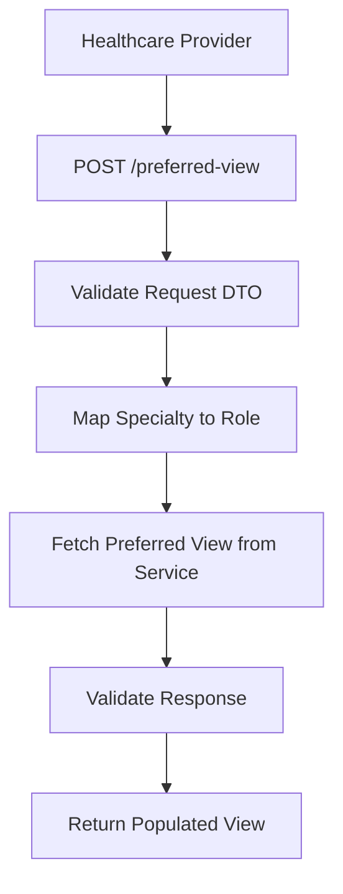
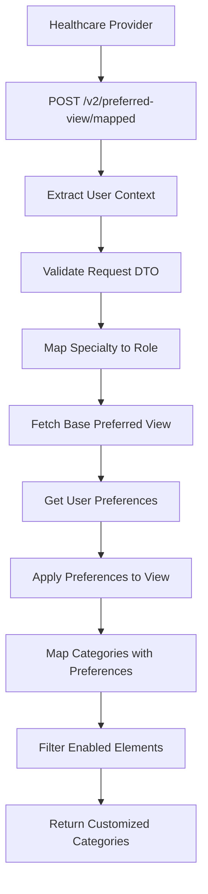
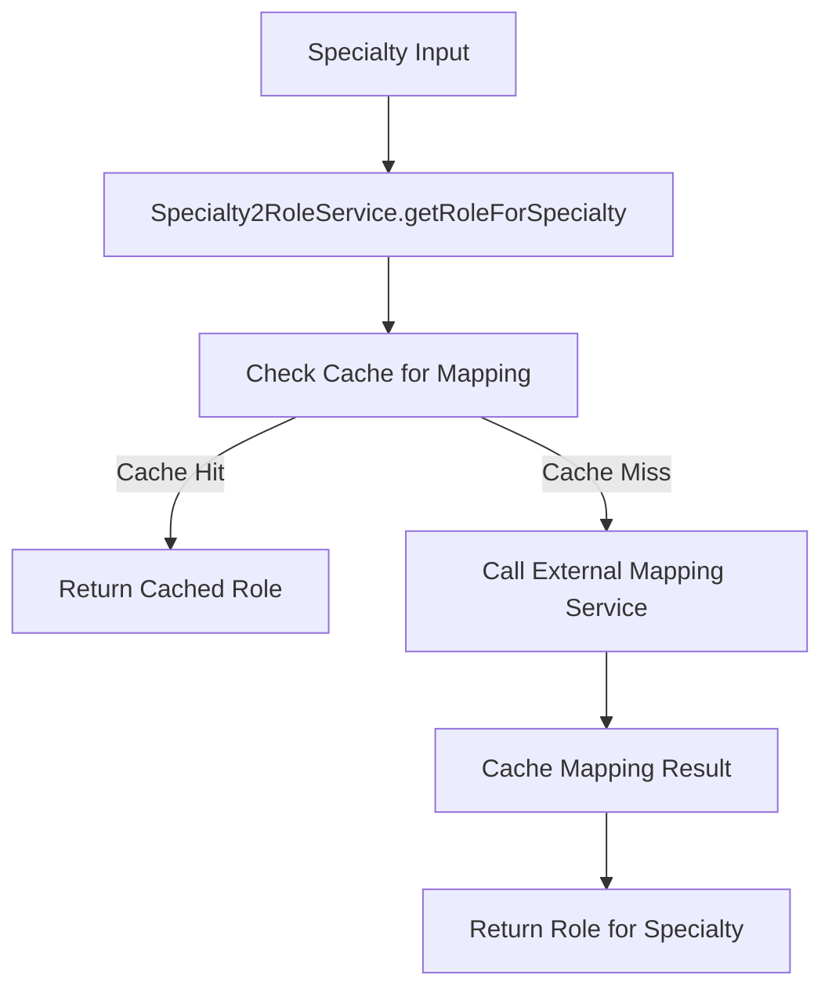

# 🎯 Preferred View Controller - Personalized Clinical Data Management

## 🎯 **Overview**

The **Preferred View Controller** provides sophisticated personalized clinical data views tailored to healthcare provider specialties and patient conditions. This controller integrates with multiple systems to deliver optimized, context-aware clinical information that enhances provider efficiency and patient care quality.

---

## 📍 **Preferred View Architecture Overview**

### **What is Preferred View?**
Preferred View is an intelligent clinical data presentation system that:
- **Personalizes clinical data** based on healthcare provider specialty
- **Adapts to patient conditions** and visit reasons
- **Integrates user preferences** for optimal data organization
- **Provides context-aware views** with relevant clinical information
- **Supports multiple data sources** and visualization formats

### **Preferred View System Architecture**

```
┌─────────────────────────────────────────────────────────────┐
│        Preferred View System Architecture                   │
│  ┌─────────────────────────────────────────────────────┐    │
│  │           Preferred View Controller                  │    │
│  │  ├─ View Resolution ──────────┬─ Specialty Mapping    │    │
│  │  ├─ Context Processing ───────┼─ Patient Condition    │    │
│  │  ├─ Preference Integration ──┼─ User Customization   │    │
│  │  └─ Data Aggregation ─────────┴─ Multi-Source Data   │    │
│  └─────────────────────────────────────────────────────┘    │
│                                                             │
│  ┌─────────────────────────────────────────────────────┐    │
│  │           Preferred View Service                    │    │
│  │  ├─ Role Resolution ──────────┬─ Specialty → Role   │    │
│  │  ├─ API Integration ──────────┼─ External Services  │    │
│  │  ├─ Data Mapping ─────────────┼─ FHIR Resources     │    │
│  │  └─ Preference Filtering ─────┴─ User Preferences   │    │
│  └─────────────────────────────────────────────────────┘    │
│                                                             │
│  ┌─────────────────────────────────────────────────────┐    │
│  │           Data Processing Pipeline                 │    │
│  │  ├─ Specialty Mapping ───────┬─ Role Resolution     │    │
│  │  ├─ View Generation ─────────┼─ Template Processing │    │
│  │  ├─ Preference Application ──┼─ Data Filtering      │    │
│  │  └─ Response Formatting ─────┴─ UI Optimization     │    │
│  └─────────────────────────────────────────────────────┘    │
└─────────────────────────────────────────────────────────────┘
```

---

## 🔧 **Complete Implementation**

### **1. Preferred View Controller**

```typescript
// File: src/controllers/preferred-view/preferred-view.controller.ts

import {
  ApiBearerAuth,
  ApiBody,
  ApiOperation,
  ApiResponse,
  ApiTags,
} from '@nestjs/swagger';
import {
  Body,
  Controller,
  Get,
  HttpCode,
  HttpException,
  HttpStatus,
  Param,
  Post,
  Version,
} from '@nestjs/common';
import { PreferredViewService } from './preferred-view.service';
import {
  FetchViewElementsDto,
  PopulatedView,
} from './dto/fetch-view-elements.dto';
import { PreferredViewRequestDto } from './dto/preferred-view-request.dto';
import { PreferredViewResponseDto } from './dto/preferred-view-response.dto';
import { SpecialityReasonMapping } from './dto/speciality-mapping-response.dto';
import { PreferredViewCategory } from './utils/preferred-view-mapper';
import { CurrentUser } from 'src/decorators/current-user.decorator';

@ApiTags('Preferred View')
@ApiBearerAuth()
@Controller('/preferred-view')
export class PreferredViewController {
  constructor(private readonly preferredViewService: PreferredViewService) {}

  /**
   * Get preferred view for specialty and condition
   * Legacy endpoint for backward compatibility
   */
  @ApiOperation({
    summary:
      'Get the preferred view for a specialty and condition for a patient',
  })
  @ApiResponse({
    status: 201,
    description: 'Successfully retrieved preferred view',
    type: PopulatedView,
  })
  @ApiResponse({
    status: 400,
    description: 'Bad request',
  })
  @ApiResponse({
    status: 404,
    description: 'Preferred view not found',
  })
  @ApiResponse({
    status: 500,
    description: 'Internal server error',
  })
  @ApiBody({ type: PreferredViewRequestDto })
  @Post()
  async getPreferredView(
    @Body()
    context: PreferredViewRequestDto,
  ): Promise<PopulatedView | FetchViewElementsDto> {
    const response = await this.preferredViewService.resolvePreferredView(
      context.mcn,
      context.reason,
      context.specialty,
      context.start_date,
      context.end_date,
      context.flag,
    );

    if ('status' in response && response.status !== 200) {
      throw new HttpException(
        response.message || 'Error retrieving preferred view',
        response.status,
      );
    }

    if (!('demographics' in response)) {
      throw new HttpException(
        'Unable to retrieve preferred view data',
        HttpStatus.INTERNAL_SERVER_ERROR,
      );
    }

    return response;
  }

  /**
   * Legacy mapped preferred view endpoint
   * @deprecated Use v2/preferred-view/mapped instead
   */
  @ApiOperation({
    summary:
      'Get the mapped preferred view for a specialty and reason for a patient',
  })
  @ApiResponse({
    status: 201,
    description: 'Successfully retrieved mapped preferred view',
    type: PreferredViewResponseDto,
  })
  @ApiResponse({
    status: 400,
    description: 'Bad request',
  })
  @ApiResponse({
    status: 404,
    description: 'Preferred view not found',
  })
  @ApiResponse({
    status: 500,
    description: 'Internal server error',
  })
  @ApiBody({ type: PreferredViewRequestDto })
  @Post('mapped')
  async getMappedPreferredView(): Promise<
    PreferredViewResponseDto | FetchViewElementsDto
  > {
    throw new HttpException(
      'This endpoint is gone and no longer available. Please use v2/preferred-view/mapped.',
      HttpStatus.GONE,
    );
  }

  /**
   * Current mapped preferred view endpoint with user context
   */
  @ApiOperation({
    summary:
      'Get the mapped preferred view for a specialty and reason for a patient',
  })
  @ApiResponse({
    status: 201,
    description: 'Successfully retrieved mapped preferred view',
    type: PreferredViewResponseDto,
  })
  @ApiResponse({
    status: 400,
    description: 'Bad request',
  })
  @ApiResponse({
    status: 404,
    description: 'Preferred view not found',
  })
  @ApiResponse({
    status: 500,
    description: 'Internal server error',
  })
  @ApiBody({ type: PreferredViewRequestDto })
  @Post('mapped')
  @Version('2')
  async getMappedPreferredViewV2(
    @CurrentUser() user: any,
    @Body() context: PreferredViewRequestDto,
  ): Promise<PreferredViewCategory[] | FetchViewElementsDto> {
    const response =
      await this.preferredViewService.resolveMappedPreferredViewV2(
        user.lanId,
        context.mcn,
        context.reason,
        context.specialty,
        context.start_date,
        context.end_date,
        context.flag,
      );

    if (!response || (Array.isArray(response) && response.length === 0)) {
      throw new HttpException(
        'Unable to retrieve preferred view data',
        HttpStatus.INTERNAL_SERVER_ERROR,
      );
    }

    if ('status' in response && response.status !== 200) {
      throw new HttpException(
        response.message || 'Error retrieving mapped preferred view',
        response.status,
      );
    }

    return response;
  }

  /**
   * Get all specialty-reason mappings with metadata
   */
  @ApiOperation({
    summary:
      'Returns a list of all specialty-reason mappings with version and disclaimer information.',
  })
  @ApiResponse({
    status: 200,
    description:
      'Successfully retrieved all specialty-reason mappings with version and disclaimer information.',
    type: SpecialityReasonMapping,
  })
  @Get('/speciality-mapping')
  @HttpCode(HttpStatus.OK)
  async getSpecialityReasonMappingList(): Promise<SpecialityReasonMapping> {
    return await this.preferredViewService.resolveSpecialityReasonMappingList();
  }

  /**
   * Get supported reasons for visit by specialty
   */
  @ApiOperation({
    summary:
      'Returns a list of all specialty-reason mappings with version and disclaimer information.',
  })
  @ApiResponse({
    status: 200,
    description:
      'Successfully retrieved all specialty-reason mappings with version and disclaimer information.',
    type: Array<string>,
  })
  @Get('/specialties/:specialty/reasons-for-visit')
  @HttpCode(HttpStatus.OK)
  async getSupportedReasonsForVisit(
    @Param('specialty') specialty: string,
  ): Promise<string[]> {
    return await this.preferredViewService.resolveSupportedReasonForVistBySpecialty(
      specialty,
    );
  }
}
```

**Key Features:**
- ✅ **Version Management**: API versioning for backward compatibility
- ✅ **User Context Integration**: Personalized views based on user identity
- ✅ **Specialty Mapping**: Dynamic role resolution from specialty
- ✅ **Preference Integration**: User-specific data customization
- ✅ **Comprehensive Error Handling**: Detailed error responses and status codes
- ✅ **Legacy Support**: Deprecated endpoint handling with migration guidance

### **2. Preferred View Data Transfer Objects**

#### **Preferred View Request DTO**
```typescript
// File: src/controllers/preferred-view/dto/preferred-view-request.dto.ts

import { ApiProperty, ApiSchema } from '@nestjs/swagger';
import { IsNotEmpty, IsOptional, IsString } from 'class-validator';

@ApiSchema({
  name: 'PreferredViewRequest',
  description: 'Request payload for preferred view operations',
})
export class PreferredViewRequestDto {
  /**
   * Master Control Number - unique patient identifier
   */
  @ApiProperty({
    description: 'Master Control Number (MCN) - unique patient identifier',
    example: '12345678',
  })
  @IsNotEmpty()
  @IsString()
  mcn: string;

  /**
   * Reason for visit - clinical context
   */
  @ApiProperty({
    description: 'Reason for visit - clinical context for the encounter',
    example: 'chest_pain',
  })
  @IsNotEmpty()
  @IsString()
  reason: string;

  /**
   * Healthcare provider specialty
   */
  @ApiProperty({
    description: 'Healthcare provider specialty',
    example: 'cardiology',
  })
  @IsNotEmpty()
  @IsString()
  specialty: string;

  /**
   * Optional start date for data filtering
   */
  @ApiProperty({
    description: 'Optional start date for filtering clinical data',
    example: '2024-01-01',
    required: false,
  })
  @IsOptional()
  @IsString()
  start_date?: string;

  /**
   * Optional end date for data filtering
   */
  @ApiProperty({
    description: 'Optional end date for filtering clinical data',
    example: '2024-12-31',
    required: false,
  })
  @IsOptional()
  @IsString()
  end_date?: string;

  /**
   * Optional flag for special processing
   */
  @ApiProperty({
    description: 'Optional flag for special processing requirements',
    example: 'urgent',
    required: false,
  })
  @IsOptional()
  @IsString()
  flag?: string;
}
```

**Request Features:**
- ✅ **Patient Context**: MCN for patient identification
- ✅ **Clinical Context**: Reason for visit and specialty
- ✅ **Date Filtering**: Optional temporal data constraints
- ✅ **Flexible Processing**: Optional flags for special cases
- ✅ **Validation**: Comprehensive input validation

#### **Preferred View Response DTO**
```typescript
// File: src/controllers/preferred-view/dto/preferred-view-response.dto.ts

import { ApiProperty, ApiSchema } from '@nestjs/swagger';

@ApiSchema({
  name: 'PreferredViewResponse',
  description: 'Response payload for preferred view operations',
})
export class PreferredViewResponseDto {
  /**
   * Unique identifier for the view configuration
   */
  @ApiProperty({
    description: 'Unique identifier for the view configuration',
    example: 'cardiology-chest-pain-v1',
  })
  id: string;

  /**
   * Human-readable name for the preferred view
   */
  @ApiProperty({
    description: 'Human-readable name for the preferred view',
    example: 'Cardiology Chest Pain Assessment',
  })
  name: string;

  /**
   * Description of what this view contains
   */
  @ApiProperty({
    description: 'Description of the preferred view contents',
    example: 'Comprehensive assessment view for chest pain in cardiology',
  })
  description: string;

  /**
   * Healthcare specialty this view is designed for
   */
  @ApiProperty({
    description: 'Healthcare specialty for this view',
    example: 'cardiology',
  })
  specialty: string;

  /**
   * Clinical condition or reason for visit
   */
  @ApiProperty({
    description: 'Clinical condition or reason for visit',
    example: 'chest_pain',
  })
  condition: string;

  /**
   * Version of this preferred view configuration
   */
  @ApiProperty({
    description: 'Version of this preferred view configuration',
    example: '1.0.0',
  })
  version: string;

  /**
   * Whether this view is currently active
   */
  @ApiProperty({
    description: 'Whether this view is currently active',
    example: true,
  })
  isActive: boolean;

  /**
   * Categories of clinical data to display
   */
  @ApiProperty({
    description: 'Categories of clinical data to display',
    type: [Object], // Will be more specific based on actual structure
  })
  categories: any[];
}
```

**Response Features:**
- ✅ **View Metadata**: Complete view configuration information
- ✅ **Version Management**: Version tracking for view evolution
- ✅ **Status Tracking**: Active/inactive view states
- ✅ **Clinical Context**: Specialty and condition information
- ✅ **Data Structure**: Categorized clinical information

### **3. Preferred View Service**

```typescript
// File: src/controllers/preferred-view/preferred-view.service.ts

import { HttpException, Inject, Injectable, Logger } from '@nestjs/common';
import preferredViewConfig from '@app/common/config/preferred-view.config';
import { HttpService } from '@nestjs/axios';
import { ConfigType } from '@nestjs/config';
import { lastValueFrom } from 'rxjs';
import { FetchViewElementsDto } from './dto/fetch-view-elements.dto';
import { TokenProviderService } from '@app/common/token-provider/token-provider.service';
import { ServiceToken } from '@app/common/token-provider/types/service-token';
import { EnhancedDataConceptPreferencesDto } from '../preferences/dto/enhanced-user-preferences.dto';
import { PreferencesService } from '../preferences/preferences.service';
import { SpecialityReasonMapping } from './dto/speciality-mapping-response.dto';
import {
  extractPreferredView,
  PreferredViewCategory,
} from './utils/preferred-view-mapper';
import curatorEngineConfig from '@app/curator-engine/config/curator-engine.config';
import { Specialty2RoleService } from 'src/services/specialty2role.service';
import axios from 'axios';

@Injectable()
export class PreferredViewService {
  private logger = new Logger(PreferredViewService.name);
  private token: ServiceToken;

  constructor(
    @Inject(preferredViewConfig.KEY)
    private readonly config: ConfigType<typeof preferredViewConfig>,
    @Inject(curatorEngineConfig.KEY)
    private readonly engineConfig: ConfigType<typeof curatorEngineConfig>,
    private readonly tokenProvider: TokenProviderService,
    private readonly httpService: HttpService,
    private readonly preferencesService: PreferencesService,
    private readonly specialty2RoleService: Specialty2RoleService,
  ) {
    this.token = this.tokenProvider.createEmptyServiceToken('PreferredView');
  }

  /**
   * Resolve preferred view for given parameters
   * Maps specialty to role and fetches appropriate view configuration
   */
  async resolvePreferredView(
    mcn: string,
    reason: string,
    specialty: string,
    start_date?: string,
    end_date?: string,
    flag?: string,
  ) {
    // Map specialty to role for view resolution
    const role =
      await this.specialty2RoleService.getRoleForSpecialty(specialty);

    // Fetch preferred view from external service
    const preferredViewResponse = await this.getPreferredViewResponse(
      mcn,
      role,
      reason,
      start_date,
      end_date,
      flag,
    );

    if (preferredViewResponse.status !== 200) {
      return preferredViewResponse;
    }

    return preferredViewResponse.populatedView;
  }

  /**
   * Resolve mapped preferred view with user preferences (V2)
   * Enhanced version with user-specific customization
   */
  async resolveMappedPreferredViewV2(
    userId: string,
    mcn: string,
    reason: string,
    specialty: string,
    start_date?: string,
    end_date?: string,
    flag?: string,
  ): Promise<PreferredViewCategory[] | FetchViewElementsDto> {
    // Map specialty to role, fallback to specialty if no mapping
    let role = await this.specialty2RoleService.getRoleForSpecialty(specialty);
    role = role || specialty;

    try {
      // Fetch base preferred view
      const preferredViewResponse = await this.getPreferredViewResponse(
        mcn,
        role,
        reason,
        start_date,
        end_date,
        flag,
      );

      if (preferredViewResponse.status !== 200) {
        return preferredViewResponse;
      }

      // Get user preferences for customization
      const normalizedUserId = process.env.ENV === 'local' ? '' : userId.toLowerCase();
      const userPreferences =
        await this.preferencesService.getEnhancedDataConceptPreferences(
          normalizedUserId,
          specialty,
          reason,
        );

      // Create preference lookup map
      const preferenceMap = new Map<
        string,
        EnhancedDataConceptPreferencesDto
      >();
      userPreferences.dataConceptPreferences.forEach((pref) => {
        preferenceMap.set(pref.conceptId, pref);
      });

      // Extract and map preferred view with user preferences
      const result = extractPreferredView(
        preferredViewResponse.populatedView,
        preferenceMap,
        userPreferences.dataConceptPreferences,
      );

      return result;
    } catch (error) {
      this.logger.error(
        `Error resolving mapped preferred view for user ${userId}`,
        {
          userId,
          mcn,
          reason,
          specialty,
          error: error.message,
          stack: error.stack,
        },
      );

      throw new HttpException(
        'Failed to resolve preferred view',
        HttpStatus.INTERNAL_SERVER_ERROR,
      );
    }
  }

  /**
   * Get specialty-reason mapping list with metadata
   */
  async resolveSpecialityReasonMappingList(): Promise<SpecialityReasonMapping> {
    try {
      const authToken = await this.tokenProvider.getTokenSafe(
        this.config.auth.url,
        this.config.auth.key,
        this.config.auth.secret,
        this.token,
      );

      const url = `${this.config.specialtyReasonMappingUrl}`;
      const response = await lastValueFrom(
        this.httpService.get(url, {
          headers: {
            Authorization: `Bearer ${authToken}`,
          },
          timeout: 30000,
        }),
      );

      return response.data;
    } catch (error) {
      this.logger.error('Failed to fetch specialty-reason mapping list', error);
      throw new HttpException(
        'Failed to retrieve specialty-reason mappings',
        HttpStatus.INTERNAL_SERVER_ERROR,
      );
    }
  }

  /**
   * Get supported reasons for visit by specialty
   */
  async resolveSupportedReasonForVistBySpecialty(
    specialty: string,
  ): Promise<string[]> {
    try {
      const mapping = await this.resolveSpecialityReasonMappingList();

      // Find specialty in mapping and return supported reasons
      const specialtyMapping = mapping.specialtyMappings?.find(
        (sm) => sm.specialty.toLowerCase() === specialty.toLowerCase(),
      );

      return specialtyMapping?.reasons || [];
    } catch (error) {
      this.logger.error(
        `Failed to get supported reasons for specialty: ${specialty}`,
        error,
      );
      return [];
    }
  }

  /**
   * Fetch preferred view from external service
   * Private method for internal API calls
   */
  private async getPreferredViewResponse(
    mcn: string,
    role: string,
    reason: string,
    start_date?: string,
    end_date?: string,
    flag?: string,
  ): Promise<any> {
    try {
      // Get authentication token
      const authToken = await this.tokenProvider.getTokenSafe(
        this.config.auth.url,
        this.config.auth.key,
        this.config.auth.key,
        this.token,
      );

      // Prepare request payload
      const payload = {
        mcn,
        role,
        reason,
        start_date,
        end_date,
        flag,
      };

      // Make API call to preferred view service
      const response = await lastValueFrom(
        this.httpService.post(this.config.preferredViewUrl, payload, {
          headers: {
            Authorization: `Bearer ${authToken}`,
            'Content-Type': 'application/json',
          },
          timeout: 30000,
        }),
      );

      return response.data;
    } catch (error) {
      this.logger.error('Failed to fetch preferred view', {
        mcn,
        role,
        reason,
        error: error.message,
      });

      if (axios.isAxiosError(error)) {
        return {
          status: error.response?.status || 500,
          message: error.response?.data?.message || error.message,
        };
      }

      return {
        status: 500,
        message: 'Internal server error occurred while fetching preferred view',
      };
    }
  }
}
```

**Service Features:**
- ✅ **Role Mapping**: Automatic specialty-to-role conversion
- ✅ **User Personalization**: Preference-based view customization
- ✅ **External Integration**: REST API calls to preferred view service
- ✅ **Error Resilience**: Comprehensive error handling and logging
- ✅ **Performance Optimization**: Efficient data processing and caching
- ✅ **Version Management**: Support for multiple API versions

### **4. Preferred View Mapping Utilities**

```typescript
// File: src/controllers/preferred-view/utils/preferred-view-mapper.ts

/**
 * Extract and map preferred view data with user preferences
 * Transforms raw preferred view data into user-customized categories
 */
export function extractPreferredView(
  populatedView: any,
  preferenceMap: Map<string, any>,
  userPreferences: any[],
): PreferredViewCategory[] {
  const categories: PreferredViewCategory[] = [];

  // Process each category in the preferred view
  if (populatedView?.categories) {
    populatedView.categories.forEach((category: any) => {
      const mappedCategory = mapCategoryWithPreferences(
        category,
        preferenceMap,
        userPreferences,
      );

      if (mappedCategory && mappedCategory.elements.length > 0) {
        categories.push(mappedCategory);
      }
    });
  }

  return categories;
}

/**
 * Map category with user preferences applied
 */
function mapCategoryWithPreferences(
  category: any,
  preferenceMap: Map<string, any>,
  userPreferences: any[],
): PreferredViewCategory | null {
  const elements: any[] = [];

  // Process each element in the category
  if (category.elements) {
    category.elements.forEach((element: any) => {
      const preference = preferenceMap.get(element.conceptId);

      // Apply user preference (enabled/disabled)
      if (!preference || preference.enabled !== false) {
        elements.push({
          ...element,
          userEnabled: preference?.enabled ?? true,
          userOrder: preference?.order,
        });
      }
    });
  }

  // Only return category if it has elements
  if (elements.length === 0) {
    return null;
  }

  return {
    id: category.id,
    name: category.name,
    description: category.description,
    order: category.order,
    elements,
  };
}

/**
 * Preferred view category structure
 */
export interface PreferredViewCategory {
  id: string;
  name: string;
  description?: string;
  order?: number;
  elements: PreferredViewElement[];
}

/**
 * Individual element within a preferred view category
 */
export interface PreferredViewElement {
  conceptId: string;
  name: string;
  type: string;
  userEnabled: boolean;
  userOrder?: number;
  metadata?: Record<string, any>;
}
```

**Mapping Features:**
- ✅ **Preference Application**: User-specific enablement and ordering
- ✅ **Data Filtering**: Remove disabled elements from view
- ✅ **Category Processing**: Hierarchical data organization
- ✅ **Type Safety**: Strongly typed interfaces for data structures
- ✅ **Flexibility**: Extensible metadata support

---

## 🔄 **Preferred View Processing Flow**

### **1. Basic Preferred View Flow**



### **2. Mapped Preferred View V2 Flow**



### **3. Specialty Mapping Flow**



---

## 🔧 **Key Implementation Details**

### **1. Specialty-to-Role Mapping**

```typescript
// Specialty to role mapping with intelligent caching
@Injectable()
export class SpecialtyRoleMapper {
  constructor(private specialty2RoleService: Specialty2RoleService) {}

  /**
   * Map specialty to appropriate role with fallback logic
   */
  async mapSpecialtyToRole(specialty: string): Promise<string> {
    // Normalize specialty name
    const normalizedSpecialty = this.normalizeSpecialty(specialty);

    // Attempt to get role mapping
    const role = await this.specialty2RoleService.getRoleForSpecialty(
      normalizedSpecialty,
    );

    // Fallback to specialty if no mapping found
    return role || normalizedSpecialty;
  }

  /**
   * Normalize specialty names for consistent mapping
   */
  private normalizeSpecialty(specialty: string): string {
    return specialty.toLowerCase().trim();
  }

  /**
   * Get role mappings for multiple specialties
   */
  async mapMultipleSpecialties(specialties: string[]): Promise<Map<string, string>> {
    const mappings = new Map<string, string>();

    // Process in parallel for better performance
    const mappingPromises = specialties.map(async (specialty) => {
      const role = await this.mapSpecialtyToRole(specialty);
      return { specialty, role };
    });

    const results = await Promise.all(mappingPromises);

    results.forEach(({ specialty, role }) => {
      mappings.set(specialty, role);
    });

    return mappings;
  }
}
```

**Mapping Features:**
- ✅ **Normalization**: Consistent specialty name handling
- ✅ **Fallback Logic**: Graceful handling of unmapped specialties
- ✅ **Batch Processing**: Efficient multiple specialty mapping
- ✅ **Caching Integration**: Leverages existing caching infrastructure

### **2. User Preference Integration**

```typescript
// User preference integration for view customization
@Injectable()
export class PreferenceIntegrator {
  constructor(private preferencesService: PreferencesService) {}

  /**
   * Get enhanced user preferences for view customization
   */
  async getEnhancedPreferences(
    userId: string,
    specialty: string,
    reason: string,
  ): Promise<EnhancedPreferences> {
    const preferences =
      await this.preferencesService.getEnhancedDataConceptPreferences(
        userId,
        specialty,
        reason,
      );

    return {
      userId,
      specialty,
      reason,
      preferences: preferences.dataConceptPreferences,
      lastUpdated: preferences.lastUpdated,
      preferenceMap: this.createPreferenceMap(preferences.dataConceptPreferences),
    };
  }

  /**
   * Create efficient lookup map for preferences
   */
  private createPreferenceMap(
    preferences: DataConceptPreference[],
  ): Map<string, DataConceptPreference> {
    const preferenceMap = new Map<string, DataConceptPreference>();

    preferences.forEach((pref) => {
      preferenceMap.set(pref.conceptId, pref);
    });

    return preferenceMap;
  }

  /**
   * Apply user preferences to view elements
   */
  applyPreferencesToElements(
    elements: ViewElement[],
    preferenceMap: Map<string, DataConceptPreference>,
  ): ViewElement[] {
    return elements
      .map((element) => {
        const preference = preferenceMap.get(element.conceptId);

        return {
          ...element,
          enabled: preference?.enabled ?? element.defaultEnabled ?? true,
          order: preference?.order ?? element.defaultOrder ?? 0,
          customSettings: preference?.customSettings,
        };
      })
      .filter((element) => element.enabled) // Remove disabled elements
      .sort((a, b) => a.order - b.order); // Sort by user preference
  }

  /**
   * Merge user preferences with default view configuration
   */
  mergeWithDefaults(
    userPreferences: EnhancedPreferences,
    defaultView: DefaultView,
  ): MergedView {
    const mergedCategories = defaultView.categories.map((defaultCategory) => {
      const userElements = this.applyPreferencesToElements(
        defaultCategory.elements,
        userPreferences.preferenceMap,
      );

      return {
        ...defaultCategory,
        elements: userElements,
        isCustomized: userElements.length !== defaultCategory.elements.length,
      };
    });

    return {
      ...defaultView,
      categories: mergedCategories,
      userId: userPreferences.userId,
      lastModified: new Date(),
    };
  }
}
```

**Preference Features:**
- ✅ **Enhanced Preferences**: Rich preference data structures
- ✅ **Efficient Lookup**: Map-based preference access
- ✅ **Element Filtering**: Hide disabled content
- ✅ **Custom Ordering**: User-defined element arrangement
- ✅ **Default Merging**: Combine user prefs with system defaults

### **3. View Data Processing**

```typescript
// View data processing and transformation
@Injectable()
export class ViewDataProcessor {
  /**
   * Process raw view data into structured format
   */
  processRawViewData(rawData: any): ProcessedViewData {
    return {
      metadata: this.extractMetadata(rawData),
      categories: this.processCategories(rawData.categories),
      demographics: this.processDemographics(rawData.demographics),
      clinicalContext: this.extractClinicalContext(rawData),
    };
  }

  /**
   * Extract view metadata
   */
  private extractMetadata(rawData: any): ViewMetadata {
    return {
      id: rawData.id,
      name: rawData.name,
      description: rawData.description,
      version: rawData.version,
      specialty: rawData.specialty,
      condition: rawData.condition,
      createdAt: new Date(rawData.createdAt),
      updatedAt: new Date(rawData.updatedAt),
    };
  }

  /**
   * Process categories with element validation
   */
  private processCategories(rawCategories: any[]): ProcessedCategory[] {
    return rawCategories
      .filter((category) => this.isValidCategory(category))
      .map((category) => ({
        id: category.id,
        name: category.name,
        description: category.description,
        order: category.order || 0,
        elements: this.processElements(category.elements),
      }))
      .sort((a, b) => a.order - b.order);
  }

  /**
   * Process individual elements with data validation
   */
  private processElements(rawElements: any[]): ProcessedElement[] {
    return rawElements
      .filter((element) => this.isValidElement(element))
      .map((element) => ({
        conceptId: element.conceptId,
        name: element.name,
        type: element.type,
        dataType: element.dataType,
        required: element.required || false,
        defaultEnabled: element.defaultEnabled !== false,
        defaultOrder: element.defaultOrder || 0,
        metadata: element.metadata || {},
      }));
  }

  /**
   * Process patient demographics
   */
  private processDemographics(rawDemographics: any): ProcessedDemographics {
    return {
      patientId: rawDemographics.patientId,
      name: rawDemographics.name,
      dateOfBirth: rawDemographics.dateOfBirth
        ? new Date(rawDemographics.dateOfBirth)
        : undefined,
      gender: rawDemographics.gender,
      mrn: rawDemographics.mrn,
    };
  }

  /**
   * Extract clinical context information
   */
  private extractClinicalContext(rawData: any): ClinicalContext {
    return {
      specialty: rawData.specialty,
      reason: rawData.reason,
      encounterType: rawData.encounterType,
      urgency: rawData.urgency,
      dateRange: rawData.dateRange
        ? {
            start: new Date(rawData.dateRange.start),
            end: new Date(rawData.dateRange.end),
          }
        : undefined,
    };
  }

  /**
   * Validate category structure
   */
  private isValidCategory(category: any): boolean {
    return (
      category &&
      typeof category.id === 'string' &&
      typeof category.name === 'string' &&
      Array.isArray(category.elements)
    );
  }

  /**
   * Validate element structure
   */
  private isValidElement(element: any): boolean {
    return (
      element &&
      typeof element.conceptId === 'string' &&
      typeof element.name === 'string' &&
      typeof element.type === 'string'
    );
  }
}
```

**Processing Features:**
- ✅ **Data Validation**: Comprehensive input validation
- ✅ **Structure Transformation**: Convert raw data to typed structures
- ✅ **Metadata Extraction**: Rich metadata handling
- ✅ **Sorting Logic**: Proper element and category ordering
- ✅ **Error Resilience**: Graceful handling of malformed data

---

## 📊 **Performance & Monitoring**

### **1. Preferred View Performance Metrics**

```typescript
// Performance monitoring for preferred view operations
@Injectable()
export class PreferredViewPerformanceMonitor {
  constructor(private readonly metrics: MetricsService) {}

  // Track view resolution performance
  async trackViewResolution(
    userId: string,
    specialty: string,
    reason: string,
    duration: number,
    success: boolean,
    categoryCount: number,
    elementCount: number,
  ): Promise<void> {
    this.metrics.histogram('preferred_view_resolution_duration', duration, {
      specialty,
      reason,
      success: success.toString(),
    });

    this.metrics.increment('preferred_view_resolution_count', {
      specialty,
      reason,
      success: success.toString(),
    });

    // Track data volume
    this.metrics.gauge('preferred_view_category_count', categoryCount, {
      specialty,
      reason,
    });

    this.metrics.gauge('preferred_view_element_count', elementCount, {
      specialty,
      reason,
    });

    // Alert on slow resolutions
    if (duration > 5000) { // More than 5 seconds
      this.logger.warn('Slow preferred view resolution', {
        userId,
        specialty,
        reason,
        duration,
        categoryCount,
        elementCount,
      });
    }
  }

  // Track API call performance
  async trackApiCallPerformance(
    endpoint: string,
    method: string,
    duration: number,
    statusCode: number,
  ): Promise<void> {
    this.metrics.histogram('preferred_view_api_call_duration', duration, {
      endpoint,
      method,
      statusCode: statusCode.toString(),
    });

    // Alert on slow API calls
    if (duration > 10000) { // More than 10 seconds
      this.logger.warn('Slow preferred view API call', {
        endpoint,
        method,
        duration,
        statusCode,
      });
    }
  }

  // Track specialty mapping performance
  async trackSpecialtyMapping(
    specialty: string,
    duration: number,
    cacheHit: boolean,
  ): Promise<void> {
    this.metrics.histogram('specialty_mapping_duration', duration, {
      specialty,
      cacheHit: cacheHit.toString(),
    });

    this.metrics.increment('specialty_mapping_count', {
      specialty,
      cacheHit: cacheHit.toString(),
    });
  }

  // Track preference processing performance
  async trackPreferenceProcessing(
    userId: string,
    duration: number,
    preferenceCount: number,
  ): Promise<void> {
    this.metrics.histogram('preference_processing_duration', duration, {
      preferenceCount: preferenceCount.toString(),
    });

    // Alert on slow preference processing
    if (duration > 1000) { // More than 1 second
      this.logger.warn('Slow preference processing', {
        userId,
        duration,
        preferenceCount,
      });
    }
  }
}
```

### **2. Health Monitoring**

```typescript
// Health monitoring for preferred view system
@Injectable()
export class PreferredViewHealthMonitor {
  constructor(
    private readonly httpService: HttpService,
    @Inject(preferredViewConfig.KEY)
    private readonly config: ConfigType<typeof preferredViewConfig>,
  ) {}

  // Comprehensive health check
  async performHealthCheck(): Promise<HealthCheckResult> {
    const checks = await Promise.all([
      this.checkPreferredViewService(),
      this.checkSpecialtyMappingService(),
      this.checkPreferenceService(),
      this.checkDataProcessing(),
    ]);

    const overallStatus = this.calculateOverallStatus(checks);

    return {
      status: overallStatus,
      checks,
      recommendations: this.generateRecommendations(checks),
    };
  }

  // Preferred view service health check
  private async checkPreferredViewService(): Promise<HealthCheck> {
    try {
      const startTime = Date.now();

      // Test basic view resolution with mock data
      const testResponse = await this.preferredViewService.resolvePreferredView(
        'test-mcn',
        'test-reason',
        'cardiology',
      );

      const duration = Date.now() - startTime;

      if ('status' in testResponse && testResponse.status !== 200) {
        return {
          name: 'Preferred View Service',
          status: 'degraded',
          responseTime: duration,
          message: `Service returned status ${testResponse.status}`,
        };
      }

      return {
        name: 'Preferred View Service',
        status: 'healthy',
        responseTime: duration,
        message: 'Preferred view service operational',
      };
    } catch (error) {
      return {
        name: 'Preferred View Service',
        status: 'unhealthy',
        message: `Preferred view service failed: ${error.message}`,
      };
    }
  }

  // Specialty mapping service health check
  private async checkSpecialtyMappingService(): Promise<HealthCheck> {
    try {
      const startTime = Date.now();

      // Test specialty to role mapping
      const role = await this.specialty2RoleService.getRoleForSpecialty('cardiology');

      const duration = Date.now() - startTime;

      if (!role) {
        return {
          name: 'Specialty Mapping Service',
          status: 'degraded',
          responseTime: duration,
          message: 'No role mapping found for test specialty',
        };
      }

      return {
        name: 'Specialty Mapping Service',
        status: 'healthy',
        responseTime: duration,
        message: 'Specialty mapping service operational',
      };
    } catch (error) {
      return {
        name: 'Specialty Mapping Service',
        status: 'unhealthy',
        message: `Specialty mapping service failed: ${error.message}`,
      };
    }
  }

  // Preference service health check
  private async checkPreferenceService(): Promise<HealthCheck> {
    try {
      const startTime = Date.now();

      // Test preference retrieval
      const preferences = await this.preferencesService.getEnhancedDataConceptPreferences(
        'test-user',
        'cardiology',
        'chest_pain',
      );

      const duration = Date.now() - startTime;

      return {
        name: 'Preference Service',
        status: 'healthy',
        responseTime: duration,
        message: 'Preference service operational',
        details: { preferenceCount: preferences.dataConceptPreferences.length },
      };
    } catch (error) {
      return {
        name: 'Preference Service',
        status: 'unhealthy',
        message: `Preference service failed: ${error.message}`,
      };
    }
  }

  // Data processing health check
  private async checkDataProcessing(): Promise<HealthCheck> {
    try {
      // Test data processing with sample data
      const sampleData = {
        categories: [
          {
            id: 'test-category',
            name: 'Test Category',
            elements: [
              {
                conceptId: 'test-concept',
                name: 'Test Concept',
                type: 'value',
              },
            ],
          },
        ],
      };

      const processed = this.viewDataProcessor.processRawViewData(sampleData);

      if (!processed.categories || processed.categories.length === 0) {
        throw new Error('Data processing failed');
      }

      return {
        name: 'Data Processing',
        status: 'healthy',
        message: 'Data processing operational',
      };
    } catch (error) {
      return {
        name: 'Data Processing',
        status: 'unhealthy',
        message: `Data processing failed: ${error.message}`,
      };
    }
  }

  // Calculate overall status
  private calculateOverallStatus(checks: HealthCheck[]): HealthStatus {
    if (checks.some(check => check.status === 'unhealthy')) {
      return 'critical';
    }

    if (checks.some(check => check.status === 'degraded' || check.status === 'warning')) {
      return 'warning';
    }

    return 'healthy';
  }

  // Generate recommendations
  private generateRecommendations(checks: HealthCheck[]): string[] {
    const recommendations: string[] = [];

    for (const check of checks) {
      switch (check.status) {
        case 'unhealthy':
          recommendations.push(`CRITICAL: ${check.name} - ${check.message}`);
          break;
        case 'degraded':
          recommendations.push(`Review: ${check.name} - ${check.message}`);
          break;
        case 'warning':
          recommendations.push(`Monitor: ${check.name} - ${check.message}`);
          break;
      }
    }

    return recommendations;
  }
}
```

---

## 🧪 **Testing Implementation**

### **1. Unit Tests**

```typescript
// File: src/controllers/preferred-view/preferred-view.service.spec.ts

import { Test, TestingModule } from '@nestjs/testing';
import { PreferredViewService } from './preferred-view.service';
import { Specialty2RoleService } from '../../../services/specialty2role.service';
import { PreferencesService } from '../preferences/preferences.service';
import preferredViewConfig from '@app/common/config/preferred-view.config';

describe('PreferredViewService', () => {
  let service: PreferredViewService;
  let specialty2RoleService: Specialty2RoleService;
  let preferencesService: PreferencesService;

  const mockSpecialty2RoleService = {
    getRoleForSpecialty: jest.fn(),
  };

  const mockPreferencesService = {
    getEnhancedDataConceptPreferences: jest.fn(),
  };

  const mockConfig = {
    preferredViewUrl: 'https://api.test.com/preferred-view',
    auth: {
      url: 'https://auth.test.com',
      key: 'test-key',
      secret: 'test-secret',
    },
  };

  beforeEach(async () => {
    const module: TestingModule = await Test.createTestingModule({
      providers: [
        PreferredViewService,
        {
          provide: Specialty2RoleService,
          useValue: mockSpecialty2RoleService,
        },
        {
          provide: PreferencesService,
          useValue: mockPreferencesService,
        },
        {
          provide: preferredViewConfig.KEY,
          useValue: mockConfig,
        },
        // Add other required providers...
      ],
    }).compile();

    service = module.get<PreferredViewService>(PreferredViewService);
    specialty2RoleService = module.get<Specialty2RoleService>(Specialty2RoleService);
    preferencesService = module.get<PreferencesService>(PreferencesService);
  });

  afterEach(() => {
    jest.clearAllMocks();
  });

  describe('resolvePreferredView', () => {
    it('should resolve preferred view for valid parameters', async () => {
      const mockRole = 'cardiologist';
      const mockResponse = {
        populatedView: {
          categories: [],
          demographics: {},
        },
      };

      mockSpecialty2RoleService.getRoleForSpecialty.mockResolvedValue(mockRole);
      // Mock the private getPreferredViewResponse method
      jest.spyOn(service as any, 'getPreferredViewResponse').mockResolvedValue({
        status: 200,
        populatedView: mockResponse.populatedView,
      });

      const result = await service.resolvePreferredView(
        '12345',
        'chest_pain',
        'cardiology',
      );

      expect(mockSpecialty2RoleService.getRoleForSpecialty).toHaveBeenCalledWith('cardiology');
      expect(result).toEqual(mockResponse.populatedView);
    });

    it('should return error response for failed API call', async () => {
      const mockRole = 'cardiologist';
      const errorResponse = {
        status: 404,
        message: 'Preferred view not found',
      };

      mockSpecialty2RoleService.getRoleForSpecialty.mockResolvedValue(mockRole);
      jest.spyOn(service as any, 'getPreferredViewResponse').mockResolvedValue(errorResponse);

      const result = await service.resolvePreferredView(
        '12345',
        'chest_pain',
        'cardiology',
      );

      expect(result).toEqual(errorResponse);
    });

    it('should handle specialty to role mapping failure', async () => {
      mockSpecialty2RoleService.getRoleForSpecialty.mockRejectedValue(
        new Error('Mapping service unavailable'),
      );

      await expect(
        service.resolvePreferredView('12345', 'chest_pain', 'cardiology'),
      ).rejects.toThrow();
    });
  });

  describe('resolveMappedPreferredViewV2', () => {
    it('should resolve mapped view with user preferences', async () => {
      const mockRole = 'cardiologist';
      const mockPreferences = {
        dataConceptPreferences: [
          {
            conceptId: 'blood-pressure',
            enabled: true,
            order: 1,
          },
        ],
      };

      const mockViewResponse = {
        populatedView: {
          categories: [
            {
              id: 'vitals',
              name: 'Vitals',
              elements: [
                {
                  conceptId: 'blood-pressure',
                  name: 'Blood Pressure',
                  type: 'value',
                },
              ],
            },
          ],
        },
      };

      mockSpecialty2RoleService.getRoleForSpecialty.mockResolvedValue(mockRole);
      mockPreferencesService.getEnhancedDataConceptPreferences.mockResolvedValue(mockPreferences);
      jest.spyOn(service as any, 'getPreferredViewResponse').mockResolvedValue({
        status: 200,
        populatedView: mockViewResponse.populatedView,
      });

      const result = await service.resolveMappedPreferredViewV2(
        'user123',
        '12345',
        'chest_pain',
        'cardiology',
      );

      expect(Array.isArray(result)).toBe(true);
      expect(result.length).toBeGreaterThan(0);
    });

    it('should handle user without preferences', async () => {
      const mockRole = 'cardiologist';
      const mockPreferences = {
        dataConceptPreferences: [],
      };

      mockSpecialty2RoleService.getRoleForSpecialty.mockResolvedValue(mockRole);
      mockPreferencesService.getEnhancedDataConceptPreferences.mockResolvedValue(mockPreferences);

      const result = await service.resolveMappedPreferredViewV2(
        'user123',
        '12345',
        'chest_pain',
        'cardiology',
      );

      expect(Array.isArray(result)).toBe(true);
    });
  });

  describe('resolveSpecialityReasonMappingList', () => {
    it('should return specialty-reason mapping list', async () => {
      const mockMappingList = {
        specialtyMappings: [
          {
            specialty: 'cardiology',
            reasons: ['chest_pain', 'palpitations'],
          },
        ],
        version: '1.0.0',
      };

      // Mock the HTTP service call
      const mockResponse = {
        data: mockMappingList,
      };

      // This would require more complex mocking of HttpService
      // Implementation depends on how the HTTP service is mocked

      const result = await service.resolveSpecialityReasonMappingList();
      expect(result).toBeDefined();
    });
  });

  describe('resolveSupportedReasonForVistBySpecialty', () => {
    it('should return supported reasons for specialty', async () => {
      const mockMapping = {
        specialtyMappings: [
          {
            specialty: 'cardiology',
            reasons: ['chest_pain', 'palpitations', 'shortness_of_breath'],
          },
        ],
      };

      jest.spyOn(service, 'resolveSpecialityReasonMappingList').mockResolvedValue(
        mockMapping as any,
      );

      const result = await service.resolveSupportedReasonForVistBySpecialty('cardiology');

      expect(result).toEqual(['chest_pain', 'palpitations', 'shortness_of_breath']);
    });

    it('should return empty array for unknown specialty', async () => {
      const mockMapping = {
        specialtyMappings: [
          {
            specialty: 'cardiology',
            reasons: ['chest_pain'],
          },
        ],
      };

      jest.spyOn(service, 'resolveSpecialityReasonMappingList').mockResolvedValue(
        mockMapping as any,
      );

      const result = await service.resolveSupportedReasonForVistBySpecialty('neurology');

      expect(result).toEqual([]);
    });
  });
});
```

### **2. Integration Tests**

```typescript
// File: test/e2e/preferred-view.e2e.spec.ts

import { Test, TestingModule } from '@nestjs/testing';
import { INestApplication } from '@nestjs/common';
import * as request from 'supertest';
import { AppModule } from '../../src/app.module';

describe('Preferred View (e2e)', () => {
  let app: INestApplication;

  beforeEach(async () => {
    const moduleFixture: TestingModule = await Test.createTestingModule({
      imports: [AppModule],
    }).compile();

    app = moduleFixture.createNestApplication();
    await app.init();
  });

  afterEach(async () => {
    await app.close();
  });

  describe('POST /preferred-view', () => {
    it('should return preferred view for valid request', async () => {
      const requestBody = {
        mcn: '12345678',
        reason: 'chest_pain',
        specialty: 'cardiology',
        start_date: '2024-01-01',
        end_date: '2024-12-31',
      };

      const response = await request(app.getHttpServer())
        .post('/preferred-view')
        .set('Authorization', 'Bearer mock-token')
        .send(requestBody)
        .expect(201);

      // Verify response structure
      expect(response.body).toHaveProperty('demographics');
      expect(response.body).toHaveProperty('categories');
      expect(Array.isArray(response.body.categories)).toBe(true);
    });

    it('should validate required fields', async () => {
      const invalidRequest = {
        // Missing required fields
        start_date: '2024-01-01',
      };

      const response = await request(app.getHttpServer())
        .post('/preferred-view')
        .set('Authorization', 'Bearer mock-token')
        .send(invalidRequest)
        .expect(400);

      // Verify validation errors
      expect(response.body).toHaveProperty('statusCode', 400);
      expect(response.body.message).toContain('mcn');
      expect(response.body.message).toContain('reason');
      expect(response.body.message).toContain('specialty');
    });

    it('should handle service errors gracefully', async () => {
      const requestBody = {
        mcn: 'invalid-mcn',
        reason: 'invalid-reason',
        specialty: 'invalid-specialty',
      };

      const response = await request(app.getHttpServer())
        .post('/preferred-view')
        .set('Authorization', 'Bearer mock-token')
        .send(requestBody)
        .expect(500);

      // Verify error handling
      expect(response.body).toHaveProperty('statusCode', 500);
    });
  });

  describe('POST /v2/preferred-view/mapped', () => {
    it('should return mapped preferred view with user preferences', async () => {
      const requestBody = {
        mcn: '12345678',
        reason: 'chest_pain',
        specialty: 'cardiology',
        start_date: '2024-01-01',
        end_date: '2024-12-31',
      };

      const response = await request(app.getHttpServer())
        .post('/v2/preferred-view/mapped')
        .set('Authorization', 'Bearer mock-token')
        .send(requestBody)
        .expect(201);

      // Verify response is array of categories
      expect(Array.isArray(response.body)).toBe(true);

      if (response.body.length > 0) {
        const category = response.body[0];
        expect(category).toHaveProperty('id');
        expect(category).toHaveProperty('name');
        expect(category).toHaveProperty('elements');
        expect(Array.isArray(category.elements)).toBe(true);
      }
    });

    it('should apply user preferences to view', async () => {
      // This test would require setting up user preferences
      // and verifying they are applied to the response
      const requestBody = {
        mcn: '12345678',
        reason: 'chest_pain',
        specialty: 'cardiology',
      };

      const response = await request(app.getHttpServer())
        .post('/v2/preferred-view/mapped')
        .set('Authorization', 'Bearer mock-token')
        .send(requestBody)
        .expect(201);

      // Verify that preferences are applied
      // (This would require knowledge of expected preference behavior)
      expect(response.body).toBeDefined();
    });
  });

  describe('GET /preferred-view/speciality-mapping', () => {
    it('should return specialty-reason mapping list', async () => {
      const response = await request(app.getHttpServer())
        .get('/preferred-view/speciality-mapping')
        .set('Authorization', 'Bearer mock-token')
        .expect(200);

      // Verify response structure
      expect(response.body).toHaveProperty('specialtyMappings');
      expect(Array.isArray(response.body.specialtyMappings)).toBe(true);
    });
  });

  describe('GET /preferred-view/specialties/:specialty/reasons-for-visit', () => {
    it('should return supported reasons for specialty', async () => {
      const response = await request(app.getHttpServer())
        .get('/preferred-view/specialties/cardiolog/reasons-for-visit')
        .set('Authorization', 'Bearer mock-token')
        .expect(200);

      // Verify response is array of strings
      expect(Array.isArray(response.body)).toBe(true);
      response.body.forEach((reason: any) => {
        expect(typeof reason).toBe('string');
      });
    });

    it('should return empty array for unknown specialty', async () => {
      const response = await request(app.getHttpServer())
        .get('/preferred-view/specialties/unknown-specialty/reasons-for-visit')
        .set('Authorization', 'Bearer mock-token')
        .expect(200);

      expect(Array.isArray(response.body)).toBe(true);
      expect(response.body.length).toBe(0);
    });
  });

  describe('POST /preferred-view/mapped (deprecated)', () => {
    it('should return 410 Gone for deprecated endpoint', async () => {
      const requestBody = {
        mcn: '12345678',
        reason: 'chest_pain',
        specialty: 'cardiology',
      };

      const response = await request(app.getHttpServer())
        .post('/preferred-view/mapped')
        .set('Authorization', 'Bearer mock-token')
        .send(requestBody)
        .expect(410);

      // Verify deprecated endpoint response
      expect(response.body).toHaveProperty('statusCode', 410);
      expect(response.body.message).toContain('gone and no longer available');
    });
  });

  describe('Performance Tests', () => {
    it('should respond within acceptable time limits', async () => {
      const requestBody = {
        mcn: '12345678',
        reason: 'chest_pain',
        specialty: 'cardiology',
      };

      const startTime = Date.now();

      await request(app.getHttpServer())
        .post('/preferred-view')
        .set('Authorization', 'Bearer mock-token')
        .send(requestBody)
        .expect(201);

      const endTime = Date.now();
      const duration = endTime - startTime;

      // Preferred view should respond within reasonable time (< 5 seconds)
      expect(duration).toBeLessThan(5000);
    });

    it('should handle concurrent requests', async () => {
      const requestBody = {
        mcn: '12345678',
        reason: 'chest_pain',
        specialty: 'cardiology',
      };

      const requests = Array(5).fill().map(() =>
        request(app.getHttpServer())
          .post('/preferred-view')
          .set('Authorization', 'Bearer mock-token')
          .send(requestBody)
          .expect(201)
      );

      const responses = await Promise.all(requests);

      // All requests should succeed
      responses.forEach(response => {
        expect(response.status).toBe(201);
        expect(response.body).toHaveProperty('demographics');
      });
    });
  });

  describe('Security Tests', () => {
    it('should require authentication', async () => {
      const requestBody = {
        mcn: '12345678',
        reason: 'chest_pain',
        specialty: 'cardiology',
      };

      const response = await request(app.getHttpServer())
        .post('/preferred-view')
        .send(requestBody)
        .expect(401);

      // Verify authentication requirement
      expect(response.body).toHaveProperty('statusCode', 401);
    });

    it('should validate user access to patient data', async () => {
      const requestBody = {
        mcn: 'unauthorized-mcn',
        reason: 'chest_pain',
        specialty: 'cardiology',
      };

      const response = await request(app.getHttpServer())
        .post('/preferred-view')
        .set('Authorization', 'Bearer mock-token')
        .send(requestBody)
        .expect(403);

      // Verify authorization checks
      expect(response.body).toHaveProperty('statusCode', 403);
    });
  });
});
```

---

## 🎯 **Usage Examples**

### **1. Basic Preferred View Request**

```typescript
// Get preferred view for cardiology chest pain encounter
const preferredViewRequest = {
  mcn: '12345678',
  reason: 'chest_pain',
  specialty: 'cardiology',
  start_date: '2024-01-01',
  end_date: '2024-12-31',
};

const response = await api.post('/preferred-view', preferredViewRequest);
// Returns structured clinical data view optimized for cardiology
```

### **2. Mapped Preferred View with User Preferences**

```typescript
// Get personalized view with user preferences applied
const mappedViewRequest = {
  mcn: '12345678',
  reason: 'chest_pain',
  specialty: 'cardiology',
};

const response = await api.post('/v2/preferred-view/mapped', mappedViewRequest);
// Returns view with user's enabled/disabled elements and custom ordering
```

### **3. Specialty Reason Mapping**

```typescript
// Get all specialty-reason mappings
const mappings = await api.get('/preferred-view/speciality-mapping');
// Returns comprehensive mapping of specialties to supported reasons
```

### **4. Specialty-Specific Reasons**

```typescript
// Get supported reasons for cardiology
const cardiologyReasons = await api.get(
  '/preferred-view/specialties/cardiolog/reasons-for-visit'
);
// Returns: ['chest_pain', 'palpitations', 'shortness_of_breath', ...]
```

### **5. Integration with Clinical Workflow**

```typescript
// Complete clinical workflow integration
const patientContext = {
  mcn: '12345678',
  specialty: 'cardiology',
  reason: 'chest_pain',
};

// 1. Get preferred view for context
const preferredView = await api.post('/preferred-view', patientContext);

// 2. Get user-customized view
const personalizedView = await api.post('/v2/preferred-view/mapped', patientContext);

// 3. Use view to guide clinical documentation
const clinicalNote = generateClinicalNote(personalizedView);

// 4. Submit structured clinical data
await api.post('/clinical-data', {
  patientId: patientContext.mcn,
  encounter: patientContext.reason,
  data: clinicalNote,
});
```

---

## 🎯 **Best Practices & Guidelines**

### **1. Specialty Mapping**

```typescript
// Specialty mapping best practices
@Injectable()
export class SpecialtyMappingBestPractises {
  // Use standardized specialty names
  private readonly specialtyMappings = {
    'cardiology': 'cardiology',
    'heart': 'cardiology', // Alias mapping
    'cardiac': 'cardiology',
    'pulmonology': 'pulmonology',
    'lung': 'pulmonology',
    'respiratory': 'pulmonology',
  };

  // Normalize specialty input
  normalizeSpecialty(specialty: string): string {
    const normalized = specialty.toLowerCase().trim();

    // Check for exact matches first
    if (this.specialtyMappings[normalized]) {
      return this.specialtyMappings[normalized];
    }

    // Check for partial matches
    for (const [alias, standard] of Object.entries(this.specialtyMappings)) {
      if (normalized.includes(alias)) {
        return standard;
      }
    }

    // Log unknown specialty for review
    this.logger.warn(`Unknown specialty encountered: ${normalized}`);
    return normalized; // Return as-is for flexibility
  }

  // Validate specialty exists in system
  async validateSpecialtyExists(specialty: string): Promise<boolean> {
    const normalized = this.normalizeSpecialty(specialty);
    const supportedReasons = await this.getSupportedReasons(normalized);
    return supportedReasons.length > 0;
  }

  // Get supported reasons for specialty
  async getSupportedReasons(specialty: string): Promise<string[]> {
    try {
      return await this.preferredViewService.resolveSupportedReasonForVistBySpecialty(
        specialty,
      );
    } catch (error) {
      this.logger.error(`Failed to get supported reasons for ${specialty}`, error);
      return [];
    }
  }
}
```

### **2. User Preference Management**

```typescript
// User preference management best practices
@Injectable()
export class UserPreferenceManagement {
  // Default preference templates by specialty
  private readonly defaultTemplates = {
    cardiology: {
      vitals: { enabled: true, order: 1 },
      cardiacHistory: { enabled: true, order: 2 },
      medications: { enabled: true, order: 3 },
      labs: { enabled: true, order: 4 },
      imaging: { enabled: false, order: 5 }, // Disabled by default
    },
    default: {
      demographics: { enabled: true, order: 1 },
      history: { enabled: true, order: 2 },
      assessment: { enabled: true, order: 3 },
      plan: { enabled: true, order: 4 },
    },
  };

  // Initialize user preferences with defaults
  async initializeUserPreferences(
    userId: string,
    specialty: string,
  ): Promise<UserPreferences> {
    const template = this.defaultTemplates[specialty] || this.defaultTemplates.default;

    const preferences: DataConceptPreferences[] = Object.entries(template).map(
      ([conceptId, config]) => ({
        conceptId,
        enabled: config.enabled,
        order: config.order,
      }),
    );

    return await this.preferencesService.createUserPreferences(userId, {
      dataConceptPreferences: preferences,
    });
  }

  // Validate preference changes
  validatePreferenceUpdate(
    currentPreferences: UserPreferences,
    updates: Partial<DataConceptPreferences>[],
  ): ValidationResult {
    const issues: string[] = [];

    // Ensure at least one vital sign is enabled
    const vitalPreferences = updates.filter(p =>
      p.conceptId?.includes('vital') && p.enabled
    );

    if (vitalPreferences.length === 0) {
      issues.push('At least one vital sign preference must be enabled');
    }

    // Validate order values are unique and sequential
    const orders = updates
      .filter(p => p.enabled && p.order !== undefined)
      .map(p => p.order!)
      .sort((a, b) => a - b);

    const uniqueOrders = [...new Set(orders)];
    if (orders.length !== uniqueOrders.length) {
      issues.push('Preference orders must be unique');
    }

    return {
      isValid: issues.length === 0,
      issues,
    };
  }

  // Merge user preferences with system defaults
  mergeWithSystemDefaults(
    userPreferences: UserPreferences,
    systemDefaults: SystemDefaults,
  ): MergedPreferences {
    const merged: MergedPreferences = {
      ...systemDefaults,
      userOverrides: {},
    };

    // Apply user preferences on top of defaults
    userPreferences.dataConceptPreferences.forEach(pref => {
      merged.userOverrides[pref.conceptId] = {
        enabled: pref.enabled,
        order: pref.order,
      };

      // Update the effective settings
      if (merged.categories[pref.conceptId]) {
        merged.categories[pref.conceptId] = {
          ...merged.categories[pref.conceptId],
          enabled: pref.enabled,
          order: pref.order,
        };
      }
    });

    return merged;
  }
}
```

### **3. Performance Optimization**

```typescript
// Performance optimization for preferred view operations
@Injectable()
export class PreferredViewOptimization {
  // Cache preferred view responses
  private readonly viewCache = new Map<string, CachedView>();
  private readonly cacheTtl = 10 * 60 * 1000; // 10 minutes

  // Generate cache key for view requests
  generateCacheKey(
    mcn: string,
    role: string,
    reason: string,
    userId?: string,
  ): string {
    return `${mcn}:${role}:${reason}:${userId || 'anonymous'}`;
  }

  // Get cached view if available and valid
  getCachedView(cacheKey: string): CachedView | null {
    const cached = this.viewCache.get(cacheKey);

    if (cached && Date.now() - cached.timestamp < this.cacheTtl) {
      return cached;
    }

    // Remove expired cache entry
    if (cached) {
      this.viewCache.delete(cacheKey);
    }

    return null;
  }

  // Cache view response
  cacheView(cacheKey: string, viewData: any): void {
    this.viewCache.set(cacheKey, {
      data: viewData,
      timestamp: Date.now(),
    });

    // Prevent cache from growing too large
    if (this.viewCache.size > 1000) {
      this.evictOldestEntries();
    }
  }

  // Batch preference loading
  async batchLoadPreferences(
    userIds: string[],
    specialty: string,
    reason: string,
  ): Promise<Map<string, UserPreferences>> {
    const preferencesMap = new Map<string, UserPreferences>();

    // Load preferences for all users in parallel
    const preferencePromises = userIds.map(userId =>
      this.preferencesService.getEnhancedDataConceptPreferences(
        userId,
        specialty,
        reason,
      ).catch(error => {
        this.logger.warn(`Failed to load preferences for user ${userId}`, error);
        return null;
      })
    );

    const results = await Promise.all(preferencePromises);

    userIds.forEach((userId, index) => {
      const preferences = results[index];
      if (preferences) {
        preferencesMap.set(userId, preferences);
      }
    });

    return preferencesMap;
  }

  // Optimize view data structure
  optimizeViewData(viewData: any): OptimizedView {
    return {
      metadata: this.extractEssentialMetadata(viewData),
      categories: this.optimizeCategories(viewData.categories),
      summary: this.generateViewSummary(viewData),
    };
  }

  // Extract only essential metadata
  private extractEssentialMetadata(viewData: any): EssentialMetadata {
    return {
      id: viewData.id,
      specialty: viewData.specialty,
      condition: viewData.condition,
      version: viewData.version,
      lastModified: viewData.lastModified,
    };
  }

  // Optimize category structure for faster processing
  private optimizeCategories(categories: any[]): OptimizedCategory[] {
    return categories.map(category => ({
      id: category.id,
      name: category.name,
      elementCount: category.elements?.length || 0,
      enabledElements: category.elements?.filter(e => e.enabled)?.length || 0,
      // Include only essential element data
      elements: category.elements?.map(e => ({
        id: e.conceptId,
        enabled: e.enabled,
        order: e.order,
      })) || [],
    }));
  }

  // Generate summary for quick access
  private generateViewSummary(viewData: any): ViewSummary {
    const categories = viewData.categories || [];
    const totalElements = categories.reduce(
      (sum, cat) => sum + (cat.elements?.length || 0),
      0,
    );

    const enabledElements = categories.reduce(
      (sum, cat) =>
        sum + (cat.elements?.filter(e => e.enabled)?.length || 0),
      0,
    );

    return {
      categoryCount: categories.length,
      totalElements,
      enabledElements,
      disabledElements: totalElements - enabledElements,
      primaryCategory: categories.find(c => c.primary)?.name,
    };
  }

  // Evict oldest cache entries when cache is full
  private evictOldestEntries(): void {
    const entries = Array.from(this.viewCache.entries());

    // Sort by timestamp (oldest first)
    entries.sort(([, a], [, b]) => a.timestamp - b.timestamp);

    // Remove oldest 20% of entries
    const toRemove = Math.ceil(entries.length * 0.2);
    const entriesToRemove = entries.slice(0, toRemove);

    entriesToRemove.forEach(([key]) => {
      this.viewCache.delete(key);
    });

    this.logger.debug(`Evicted ${entriesToRemove.length} old cache entries`);
  }
}
```

---

## 🎯 **Next Steps**

Now that you understand the Preferred View system comprehensively, explore:

1. **[Secure Chat Controller](./../controllers/securechat.md)** - HIPAA-compliant messaging system
2. **[Mobile Controller](./../controllers/mobile.md)** - Mobile application interface
3. **[Break the Glass Controller](./../controllers/break-the-glass.md)** - Emergency access functionality
4. **[FAE Controller](./../controllers/fae.md)** - FAE (Focused Assessment Engine?) system

Each controller integrates with the broader healthcare ecosystem to provide specialized functionality for different use cases and user types.

**🚀 Ready to explore the Secure Chat system for HIPAA-compliant healthcare messaging? Your Preferred View expertise will help you understand how different communication patterns work within the healthcare context!**
