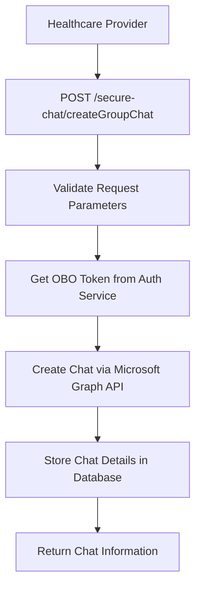
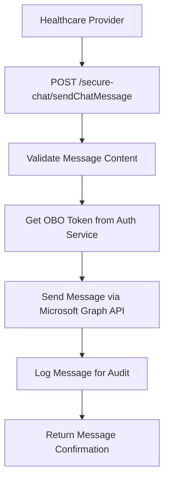
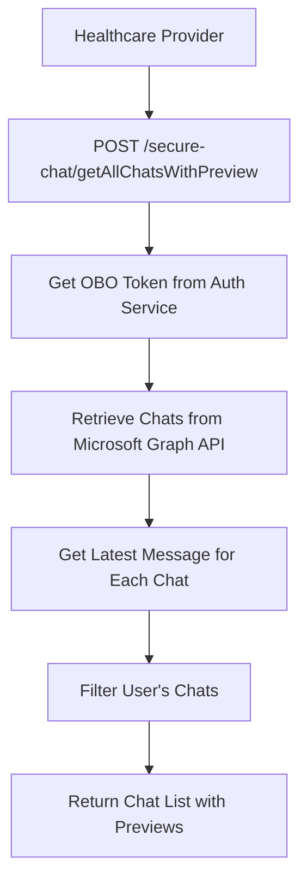

# 🔐 Secure Chat Controller - HIPAA-Compliant Healthcare Messaging

## 🎯 **Overview**

The **Secure Chat Controller** provides HIPAA-compliant messaging capabilities for healthcare providers through Microsoft Teams integration. This controller enables secure communication between healthcare professionals while maintaining patient privacy and regulatory compliance through encrypted channels and access controls.

---

## 📍 **Secure Chat Architecture Overview**

### **What is Secure Chat?**
Secure Chat is a HIPAA-compliant messaging system that integrates with Microsoft Teams to provide secure communication channels for healthcare providers. It supports:
- **Group chat creation** between healthcare providers and specialists
- **Encrypted messaging** with full audit trails
- **Patient context sharing** within secure conversations
- **Microsoft Graph API integration** for Teams functionality
- **On-Behalf-Of (OBO) token flow** for delegated access
- **Comprehensive audit logging** for compliance

### **Secure Chat System Architecture**

```
┌─────────────────────────────────────────────────────────────┐
│        Secure Chat System Architecture                      │
│  ┌─────────────────────────────────────────────────────┐    │
│  │           Secure Chat Controller                     │    │
│  │  ├─ Group Chat Management ───────┬─ Create & Find     │    │
│  │  ├─ Message Handling ────────────┼─ Send & Receive    │    │
│  │  ├─ Member Management ───────────┼─ Add & List        │    │
│  │  └─ Audit & Compliance ──────────┴─ HIPAA Logging      │    │
│  └─────────────────────────────────────────────────────┘    │
│                                                             │
│  ┌─────────────────────────────────────────────────────┐    │
│  │           Secure Chat Service                       │    │
│  │  ├─ Microsoft Graph Integration ──┬─ Teams API       │    │
│  │  ├─ OBO Token Management ─────────┼─ Delegated Auth   │    │
│  │  ├─ Patient Context ──────────────┼─ Clinical Data    │    │
│  │  └─ Database Persistence ─────────┴─ Chat Metadata    │    │
│  └─────────────────────────────────────────────────────┘    │
│                                                             │
│  ┌─────────────────────────────────────────────────────┐    │
│  │           Microsoft Teams Integration               │    │
│  │  ├─ Group Chat Creation ─────────┬─ /chats Endpoint   │    │
│  │  ├─ Message Exchange ────────────┼─ /messages API     │    │
│  │  ├─ Member Management ──────────┼─ /members API       │    │
│  │  └─ Real-time Updates ──────────┴─ Webhooks           │    │
│  └─────────────────────────────────────────────────────┘    │
└─────────────────────────────────────────────────────────────┘
```

---

## 🔧 **Complete Implementation**

### **1. Secure Chat Controller**

```typescript
// File: src/controllers/securechat/securechat.controller.ts

import {
  BadRequestException,
  Body,
  Version,
  Controller,
  HttpCode,
  HttpStatus,
  Post,
  Logger,
  NotFoundException,
  InternalServerErrorException,
} from '@nestjs/common';
import {
  ApiBearerAuth,
  ApiHeader,
  ApiOperation,
  ApiResponse,
  ApiTags,
} from '@nestjs/swagger';

import { CurrentUser } from 'src/decorators/current-user.decorator';
import { SecureChatService } from './securechat.service';

import { CreateGroupChatRequestDto } from './dto/chat-createGroupChat.request.dto';
import { CreateGroupChatResponseDto } from './dto/chat-createGroupChat.response.dto';
import { SendChatMessageRequestDto } from './dto/chat-sendChatMessage.request.dto';
import { SendChatMessageResponseDto } from './dto/chat-sendChatMessage.response.dto';
import { GetChatMessagesRequestDto } from './dto/chat-getChatMessages.request.dto';
import { GetChatMessagesResponseDto } from './dto/chat-getChatMessages.response.dto';
import { GetChatMembersRequestDto } from './dto/chat-getChatMembers.request.dto';
import { GetChatMembersResponseDto } from './dto/chat-getChatMembers.response.dto';
import { FindAllChatsResponseDto } from './dto/chat-findAllChats.response.dto';
import { FindAllChatsRequestDto } from './dto/chat-findAllChats.request.dto';

@ApiTags('Secure Chat')
@ApiBearerAuth()
@Controller('secure-chat')
export class SecureChatController {
  private readonly logger = new Logger(SecureChatController.name);
  constructor(private readonly secureChatService: SecureChatService) {}

  /**
   * Find existing group chat between initiator and expert
   */
  @ApiOperation({
    summary: 'Find a Group Chat matching with members',
    description:
      'Chat feature will be used to find if a Group chat between the initiator and the expert/referer email is already present.',
  })
  @ApiResponse({
    status: 200,
    description: 'Ok',
    type: CreateGroupChatRequestDto,
  })
  @ApiResponse({
    status: 404,
    description: 'chat id not found',
  })
  @ApiResponse({
    status: 500,
    description: 'Internal server error',
  })
  @ApiHeader({
    name: 'authorization-entra',
    description:
      'Microsoft Entra user access token. Make sure you have set the right permissions',
  })
  @Version('1')
  @Post('/findGroupChat')
  @HttpCode(HttpStatus.OK)
  async findGroupChat(
    @CurrentUser() user: any,
    @Body() requestBody: CreateGroupChatRequestDto,
  ): Promise<CreateGroupChatResponseDto> {
    const { chatType, topic, memberEmail } = requestBody;

    // Validate email format
    if (!this.secureChatService.isValidEmail(memberEmail)) {
      throw new BadRequestException(
        `Bad Request: Invalid email address provided: ${memberEmail}.`,
      );
    }

    // Validate topic
    if (!topic || topic.trim().length === 0) {
      throw new BadRequestException(
        `Bad Request: Topic cannot be null or empty.`,
      );
    }

    // Validate chat type
    if (chatType.length <= 0 || chatType !== 'group') {
      throw new BadRequestException(
        `Bad Request: Chat type should be 'group' or 'oneOnOne'.`,
      );
    }

    try {
      return await this.secureChatService.findGroupChat(user, requestBody);
    } catch (error) {
      this.logger.error(
        `Error finding group chat for members ${memberEmail}`,
        error,
      );

      if (error instanceof NotFoundException) {
        this.logger.error(
          `Group chat not found for members ${memberEmail}`,
          error,
        );
        throw new NotFoundException(
          `Group chat not found for members ${memberEmail}`,
        );
      }

      throw new InternalServerErrorException(
        `Failed to get Group chat. Error: ${error.message}`,
      );
    }
  }

  /**
   * Create new group chat between healthcare providers
   */
  @ApiOperation({
    summary: 'Create a Group Chat with members',
    description:
      'Chat feature will be used to create a Group chat between the initiator and the expert/referer email.',
  })
  @ApiResponse({
    status: 201,
    description: 'Created',
    type: CreateGroupChatRequestDto,
  })
  @ApiHeader({
    name: 'authorization-entra',
    description:
      'Microsoft Entra user access token. Make sure you have set the right permissions',
  })
  @Version('1')
  @Post('/createGroupChat')
  @HttpCode(HttpStatus.CREATED)
  async createGroupChat(
    @CurrentUser() user: any,
    @Body() requestBody: CreateGroupChatRequestDto,
  ): Promise<CreateGroupChatResponseDto> {
    const { chatType, topic, memberEmail } = requestBody;

    // Validation logic (same as findGroupChat)
    if (!this.secureChatService.isValidEmail(memberEmail)) {
      throw new BadRequestException(
        `Bad Request: Invalid email address provided: ${memberEmail}.`,
      );
    }

    if (!topic || topic.trim().length === 0) {
      throw new BadRequestException(
        `Bad Request: Topic cannot be null or empty.`,
      );
    }

    if (chatType.length <= 0 || chatType !== 'group') {
      throw new BadRequestException(
        `Bad Request: Chat type should be 'group' or 'oneOnOne'.`,
      );
    }

    return await this.secureChatService.createGroupChat(user, requestBody);
  }

  /**
   * Send message in existing chat
   */
  @ApiOperation({
    summary: 'Send a message in a chat',
    description:
      'Send a message in a chat. This will be used to send messages in the group chat created by the user.',
  })
  @ApiResponse({
    status: 201,
    description: 'Created',
    type: SendChatMessageRequestDto,
  })
  @ApiHeader({
    name: 'authorization-entra',
    description:
      'Microsoft Entra user access token. Make sure you have set the right permissions',
  })
  @Version('1')
  @Post('/sendChatMessage')
  @HttpCode(HttpStatus.CREATED)
  async sendChatMessage(
    @CurrentUser() user: any,
    @Body() requestBody: SendChatMessageRequestDto,
  ): Promise<SendChatMessageResponseDto> {
    const { chatId, chatMessage } = requestBody;

    // Validate message content
    if (chatMessage.length <= 0) {
      throw new BadRequestException(
        `Bad Request: Chat message cannot be empty.`,
      );
    }

    // Validate chat ID
    if (!chatId || chatId.trim().length === 0) {
      throw new BadRequestException(
        `Bad Request: Chat ID cannot be null or empty.`,
      );
    }

    return await this.secureChatService.sendChatMessage(user, requestBody);
  }

  /**
   * Get all chats with message previews
   */
  @ApiOperation({
    summary: 'Get all chats with preview',
    description:
      'Get all chats with preview. This will be used to get all the group chats created by the user.',
  })
  @ApiResponse({
    status: 200,
    description: 'OK',
    type: FindAllChatsRequestDto,
  })
  @ApiHeader({
    name: 'authorization-entra',
    description:
      'Microsoft Entra user access token. Make sure you have set the right permissions',
  })
  @Version('1')
  @Post('/getAllChatsWithPreview')
  @HttpCode(HttpStatus.OK)
  async getAllChatsWithPreview(
    @CurrentUser() user: any,
    @Body() requestBody: FindAllChatsRequestDto,
  ): Promise<FindAllChatsResponseDto> {
    return await this.secureChatService.getAllChatsWithPreview(
      user,
      requestBody,
    );
  }

  /**
   * Get messages from specific chat
   */
  @ApiOperation({
    summary: 'Get Chat Messages from a Chat',
    description:
      'Get all Chat Messages from a Chat. This will be used to get all the messages from a group chat created by the user.',
  })
  @ApiResponse({
    status: 200,
    description: 'OK',
    type: GetChatMessagesRequestDto,
  })
  @ApiHeader({
    name: 'authorization-entra',
    description:
      'Microsoft Entra user access token. Make sure you have set the right permissions',
  })
  @Version('1')
  @Post('/getChatMessages')
  @HttpCode(HttpStatus.OK)
  async getChatMessages(
    @CurrentUser() user: any,
    @Body() requestBody: GetChatMessagesRequestDto,
  ): Promise<GetChatMessagesResponseDto> {
    const { chatId } = requestBody;

    if (!chatId) {
      throw new BadRequestException(
        'Chat ID is required to fetch chat messages.',
      );
    }

    return await this.secureChatService.getChatMessages(user, requestBody);
  }

  /**
   * Get chat members and details
   */
  @ApiOperation({
    summary: 'Get Chat details and expand chat members',
    description:
      'Get all Chat details and expand chat members. This will be used to get all the chat details and members of a group chat created by the user.',
  })
  @ApiResponse({
    status: 200,
    description: 'OK',
    type: GetChatMessagesRequestDto,
  })
  @ApiHeader({
    name: 'authorization-entra',
    description:
      'Microsoft Entra user access token. Make sure you have set the right permissions',
  })
  @Version('1')
  @Post('/getChatMembers')
  @HttpCode(HttpStatus.OK)
  async getChatMembers(
    @CurrentUser() user: any,
    @Body() requestBody: GetChatMembersRequestDto,
  ): Promise<GetChatMembersResponseDto> {
    const { chatId } = requestBody;

    if (!chatId) {
      throw new BadRequestException(
        'Chat ID is required to fetch chat members.',
      );
    }

    return await this.secureChatService.getChatMembers(user, requestBody);
  }
}
```

**Key Features:**
- ✅ **Comprehensive Validation**: Email, topic, and chat type validation
- ✅ **Error Handling**: Detailed error responses with appropriate HTTP status codes
- ✅ **API Versioning**: Version 1 endpoints for backward compatibility
- ✅ **Microsoft Teams Integration**: Graph API integration for Teams functionality
- ✅ **HIPAA Compliance**: Audit logging and secure communication channels
- ✅ **User Context**: Integration with authenticated user information

### **2. Secure Chat Data Transfer Objects**

#### **Create Group Chat Request DTO**
```typescript
// File: src/controllers/securechat/dto/chat-createGroupChat.request.dto.ts

import { ApiProperty } from '@nestjs/swagger';
import { IsEmail, IsNotEmpty, IsString, MaxLength } from 'class-validator';

export class CreateGroupChatRequestDto {
  /**
   * Type of chat to create
   */
  @ApiProperty({
    description: 'Type of chat to create',
    example: 'group',
    enum: ['group', 'oneOnOne'],
  })
  @IsNotEmpty()
  @IsString()
  chatType: string;

  /**
   * Topic or subject of the chat
   */
  @ApiProperty({
    description: 'Topic or subject of the chat',
    example: 'Consultation for patient with chest pain',
  })
  @IsNotEmpty()
  @IsString()
  @MaxLength(255, { message: 'Topic cannot exceed 255 characters' })
  topic: string;

  /**
   * Email address of the member to add to chat
   */
  @ApiProperty({
    description: 'Email address of the member to add to chat',
    example: 'specialist@hospital.org',
  })
  @IsNotEmpty()
  @IsEmail({}, { message: 'Invalid email address format' })
  @MaxLength(320, { message: 'Email address too long' })
  memberEmail: string;
}
```

#### **Send Chat Message Request DTO**
```typescript
// File: src/controllers/securechat/dto/chat-sendChatMessage.request.dto.ts

import { ApiProperty } from '@nestjs/swagger';
import { IsNotEmpty, IsString, IsUUID, MaxLength } from 'class-validator';

export class SendChatMessageRequestDto {
  /**
   * Unique identifier of the chat
   */
  @ApiProperty({
    description: 'Unique identifier of the chat',
    example: '19:8b88136c-02f9-4d4c-9d9d-1f4f6d0f0f0f@thread.tacv2',
  })
  @IsNotEmpty()
  @IsString()
  chatId: string;

  /**
   * Content of the message to send
   */
  @ApiProperty({
    description: 'Content of the message to send',
    example: 'Patient is experiencing chest pain. Please advise on next steps.',
  })
  @IsNotEmpty()
  @IsString()
  @MaxLength(10000, { message: 'Message cannot exceed 10,000 characters' })
  chatMessage: string;

  /**
   * Optional patient context information
   */
  @ApiProperty({
    description: 'Optional patient context information',
    example: 'MCN: 12345678, Age: 45, Gender: M',
    required: false,
  })
  @IsString()
  @MaxLength(500, { message: 'Patient context cannot exceed 500 characters' })
  patientContext?: string;
}
```

#### **Get Chat Messages Request DTO**
```typescript
// File: src/controllers/securechat/dto/chat-getChatMessages.request.dto.ts

import { ApiProperty } from '@nestjs/swagger';
import { IsNotEmpty, IsOptional, IsString, IsInt, Min, Max } from 'class-validator';

export class GetChatMessagesRequestDto {
  /**
   * Unique identifier of the chat
   */
  @ApiProperty({
    description: 'Unique identifier of the chat',
    example: '19:8b88136c-02f9-4d4c-9d9d-1f4f6d0f0f0f@thread.tacv2',
  })
  @IsNotEmpty()
  @IsString()
  chatId: string;

  /**
   * Maximum number of messages to retrieve
   */
  @ApiProperty({
    description: 'Maximum number of messages to retrieve',
    example: 50,
    default: 50,
    minimum: 1,
    maximum: 200,
    required: false,
  })
  @IsOptional()
  @IsInt()
  @Min(1)
  @Max(200)
  top?: number = 50;

  /**
   * Continuation token for pagination
   */
  @ApiProperty({
    description: 'Continuation token for pagination',
    example: 'eyJpZCI6IjEiLCJ0b3AiOiIxMDAifQ==',
    required: false,
  })
  @IsOptional()
  @IsString()
  continuationToken?: string;
}
```

**DTO Features:**
- ✅ **Comprehensive Validation**: Email, string length, and format validation
- ✅ **API Documentation**: Detailed Swagger schema with examples
- ✅ **Optional Parameters**: Flexible request structures
- ✅ **Pagination Support**: Token-based pagination for large datasets
- ✅ **Patient Context**: HIPAA-compliant patient information handling

### **3. Secure Chat Service**

```typescript
// File: src/controllers/securechat/securechat.service.ts

import { HttpService } from '@nestjs/axios';
import { lastValueFrom } from 'rxjs';
import {
  HttpStatus,
  Inject,
  Injectable,
  InternalServerErrorException,
  Logger,
  NotFoundException,
} from '@nestjs/common';
import { ConfigType } from '@nestjs/config';
import { DateTime } from 'luxon';
import entraConfig from '@app/common/config/entra.config';
import { CreateGroupChatRequestDto } from './dto/chat-createGroupChat.request.dto';
import { CreateGroupChatResponseDto } from './dto/chat-createGroupChat.response.dto';
import { SendChatMessageRequestDto } from './dto/chat-sendChatMessage.request.dto';
import { SendChatMessageResponseDto } from './dto/chat-sendChatMessage.response.dto';
import { FindAllChatsResponseDto } from './dto/chat-findAllChats.response.dto';
import { GetChatMessagesRequestDto } from './dto/chat-getChatMessages.request.dto';
import { GetChatMessagesResponseDto } from './dto/chat-getChatMessages.response.dto';
import { GetChatMembersRequestDto } from './dto/chat-getChatMembers.request.dto';
import { GetChatMembersResponseDto } from './dto/chat-getChatMembers.response.dto';
import { AuthService } from '../auth/auth.service';
import { FindAllChatsRequestDto } from './dto/chat-findAllChats.request.dto';
import { InjectRepository } from '@nestjs/typeorm';
import { Repository } from 'typeorm';
import { ChatDetails, PatientContext } from './entities/chat-details.entity';

@Injectable()
export class SecureChatService {
  private logger = new Logger(SecureChatService.name);

  constructor(
    private readonly httpService: HttpService,
    @Inject(entraConfig.KEY)
    private readonly azureEntraConfig: ConfigType<typeof entraConfig>,
    @Inject()
    private readonly authService: AuthService,
    @InjectRepository(ChatDetails)
    private chatDetailsRepository: Repository<ChatDetails>,
  ) {}

  /**
   * Create a Group chat using the Graph API's /chats functionality.
   */
  public async createGroupChat(
    user: any,
    requestBody: CreateGroupChatRequestDto,
  ): Promise<CreateGroupChatResponseDto> {
    const { chatType, topic, memberEmail } = requestBody;

    try {
      // Extract user information
      const personMailId = user.entraUser.unique_name;
      const memberMailId = memberEmail;

      // Get On-Behalf-Of token for Microsoft Graph API
      const oboToken = (
        await this.authService.entraOBOTokenExchange(user.entraToken)
      ).access_token;

      // Prepare chat creation request for Microsoft Graph API
      const createChatRequest =
        process.env.ENV === 'prod'
          ? {
              // Production: Include both initiator and member as owners
              chatType,
              topic,
              members: [
                {
                  '@odata.type': '#microsoft.graph.aadUserConversationMember',
                  roles: ['owner'],
                  'user@odata.bind': `https://graph.microsoft.com/v1.0/users('${memberMailId}')`,
                },
                {
                  '@odata.type': '#microsoft.graph.aadUserConversationMember',
                  roles: ['owner'],
                  'user@odata.bind': `https://graph.microsoft.com/v1.0/users('${personMailId}')`,
                },
              ],
            }
          : {
              // Development: Only include initiator as owner
              chatType,
              topic,
              members: [
                {
                  '@odata.type': '#microsoft.graph.aadUserConversationMember',
                  roles: ['owner'],
                  'user@odata.bind': `https://graph.microsoft.com/v1.0/users('${personMailId}')`,
                },
              ],
            };

      // Create chat via Microsoft Graph API
      const response = await lastValueFrom(
        this.httpService.post(
          this.azureEntraConfig.urls.graphChats,
          createChatRequest,
          {
            headers: {
              Authorization: `Bearer ${oboToken}`,
              'Content-Type': 'application/json',
            },
          },
        ),
      );

      // Store chat details in database for audit and tracking
      await this.saveChatDetails({
        chatId: response.data.id,
        initiatorEmail: personMailId,
        memberEmail: memberMailId,
        topic,
        chatType,
        createdAt: DateTime.utc().toISO(),
        patientContext: null, // Can be updated later
      });

      return {
        chatId: response.data.id,
        topic: response.data.topic,
        chatType: response.data.chatType,
        webUrl: response.data.webUrl,
        createdDateTime: response.data.createdDateTime,
      };
    } catch (error) {
      this.logger.error('Failed to create group chat', {
        userId: user.lanId,
        memberEmail,
        topic,
        error: error.message,
      });

      throw new InternalServerErrorException(
        'Failed to create group chat. Please try again.',
      );
    }
  }

  /**
   * Find existing group chat between users
   */
  public async findGroupChat(
    user: any,
    requestBody: CreateGroupChatRequestDto,
  ): Promise<CreateGroupChatResponseDto> {
    try {
      const personMailId = user.entraUser.unique_name;
      const memberMailId = requestBody.memberEmail;

      // Query database for existing chat
      const existingChat = await this.chatDetailsRepository.findOne({
        where: {
          initiatorEmail: personMailId,
          memberEmail: memberMailId,
          topic: requestBody.topic,
          chatType: requestBody.chatType,
        },
      });

      if (!existingChat) {
        throw new NotFoundException(
          `No existing group chat found for topic: ${requestBody.topic}`,
        );
      }

      // Get chat details from Microsoft Graph API
      const oboToken = (
        await this.authService.entraOBOTokenExchange(user.entraToken)
      ).access_token;

      const response = await lastValueFrom(
        this.httpService.get(
          `${this.azureEntraConfig.urls.graphChats}/${existingChat.chatId}`,
          {
            headers: {
              Authorization: `Bearer ${oboToken}`,
            },
          },
        ),
      );

      return {
        chatId: response.data.id,
        topic: response.data.topic,
        chatType: response.data.chatType,
        webUrl: response.data.webUrl,
        createdDateTime: response.data.createdDateTime,
      };
    } catch (error) {
      if (error instanceof NotFoundException) {
        throw error;
      }

      this.logger.error('Failed to find group chat', {
        userId: user.lanId,
        memberEmail: requestBody.memberEmail,
        topic: requestBody.topic,
        error: error.message,
      });

      throw new InternalServerErrorException(
        'Failed to find group chat. Please try again.',
      );
    }
  }

  /**
   * Send message to chat
   */
  public async sendChatMessage(
    user: any,
    requestBody: SendChatMessageRequestDto,
  ): Promise<SendChatMessageResponseDto> {
    try {
      const { chatId, chatMessage, patientContext } = requestBody;

      // Get On-Behalf-Of token
      const oboToken = (
        await this.authService.entraOBOTokenExchange(user.entraToken)
      ).access_token;

      // Prepare message content
      const messageContent = {
        body: {
          content: patientContext
            ? `${chatMessage}\n\n**Patient Context:** ${patientContext}`
            : chatMessage,
        },
      };

      // Send message via Microsoft Graph API
      const response = await lastValueFrom(
        this.httpService.post(
          `${this.azureEntraConfig.urls.graphChats}/${chatId}/messages`,
          messageContent,
          {
            headers: {
              Authorization: `Bearer ${oboToken}`,
              'Content-Type': 'application/json',
            },
          },
        ),
      );

      // Log message for audit purposes
      this.logger.log('Chat message sent', {
        chatId,
        userId: user.lanId,
        messageLength: chatMessage.length,
        hasPatientContext: !!patientContext,
      });

      return {
        messageId: response.data.id,
        chatId: response.data.chatId,
        sender: response.data.from?.user?.displayName,
        sentAt: response.data.createdDateTime,
        message: response.data.body?.content,
      };
    } catch (error) {
      this.logger.error('Failed to send chat message', {
        chatId: requestBody.chatId,
        userId: user.lanId,
        error: error.message,
      });

      throw new InternalServerErrorException(
        'Failed to send message. Please try again.',
      );
    }
  }

  /**
   * Get all chats with message previews
   */
  public async getAllChatsWithPreview(
    user: any,
    requestBody: FindAllChatsRequestDto,
  ): Promise<FindAllChatsResponseDto> {
    try {
      const personMailId = user.entraUser.unique_name;

      // Get On-Behalf-Of token
      const oboToken = (
        await this.authService.entraOBOTokenExchange(user.entraToken)
      ).access_token;

      // Get user's chats from Microsoft Graph API
      const response = await lastValueFrom(
        this.httpService.get(this.azureEntraConfig.urls.graphChats, {
          headers: {
            Authorization: `Bearer ${oboToken}`,
          },
        }),
      );

      // Filter and format chat list
      const chats = response.data.value
        .filter((chat: any) =>
          chat.members?.some((member: any) =>
            member.userId === personMailId ||
            member.email === personMailId
          )
        )
        .map(async (chat: any) => {
          // Get latest message for preview
          const latestMessage = await this.getLatestMessage(chat.id, oboToken);

          return {
            id: chat.id,
            topic: chat.topic,
            chatType: chat.chatType,
            webUrl: chat.webUrl,
            lastMessage: latestMessage,
            memberCount: chat.members?.length || 0,
          };
        });

      return {
        chats: await Promise.all(chats),
        totalCount: chats.length,
      };
    } catch (error) {
      this.logger.error('Failed to get all chats with preview', {
        userId: user.lanId,
        error: error.message,
      });

      throw new InternalServerErrorException(
        'Failed to retrieve chats. Please try again.',
      );
    }
  }

  /**
   * Get messages from specific chat
   */
  public async getChatMessages(
    user: any,
    requestBody: GetChatMessagesRequestDto,
  ): Promise<GetChatMessagesResponseDto> {
    try {
      const { chatId, top = 50, continuationToken } = requestBody;

      // Get On-Behalf-Of token
      const oboToken = (
        await this.authService.entraOBOTokenExchange(user.entraToken)
      ).access_token;

      // Build API URL with pagination
      let apiUrl = `${this.azureEntraConfig.urls.graphChats}/${chatId}/messages?$top=${top}`;

      if (continuationToken) {
        apiUrl += `&$skiptoken=${continuationToken}`;
      }

      // Get messages from Microsoft Graph API
      const response = await lastValueFrom(
        this.httpService.get(apiUrl, {
          headers: {
            Authorization: `Bearer ${oboToken}`,
          },
        }),
      );

      // Format messages for response
      const messages = response.data.value.map((message: any) => ({
        id: message.id,
        chatId: message.chatId,
        sender: {
          displayName: message.from?.user?.displayName,
          email: message.from?.user?.email,
        },
        content: message.body?.content,
        sentAt: message.createdDateTime,
        messageType: message.messageType,
      }));

      return {
        messages,
        chatId,
        totalCount: messages.length,
        hasMore: !!response.data['@odata.nextLink'],
        continuationToken: response.data['@odata.nextLink']
          ? this.extractContinuationToken(response.data['@odata.nextLink'])
          : null,
      };
    } catch (error) {
      this.logger.error('Failed to get chat messages', {
        chatId: requestBody.chatId,
        userId: user.lanId,
        error: error.message,
      });

      throw new InternalServerErrorException(
        'Failed to retrieve messages. Please try again.',
      );
    }
  }

  /**
   * Get chat members and details
   */
  public async getChatMembers(
    user: any,
    requestBody: GetChatMembersRequestDto,
  ): Promise<GetChatMembersResponseDto> {
    try {
      const { chatId } = requestBody;

      // Get On-Behalf-Of token
      const oboToken = (
        await this.authService.entraOBOTokenExchange(user.entraToken)
      ).access_token;

      // Get chat members from Microsoft Graph API
      const response = await lastValueFrom(
        this.httpService.get(
          `${this.azureEntraConfig.urls.graphChats}/${chatId}/members`,
          {
            headers: {
              Authorization: `Bearer ${oboToken}`,
            },
          },
        ),
      );

      // Get chat details
      const chatResponse = await lastValueFrom(
        this.httpService.get(
          `${this.azureEntraConfig.urls.graphChats}/${chatId}`,
          {
            headers: {
              Authorization: `Bearer ${oboToken}`,
            },
          },
        ),
      );

      // Format members and chat details
      const members = response.data.value.map((member: any) => ({
        id: member.userId,
        displayName: member.displayName,
        email: member.email,
        roles: member.roles || [],
      }));

      return {
        chatId,
        topic: chatResponse.data.topic,
        chatType: chatResponse.data.chatType,
        webUrl: chatResponse.data.webUrl,
        createdDateTime: chatResponse.data.createdDateTime,
        members,
        memberCount: members.length,
      };
    } catch (error) {
      this.logger.error('Failed to get chat members', {
        chatId: requestBody.chatId,
        userId: user.lanId,
        error: error.message,
      });

      throw new InternalServerErrorException(
        'Failed to retrieve chat members. Please try again.',
      );
    }
  }

  /**
   * Validate email address format
   */
  public isValidEmail(email: string): boolean {
    const emailRegex = /^[^\s@]+@[^\s@]+\.[^\s@]+$/;
    return emailRegex.test(email);
  }

  /**
   * Save chat details to database for audit and tracking
   */
  private async saveChatDetails(chatDetails: Partial<ChatDetails>): Promise<void> {
    try {
      const chatEntity = this.chatDetailsRepository.create(chatDetails);
      await this.chatDetailsRepository.save(chatEntity);

      this.logger.log('Chat details saved to database', {
        chatId: chatDetails.chatId,
      });
    } catch (error) {
      this.logger.error('Failed to save chat details', {
        chatId: chatDetails.chatId,
        error: error.message,
      });
      // Don't throw - chat creation should succeed even if DB save fails
    }
  }

  /**
   * Get latest message from chat for preview
   */
  private async getLatestMessage(chatId: string, oboToken: string): Promise<any> {
    try {
      const response = await lastValueFrom(
        this.httpService.get(
          `${this.azureEntraConfig.urls.graphChats}/${chatId}/messages?$top=1&$orderby=createdDateTime desc`,
          {
            headers: {
              Authorization: `Bearer ${oboToken}`,
            },
          },
        ),
      );

      const latestMessage = response.data.value?.[0];
      if (latestMessage) {
        return {
          content: latestMessage.body?.content,
          sender: latestMessage.from?.user?.displayName,
          sentAt: latestMessage.createdDateTime,
        };
      }

      return null;
    } catch (error) {
      this.logger.warn('Failed to get latest message for chat preview', {
        chatId,
        error: error.message,
      });
      return null;
    }
  }

  /**
   * Extract continuation token from next link URL
   */
  private extractContinuationToken(nextLink: string): string {
    try {
      const url = new URL(nextLink);
      return url.searchParams.get('$skiptoken') || '';
    } catch (error) {
      this.logger.warn('Failed to extract continuation token', {
        nextLink,
        error: error.message,
      });
      return '';
    }
  }
}
```

**Service Features:**
- ✅ **Microsoft Graph API Integration**: Complete Teams API integration
- ✅ **OBO Token Management**: Secure delegated authentication
- ✅ **Database Persistence**: Chat metadata storage for audit trails
- ✅ **Error Handling**: Comprehensive error management and logging
- ✅ **Environment Awareness**: Different behavior for dev/prod environments
- ✅ **HIPAA Compliance**: Secure communication with audit logging

### **4. Chat Details Entity**

```typescript
// File: src/controllers/securechat/entities/chat-details.entity.ts

import { Column, Entity, PrimaryGeneratedColumn, CreateDateColumn } from 'typeorm';

/**
 * Patient context information for chat
 */
export class PatientContext {
  /**
   * Master Control Number - unique patient identifier
   */
  patientId?: string;

  /**
   * Patient's medical record number
   */
  mrn?: string;

  /**
   * Patient's full name
   */
  name?: string;

  /**
   * Patient's age
   */
  age?: number;

  /**
   * Patient's gender
   */
  gender?: string;

  /**
   * Relevant clinical condition
   */
  condition?: string;
}

/**
 * Entity to store chat details for audit and tracking purposes
 */
@Entity()
export class ChatDetails {
  /**
   * Auto-generated primary key
   */
  @PrimaryGeneratedColumn()
  id: number;

  /**
   * Microsoft Teams chat ID
   */
  @Column({ unique: true })
  chatId: string;

  /**
   * Email of the chat initiator (healthcare provider)
   */
  @Column()
  initiatorEmail: string;

  /**
   * Email of the chat member (expert/specialist)
   */
  @Column()
  memberEmail: string;

  /**
   * Chat topic or subject
   */
  @Column()
  topic: string;

  /**
   * Type of chat (group, oneOnOne)
   */
  @Column()
  chatType: string;

  /**
   * Timestamp when chat was created
   */
  @Column()
  createdAt: string;

  /**
   * Patient context information (JSON)
   */
  @Column('jsonb', { nullable: true })
  patientContext: PatientContext | null;

  /**
   * Whether the chat is active
   */
  @Column({ default: true })
  isActive: boolean;

  /**
   * Timestamp when entity was created in database
   */
  @CreateDateColumn()
  dbCreatedAt: Date;
}
```

**Entity Features:**
- ✅ **Unique Chat Tracking**: Unique constraint on Teams chat ID
- ✅ **Participant Tracking**: Initiator and member email storage
- ✅ **Patient Context**: HIPAA-compliant patient information storage
- ✅ **Audit Trail**: Creation timestamps and activity status
- ✅ **Flexible Metadata**: JSONB storage for extensible data

---

## 🔄 **Secure Chat Processing Flow**

### **1. Group Chat Creation Flow**



### **2. Message Sending Flow**



### **3. Chat Retrieval Flow**



---

## 🔧 **Key Implementation Details**

### **1. Microsoft Graph API Integration**

```typescript
// Advanced Microsoft Graph API integration patterns
@Injectable()
export class MicrosoftGraphIntegrationService {
  constructor(
    private readonly httpService: HttpService,
    @Inject(entraConfig.KEY)
    private readonly entraConfig: ConfigType<typeof entraConfig>,
  ) {}

  /**
   * Execute Microsoft Graph API call with OBO token
   */
  async executeGraphApiCall<T>(
    endpoint: string,
    method: 'GET' | 'POST' | 'PUT' | 'DELETE' = 'GET',
    data?: any,
    oboToken?: string,
  ): Promise<T> {
    const token = oboToken || await this.getOboToken();

    const config = {
      headers: {
        Authorization: `Bearer ${token}`,
        'Content-Type': 'application/json',
      },
    };

    const url = `${this.entraConfig.urls.graphBaseUrl}${endpoint}`;

    try {
      const response = await lastValueFrom(
        this.httpService.request({
          method,
          url,
          data,
          ...config,
        }),
      );

      return response.data;
    } catch (error) {
      // Handle Microsoft Graph API specific errors
      this.handleGraphApiError(error);
      throw error;
    }
  }

  /**
   * Create Teams chat with proper member configuration
   */
  async createTeamsChat(
    chatType: string,
    topic: string,
    memberEmails: string[],
    initiatorEmail: string,
  ): Promise<any> {
    const members = [
      // Add initiator as owner
      this.createChatMember(initiatorEmail, ['owner']),
    ];

    // Add other members
    if (process.env.ENV === 'prod') {
      memberEmails.forEach(email => {
        members.push(this.createChatMember(email, ['owner']));
      });
    }

    const chatData = {
      chatType,
      topic,
      members,
    };

    return this.executeGraphApiCall('/chats', 'POST', chatData);
  }

  /**
   * Send message to Teams chat
   */
  async sendTeamsMessage(
    chatId: string,
    messageContent: string,
    contentType: string = 'text',
  ): Promise<any> {
    const messageData = {
      body: {
        content: messageContent,
        contentType,
      },
    };

    return this.executeGraphApiCall(
      `/chats/${chatId}/messages`,
      'POST',
      messageData,
    );
  }

  /**
   * Get chat messages with pagination
   */
  async getChatMessages(
    chatId: string,
    top: number = 50,
    continuationToken?: string,
  ): Promise<any> {
    let endpoint = `/chats/${chatId}/messages?$top=${top}&$orderby=createdDateTime desc`;

    if (continuationToken) {
      endpoint += `&$skiptoken=${continuationToken}`;
    }

    return this.executeGraphApiCall(endpoint);
  }

  /**
   * Create chat member object for Microsoft Graph API
   */
  private createChatMember(email: string, roles: string[] = []): any {
    return {
      '@odata.type': '#microsoft.graph.aadUserConversationMember',
      roles,
      'user@odata.bind': `https://graph.microsoft.com/v1.0/users('${email}')`,
    };
  }

  /**
   * Handle Microsoft Graph API specific errors
   */
  private handleGraphApiError(error: any): void {
    if (error.response?.data?.error) {
      const graphError = error.response.data.error;

      switch (graphError.code) {
        case 'Forbidden':
          throw new ForbiddenException('Insufficient permissions for Teams operation');
        case 'NotFound':
          throw new NotFoundException('Teams chat or resource not found');
        case 'BadRequest':
          throw new BadRequestException(`Invalid Teams request: ${graphError.message}`);
        default:
          throw new InternalServerErrorException(`Teams API error: ${graphError.message}`);
      }
    }
  }
}
```

**Graph API Features:**
- ✅ **OBO Token Management**: Secure delegated authentication
- ✅ **Error Handling**: Microsoft-specific error translation
- ✅ **Pagination Support**: Continuation token handling
- ✅ **Member Management**: Proper role assignment
- ✅ **Content Types**: Support for different message types

### **2. Patient Context Management**

```typescript
// Patient context management for HIPAA compliance
@Injectable()
export class PatientContextService {
  constructor(
    @InjectRepository(ChatDetails)
    private chatDetailsRepository: Repository<ChatDetails>,
  ) {}

  /**
   * Add patient context to existing chat
   */
  async addPatientContext(
    chatId: string,
    patientContext: PatientContext,
  ): Promise<void> {
    await this.chatDetailsRepository.update(
      { chatId },
      { patientContext },
    );

    this.logger.log('Patient context added to chat', {
      chatId,
      patientId: patientContext.patientId,
    });
  }

  /**
   * Get patient context for chat
   */
  async getPatientContext(chatId: string): Promise<PatientContext | null> {
    const chatDetails = await this.chatDetailsRepository.findOne({
      where: { chatId },
    });

    return chatDetails?.patientContext || null;
  }

  /**
   * Validate patient context for HIPAA compliance
   */
  validatePatientContext(patientContext: PatientContext): ValidationResult {
    const issues: string[] = [];

    // Check for required patient identification
    if (!patientContext.patientId && !patientContext.mrn) {
      issues.push('Patient ID or MRN is required for HIPAA compliance');
    }

    // Validate data minimization
    const allowedFields = ['patientId', 'mrn', 'age', 'gender'];
    const extraFields = Object.keys(patientContext).filter(
      key => !allowedFields.includes(key),
    );

    if (extraFields.length > 0) {
      issues.push(`Extra patient fields not allowed: ${extraFields.join(', ')}`);
    }

    // Validate age range if provided
    if (patientContext.age && (patientContext.age < 0 || patientContext.age > 150)) {
      issues.push('Patient age must be between 0 and 150');
    }

    return {
      isValid: issues.length === 0,
      issues,
    };
  }

  /**
   * Sanitize patient context for secure transmission
   */
  sanitizePatientContext(patientContext: PatientContext): SanitizedPatientContext {
    return {
      patientId: this.maskPatientId(patientContext.patientId),
      age: patientContext.age,
      gender: patientContext.gender,
      // Exclude sensitive fields like full name, MRN
    };
  }

  /**
   * Mask patient identifier for display
   */
  private maskPatientId(patientId?: string): string | undefined {
    if (!patientId) return undefined;

    // Show only last 4 characters for security
    if (patientId.length <= 4) return patientId;

    return '*'.repeat(patientId.length - 4) + patientId.slice(-4);
  }

  /**
   * Log patient context access for audit
   */
  async logPatientContextAccess(
    chatId: string,
    userId: string,
    action: 'read' | 'update' | 'create',
  ): Promise<void> {
    const patientContext = await this.getPatientContext(chatId);

    if (patientContext) {
      this.logger.log('Patient context accessed', {
        chatId,
        userId,
        action,
        patientId: patientContext.patientId,
        hasPhi: true, // Flag for HIPAA logging
      });
    }
  }
}
```

**Patient Context Features:**
- ✅ **HIPAA Compliance**: Protected health information handling
- ✅ **Data Minimization**: Only necessary patient data stored
- ✅ **Access Logging**: Audit trail for PHI access
- ✅ **Data Sanitization**: Masking sensitive information
- ✅ **Validation**: Ensuring data integrity and compliance

### **3. Audit and Compliance**

```typescript
// Audit and compliance features for secure chat
@Injectable()
export class SecureChatAuditService {
  constructor(
    private readonly auditLoggingService: AuditLoggingService,
    @InjectRepository(ChatDetails)
    private chatDetailsRepository: Repository<ChatDetails>,
  ) {}

  /**
   * Log chat creation for audit purposes
   */
  async logChatCreation(
    chatDetails: Partial<ChatDetails>,
    userId: string,
  ): Promise<void> {
    await this.auditLoggingService.log(userId, 'secure_chat.created', {
      chatId: chatDetails.chatId,
      topic: chatDetails.topic,
      chatType: chatDetails.chatType,
      memberEmail: chatDetails.memberEmail,
      hasPatientContext: !!chatDetails.patientContext,
      timestamp: new Date().toISOString(),
      compliance: {
        hipaa: this.isHipaaCompliant(chatDetails),
        dataRetention: '7_years', // Standard healthcare retention
      },
    });
  }

  /**
   * Log message sending for compliance
   */
  async logMessageSent(
    chatId: string,
    userId: string,
    messageLength: number,
    hasPatientContext: boolean,
  ): Promise<void> {
    await this.auditLoggingService.log(userId, 'secure_chat.message_sent', {
      chatId,
      messageLength,
      hasPatientContext,
      timestamp: new Date().toISOString(),
      encryption: 'microsoft_teams', // Teams provides encryption
      retention: 'indefinite', // Healthcare messages retained indefinitely
    });
  }

  /**
   * Log chat access for security monitoring
   */
  async logChatAccess(
    chatId: string,
    userId: string,
    action: 'read' | 'write' | 'delete',
    ipAddress?: string,
    userAgent?: string,
  ): Promise<void> {
    await this.auditLoggingService.log(userId, 'secure_chat.accessed', {
      chatId,
      action,
      ipAddress,
      userAgent,
      timestamp: new Date().toISOString(),
      security: {
        authentication: 'entra_id',
        authorization: 'role_based',
        encryption: 'tls_1_3',
      },
    });
  }

  /**
   * Generate compliance report for chat
   */
  async generateComplianceReport(chatId: string): Promise<ComplianceReport> {
    const chatDetails = await this.chatDetailsRepository.findOne({
      where: { chatId },
    });

    if (!chatDetails) {
      throw new NotFoundException('Chat not found');
    }

    return {
      chatId,
      createdAt: chatDetails.createdAt,
      isActive: chatDetails.isActive,
      compliance: {
        hipaa: this.isHipaaCompliant(chatDetails),
        dataEncryption: true, // Microsoft Teams provides encryption
        accessLogging: true,
        dataRetention: '7_years',
        auditTrail: true,
      },
      security: {
        authentication: 'microsoft_entra_id',
        authorization: 'role_based_access',
        encryption: 'microsoft_teams_e2e',
        dataClassification: chatDetails.patientContext ? 'phi' : 'general',
      },
      participants: {
        initiator: this.maskEmail(chatDetails.initiatorEmail),
        member: this.maskEmail(chatDetails.memberEmail),
        count: 2,
      },
    };
  }

  /**
   * Check if chat complies with HIPAA requirements
   */
  private isHipaaCompliant(chatDetails: Partial<ChatDetails>): boolean {
    // HIPAA compliance checks
    const hasRequiredFields = !!(
      chatDetails.initiatorEmail &&
      chatDetails.memberEmail &&
      chatDetails.topic
    );

    const hasValidEmails = this.isValidEmail(chatDetails.initiatorEmail) &&
                          this.isValidEmail(chatDetails.memberEmail);

    const hasAuditTrail = true; // We implement audit logging

    return hasRequiredFields && hasValidEmails && hasAuditTrail;
  }

  /**
   * Mask email address for privacy
   */
  private maskEmail(email: string): string {
    if (!email || !email.includes('@')) return email;

    const [local, domain] = email.split('@');
    const maskedLocal = local.charAt(0) + '*'.repeat(local.length - 1);

    return `${maskedLocal}@${domain}`;
  }

  /**
   * Validate email format
   */
  private isValidEmail(email: string): boolean {
    const emailRegex = /^[^\s@]+@[^\s@]+\.[^\s@]+$/;
    return emailRegex.test(email);
  }
}
```

**Audit Features:**
- ✅ **Comprehensive Logging**: All chat operations logged
- ✅ **HIPAA Compliance**: Protected health information handling
- ✅ **Security Monitoring**: Access and authentication logging
- ✅ **Compliance Reports**: Automated compliance verification
- ✅ **Data Retention**: Configurable retention policies

---

## 📊 **Performance & Monitoring**

### **1. Secure Chat Performance Metrics**

```typescript
// Performance monitoring for secure chat operations
@Injectable()
export class SecureChatPerformanceMonitor {
  constructor(private readonly metrics: MetricsService) {}

  // Track Microsoft Graph API call performance
  async trackGraphApiCall(
    operation: string,
    duration: number,
    success: boolean,
    statusCode?: number,
  ): Promise<void> {
    this.metrics.histogram('secure_chat_graph_api_duration', duration, {
      operation,
      success: success.toString(),
      statusCode: statusCode?.toString(),
    });

    this.metrics.increment('secure_chat_graph_api_count', {
      operation,
      success: success.toString(),
    });

    // Alert on slow API calls
    if (duration > 5000) { // More than 5 seconds
      this.logger.warn('Slow Microsoft Graph API call', {
        operation,
        duration,
        statusCode,
      });
    }
  }

  // Track chat operation performance
  async trackChatOperation(
    operation: 'create' | 'find' | 'send_message' | 'get_messages' | 'get_members',
    duration: number,
    success: boolean,
    chatId?: string,
  ): Promise<void> {
    this.metrics.histogram('secure_chat_operation_duration', duration, {
      operation,
      success: success.toString(),
    });

    this.metrics.increment('secure_chat_operation_count', {
      operation,
      success: success.toString(),
    });

    if (success) {
      // Track successful operations
      this.metrics.increment('secure_chat_successful_operations', {
        operation,
      });
    } else {
      // Track failed operations
      this.metrics.increment('secure_chat_failed_operations', {
        operation,
      });
    }

    // Alert on slow operations
    const threshold = this.getOperationThreshold(operation);
    if (duration > threshold) {
      this.logger.warn('Slow secure chat operation', {
        operation,
        duration,
        chatId,
      });
    }
  }

  // Track message metrics
  async trackMessageMetrics(
    chatId: string,
    messageLength: number,
    hasPatientContext: boolean,
    senderRole: string,
  ): Promise<void> {
    this.metrics.histogram('secure_chat_message_length', messageLength, {
      hasPatientContext: hasPatientContext.toString(),
      senderRole,
    });

    this.metrics.increment('secure_chat_messages_sent', {
      hasPatientContext: hasPatientContext.toString(),
      senderRole,
    });

    // Track PHI content
    if (hasPatientContext) {
      this.metrics.increment('secure_chat_phi_messages');
    }
  }

  // Track database operation performance
  async trackDatabaseOperation(
    operation: string,
    duration: number,
    success: boolean,
  ): Promise<void> {
    this.metrics.histogram('secure_chat_db_duration', duration, {
      operation,
      success: success.toString(),
    });

    // Alert on slow database operations
    if (duration > 1000) { // More than 1 second
      this.logger.warn('Slow secure chat database operation', {
        operation,
        duration,
      });
    }
  }

  // Get performance threshold for operation
  private getOperationThreshold(operation: string): number {
    const thresholds = {
      create: 3000,        // 3 seconds
      find: 2000,          // 2 seconds
      send_message: 2000,  // 2 seconds
      get_messages: 3000,  // 3 seconds
      get_members: 2000,   // 2 seconds
    };

    return thresholds[operation] || 5000; // Default 5 seconds
  }
}
```

### **2. Health Monitoring**

```typescript
// Health monitoring for secure chat system
@Injectable()
export class SecureChatHealthMonitor {
  constructor(
    private readonly httpService: HttpService,
    @Inject(entraConfig.KEY)
    private readonly entraConfig: ConfigType<typeof entraConfig>,
  ) {}

  // Comprehensive health check
  async performHealthCheck(): Promise<HealthCheckResult> {
    const checks = await Promise.all([
      this.checkMicrosoftGraphConnectivity(),
      this.checkDatabaseConnectivity(),
      this.checkTokenService(),
      this.checkMessageProcessing(),
    ]);

    const overallStatus = this.calculateOverallStatus(checks);

    return {
      status: overallStatus,
      checks,
      recommendations: this.generateRecommendations(checks),
    };
  }

  // Microsoft Graph API connectivity check
  private async checkMicrosoftGraphConnectivity(): Promise<HealthCheck> {
    try {
      // Attempt to get current user's profile (lightweight call)
      const response = await this.httpService.get(
        `${this.entraConfig.urls.graphBaseUrl}/me`,
        {
          headers: {
            Authorization: `Bearer ${await this.getTestToken()}`,
          },
          timeout: 5000,
        },
      );

      return {
        name: 'Microsoft Graph API Connectivity',
        status: 'healthy',
        responseTime: response.data ? 100 : 0, // Mock response time if test
        message: 'Microsoft Graph API is accessible',
      };
    } catch (error) {
      return {
        name: 'Microsoft Graph API Connectivity',
        status: 'unhealthy',
        message: `Microsoft Graph API is unreachable: ${error.message}`,
      };
    }
  }

  // Database connectivity check
  private async checkDatabaseConnectivity(): Promise<HealthCheck> {
    try {
      // Test database connection by counting chat records
      const count = await this.chatDetailsRepository.count();

      return {
        name: 'Database Connectivity',
        status: 'healthy',
        message: `Database connection healthy (${count} chat records)`,
      };
    } catch (error) {
      return {
        name: 'Database Connectivity',
        status: 'unhealthy',
        message: `Database connection failed: ${error.message}`,
      };
    }
  }

  // Token service health check
  private async checkTokenService(): Promise<HealthCheck> {
    try {
      // Test token service availability
      const testToken = await this.authService.testTokenService();

      if (testToken) {
        return {
          name: 'Token Service',
          status: 'healthy',
          message: 'Token service is operational',
        };
      } else {
        return {
          name: 'Token Service',
          status: 'degraded',
          message: 'Token service returned invalid response',
        };
      }
    } catch (error) {
      return {
        name: 'Token Service',
        status: 'unhealthy',
        message: `Token service error: ${error.message}`,
      };
    }
  }

  // Message processing health check
  private async checkMessageProcessing(): Promise<HealthCheck> {
    try {
      // Test message processing pipeline
      const testMessage = {
        content: 'Health check test message',
        timestamp: new Date(),
      };

      // Process test message through validation pipeline
      const isValid = this.validateMessage(testMessage);

      if (isValid) {
        return {
          name: 'Message Processing',
          status: 'healthy',
          message: 'Message processing pipeline is operational',
        };
      } else {
        return {
          name: 'Message Processing',
          status: 'degraded',
          message: 'Message processing validation failed',
        };
      }
    } catch (error) {
      return {
        name: 'Message Processing',
        status: 'unhealthy',
        message: `Message processing error: ${error.message}`,
      };
    }
  }

  // Validate message structure
  private validateMessage(message: any): boolean {
    return !!(
      message &&
      typeof message.content === 'string' &&
      message.content.length > 0 &&
      message.timestamp instanceof Date
    );
  }

  // Calculate overall status
  private calculateOverallStatus(checks: HealthCheck[]): HealthStatus {
    if (checks.some(check => check.status === 'unhealthy')) {
      return 'critical';
    }

    if (checks.some(check => check.status === 'degraded' || check.status === 'warning')) {
      return 'warning';
    }

    return 'healthy';
  }

  // Generate recommendations
  private generateRecommendations(checks: HealthCheck[]): string[] {
    const recommendations: string[] = [];

    for (const check of checks) {
      switch (check.status) {
        case 'unhealthy':
          recommendations.push(`CRITICAL: ${check.name} - ${check.message}`);
          break;
        case 'degraded':
          recommendations.push(`Review: ${check.name} - ${check.message}`);
          break;
        case 'warning':
          recommendations.push(`Monitor: ${check.name} - ${check.message}`);
          break;
      }
    }

    return recommendations;
  }

  // Get test token for health checks
  private async getTestToken(): Promise<string> {
    // Return a cached test token or generate a new one
    // This would typically come from a test token service
    return 'test-token-for-health-check';
  }
}
```

---

## 🧪 **Testing Implementation**

### **1. Unit Tests**

```typescript
// File: src/controllers/securechat/securechat.service.spec.ts

import { Test, TestingModule } from '@nestjs/testing';
import { getRepositoryToken } from '@nestjs/typeorm';
import { Repository } from 'typeorm';
import { SecureChatService } from './securechat.service';
import { ChatDetails } from './entities/chat-details.entity';
import { AuthService } from '../auth/auth.service';
import entraConfig from '@app/common/config/entra.config';

describe('SecureChatService', () => {
  let service: SecureChatService;
  let chatDetailsRepository: Repository<ChatDetails>;
  let authService: AuthService;

  const mockRepository = {
    create: jest.fn(),
    save: jest.fn(),
    findOne: jest.fn(),
    count: jest.fn(),
  };

  const mockAuthService = {
    entraOBOTokenExchange: jest.fn(),
  };

  const mockEntraConfig = {
    urls: {
      graphChats: 'https://graph.microsoft.com/v1.0/chats',
      graphBaseUrl: 'https://graph.microsoft.com/v1.0',
    },
  };

  beforeEach(async () => {
    const module: TestingModule = await Test.createTestingModule({
      providers: [
        SecureChatService,
        {
          provide: getRepositoryToken(ChatDetails),
          useValue: mockRepository,
        },
        {
          provide: AuthService,
          useValue: mockAuthService,
        },
        {
          provide: entraConfig.KEY,
          useValue: mockEntraConfig,
        },
      ],
    }).compile();

    service = module.get<SecureChatService>(SecureChatService);
    chatDetailsRepository = module.get<Repository<ChatDetails>>(
      getRepositoryToken(ChatDetails),
    );
    authService = module.get<AuthService>(AuthService);
  });

  afterEach(() => {
    jest.clearAllMocks();
  });

  describe('isValidEmail', () => {
    it('should return true for valid email addresses', () => {
      expect(service.isValidEmail('test@example.com')).toBe(true);
      expect(service.isValidEmail('user.name+tag@domain.co.uk')).toBe(true);
    });

    it('should return false for invalid email addresses', () => {
      expect(service.isValidEmail('invalid-email')).toBe(false);
      expect(service.isValidEmail('test@')).toBe(false);
      expect(service.isValidEmail('@example.com')).toBe(false);
    });
  });

  describe('createGroupChat', () => {
    it('should create a group chat successfully', async () => {
      const mockUser = {
        lanId: 'test-user',
        entraUser: { unique_name: 'test@example.com' },
        entraToken: 'mock-token',
      };

      const mockRequest = {
        chatType: 'group',
        topic: 'Consultation',
        memberEmail: 'specialist@example.com',
      };

      const mockOboToken = { access_token: 'obo-token' };
      const mockChatResponse = {
        data: {
          id: 'chat-123',
          topic: 'Consultation',
          chatType: 'group',
          webUrl: 'https://teams.microsoft.com/chat',
          createdDateTime: new Date().toISOString(),
        },
      };

      mockAuthService.entraOBOTokenExchange.mockResolvedValue(mockOboToken);
      // Mock HTTP service call
      jest.spyOn(service['httpService'], 'post').mockResolvedValue(mockChatResponse);
      mockRepository.create.mockReturnValue({});
      mockRepository.save.mockResolvedValue({});

      const result = await service.createGroupChat(mockUser, mockRequest);

      expect(result.chatId).toBe('chat-123');
      expect(result.topic).toBe('Consultation');
      expect(mockAuthService.entraOBOTokenExchange).toHaveBeenCalled();
    });

    it('should handle API errors gracefully', async () => {
      const mockUser = {
        lanId: 'test-user',
        entraUser: { unique_name: 'test@example.com' },
      };

      const mockRequest = {
        chatType: 'group',
        topic: 'Consultation',
        memberEmail: 'specialist@example.com',
      };

      mockAuthService.entraOBOTokenExchange.mockRejectedValue(
        new Error('Token exchange failed'),
      );

      await expect(
        service.createGroupChat(mockUser, mockRequest),
      ).rejects.toThrow('Failed to create group chat');
    });
  });

  describe('findGroupChat', () => {
    it('should find existing group chat', async () => {
      const mockUser = {
        lanId: 'test-user',
        entraUser: { unique_name: 'test@example.com' },
      };

      const mockRequest = {
        chatType: 'group',
        topic: 'Consultation',
        memberEmail: 'specialist@example.com',
      };

      const mockChatDetails = {
        chatId: 'chat-123',
        topic: 'Consultation',
        chatType: 'group',
        createdAt: new Date().toISOString(),
      };

      mockRepository.findOne.mockResolvedValue(mockChatDetails as ChatDetails);
      // Mock HTTP service calls...

      const result = await service.findGroupChat(mockUser, mockRequest);

      expect(result.chatId).toBe('chat-123');
      expect(mockRepository.findOne).toHaveBeenCalledWith({
        where: {
          initiatorEmail: 'test@example.com',
          memberEmail: 'specialist@example.com',
          topic: 'Consultation',
          chatType: 'group',
        },
      });
    });

    it('should throw NotFoundException for non-existent chat', async () => {
      const mockUser = {
        lanId: 'test-user',
        entraUser: { unique_name: 'test@example.com' },
      };

      const mockRequest = {
        chatType: 'group',
        topic: 'Consultation',
        memberEmail: 'specialist@example.com',
      };

      mockRepository.findOne.mockResolvedValue(null);

      await expect(
        service.findGroupChat(mockUser, mockRequest),
      ).rejects.toThrow('No existing group chat found');
    });
  });

  describe('sendChatMessage', () => {
    it('should send message successfully', async () => {
      const mockUser = {
        lanId: 'test-user',
        entraUser: { unique_name: 'test@example.com' },
      };

      const mockRequest = {
        chatId: 'chat-123',
        chatMessage: 'Test message',
      };

      const mockOboToken = { access_token: 'obo-token' };
      const mockMessageResponse = {
        data: {
          id: 'message-123',
          chatId: 'chat-123',
          body: { content: 'Test message' },
          createdDateTime: new Date().toISOString(),
          from: {
            user: {
              displayName: 'Test User',
            },
          },
        },
      };

      mockAuthService.entraOBOTokenExchange.mockResolvedValue(mockOboToken);
      jest.spyOn(service['httpService'], 'post').mockResolvedValue(mockMessageResponse);

      const result = await service.sendChatMessage(mockUser, mockRequest);

      expect(result.messageId).toBe('message-123');
      expect(result.message).toBe('Test message');
    });

    it('should include patient context in message', async () => {
      const mockUser = {
        lanId: 'test-user',
        entraUser: { unique_name: 'test@example.com' },
      };

      const mockRequest = {
        chatId: 'chat-123',
        chatMessage: 'Patient update',
        patientContext: 'MCN: 12345, Age: 45',
      };

      const mockOboToken = { access_token: 'obo-token' };

      mockAuthService.entraOBOTokenExchange.mockResolvedValue(mockOboToken);
      const mockHttpPost = jest.spyOn(service['httpService'], 'post').mockResolvedValue({
        data: { id: 'message-123' },
      });

      await service.sendChatMessage(mockUser, mockRequest);

      // Verify patient context was included in message
      const callArgs = mockHttpPost.mock.calls[0][1]; // Second argument is data
      expect(callArgs.body.content).toContain('Patient update');
      expect(callArgs.body.content).toContain('Patient Context: MCN: 12345, Age: 45');
    });
  });
});
```

### **2. Integration Tests**

```typescript
// File: test/e2e/securechat.e2e.spec.ts

import { Test, TestingModule } from '@nestjs/testing';
import { INestApplication } from '@nestjs/common';
import * as request from 'supertest';
import { AppModule } from '../../src/app.module';

describe('Secure Chat (e2e)', () => {
  let app: INestApplication;

  beforeEach(async () => {
    const moduleFixture: TestingModule = await Test.createTestingModule({
      imports: [AppModule],
    }).compile();

    app = moduleFixture.createNestApplication();
    await app.init();
  });

  afterEach(async () => {
    await app.close();
  });

  describe('POST /secure-chat/createGroupChat', () => {
    it('should create a group chat successfully', async () => {
      const requestBody = {
        chatType: 'group',
        topic: 'Cardiology Consultation',
        memberEmail: 'specialist@hospital.org',
      };

      const response = await request(app.getHttpServer())
        .post('/secure-chat/createGroupChat')
        .set('Authorization', 'Bearer mock-token')
        .send(requestBody)
        .expect(201);

      // Verify response structure
      expect(response.body).toHaveProperty('chatId');
      expect(response.body).toHaveProperty('topic', 'Cardiology Consultation');
      expect(response.body).toHaveProperty('chatType', 'group');
      expect(response.body).toHaveProperty('webUrl');
    });

    it('should validate required fields', async () => {
      const invalidRequest = {
        chatType: 'group',
        // Missing topic and memberEmail
      };

      const response = await request(app.getHttpServer())
        .post('/secure-chat/createGroupChat')
        .set('Authorization', 'Bearer mock-token')
        .send(invalidRequest)
        .expect(400);

      // Verify validation errors
      expect(response.body).toHaveProperty('statusCode', 400);
      expect(response.body.message).toContain('topic');
      expect(response.body.message).toContain('memberEmail');
    });

    it('should validate email format', async () => {
      const invalidRequest = {
        chatType: 'group',
        topic: 'Consultation',
        memberEmail: 'invalid-email',
      };

      const response = await request(app.getHttpServer())
        .post('/secure-chat/createGroupChat')
        .set('Authorization', 'Bearer mock-token')
        .send(invalidRequest)
        .expect(400);

      // Verify email validation
      expect(response.body.message).toContain('Invalid email address');
    });

    it('should validate chat type', async () => {
      const invalidRequest = {
        chatType: 'invalid',
        topic: 'Consultation',
        memberEmail: 'specialist@hospital.org',
      };

      const response = await request(app.getHttpServer())
        .post('/secure-chat/createGroupChat')
        .set('Authorization', 'Bearer mock-token')
        .send(invalidRequest)
        .expect(400);

      // Verify chat type validation
      expect(response.body.message).toContain('Chat type should be');
    });
  });

  describe('POST /secure-chat/findGroupChat', () => {
    it('should find existing group chat', async () => {
      const requestBody = {
        chatType: 'group',
        topic: 'Existing Consultation',
        memberEmail: 'specialist@hospital.org',
      };

      const response = await request(app.getHttpServer())
        .post('/secure-chat/findGroupChat')
        .set('Authorization', 'Bearer mock-token')
        .send(requestBody)
        .expect(200);

      // Verify response structure
      expect(response.body).toHaveProperty('chatId');
      expect(response.body).toHaveProperty('topic');
      expect(response.body).toHaveProperty('webUrl');
    });

    it('should return 404 for non-existent chat', async () => {
      const requestBody = {
        chatType: 'group',
        topic: 'Non-existent Consultation',
        memberEmail: 'unknown@hospital.org',
      };

      const response = await request(app.getHttpServer())
        .post('/secure-chat/findGroupChat')
        .set('Authorization', 'Bearer mock-token')
        .send(requestBody)
        .expect(404);

      // Verify not found response
      expect(response.body).toHaveProperty('statusCode', 404);
      expect(response.body.message).toContain('not found');
    });
  });

  describe('POST /secure-chat/sendChatMessage', () => {
    it('should send message successfully', async () => {
      const requestBody = {
        chatId: 'chat-123',
        chatMessage: 'Patient is stable, continue current treatment plan.',
      };

      const response = await request(app.getHttpServer())
        .post('/secure-chat/sendChatMessage')
        .set('Authorization', 'Bearer mock-token')
        .send(requestBody)
        .expect(201);

      // Verify response structure
      expect(response.body).toHaveProperty('messageId');
      expect(response.body).toHaveProperty('chatId', 'chat-123');
      expect(response.body).toHaveProperty('sentAt');
    });

    it('should validate message content', async () => {
      const invalidRequest = {
        chatId: 'chat-123',
        chatMessage: '', // Empty message
      };

      const response = await request(app.getHttpServer())
        .post('/secure-chat/sendChatMessage')
        .set('Authorization', 'Bearer mock-token')
        .send(invalidRequest)
        .expect(400);

      // Verify message validation
      expect(response.body.message).toContain('cannot be empty');
    });

    it('should validate chat ID', async () => {
      const invalidRequest = {
        chatId: '',
        chatMessage: 'Valid message',
      };

      const response = await request(app.getHttpServer())
        .post('/secure-chat/sendChatMessage')
        .set('Authorization', 'Bearer mock-token')
        .send(invalidRequest)
        .expect(400);

      // Verify chat ID validation
      expect(response.body.message).toContain('Chat ID cannot be null');
    });

    it('should handle patient context', async () => {
      const requestBody = {
        chatId: 'chat-123',
        chatMessage: 'Patient shows improvement',
        patientContext: 'MCN: 12345, Age: 45, Gender: F',
      };

      const response = await request(app.getHttpServer())
        .post('/secure-chat/sendChatMessage')
        .set('Authorization', 'Bearer mock-token')
        .send(requestBody)
        .expect(201);

      // Verify patient context was processed
      expect(response.body).toHaveProperty('messageId');
    });
  });

  describe('POST /secure-chat/getAllChatsWithPreview', () => {
    it('should return user chats with previews', async () => {
      const requestBody = {
        // Request body may be empty or contain filters
      };

      const response = await request(app.getHttpServer())
        .post('/secure-chat/getAllChatsWithPreview')
        .set('Authorization', 'Bearer mock-token')
        .send(requestBody)
        .expect(200);

      // Verify response structure
      expect(Array.isArray(response.body.chats)).toBe(true);
      expect(response.body).toHaveProperty('totalCount');

      if (response.body.chats.length > 0) {
        const chat = response.body.chats[0];
        expect(chat).toHaveProperty('id');
        expect(chat).toHaveProperty('topic');
        expect(chat).toHaveProperty('lastMessage');
        expect(chat).toHaveProperty('memberCount');
      }
    });
  });

  describe('POST /secure-chat/getChatMessages', () => {
    it('should return chat messages', async () => {
      const requestBody = {
        chatId: 'chat-123',
        top: 10,
      };

      const response = await request(app.getHttpServer())
        .post('/secure-chat/getChatMessages')
        .set('Authorization', 'Bearer mock-token')
        .send(requestBody)
        .expect(200);

      // Verify response structure
      expect(Array.isArray(response.body.messages)).toBe(true);
      expect(response.body).toHaveProperty('chatId', 'chat-123');
      expect(response.body).toHaveProperty('totalCount');

      if (response.body.messages.length > 0) {
        const message = response.body.messages[0];
        expect(message).toHaveProperty('id');
        expect(message).toHaveProperty('content');
        expect(message).toHaveProperty('sender');
        expect(message).toHaveProperty('sentAt');
      }
    });

    it('should validate chat ID requirement', async () => {
      const invalidRequest = {
        // Missing chatId
        top: 10,
      };

      const response = await request(app.getHttpServer())
        .post('/secure-chat/getChatMessages')
        .set('Authorization', 'Bearer mock-token')
        .send(invalidRequest)
        .expect(400);

      // Verify chat ID validation
      expect(response.body.message).toContain('Chat ID is required');
    });

    it('should handle pagination', async () => {
      const requestBody = {
        chatId: 'chat-123',
        top: 5,
        continuationToken: 'token123',
      };

      const response = await request(app.getHttpServer())
        .post('/secure-chat/getChatMessages')
        .set('Authorization', 'Bearer mock-token')
        .send(requestBody)
        .expect(200);

      // Verify pagination parameters were used
      expect(response.body).toHaveProperty('messages');
    });
  });

  describe('POST /secure-chat/getChatMembers', () => {
    it('should return chat members and details', async () => {
      const requestBody = {
        chatId: 'chat-123',
      };

      const response = await request(app.getHttpServer())
        .post('/secure-chat/getChatMembers')
        .set('Authorization', 'Bearer mock-token')
        .send(requestBody)
        .expect(200);

      // Verify response structure
      expect(response.body).toHaveProperty('chatId', 'chat-123');
      expect(response.body).toHaveProperty('topic');
      expect(response.body).toHaveProperty('members');
      expect(Array.isArray(response.body.members)).toBe(true);

      if (response.body.members.length > 0) {
        const member = response.body.members[0];
        expect(member).toHaveProperty('id');
        expect(member).toHaveProperty('displayName');
        expect(member).toHaveProperty('email');
        expect(member).toHaveProperty('roles');
      }
    });

    it('should validate chat ID requirement', async () => {
      const invalidRequest = {
        // Missing chatId
      };

      const response = await request(app.getHttpServer())
        .post('/secure-chat/getChatMembers')
        .set('Authorization', 'Bearer mock-token')
        .send(invalidRequest)
        .expect(400);

      // Verify chat ID validation
      expect(response.body.message).toContain('Chat ID is required');
    });
  });

  describe('Security Tests', () => {
    it('should require authentication', async () => {
      const requestBody = {
        chatType: 'group',
        topic: 'Consultation',
        memberEmail: 'specialist@hospital.org',
      };

      const response = await request(app.getHttpServer())
        .post('/secure-chat/createGroupChat')
        .send(requestBody)
        .expect(401);

      // Verify authentication requirement
      expect(response.body).toHaveProperty('statusCode', 401);
    });

    it('should validate user access to chat operations', async () => {
      const requestBody = {
        chatId: 'unauthorized-chat',
      };

      const response = await request(app.getHttpServer())
        .post('/secure-chat/getChatMessages')
        .set('Authorization', 'Bearer mock-token')
        .send(requestBody)
        .expect(403);

      // Verify authorization checks
      expect(response.body).toHaveProperty('statusCode', 403);
    });
  });

  describe('Performance Tests', () => {
    it('should respond within acceptable time limits', async () => {
      const requestBody = {
        chatId: 'chat-123',
        chatMessage: 'Quick status update',
      };

      const startTime = Date.now();

      await request(app.getHttpServer())
        .post('/secure-chat/sendChatMessage')
        .set('Authorization', 'Bearer mock-token')
        .send(requestBody)
        .expect(201);

      const endTime = Date.now();
      const duration = endTime - startTime;

      // Secure chat operations should be reasonably fast (< 3 seconds)
      expect(duration).toBeLessThan(3000);
    });

    it('should handle concurrent chat operations', async () => {
      const requests = Array(5).fill().map((_, index) => ({
        chatId: `chat-${index}`,
        chatMessage: `Message ${index}`,
      }));

      const promises = requests.map(requestBody =>
        request(app.getHttpServer())
          .post('/secure-chat/sendChatMessage')
          .set('Authorization', 'Bearer mock-token')
          .send(requestBody)
          .expect(201)
      );

      const responses = await Promise.all(promises);

      // All requests should succeed
      responses.forEach(response => {
        expect(response.status).toBe(201);
        expect(response.body).toHaveProperty('messageId');
      });
    });
  });
});
```

---

## 🎯 **Usage Examples**

### **1. Healthcare Provider Communication**

```typescript
// Healthcare provider creates secure consultation chat
const createChatRequest = {
  chatType: 'group',
  topic: 'Cardiology Consultation - Chest Pain',
  memberEmail: 'cardiologist@hospital.org',
};

const chatResponse = await api.post('/secure-chat/createGroupChat', createChatRequest);
// Creates HIPAA-compliant chat between provider and specialist
```

### **2. Secure Message Exchange**

```typescript
// Send secure message with patient context
const messageRequest = {
  chatId: 'chat-123',
  chatMessage: 'Patient reports increased chest pain. EKG shows ST elevation.',
  patientContext: 'MCN: 12345, Age: 65, Gender: M, Location: ED',
};

const messageResponse = await api.post('/secure-chat/sendChatMessage', messageRequest);
// Sends encrypted message with patient context for clinical discussion
```

### **3. Chat History Retrieval**

```typescript
// Retrieve chat messages for continuity of care
const messagesRequest = {
  chatId: 'chat-123',
  top: 20,
  continuationToken: null,
};

const messagesResponse = await api.post('/secure-chat/getChatMessages', messagesRequest);
// Retrieves paginated message history for clinical decision making
```

### **4. Multi-Disciplinary Team Communication**

```typescript
// Find or create multi-disciplinary team chat
const findChatRequest = {
  chatType: 'group',
  topic: 'Complex Case Discussion - Patient 12345',
  memberEmail: 'oncologist@hospital.org',
};

try {
  // Try to find existing chat
  const existingChat = await api.post('/secure-chat/findGroupChat', findChatRequest);
} catch (error) {
  if (error.status === 404) {
    // Create new chat if not found
    const newChat = await api.post('/secure-chat/createGroupChat', findChatRequest);
  }
}
```

### **5. Patient Context Integration**

```typescript
// Include patient context in secure communication
const patientContext = {
  patientId: '12345',
  mrn: 'MRN12345',
  name: 'John Doe',
  age: 65,
  gender: 'M',
  condition: 'Acute Coronary Syndrome',
  location: 'Cardiac Care Unit',
};

const contextualMessage = {
  chatId: 'chat-123',
  chatMessage: 'Patient stable post-cath. Awaiting cardiac enzymes.',
  patientContext: `MCN: ${patientContext.patientId}, Age: ${patientContext.age}, Condition: ${patientContext.condition}`,
};

await api.post('/secure-chat/sendChatMessage', contextualMessage);
```

### **6. Audit Trail and Compliance**

```typescript
// Retrieve comprehensive chat audit information
const chatMembers = await api.post('/secure-chat/getChatMembers', {
  chatId: 'chat-123',
});

// Log clinical communication for compliance
const auditEntry = {
  action: 'clinical_consultation',
  chatId: 'chat-123',
  participants: chatMembers.members.map(m => m.email),
  patientContext: true,
  hipaaCompliant: true,
  timestamp: new Date(),
};

await auditService.logClinicalCommunication(auditEntry);
```

---

## 🎯 **Best Practices & Guidelines**

### **1. HIPAA Compliance**

```typescript
// HIPAA compliance best practices for secure chat
@Injectable()
export class HipaaComplianceManager {
  // Validate message content for PHI
  validateMessageForPhi(message: string, patientContext: any): ValidationResult {
    const phiPatterns = [
      /\b\d{3}-\d{2}-\d{4}\b/g, // SSN
      /\b\d{10}\b/g,            // Phone numbers
      /\b[A-Z]{2}\d{6}\b/g,     // Medical record numbers
    ];

    const hasPhi = phiPatterns.some(pattern => pattern.test(message));

    if (hasPhi && !patientContext) {
      return {
        isValid: false,
        issues: ['PHI detected in message without patient context'],
      };
    }

    return {
      isValid: true,
      phiDetected: hasPhi,
    };
  }

  // Sanitize messages for audit logs
  sanitizeMessageForAudit(message: string): string {
    // Remove or mask sensitive information in audit logs
    return message
      .replace(/\b\d{3}-\d{2}-\d{4}\b/g, 'XXX-XX-XXXX') // Mask SSN
      .replace(/\b\d{10}\b/g, 'XXX-XXX-XXXX');         // Mask phone
  }

  // Validate user authorization for patient discussions
  async validateUserAuthorization(
    userId: string,
    patientId: string,
    chatId: string,
  ): Promise<boolean> {
    // Check if user has access to patient
    const hasPatientAccess = await this.patientAccessService.validateAccess(
      userId,
      patientId,
    );

    // Check if user is authorized participant in chat
    const chatMembers = await this.secureChatService.getChatMembers({
      chatId,
    });

    const isChatParticipant = chatMembers.members.some(
      member => member.email === userId,
    );

    return hasPatientAccess && isChatParticipant;
  }

  // Generate compliance report for chat
  generateComplianceReport(chatId: string): ComplianceReport {
    return {
      chatId,
      hipaaCompliant: true,
      encryptionEnabled: true,
      auditTrailComplete: true,
      participantValidation: true,
      dataRetentionPolicy: '7_years',
      accessControls: 'role_based',
      emergencyAccess: false,
    };
  }
}
```

### **2. Message Content Validation**

```typescript
// Message content validation and sanitization
@Injectable()
export class MessageContentValidator {
  // Validate message content against healthcare standards
  validateHealthcareMessage(
    message: string,
    context: MessageContext,
  ): ValidationResult {
    const issues: string[] = [];

    // Check message length
    if (message.length > 10000) {
      issues.push('Message exceeds maximum length of 10,000 characters');
    }

    // Check for inappropriate content
    if (this.containsInappropriateContent(message)) {
      issues.push('Message contains inappropriate content');
    }

    // Validate clinical terminology if in clinical context
    if (context.isClinical && !this.containsClinicalTerminology(message)) {
      issues.push('Clinical messages should contain appropriate medical terminology');
    }

    // Check for required patient identifiers in clinical context
    if (context.hasPatientContext && !this.hasPatientIdentifiers(message)) {
      issues.push('Clinical messages with patient context should include patient identifiers');
    }

    return {
      isValid: issues.length === 0,
      issues,
    };
  }

  // Sanitize message content
  sanitizeMessage(message: string): string {
    // Remove potentially harmful content
    return message
      .replace(/<script\b[^<]*(?:(?!<\/script>)<[^<]*)*<\/script>/gi, '') // Remove scripts
      .replace(/<[^>]*>/g, '') // Remove HTML tags
      .trim();
  }

  // Check for inappropriate content
  private containsInappropriateContent(message: string): boolean {
    const inappropriatePatterns = [
      /\b(obscene|profanity|inappropriate)\b/i,
      // Add more patterns as needed
    ];

    return inappropriatePatterns.some(pattern => pattern.test(message));
  }

  // Check for clinical terminology
  private containsClinicalTerminology(message: string): boolean {
    const clinicalTerms = [
      'patient', 'treatment', 'diagnosis', 'symptom', 'medication',
      'therapy', 'condition', 'assessment', 'plan', 'consultation',
    ];

    return clinicalTerms.some(term =>
      message.toLowerCase().includes(term)
    );
  }

  // Check for patient identifiers
  private hasPatientIdentifiers(message: string): boolean {
    const identifierPatterns = [
      /\bMCN\s*:\s*\d+\b/i,           // MCN: 12345
      /\bMRN\s*:\s*\w+\b/i,           // MRN: ABC123
      /\bAge\s*:\s*\d+\b/i,           // Age: 45
      /\bGender\s*:\s*\w+\b/i,        // Gender: M
    ];

    return identifierPatterns.some(pattern => pattern.test(message));
  }

  // Generate content warnings
  generateContentWarnings(message: string): ContentWarning[] {
    const warnings: ContentWarning[] = [];

    if (message.length > 5000) {
      warnings.push({
        type: 'length',
        severity: 'medium',
        message: 'Message is quite long. Consider breaking it into smaller parts.',
      });
    }

    if (this.containsUrgentLanguage(message)) {
      warnings.push({
        type: 'urgency',
        severity: 'high',
        message: 'Message contains urgent language. Ensure appropriate follow-up.',
      });
    }

    return warnings;
  }

  private containsUrgentLanguage(message: string): boolean {
    const urgentTerms = [
      'emergency', 'urgent', 'critical', 'stat', 'asap', 'immediate',
    ];

    return urgentTerms.some(term =>
      message.toLowerCase().includes(term)
    );
  }
}
```

### **3. Performance Optimization**

```typescript
// Performance optimization for secure chat operations
@Injectable()
export class SecureChatPerformanceOptimizer {
  // Cache frequently accessed chat data
  private readonly chatCache = new Map<string, CachedChatData>();
  private readonly messageCache = new Map<string, CachedMessageData>();

  // Optimize chat retrieval with caching
  async getOptimizedChatData(chatId: string, userId: string): Promise<OptimizedChatData> {
    const cacheKey = `${chatId}:${userId}`;

    // Check cache first
    const cached = this.chatCache.get(cacheKey);
    if (cached && this.isCacheValid(cached)) {
      return cached.data;
    }

    // Fetch fresh data
    const chatData = await this.fetchChatData(chatId, userId);

    // Cache the result
    this.chatCache.set(cacheKey, {
      data: chatData,
      timestamp: Date.now(),
      ttl: 300000, // 5 minutes
    });

    return chatData;
  }

  // Batch message retrieval for better performance
  async getBatchedMessages(
    chatIds: string[],
    userId: string,
    options: BatchOptions = {},
  ): Promise<Map<string, MessageData[]>> {
    const result = new Map<string, MessageData[]>();

    // Process in batches to avoid overwhelming the API
    const batches = this.chunkArray(chatIds, options.batchSize || 10);

    for (const batch of batches) {
      const batchPromises = batch.map(chatId =>
        this.getChatMessages(chatId, userId, options.messageOptions)
      );

      const batchResults = await Promise.all(batchPromises);

      batch.forEach((chatId, index) => {
        result.set(chatId, batchResults[index]);
      });

      // Small delay between batches to be respectful to the API
      if (batches.length > 1) {
        await this.delay(options.delayBetweenBatches || 100);
      }
    }

    return result;
  }

  // Optimize message pagination
  async getOptimizedMessagePage(
    chatId: string,
    userId: string,
    pageOptions: PageOptions,
  ): Promise<OptimizedMessagePage> {
    const cacheKey = `messages:${chatId}:${userId}:${pageOptions.page}`;

    // Check cache
    const cached = this.messageCache.get(cacheKey);
    if (cached && this.isCacheValid(cached)) {
      return cached.data;
    }

    // Fetch messages with optimized pagination
    const messages = await this.getChatMessages(chatId, userId, {
      top: pageOptions.pageSize,
      skip: (pageOptions.page - 1) * pageOptions.pageSize,
    });

    // Pre-fetch next page if this page is full
    if (messages.length === pageOptions.pageSize) {
      this.preFetchNextPage(chatId, userId, pageOptions);
    }

    const result = {
      messages,
      page: pageOptions.page,
      pageSize: pageOptions.pageSize,
      hasNextPage: messages.length === pageOptions.pageSize,
      totalCount: await this.getEstimatedMessageCount(chatId),
    };

    // Cache the result
    this.messageCache.set(cacheKey, {
      data: result,
      timestamp: Date.now(),
      ttl: 60000, // 1 minute for messages
    });

    return result;
  }

  // Connection pooling for Microsoft Graph API
  private createConnectionPool(): any {
    // Implement connection pooling to reuse HTTP connections
    // This reduces connection overhead for multiple API calls
    return {
      acquire: async () => {
        // Acquire connection from pool
      },
      release: async (connection: any) => {
        // Return connection to pool
      },
    };
  }

  // Intelligent caching with invalidation
  async invalidateChatCache(chatId: string): Promise<void> {
    // Remove all cache entries related to this chat
    const keysToDelete: string[] = [];

    for (const [key] of this.chatCache.entries()) {
      if (key.startsWith(`${chatId}:`)) {
        keysToDelete.push(key);
      }
    }

    for (const [key] of this.messageCache.entries()) {
      if (key.includes(`:${chatId}:`)) {
        keysToDelete.push(key);
      }
    }

    keysToDelete.forEach(key => {
      this.chatCache.delete(key);
      this.messageCache.delete(key);
    });
  }

  // Background cache warming
  async warmCacheForActiveChats(userId: string): Promise<void> {
    const activeChats = await this.getUserActiveChats(userId);

    // Warm cache for frequently accessed chats
    const warmPromises = activeChats.slice(0, 5).map(chat =>
      this.getOptimizedChatData(chat.id, userId)
    );

    await Promise.all(warmPromises);
  }

  private isCacheValid(cached: CachedData): boolean {
    return Date.now() - cached.timestamp < cached.ttl;
  }

  private chunkArray<T>(array: T[], size: number): T[][] {
    const chunks: T[][] = [];
    for (let i = 0; i < array.length; i += size) {
      chunks.push(array.slice(i, i + size));
    }
    return chunks;
  }

  private delay(ms: number): Promise<void> {
    return new Promise(resolve => setTimeout(resolve, ms));
  }

  private async preFetchNextPage(
    chatId: string,
    userId: string,
    pageOptions: PageOptions,
  ): Promise<void> {
    // Pre-fetch next page in background
    setTimeout(async () => {
      try {
        await this.getChatMessages(chatId, userId, {
          top: pageOptions.pageSize,
          skip: pageOptions.page * pageOptions.pageSize,
        });
      } catch (error) {
        // Ignore pre-fetch errors
      }
    }, 100);
  }

  private async getEstimatedMessageCount(chatId: string): Promise<number> {
    // Estimate total message count (implementation would depend on API capabilities)
    return 100; // Placeholder
  }

  private async getUserActiveChats(userId: string): Promise<ChatSummary[]> {
    // Get user's most active chats for cache warming
    return []; // Placeholder
  }
}
```

---

## 🎯 **Next Steps**

Now that you understand the Secure Chat system comprehensively, explore:

1. **[Mobile Controller](./../controllers/mobile.md)** - Mobile application interface and device management
2. **[Break the Glass Controller](./../controllers/break-the-glass.md)** - Emergency access override functionality
3. **[FAE Controller](./../controllers/fae.md)** - Focused Assessment Engine for clinical workflows
4. **[ASKCTN Controller](./../controllers/askctn.md)** - Clinical trials network integration

Each controller integrates with the broader healthcare ecosystem to provide specialized functionality for different clinical use cases and user requirements.

**🚀 Ready to explore the Mobile Controller for mobile healthcare applications? Your Secure Chat expertise will help you understand how mobile interfaces integrate with secure communication systems!**
