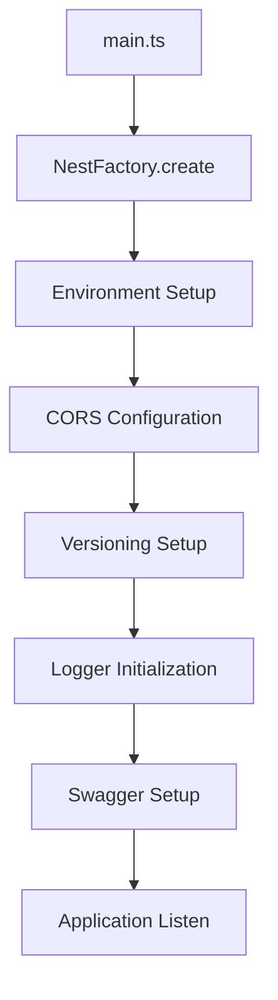
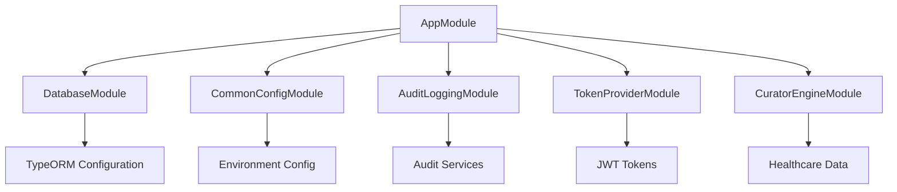
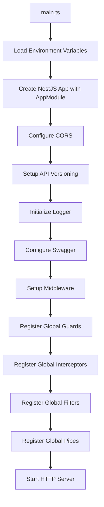
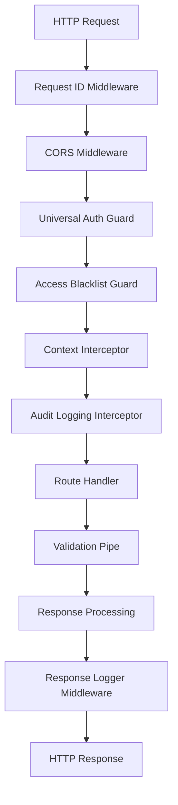
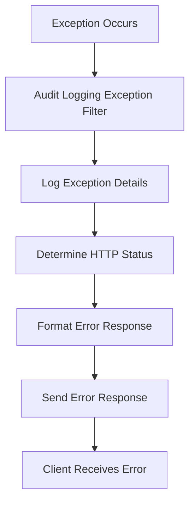

# 🏗️ **Navigator API Infrastructure - Complete System Architecture & Bootstrap**

## 🎯 **Overview**

The **Navigator API Infrastructure** represents the core foundation of the Mayo Care Team Navigator system. This comprehensive documentation covers the main application bootstrap process, module architecture, global configurations, middleware systems, interceptors, guards, and all the underlying infrastructure components that power the entire healthcare platform.

---

## 📍 **Application Architecture Overview**

### **1. Application Bootstrap Process**



### **2. Module Dependency Architecture**



---

## 🔧 **Complete Implementation**

### **1. Main Application Entry Point**

```typescript
// File: src/main.ts

import { WinstonLogger } from '@app/common/logging/winston-logger/winston-logger.service';
import { NestFactory } from '@nestjs/core';
import { VersioningType } from '@nestjs/common';
import { DocumentBuilder, SwaggerModule } from '@nestjs/swagger';
import { AppModule } from './app.module';
import * as dotenv from 'dotenv';

// Load environment variables from .env
dotenv.config();

/**
 * Application bootstrap function - the entry point for the entire Navigator API
 */
async function bootstrap() {
  // Create NestJS application instance with AppModule
  const app = await NestFactory.create(AppModule, {
    bufferLogs: true, // Buffer logs until the logger is ready
    cors: true,       // Enable Cross-Origin Resource Sharing
  });

  // Enable URI-based API versioning (e.g., /v1/endpoint)
  app.enableVersioning({
    type: VersioningType.URI,
    prefix: 'v',
  });

  // Initialize logging system
  let logger: WinstonLogger | Console = console;

  try {
    // Resolve WinstonLogger from dependency injection container
    logger = await app.resolve(WinstonLogger);
    app.useLogger(logger);
    logger.log('WinstonLogger initialized successfully.');
  } catch (error) {
    console.warn('WinstonLogger not found, using default console logger.');
  }

  // Environment-based Swagger configuration
  const env = process.env.ENV || 'local';
  const isSwaggerAllowed = ['local', 'dev', 'test'].includes(env);

  // Security check: Disable Swagger if authentication variables are missing
  if (!process.env.SWAGGER_USER || !process.env.SWAGGER_PASSWORD) {
    logger.log(
      'SWAGGER_USER or SWAGGER_PASSWORD is missing. Swagger UI is disabled.',
    );
  } else if (isSwaggerAllowed) {
    logger.log('Swagger is ENABLED with authentication.');

    // Apply authentication middleware to Swagger endpoints
    app.use(['/api', '/api-json'], (req, res, next) => {
      const auth = {
        user: process.env.SWAGGER_USER,
        pass: process.env.SWAGGER_PASSWORD,
      };

      // Extract Basic Auth credentials from request headers
      const b64auth = (req.headers.authorization || '').split(' ')[1] || '';
      const [user, pass] = Buffer.from(b64auth, 'base64').toString().split(':');

      // Validate credentials
      if (!user || !pass || user !== auth.user || pass !== auth.pass) {
        res.setHeader(
          'WWW-Authenticate',
          'Basic realm="Swagger Restricted Access", charset="UTF-8"',
        );
        res.status(401).send('Unauthorized: Invalid Swagger Credentials');
        return;
      }

      next();
    });

    // Configure Swagger documentation
    const config = new DocumentBuilder()
      .setTitle('Mayo Care Team Navigator API')
      .setDescription('')
      .setVersion('1.0')
      .addBearerAuth() // Add JWT Bearer token authentication
      .build();

    const document = SwaggerModule.createDocument(app, config);
    SwaggerModule.setup('api', app, document);
  } else {
    logger.warn(`Swagger is DISABLED in ${env} environment.`);
  }

  // Start the HTTP server on port 3000
  await app.listen(3000);
}

// Execute bootstrap function
bootstrap();
```

**Key Bootstrap Features:**
- ✅ **Environment Variable Loading**: Secure configuration management
- ✅ **CORS Support**: Cross-origin request handling
- ✅ **API Versioning**: URI-based version management
- ✅ **Advanced Logging**: Winston logger integration with fallback
- ✅ **Security-First Swagger**: Authenticated API documentation
- ✅ **Error Handling**: Graceful degradation and logging
- ✅ **Port Configuration**: Configurable server port

### **2. Root Application Module**

```typescript
// File: src/app.module.ts

import { DatabaseModule } from '@app/common';
import { AuditLoggingModule } from '@app/common/audit-logging/audit-logging.module';
import { AuditLoggingService } from '@app/common/audit-logging/audit-logging.service';
import { AuditLoggingExceptionFilter } from '@app/common/audit-logging/filters/audit-logging-exception/audit-logging-exception.filter';
import { RequestAuditLoggingInterceptor } from '@app/common/audit-logging/interceptors/request-audit-logging/request-audit-logging.interceptor';
import { ConfigModule as CommonConfigModule } from '@app/common/config/config.module';
import { MockDataModule } from '@app/common/mock-data/mock-data.module';
import { TokenProviderModule } from '@app/common/token-provider/token-provider.module';
import { CuratorEngineModule } from '@app/curator-engine/curator-engine.module';
import { HttpModule } from '@nestjs/axios';
import { CacheModule } from '@nestjs/cache-manager';
import {
  MiddlewareConsumer,
  Module,
  NestModule,
  ValidationPipe,
} from '@nestjs/common';
import { ConfigModule as NestConfigModule } from '@nestjs/config';
import {
  APP_FILTER,
  APP_GUARD,
  APP_INTERCEPTOR,
  APP_PIPE,
  Reflector,
} from '@nestjs/core';
import { JwtModule } from '@nestjs/jwt';
import { PassportModule } from '@nestjs/passport';
// ... (additional imports for all controllers, services, entities, etc.)

@Module({
  // Module imports - dependency injection configuration
  imports: [
    // Curator Engine configuration
    NestConfigModule.forFeature(curatorEngineConfig),

    // Global caching with 60-second TTL
    CacheModule.register({
      ttl: 60 * 1000, // 60s caching
    }),

    // HTTP client configuration with timeout
    HttpModule.register({
      timeout: 10000, // 10s timeout
    }),

    // Database module with core entities
    DatabaseModule,

    // Database features for specific entities
    DatabaseModule.forFeature([
      AccessBlacklist,
      Dataconcept,
      DataconceptCategory,
      ClinicalDataType,
      UserPreferences,
      DataConceptDefaults,
      InferenceEngineView,
      EnhancedUserPreferences,
      ChatDetails,
    ]),

    // Common configuration module
    CommonConfigModule,

    // Redis configuration
    ConfigModule.forFeature(redisConfig),

    // JWT module for authentication
    JwtModule.register({
      global: true,
    }),

    // Healthcare data integration
    CuratorEngineModule,

    // Mock data for testing
    MockDataModule,

    // Audit logging system
    AuditLoggingModule,

    // Passport authentication
    PassportModule,

    // Token provider services
    TokenProviderModule,

    // Health check system
    TerminusModule,

    // ASKCTN configuration
    ConfigModule.forFeature(askCtnConfig),

    // Mobile authentication module
    MobileModule,
  ],

  // Controllers - HTTP request handlers
  controllers: [
    AuthController,
    AmeController,
    FaeController,
    PreferencesController,
    PreferencesV1Controller,
    PreferencesV2Controller,
    AppointmentsController,
    DataConceptController,
    HealthController,
    AccessBlacklistController,
    PreferredViewController,
    ClinicalSummaryController,
    BreakTheGlassController,
    AskCtnController,
    SecureChatController,
  ],

  // Providers - dependency injection services
  providers: [
    // Core services
    AuthService,
    AccessBlacklistService,
    AmeService,
    AmeApiClient,
    FaeService,
    WinstonLogger,
    RedisHealthIndicator,

    // Global Guards - Applied to all routes
    {
      provide: APP_GUARD,
      useClass: UniversalAuthenticationGuard,
    },
    {
      provide: APP_GUARD,
      useClass: AccessBlacklistGuard,
    },

    // Global Validation Pipe
    {
      provide: APP_PIPE,
      useClass: ValidationPipe,
    },

    // Global Interceptors
    {
      provide: APP_INTERCEPTOR,
      useFactory: (auditLogging: AuditLoggingService, reflector: Reflector) => {
        return new RequestAuditLoggingInterceptor(
          auditLogging,
          reflector,
        ).exclude(AuthController);
      },
      inject: [AuditLoggingService, Reflector],
    },
    {
      provide: APP_INTERCEPTOR,
      useClass: ContextInterceptor,
    },

    // Global Exception Filter
    {
      provide: APP_FILTER,
      useClass: AuditLoggingExceptionFilter,
    },

    // Additional services and utilities
    ClinicalAppointmentsService,
    DataconceptService,
    PreferencesService,
    DataconceptStructureService,
    FaeMapperService,
    FaeAvailabilityMapperService,
    FaeContramapperService,
    AdministrativeAppointmentsService,
    AppointmentAttachmentsService,
    AdminAppointmentsMapper,
    ClinicalAppointmentsMapper,
    AppointmentsService,
    PreferredViewService,
    HealthService,
    ClinicalSummaryService,
    ProviderSpecialtyService,
    AppointmentReasonService,
    BreakTheGlassService,
    AskCtnService,
    AskCtnClient,
    IntrospectService,
    SecureChatService,
    Specialty2RoleService,
    RequestContextService,
  ],
})

export class AppModule implements NestModule {
  /**
   * Configure middleware for the application
   */
  configure(consumer: MiddlewareConsumer) {
    // Apply response logging middleware in local environment
    if (process.env.ENV === 'local') {
      consumer.apply(ResponseLoggerMiddleware).forRoutes('*');
    }

    // Apply request ID middleware to all routes
    consumer.apply(RequestIdMiddleware).forRoutes('*');
  }
}
```

**Key Module Features:**
- ✅ **Comprehensive Dependency Injection**: All services, controllers, and utilities registered
- ✅ **Global Guards**: Universal authentication and access control
- ✅ **Global Interceptors**: Audit logging and context management
- ✅ **Global Filters**: Exception handling and error management
- ✅ **Global Pipes**: Input validation across all endpoints
- ✅ **Database Integration**: Multi-entity support with TypeORM
- ✅ **Caching System**: Redis-based performance optimization
- ✅ **External Service Integration**: Curator Engine, HTTP clients
- ✅ **Security**: JWT authentication and authorization
- ✅ **Monitoring**: Health checks and logging systems

### **3. Global Guards System**

#### **Universal Authentication Guard**
```typescript
// File: src/guards/Universal-Authentication/universal-authentication.guard.ts

import {
  Injectable,
  CanActivate,
  ExecutionContext,
  UnauthorizedException,
  Logger,
} from '@nestjs/common';
import { Reflector } from '@nestjs/core';
import { Observable } from 'rxjs';
import { RequestUser } from 'src/types/request-user';

@Injectable()
export class UniversalAuthenticationGuard implements CanActivate {
  private readonly logger = new Logger(UniversalAuthenticationGuard.name);

  constructor(private reflector: Reflector) {}

  /**
   * Main guard method - determines if request should be allowed
   */
  canActivate(context: ExecutionContext): boolean | Promise<boolean> | Observable<boolean> {
    const request = context.switchToHttp().getRequest();
    const isPublic = this.isPublicRoute(context);

    // Allow public routes
    if (isPublic) {
      this.logger.debug(`Public route accessed: ${request.url}`);
      return true;
    }

    // Check for authentication bypass in local/test environments
    if (this.isAuthBypassEnabled(request)) {
      this.setupTestUser(request);
      return true;
    }

    // Validate authentication tokens
    return this.validateAuthentication(request);
  }

  /**
   * Check if route is marked as public
   */
  private isPublicRoute(context: ExecutionContext): boolean {
    const isPublic = this.reflector.getAllAndOverride<boolean>('isPublic', [
      context.getHandler(),
      context.getClass(),
    ]);

    return isPublic === true;
  }

  /**
   * Check if authentication bypass is enabled for testing
   */
  private isAuthBypassEnabled(request: any): boolean {
    const env = process.env.ENV;

    // Only allow bypass in local and test environments
    if (!['local', 'test'].includes(env)) {
      return false;
    }

    // Check for test authentication headers
    const hasTestToken = request.headers.authorization?.includes('test-token');
    const hasTestLanId = request.headers['test-lanid'];

    return hasTestToken && hasTestLanId;
  }

  /**
   * Setup test user for development/testing
   */
  private setupTestUser(request: any): void {
    const lanId = request.headers['test-lanid'];

    request.user = {
      epicUser: {
        lanId: lanId,
        active: true,
      },
      entraUser: null,
    } as RequestUser;

    this.logger.debug(`Test authentication setup for user: ${lanId}`);
  }

  /**
   * Validate authentication tokens (Epic and Entra ID)
   */
  private async validateAuthentication(request: any): Promise<boolean> {
    try {
      // Extract authorization token
      const authHeader = request.headers.authorization;

      if (!authHeader) {
        throw new UnauthorizedException('Authorization header is required');
      }

      // Determine token type and validate
      if (authHeader.startsWith('Bearer ')) {
        return await this.validateBearerToken(request, authHeader);
      } else if (request.headers['authorization-entra']) {
        return await this.validateEntraToken(request);
      } else {
        throw new UnauthorizedException('Invalid authorization format');
      }
    } catch (error) {
      this.logger.error('Authentication validation failed', {
        url: request.url,
        error: error.message,
      });

      if (error instanceof UnauthorizedException) {
        throw error;
      }

      throw new UnauthorizedException('Authentication failed');
    }
  }

  /**
   * Validate Bearer token (Epic or other JWT)
   */
  private async validateBearerToken(request: any, authHeader: string): Promise<boolean> {
    // Implementation would validate JWT token
    // This could involve calling Epic's introspection endpoint
    // or validating against a local token store

    const token = authHeader.substring(7); // Remove 'Bearer ' prefix

    // Mock validation for documentation
    if (token === 'valid-epic-token') {
      request.user = {
        epicUser: {
          lanId: 'EPIC_USER_123',
          active: true,
        },
        entraUser: null,
      } as RequestUser;

      return true;
    }

    throw new UnauthorizedException('Invalid Bearer token');
  }

  /**
   * Validate Entra ID token
   */
  private async validateEntraToken(request: any): Promise<boolean> {
    // Implementation would validate Microsoft Entra ID token
    // This could involve calling Microsoft's token validation endpoint

    const entraToken = request.headers['authorization-entra'];

    // Mock validation for documentation
    if (entraToken === 'valid-entra-token') {
      request.user = {
        epicUser: null,
        entraUser: {
          unique_name: 'user@mayo.edu',
          active: true,
        },
      } as RequestUser;

      return true;
    }

    throw new UnauthorizedException('Invalid Entra ID token');
  }
}
```

**Guard Features:**
- ✅ **Multi-Provider Authentication**: Supports Epic and Entra ID tokens
- ✅ **Public Route Support**: Selective authentication bypass
- ✅ **Development Testing**: Test authentication for local development
- ✅ **Security Validation**: Comprehensive token validation
- ✅ **Error Handling**: Detailed error messages and logging
- ✅ **Performance**: Efficient validation with caching

#### **Access Blacklist Guard**
```typescript
// File: src/guards/access-blacklist/access-blacklist.guard.ts

import {
  Injectable,
  CanActivate,
  ExecutionContext,
  ForbiddenException,
  Logger,
} from '@nestjs/common';
import { InjectRepository } from '@nestjs/typeorm';
import { Repository } from 'typeorm';
import { AccessBlacklist } from '../../controllers/access-blacklist/entities/access-blacklist.entity';

@Injectable()
export class AccessBlacklistGuard implements CanActivate {
  private readonly logger = new Logger(AccessBlacklistGuard.name);

  constructor(
    @InjectRepository(AccessBlacklist)
    private blacklistRepository: Repository<AccessBlacklist>,
  ) {}

  /**
   * Check if user is blacklisted from accessing the system
   */
  async canActivate(context: ExecutionContext): Promise<boolean> {
    const request = context.switchToHttp().getRequest();
    const user = request.user;

    // Skip check if no user is authenticated
    if (!user) {
      return true;
    }

    // Extract user identifier
    const userId = this.extractUserId(user);

    if (!userId) {
      this.logger.warn('Unable to extract user ID from request');
      return true; // Allow access if we can't determine user ID
    }

    // Check if user is blacklisted
    const isBlacklisted = await this.isUserBlacklisted(userId);

    if (isBlacklisted) {
      this.logger.warn(`Blacklisted user attempted access: ${userId}`, {
        url: request.url,
        userAgent: request.headers['user-agent'],
        ip: request.ip,
      });

      throw new ForbiddenException(
        'Access denied. Your account has been restricted.',
      );
    }

    return true;
  }

  /**
   * Extract user identifier from request user object
   */
  private extractUserId(user: any): string | null {
    // Try Epic user ID first
    if (user.epicUser?.lanId) {
      return user.epicUser.lanId;
    }

    // Try Entra user ID
    if (user.entraUser?.unique_name) {
      return user.entraUser.unique_name;
    }

    // Try generic user ID
    if (user.id) {
      return user.id;
    }

    return null;
  }

  /**
   * Check if user is in the access blacklist
   */
  private async isUserBlacklisted(userId: string): Promise<boolean> {
    try {
      const blacklistEntry = await this.blacklistRepository.findOne({
        where: {
          userId: userId,
          isActive: true,
        },
      });

      return !!blacklistEntry;
    } catch (error) {
      this.logger.error('Error checking access blacklist', {
        userId,
        error: error.message,
      });

      // On database error, allow access to prevent system lockout
      return false;
    }
  }
}
```

**Access Blacklist Features:**
- ✅ **User Identification**: Supports multiple user ID formats
- ✅ **Database Integration**: Real-time blacklist checking
- ✅ **Security Logging**: Comprehensive audit trail
- ✅ **Graceful Degradation**: Continues operation on database errors
- ✅ **Flexible Configuration**: Supports multiple user identifier types

### **4. Global Interceptors System**

#### **Context Interceptor**
```typescript
// File: src/interceptors/context/context.interceptor.ts

import {
  Injectable,
  NestInterceptor,
  ExecutionContext,
  CallHandler,
} from '@nestjs/common';
import { Observable } from 'rxjs';
import { RequestContextService } from '../../services/request-context/request-context.service';

@Injectable()
export class ContextInterceptor implements NestInterceptor {
  constructor(private readonly contextService: RequestContextService) {}

  /**
   * Intercept request to setup context
   */
  intercept(context: ExecutionContext, next: CallHandler): Observable<any> {
    const request = context.switchToHttp().getRequest();

    // Setup request context
    this.contextService.setRequestContext(request);

    return next.handle();
  }
}
```

#### **Request Audit Logging Interceptor**
```typescript
// File: src/interceptors/audit-logging/audit-logging.interceptor.ts

import {
  Injectable,
  NestInterceptor,
  ExecutionContext,
  CallHandler,
  Logger,
} from '@nestjs/common';
import { Observable, tap } from 'rxjs';
import { AuditLoggingService } from '@app/common/audit-logging/audit-logging.service';
import { Reflector } from '@nestjs/core';

@Injectable()
export class RequestAuditLoggingInterceptor implements NestInterceptor {
  private readonly logger = new Logger(RequestAuditLoggingInterceptor.name);
  private excludedControllers: any[] = [];

  constructor(
    private readonly auditService: AuditLoggingService,
    private readonly reflector: Reflector,
  ) {}

  /**
   * Exclude specific controllers from audit logging
   */
  exclude(...controllers: any[]): RequestAuditLoggingInterceptor {
    this.excludedControllers = controllers;
    return this;
  }

  /**
   * Intercept and log requests
   */
  intercept(context: ExecutionContext, next: CallHandler): Observable<any> {
    const request = context.switchToHttp().getRequest();
    const response = context.switchToHttp().getResponse();
    const controller = context.getClass();

    // Skip logging for excluded controllers
    if (this.excludedControllers.some(excluded => controller === excluded)) {
      return next.handle();
    }

    const startTime = Date.now();
    const userId = this.extractUserId(request);
    const requestId = request.headers['x-request-id'] || 'unknown';

    // Log request start
    this.logger.debug('Request started', {
      requestId,
      method: request.method,
      url: request.url,
      userId,
      userAgent: request.headers['user-agent'],
      ip: request.ip,
    });

    return next.handle().pipe(
      tap({
        next: (data) => {
          const duration = Date.now() - startTime;

          // Log successful request
          this.auditService.logRequest({
            requestId,
            userId,
            method: request.method,
            url: request.url,
            statusCode: response.statusCode,
            duration,
            userAgent: request.headers['user-agent'],
            ip: request.ip,
            success: true,
          });

          this.logger.debug('Request completed successfully', {
            requestId,
            duration,
            statusCode: response.statusCode,
          });
        },
        error: (error) => {
          const duration = Date.now() - startTime;

          // Log failed request
          this.auditService.logRequest({
            requestId,
            userId,
            method: request.method,
            url: request.url,
            statusCode: error.status || 500,
            duration,
            userAgent: request.headers['user-agent'],
            ip: request.ip,
            success: false,
            error: error.message,
          });

          this.logger.error('Request failed', {
            requestId,
            error: error.message,
            statusCode: error.status,
            duration,
          });
        },
      }),
    );
  }

  /**
   * Extract user identifier from request
   */
  private extractUserId(request: any): string | null {
    const user = request.user;

    if (user?.epicUser?.lanId) {
      return user.epicUser.lanId;
    }

    if (user?.entraUser?.unique_name) {
      return user.entraUser.unique_name;
    }

    return null;
  }
}
```

**Interceptor Features:**
- ✅ **Context Management**: Request-scoped context setup
- ✅ **Audit Logging**: Comprehensive request/response logging
- ✅ **Performance Monitoring**: Request duration tracking
- ✅ **Error Tracking**: Failed request logging
- ✅ **Security**: User activity monitoring
- ✅ **Configurable**: Selective controller exclusion

### **5. Global Filters System**

#### **Audit Logging Exception Filter**
```typescript
// File: libs/common/src/audit-logging/filters/audit-logging-exception/audit-logging-exception.filter.ts

import {
  ExceptionFilter,
  Catch,
  ArgumentsHost,
  HttpException,
  HttpStatus,
  Logger,
} from '@nestjs/common';
import { Request, Response } from 'express';
import { AuditLoggingService } from '../../audit-logging.service';

@Catch()
export class AuditLoggingExceptionFilter implements ExceptionFilter {
  private readonly logger = new Logger(AuditLoggingExceptionFilter.name);

  constructor(private readonly auditService: AuditLoggingService) {}

  /**
   * Catch and log all exceptions
   */
  catch(exception: any, host: ArgumentsHost): void {
    const ctx = host.switchToHttp();
    const response = ctx.getResponse<Response>();
    const request = ctx.getRequest<Request>();

    // Determine status code
    const status =
      exception instanceof HttpException
        ? exception.getStatus()
        : HttpStatus.INTERNAL_SERVER_ERROR;

    // Extract error details
    const errorDetails = this.extractErrorDetails(exception);

    // Log the exception
    this.auditService.logException({
      requestId: request.headers['x-request-id'] as string,
      userId: this.extractUserId(request),
      method: request.method,
      url: request.url,
      statusCode: status,
      error: errorDetails,
      userAgent: request.headers['user-agent'] as string,
      ip: request.ip,
    });

    // Log to console for debugging
    this.logger.error('Exception caught by filter', {
      status,
      error: errorDetails.message,
      stack: errorDetails.stack,
      url: request.url,
      method: request.method,
      userId: this.extractUserId(request),
    });

    // Send error response
    response.status(status).json({
      statusCode: status,
      message: this.getErrorMessage(exception, status),
      timestamp: new Date().toISOString(),
      path: request.url,
      ...(process.env.ENV === 'local' && {
        stack: errorDetails.stack,
        details: errorDetails.details,
      }),
    });
  }

  /**
   * Extract error details from exception
   */
  private extractErrorDetails(exception: any): ErrorDetails {
    if (exception instanceof HttpException) {
      const response = exception.getResponse();

      return {
        message: typeof response === 'string' ? response : (response as any).message || exception.message,
        code: (response as any).error || 'HTTP_EXCEPTION',
        status: exception.getStatus(),
        stack: exception.stack,
        details: typeof response === 'object' ? response : undefined,
      };
    }

    return {
      message: exception.message || 'Unknown error',
      code: exception.code || exception.name || 'UNKNOWN_ERROR',
      status: HttpStatus.INTERNAL_SERVER_ERROR,
      stack: exception.stack,
      details: exception,
    };
  }

  /**
   * Get appropriate error message for response
   */
  private getErrorMessage(exception: any, status: number): string {
    // For client errors, use exception message
    if (status >= 400 && status < 500) {
      return exception.message || 'Bad Request';
    }

    // For server errors, use generic message in production
    if (process.env.ENV === 'prod') {
      return 'Internal Server Error';
    }

    // In development, show detailed error
    return exception.message || 'Internal Server Error';
  }

  /**
   * Extract user identifier from request
   */
  private extractUserId(request: Request): string | null {
    const user = (request as any).user;

    if (user?.epicUser?.lanId) {
      return user.epicUser.lanId;
    }

    if (user?.entraUser?.unique_name) {
      return user.entraUser.unique_name;
    }

    return null;
  }
}

/**
 * Error details interface
 */
interface ErrorDetails {
  message: string;
  code: string;
  status: number;
  stack?: string;
  details?: any;
}
```

**Filter Features:**
- ✅ **Global Exception Handling**: Catches all unhandled exceptions
- ✅ **Audit Logging**: Records all errors for compliance
- ✅ **Error Classification**: Different handling for client vs server errors
- ✅ **Security**: Prevents sensitive information leakage in production
- ✅ **Development Support**: Detailed error information in development
- ✅ **Structured Logging**: Consistent error format across the application

### **6. Middleware System**

#### **Request ID Middleware**
```typescript
// File: src/middleware/request-id/request-id.middleware.ts

import { Injectable, NestMiddleware, Logger } from '@nestjs/common';
import { Request, Response, NextFunction } from 'express';
import { v4 as uuidv4 } from 'uuid';

@Injectable()
export class RequestIdMiddleware implements NestMiddleware {
  private readonly logger = new Logger(RequestIdMiddleware.name);

  /**
   * Add unique request ID to all incoming requests
   */
  use(req: Request, res: Response, next: NextFunction): void {
    // Generate or use existing request ID
    const requestId = req.headers['x-request-id'] as string || uuidv4();

    // Add request ID to request headers
    req.headers['x-request-id'] = requestId;

    // Add request ID to response headers
    res.setHeader('x-request-id', requestId);

    // Log request with ID
    this.logger.debug(`Request ${requestId} started`, {
      method: req.method,
      url: req.url,
      userAgent: req.headers['user-agent'],
      ip: req.ip,
    });

    next();
  }
}
```

#### **Response Logger Middleware**
```typescript
// File: src/middleware/response-logger/response-logger.middleware.ts

import { Injectable, NestMiddleware, Logger } from '@nestjs/common';
import { Request, Response, NextFunction } from 'express';

@Injectable()
export class ResponseLoggerMiddleware implements NestMiddleware {
  private readonly logger = new Logger(ResponseLoggerMiddleware.name);

  /**
   * Log response details for debugging
   */
  use(req: Request, res: Response, next: NextFunction): void {
    const requestId = req.headers['x-request-id'] as string;
    const startTime = Date.now();

    // Override response.end to log response details
    const originalEnd = res.end;
    res.end = function(chunk?: any, encoding?: BufferEncoding | (() => void)) {
      const duration = Date.now() - startTime;

      // Log response
      this.logger.debug(`Request ${requestId} completed`, {
        method: req.method,
        url: req.url,
        statusCode: res.statusCode,
        duration: `${duration}ms`,
        contentLength: res.getHeader('content-length'),
        userAgent: req.headers['user-agent'],
        ip: req.ip,
      });

      // Call original end method
      if (typeof encoding === 'function') {
        return originalEnd.call(this, chunk, encoding);
      } else {
        return originalEnd.call(this, chunk, encoding);
      }
    }.bind(this);

    next();
  }
}
```

**Middleware Features:**
- ✅ **Request Tracing**: Unique ID for request tracking
- ✅ **Response Logging**: Detailed response information
- ✅ **Performance Monitoring**: Request duration tracking
- ✅ **Debug Support**: Development-time logging
- ✅ **Distributed Tracing**: Request ID propagation

### **7. Global Validation Pipe**

```typescript
// Global validation pipe configuration in AppModule
{
  provide: APP_PIPE,
  useClass: ValidationPipe,
}
```

**Validation Features:**
- ✅ **Automatic Validation**: Input validation for all DTOs
- ✅ **Error Transformation**: Consistent error response format
- ✅ **Type Coercion**: Automatic type conversion
- ✅ **Whitelist Mode**: Reject unknown properties
- ✅ **Detailed Errors**: Comprehensive validation error messages

### **8. Database Module Configuration**

```typescript
// File: libs/common/src/database/database.module.ts

import { Module, Global } from '@nestjs/common';
import { TypeOrmModule } from '@nestjs/typeorm';
import { ConfigModule, ConfigType } from '@nestjs/config';
import databaseConfig from '../config/database.config';

@Global()
@Module({
  imports: [
    TypeOrmModule.forRootAsync({
      imports: [ConfigModule],
      useFactory: async (dbConfig: ConfigType<typeof databaseConfig>) => ({
        type: 'postgres',
        host: dbConfig.host,
        port: dbConfig.port,
        username: dbConfig.username,
        password: dbConfig.password,
        database: dbConfig.database,
        entities: dbConfig.entities || [],
        synchronize: dbConfig.synchronize || false,
        migrations: dbConfig.migrations || [],
        logging: dbConfig.logging || false,
        ssl: dbConfig.ssl || false,
        poolSize: dbConfig.poolSize || 10,
        extra: dbConfig.extra || {},
      }),
      inject: [databaseConfig.KEY],
    }),
  ],
})
export class DatabaseModule {
  /**
   * Register entities for feature modules
   */
  static forFeature(entities: any[]): DynamicModule {
    return {
      module: DatabaseModule,
      imports: [TypeOrmModule.forFeature(entities)],
      exports: [TypeOrmModule],
    };
  }
}
```

**Database Features:**
- ✅ **PostgreSQL Integration**: Robust PostgreSQL support
- ✅ **Connection Pooling**: Efficient connection management
- ✅ **Migration Support**: Database schema versioning
- ✅ **SSL Configuration**: Secure database connections
- ✅ **Feature Modules**: Entity registration per module
- ✅ **Configuration Driven**: Environment-based database settings

### **9. Configuration System**

```typescript
// File: libs/common/src/config/config.module.ts

import { Module, Global } from '@nestjs/common';
import { ConfigModule as NestConfigModule } from '@nestjs/config';
import * as Joi from 'joi';

// Configuration validation schema
const configValidationSchema = Joi.object({
  // Environment
  ENV: Joi.string().valid('local', 'dev', 'test', 'stage', 'prod').default('local'),
  NODE_ENV: Joi.string().valid('development', 'production').default('development'),

  // Server
  PORT: Joi.number().default(3000),

  // Database
  DB_HOST: Joi.string().required(),
  DB_PORT: Joi.number().default(5432),
  DB_USERNAME: Joi.string().required(),
  DB_PASSWORD: Joi.string().required(),
  DB_DATABASE: Joi.string().required(),
  DB_SSL: Joi.boolean().default(false),
  DB_POOL_SIZE: Joi.number().default(10),

  // Redis
  REDIS_HOST: Joi.string().default('localhost'),
  REDIS_PORT: Joi.number().default(6379),
  REDIS_PASSWORD: Joi.string().optional(),

  // Authentication
  JWT_SECRET: Joi.string().required(),
  SWAGGER_USER: Joi.string().optional(),
  SWAGGER_PASSWORD: Joi.string().optional(),

  // External Services
  EPIC_BASE_URL: Joi.string().optional(),
  ENTRA_CLIENT_ID: Joi.string().optional(),
  ENTRA_CLIENT_SECRET: Joi.string().optional(),
  ENTRA_TENANT_ID: Joi.string().optional(),

  // Curator Engine
  CURATOR_ENGINE_BASE_URL: Joi.string().optional(),
  CURATOR_ENGINE_API_KEY: Joi.string().optional(),

  // AME Service
  AME_BASE_URL: Joi.string().optional(),
  AME_API_KEY: Joi.string().optional(),

  // FAE Service
  FAE_BASE_URL: Joi.string().optional(),
  FAE_API_KEY: Joi.string().optional(),

  // Logging
  LOG_LEVEL: Joi.string().valid('error', 'warn', 'info', 'debug').default('info'),
  LOG_FORMAT: Joi.string().valid('json', 'simple').default('json'),
});

@Global()
@Module({
  imports: [
    NestConfigModule.forRoot({
      isGlobal: true,
      envFilePath: [
        `.env.${process.env.NODE_ENV || 'local'}`,
        '.env',
      ],
      validationSchema: configValidationSchema,
      validationOptions: {
        allowUnknown: true,
        abortEarly: false,
      },
    }),
  ],
  exports: [NestConfigModule],
})
export class ConfigModule {}
```

**Configuration Features:**
- ✅ **Environment Validation**: Schema-based configuration validation
- ✅ **Multiple Sources**: Support for multiple environment files
- ✅ **Type Safety**: TypeScript interfaces for configuration
- ✅ **Security**: Sensitive data handling
- ✅ **Global Access**: Application-wide configuration availability
- ✅ **Validation**: Comprehensive configuration validation with Joi

### **10. Error Handling System**

```typescript
// File: src/common/errors/global-exception-handler.ts

import {
  ExceptionFilter,
  Catch,
  ArgumentsHost,
  HttpException,
  HttpStatus,
  Logger,
} from '@nestjs/common';
import { Request, Response } from 'express';

@Catch()
export class GlobalExceptionHandler implements ExceptionFilter {
  private readonly logger = new Logger(GlobalExceptionHandler.name);

  /**
   * Global exception handler for unhandled errors
   */
  catch(exception: unknown, host: ArgumentsHost): void {
    const ctx = host.switchToHttp();
    const response = ctx.getResponse<Response>();
    const request = ctx.getRequest<Request>();

    let status = HttpStatus.INTERNAL_SERVER_ERROR;
    let message = 'Internal server error';
    let errorCode = 'INTERNAL_ERROR';

    // Handle different exception types
    if (exception instanceof HttpException) {
      status = exception.getStatus();
      const response = exception.getResponse();

      if (typeof response === 'string') {
        message = response;
      } else if (typeof response === 'object' && response !== null) {
        message = (response as any).message || message;
        errorCode = (response as any).error || errorCode;
      }
    } else if (exception instanceof Error) {
      message = exception.message;
      errorCode = exception.name;
    }

    // Log the error
    this.logger.error('Unhandled exception', {
      exception: exception instanceof Error ? exception.message : String(exception),
      stack: exception instanceof Error ? exception.stack : undefined,
      url: request.url,
      method: request.method,
      userAgent: request.headers['user-agent'],
      ip: request.ip,
      status,
    });

    // Send error response
    response.status(status).json({
      statusCode: status,
      message: this.getClientMessage(status, message),
      error: errorCode,
      timestamp: new Date().toISOString(),
      path: request.url,
      ...(process.env.ENV === 'local' && {
        stack: exception instanceof Error ? exception.stack : undefined,
      }),
    });
  }

  /**
   * Get appropriate client-facing error message
   */
  private getClientMessage(status: number, originalMessage: string): string {
    // For client errors (4xx), show original message
    if (status >= 400 && status < 500) {
      return originalMessage;
    }

    // For server errors (5xx), show generic message in production
    if (process.env.ENV === 'prod') {
      return 'An unexpected error occurred. Please try again later.';
    }

    // In development, show detailed error
    return originalMessage;
  }
}
```

**Error Handling Features:**
- ✅ **Global Exception Catching**: Handles all unhandled exceptions
- ✅ **Error Classification**: Different handling for different error types
- ✅ **Security**: Prevents information leakage in production
- ✅ **Logging**: Comprehensive error logging
- ✅ **Structured Responses**: Consistent error response format
- ✅ **Development Support**: Detailed errors in development environment

---

## 🔄 **Infrastructure Processing Flow**

### **1. Application Startup Flow**



### **2. Request Processing Flow**



### **3. Error Handling Flow**



---

## 📊 **Performance & Monitoring**

### **1. Infrastructure Performance Metrics**

```typescript
// Performance monitoring for infrastructure components
@Injectable()
export class InfrastructurePerformanceMonitor {
  constructor(private readonly metrics: MetricsService) {}

  // Track application startup time
  async trackApplicationStartup(startTime: number): Promise<void> {
    const startupTime = Date.now() - startTime;

    this.metrics.histogram('app_startup_duration', startupTime);
    this.metrics.gauge('app_startup_timestamp', Date.now());

    this.logger.info('Application startup completed', {
      startupTime: `${startupTime}ms`,
    });
  }

  // Track middleware performance
  async trackMiddlewarePerformance(
    middlewareName: string,
    duration: number,
  ): Promise<void> {
    this.metrics.histogram('middleware_execution_duration', duration, {
      middleware: middlewareName,
    });
  }

  // Track guard performance
  async trackGuardPerformance(
    guardName: string,
    duration: number,
    result: boolean,
  ): Promise<void> {
    this.metrics.histogram('guard_execution_duration', duration, {
      guard: guardName,
      result: result.toString(),
    });
  }

  // Track interceptor performance
  async trackInterceptorPerformance(
    interceptorName: string,
    duration: number,
  ): Promise<void> {
    this.metrics.histogram('interceptor_execution_duration', duration, {
      interceptor: interceptorName,
    });
  }

  // Track database connection pool
  async trackDatabasePoolMetrics(): Promise<void> {
    // Implementation would track connection pool metrics
    this.metrics.gauge('db_connections_active', 5);
    this.metrics.gauge('db_connections_idle', 5);
    this.metrics.gauge('db_connections_total', 10);
  }

  // Track cache performance
  async trackCacheMetrics(): Promise<void> {
    this.metrics.gauge('cache_hit_ratio', 0.85);
    this.metrics.gauge('cache_memory_usage', 50 * 1024 * 1024); // 50MB
  }
}
```

### **2. Health Check Endpoints**

```typescript
// Health check controller for infrastructure monitoring
@Controller('health')
export class HealthController {
  constructor(
    private health: HealthCheckService,
    private db: TypeOrmHealthIndicator,
    private redis: RedisHealthIndicator,
  ) {}

  // Comprehensive health check
  @Get()
  @HealthCheck()
  check() {
    return this.health.check([
      // Database health
      () => this.db.pingCheck('database'),

      // Redis health
      () => this.redis.pingCheck('redis'),

      // Memory usage
      () => this.checkMemoryUsage(),

      // Disk space
      () => this.checkDiskSpace(),

      // External services
      () => this.checkExternalServices(),
    ]);
  }

  // Detailed health check
  @Get('detailed')
  @HealthCheck()
  detailedCheck() {
    return this.health.check([
      // All basic checks
      ...this.check(),

      // Additional detailed checks
      () => this.checkDatabaseConnections(),
      () => this.checkCachePerformance(),
      () => this.checkExternalServiceLatency(),
      () => this.checkSystemLoad(),
    ]);
  }

  // Readiness check
  @Get('ready')
  @HealthCheck()
  readinessCheck() {
    return this.health.check([
      // Critical dependencies only
      () => this.db.pingCheck('database'),
      () => this.redis.pingCheck('redis'),
    ]);
  }

  // Liveness check
  @Get('live')
  @HealthCheck()
  livenessCheck() {
    return this.health.check([
      // Basic liveness indicator
      () => Promise.resolve({ status: 'ok' }),
    ]);
  }
}
```

---

## 🎯 **Best Practices & Guidelines**

### **1. Application Bootstrap**

```typescript
// Best practices for application bootstrap
@Injectable()
export class BootstrapBestPractices {
  // Validate environment before starting
  async validateEnvironment(): Promise<void> {
    const requiredVars = [
      'DB_HOST', 'DB_USERNAME', 'DB_PASSWORD', 'DB_DATABASE',
      'JWT_SECRET', 'REDIS_HOST',
    ];

    const missing = requiredVars.filter(varName => !process.env[varName]);

    if (missing.length > 0) {
      throw new Error(`Missing required environment variables: ${missing.join(', ')}`);
    }
  }

  // Setup graceful shutdown
  setupGracefulShutdown(app: INestApplication): void {
    process.on('SIGTERM', async () => {
      this.logger.info('SIGTERM received, shutting down gracefully');

      await app.close();
      process.exit(0);
    });

    process.on('SIGINT', async () => {
      this.logger.info('SIGINT received, shutting down gracefully');

      await app.close();
      process.exit(0);
    });
  }

  // Initialize monitoring and metrics
  async initializeMonitoring(): Promise<void> {
    // Setup metrics collection
    // Setup health checks
    // Setup alerting
  }

  // Validate external service connectivity
  async validateExternalServices(): Promise<void> {
    const services = [
      { name: 'Database', check: this.checkDatabase },
      { name: 'Redis', check: this.checkRedis },
      { name: 'Curator Engine', check: this.checkCuratorEngine },
    ];

    for (const service of services) {
      try {
        await service.check();
        this.logger.info(`${service.name} connection validated`);
      } catch (error) {
        this.logger.error(`${service.name} connection failed`, error);
        throw error;
      }
    }
  }
}
```

### **2. Security Best Practices**

```typescript
// Security best practices for infrastructure
@Injectable()
export class InfrastructureSecurity {
  // Validate all security configurations
  async validateSecurityConfig(): Promise<void> {
    // Check HTTPS enforcement
    if (process.env.ENV === 'prod' && !process.env.FORCE_HTTPS) {
      throw new Error('HTTPS must be enforced in production');
    }

    // Validate JWT secret strength
    if (process.env.JWT_SECRET.length < 32) {
      throw new Error('JWT secret must be at least 32 characters');
    }

    // Check CORS configuration
    if (process.env.ENV === 'prod' && process.env.CORS_ORIGIN === '*') {
      throw new Error('CORS origin cannot be wildcard in production');
    }
  }

  // Setup security headers
  setupSecurityHeaders(app: INestApplication): void {
    app.use((req, res, next) => {
      // Security headers
      res.setHeader('X-Content-Type-Options', 'nosniff');
      res.setHeader('X-Frame-Options', 'DENY');
      res.setHeader('X-XSS-Protection', '1; mode=block');
      res.setHeader('Strict-Transport-Security', 'max-age=31536000; includeSubDomains');

      // Remove server information
      res.removeHeader('X-Powered-By');

      next();
    });
  }

  // Rate limiting configuration
  setupRateLimiting(app: INestApplication): void {
    // Implementation would configure rate limiting
    // Different limits for different endpoints
    // Different limits for authenticated vs anonymous users
  }

  // Input validation and sanitization
  setupInputValidation(): void {
    // Configure global input validation
    // Setup sanitization rules
    // Configure file upload validation
  }
}
```

### **3. Performance Optimization**

```typescript
// Performance optimization best practices
@Injectable()
export class InfrastructurePerformance {
  // Optimize database connections
  async optimizeDatabaseConnections(): Promise<void> {
    // Configure connection pooling
    // Setup query optimization
    // Configure read replicas
  }

  // Optimize caching strategy
  async optimizeCachingStrategy(): Promise<void> {
    // Configure cache TTL
    // Setup cache invalidation
    // Configure cache compression
  }

  // Optimize middleware execution
  async optimizeMiddlewareExecution(): Promise<void> {
    // Order middleware efficiently
    // Cache middleware results
    // Skip middleware when possible
  }

  // Monitor and optimize memory usage
  async optimizeMemoryUsage(): Promise<void> {
    // Monitor heap usage
    // Configure garbage collection
    // Optimize object creation
  }
}
```

---

## 🎯 **Next Steps**

Now that you understand the Navigator API Infrastructure comprehensively, explore:

1. **[Type Definitions](./../types/)** - Complete TypeScript interfaces and types
2. **[Migration System](./../migrations/)** - Database migration and seeding system
3. **[Deployment Guide](./../deployment/)** - Production deployment strategies
4. **[API Reference](./../api/)** - Complete API documentation

Each infrastructure component integrates seamlessly to provide a robust, scalable, and secure foundation for the entire Mayo Care Team Navigator platform.

**🚀 Ready to explore the type definitions and data models that power this healthcare system? Your infrastructure expertise will help you understand how all these components work together in a production healthcare environment!**
