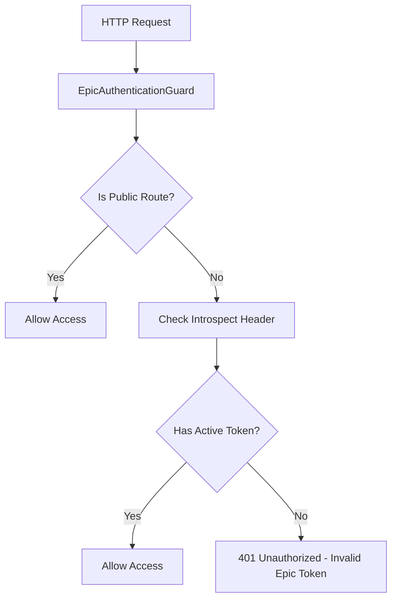
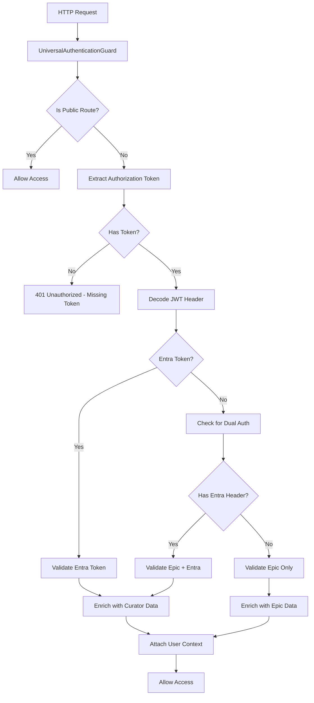
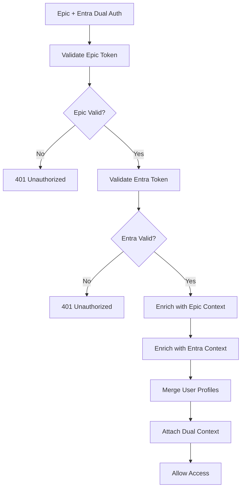

# 🛡️ Authentication Guards - Multi-Protocol Security Framework

## 🎯 **Overview**

The **Authentication Guards** are the cornerstone of the Navigator API's security architecture, providing sophisticated multi-protocol authentication that seamlessly integrates Epic EHR systems with Microsoft Entra ID (Azure AD). These guards implement defense-in-depth security with public endpoint exemptions, token validation, and comprehensive user context enrichment.

---

## 📍 **Guard Architecture Overview**

### **What are Authentication Guards?**
Authentication Guards are NestJS security components that:
- **Validate user identity** across multiple authentication protocols
- **Enrich requests** with comprehensive user context
- **Integrate with healthcare systems** (Epic, Curator Engine)
- **Provide seamless authentication** for different user types
- **Support public endpoints** with selective bypass
- **Enable multi-tenant authentication** with tenant validation

### **Guard Architecture**

```
┌─────────────────────────────────────────────────────────────┐
│           Authentication Guards Architecture                 │
│  ┌─────────────────────────────────────────────────────┐    │
│  │           Epic Authentication Guard                 │    │
│  │  ├─ Epic Token Validation ───┬─ Introspect Header    │    │
│  │  ├─ Public Route Bypass ─────┼─ @Public Decorator    │    │
│  │  ├─ Simple Authorization ────┼─ Active Token Check   │    │
│  │  └─ Fast Processing ─────────┴─ Minimal Overhead     │    │
│  └─────────────────────────────────────────────────────┘    │
│                                                             │
│  ┌─────────────────────────────────────────────────────┐    │
│  │           Universal Authentication Guard            │    │
│  │  ├─ Multi-Protocol Support ─┬─ Epic + Entra ID      │    │
│  │  ├─ JWT Token Validation ───┼─ RS256 Verification   │    │
│  │  ├─ Curator Engine Integration┼─ User Demographics   │    │
│  │  ├─ Dual Token Support ─────┼─ Epic + Entra Tokens  │    │
│  │  └─ Context Enrichment ─────┴─ User Profile Data    │    │
│  └─────────────────────────────────────────────────────┘    │
│                                                             │
│  ┌─────────────────────────────────────────────────────┐    │
│  │           Security Integration                      │    │
│  │  ├─ Access Blacklist ──────┬─ Post-Auth Validation │    │
│  │  ├─ Audit Logging ─────────┼─ Authentication Events│    │
│  │  ├─ Rate Limiting ─────────┼─ Brute Force Protection│    │
│  │  └─ Session Management ────┴─ Token Lifecycle      │    │
│  └─────────────────────────────────────────────────────┘    │
└─────────────────────────────────────────────────────────────┘
```

---

## 🔧 **Complete Implementation**

### **1. Epic Authentication Guard**

```typescript
// File: src/guards/epic-authentication/epic-authentication.guard.ts

import {
  CanActivate,
  ExecutionContext,
  Injectable,
  Logger,
  UnauthorizedException,
} from '@nestjs/common';
import { Reflector } from '@nestjs/core';
import { Observable } from 'rxjs';
import { IS_PUBLIC_KEY } from 'src/decorators/public.decorator';

@Injectable()
export class EpicAuthenticationGuard implements CanActivate {
  private logger = new Logger(EpicAuthenticationGuard.name);

  constructor(private reflector: Reflector) {}

  /**
   * Epic-specific authentication guard
   * Validates Epic access tokens via introspect header
   */
  canActivate(
    context: ExecutionContext,
  ): boolean | Promise<boolean> | Observable<boolean> {
    // Check if endpoint is marked as public
    const isPublic = this.reflector.getAllAndOverride(IS_PUBLIC_KEY, [
      context.getClass(),
      context.getHandler(),
    ]);

    if (isPublic) {
      // No authentication is required for public endpoints
      return true;
    }

    // Check if user is authenticated (from introspect result)
    const request = context.switchToHttp().getRequest();
    const introspectHeader = request.headers['introspect'];

    if (!introspectHeader?.active) {
      this.logger.warn(`User is unauthorized to access URL ${request.url}`);
      throw new UnauthorizedException(
        'Epic access token is invalid or missing',
      );
    }
    return true;
  }
}
```

**Key Features:**
- ✅ **Public Endpoint Support**: Honors `@Public()` decorator
- ✅ **Epic Token Validation**: Validates via introspect header
- ✅ **Minimal Overhead**: Fast processing for Epic-only scenarios
- ✅ **Clear Error Messages**: User-friendly unauthorized responses

### **2. Universal Authentication Guard**

```typescript
// File: src/guards/Universal-Authentication/universal-authentication.guard.ts

import {
  CanActivate,
  ExecutionContext,
  Injectable,
  Logger,
  UnauthorizedException,
} from '@nestjs/common';
import { Reflector } from '@nestjs/core';
import { IS_PUBLIC_KEY } from 'src/decorators/public.decorator';
import { CuratorEngineService } from '@app/curator-engine/curator-engine.service';
import * as jwt from 'jsonwebtoken';
import jwksClient from 'jwks-rsa';
import { ConfigService } from '@nestjs/config';
import { ENTRA_HEADER_KEY } from 'src/decorators/entra-token.decorator';
import { IntrospectService } from '../../services/introspect/introspect.service';

@Injectable()
export class UniversalAuthenticationGuard implements CanActivate {
  private readonly logger = new Logger(UniversalAuthenticationGuard.name);
  private readonly jwks;
  private readonly tenantId: string;

  constructor(
    private readonly reflector: Reflector,
    private readonly curatorEngine: CuratorEngineService,
    private readonly configService: ConfigService,
    private readonly introspectService: IntrospectService,
  ) {
    this.tenantId = this.configService.get<string>('entra.tenantId');
    this.jwks = jwksClient({
      jwksUri: `https://login.microsoftonline.com/${this.tenantId}/discovery/v2.0/keys`,
      cache: true,
      rateLimit: true,
    });
  }

  /**
   * Universal authentication supporting Epic and Entra ID
   * Advanced guard with multi-protocol support and user context enrichment
   */
  async canActivate(context: ExecutionContext): Promise<boolean> {
    // Check if endpoint is marked as public
    const isPublic = this.reflector.getAllAndOverride<boolean>(IS_PUBLIC_KEY, [
      context.getHandler(),
      context.getClass(),
    ]);

    if (isPublic) {
      // Don't validate public routes
      return true;
    }

    const request = context.switchToHttp().getRequest();
    const authHeader = request.headers['authorization'] || '';
    const token = authHeader.replace(/^Bearer\s+/i, '').trim();

    if (!token) {
      throw new UnauthorizedException('Access token is missing');
    }

    // Determine token type and route to appropriate validation
    const decodedToken: any = jwt.decode(token);
    const isEntraToken = 'unique_name' in (decodedToken || {});

    request.user = request.user || {};

    if (isEntraToken) {
      // Handle Entra ID token
      request.user.source = 'entra';
      return this.verifyAndAttachEntraToken(token, request);
    } else {
      // Handle Epic token (potentially with Entra header)
      request.user.source = 'epic';

      if (request.header(ENTRA_HEADER_KEY)) {
        // Dual authentication: Epic + Entra
        return (
          this.validateEpicToken(request) &&
          this.verifyAndAttachEntraToken(
            request.header(ENTRA_HEADER_KEY),
            request,
          )
        );
      }

      // Epic-only authentication
      return this.validateEpicToken(request);
    }
  }

  /**
   * Retrieve JWT signing key from Microsoft JWKS endpoint
   */
  private getSigningKey(
    header: jwt.JwtHeader,
    callback: jwt.SigningKeyCallback,
  ) {
    if (!header.kid) {
      return callback(new Error('Missing KID in JWT header'), null);
    }

    this.jwks.getSigningKey(header.kid, (err, key) => {
      if (err) return callback(err, null);
      const signingKey = key?.getPublicKey();
      callback(null, signingKey);
    });
  }

  /**
   * Verify and validate Entra ID JWT token
   * Includes signature verification, tenant validation, and user enrichment
   */
  private async verifyAndAttachEntraToken(
    token: string,
    request: any,
  ): Promise<boolean> {
    try {
      // Verify JWT signature and claims
      const decodedJwt: any = await new Promise((resolve, reject) => {
        jwt.verify(
          token,
          this.getSigningKey.bind(this),
          {
            issuer: [
              `https://login.microsoftonline.com/${this.tenantId}/v2.0`,
              `https://sts.windows.net/${this.tenantId}/`,
            ],
            algorithms: ['RS256'],
          },
          (err, decoded) => {
            if (err) {
              reject(new UnauthorizedException('Token verification failed'));
            } else {
              resolve(decoded);
            }
          },
        );
      });

      // Validate tenant ID
      if (decodedJwt?.tid !== this.tenantId) {
        throw new UnauthorizedException('Invalid tenant ID in token');
      }

      // Enrich user context with Curator Engine demographics
      const userInfo = await this.curatorEngine.getMemberDemographicsByEmailId(
        decodedJwt.unique_name,
        true, // Allows for mock if lower
      );

      if (!userInfo?.identifiers?.PER_ID?.value) {
        throw new UnauthorizedException('User not found in MDM');
      }

      // Attach comprehensive user context to request
      request.user = {
        ...request.user,
        id: userInfo.identifiers.PER_ID.value,
        lanId: userInfo.identifiers.LAN_ID.value,
        entraUser: decodedJwt,
        entraToken: token,
      };

      return true;
    } catch (error) {
      // Optional: Log for debugging or monitoring
      this.logger.warn(
        'Failed to validate Entra token',
        error?.message || error,
      );
      throw error instanceof UnauthorizedException
        ? error
        : new UnauthorizedException('Invalid Entra token');
    }
  }

  /**
   * Validate Epic access token via introspect service
   * Enriches request with Epic user context
   */
  private async validateEpicToken(request: any): Promise<boolean> {
    // Append token introspection information
    await this.introspectService.appendTokenInfo(request);

    let introspectHeader = request.headers['introspect'];

    // Handle stringified JSON header
    if (typeof introspectHeader === 'string') {
      try {
        introspectHeader = JSON.parse(introspectHeader);
      } catch {
        this.logger.warn('Epic introspect header is not valid JSON');
        throw new UnauthorizedException('Malformed Epic introspect header');
      }
    }

    if (introspectHeader?.active) {
      // Enrich with Epic user demographics
      const userInfo = await this.curatorEngine.getMemberDemographicsByLanId(
        introspectHeader.username,
      );

      // Attach Epic user context to request
      request.user = {
        ...request.user,
        id: userInfo.identifiers.PER_ID.value,
        lanId: userInfo.identifiers.LAN_ID.value,
        epicUser: introspectHeader,
        epicToken: request.headers['authorization']
          ?.replace(/^Bearer\s+/i, '')
          .trim(),
      };

      return true;
    }

    throw new UnauthorizedException('Epic token is invalid or inactive');
  }
}
```

**Key Features:**
- ✅ **Multi-Protocol Support**: Epic and Entra ID authentication
- ✅ **JWT Validation**: Full RS256 signature verification
- ✅ **Tenant Validation**: Microsoft Entra tenant ID verification
- ✅ **User Enrichment**: Curator Engine demographics integration
- ✅ **Dual Authentication**: Support for Epic + Entra simultaneous auth
- ✅ **Context Preservation**: Comprehensive user context attachment

---

## 🔄 **Authentication Flow Architecture**

### **1. Epic Authentication Flow**



### **2. Universal Authentication Flow**



### **3. Dual Authentication Flow**



---

## 🔧 **Key Implementation Details**

### **1. Public Route Exemption**

```typescript
// Public decorator for selective authentication bypass
import { SetMetadata } from '@nestjs/common';

export const IS_PUBLIC_KEY = 'isPublic';
export const Public = () => SetMetadata(IS_PUBLIC_KEY, true);

// Usage in controllers
@Controller('health')
export class HealthController {
  @Public()
  @Get('/ping')
  ping() {
    return { status: 'ok' };
  }

  @Get('/protected')
  protectedEndpoint() {
    // Requires authentication
    return { data: 'protected' };
  }
}
```

**Public Route Features:**
- ✅ **Selective Bypass**: Only marked routes skip authentication
- ✅ **Security Preservation**: Other routes remain protected
- ✅ **Health Checks**: Public endpoints for monitoring
- ✅ **Flexible Configuration**: Class or method level application

### **2. JWT Token Validation**

```typescript
// Advanced JWT validation with Microsoft Entra ID
private async verifyAndAttachEntraToken(
  token: string,
  request: any,
): Promise<boolean> {

  // Step 1: Verify JWT signature using JWKS
  const decodedJwt: any = await new Promise((resolve, reject) => {
    jwt.verify(
      token,
      this.getSigningKey.bind(this),
      {
        issuer: [
          `https://login.microsoftonline.com/${this.tenantId}/v2.0`,
          `https://sts.windows.net/${this.tenantId}/`,
        ],
        algorithms: ['RS256'],
      },
      (err, decoded) => {
        if (err) {
          reject(new UnauthorizedException('Token verification failed'));
        } else {
          resolve(decoded);
        }
      },
    );
  });

  // Step 2: Validate tenant ID
  if (decodedJwt?.tid !== this.tenantId) {
    throw new UnauthorizedException('Invalid tenant ID in token');
  }

  // Step 3: Enrich with user demographics
  const userInfo = await this.curatorEngine.getMemberDemographicsByEmailId(
    decodedJwt.unique_name,
    true,
  );

  if (!userInfo?.identifiers?.PER_ID?.value) {
    throw new UnauthorizedException('User not found in MDM');
  }

  // Step 4: Attach comprehensive context
  request.user = {
    ...request.user,
    id: userInfo.identifiers.PER_ID.value,
    lanId: userInfo.identifiers.LAN_ID.value,
    entraUser: decodedJwt,
    entraToken: token,
  };

  return true;
}
```

**JWT Validation Features:**
- ✅ **Signature Verification**: RS256 algorithm with JWKS
- ✅ **Issuer Validation**: Microsoft Entra issuer endpoints
- ✅ **Tenant Validation**: Organization-specific tenant ID
- ✅ **User Enrichment**: Curator Engine demographics lookup
- ✅ **Context Attachment**: Comprehensive user profile data

### **3. Epic Token Validation**

```typescript
// Epic token validation with introspection
private async validateEpicToken(request: any): Promise<boolean> {
  // Append introspection information
  await this.introspectService.appendTokenInfo(request);

  let introspectHeader = request.headers['introspect'];

  // Handle different header formats
  if (typeof introspectHeader === 'string') {
    try {
      introspectHeader = JSON.parse(introspectHeader);
    } catch {
      this.logger.warn('Epic introspect header is not valid JSON');
      throw new UnauthorizedException('Malformed Epic introspect header');
    }
  }

  if (introspectHeader?.active) {
    // Enrich with Epic user information
    const userInfo = await this.curatorEngine.getMemberDemographicsByLanId(
      introspectHeader.username,
    );

    // Attach Epic context
    request.user = {
      ...request.user,
      id: userInfo.identifiers.PER_ID.value,
      lanId: userInfo.identifiers.LAN_ID.value,
      epicUser: introspectHeader,
      epicToken: request.headers['authorization']
        ?.replace(/^Bearer\s+/i, '')
        .trim(),
    };

    return true;
  }

  throw new UnauthorizedException('Epic token is invalid or inactive');
}
```

**Epic Validation Features:**
- ✅ **Introspection Service**: Epic token validation service
- ✅ **Header Flexibility**: Support for string and object headers
- ✅ **User Enrichment**: Curator Engine demographics integration
- ✅ **Context Preservation**: Epic-specific user information

### **4. User Context Enrichment**

```typescript
// Comprehensive user context management
@Injectable()
export class UserContextEnrichmentService {
  constructor(
    private curatorEngine: CuratorEngineService,
    private configService: ConfigService,
  ) {}

  // Enrich Entra ID user context
  async enrichEntraUser(
    entraToken: any,
    entraJwt: any,
  ): Promise<EnrichedUserContext> {
    // Get user demographics from Curator Engine
    const userInfo = await this.curatorEngine.getMemberDemographicsByEmailId(
      entraJwt.unique_name,
      this.isDevelopmentMode(),
    );

    return {
      id: userInfo.identifiers.PER_ID.value,
      lanId: userInfo.identifiers.LAN_ID.value,
      email: entraJwt.unique_name,
      name: entraJwt.name,
      roles: entraJwt.roles || [],
      tenantId: entraJwt.tid,
      authenticationSource: 'entra',
      entraToken,
      entraUser: entraJwt,
      // Additional metadata
      lastLogin: new Date(),
      sessionId: this.generateSessionId(),
    };
  }

  // Enrich Epic user context
  async enrichEpicUser(
    epicIntrospect: any,
    epicToken: string,
  ): Promise<EnrichedUserContext> {
    // Get user demographics from Curator Engine
    const userInfo = await this.curatorEngine.getMemberDemographicsByLanId(
      epicIntrospect.username,
    );

    return {
      id: userInfo.identifiers.PER_ID.value,
      lanId: userInfo.identifiers.LAN_ID.value,
      username: epicIntrospect.username,
      authenticationSource: 'epic',
      epicToken,
      epicUser: epicIntrospect,
      // Epic-specific fields
      patientContext: epicIntrospect.patient_in_context,
      department: epicIntrospect.department,
      // Additional metadata
      lastLogin: new Date(),
      sessionId: this.generateSessionId(),
    };
  }

  // Merge dual authentication contexts
  mergeDualContexts(
    epicContext: EnrichedUserContext,
    entraContext: EnrichedUserContext,
  ): EnrichedUserContext {
    // Validate user identity consistency
    if (epicContext.lanId !== entraContext.lanId) {
      throw new UnauthorizedException(
        'User identity mismatch between Epic and Entra ID',
      );
    }

    return {
      ...epicContext,
      ...entraContext,
      authenticationSource: 'dual',
      // Merge roles and permissions
      roles: [...(epicContext.roles || []), ...(entraContext.roles || [])],
      // Additional dual auth metadata
      dualAuthTimestamp: new Date(),
      epicToken: epicContext.epicToken,
      entraToken: entraContext.entraToken,
    };
  }

  private isDevelopmentMode(): boolean {
    return this.configService.get<string>('NODE_ENV') !== 'production';
  }

  private generateSessionId(): string {
    return `session_${Date.now()}_${Math.random().toString(36).substr(2, 9)}`;
  }
}
```

**Context Enrichment Features:**
- ✅ **Multi-Source Data**: Epic and Entra demographics integration
- ✅ **Identity Validation**: Cross-system user identity verification
- ✅ **Role Aggregation**: Combined permissions from both systems
- ✅ **Session Management**: Unique session tracking
- ✅ **Audit Trail**: Authentication event logging

---

## 🔧 **Integration Points**

### **1. Curator Engine Integration**

```typescript
// Curator Engine user demographics integration
@Injectable()
export class CuratorEngineUserIntegration {
  constructor(private curatorEngine: CuratorEngineService) {}

  // Get user by LAN ID (Epic authentication)
  async getUserByLanId(lanId: string): Promise<UserDemographics> {
    try {
      const userInfo = await this.curatorEngine.getMemberDemographicsByLanId(
        lanId,
      );

      return this.transformUserInfo(userInfo);
    } catch (error) {
      this.logger.error(`Failed to get user by LAN ID: ${lanId}`, error);
      throw new UnauthorizedException('User not found in healthcare system');
    }
  }

  // Get user by email (Entra ID authentication)
  async getUserByEmail(email: string): Promise<UserDemographics> {
    try {
      const userInfo = await this.curatorEngine.getMemberDemographicsByEmailId(
        email,
        this.isDevelopmentMode(),
      );

      return this.transformUserInfo(userInfo);
    } catch (error) {
      this.logger.error(`Failed to get user by email: ${email}`, error);
      throw new UnauthorizedException('User not found in healthcare system');
    }
  }

  // Transform Curator Engine response to standardized format
  private transformUserInfo(userInfo: any): UserDemographics {
    if (!userInfo?.identifiers) {
      throw new Error('Invalid user information from Curator Engine');
    }

    return {
      id: userInfo.identifiers.PER_ID?.value,
      lanId: userInfo.identifiers.LAN_ID?.value,
      email: userInfo.identifiers.EMAIL?.value,
      firstName: userInfo.firstName,
      lastName: userInfo.lastName,
      department: userInfo.department,
      specialty: userInfo.specialty,
      roles: userInfo.roles || [],
      // Additional healthcare-specific fields
      npi: userInfo.identifiers.NPI?.value,
      providerType: userInfo.providerType,
      active: userInfo.active,
    };
  }
}
```

### **2. Configuration Management**

```typescript
// Authentication configuration management
@Injectable()
export class AuthenticationConfigService {
  constructor(private configService: ConfigService) {}

  // Microsoft Entra ID configuration
  get entraConfig() {
    return {
      tenantId: this.configService.get<string>('entra.tenantId'),
      clientId: this.configService.get<string>('entra.clientId'),
      jwksUri: `https://login.microsoftonline.com/${this.configService.get<string>('entra.tenantId')}/discovery/v2.0/keys`,
      issuers: [
        `https://login.microsoftonline.com/${this.configService.get<string>('entra.tenantId')}/v2.0`,
        `https://sts.windows.net/${this.configService.get<string>('entra.tenantId')}/`,
      ],
      algorithms: ['RS256'],
    };
  }

  // Epic authentication configuration
  get epicConfig() {
    return {
      baseUrl: this.configService.get<string>('epic.baseUrl'),
      clientId: this.configService.get<string>('epic.clientId'),
      introspectEndpoint: this.configService.get<string>('epic.introspectEndpoint'),
      tokenValidationEnabled: this.configService.get<boolean>('epic.tokenValidationEnabled', true),
    };
  }

  // Universal authentication configuration
  get universalConfig() {
    return {
      dualAuthEnabled: this.configService.get<boolean>('auth.dualAuthEnabled', false),
      entraValidationEnabled: this.configService.get<boolean>('auth.entraValidationEnabled', true),
      epicValidationEnabled: this.configService.get<boolean>('auth.epicValidationEnabled', true),
      userEnrichmentEnabled: this.configService.get<boolean>('auth.userEnrichmentEnabled', true),
      sessionTimeout: this.configService.get<number>('auth.sessionTimeout', 3600000), // 1 hour
    };
  }

  // Security configuration
  get securityConfig() {
    return {
      maxLoginAttempts: this.configService.get<number>('security.maxLoginAttempts', 5),
      lockoutDuration: this.configService.get<number>('security.lockoutDuration', 900000), // 15 minutes
      jwtLeeway: this.configService.get<number>('security.jwtLeeway', 30), // 30 seconds
      rateLimitEnabled: this.configService.get<boolean>('security.rateLimitEnabled', true),
    };
  }
}
```

---

## 📊 **Performance & Monitoring**

### **1. Authentication Performance Metrics**

```typescript
// Authentication performance monitoring
@Injectable()
export class AuthenticationPerformanceMonitor {
  constructor(private readonly metrics: MetricsService) {}

  // Track Epic authentication performance
  async trackEpicAuth(
    duration: number,
    success: boolean,
    endpoint: string,
  ): Promise<void> {
    this.metrics.histogram('auth_epic_duration', duration, {
      success: success.toString(),
      endpoint,
    });

    this.metrics.increment('auth_epic_requests_total', {
      success: success.toString(),
      endpoint,
    });

    // Alert on slow Epic authentication
    if (duration > 2000) { // More than 2 seconds
      this.logger.warn(`Slow Epic authentication: ${duration}ms for ${endpoint}`);
    }
  }

  // Track Entra ID authentication performance
  async trackEntraAuth(
    duration: number,
    success: boolean,
    endpoint: string,
    tenantId: string,
  ): Promise<void> {
    this.metrics.histogram('auth_entra_duration', duration, {
      success: success.toString(),
      endpoint,
      tenantId,
    });

    this.metrics.increment('auth_entra_requests_total', {
      success: success.toString(),
      endpoint,
      tenantId,
    });

    // Alert on slow Entra authentication
    if (duration > 3000) { // More than 3 seconds
      this.logger.warn(`Slow Entra authentication: ${duration}ms for ${endpoint}`);
    }
  }

  // Track JWT validation performance
  async trackJwtValidation(
    duration: number,
    success: boolean,
    algorithm: string,
  ): Promise<void> {
    this.metrics.histogram('auth_jwt_validation_duration', duration, {
      success: success.toString(),
      algorithm,
    });

    // Alert on slow JWT validation
    if (duration > 1000) { // More than 1 second
      this.logger.warn(`Slow JWT validation: ${duration}ms`);
    }
  }

  // Track Curator Engine lookup performance
  async trackCuratorLookup(
    duration: number,
    success: boolean,
    lookupType: 'lanId' | 'email',
  ): Promise<void> {
    this.metrics.histogram('auth_curator_lookup_duration', duration, {
      success: success.toString(),
      lookupType,
    });

    this.metrics.increment('auth_curator_lookup_total', {
      success: success.toString(),
      lookupType,
    });

    // Alert on slow Curator Engine lookups
    if (duration > 5000) { // More than 5 seconds
      this.logger.warn(`Slow Curator Engine lookup: ${duration}ms for ${lookupType}`);
    }
  }

  // Overall authentication success rate
  async trackAuthSuccessRate(
    authType: 'epic' | 'entra' | 'dual',
    success: boolean,
  ): Promise<void> {
    this.metrics.increment('auth_total_requests', { authType });
    if (success) {
      this.metrics.increment('auth_success_requests', { authType });
    }
  }
}
```

### **2. Security Monitoring & Alerting**

```typescript
// Authentication security monitoring
@Injectable()
export class AuthenticationSecurityMonitor {
  constructor(
    private alertingService: AlertingService,
    private auditService: AuditService,
  ) {}

  // Monitor failed authentication attempts
  async trackFailedAuth(
    authType: string,
    reason: string,
    ipAddress: string,
    userAgent: string,
    metadata?: Record<string, any>,
  ): Promise<void> {
    // Log security event
    await this.auditService.logSecurityEvent({
      event: 'authentication_failed',
      authType,
      reason,
      ipAddress,
      userAgent,
      timestamp: new Date(),
      metadata,
    });

    // Check for brute force patterns
    await this.checkBruteForcePattern(ipAddress, authType);

    // Alert on suspicious patterns
    if (reason === 'invalid_token' || reason === 'token_expired') {
      await this.alertSuspiciousTokenActivity(authType, ipAddress);
    }
  }

  // Monitor successful authentications
  async trackSuccessfulAuth(
    authType: string,
    userId: string,
    ipAddress: string,
    metadata?: Record<string, any>,
  ): Promise<void> {
    await this.auditService.logSecurityEvent({
      event: 'authentication_successful',
      authType,
      userId,
      ipAddress,
      timestamp: new Date(),
      metadata,
    });

    // Update user login statistics
    await this.updateUserLoginStats(userId, authType);
  }

  // Detect and alert on brute force attempts
  private async checkBruteForcePattern(
    ipAddress: string,
    authType: string,
  ): Promise<void> {
    const recentFailures = await this.auditService.getRecentFailedAuths(
      ipAddress,
      authType,
      15 * 60 * 1000, // Last 15 minutes
    );

    if (recentFailures >= 10) {
      await this.alertingService.sendSecurityAlert(
        `Potential brute force attack detected`,
        {
          ipAddress,
          authType,
          failureCount: recentFailures,
          timeWindow: '15 minutes',
          severity: 'high',
        },
      );

      // Implement temporary IP blocking
      await this.implementTemporaryBlock(ipAddress);
    }
  }

  // Alert on suspicious token activity
  private async alertSuspiciousTokenActivity(
    authType: string,
    ipAddress: string,
  ): Promise<void> {
    const recentSuspicious = await this.auditService.getRecentSuspiciousTokens(
      ipAddress,
      60 * 60 * 1000, // Last hour
    );

    if (recentSuspicious >= 5) {
      await this.alertingService.sendSecurityAlert(
        `Suspicious token activity detected`,
        {
          authType,
          ipAddress,
          suspiciousCount: recentSuspicious,
          timeWindow: '1 hour',
          severity: 'medium',
        },
      );
    }
  }

  // Monitor for unusual authentication patterns
  async detectUnusualPatterns(): Promise<void> {
    // Check for authentication from unusual locations
    const unusualLocations = await this.detectUnusualLoginLocations();

    // Check for authentication at unusual times
    const unusualTimes = await this.detectUnusualLoginTimes();

    // Check for multiple failed attempts followed by success
    const potentialCredentialStuffing = await this.detectCredentialStuffing();

    // Send consolidated security report
    if (unusualLocations.length > 0 || unusualTimes.length > 0 || potentialCredentialStuffing.length > 0) {
      await this.sendSecurityReport({
        unusualLocations,
        unusualTimes,
        potentialCredentialStuffing,
      });
    }
  }

  // Implement temporary IP blocking for brute force protection
  private async implementTemporaryBlock(ipAddress: string): Promise<void> {
    const blockDuration = 15 * 60 * 1000; // 15 minutes
    const blockKey = `blocked_ip:${ipAddress}`;

    await this.redis.setex(blockKey, blockDuration / 1000, 'blocked');

    this.logger.warn(`Temporarily blocked IP: ${ipAddress} for ${blockDuration / 1000} seconds`);
  }

  // Update user login statistics
  private async updateUserLoginStats(
    userId: string,
    authType: string,
  ): Promise<void> {
    const statsKey = `user_stats:${userId}`;

    await this.redis.hincrby(statsKey, `login_count_${authType}`, 1);
    await this.redis.hset(statsKey, 'last_login', new Date().toISOString());

    // Set expiry to prevent unbounded growth
    await this.redis.expire(statsKey, 365 * 24 * 60 * 60); // 1 year
  }
}
```

---

## 🧪 **Testing Implementation**

### **1. Unit Tests**

```typescript
// File: src/guards/epic-authentication/epic-authentication.guard.spec.ts

import { Test, TestingModule } from '@nestjs/testing';
import { EpicAuthenticationGuard } from './epic-authentication.guard';
import { Reflector } from '@nestjs/core';

describe('EpicAuthenticationGuard', () => {
  let guard: EpicAuthenticationGuard;
  let reflector: Reflector;

  beforeEach(async () => {
    const module: TestingModule = await Test.createTestingModule({
      providers: [
        EpicAuthenticationGuard,
        {
          provide: Reflector,
          useValue: {
            getAllAndOverride: jest.fn(),
          },
        },
      ],
    }).compile();

    guard = module.get<EpicAuthenticationGuard>(EpicAuthenticationGuard);
    reflector = module.get<Reflector>(Reflector);
  });

  describe('canActivate', () => {
    it('should allow access to public routes', () => {
      const mockContext = {
        getClass: jest.fn(),
        getHandler: jest.fn(),
        switchToHttp: () => ({
          getRequest: () => ({}),
        }),
      };

      jest.spyOn(reflector, 'getAllAndOverride').mockReturnValue(true);

      const result = guard.canActivate(mockContext as any);

      expect(result).toBe(true);
    });

    it('should allow access with valid Epic token', () => {
      const mockContext = {
        getClass: jest.fn(),
        getHandler: jest.fn(),
        switchToHttp: () => ({
          getRequest: () => ({
            headers: {
              introspect: { active: true },
            },
            url: '/test',
          }),
        }),
      };

      jest.spyOn(reflector, 'getAllAndOverride').mockReturnValue(false);

      const result = guard.canActivate(mockContext as any);

      expect(result).toBe(true);
    });

    it('should deny access with invalid Epic token', () => {
      const mockContext = {
        getClass: jest.fn(),
        getHandler: jest.fn(),
        switchToHttp: () => ({
          getRequest: () => ({
            headers: {
              introspect: { active: false },
            },
            url: '/test',
          }),
        }),
      };

      jest.spyOn(reflector, 'getAllAndOverride').mockReturnValue(false);

      expect(() => guard.canActivate(mockContext as any)).toThrow(
        'Epic access token is invalid or missing',
      );
    });
  });
});
```

### **2. Integration Tests**

```typescript
// File: test/e2e/guards.e2e.spec.ts

import { Test, TestingModule } from '@nestjs/testing';
import { INestApplication } from '@nestjs/common';
import * as request from 'supertest';
import { AppModule } from '../../src/app.module';

describe('Authentication Guards (e2e)', () => {
  let app: INestApplication;

  beforeEach(async () => {
    const moduleFixture: TestingModule = await Test.createTestingModule({
      imports: [AppModule],
    }).compile();

    app = moduleFixture.createNestApplication();
    await app.init();
  });

  afterEach(async () => {
    await app.close();
  });

  describe('Public Routes', () => {
    it('should allow access to public endpoints without authentication', () => {
      return request(app.getHttpServer())
        .get('/health/ping')
        .expect(200)
        .expect((res) => {
          expect(res.body).toHaveProperty('status', 'ok');
        });
    });
  });

  describe('Epic Authentication', () => {
    it('should allow access with valid Epic introspect header', () => {
      const validIntrospect = {
        active: true,
        username: 'test.user',
        client_id: 'test-client',
      };

      return request(app.getHttpServer())
        .get('/protected-endpoint')
        .set('introspect', JSON.stringify(validIntrospect))
        .expect(200);
    });

    it('should deny access with invalid Epic introspect header', () => {
      const invalidIntrospect = {
        active: false,
        username: 'test.user',
      };

      return request(app.getHttpServer())
        .get('/protected-endpoint')
        .set('introspect', JSON.stringify(invalidIntrospect))
        .expect(401);
    });

    it('should deny access without introspect header', () => {
      return request(app.getHttpServer())
        .get('/protected-endpoint')
        .expect(401);
    });
  });

  describe('Entra ID Authentication', () => {
    it('should allow access with valid Entra ID token', async () => {
      // Mock valid Entra ID token
      const validToken = 'mock.entra.token';

      return request(app.getHttpServer())
        .get('/protected-endpoint')
        .set('Authorization', `Bearer ${validToken}`)
        .expect(200);
    });

    it('should deny access with invalid Entra ID token', () => {
      const invalidToken = 'invalid.token';

      return request(app.getHttpServer())
        .get('/protected-endpoint')
        .set('Authorization', `Bearer ${invalidToken}`)
        .expect(401);
    });

    it('should validate tenant ID in Entra token', () => {
      // Token with wrong tenant ID
      const wrongTenantToken = 'mock.wrong.tenant.token';

      return request(app.getHttpServer())
        .get('/protected-endpoint')
        .set('Authorization', `Bearer ${wrongTenantToken}`)
        .expect(401);
    });
  });

  describe('Dual Authentication', () => {
    it('should allow access with both Epic and Entra tokens', () => {
      const validIntrospect = {
        active: true,
        username: 'test.user',
      };
      const validEntraToken = 'mock.entra.token';

      return request(app.getHttpServer())
        .get('/protected-endpoint')
        .set('introspect', JSON.stringify(validIntrospect))
        .set('x-entra-token', validEntraToken)
        .expect(200);
    });

    it('should deny access if Epic token is invalid in dual auth', () => {
      const invalidIntrospect = {
        active: false,
        username: 'test.user',
      };
      const validEntraToken = 'mock.entra.token';

      return request(app.getHttpServer())
        .get('/protected-endpoint')
        .set('introspect', JSON.stringify(invalidIntrospect))
        .set('x-entra-token', validEntraToken)
        .expect(401);
    });

    it('should deny access if Entra token is invalid in dual auth', () => {
      const validIntrospect = {
        active: true,
        username: 'test.user',
      };
      const invalidEntraToken = 'invalid.token';

      return request(app.getHttpServer())
        .get('/protected-endpoint')
        .set('introspect', JSON.stringify(validIntrospect))
        .set('x-entra-token', invalidEntraToken)
        .expect(401);
    });
  });

  describe('User Context Enrichment', () => {
    it('should enrich request with Epic user context', async () => {
      const validIntrospect = {
        active: true,
        username: 'test.user',
      };

      const response = await request(app.getHttpServer())
        .get('/user-context-endpoint')
        .set('introspect', JSON.stringify(validIntrospect));

      expect(response.status).toBe(200);
      // Verify user context is attached
      expect(response.body.user).toBeDefined();
      expect(response.body.user.lanId).toBe('test.user');
      expect(response.body.user.source).toBe('epic');
    });

    it('should enrich request with Entra user context', async () => {
      const validEntraToken = 'mock.entra.token';

      const response = await request(app.getHttpServer())
        .get('/user-context-endpoint')
        .set('Authorization', `Bearer ${validEntraToken}`);

      expect(response.status).toBe(200);
      expect(response.body.user).toBeDefined();
      expect(response.body.user.source).toBe('entra');
    });
  });

  describe('Error Handling', () => {
    it('should return appropriate error for malformed tokens', () => {
      return request(app.getHttpServer())
        .get('/protected-endpoint')
        .set('Authorization', 'Bearer malformed.jwt.token')
        .expect(401);
    });

    it('should handle Curator Engine lookup failures gracefully', () => {
      // Mock scenario where Curator Engine is unavailable
      const validEntraToken = 'mock.entra.token.no.curator';

      return request(app.getHttpServer())
        .get('/protected-endpoint')
        .set('Authorization', `Bearer ${validEntraToken}`)
        .expect(401);
    });

    it('should handle network timeouts gracefully', () => {
      // This would require mocking network conditions
      return request(app.getHttpServer())
        .get('/protected-endpoint')
        .set('Authorization', 'Bearer mock.token')
        .expect((res) => {
          expect([200, 401, 500]).toContain(res.status);
        });
    });
  });

  describe('Performance Tests', () => {
    it('should authenticate quickly', async () => {
      const startTime = Date.now();
      const validIntrospect = {
        active: true,
        username: 'test.user',
      };

      await request(app.getHttpServer())
        .get('/protected-endpoint')
        .set('introspect', JSON.stringify(validIntrospect))
        .expect(200);

      const duration = Date.now() - startTime;
      expect(duration).toBeLessThan(1000); // Should complete within 1 second
    });

    it('should handle concurrent authentication requests', async () => {
      const validIntrospect = {
        active: true,
        username: 'test.user',
      };

      const requests = Array(10).fill().map(() =>
        request(app.getHttpServer())
          .get('/protected-endpoint')
          .set('introspect', JSON.stringify(validIntrospect))
          .expect(200)
      );

      const responses = await Promise.all(requests);

      responses.forEach((response) => {
        expect(response.status).toBe(200);
      });
    });
  });
});
```

---

## 🚀 **Usage Examples**

### **1. Controller Integration**

```typescript
// Example controller using authentication guards
import { Controller, Get, UseGuards } from '@nestjs/common';
import { EpicAuthenticationGuard } from '../guards/epic-authentication/epic-authentication.guard';
import { UniversalAuthenticationGuard } from '../guards/Universal-Authentication/universal-authentication.guard';

@Controller('api')
export class ApiController {
  // Epic-only authentication
  @UseGuards(EpicAuthenticationGuard)
  @Get('/epic-protected')
  getEpicProtectedData() {
    return { message: 'Epic authenticated endpoint' };
  }

  // Universal authentication (Epic or Entra)
  @UseGuards(UniversalAuthenticationGuard)
  @Get('/universal-protected')
  getUniversalProtectedData() {
    return { message: 'Universally authenticated endpoint' };
  }

  // Public endpoint (no authentication required)
  @Public()
  @Get('/public')
  getPublicData() {
    return { message: 'Public endpoint' };
  }

  // Access user context from authentication
  @UseGuards(UniversalAuthenticationGuard)
  @Get('/user-profile')
  getUserProfile(@CurrentUser() user: any) {
    return {
      userId: user.id,
      lanId: user.lanId,
      source: user.source,
      // Additional context based on auth type
      ...(user.epicUser && { epicInfo: user.epicUser }),
      ...(user.entraUser && { entraInfo: user.entraUser }),
    };
  }
}
```

### **2. Advanced Authentication Patterns**

```typescript
// Advanced authentication patterns
@Controller('advanced-auth')
export class AdvancedAuthController {
  // Role-based access with Epic authentication
  @UseGuards(EpicAuthenticationGuard)
  @Get('/admin-data')
  getAdminData(@CurrentUser() user: any) {
    if (!this.hasAdminRole(user)) {
      throw new ForbiddenException('Admin access required');
    }
    return { data: 'Admin only data' };
  }

  // Specialty-based access with universal authentication
  @UseGuards(UniversalAuthenticationGuard)
  @Get('/specialty-data/:specialty')
  getSpecialtyData(
    @Param('specialty') specialty: string,
    @CurrentUser() user: any,
  ) {
    if (user.specialty !== specialty) {
      throw new ForbiddenException('Specialty access required');
    }
    return { data: `Data for ${specialty} specialty` };
  }

  // Dual authentication required
  @UseGuards(UniversalAuthenticationGuard)
  @Get('/dual-auth-required')
  getDualAuthData(@CurrentUser() user: any) {
    if (user.source !== 'dual') {
      throw new ForbiddenException('Dual authentication required');
    }
    return { data: 'Dual authenticated data' };
  }

  // Context-aware data access
  @UseGuards(UniversalAuthenticationGuard)
  @Get('/context-aware-data')
  getContextAwareData(@CurrentUser() user: any) {
    return {
      userId: user.id,
      authenticationSource: user.source,
      permissions: this.getUserPermissions(user),
      accessibleData: this.getAccessibleData(user),
      // Healthcare-specific context
      patientAccess: user.patientAccess,
      departmentAccess: user.departmentAccess,
    };
  }

  private hasAdminRole(user: any): boolean {
    return user.roles?.includes('admin') ||
           user.entraUser?.roles?.includes('admin') ||
           user.epicUser?.roles?.includes('admin');
  }

  private getUserPermissions(user: any): string[] {
    // Combine permissions from all authentication sources
    const permissions = new Set<string>();

    if (user.epicUser?.permissions) {
      user.epicUser.permissions.forEach(p => permissions.add(p));
    }

    if (user.entraUser?.roles) {
      user.entraUser.roles.forEach(r => permissions.add(`entra:${r}`));
    }

    return Array.from(permissions);
  }

  private getAccessibleData(user: any): string[] {
    // Determine data access based on user context
    const accessibleData = [];

    if (user.specialty) {
      accessibleData.push(`${user.specialty}-data`);
    }

    if (user.department) {
      accessibleData.push(`${user.department}-data`);
    }

    if (user.roles?.includes('admin')) {
      accessibleData.push('admin-data', 'system-data');
    }

    return accessibleData;
  }
}
```

### **3. Authentication Middleware Integration**

```typescript
// Authentication middleware for additional processing
@Injectable()
export class AuthenticationMiddleware implements NestMiddleware {
  constructor(
    private readonly authenticationService: AuthenticationService,
    private readonly auditService: AuditService,
  ) {}

  async use(req: Request, res: Response, next: NextFunction) {
    // Pre-authentication processing
    const startTime = Date.now();

    // Extract authentication metadata
    const authMetadata = {
      ipAddress: req.ip,
      userAgent: req.get('User-Agent'),
      endpoint: req.path,
      method: req.method,
      timestamp: new Date(),
    };

    // Store metadata for post-auth processing
    (req as any).authMetadata = authMetadata;

    // Add response hook for post-auth processing
    const originalSend = res.send;
    res.send = function(data) {
      // Post-authentication processing
      const duration = Date.now() - startTime;
      const user = (req as any).user;

      // Audit successful authentication
      if (user && res.statusCode < 400) {
        this.auditService.logAuthenticationEvent({
          ...authMetadata,
          userId: user.id,
          authSource: user.source,
          duration,
          success: true,
        });
      }

      // Call original send method
      return originalSend.call(this, data);
    }.bind(this);

    next();
  }
}

// Apply authentication middleware globally
export class AppModule implements NestModule {
  configure(consumer: MiddlewareConsumer) {
    consumer
      .apply(AuthenticationMiddleware)
      .forRoutes('*'); // Apply to all routes
  }
}
```

---

## 🎯 **Best Practices & Guidelines**

### **1. Authentication Architecture**

```typescript
// Best practices for authentication implementation
@Injectable()
export class AuthenticationBestPractices {
  // Use dependency injection for testability
  constructor(
    private readonly userService: UserService,
    private readonly tokenService: TokenService,
    private readonly auditService: AuditService,
  ) {}

  // Implement proper error handling
  async authenticateUser(credentials: any): Promise<AuthenticationResult> {
    try {
      // Validate input
      this.validateCredentials(credentials);

      // Attempt authentication
      const user = await this.performAuthentication(credentials);

      // Enrich user context
      const enrichedUser = await this.enrichUserContext(user);

      // Generate audit trail
      await this.auditService.logAuthentication(user.id, 'success');

      return {
        success: true,
        user: enrichedUser,
        token: await this.tokenService.generateToken(enrichedUser),
      };
    } catch (error) {
      // Log failure for security monitoring
      await this.auditService.logAuthentication(null, 'failure', {
        reason: error.message,
        ipAddress: this.getClientIp(),
      });

      return {
        success: false,
        error: this.sanitizeError(error),
      };
    }
  }

  // Implement rate limiting
  async checkRateLimit(identifier: string): Promise<boolean> {
    const key = `auth_attempts:${identifier}`;
    const attempts = await this.redis.incr(key);

    if (attempts === 1) {
      await this.redis.expire(key, 900); // 15 minutes
    }

    if (attempts > 5) {
      await this.alertingService.sendAlert(
        `Rate limit exceeded for ${identifier}`,
      );
      return false;
    }

    return true;
  }

  // Implement secure token storage
  async storeRefreshToken(userId: string, token: string): Promise<void> {
    const hashedToken = await this.hashToken(token);
    const key = `refresh_token:${userId}`;

    await this.redis.setex(key, 7 * 24 * 60 * 60, hashedToken); // 7 days
  }

  // Implement secure token validation
  async validateStoredToken(userId: string, token: string): Promise<boolean> {
    const key = `refresh_token:${userId}`;
    const storedHash = await this.redis.get(key);

    if (!storedHash) return false;

    return await this.compareToken(token, storedHash);
  }

  // Implement token rotation
  async rotateTokens(userId: string): Promise<TokenPair> {
    // Invalidate old refresh token
    await this.invalidateRefreshToken(userId);

    // Generate new token pair
    const newTokens = await this.tokenService.generateTokenPair(userId);

    // Store new refresh token
    await this.storeRefreshToken(userId, newTokens.refreshToken);

    return newTokens;
  }
}
```

### **2. Security Monitoring & Compliance**

```typescript
// Security monitoring and compliance
@Injectable()
export class AuthenticationSecurityService {
  constructor(
    private readonly alertingService: AlertingService,
    private readonly complianceService: ComplianceService,
    private readonly metricsService: MetricsService,
  ) {}

  // Monitor authentication patterns
  async monitorAuthenticationPatterns(): Promise<void> {
    // Check for unusual login locations
    await this.detectUnusualLoginLocations();

    // Check for unusual login times
    await this.detectUnusualLoginTimes();

    // Check for brute force attempts
    await this.detectBruteForceAttempts();

    // Check for account takeover attempts
    await this.detectAccountTakeoverAttempts();
  }

  // Generate compliance reports
  async generateComplianceReport(
    startDate: Date,
    endDate: Date,
  ): Promise<ComplianceReport> {
    const authEvents = await this.auditService.getAuthEventsInRange(
      startDate,
      endDate,
    );

    return {
      period: { startDate, endDate },
      summary: {
        totalAuthentications: authEvents.length,
        successfulAuthentications: authEvents.filter(e => e.success).length,
        failedAuthentications: authEvents.filter(e => !e.success).length,
        uniqueUsers: new Set(authEvents.map(e => e.userId)).size,
      },
      authenticationMethods: this.groupByAuthMethod(authEvents),
      failureReasons: this.groupByFailureReason(authEvents),
      complianceViolations: await this.checkComplianceViolations(authEvents),
    };
  }

  // Implement security alerts
  async handleSecurityAlert(
    alertType: SecurityAlertType,
    details: any,
  ): Promise<void> {
    // Log security event
    await this.auditService.logSecurityEvent({
      type: alertType,
      details,
      timestamp: new Date(),
    });

    // Send appropriate alert
    switch (alertType) {
      case SecurityAlertType.BRUTE_FORCE:
        await this.alertingService.sendCriticalAlert(
          'Brute force attack detected',
          details,
        );
        break;

      case SecurityAlertType.UNUSUAL_LOCATION:
        await this.alertingService.sendWarningAlert(
          'Login from unusual location',
          details,
        );
        break;

      case SecurityAlertType.MULTIPLE_FAILED_ATTEMPTS:
        await this.alertingService.sendWarningAlert(
          'Multiple failed authentication attempts',
          details,
        );
        break;
    }

    // Update security metrics
    this.metricsService.increment('security_alerts_total', {
      type: alertType,
    });
  }

  // Implement automatic responses
  async executeAutomaticResponse(
    alertType: SecurityAlertType,
    details: any,
  ): Promise<void> {
    switch (alertType) {
      case SecurityAlertType.BRUTE_FORCE:
        await this.implementTemporaryBlock(details.ipAddress);
        break;

      case SecurityAlertType.MULTIPLE_FAILED_ATTEMPTS:
        await this.requireAdditionalVerification(details.userId);
        break;

      case SecurityAlertType.UNUSUAL_LOCATION:
        await this.sendLocationVerification(details.userId, details.location);
        break;
    }
  }

  // Check compliance with security policies
  async checkComplianceViolations(
    authEvents: AuthEvent[],
  ): Promise<ComplianceViolation[]> {
    const violations: ComplianceViolation[] = [];

    // Check for accounts without MFA
    const accountsWithoutMFA = await this.findAccountsWithoutMFA();
    if (accountsWithoutMFA.length > 0) {
      violations.push({
        type: 'missing_mfa',
        severity: 'high',
        description: `${accountsWithoutMFA.length} accounts without MFA`,
        affectedAccounts: accountsWithoutMFA,
      });
    }

    // Check for stale accounts
    const staleAccounts = await this.findStaleAccounts(90); // 90 days
    if (staleAccounts.length > 0) {
      violations.push({
        type: 'stale_accounts',
        severity: 'medium',
        description: `${staleAccounts.length} accounts inactive for 90+ days`,
        affectedAccounts: staleAccounts,
      });
    }

    // Check for weak passwords (if applicable)
    const weakPasswords = await this.findWeakPasswords();
    if (weakPasswords.length > 0) {
      violations.push({
        type: 'weak_passwords',
        severity: 'high',
        description: `${weakPasswords.length} accounts with weak passwords`,
        affectedAccounts: weakPasswords,
      });
    }

    return violations;
  }
}
```

---

## 🎯 **Next Steps**

Now that you understand the Authentication Guards comprehensively, explore:

1. **[Access Blacklist Interceptor](./../interceptors/access-blacklist.md)** - Post-authentication security validation
2. **[Auth Audit Logging Interceptor](./../interceptors/auth-audit-logging.md)** - Authentication event tracking
3. **[Provider Specialty Service](./../services/provider-specialty.md)** - Healthcare provider data management

Each component integrates with the Authentication Guards to provide a comprehensive security framework that protects sensitive healthcare data while enabling seamless multi-protocol authentication.

**🚀 Ready to explore the post-authentication security validation system? Your authentication expertise will help you understand how the system provides defense-in-depth security!**
