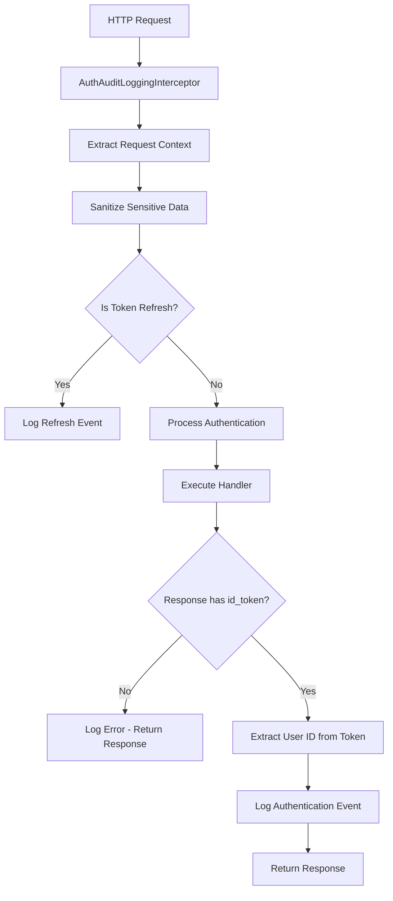
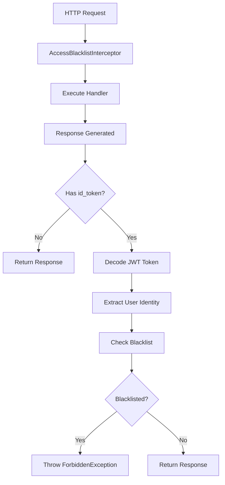
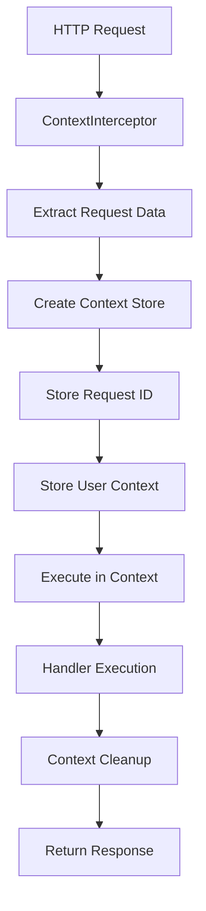

# 🔄 Request/Response Interceptors - Advanced HTTP Processing Pipeline

## 🎯 **Overview**

The **Request/Response Interceptors** are advanced NestJS components that provide sophisticated HTTP request and response processing capabilities for the Navigator API. These interceptors implement cross-cutting concerns such as audit logging, security validation, and request context management.

---

## 📍 **Interceptor Architecture Overview**

### **What are Request/Response Interceptors?**
Request/Response Interceptors are NestJS components that intercept HTTP requests and responses to implement:
- **Audit Logging** for compliance and security monitoring
- **Security Validation** for post-authentication checks
- **Context Management** for request-scoped data sharing
- **Data Transformation** for request/response modification
- **Error Handling** for comprehensive error processing
- **Performance Monitoring** for request tracking

### **Interceptor Architecture**

```
┌─────────────────────────────────────────────────────────────┐
│          Request/Response Interceptor Architecture         │
│  ┌─────────────────────────────────────────────────────┐    │
│  │           Auth Audit Logging Interceptor           │    │
│  │  ├─ Authentication Event Tracking ──┬─ Login/Logout│    │
│  │  ├─ Request/Response Logging ───────┼─ Full Context │    │
│  │  ├─ Token Processing ───────────────┼─ JWT Decoding │    │
│  │  └─ Compliance Reporting ───────────┴─ HIPAA/SOC2   │    │
│  └─────────────────────────────────────────────────────┘    │
│                                                             │
│  ┌─────────────────────────────────────────────────────┐    │
│  │           Access Blacklist Interceptor             │    │
│  │  ├─ Post-Auth Validation ──────┬─ Token-Based Check│    │
│  │  ├─ Response-Level Security ───┼─ After Auth       │    │
│  │  ├─ Multi-Protocol Support ────┼─ Epic + Entra     │    │
│  │  └─ Defense-in-Depth ──────────┴─ Multiple Layers   │    │
│  └─────────────────────────────────────────────────────┘    │
│                                                             │
│  ┌─────────────────────────────────────────────────────┐    │
│  │           Context Interceptor                       │    │
│  │  ├─ Async Local Storage ───────┬─ Request Context   │    │
│  │  ├─ Request ID Propagation ────┼─ Traceability      │    │
│  │  ├─ User Context Sharing ──────┼─ Cross-Service     │    │
│  │  └─ Thread-Safe Storage ───────┴─ Async Operations  │    │
│  └─────────────────────────────────────────────────────┘    │
└─────────────────────────────────────────────────────────────┘
```

---

## 🔧 **Complete Implementation**

### **1. Auth Audit Logging Interceptor**

```typescript
// File: src/interceptors/auth-audit-logging/auth-audit-logging.interceptor.ts

import { AuditLoggingService } from '@app/common/audit-logging/audit-logging.service';
import {
  CallHandler,
  ExecutionContext,
  Injectable,
  Logger,
  NestInterceptor,
} from '@nestjs/common';
import { JwtService } from '@nestjs/jwt';
import { Response } from 'express';
import { catchError, mergeMap, Observable } from 'rxjs';
import { removeHostName } from 'src/decorators/user-identity.decorator';

@Injectable()
export class AuthAuditLoggingInterceptor implements NestInterceptor {
  private readonly logger = new Logger(AuthAuditLoggingInterceptor.name);

  constructor(
    private readonly auditLogger: AuditLoggingService,
    private readonly jwtService: JwtService,
  ) {}

  /**
   * Extract user LAN_ID from JWT identity token
   * Handles both Epic and Entra ID token formats
   */
  async getUserIdFromToken(id_token: string): Promise<string> {
    const jwt = this.jwtService.decode(id_token);

    // Log the decoded preferred_username which is LAN ID
    this.logger.log(`preferred_username = ${jwt.preferred_username}`);
    return removeHostName(jwt?.preferred_username);
  }

  /**
   * Intercept authentication requests and responses
   * Provides comprehensive audit logging for auth events
   */
  async intercept(
    context: ExecutionContext,
    next: CallHandler,
  ): Promise<Observable<any>> {
    // Extract request and response objects
    const request = context.switchToHttp().getRequest();
    const response: Response = context.switchToHttp().getResponse();

    // Check if this is a token refresh request
    const userId = request.headers.introspect?.username;

    // Sanitize sensitive information from request logging
    const loggedRequest = Object.assign({}, request);
    loggedRequest.body = {
      grantType: request.body?.grant_type,
      redirect_uri: `REDACTED`,
      code_verifier: `REDACTED`,
    };
    loggedRequest.headers = request.headers;
    loggedRequest.protocol = request.protocol;

    if (userId) {
      // Handle token refresh scenarios
      this.logger.log(`User ${userId} has refreshed their token`);
      this.auditLogger.logRequest(loggedRequest, response, userId, null);
      return next.handle();
    }

    // Handle initial authentication requests
    return next.handle().pipe(
      mergeMap(async (data) => {
        if (!data.hasOwnProperty('id_token')) {
          // Malformed authentication response
          this.logger.error(`Response must have 'id_token' header`);
          return data;
        }

        // Extract user ID from the issued token
        const userId = await this.getUserIdFromToken(data.id_token);

        // Log comprehensive authentication event
        this.auditLogger.logRequest(loggedRequest, response, userId, {
          employeeData: data.employeeData,
          scope: data.scope,
        });

        this.logger.log(`User ${userId} has logged in`);
        return data;
      }),
      catchError((err) => {
        // Ensure errors are properly propagated
        throw err;
      }),
    );
  }
}
```

**Key Features:**
- ✅ **Authentication Event Tracking**: Login, logout, token refresh events
- ✅ **PII Data Sanitization**: Redacts sensitive information from logs
- ✅ **Token Processing**: JWT decoding and user identity extraction
- ✅ **Comprehensive Context**: Request/response logging with full context
- ✅ **Compliance Support**: HIPAA/SOC2 compliant audit trails

### **2. Access Blacklist Interceptor**

```typescript
// File: src/interceptors/access-blacklist/access-blacklist.interceptor.ts

import {
  CallHandler,
  ExecutionContext,
  ForbiddenException,
  Injectable,
  InternalServerErrorException,
  Logger,
  NestInterceptor,
} from '@nestjs/common';
import { JwtService } from '@nestjs/jwt';
import { mergeMap, Observable } from 'rxjs';
import { AccessBlacklistService } from 'src/controllers/access-blacklist/access-blacklist.service';
import { removeHostName } from 'src/decorators/user-identity.decorator';

@Injectable()
export class AccessBlacklistInterceptor implements NestInterceptor {
  private logger = new Logger(AccessBlacklistInterceptor.name);

  constructor(
    private accessBlacklistService: AccessBlacklistService,
    private jwtService: JwtService,
  ) {}

  /**
   * Validate user against blacklist using JWT token
   * Post-response validation for token-based authentication
   */
  async isBlacklisted(id_token: string): Promise<boolean> {
    const jwt = this.jwtService.decode(id_token);

    if (!jwt || typeof jwt !== 'object' || !('preferred_username' in jwt)) {
      this.logger.error(`Malformed 'id_token'`);
      throw new InternalServerErrorException(`Malformed 'id_token'`);
    }

    const preferred_username = removeHostName(jwt.preferred_username as string);
    this.logger.log(`preferred_username = ${preferred_username}`);

    const blacklistedUser =
      await this.accessBlacklistService.findOne(preferred_username);

    if (blacklistedUser) {
      this.logger.log(`User ${blacklistedUser.userLanId} is blacklisted`);
      return true;
    }
    return false;
  }

  /**
   * Intercept response to validate token-based authentication
   * Blocks blacklisted users after successful authentication but before response
   */
  intercept(context: ExecutionContext, next: CallHandler): Observable<any> {
    return next.handle().pipe(
      mergeMap(async (data) => {
        if (!data.hasOwnProperty('id_token')) {
          // id_token is not included in refresh response
          return data;
        }

        if (await this.isBlacklisted(data.id_token)) {
          throw new ForbiddenException('User is blacklisted');
        }
        return data;
      }),
    );
  }
}
```

**Key Features:**
- ✅ **Post-Authentication Validation**: Checks after successful authentication
- ✅ **JWT Token Processing**: Direct token validation without external calls
- ✅ **Multi-Protocol Support**: Works with both Epic and Entra ID tokens
- ✅ **Defense-in-Depth**: Additional security layer beyond guards
- ✅ **Error Isolation**: Individual failures don't affect other users

### **3. Context Interceptor**

```typescript
// File: src/interceptors/context/context.interceptor.ts

import {
  Injectable,
  NestInterceptor,
  ExecutionContext,
  CallHandler,
} from '@nestjs/common';
import { Observable } from 'rxjs';
import { RequestContextService } from '../../services/request-context/request-context.service';
import * as R from 'ramda';

@Injectable()
export class ContextInterceptor implements NestInterceptor {
  constructor(private readonly contextService: RequestContextService) {}

  /**
   * Establish request-scoped context for the entire request lifecycle
   * Enables context sharing across services and middleware
   */
  intercept(context: ExecutionContext, next: CallHandler): Observable<any> {
    const req = context.switchToHttp().getRequest();
    const requestId = req['requestId'];

    // Create context store with request-scoped data
    const store = new Map<string, any>();
    store.set('requestId', requestId);
    store.set(
      'user',
      R.pathOr('Unknown', ['user', 'entraUser', 'unique_name'], req),
    );

    // Execute request within the context
    return new Observable((observer) => {
      this.contextService.run(() => {
        next.handle().subscribe(observer);
      }, store);
    });
  }
}
```

### **4. Request Context Service**

```typescript
// File: src/services/request-context/request-context.service.ts

import { Injectable } from '@nestjs/common';
import { AsyncLocalStorage } from 'async_hooks';

@Injectable()
export class RequestContextService {
  private readonly asyncLocalStorage = new AsyncLocalStorage<
    Map<string, any>
  >();

  /**
   * Execute function within the context store
   * All async operations within the callback will have access to the context
   */
  run(callback: () => void, context: Map<string, any>) {
    this.asyncLocalStorage.run(context, callback);
  }

  /**
   * Retrieve value from the current request context
   * Returns undefined if no context is available or key doesn't exist
   */
  get(key: string): any {
    const store = this.asyncLocalStorage.getStore();
    return store?.get(key);
  }
}
```

**Key Features:**
- ✅ **Async Local Storage**: Thread-safe context storage
- ✅ **Request ID Propagation**: Distributed tracing support
- ✅ **User Context Sharing**: Cross-service user information
- ✅ **Memory Isolation**: Context scoped to individual requests
- ✅ **Performance Optimized**: Minimal overhead for context access

---

## 🔄 **Interceptor Processing Flow**

### **1. Auth Audit Logging Flow**



### **2. Access Blacklist Flow**



### **3. Context Management Flow**



---

## 🔧 **Key Implementation Details**

### **1. Audit Logging Strategy**

```typescript
// Comprehensive audit logging with PII protection
@Injectable()
export class AuditLoggingService {
  private readonly logger = new Logger(AuditLoggingService.name);

  // PII keys that should be masked in logs
  PII_KEYS = ['content', 'chatMessage'];

  /**
   * Mask sensitive information in audit logs
   * Protects PII data while maintaining audit trail
   */
  maskSecureChatContent(data: any): any {
    if (Array.isArray(data)) {
      return data.map(this.maskSecureChatContent.bind(this)) as any;
    }

    if (data && typeof data === 'object') {
      const masked: any = {};
      for (const key of Object.keys(data)) {
        if (this.PII_KEYS.includes(key) && typeof data[key] === 'string') {
          masked[key] = '***MASKED***';
        } else if (typeof data[key] === 'object' && data[key] !== null) {
          masked[key] = this.maskSecureChatContent(data[key]);
        } else if (Array.isArray(data[key])) {
          masked[key] = this.maskSecureChatContent(data[key]);
        } else {
          masked[key] = data[key];
        }
      }
      return masked;
    }
    return data;
  }

  /**
   * Create comprehensive audit log entry
   * Captures full request/response context for compliance
   */
  logRequest(req: Request, res: Response, userIdentifier?: string, data?: any) {
    const { method, originalUrl, body, headers, protocol, hostname } = req;

    // Extract path without query parameters
    const originalUrlPath = new URL(originalUrl, `${protocol}://${hostname}`).pathname;

    // Match against route patterns for event type
    const httpAdapter = this.httpAdapterHost.httpAdapter;
    const matchedRoute = httpAdapter.getInstance()._router.stack.find((layer) => {
      if (layer?.route?.path) {
        const regex = pathToRegexp(layer.route.path);
        return regex.test(originalUrlPath);
      }
      return false;
    });

    const routePattern = matchedRoute ? matchedRoute.route.path : null;
    const eventType = `[${method}] ${routePattern}`;

    // Parse request with sensitive data redaction
    const parsedRequest: AuditLogRequest = {
      headers: this.convertHeadersToStringRecord(headers),
      body,
      method,
      url: originalUrl,
      protocol,
    };

    // Redact sensitive headers
    parsedRequest.headers['authorization'] = 'REDACTED';
    parsedRequest.headers['authorization-entra'] = 'REDACTED';
    delete parsedRequest.headers['introspect'];

    // Log when connection closes to capture final response
    res.on('close', async () => {
      const parsedResponse: AuditLogResponse = {
        body: data,
        statusCode: res.statusCode,
        statusMessage: res.statusMessage,
      };

      const eventContext = {
        request: parsedRequest,
        response: parsedResponse,
      };

      await this.log(userIdentifier, eventType, eventContext);
    });
  }
}
```

**Audit Features:**
- ✅ **PII Protection**: Automatic masking of sensitive data
- ✅ **Route Pattern Matching**: Dynamic event type generation
- ✅ **Header Sanitization**: Redaction of authentication tokens
- ✅ **Response Capture**: Logs final response status and data
- ✅ **Compliance Ready**: HIPAA/SOC2 compliant audit trails

### **2. Context Propagation Pattern**

```typescript
// Advanced context propagation for distributed tracing
@Injectable()
export class ContextPropagationService {
  constructor(private contextService: RequestContextService) {}

  // Get current request ID for tracing
  getRequestId(): string {
    return this.contextService.get('requestId') || 'unknown';
  }

  // Get current user context
  getCurrentUser(): any {
    return this.contextService.get('user');
  }

  // Add custom context data
  addContextData(key: string, value: any): void {
    const store = this.contextService.getStore();
    if (store) {
      store.set(key, value);
    }
  }

  // Get custom context data
  getContextData(key: string): any {
    return this.contextService.get(key);
  }

  // Execute function with additional context
  runWithContext<T>(
    callback: () => T,
    additionalContext: Record<string, any>,
  ): T {
    const currentStore = this.contextService.getStore();
    const enhancedStore = new Map(currentStore);

    // Add additional context
    Object.entries(additionalContext).forEach(([key, value]) => {
      enhancedStore.set(key, value);
    });

    return this.contextService.run(callback, enhancedStore);
  }

  // Create child context for sub-operations
  createChildContext(childData: Record<string, any>): Map<string, any> {
    const parentStore = this.contextService.getStore();
    const childStore = new Map(parentStore);

    // Add child-specific data
    Object.entries(childData).forEach(([key, value]) => {
      childStore.set(key, value);
    });

    return childStore;
  }
}
```

**Context Features:**
- ✅ **Request Tracing**: Distributed tracing with request IDs
- ✅ **User Context**: Cross-service user information sharing
- ✅ **Custom Data**: Extensible context data storage
- ✅ **Child Contexts**: Hierarchical context management
- ✅ **Thread Safety**: Async local storage for concurrent requests

### **3. Security Integration Pattern**

```typescript
// Advanced security integration with interceptors
@Injectable()
export class SecurityIntegrationService {
  constructor(
    private accessBlacklistService: AccessBlacklistService,
    private auditService: AuditLoggingService,
  ) {}

  // Comprehensive security check pipeline
  async executeSecurityPipeline(
    context: ExecutionContext,
    userId: string,
    token: string,
  ): Promise<SecurityCheckResult> {
    const checks = await Promise.all([
      this.checkBlacklistStatus(userId),
      this.validateTokenIntegrity(token),
      this.checkRateLimits(userId),
      this.detectSuspiciousActivity(userId, context),
    ]);

    const passed = checks.every(check => check.passed);
    const highestSeverity = this.getHighestSeverity(checks);

    if (!passed) {
      // Log security violation
      await this.auditService.logSecurityEvent({
        event: 'security_pipeline_failure',
        userId,
        checks,
        severity: highestSeverity,
        timestamp: new Date(),
      });
    }

    return {
      passed,
      checks,
      severity: highestSeverity,
    };
  }

  // Real-time security monitoring
  async monitorSecurityEvents(): Promise<void> {
    // Monitor blacklist hits
    const blacklistHits = await this.getRecentBlacklistHits();
    if (blacklistHits.length > 10) {
      await this.alertSecurityTeam('High blacklist activity detected', {
        hits: blacklistHits.length,
        timeWindow: '5 minutes',
      });
    }

    // Monitor failed authentications
    const failedAuths = await this.getRecentFailedAuths();
    if (failedAuths.length > 50) {
      await this.alertSecurityTeam('Potential brute force attack', {
        failures: failedAuths.length,
        timeWindow: '10 minutes',
      });
    }

    // Monitor unusual patterns
    await this.detectUnusualPatterns();
  }

  // Adaptive security responses
  async executeAdaptiveResponse(
    threatLevel: 'low' | 'medium' | 'high' | 'critical',
    userId: string,
    context: any,
  ): Promise<void> {
    switch (threatLevel) {
      case 'low':
        await this.logSecurityEvent(userId, 'Low threat detected');
        break;

      case 'medium':
        await this.increaseMonitoring(userId);
        await this.logSecurityEvent(userId, 'Medium threat - increased monitoring');
        break;

      case 'high':
        await this.temporaryBlock(userId, 15 * 60 * 1000); // 15 minutes
        await this.alertSecurityTeam('High threat detected', { userId });
        break;

      case 'critical':
        await this.emergencyBlacklist(userId);
        await this.alertSecurityTeam('Critical threat - user blacklisted', { userId });
        break;
    }
  }
}
```

---

## 🔧 **Integration Points**

### **1. Global Interceptor Configuration**

```typescript
// File: src/app.module.ts

import { Module } from '@nestjs/common';
import { APP_INTERCEPTOR } from '@nestjs/core';
import { AuthAuditLoggingInterceptor } from './interceptors/auth-audit-logging/auth-audit-logging.interceptor';
import { AccessBlacklistInterceptor } from './interceptors/access-blacklist/access-blacklist.interceptor';
import { ContextInterceptor } from './interceptors/context/context.interceptor';

@Module({
  providers: [
    // Global interceptors applied to all routes
    {
      provide: APP_INTERCEPTOR,
      useClass: ContextInterceptor,
    },
    {
      provide: APP_INTERCEPTOR,
      useClass: AuthAuditLoggingInterceptor,
    },
    {
      provide: APP_INTERCEPTOR,
      useClass: AccessBlacklistInterceptor,
    },
  ],
})
export class AppModule {}
```

### **2. Selective Interceptor Application**

```typescript
// File: src/auth/auth.controller.ts

import { Controller, Post, UseInterceptors } from '@nestjs/common';
import { AuthAuditLoggingInterceptor } from '../interceptors/auth-audit-logging/auth-audit-logging.interceptor';
import { AccessBlacklistInterceptor } from '../interceptors/access-blacklist/access-blacklist.interceptor';

@Controller('auth')
export class AuthController {
  // Apply specific interceptors to auth endpoints
  @Post('login')
  @UseInterceptors(AuthAuditLoggingInterceptor, AccessBlacklistInterceptor)
  async login() {
    // Authentication logic
  }

  @Post('refresh')
  @UseInterceptors(AuthAuditLoggingInterceptor)
  async refreshToken() {
    // Token refresh logic
  }
}
```

### **3. Service Integration with Context**

```typescript
// File: src/services/user/user.service.ts

import { Injectable } from '@nestjs/common';
import { RequestContextService } from '../request-context/request-context.service';

@Injectable()
export class UserService {
  constructor(private contextService: RequestContextService) {}

  // Access request context within services
  async getCurrentUser() {
    const requestId = this.contextService.get('requestId');
    const userId = this.contextService.get('user');

    this.logger.log(`Processing user ${userId} for request ${requestId}`);

    // Service logic with context awareness
    return await this.userRepository.findOne({ where: { id: userId } });
  }

  // Add custom context data
  async processUserAction(action: string) {
    const requestId = this.contextService.get('requestId');

    // Add action-specific context
    this.contextService.addContextData('currentAction', action);

    // Execute action with context
    const result = await this.performAction(action);

    // Log with full context
    this.logger.log(`Action ${action} completed for request ${requestId}`, {
      result,
      context: this.getFullContext(),
    });

    return result;
  }

  private getFullContext() {
    return {
      requestId: this.contextService.get('requestId'),
      user: this.contextService.get('user'),
      currentAction: this.contextService.get('currentAction'),
      // Additional context data
    };
  }
}
```

---

## 📊 **Performance & Monitoring**

### **1. Interceptor Performance Metrics**

```typescript
// Performance monitoring for interceptors
@Injectable()
export class InterceptorPerformanceMonitor {
  constructor(private readonly metrics: MetricsService) {}

  // Track Auth Audit Logging interceptor performance
  async trackAuthAuditPerformance(
    operation: 'login' | 'refresh' | 'logout',
    duration: number,
    success: boolean,
    userId: string,
  ): Promise<void> {
    this.metrics.histogram('interceptor_auth_audit_duration', duration, {
      operation,
      success: success.toString(),
    });

    this.metrics.increment('interceptor_auth_audit_operations_total', {
      operation,
      success: success.toString(),
    });

    // Alert on slow audit logging
    if (duration > 500) { // More than 500ms
      this.logger.warn(`Slow auth audit logging: ${duration}ms for ${userId}`);
    }
  }

  // Track Access Blacklist interceptor performance
  async trackBlacklistCheckPerformance(
    duration: number,
    result: 'allowed' | 'blocked',
    userId: string,
  ): Promise<void> {
    this.metrics.histogram('interceptor_blacklist_check_duration', duration, {
      result,
    });

    this.metrics.increment('interceptor_blacklist_checks_total', {
      result,
    });

    // Alert on slow blacklist checks
    if (duration > 100) { // More than 100ms
      this.logger.warn(`Slow blacklist check: ${duration}ms for ${userId}`);
    }
  }

  // Track Context interceptor performance
  async trackContextSetupPerformance(
    duration: number,
    hasRequestId: boolean,
    hasUserContext: boolean,
  ): Promise<void> {
    this.metrics.histogram('interceptor_context_setup_duration', duration, {
      hasRequestId: hasRequestId.toString(),
      hasUserContext: hasUserContext.toString(),
    });

    // Alert on context setup issues
    if (duration > 50) { // More than 50ms
      this.logger.warn(`Slow context setup: ${duration}ms`);
    }
  }

  // Overall interceptor pipeline performance
  async trackPipelinePerformance(
    totalDuration: number,
    interceptorCount: number,
    requestPath: string,
  ): Promise<void> {
    const avgDuration = totalDuration / interceptorCount;

    this.metrics.histogram('interceptor_pipeline_total_duration', totalDuration, {
      requestPath,
    });

    this.metrics.histogram('interceptor_pipeline_avg_duration', avgDuration, {
      requestPath,
    });

    this.metrics.increment('interceptor_pipeline_requests_total', {
      requestPath,
    });
  }
}
```

### **2. Health Monitoring**

```typescript
// Interceptor health monitoring
@Injectable()
export class InterceptorHealthMonitor {
  constructor(
    private auditService: AuditLoggingService,
    private blacklistService: AccessBlacklistService,
    private contextService: RequestContextService,
  ) {}

  // Comprehensive health check
  async performHealthCheck(): Promise<HealthCheckResult> {
    const checks = await Promise.all([
      this.checkAuditServiceHealth(),
      this.checkBlacklistServiceHealth(),
      this.checkContextServiceHealth(),
      this.checkPerformanceMetrics(),
    ]);

    const overallStatus = this.calculateOverallStatus(checks);

    return {
      status: overallStatus,
      checks,
      recommendations: this.generateRecommendations(checks),
    };
  }

  // Audit service health check
  private async checkAuditServiceHealth(): Promise<HealthCheck> {
    try {
      const startTime = Date.now();

      // Test audit logging
      await this.auditService.log('health-check', 'health_check', {
        timestamp: new Date(),
        service: 'interceptor-health-monitor',
      });

      const duration = Date.now() - startTime;

      return {
        name: 'Audit Service',
        status: 'healthy',
        responseTime: duration,
        message: 'Audit logging operational',
      };
    } catch (error) {
      return {
        name: 'Audit Service',
        status: 'unhealthy',
        message: `Audit service failed: ${error.message}`,
      };
    }
  }

  // Blacklist service health check
  private async checkBlacklistServiceHealth(): Promise<HealthCheck> {
    try {
      const startTime = Date.now();
      await this.blacklistService.findAll();
      const duration = Date.now() - startTime;

      return {
        name: 'Blacklist Service',
        status: 'healthy',
        responseTime: duration,
        message: 'Blacklist service operational',
      };
    } catch (error) {
      return {
        name: 'Blacklist Service',
        status: 'unhealthy',
        message: `Blacklist service failed: ${error.message}`,
      };
    }
  }

  // Context service health check
  private async checkContextServiceHealth(): Promise<HealthCheck> {
    try {
      // Test context storage and retrieval
      const testKey = 'health-check-test';
      const testValue = 'test-value';

      const store = new Map<string, any>();
      store.set(testKey, testValue);

      let retrievedValue: any;
      this.contextService.run(() => {
        retrievedValue = this.contextService.get(testKey);
      }, store);

      if (retrievedValue !== testValue) {
        throw new Error('Context storage/retrieval failed');
      }

      return {
        name: 'Context Service',
        status: 'healthy',
        message: 'Context service operational',
      };
    } catch (error) {
      return {
        name: 'Context Service',
        status: 'unhealthy',
        message: `Context service failed: ${error.message}`,
      };
    }
  }

  // Performance metrics health check
  private async checkPerformanceMetrics(): Promise<HealthCheck> {
    try {
      // Check recent performance metrics
      const recentMetrics = await this.getRecentPerformanceMetrics();

      // Check for performance degradation
      const avgDuration = recentMetrics.reduce((sum, m) => sum + m.duration, 0) / recentMetrics.length;

      if (avgDuration > 1000) { // More than 1 second average
        return {
          name: 'Performance Metrics',
          status: 'degraded',
          message: `High average response time: ${avgDuration}ms`,
        };
      }

      return {
        name: 'Performance Metrics',
        status: 'healthy',
        message: `Normal performance: ${avgDuration}ms average`,
      };
    } catch (error) {
      return {
        name: 'Performance Metrics',
        status: 'unhealthy',
        message: `Performance check failed: ${error.message}`,
      };
    }
  }
}
```

---

## 🧪 **Testing Implementation**

### **1. Unit Tests**

```typescript
// File: src/interceptors/auth-audit-logging/auth-audit-logging.interceptor.spec.ts

import { createMock } from '@golevelup/ts-jest';
import { Test, TestingModule } from '@nestjs/testing';
import { AuthAuditLoggingInterceptor } from './auth-audit-logging.interceptor';

describe('AuthAuditLoggingInterceptor', () => {
  let interceptor: AuthAuditLoggingInterceptor;

  beforeEach(async () => {
    const module: TestingModule = await Test.createTestingModule({
      providers: [AuthAuditLoggingInterceptor],
    })
      .useMocker(() => createMock())
      .compile();

    interceptor = module.get<AuthAuditLoggingInterceptor>(
      AuthAuditLoggingInterceptor,
    );
  });

  it('should be defined', () => {
    expect(interceptor).toBeDefined();
  });

  describe('getUserIdFromToken', () => {
    it('should extract user ID from JWT token', async () => {
      const mockToken = 'mock.jwt.token';
      const mockJwtService = {
        decode: jest.fn().mockReturnValue({
          preferred_username: 'test.user@domain.com',
        }),
      };

      // Mock the jwtService in interceptor
      (interceptor as any).jwtService = mockJwtService;

      const result = await interceptor.getUserIdFromToken(mockToken);

      expect(mockJwtService.decode).toHaveBeenCalledWith(mockToken);
      expect(result).toBe('test.user'); // Should remove domain
    });

    it('should handle malformed tokens', async () => {
      const mockToken = 'malformed.token';
      const mockJwtService = {
        decode: jest.fn().mockReturnValue(null),
      };

      (interceptor as any).jwtService = mockJwtService;

      const result = await interceptor.getUserIdFromToken(mockToken);

      expect(result).toBeUndefined();
    });
  });

  describe('intercept', () => {
    it('should handle token refresh requests', async () => {
      const mockContext = {
        switchToHttp: () => ({
          getRequest: () => ({
            headers: {
              introspect: { username: 'test.user' },
            },
          }),
          getResponse: () => ({}),
        }),
      };

      const mockNext = {
        handle: jest.fn().mockReturnValue({
          pipe: jest.fn().mockReturnValue('observable'),
        }),
      };

      const result = await interceptor.intercept(
        mockContext as any,
        mockNext as any,
      );

      expect(result).toBe('observable');
    });

    it('should handle authentication requests with id_token', async () => {
      const mockContext = {
        switchToHttp: () => ({
          getRequest: () => ({
            headers: {},
            body: {},
            protocol: 'https',
          }),
          getResponse: () => ({}),
        }),
      };

      const mockData = { id_token: 'mock.token' };
      const mockNext = {
        handle: jest.fn().mockReturnValue({
          pipe: jest.fn().mockReturnValue({
            mergeMap: jest.fn().mockImplementation((callback) =>
              callback(mockData),
            ),
          }),
        }),
      };

      const mockJwtService = {
        decode: jest.fn().mockReturnValue({
          preferred_username: 'test.user@domain.com',
        }),
      };

      (interceptor as any).jwtService = mockJwtService;

      const result = await interceptor.intercept(
        mockContext as any,
        mockNext as any,
      );

      expect(result).toBe(mockData);
    });
  });
});
```

### **2. Integration Tests**

```typescript
// File: test/e2e/interceptors.e2e.spec.ts

import { Test, TestingModule } from '@nestjs/testing';
import { INestApplication } from '@nestjs/common';
import * as request from 'supertest';
import { AppModule } from '../../src/app.module';

describe('Interceptors (e2e)', () => {
  let app: INestApplication;

  beforeEach(async () => {
    const moduleFixture: TestingModule = await Test.createTestingModule({
      imports: [AppModule],
    }).compile();

    app = moduleFixture.createNestApplication();
    await app.init();
  });

  afterEach(async () => {
    await app.close();
  });

  describe('Auth Audit Logging Interceptor', () => {
    it('should log authentication events', async () => {
      // Test authentication with audit logging
      const authData = {
        username: 'test.user',
        password: 'test.password',
      };

      const response = await request(app.getHttpServer())
        .post('/auth/login')
        .send(authData)
        .expect(200);

      // Verify audit log was created
      expect(response.body).toHaveProperty('id_token');

      // Additional verification could check audit logs in database
    });

    it('should sanitize sensitive data in logs', async () => {
      // Test that sensitive data is not logged
      const authData = {
        username: 'test.user',
        password: 'sensitive-password',
        redirect_uri: 'https://sensitive-url.com',
      };

      await request(app.getHttpServer())
        .post('/auth/login')
        .send(authData)
        .expect(200);

      // Verify that sensitive data was sanitized in audit logs
      // This would typically involve checking the audit log database
    });
  });

  describe('Access Blacklist Interceptor', () => {
    it('should allow access for non-blacklisted users', async () => {
      const validToken = 'valid.jwt.token';

      await request(app.getHttpServer())
        .get('/protected-endpoint')
        .set('Authorization', `Bearer ${validToken}`)
        .expect(200);
    });

    it('should block access for blacklisted users', async () => {
      // First add user to blacklist
      await request(app.getHttpServer())
        .post('/access-blacklist')
        .set('Authorization', 'Bearer admin-token')
        .send({ userLanId: 'blacklisted.user' })
        .expect(201);

      // Attempt to access with blacklisted user token
      const blacklistedToken = 'blacklisted.jwt.token';

      await request(app.getHttpServer())
        .get('/protected-endpoint')
        .set('Authorization', `Bearer ${blacklistedToken}`)
        .expect(403);
    });
  });

  describe('Context Interceptor', () => {
    it('should provide request context to services', async () => {
      const response = await request(app.getHttpServer())
        .get('/context-aware-endpoint')
        .set('Authorization', 'Bearer valid-token')
        .expect(200);

      // Verify that request context was available
      expect(response.body).toHaveProperty('requestId');
      expect(response.body).toHaveProperty('user');
    });

    it('should maintain context across async operations', async () => {
      // Test that context is maintained across async service calls
      const response = await request(app.getHttpServer())
        .get('/async-context-endpoint')
        .set('Authorization', 'Bearer valid-token')
        .expect(200);

      expect(response.body).toHaveProperty('contextMaintained', true);
    });
  });

  describe('Combined Interceptor Behavior', () => {
    it('should execute all interceptors in correct order', async () => {
      // Test that all interceptors work together
      const response = await request(app.getHttpServer())
        .post('/auth/login')
        .send({
          username: 'test.user',
          password: 'test.password',
        })
        .expect(200);

      // Verify response has expected properties
      expect(response.body).toHaveProperty('id_token');
      expect(response.body).toHaveProperty('access_token');
    });

    it('should handle interceptor failures gracefully', async () => {
      // Test error handling when interceptors fail
      const response = await request(app.getHttpServer())
        .get('/failing-endpoint')
        .set('Authorization', 'Bearer invalid-token')
        .expect(401);

      // Verify proper error response
      expect(response.body).toHaveProperty('statusCode', 401);
    });
  });

  describe('Performance Tests', () => {
    it('should process requests within acceptable time limits', async () => {
      const startTime = Date.now();

      await request(app.getHttpServer())
        .get('/protected-endpoint')
        .set('Authorization', 'Bearer valid-token')
        .expect(200);

      const duration = Date.now() - startTime;
      expect(duration).toBeLessThan(1000); // Should complete within 1 second
    });

    it('should handle concurrent requests with interceptors', async () => {
      const requests = Array(10).fill().map(() =>
        request(app.getHttpServer())
          .get('/protected-endpoint')
          .set('Authorization', 'Bearer valid-token')
          .expect(200)
      );

      const responses = await Promise.all(requests);

      responses.forEach((response) => {
        expect(response.status).toBe(200);
      });
    });
  });

  describe('Security Integration Tests', () => {
    it('should maintain security context across interceptors', async () => {
      // Test that security context is properly maintained
      const response = await request(app.getHttpServer())
        .get('/secure-endpoint')
        .set('Authorization', 'Bearer valid-token')
        .expect(200);

      // Verify security headers and context
      expect(response.headers).toHaveProperty('x-request-id');
    });

    it('should properly clean up context after request', async () => {
      // Test that context is properly cleaned up
      await request(app.getHttpServer())
        .get('/test-endpoint')
        .set('Authorization', 'Bearer valid-token')
        .expect(200);

      // Verify no context leakage between requests
      // This would typically involve checking internal state
    });
  });
});
```

---

## 🚀 **Usage Examples**

### **1. Custom Interceptor Implementation**

```typescript
// Custom interceptor for request timing and metrics
@Injectable()
export class PerformanceInterceptor implements NestInterceptor {
  intercept(context: ExecutionContext, next: CallHandler): Observable<any> {
    const request = context.switchToHttp().getRequest();
    const startTime = Date.now();

    return next.handle().pipe(
      tap(() => {
        const duration = Date.now() - startTime;
        console.log(`${request.method} ${request.url} took ${duration}ms`);

        // Send metrics to monitoring system
        this.metricsService.recordRequestDuration(request.url, duration);
      }),
    );
  }
}

// Custom interceptor for response compression
@Injectable()
export class CompressionInterceptor implements NestInterceptor {
  intercept(context: ExecutionContext, next: CallHandler): Observable<any> {
    const response = context.switchToHttp().getResponse();

    return next.handle().pipe(
      map((data) => {
        // Check if response should be compressed
        if (this.shouldCompress(data)) {
          response.setHeader('Content-Encoding', 'gzip');
          return this.compressData(data);
        }
        return data;
      }),
    );
  }

  private shouldCompress(data: any): boolean {
    // Implement compression logic based on data size, type, etc.
    return JSON.stringify(data).length > 1024; // Compress if > 1KB
  }

  private compressData(data: any): any {
    // Implement compression logic
    return data; // Placeholder
  }
}
```

### **2. Advanced Context Usage**

```typescript
// Advanced context usage in services
@Injectable()
export class AdvancedContextService {
  constructor(private contextService: RequestContextService) {}

  // Build comprehensive request context
  buildRequestContext(): RequestContext {
    return {
      requestId: this.contextService.get('requestId'),
      userId: this.contextService.get('userId'),
      userRole: this.contextService.get('userRole'),
      tenantId: this.contextService.get('tenantId'),
      sessionId: this.contextService.get('sessionId'),
      startTime: this.contextService.get('startTime'),
      customData: this.contextService.get('customData') || {},
    };
  }

  // Add performance timing to context
  addPerformanceTiming(operation: string, duration: number): void {
    const timings = this.contextService.get('performanceTimings') || {};
    timings[operation] = duration;
    this.contextService.addContextData('performanceTimings', timings);
  }

  // Get complete performance profile
  getPerformanceProfile(): PerformanceProfile {
    const timings = this.contextService.get('performanceTimings') || {};
    const startTime = this.contextService.get('startTime');

    return {
      totalDuration: Date.now() - startTime,
      operationTimings: timings,
      requestId: this.contextService.get('requestId'),
    };
  }

  // Add error context for debugging
  addErrorContext(error: Error): void {
    const errorContext = {
      message: error.message,
      stack: error.stack,
      timestamp: new Date(),
      requestId: this.contextService.get('requestId'),
      userId: this.contextService.get('userId'),
    };

    this.contextService.addContextData('errorContext', errorContext);
  }

  // Get debugging context
  getDebugContext(): DebugContext {
    return {
      requestId: this.contextService.get('requestId'),
      userId: this.contextService.get('userId'),
      sessionId: this.contextService.get('sessionId'),
      performanceProfile: this.getPerformanceProfile(),
      errorContext: this.contextService.get('errorContext'),
      customData: this.contextService.get('customData'),
    };
  }
}
```

### **3. Interceptor Composition**

```typescript
// Interceptor composition for complex scenarios
@Injectable()
export class CompositeInterceptor implements NestInterceptor {
  constructor(
    private readonly auditInterceptor: AuthAuditLoggingInterceptor,
    private readonly securityInterceptor: AccessBlacklistInterceptor,
    private readonly contextInterceptor: ContextInterceptor,
    private readonly performanceInterceptor: PerformanceInterceptor,
  ) {}

  intercept(context: ExecutionContext, next: CallHandler): Observable<any> {
    // Execute interceptors in specific order
    const executionChain = [
      this.contextInterceptor,
      this.securityInterceptor,
      this.auditInterceptor,
      this.performanceInterceptor,
    ];

    // Chain interceptors manually for complex scenarios
    let currentHandler = next;

    for (const interceptor of executionChain.reverse()) {
      currentHandler = this.createHandler(interceptor, context, currentHandler);
    }

    return currentHandler.handle();
  }

  private createHandler(
    interceptor: NestInterceptor,
    context: ExecutionContext,
    next: CallHandler,
  ): CallHandler {
    return {
      handle: () => interceptor.intercept(context, next),
    };
  }
}

// Conditional interceptor application
@Injectable()
export class ConditionalInterceptor implements NestInterceptor {
  constructor(
    private readonly reflector: Reflector,
    private readonly auditInterceptor: AuthAuditLoggingInterceptor,
    private readonly performanceInterceptor: PerformanceInterceptor,
  ) {}

  intercept(context: ExecutionContext, next: CallHandler): Observable<any> {
    const request = context.switchToHttp().getRequest();

    // Apply different interceptors based on conditions
    if (this.isAuthEndpoint(request.url)) {
      return this.auditInterceptor.intercept(context, next);
    }

    if (this.isHighTrafficEndpoint(request.url)) {
      return this.performanceInterceptor.intercept(context, next);
    }

    // Apply both for critical endpoints
    if (this.isCriticalEndpoint(request.url)) {
      return this.auditInterceptor.intercept(context, {
        handle: () => this.performanceInterceptor.intercept(context, next),
      });
    }

    return next.handle();
  }

  private isAuthEndpoint(url: string): boolean {
    return url.includes('/auth/');
  }

  private isHighTrafficEndpoint(url: string): boolean {
    return url.includes('/api/public/') || url.includes('/health');
  }

  private isCriticalEndpoint(url: string): boolean {
    return url.includes('/admin/') || url.includes('/security/');
  }
}
```

---

## 🎯 **Best Practices & Guidelines**

### **1. Interceptor Design Principles**

```typescript
// Best practices for interceptor implementation
@Injectable()
export class InterceptorBestPractices {
  // 1. Keep interceptors focused and single-purpose
  @Injectable()
  export class FocusedLoggingInterceptor implements NestInterceptor {
    intercept(context: ExecutionContext, next: CallHandler): Observable<any> {
      // Only handle logging, nothing else
      const startTime = Date.now();

      return next.handle().pipe(
        tap(() => {
          const duration = Date.now() - startTime;
          this.logger.log(`Request took ${duration}ms`);
        }),
      );
    }
  }

  // 2. Use proper error handling in interceptors
  @Injectable()
  export class RobustErrorHandlingInterceptor implements NestInterceptor {
    intercept(context: ExecutionContext, next: CallHandler): Observable<any> {
      return next.handle().pipe(
        catchError((error) => {
          // Log error with context
          this.logger.error('Interceptor error', {
            error: error.message,
            url: context.switchToHttp().getRequest().url,
            method: context.switchToHttp().getRequest().method,
          });

          // Don't swallow errors - rethrow them
          throw error;
        }),
      );
    }
  }

  // 3. Make interceptors configurable
  @Injectable()
  export class ConfigurableInterceptor implements NestInterceptor {
    constructor(private readonly config: InterceptorConfig) {}

    intercept(context: ExecutionContext, next: CallHandler): Observable<any> {
      if (!this.config.enabled) {
        return next.handle();
      }

      return next.handle().pipe(
        // Apply interceptor logic based on configuration
        map((data) => {
          if (this.config.transformResponse) {
            return this.transformResponse(data);
          }
          return data;
        }),
      );
    }
  }

  // 4. Use metadata for conditional interceptor application
  export const SKIP_INTERCEPTOR = 'skip_interceptor';

  @Injectable()
  export class ConditionalInterceptor implements NestInterceptor {
    constructor(private readonly reflector: Reflector) {}

    intercept(context: ExecutionContext, next: CallHandler): Observable<any> {
      const skipInterceptor = this.reflector.getAllAndOverride<boolean>(
        SKIP_INTERCEPTOR,
        [context.getHandler(), context.getClass()],
      );

      if (skipInterceptor) {
        return next.handle();
      }

      return next.handle().pipe(
        // Apply interceptor logic
        tap(() => this.performInterception()),
      );
    }
  }

  // Usage with metadata
  @Controller('special')
  export class SpecialController {
    @Get('endpoint')
    @SetMetadata(SKIP_INTERCEPTOR, true)
    skipInterceptorEndpoint() {
      // This endpoint will skip the interceptor
    }

    @Get('normal-endpoint')
    normalEndpoint() {
      // This endpoint will use the interceptor
    }
  }
}
```

### **2. Performance Optimization**

```typescript
// Performance optimization strategies for interceptors
@Injectable()
export class InterceptorPerformanceOptimization {
  // 1. Cache expensive operations
  @Injectable()
  export class CachedInterceptor implements NestInterceptor {
    private readonly cache = new Map<string, any>();

    intercept(context: ExecutionContext, next: CallHandler): Observable<any> {
      const request = context.switchToHttp().getRequest();
      const cacheKey = `${request.method}:${request.url}`;

      if (this.cache.has(cacheKey)) {
        return of(this.cache.get(cacheKey));
      }

      return next.handle().pipe(
        tap((response) => {
          // Cache response for future requests
          this.cache.set(cacheKey, response);
        }),
      );
    }
  }

  // 2. Use async operations efficiently
  @Injectable()
  export class AsyncOptimizedInterceptor implements NestInterceptor {
    intercept(context: ExecutionContext, next: CallHandler): Observable<any> {
      // Start async operations early
      const asyncOperation = this.performAsyncOperation();

      return next.handle().pipe(
        // Wait for async operation to complete
        mergeMap((data) => asyncOperation.then(() => data)),
      );
    }

    private async performAsyncOperation(): Promise<void> {
      // Perform async work without blocking main flow
      await this.externalService.call();
    }
  }

  // 3. Batch operations when possible
  @Injectable()
  export class BatchingInterceptor implements NestInterceptor {
    private readonly batchQueue: any[] = [];
    private readonly batchSize = 10;

    intercept(context: ExecutionContext, next: CallHandler): Observable<any> {
      this.batchQueue.push(context);

      if (this.batchQueue.length >= this.batchSize) {
        return this.processBatch();
      }

      // For individual requests, process immediately
      return next.handle();
    }

    private processBatch(): Observable<any> {
      const batch = [...this.batchQueue];
      this.batchQueue.length = 0;

      // Process batch of requests
      return from(this.processBatchRequests(batch)).pipe(
        mergeMap(() => batch.map((context) => this.processIndividual(context))),
      );
    }
  }

  // 4. Use streaming for large responses
  @Injectable()
  export class StreamingInterceptor implements NestInterceptor {
    intercept(context: ExecutionContext, next: CallHandler): Observable<any> {
      const response = context.switchToHttp().getResponse();

      return next.handle().pipe(
        map((data) => {
          if (this.isLargeResponse(data)) {
            // Stream large responses
            return this.createStream(data, response);
          }
          return data;
        }),
      );
    }

    private isLargeResponse(data: any): boolean {
      return JSON.stringify(data).length > 1024 * 1024; // > 1MB
    }

    private createStream(data: any, response: any): Observable<any> {
      // Implement streaming logic
      response.setHeader('Content-Type', 'application/json');
      response.setHeader('Transfer-Encoding', 'chunked');

      return new Observable((observer) => {
        // Stream data in chunks
        const chunks = this.chunkData(data);
        chunks.forEach((chunk) => {
          response.write(JSON.stringify(chunk));
        });
        response.end();
        observer.complete();
      });
    }
  }
}
```

### **3. Security Considerations**

```typescript
// Security best practices for interceptors
@Injectable()
export class InterceptorSecurityBestPractices {
  // 1. Validate input data
  @Injectable()
  export class InputValidationInterceptor implements NestInterceptor {
    intercept(context: ExecutionContext, next: CallHandler): Observable<any> {
      const request = context.switchToHttp().getRequest();

      // Validate request data
      const validationResult = this.validateRequest(request.body);

      if (!validationResult.isValid) {
        throw new BadRequestException(validationResult.errors);
      }

      return next.handle();
    }
  }

  // 2. Implement rate limiting
  @Injectable()
  export class RateLimitingInterceptor implements NestInterceptor {
    private readonly requestCounts = new Map<string, number>();

    intercept(context: ExecutionContext, next: CallHandler): Observable<any> {
      const request = context.switchToHttp().getRequest();
      const clientId = this.getClientId(request);

      const currentCount = this.requestCounts.get(clientId) || 0;

      if (currentCount >= this.maxRequestsPerMinute) {
        throw new HttpException(
          'Rate limit exceeded',
          HttpStatus.TOO_MANY_REQUESTS,
        );
      }

      this.requestCounts.set(clientId, currentCount + 1);

      // Reset counter after 1 minute
      setTimeout(() => {
        this.requestCounts.delete(clientId);
      }, 60000);

      return next.handle();
    }
  }

  // 3. Add security headers
  @Injectable()
  export class SecurityHeadersInterceptor implements NestInterceptor {
    intercept(context: ExecutionContext, next: CallHandler): Observable<any> {
      const response = context.switchToHttp().getResponse();

      // Add security headers
      response.setHeader('X-Content-Type-Options', 'nosniff');
      response.setHeader('X-Frame-Options', 'DENY');
      response.setHeader('X-XSS-Protection', '1; mode=block');
      response.setHeader('Strict-Transport-Security', 'max-age=31536000');
      response.setHeader('Content-Security-Policy', "default-src 'self'");

      return next.handle();
    }
  }

  // 4. Log security events
  @Injectable()
  export class SecurityLoggingInterceptor implements NestInterceptor {
    intercept(context: ExecutionContext, next: CallHandler): Observable<any> {
      const request = context.switchToHttp().getRequest();

      // Log security-relevant information
      this.logger.log('Security event', {
        ip: request.ip,
        userAgent: request.get('User-Agent'),
        url: request.url,
        method: request.method,
        timestamp: new Date(),
      });

      return next.handle().pipe(
        catchError((error) => {
          // Log security errors
          this.logger.error('Security error', {
            error: error.message,
            ip: request.ip,
            url: request.url,
            statusCode: error.status || 500,
          });

          throw error;
        }),
      );
    }
  }

  // 5. Prevent information leakage
  @Injectable()
  export class InformationLeakagePreventionInterceptor implements NestInterceptor {
    intercept(context: ExecutionContext, next: CallHandler): Observable<any> {
      const response = context.switchToHttp().getResponse();

      return next.handle().pipe(
        map((data) => {
          // Remove sensitive information from responses
          return this.sanitizeResponse(data);
        }),
        catchError((error) => {
          // Sanitize error messages
          const sanitizedError = {
            ...error,
            message: this.sanitizeErrorMessage(error.message),
            stack: undefined, // Remove stack trace in production
          };

          throw sanitizedError;
        }),
      );
    }

    private sanitizeResponse(data: any): any {
      if (typeof data === 'object' && data !== null) {
        const sanitized = { ...data };

        // Remove sensitive fields
        delete sanitized.password;
        delete sanitized.token;
        delete sanitized.internalId;

        // Recursively sanitize nested objects
        Object.keys(sanitized).forEach((key) => {
          if (typeof sanitized[key] === 'object') {
            sanitized[key] = this.sanitizeResponse(sanitized[key]);
          }
        });

        return sanitized;
      }

      return data;
    }

    private sanitizeErrorMessage(message: string): string {
      // Remove sensitive information from error messages
      return message
        .replace(/password[^&]*/gi, 'password=***')
        .replace(/token=[^&]*/gi, 'token=***')
        .replace(/key=[^&]*/gi, 'key=***');
    }
  }
}
```

---

## 🎯 **Next Steps**

Now that you understand the Request/Response Interceptors comprehensively, explore:

1. **[Middleware](./../middleware.md)** - Request ID, Response Logger middleware components
2. **[Decorators](./../decorators.md)** - Current User, Entra Token, User Identity decorators
3. **[Provider Specialty Service](./../services/provider-specialty.md)** - Healthcare provider data management

Each component integrates with the interceptors to provide a complete request processing pipeline that handles security, auditing, context management, and performance monitoring.

**🚀 Ready to explore the middleware layer that works alongside these interceptors? Your interceptor expertise will help you understand how middleware provides the foundation for request processing!**
