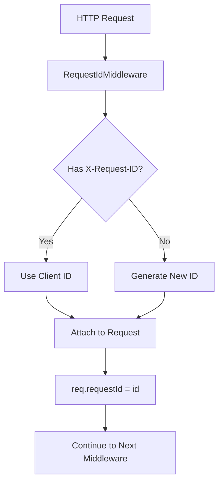
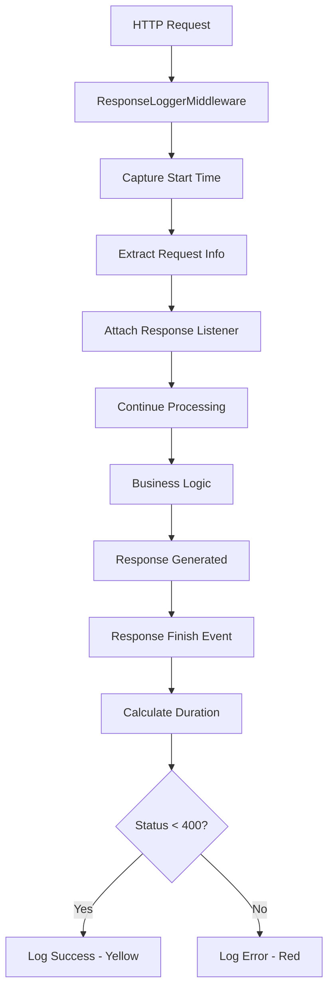
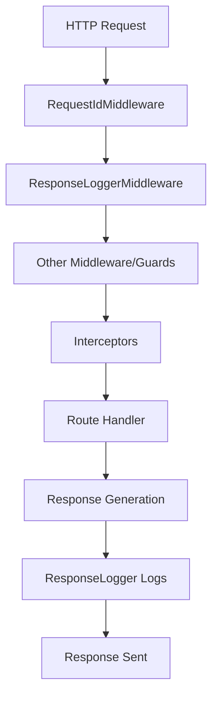

# 🔗 HTTP Middleware - Request Processing Foundation

## 🎯 **Overview**

The **HTTP Middleware** components are the foundational layer of the Navigator API's request processing pipeline. These NestJS middleware functions intercept HTTP requests and responses at the earliest stage, providing essential infrastructure services like request tracking, performance monitoring, and centralized logging.

---

## 📍 **Middleware Architecture Overview**

### **What are HTTP Middleware Components?**
HTTP Middleware are functions that have access to the request object (`req`), the response object (`res`), and the next middleware function in the application's request-response cycle. They provide:

- **Request Tracking** with unique identifiers for distributed tracing
- **Performance Monitoring** with response time measurement
- **Centralized Logging** for debugging and monitoring
- **Request/Response Processing** at the HTTP level
- **Infrastructure Services** for the entire application

### **Middleware Architecture**

```
┌─────────────────────────────────────────────────────────────┐
│          HTTP Middleware Architecture                       │
│  ┌─────────────────────────────────────────────────────┐    │
│  │           Request ID Middleware                      │    │
│  │  ├─ Unique Request Tracking ─────┬─ Distributed Tracing│    │
│  │  ├─ Header Processing ───────────┼─ X-Request-ID Header│    │
│  │  ├─ Fallback Generation ─────────┼─ Auto-Generated IDs │    │
│  │  └─ Context Propagation ─────────┴─ Cross-Service      │    │
│  └─────────────────────────────────────────────────────┘    │
│                                                             │
│  ┌─────────────────────────────────────────────────────┐    │
│  │           Response Logger Middleware                │    │
│  │  ├─ Performance Monitoring ─────┬─ Response Time     │    │
│  │  ├─ Status Code Logging ────────┼─ HTTP Status       │    │
│  │  ├─ Request/Response Tracking ──┼─ Method & URL       │    │
│  │  └─ Error Highlighting ─────────┴─ Color-Coded Logs   │    │
│  └─────────────────────────────────────────────────────┘    │
│                                                             │
│  ┌─────────────────────────────────────────────────────┐    │
│  │           Integration & Flow                       │    │
│  │  ├─ Early Request Processing ──┬─ First in Pipeline │    │
│  │  ├─ Global Application ────────┼─ All Routes         │    │
│  │  ├─ Infrastructure Layer ──────┼─ Foundation Services│    │
│  │  └─ Monitoring Integration ────┴─ Performance Metrics │    │
│  └─────────────────────────────────────────────────────┘    │
└─────────────────────────────────────────────────────────────┘
```

---

## 🔧 **Complete Implementation**

### **1. Request ID Middleware**

```typescript
// File: src/middleware/request-id/request-id.middleware.ts

import { Injectable, NestMiddleware } from '@nestjs/common';
import { Request, Response, NextFunction } from 'express';
import { faker } from '@faker-js/faker';

@Injectable()
export class RequestIdMiddleware implements NestMiddleware {
  /**
   * Generate or extract unique request identifier
   * Provides distributed tracing capabilities
   */
  use(req: Request, res: Response, next: NextFunction) {
    // Use client-provided request ID or generate a new one
    req['requestId'] = req.headers['x-request-id'] || generateRequestId();

    // Continue to next middleware
    next();
  }
}

/**
 * Generate unique request identifier
 * Uses faker.js for cryptographically secure UUID generation
 */
function generateRequestId(): string {
  return `req-api-generated-${faker.string.uuid()}`;
}
```

**Key Features:**
- ✅ **Client-Supplied IDs**: Honors `X-Request-ID` header from client
- ✅ **Automatic Fallback**: Generates unique ID when not provided
- ✅ **Distributed Tracing**: Enables request tracking across services
- ✅ **Context Storage**: Attaches to request object for downstream use

### **2. Response Logger Middleware**

```typescript
// File: src/middleware/response-logger/response-logger.middleware.ts

import { Injectable, Logger, NestMiddleware } from '@nestjs/common';
import { redBright, yellowBright } from 'chalk';
import { Request, Response } from 'express';

/**
 * Middleware to log API response code and time
 * Provides comprehensive request/response monitoring
 */
@Injectable()
export class ResponseLoggerMiddleware implements NestMiddleware {
  private logger = new Logger(ResponseLoggerMiddleware.name);

  /**
   * Log HTTP request/response details with timing
   * Monitors performance and provides debugging information
   */
  use(req: Request, res: Response, next: () => void) {
    // Capture high-resolution start time
    const startAt = process.hrtime();
    const { method, originalUrl } = req;

    // Attach listener to response finish event
    res.on('finish', () => {
      const { statusCode } = res;

      // Calculate response time in milliseconds
      const diff = process.hrtime(startAt);
      const responseTime = Math.round(diff[0] * 1e3 + diff[1] * 1e-6);

      // Log successful requests (2xx, 3xx)
      if (statusCode < 400) {
        this.logger.debug(
          `${method} ${statusCode} - ${originalUrl} ${yellowBright(`[${responseTime} ms]`)}`,
        );
      } else {
        // Highlight error responses (4xx, 5xx) in red
        this.logger.debug(
          `${redBright(`${method} ${statusCode}`)} ${originalUrl} ${yellowBright(`[${responseTime} ms]`)}`,
        );
      }
    });

    // Continue to next middleware
    next();
  }
}
```

**Key Features:**
- ✅ **Performance Monitoring**: High-resolution response time measurement
- ✅ **Status Code Tracking**: HTTP status code logging
- ✅ **Visual Error Highlighting**: Color-coded error responses
- ✅ **Request Context**: Method, URL, and timing information
- ✅ **Non-Blocking**: Uses event listeners to avoid blocking request flow

---

## 🔄 **Middleware Processing Flow**

### **1. Request ID Flow**



### **2. Response Logger Flow**



### **3. Combined Middleware Flow**



---

## 🔧 **Key Implementation Details**

### **1. Request ID Generation Strategy**

```typescript
// Advanced request ID generation with multiple strategies
@Injectable()
export class RequestIdGenerator {
  // Strategy 1: Client-provided ID validation
  generateFromClientHeader(headerValue: string | string[]): string {
    if (Array.isArray(headerValue)) {
      // Use first value if multiple provided
      return headerValue[0];
    }

    if (typeof headerValue === 'string' && headerValue.length > 0) {
      // Validate format (optional)
      if (this.isValidRequestId(headerValue)) {
        return headerValue;
      }
    }

    // Fallback to generated ID
    return this.generateUniqueId();
  }

  // Strategy 2: Unique ID generation with prefixes
  generateUniqueId(prefix?: string): string {
    const baseId = faker.string.uuid();
    const timestamp = Date.now();

    if (prefix) {
      return `${prefix}-${timestamp}-${baseId}`;
    }

    return `req-${timestamp}-${baseId}`;
  }

  // Strategy 3: Context-aware ID generation
  generateContextAwareId(context: RequestContext): string {
    const { service, environment, version } = context;

    return `${service}-${environment}-${version}-${faker.string.uuid()}`;
  }

  // Validation helper
  private isValidRequestId(id: string): boolean {
    // UUID v4 format validation
    const uuidRegex = /^[0-9a-f]{8}-[0-9a-f]{4}-4[0-9a-f]{3}-[89ab][0-9a-f]{3}-[0-9a-f]{12}$/i;
    return uuidRegex.test(id);
  }
}
```

**ID Generation Features:**
- ✅ **Client Priority**: Honors client-provided request IDs
- ✅ **Validation**: Ensures ID format correctness
- ✅ **Fallback Strategy**: Automatic generation when needed
- ✅ **Context Awareness**: Service and environment-specific prefixes
- ✅ **Uniqueness Guarantee**: Cryptographically secure UUIDs

### **2. Performance Measurement**

```typescript
// High-precision performance measurement
@Injectable()
export class PerformanceMeasurementService {
  // High-resolution timing using Node.js process.hrtime
  measureExecutionTime<T>(operation: () => T): { result: T; duration: number } {
    const startTime = process.hrtime.bigint();

    const result = operation();

    const endTime = process.hrtime.bigint();
    const duration = Number(endTime - startTime) / 1e6; // Convert to milliseconds

    return { result, duration };
  }

  // Middleware-specific performance measurement
  measureMiddlewarePerformance(
    req: Request,
    middlewareName: string,
  ): { duration: number; cleanup: () => void } {
    const startTime = process.hrtime.bigint();

    const cleanup = () => {
      const endTime = process.hrtime.bigint();
      const duration = Number(endTime - startTime) / 1e6;

      // Log performance metrics
      this.logger.debug(`${middlewareName} took ${duration.toFixed(3)}ms`, {
        method: req.method,
        url: req.originalUrl,
        middleware: middlewareName,
        duration,
      });

      // Send to metrics collection
      this.metricsService.recordMiddlewareDuration(middlewareName, duration);
    };

    return { duration: 0, cleanup };
  }

  // Response time categorization
  categorizeResponseTime(duration: number): 'fast' | 'normal' | 'slow' | 'critical' {
    if (duration < 100) return 'fast';
    if (duration < 500) return 'normal';
    if (duration < 2000) return 'slow';
    return 'critical';
  }

  // Performance alerting
  alertOnSlowPerformance(
    middlewareName: string,
    duration: number,
    threshold: number = 1000,
  ): void {
    if (duration > threshold) {
      this.logger.warn(`Slow middleware performance: ${middlewareName}`, {
        middleware: middlewareName,
        duration,
        threshold,
      });

      // Send alert to monitoring system
      this.alertingService.sendPerformanceAlert({
        component: 'middleware',
        name: middlewareName,
        duration,
        threshold,
      });
    }
  }
}
```

**Performance Features:**
- ✅ **High-Resolution Timing**: Microsecond precision using `process.hrtime`
- ✅ **Memory Efficient**: Minimal overhead for timing measurements
- ✅ **Categorization**: Automatic performance categorization
- ✅ **Alerting**: Threshold-based performance alerts
- ✅ **Metrics Integration**: Centralized metrics collection

### **3. Logging Strategy**

```typescript
// Advanced logging with context and formatting
@Injectable()
export class MiddlewareLoggingService {
  constructor(
    private readonly logger: Logger,
    private readonly configService: ConfigService,
  ) {}

  // Structured logging with context
  logRequest(
    level: 'debug' | 'info' | 'warn' | 'error',
    message: string,
    context: RequestLogContext,
  ): void {
    const logEntry = {
      timestamp: new Date().toISOString(),
      level,
      message,
      requestId: context.requestId,
      method: context.method,
      url: context.url,
      statusCode: context.statusCode,
      responseTime: context.responseTime,
      userAgent: context.userAgent,
      ip: context.ip,
      userId: context.userId,
    };

    // Apply log level filtering
    if (this.shouldLog(level)) {
      this.logger[level](message, logEntry);
    }

    // Send to centralized logging service
    this.centralizedLogger.log(logEntry);
  }

  // Color-coded status logging
  logWithColorCoding(context: RequestLogContext): void {
    const { method, statusCode, url, responseTime } = context;

    let coloredStatus: string;

    if (statusCode >= 500) {
      coloredStatus = redBright(`${method} ${statusCode}`);
    } else if (statusCode >= 400) {
      coloredStatus = yellowBright(`${method} ${statusCode}`);
    } else if (statusCode >= 300) {
      coloredStatus = cyanBright(`${method} ${statusCode}`);
    } else {
      coloredStatus = greenBright(`${method} ${statusCode}`);
    }

    const timingInfo = yellowBright(`[${responseTime} ms]`);

    this.logger.debug(`${coloredStatus} ${url} ${timingInfo}`, {
      requestId: context.requestId,
      statusCode,
      responseTime,
    });
  }

  // Conditional logging based on configuration
  shouldLog(level: string): boolean {
    const configuredLevel = this.configService.get('LOG_LEVEL', 'info');
    const levels = ['error', 'warn', 'info', 'debug'];

    const configuredIndex = levels.indexOf(configuredLevel);
    const messageIndex = levels.indexOf(level);

    return messageIndex <= configuredIndex;
  }

  // Request sanitization for logging
  sanitizeRequestForLogging(req: Request): SanitizedRequest {
    return {
      method: req.method,
      url: req.originalUrl,
      headers: this.sanitizeHeaders(req.headers),
      body: this.sanitizeBody(req.body),
      query: req.query,
      params: req.params,
    };
  }

  // Header sanitization
  private sanitizeHeaders(headers: any): any {
    const sanitized = { ...headers };

    // Remove sensitive headers
    delete sanitized.authorization;
    delete sanitized['x-api-key'];
    delete sanitized.cookie;

    return sanitized;
  }

  // Body sanitization
  private sanitizeBody(body: any): any {
    if (!body || typeof body !== 'object') return body;

    const sanitized = { ...body };

    // Remove sensitive fields
    const sensitiveFields = ['password', 'token', 'secret', 'key'];

    sensitiveFields.forEach(field => {
      if (sanitized[field]) {
        sanitized[field] = '***REDACTED***';
      }
    });

    return sanitized;
  }
}
```

**Logging Features:**
- ✅ **Structured Logging**: Consistent log format with context
- ✅ **Color Coding**: Visual status code differentiation
- ✅ **Sensitive Data Protection**: Automatic sanitization
- ✅ **Level Filtering**: Configurable log levels
- ✅ **Centralized Collection**: Integration with logging services

---

## 🔧 **Integration Points**

### **1. Global Middleware Configuration**

```typescript
// File: src/main.ts

import { NestFactory } from '@nestjs/core';
import { AppModule } from './app.module';
import { RequestIdMiddleware } from './middleware/request-id/request-id.middleware';
import { ResponseLoggerMiddleware } from './middleware/response-logger/response-logger.middleware';

async function bootstrap() {
  const app = await NestFactory.create(AppModule);

  // Apply middleware globally
  app.use(new RequestIdMiddleware().use);
  app.use(new ResponseLoggerMiddleware().use);

  await app.listen(3000);
}
bootstrap();
```

### **2. Selective Middleware Application**

```typescript
// File: src/app.module.ts

import { MiddlewareConsumer, Module, NestModule } from '@nestjs/common';
import { RequestIdMiddleware } from './middleware/request-id/request-id.middleware';
import { ResponseLoggerMiddleware } from './middleware/response-logger/response-logger.middleware';

@Module({})
export class AppModule implements NestModule {
  configure(consumer: MiddlewareConsumer) {
    consumer
      // Apply to all routes
      .apply(RequestIdMiddleware, ResponseLoggerMiddleware)
      .forRoutes('*')

      // Apply to specific routes
      .apply(RequestIdMiddleware)
      .forRoutes('api/*')

      // Exclude from specific routes
      .apply(ResponseLoggerMiddleware)
      .exclude('health', 'metrics')
      .forRoutes('*');
  }
}
```

### **3. Service Integration**

```typescript
// File: src/services/logging/logging.service.ts

import { Injectable, Logger } from '@nestjs/common';
import { RequestContextService } from '../request-context/request-context.service';

@Injectable()
export class LoggingService {
  constructor(
    private readonly contextService: RequestContextService,
    private readonly logger: Logger,
  ) {}

  // Context-aware logging
  logWithContext(level: string, message: string, additionalContext?: any): void {
    const requestId = this.contextService.get('requestId');
    const userId = this.contextService.get('userId');

    const context = {
      requestId,
      userId,
      timestamp: new Date().toISOString(),
      ...additionalContext,
    };

    this.logger[level](message, context);
  }

  // Request tracing
  logRequestTrace(message: string, data?: any): void {
    const requestId = this.contextService.get('requestId');

    this.logger.debug(`[${requestId}] ${message}`, {
      requestId,
      ...data,
    });
  }

  // Performance logging
  logPerformance(operation: string, duration: number): void {
    const requestId = this.contextService.get('requestId');

    this.logger.debug(`[${requestId}] ${operation} completed in ${duration}ms`, {
      requestId,
      operation,
      duration,
    });
  }
}
```

---

## 📊 **Performance & Monitoring**

### **1. Middleware Performance Metrics**

```typescript
// Middleware performance monitoring
@Injectable()
export class MiddlewarePerformanceMonitor {
  constructor(private readonly metrics: MetricsService) {}

  // Track middleware execution time
  async trackMiddlewarePerformance(
    middlewareName: string,
    duration: number,
    requestContext: RequestContext,
  ): Promise<void> {
    this.metrics.histogram('middleware_execution_duration', duration, {
      middleware: middlewareName,
      method: requestContext.method,
      route: requestContext.route,
    });

    this.metrics.increment('middleware_execution_count', {
      middleware: middlewareName,
    });

    // Alert on slow middleware
    if (duration > 50) { // More than 50ms
      this.logger.warn(`Slow middleware: ${middlewareName}`, {
        middleware: middlewareName,
        duration,
        requestId: requestContext.requestId,
      });
    }
  }

  // Track request ID generation performance
  async trackRequestIdGeneration(duration: number, strategy: 'client' | 'generated'): Promise<void> {
    this.metrics.histogram('request_id_generation_duration', duration, {
      strategy,
    });

    this.metrics.increment('request_id_generation_count', {
      strategy,
    });
  }

  // Track response logging performance
  async trackResponseLogging(duration: number, statusCode: number): Promise<void> {
    this.metrics.histogram('response_logging_duration', duration, {
      statusCode: statusCode.toString(),
      statusClass: this.getStatusClass(statusCode),
    });
  }

  // Overall middleware pipeline performance
  async trackPipelinePerformance(
    totalDuration: number,
    middlewareCount: number,
    requestId: string,
  ): Promise<void> {
    const avgDuration = totalDuration / middlewareCount;

    this.metrics.histogram('middleware_pipeline_total_duration', totalDuration, {
      middlewareCount: middlewareCount.toString(),
    });

    this.metrics.histogram('middleware_pipeline_avg_duration', avgDuration, {
      middlewareCount: middlewareCount.toString(),
    });

    this.logger.debug(`Middleware pipeline completed`, {
      requestId,
      totalDuration,
      middlewareCount,
      avgDuration,
    });
  }

  private getStatusClass(statusCode: number): string {
    if (statusCode < 200) return 'informational';
    if (statusCode < 300) return 'success';
    if (statusCode < 400) return 'redirection';
    if (statusCode < 500) return 'client_error';
    return 'server_error';
  }
}
```

### **2. Health Monitoring**

```typescript
// Middleware health monitoring
@Injectable()
export class MiddlewareHealthMonitor {
  constructor(
    private readonly metrics: MetricsService,
    private readonly alerting: AlertingService,
  ) {}

  // Comprehensive health check
  async performHealthCheck(): Promise<HealthCheckResult> {
    const checks = await Promise.all([
      this.checkMiddlewarePerformance(),
      this.checkRequestIdGeneration(),
      this.checkResponseLogging(),
      this.checkMemoryUsage(),
    ]);

    const overallStatus = this.calculateOverallStatus(checks);

    return {
      status: overallStatus,
      checks,
      recommendations: this.generateRecommendations(checks),
    };
  }

  // Middleware performance check
  private async checkMiddlewarePerformance(): Promise<HealthCheck> {
    const recentMetrics = await this.getRecentMiddlewareMetrics();

    const avgDuration = recentMetrics.reduce((sum, m) => sum + m.duration, 0) / recentMetrics.length;

    if (avgDuration > 100) { // More than 100ms average
      return {
        name: 'Middleware Performance',
        status: 'degraded',
        message: `High average middleware execution time: ${avgDuration}ms`,
        details: { avgDuration, sampleSize: recentMetrics.length },
      };
    }

    return {
      name: 'Middleware Performance',
      status: 'healthy',
      message: `Normal middleware performance: ${avgDuration}ms average`,
    };
  }

  // Request ID generation check
  private async checkRequestIdGeneration(): Promise<HealthCheck> {
    try {
      const testId = generateRequestId();

      if (!testId || testId.length < 20) {
        return {
          name: 'Request ID Generation',
          status: 'unhealthy',
          message: 'Request ID generation failed or produced invalid ID',
          details: { generatedId: testId },
        };
      }

      return {
        name: 'Request ID Generation',
        status: 'healthy',
        message: 'Request ID generation working correctly',
      };
    } catch (error) {
      return {
        name: 'Request ID Generation',
        status: 'unhealthy',
        message: `Request ID generation error: ${error.message}`,
      };
    }
  }

  // Response logging check
  private async checkResponseLogging(): Promise<HealthCheck> {
    const recentLogs = await this.getRecentResponseLogs();

    if (recentLogs.length === 0) {
      return {
        name: 'Response Logging',
        status: 'warning',
        message: 'No recent response logs found',
      };
    }

    // Check for error rate
    const errorLogs = recentLogs.filter(log => log.statusCode >= 400);
    const errorRate = errorLogs.length / recentLogs.length;

    if (errorRate > 0.1) { // More than 10% errors
      return {
        name: 'Response Logging',
        status: 'warning',
        message: `High error rate detected: ${(errorRate * 100).toFixed(1)}%`,
        details: { errorRate, errorCount: errorLogs.length },
      };
    }

    return {
      name: 'Response Logging',
      status: 'healthy',
      message: `Normal error rate: ${(errorRate * 100).toFixed(1)}%`,
    };
  }

  // Memory usage check
  private async checkMemoryUsage(): Promise<HealthCheck> {
    const memUsage = process.memoryUsage();

    const heapUsedMB = memUsage.heapUsed / 1024 / 1024;
    const heapTotalMB = memUsage.heapTotal / 1024 / 1024;

    if (heapUsedMB > heapTotalMB * 0.9) { // Using more than 90% of heap
      return {
        name: 'Memory Usage',
        status: 'warning',
        message: `High memory usage: ${heapUsedMB.toFixed(1)}MB of ${heapTotalMB.toFixed(1)}MB`,
        details: { heapUsedMB, heapTotalMB },
      };
    }

    return {
      name: 'Memory Usage',
      status: 'healthy',
      message: `Normal memory usage: ${heapUsedMB.toFixed(1)}MB`,
    };
  }

  // Calculate overall status
  private calculateOverallStatus(checks: HealthCheck[]): HealthStatus {
    if (checks.some(check => check.status === 'unhealthy')) {
      return 'critical';
    }

    if (checks.some(check => check.status === 'degraded' || check.status === 'warning')) {
      return 'warning';
    }

    return 'healthy';
  }

  // Generate health recommendations
  private generateRecommendations(checks: HealthCheck[]): string[] {
    const recommendations: string[] = [];

    for (const check of checks) {
      switch (check.status) {
        case 'unhealthy':
          recommendations.push(`CRITICAL: ${check.name} - ${check.message}`);
          break;
        case 'degraded':
          recommendations.push(`Review: ${check.name} - ${check.message}`);
          break;
        case 'warning':
          recommendations.push(`Monitor: ${check.name} - ${check.message}`);
          break;
      }
    }

    return recommendations;
  }
}
```

---

## 🧪 **Testing Implementation**

### **1. Unit Tests**

```typescript
// File: src/middleware/request-id/request-id.middleware.spec.ts

import { Test, TestingModule } from '@nestjs/testing';
import { RequestIdMiddleware } from './request-id.middleware';

describe('RequestIdMiddleware', () => {
  let middleware: RequestIdMiddleware;

  beforeEach(async () => {
    const module: TestingModule = await Test.createTestingModule({
      providers: [RequestIdMiddleware],
    }).compile();

    middleware = module.get<RequestIdMiddleware>(RequestIdMiddleware);
  });

  describe('use', () => {
    it('should use client-provided request ID', () => {
      const mockReq = {
        headers: { 'x-request-id': 'client-provided-id' },
      } as any;

      const mockRes = {} as any;
      const mockNext = jest.fn();

      middleware.use(mockReq, mockRes, mockNext);

      expect(mockReq.requestId).toBe('client-provided-id');
      expect(mockNext).toHaveBeenCalled();
    });

    it('should generate request ID when not provided', () => {
      const mockReq = {
        headers: {},
      } as any;

      const mockRes = {} as any;
      const mockNext = jest.fn();

      middleware.use(mockReq, mockRes, mockNext);

      expect(mockReq.requestId).toBeDefined();
      expect(mockReq.requestId).toMatch(/^req-api-generated-/);
      expect(mockNext).toHaveBeenCalled();
    });

    it('should handle undefined headers', () => {
      const mockReq = {} as any;
      const mockRes = {} as any;
      const mockNext = jest.fn();

      middleware.use(mockReq, mockRes, mockNext);

      expect(mockReq.requestId).toBeDefined();
      expect(mockReq.requestId).toMatch(/^req-api-generated-/);
      expect(mockNext).toHaveBeenCalled();
    });
  });
});
```

### **2. Integration Tests**

```typescript
// File: test/e2e/middleware.e2e.spec.ts

import { Test, TestingModule } from '@nestjs/testing';
import { INestApplication } from '@nestjs/common';
import * as request from 'supertest';
import { AppModule } from '../../src/app.module';

describe('Middleware (e2e)', () => {
  let app: INestApplication;

  beforeEach(async () => {
    const moduleFixture: TestingModule = await Test.createTestingModule({
      imports: [AppModule],
    }).compile();

    app = moduleFixture.createNestApplication();
    await app.init();
  });

  afterEach(async () => {
    await app.close();
  });

  describe('Request ID Middleware', () => {
    it('should use client-provided request ID', async () => {
      const clientRequestId = 'client-test-id-123';

      const response = await request(app.getHttpServer())
        .get('/test-endpoint')
        .set('X-Request-ID', clientRequestId)
        .expect(200);

      // Verify that the request ID was used in response or logs
      expect(response.headers['x-request-id']).toBe(clientRequestId);
    });

    it('should generate request ID when not provided', async () => {
      const response = await request(app.getHttpServer())
        .get('/test-endpoint')
        .expect(200);

      // Verify that a request ID was generated and included
      expect(response.headers['x-request-id']).toBeDefined();
      expect(response.headers['x-request-id']).toMatch(/^req-api-generated-/);
    });

    it('should maintain request ID across the request lifecycle', async () => {
      const response = await request(app.getHttpServer())
        .get('/test-endpoint')
        .expect(200);

      const requestId = response.headers['x-request-id'];

      // Verify that the same request ID is used throughout
      expect(requestId).toBeDefined();
      expect(requestId).toMatch(/^req-api-generated-/);
    });
  });

  describe('Response Logger Middleware', () => {
    it('should log successful requests', async () => {
      // This test would typically check log output
      // In a real scenario, you might mock the logger or check log files

      await request(app.getHttpServer())
        .get('/health')
        .expect(200);

      // Verify that logs were written (would need log capture mechanism)
    });

    it('should log error responses with highlighting', async () => {
      await request(app.getHttpServer())
        .get('/non-existent-endpoint')
        .expect(404);

      // Verify that error logs were written with appropriate formatting
    });

    it('should include response time in logs', async () => {
      const startTime = Date.now();

      await request(app.getHttpServer())
        .get('/test-endpoint')
        .expect(200);

      const endTime = Date.now();
      const duration = endTime - startTime;

      // Verify that response time was logged
      // This would typically involve checking log content
    });
  });

  describe('Combined Middleware Behavior', () => {
    it('should apply both middlewares to all requests', async () => {
      const response = await request(app.getHttpServer())
        .get('/test-endpoint')
        .expect(200);

      // Verify both middlewares were applied
      expect(response.headers['x-request-id']).toBeDefined();
      // Response time should be logged (verified through logging)
    });

    it('should work with different HTTP methods', async () => {
      // Test GET request
      await request(app.getHttpServer())
        .get('/test-endpoint')
        .expect(200);

      // Test POST request
      await request(app.getHttpServer())
        .post('/test-endpoint')
        .send({ test: 'data' })
        .expect(200);

      // Verify that both requests got request IDs and were logged
    });

    it('should handle concurrent requests', async () => {
      const requests = Array(5).fill().map(() =>
        request(app.getHttpServer())
          .get('/test-endpoint')
          .expect(200)
      );

      const responses = await Promise.all(requests);

      // Verify each request got a unique request ID
      const requestIds = responses.map(res => res.headers['x-request-id']);
      const uniqueIds = new Set(requestIds);

      expect(uniqueIds.size).toBe(requests.length);
    });
  });

  describe('Performance Tests', () => {
    it('should process requests quickly', async () => {
      const startTime = Date.now();

      await request(app.getHttpServer())
        .get('/test-endpoint')
        .expect(200);

      const endTime = Date.now();
      const duration = endTime - startTime;

      // Middleware should add minimal overhead (< 10ms)
      expect(duration).toBeLessThan(100);
    });

    it('should handle high request volumes', async () => {
      const requestCount = 50;
      const requests = Array(requestCount).fill().map(() =>
        request(app.getHttpServer())
          .get('/test-endpoint')
          .expect(200)
      );

      const startTime = Date.now();
      await Promise.all(requests);
      const endTime = Date.now();

      const totalDuration = endTime - startTime;
      const avgDuration = totalDuration / requestCount;

      // Average response time should remain reasonable
      expect(avgDuration).toBeLessThan(50);
    });
  });

  describe('Error Handling', () => {
    it('should handle malformed request IDs gracefully', async () => {
      // Test with malformed X-Request-ID header
      const response = await request(app.getHttpServer())
        .get('/test-endpoint')
        .set('X-Request-ID', '')
        .expect(200);

      // Should generate a new request ID instead of failing
      expect(response.headers['x-request-id']).toBeDefined();
      expect(response.headers['x-request-id']).toMatch(/^req-api-generated-/);
    });

    it('should handle missing response objects gracefully', async () => {
      // Test edge cases where response object might be incomplete
      await request(app.getHttpServer())
        .get('/test-endpoint')
        .expect(200);

      // Middleware should not crash even with incomplete response objects
    });
  });
});
```

---

## 🚀 **Usage Examples**

### **1. Custom Middleware Implementation**

```typescript
// Custom middleware for API versioning
@Injectable()
export class ApiVersionMiddleware implements NestMiddleware {
  use(req: Request, res: Response, next: NextFunction) {
    const version = req.headers['accept-version'] || req.headers['api-version'] || 'v1';
    req['apiVersion'] = version;
    next();
  }
}

// Custom middleware for request sanitization
@Injectable()
export class RequestSanitizationMiddleware implements NestMiddleware {
  use(req: Request, res: Response, next: NextFunction) {
    // Sanitize query parameters
    if (req.query) {
      Object.keys(req.query).forEach(key => {
        if (typeof req.query[key] === 'string') {
          req.query[key] = this.sanitizeInput(req.query[key]);
        }
      });
    }

    // Sanitize body parameters
    if (req.body && typeof req.body === 'object') {
      this.sanitizeObject(req.body);
    }

    next();
  }

  private sanitizeInput(input: string): string {
    // Basic XSS prevention
    return input.replace(/<script\b[^<]*(?:(?!<\/script>)<[^<]*)*<\/script>/gi, '');
  }

  private sanitizeObject(obj: any): void {
    Object.keys(obj).forEach(key => {
      if (typeof obj[key] === 'string') {
        obj[key] = this.sanitizeInput(obj[key]);
      } else if (typeof obj[key] === 'object' && obj[key] !== null) {
        this.sanitizeObject(obj[key]);
      }
    });
  }
}

// Custom middleware for rate limiting
@Injectable()
export class RateLimitingMiddleware implements NestMiddleware {
  private readonly requests = new Map<string, number[]>();

  use(req: Request, res: Response, next: NextFunction) {
    const clientId = this.getClientId(req);
    const now = Date.now();
    const windowStart = now - (15 * 60 * 1000); // 15 minutes window

    // Get or create request timestamps for this client
    let clientRequests = this.requests.get(clientId) || [];
    clientRequests = clientRequests.filter(timestamp => timestamp > windowStart);

    if (clientRequests.length >= 100) { // 100 requests per 15 minutes
      res.status(429).json({ error: 'Too many requests' });
      return;
    }

    clientRequests.push(now);
    this.requests.set(clientId, clientRequests);

    next();
  }

  private getClientId(req: Request): string {
    return req.ip || req.headers['x-forwarded-for'] as string || 'unknown';
  }
}
```

### **2. Advanced Request Tracking**

```typescript
// Advanced request tracking with distributed tracing
@Injectable()
export class DistributedTracingMiddleware implements NestMiddleware {
  constructor(
    private readonly tracingService: TracingService,
    private readonly contextService: RequestContextService,
  ) {}

  use(req: Request, res: Response, next: NextFunction) {
    // Extract or generate trace ID
    const traceId = req.headers['x-trace-id'] as string || this.generateTraceId();
    const spanId = this.generateSpanId();
    const parentSpanId = req.headers['x-parent-span-id'] as string;

    // Create span context
    const spanContext = {
      traceId,
      spanId,
      parentSpanId,
      serviceName: 'navigator-api',
      operationName: `${req.method} ${req.originalUrl}`,
      startTime: Date.now(),
    };

    // Store in request context
    req['spanContext'] = spanContext;
    this.contextService.run(() => {
      this.contextService.addContextData('traceId', traceId);
      this.contextService.addContextData('spanId', spanId);
      next();
    }, new Map([['traceId', traceId], ['spanId', spanId]]));

    // Finish span when response completes
    res.on('finish', () => {
      const endTime = Date.now();
      const duration = endTime - spanContext.startTime;

      this.tracingService.finishSpan(spanContext, {
        statusCode: res.statusCode,
        duration,
      });
    });
  }

  private generateTraceId(): string {
    return `trace-${Date.now()}-${Math.random().toString(36).substr(2, 9)}`;
  }

  private generateSpanId(): string {
    return `span-${Math.random().toString(36).substr(2, 9)}`;
  }
}

// Request correlation middleware
@Injectable()
export class RequestCorrelationMiddleware implements NestMiddleware {
  constructor(private readonly correlationService: CorrelationService) {}

  use(req: Request, res: Response, next: NextFunction) {
    const correlationId = req.headers['x-correlation-id'] as string || this.generateCorrelationId();

    // Add correlation ID to response headers
    res.setHeader('x-correlation-id', correlationId);

    // Store for use in logs and downstream services
    req['correlationId'] = correlationId;

    // Log correlation information
    this.correlationService.logCorrelation(correlationId, {
      method: req.method,
      url: req.originalUrl,
      timestamp: new Date(),
      userAgent: req.get('User-Agent'),
    });

    next();
  }

  private generateCorrelationId(): string {
    return `corr-${Date.now()}-${Math.random().toString(36).substr(2, 9)}`;
  }
}
```

### **3. Middleware Composition**

```typescript
// Middleware composition for complex scenarios
@Injectable()
export class MiddlewareComposer {
  constructor(
    private readonly requestIdMiddleware: RequestIdMiddleware,
    private readonly responseLoggerMiddleware: ResponseLoggerMiddleware,
    private readonly rateLimitingMiddleware: RateLimitingMiddleware,
    private readonly sanitizationMiddleware: RequestSanitizationMiddleware,
  ) {}

  // Compose middleware for API routes
  composeApiMiddleware(): NestMiddlewareFunction[] {
    return [
      this.requestIdMiddleware.use.bind(this.requestIdMiddleware),
      this.rateLimitingMiddleware.use.bind(this.rateLimitingMiddleware),
      this.sanitizationMiddleware.use.bind(this.sanitizationMiddleware),
      this.responseLoggerMiddleware.use.bind(this.responseLoggerMiddleware),
    ];
  }

  // Compose middleware for public routes
  composePublicMiddleware(): NestMiddlewareFunction[] {
    return [
      this.requestIdMiddleware.use.bind(this.requestIdMiddleware),
      this.responseLoggerMiddleware.use.bind(this.responseLoggerMiddleware),
    ];
  }

  // Compose middleware for admin routes
  composeAdminMiddleware(): NestMiddlewareFunction[] {
    return [
      this.requestIdMiddleware.use.bind(this.requestIdMiddleware),
      this.rateLimitingMiddleware.use.bind(this.rateLimitingMiddleware),
      // Additional security middleware for admin routes
      this.createAdminSecurityMiddleware(),
      this.responseLoggerMiddleware.use.bind(this.responseLoggerMiddleware),
    ];
  }

  // Dynamic middleware composition based on route
  composeMiddlewareForRoute(route: string): NestMiddlewareFunction[] {
    const baseMiddleware = [
      this.requestIdMiddleware.use.bind(this.requestIdMiddleware),
      this.responseLoggerMiddleware.use.bind(this.responseLoggerMiddleware),
    ];

    if (route.startsWith('/api/admin')) {
      return [
        ...baseMiddleware,
        this.rateLimitingMiddleware.use.bind(this.rateLimitingMiddleware),
        this.createAdminSecurityMiddleware(),
      ];
    }

    if (route.startsWith('/api/public')) {
      return [
        ...baseMiddleware,
        this.sanitizationMiddleware.use.bind(this.sanitizationMiddleware),
      ];
    }

    return [
      ...baseMiddleware,
      this.rateLimitingMiddleware.use.bind(this.rateLimitingMiddleware),
      this.sanitizationMiddleware.use.bind(this.sanitizationMiddleware),
    ];
  }

  private createAdminSecurityMiddleware(): NestMiddlewareFunction {
    return (req: Request, res: Response, next: NextFunction) => {
      // Additional admin security checks
      const userRole = req['user']?.role;

      if (userRole !== 'admin') {
        res.status(403).json({ error: 'Admin access required' });
        return;
      }

      // Additional admin security headers
      res.setHeader('X-Admin-Access', 'true');
      res.setHeader('X-Security-Level', 'high');

      next();
    };
  }
}

// Apply composed middleware in module
@Module({})
export class AppModule implements NestModule {
  constructor(private readonly middlewareComposer: MiddlewareComposer) {}

  configure(consumer: MiddlewareConsumer) {
    // Apply different middleware compositions to different routes
    consumer
      .apply(...this.middlewareComposer.composeApiMiddleware())
      .forRoutes('api/*')
      .apply(...this.middlewareComposer.composePublicMiddleware())
      .forRoutes('public/*')
      .apply(...this.middlewareComposer.composeAdminMiddleware())
      .forRoutes('admin/*');
  }
}
```

---

## 🎯 **Best Practices & Guidelines**

### **1. Middleware Design Principles**

```typescript
// Best practices for middleware implementation
@Injectable()
export class MiddlewareBestPractises {
  // 1. Keep middleware focused and lightweight
  @Injectable()
  export class FocusedMiddleware implements NestMiddleware {
    use(req: Request, res: Response, next: NextFunction) {
      // Do one thing and do it well
      req['processedAt'] = new Date();
      next();
    }
  }

  // 2. Make middleware configurable
  @Injectable()
  export class ConfigurableMiddleware implements NestMiddleware {
    constructor(private readonly config: MiddlewareConfig) {}

    use(req: Request, res: Response, next: NextFunction) {
      if (this.config.enabled) {
        // Apply middleware logic
        this.processRequest(req);
      }
      next();
    }
  }

  // 3. Handle errors gracefully
  @Injectable()
  export class ErrorHandlingMiddleware implements NestMiddleware {
    use(req: Request, res: Response, next: NextFunction) {
      try {
        this.processRequest(req);
        next();
      } catch (error) {
        // Log error but don't crash the application
        this.logger.error('Middleware error', error);

        // Continue processing (or send error response)
        next(error);
      }
    }
  }

  // 4. Use async operations properly
  @Injectable()
  export class AsyncMiddleware implements NestMiddleware {
    async use(req: Request, res: Response, next: NextFunction) {
      try {
        // Perform async operations
        await this.asyncOperation(req);

        // Continue to next middleware
        next();
      } catch (error) {
        next(error);
      }
    }
  }

  // 5. Clean up resources
  @Injectable()
  export class CleanupMiddleware implements NestMiddleware {
    use(req: Request, res: Response, next: NextFunction) {
      // Set up cleanup
      const cleanup = () => {
        // Clean up resources
        this.cleanupResources(req);
      };

      // Ensure cleanup happens
      res.on('finish', cleanup);
      res.on('close', cleanup);

      next();
    }
  }

  // 6. Use middleware metadata for conditional application
  export const SKIP_MIDDLEWARE = 'skip_middleware';

  @Injectable()
  export class ConditionalMiddleware implements NestMiddleware {
    constructor(private readonly reflector: Reflector) {}

    use(req: Request, res: Response, next: NextFunction) {
      const skipMiddleware = this.reflector.getAllAndOverride(
        SKIP_MIDDLEWARE,
        // Get metadata from controller and handler
      );

      if (skipMiddleware) {
        return next();
      }

      // Apply middleware logic
      this.processRequest(req);
      next();
    }
  }

  // Usage with metadata
  @Controller('special')
  export class SpecialController {
    @Get('endpoint')
    @SetMetadata(SKIP_MIDDLEWARE, true)
    skipMiddlewareEndpoint() {
      // This endpoint will skip the middleware
    }

    @Get('normal-endpoint')
    normalEndpoint() {
      // This endpoint will use the middleware
    }
  }
}
```

### **2. Performance Optimization**

```typescript
// Performance optimization strategies for middleware
@Injectable()
export class MiddlewarePerformanceOptimization {
  // 1. Cache expensive operations
  @Injectable()
  export class CachedMiddleware implements NestMiddleware {
    private readonly cache = new Map<string, any>();

    use(req: Request, res: Response, next: NextFunction) {
      const key = this.generateCacheKey(req);

      if (this.cache.has(key)) {
        req['cachedResult'] = this.cache.get(key);
        return next();
      }

      // Perform expensive operation
      const result = this.expensiveOperation(req);
      this.cache.set(key, result);
      req['cachedResult'] = result;

      next();
    }
  }

  // 2. Use streaming for large responses
  @Injectable()
  export class StreamingMiddleware implements NestMiddleware {
    use(req: Request, res: Response, next: NextFunction) {
      // Check if streaming is needed
      if (this.shouldStream(req)) {
        res.setHeader('Transfer-Encoding', 'chunked');
        req['useStreaming'] = true;
      }

      next();
    }
  }

  // 3. Batch operations when possible
  @Injectable()
  export class BatchingMiddleware implements NestMiddleware {
    private readonly batchQueue: any[] = [];

    use(req: Request, res: Response, next: NextFunction) {
      this.batchQueue.push(req);

      if (this.shouldProcessBatch()) {
        this.processBatch();
      }

      next();
    }
  }

  // 4. Optimize memory usage
  @Injectable()
  export class MemoryOptimizedMiddleware implements NestMiddleware {
    use(req: Request, res: Response, next: NextFunction) {
      // Process in chunks to reduce memory usage
      const data = req.body;

      if (this.isLargePayload(data)) {
        this.processInChunks(data, (chunk) => {
          // Process chunk
        });
      } else {
        this.processNormal(data);
      }

      next();
    }
  }

  // 5. Use connection pooling for external services
  @Injectable()
  export class ConnectionPoolingMiddleware implements NestMiddleware {
    private readonly pool = this.createConnectionPool();

    use(req: Request, res: Response, next: NextFunction) {
      // Get connection from pool
      const connection = await this.pool.acquire();

      try {
        req['dbConnection'] = connection;
        next();
      } finally {
        // Return connection to pool
        this.pool.release(connection);
      }
    }
  }
}
```

### **3. Security Considerations**

```typescript
// Security best practices for middleware
@Injectable()
export class MiddlewareSecurityBestPractices {
  // 1. Input validation and sanitization
  @Injectable()
  export class InputValidationMiddleware implements NestMiddleware {
    use(req: Request, res: Response, next: NextFunction) {
      // Validate and sanitize input
      const sanitizedQuery = this.sanitizeObject(req.query);
      const sanitizedBody = this.sanitizeObject(req.body);
      const sanitizedParams = this.sanitizeObject(req.params);

      req.query = sanitizedQuery;
      req.body = sanitizedBody;
      req.params = sanitizedParams;

      next();
    }
  }

  // 2. Security headers
  @Injectable()
  export class SecurityHeadersMiddleware implements NestMiddleware {
    use(req: Request, res: Response, next: NextFunction) {
      // Add security headers
      res.setHeader('X-Content-Type-Options', 'nosniff');
      res.setHeader('X-Frame-Options', 'DENY');
      res.setHeader('X-XSS-Protection', '1; mode=block');
      res.setHeader('Strict-Transport-Security', 'max-age=31536000');
      res.setHeader('Content-Security-Policy', "default-src 'self'");

      next();
    }
  }

  // 3. Request size limiting
  @Injectable()
  export class RequestSizeLimitingMiddleware implements NestMiddleware {
    use(req: Request, res: Response, next: NextFunction) {
      let dataSize = 0;

      const originalWrite = req.write;
      req.write = function(chunk: any) {
        dataSize += chunk.length;

        if (dataSize > this.maxRequestSize) {
          res.status(413).json({ error: 'Request too large' });
          return;
        }

        return originalWrite.apply(this, arguments);
      };

      next();
    }
  }

  // 4. CORS handling
  @Injectable()
  export class CORSMiddleware implements NestMiddleware {
    use(req: Request, res: Response, next: NextFunction) {
      // Handle CORS preflight requests
      if (req.method === 'OPTIONS') {
        res.setHeader('Access-Control-Allow-Origin', this.allowedOrigins);
        res.setHeader('Access-Control-Allow-Methods', 'GET,POST,PUT,DELETE');
        res.setHeader('Access-Control-Allow-Headers', 'Content-Type,Authorization');
        res.status(200).end();
        return;
      }

      // Add CORS headers to actual requests
      res.setHeader('Access-Control-Allow-Origin', this.allowedOrigins);

      next();
    }
  }

  // 5. Request logging with PII protection
  @Injectable()
  export class SecureLoggingMiddleware implements NestMiddleware {
    use(req: Request, res: Response, next: NextFunction) {
      // Log request with sensitive data removed
      const safeRequest = {
        method: req.method,
        url: req.originalUrl,
        headers: this.sanitizeHeaders(req.headers),
        body: this.sanitizeBody(req.body),
      };

      this.logger.info('Request received', safeRequest);

      next();
    }
  }
}
```

---

## 🎯 **Next Steps**

Now that you understand the HTTP Middleware components comprehensively, explore:

1. **[Decorators](./../decorators.md)** - Current User, Entra Token, User Identity decorators
2. **[Provider Specialty Service](./../services/provider-specialty.md)** - Healthcare provider data management
3. **[Introspect Service](./../services/introspect.md)** - Authentication token validation

Each component integrates with the middleware to provide a complete request processing pipeline that handles security, monitoring, and request management.

**🚀 Ready to explore the decorator system that provides metadata and context throughout the application? Your middleware expertise will help you understand how decorators enable powerful functionality across the entire system!**
