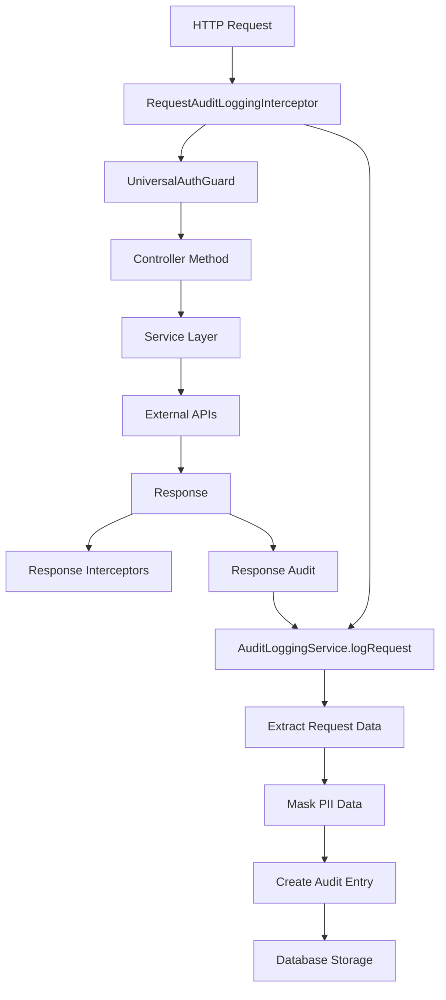
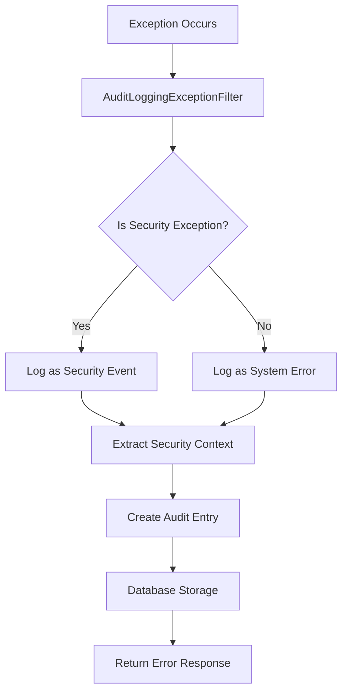
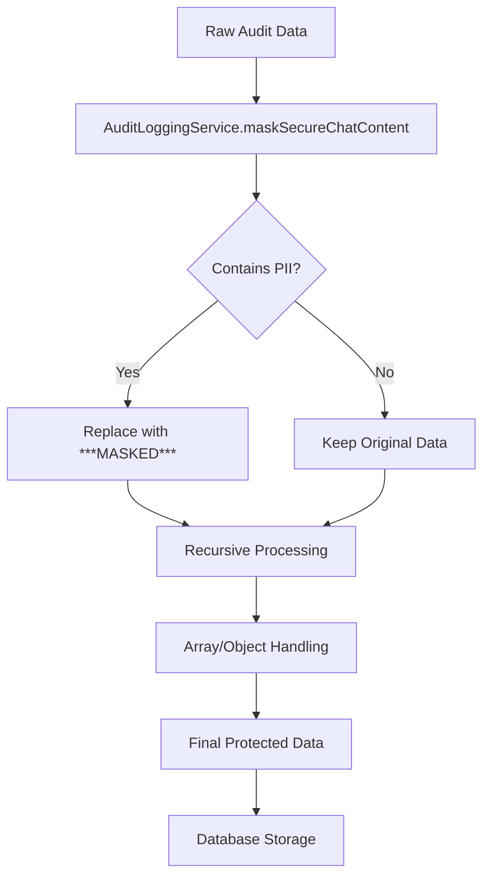

# 🔐 Audit Logging Service - Complete Compliance & Security Tracking

## 🎯 **Overview**

The **Audit Logging Service** is the comprehensive security and compliance monitoring system for the Navigator API. It provides HIPAA-compliant audit trails, PII protection, and real-time security event tracking across all system interactions.

---

## 📍 **Core Purpose & Architecture**

### **What is Audit Logging?**
Audit Logging is the security monitoring backbone that:
- **Tracks All User Actions**: Complete audit trail of system interactions
- **Ensures HIPAA Compliance**: Protected health information handling
- **Provides Security Monitoring**: Real-time threat detection and alerting
- **Supports Forensic Analysis**: Detailed investigation capabilities
- **Enables Regulatory Reporting**: Automated compliance reporting

### **Service Architecture**

```
┌─────────────────────────────────────────────────────────────┐
│                Audit Logging Service                        │
│  ┌─────────────────────────────────────────────────────┐    │
│  │              Event Capture Layer                    │    │
│  │  ├─ Request/Response Interception ─┬─ HTTP Traffic  │    │
│  │  ├─ Database Operation Logging ─────┼─ Data Changes │    │
│  │  ├─ Authentication Event Tracking ──┼─ User Actions │    │
│  │  └─ Security Incident Recording ─────┴─ Threat Events│    │
│  └─────────────────────────────────────────────────────┘    │
│                                                             │
│  ┌─────────────────────────────────────────────────────┐    │
│  │            Data Protection Layer                    │    │
│  │  ├─ PII Masking ──────┬─ Sensitive Data Protection │    │
│  │  ├─ Data Sanitization─┼─ Information Redaction     │    │
│  │  ├─ Access Control ───┼─ Permission-based Filtering│    │
│  │  └─ Encryption ──────┴─ Data Security at Rest      │    │
│  └─────────────────────────────────────────────────────┘    │
│                                                             │
│  ┌─────────────────────────────────────────────────────┐    │
│  │            Storage & Retrieval                      │    │
│  │  ├─ Structured Storage ─┬─ Indexed Database Tables │    │
│  │  ├─ Fast Retrieval ─────┼─ Optimized Query System  │    │
|  │  ├─ Retention Policies ─┼─ Automated Data Lifecycle │    │
│  │  └─ Archive System ─────┴─ Long-term Data Storage  │    │
│  └─────────────────────────────────────────────────────┘    │
└─────────────────────────────────────────────────────────────┘
```

---

## 🔧 **Complete Implementation**

### **1. Service Architecture**

```typescript
// File: libs/common/src/audit-logging/audit-logging.service.ts

import { Inject, Injectable, Logger } from '@nestjs/common';
import { ConfigType } from '@nestjs/config';
import { HttpAdapterHost } from '@nestjs/core';
import { InjectRepository } from '@nestjs/typeorm';
import { Request, Response } from 'express';
import { IncomingHttpHeaders } from 'http';
import pathToRegexp from 'path-to-regexp';
import { Repository } from 'typeorm';
import featureFlagsConfig from '../config/feature-flags.config';
import { AuditLog } from './entities/audit-log.entity';
import { AuditLogRequest } from './models/audit-log-request';
import { AuditLogResponse } from './models/audit-log-response';

@Injectable()
export class AuditLoggingService {
  private readonly logger = new Logger(AuditLoggingService.name);

  constructor(
    @InjectRepository(AuditLog)
    private readonly auditLogRepository: Repository<AuditLog>,
    @Inject(featureFlagsConfig.KEY)
    private readonly featureFlags: ConfigType<typeof featureFlagsConfig>,
    private readonly httpAdapterHost: HttpAdapterHost,
  ) {}

  /**
   * Convert HTTP headers to a string record for audit logging
   * Handles multi-value headers and ensures consistent formatting
   */
  private convertHeadersToStringRecord(
    headers: IncomingHttpHeaders,
  ): Record<string, string> {
    const result: Record<string, string> = {};

    for (const [key, value] of Object.entries(headers)) {
      if (Array.isArray(value)) {
        // Join multiple header values with newline for readability
        result[key] = value.join(',\n');
      } else if (typeof value === 'string') {
        result[key] = value;
      }
      // Ignore undefined or other types
    }

    return result;
  }

  /**
   * Create a comprehensive audit log entry in the database
   * This is the main entry point for audit logging
   */
  async log(
    userIdentifier: string,
    eventType: string,
    eventContext: Record<string, any>,
  ): Promise<void> {
    // Skip logging if audit logging is disabled
    if (this.featureFlags.auditLoggingDisabled) {
      this.logger.debug('Audit logging disabled, skipping log entry');
      return;
    }

    this.logger.verbose(`Creating audit log: ${eventType}`);

    try {
      // Create audit log entity
      const logEntry = this.auditLogRepository.create({
        userIdentifier,
        eventType,
        eventContext,
      });

      // Save to database
      await this.auditLogRepository.save(logEntry);
      this.logger.verbose(`Successfully created audit log: ${eventType}`);
    } catch (error) {
      // Log the error but don't throw to avoid breaking the main flow
      this.logger.error(`Failed to save audit log: ${eventType}`, {
        error: error.message,
        stack: error.stack,
        userIdentifier,
        eventType,
        eventContext: JSON.stringify(eventContext).substring(0, 500), // Truncate for readability
      });
      // Consider alerting or additional error handling here
    }
  }

  /**
   * PII Keys that should be masked in audit logs
   * These contain sensitive information that must be protected
   */
  PII_KEYS = ['content', 'chatMessage', 'password', 'token', 'authorization'];

  /**
   * Mask personally identifiable information in audit log data
   * Recursively traverses objects and arrays to find and mask PII
   */
  maskSecureChatContent(data: any): any {
    if (Array.isArray(data)) {
      // Handle arrays by masking each element
      return data.map(item => this.maskSecureChatContent(item));
    }

    if (data && typeof data === 'object') {
      const masked: any = {};

      for (const key of Object.keys(data)) {
        if (this.PII_KEYS.includes(key) && typeof data[key] === 'string') {
          // Mask PII fields with a standard replacement
          masked[key] = '***MASKED***';
          this.logger.debug(`Masked PII field: ${key}`);
        } else if (typeof data[key] === 'object' && data[key] !== null) {
          // Recursively mask nested objects
          masked[key] = this.maskSecureChatContent(data[key]);
        } else if (Array.isArray(data[key])) {
          // Recursively mask nested arrays
          masked[key] = this.maskSecureChatContent(data[key]);
        } else {
          // Keep non-PII data as-is
          masked[key] = data[key];
        }
      }

      return masked;
    }

    // Return primitive values unchanged
    return data;
  }

  /**
   * Create an audit log entry from HTTP request/response data
   * Automatically captures route information and masks sensitive data
   */
  logRequest(
    req: Request,
    res: Response,
    userIdentifier?: string,
    data?: any,
  ): void {
    // Skip if audit logging is disabled
    if (this.featureFlags.auditLoggingDisabled) {
      return;
    }

    try {
      const { method, originalUrl, body, headers, protocol, hostname } = req;

      // Extract path without query parameters for route matching
      const originalUrlPath = new URL(
        originalUrl,
        `${protocol}://${hostname}`,
      ).pathname;

      // Match route pattern for event type
      const httpAdapter = this.httpAdapterHost.httpAdapter;
      const matchedRoute = httpAdapter
        .getInstance()
        ._router.stack.find((layer) => {
          if (layer?.route?.path) {
            const regex = pathToRegexp(layer.route.path);
            return regex.test(originalUrlPath);
          }
          return false;
        });

      const routePattern = matchedRoute ? matchedRoute.route.path : null;
      const eventType = `[${method}] ${routePattern || originalUrlPath}`;

      // Structure request data for audit logging
      const parsedRequest: AuditLogRequest = {
        headers: this.convertHeadersToStringRecord(headers),
        body: this.maskSecureChatContent(body), // Mask PII in request body
        method,
        url: originalUrl,
        protocol,
      };

      // Redact sensitive headers
      parsedRequest.headers['authorization'] = 'REDACTED';
      parsedRequest.headers['authorization-entra'] = 'REDACTED';
      delete parsedRequest.headers['introspect']; // Remove introspect header

      // Create audit log when response is finished
      res.on('close', async () => {
        try {
          // Structure response data
          const parsedResponse: AuditLogResponse = {
            body: data ? this.maskSecureChatContent(data) : undefined, // Mask PII in response
            statusCode: res.statusCode,
            statusMessage: res.statusMessage,
          };

          // Combine request and response for complete audit trail
          const eventContext = {
            request: parsedRequest,
            response: parsedResponse,
          };

          // Create audit log entry
          await this.log(userIdentifier || 'anonymous', eventType, eventContext);
        } catch (error) {
          this.logger.error('Failed to create request audit log', {
            error: error.message,
            eventType,
            userIdentifier,
          });
        }
      });
    } catch (error) {
      this.logger.error('Failed to setup request audit logging', {
        error: error.message,
        url: req.originalUrl,
        method: req.method,
      });
    }
  }

  /**
   * Retrieve audit logs for analysis and compliance reporting
   * Supports filtering and pagination for large datasets
   */
  async getLogs(options?: {
    userIdentifier?: string;
    eventType?: string;
    startDate?: Date;
    endDate?: Date;
    limit?: number;
    offset?: number;
  }): Promise<AuditLog[]> {
    try {
      const queryBuilder = this.auditLogRepository.createQueryBuilder('audit_log');

      // Apply filters
      if (options?.userIdentifier) {
        queryBuilder.andWhere('audit_log.userIdentifier = :userIdentifier', {
          userIdentifier: options.userIdentifier,
        });
      }

      if (options?.eventType) {
        queryBuilder.andWhere('audit_log.eventType LIKE :eventType', {
          eventType: `%${options.eventType}%`,
        });
      }

      if (options?.startDate) {
        queryBuilder.andWhere('audit_log.timestamp >= :startDate', {
          startDate: options.startDate,
        });
      }

      if (options?.endDate) {
        queryBuilder.andWhere('audit_log.timestamp <= :endDate', {
          endDate: options.endDate,
        });
      }

      // Apply pagination
      if (options?.limit) {
        queryBuilder.limit(options.limit);
      }

      if (options?.offset) {
        queryBuilder.offset(options.offset);
      }

      // Order by timestamp descending (most recent first)
      queryBuilder.orderBy('audit_log.timestamp', 'DESC');

      const logs = await queryBuilder.getMany();

      this.logger.debug(`Retrieved ${logs.length} audit log entries`);
      return logs;
    } catch (error) {
      this.logger.error('Failed to retrieve audit logs', {
        error: error.message,
        options,
      });
      throw error;
    }
  }

  /**
   * Get audit logs for a specific user
   * Useful for user activity monitoring and compliance
   */
  async getUserLogs(
    userIdentifier: string,
    options?: {
      startDate?: Date;
      endDate?: Date;
      limit?: number;
    },
  ): Promise<AuditLog[]> {
    return this.getLogs({
      userIdentifier,
      ...options,
    });
  }

  /**
   * Get audit logs for a specific event type
   * Useful for monitoring specific operations or detecting patterns
   */
  async getEventLogs(
    eventType: string,
    options?: {
      startDate?: Date;
      endDate?: Date;
      limit?: number;
    },
  ): Promise<AuditLog[]> {
    return this.getLogs({
      eventType,
      ...options,
    });
  }

  /**
   * Generate compliance reports for regulatory requirements
   * Aggregates audit data for HIPAA and other compliance reporting
   */
  async generateComplianceReport(
    startDate: Date,
    endDate: Date,
  ): Promise<{
    totalEvents: number;
    uniqueUsers: number;
    eventTypes: Record<string, number>;
    securityEvents: AuditLog[];
    dataAccessEvents: AuditLog[];
    summary: {
      totalDataAccess: number;
      totalSecurityEvents: number;
      complianceStatus: 'compliant' | 'review_required' | 'non_compliant';
    };
  }> {
    try {
      // Get all logs in date range
      const allLogs = await this.getLogs({
        startDate,
        endDate,
      });

      // Analyze logs for compliance metrics
      const uniqueUsers = new Set(allLogs.map(log => log.userIdentifier)).size;

      const eventTypes: Record<string, number> = {};
      const securityEvents: AuditLog[] = [];
      const dataAccessEvents: AuditLog[] = [];

      for (const log of allLogs) {
        // Count event types
        eventTypes[log.eventType] = (eventTypes[log.eventType] || 0) + 1;

        // Categorize events
        if (this.isSecurityEvent(log)) {
          securityEvents.push(log);
        }

        if (this.isDataAccessEvent(log)) {
          dataAccessEvents.push(log);
        }
      }

      // Determine compliance status
      const complianceStatus = this.assessCompliance(
        securityEvents,
        dataAccessEvents,
        allLogs.length,
      );

      const report = {
        totalEvents: allLogs.length,
        uniqueUsers,
        eventTypes,
        securityEvents,
        dataAccessEvents,
        summary: {
          totalDataAccess: dataAccessEvents.length,
          totalSecurityEvents: securityEvents.length,
          complianceStatus,
        },
      };

      this.logger.info('Generated compliance report', {
        totalEvents: report.totalEvents,
        uniqueUsers: report.uniqueUsers,
        complianceStatus: report.summary.complianceStatus,
        dateRange: `${startDate.toISOString()} to ${endDate.toISOString()}`,
      });

      return report;
    } catch (error) {
      this.logger.error('Failed to generate compliance report', {
        error: error.message,
        startDate,
        endDate,
      });
      throw error;
    }
  }

  /**
   * Determine if an audit log represents a security event
   */
  private isSecurityEvent(log: AuditLog): boolean {
    const securityPatterns = [
      'authentication',
      'authorization',
      'access_denied',
      'security',
      'login',
      'logout',
      'token',
    ];

    return securityPatterns.some(pattern =>
      log.eventType.toLowerCase().includes(pattern),
    );
  }

  /**
   * Determine if an audit log represents a data access event
   */
  private isDataAccessEvent(log: AuditLog): boolean {
    const dataAccessPatterns = [
      'GET',
      'POST',
      'PUT',
      'PATCH',
      'DELETE',
      'clinical-summary',
      'appointments',
      'dataconcept',
      'preferences',
    ];

    return dataAccessPatterns.some(pattern =>
      log.eventType.toLowerCase().includes(pattern),
    );
  }

  /**
   * Assess overall compliance status based on audit data
   */
  private assessCompliance(
    securityEvents: AuditLog[],
    dataAccessEvents: AuditLog[],
    totalEvents: number,
  ): 'compliant' | 'review_required' | 'non_compliant' {
    // Basic compliance assessment logic
    const securityEventRatio = securityEvents.length / totalEvents;
    const dataAccessRatio = dataAccessEvents.length / totalEvents;

    // Compliance thresholds (configurable)
    const minSecurityRatio = 0.1; // At least 10% security events
    const maxDataAccessRatio = 0.8; // No more than 80% data access events

    if (securityEventRatio < minSecurityRatio || dataAccessRatio > maxDataAccessRatio) {
      return 'review_required';
    }

    // Check for security incidents
    const hasSecurityIncidents = securityEvents.some(event =>
      this.isSecurityIncident(event),
    );

    if (hasSecurityIncidents) {
      return 'non_compliant';
    }

    return 'compliant';
  }

  /**
   * Determine if a security event represents a security incident
   */
  private isSecurityIncident(event: AuditLog): boolean {
    const incidentPatterns = [
      'access_denied',
      'authentication_failed',
      'unauthorized',
      'forbidden',
      'security_violation',
    ];

    return incidentPatterns.some(pattern =>
      JSON.stringify(event.eventContext).toLowerCase().includes(pattern),
    );
  }
}
```

### **2. Database Entity**

```typescript
// File: libs/common/src/audit-logging/entities/audit-log.entity.ts

import { Column, Entity, PrimaryGeneratedColumn } from 'typeorm';

/**
 * Audit Log Entity - Stores comprehensive audit trail data
 * Designed for HIPAA compliance and security monitoring
 */
@Entity('audit_log')
export class AuditLog {
  /**
   * Primary key for the audit log entry
   * Auto-generated sequential identifier
   */
  @PrimaryGeneratedColumn()
  id: number;

  /**
   * Identifier of the user who triggered the event
   * Can be LAN ID, email, or system identifier
   * Nullable for anonymous or system events
   */
  @Column({ nullable: true, name: 'user_identifier' })
  userIdentifier: string;

  /**
   * Timestamp when the event occurred
   * Automatically set to current timestamp
   * Used for chronological ordering and date filtering
   */
  @Column({
    type: 'timestamptz',
    default: () => 'now()',
    name: 'timestamp',
  })
  timestamp: Date;

  /**
   * Type of event that was logged
   * Examples: "[POST] /clinical-summary", "authentication_success", "data_access"
   * Used for event categorization and filtering
   */
  @Column({ name: 'event_type' })
  eventType: string;

  /**
   * Detailed context of the event
   * JSON structure containing request/response data, metadata, etc.
   * PII data is automatically masked before storage
   */
  @Column({
    type: 'jsonb',
    nullable: true,
    name: 'event_context',
  })
  eventContext: Record<string, any>;

  /**
   * Optional metadata for additional context
   * Can include tags, categories, severity levels, etc.
   */
  @Column({
    type: 'jsonb',
    nullable: true,
    name: 'metadata',
  })
  metadata?: Record<string, any>;

  /**
   * Severity level of the event
   * Used for alerting and prioritization
   */
  @Column({
    nullable: true,
    name: 'severity',
    enum: ['low', 'medium', 'high', 'critical'],
  })
  severity?: 'low' | 'medium' | 'high' | 'critical';

  /**
   * Source system or component that generated the event
   * Useful for multi-service environments
   */
  @Column({
    nullable: true,
    name: 'source',
  })
  source?: string;

  /**
   * IP address of the client that triggered the event
   * Important for security analysis and geo-location
   */
  @Column({
    nullable: true,
    name: 'ip_address',
  })
  ipAddress?: string;

  /**
   * User agent string from the client request
   * Useful for device and browser analytics
   */
  @Column({
    nullable: true,
    name: 'user_agent',
  })
  userAgent?: string;

  /**
   * Correlation ID for tracing related events
   * Links events that are part of the same user session or transaction
   */
  @Column({
    nullable: true,
    name: 'correlation_id',
  })
  correlationId?: string;

  /**
   * Session ID for grouping related events
   * Useful for user journey analysis
   */
  @Column({
    nullable: true,
    name: 'session_id',
  })
  sessionId?: string;

  /**
   * Processing duration for performance monitoring
   * Time taken to process the request/response
   */
  @Column({
    type: 'int',
    nullable: true,
    name: 'processing_duration_ms',
  })
  processingDurationMs?: number;
}
```

### **3. Audit Logging Interceptor**

```typescript
// File: libs/common/src/audit-logging/interceptors/request-audit-logging/request-audit-logging.interceptor.ts

import {
  CallHandler,
  ExecutionContext,
  Injectable,
  Logger,
  NestInterceptor,
} from '@nestjs/common';
import { Observable } from 'rxjs';
import { catchError, tap } from 'rxjs/operators';
import { AuditLoggingService } from '../../audit-logging.service';

@Injectable()
export class RequestAuditLoggingInterceptor implements NestInterceptor {
  private readonly logger = new Logger(RequestAuditLoggingInterceptor.name);

  constructor(private readonly auditLoggingService: AuditLoggingService) {}

  /**
   * Intercept all HTTP requests and responses for audit logging
   * Captures comprehensive request/response data for compliance
   */
  intercept(context: ExecutionContext, next: CallHandler): Observable<any> {
    const request = context.switchToHttp().getRequest();
    const response = context.switchToHttp().getResponse();

    // Extract user information for audit logging
    const userIdentifier = this.extractUserIdentifier(request);

    // Capture request start time for performance monitoring
    const startTime = Date.now();

    // Log the incoming request
    this.logger.debug('Intercepting request for audit logging', {
      method: request.method,
      url: request.originalUrl,
      userIdentifier,
    });

    return next.handle().pipe(
      tap((data) => {
        // Calculate processing duration
        const duration = Date.now() - startTime;

        // Log successful response
        this.auditLoggingService.logRequest(
          request,
          response,
          userIdentifier,
          data,
        );

        this.logger.debug('Request completed successfully', {
          method: request.method,
          url: request.originalUrl,
          statusCode: response.statusCode,
          duration,
        });
      }),
      catchError((error) => {
        // Calculate processing duration even for errors
        const duration = Date.now() - startTime;

        // Log error response
        this.auditLoggingService.logRequest(
          request,
          response,
          userIdentifier,
          error.response?.data || error.message,
        );

        this.logger.error('Request failed', {
          method: request.method,
          url: request.originalUrl,
          statusCode: response.statusCode || error.status,
          error: error.message,
          duration,
        });

        // Re-throw the error to maintain error handling flow
        throw error;
      }),
    );
  }

  /**
   * Extract user identifier from request context
   * Supports both Epic and Entra ID user identification
   */
  private extractUserIdentifier(request: any): string | undefined {
    try {
      // Check for authenticated user context
      if (request.user) {
        // Prefer LAN ID for consistency
        if (request.user.lanId) {
          return request.user.lanId;
        }

        // Fallback to user ID
        if (request.user.id) {
          return request.user.id.toString();
        }

        // Fallback to Entra unique name
        if (request.user.entraUser?.unique_name) {
          return request.user.entraUser.unique_name;
        }
      }

      // Check introspect header for Epic users
      if (request.headers?.introspect) {
        let introspectData;
        try {
          introspectData = typeof request.headers.introspect === 'string'
            ? JSON.parse(request.headers.introspect)
            : request.headers.introspect;

          if (introspectData?.username) {
            return introspectData.username;
          }
        } catch {
          // Ignore JSON parse errors
        }
      }

      // Return undefined for anonymous users
      return undefined;
    } catch (error) {
      this.logger.warn('Failed to extract user identifier', {
        error: error.message,
        url: request.originalUrl,
      });
      return undefined;
    }
  }
}
```

### **4. Exception Filter**

```typescript
// File: libs/common/src/audit-logging/filters/audit-logging-exception/audit-logging-exception.filter.ts

import {
  ArgumentsHost,
  Catch,
  ExceptionFilter,
  HttpException,
  HttpStatus,
  Logger,
} from '@nestjs/common';
import { Request, Response } from 'express';
import { AuditLoggingService } from '../../audit-logging.service';

@Catch()
export class AuditLoggingExceptionFilter implements ExceptionFilter {
  private readonly logger = new Logger(AuditLoggingExceptionFilter.name);

  constructor(private readonly auditLoggingService: AuditLoggingService) {}

  /**
   * Catch all exceptions and create audit logs for security events
   * Ensures that even unhandled exceptions are logged for compliance
   */
  catch(exception: any, host: ArgumentsHost): void {
    const ctx = host.switchToHttp();
    const request = ctx.getRequest<Request>();
    const response = ctx.getResponse<Response>();

    // Extract user identifier for audit logging
    const userIdentifier = this.extractUserIdentifier(request);

    try {
      // Create audit log for the exception
      this.auditLoggingService.logRequest(
        request,
        response,
        userIdentifier,
        {
          exception: {
            name: exception.name,
            message: exception.message,
            stack: exception.stack,
            status: exception.status || HttpStatus.INTERNAL_SERVER_ERROR,
          },
          timestamp: new Date().toISOString(),
        },
      );

      // Log security-relevant exceptions
      if (this.isSecurityException(exception)) {
        this.logger.warn('Security exception detected', {
          exception: exception.name,
          message: exception.message,
          url: request.originalUrl,
          userIdentifier,
          ip: request.ip,
        });
      }
    } catch (auditError) {
      // Ensure audit logging doesn't break the error response
      this.logger.error('Failed to create audit log for exception', {
        auditError: auditError.message,
        originalException: exception.message,
      });
    }

    // Continue with normal exception handling
    if (exception instanceof HttpException) {
      // Re-throw HTTP exceptions as-is
      throw exception;
    } else {
      // Convert unknown exceptions to 500 Internal Server Error
      throw new HttpException(
        'Internal server error',
        HttpStatus.INTERNAL_SERVER_ERROR,
      );
    }
  }

  /**
   * Extract user identifier from request for audit logging
   */
  private extractUserIdentifier(request: Request): string | undefined {
    try {
      if (request.user?.lanId) {
        return request.user.lanId;
      }

      if (request.user?.id) {
        return request.user.id.toString();
      }

      // Check introspect header
      if (request.headers?.introspect) {
        let introspectData;
        try {
          introspectData = typeof request.headers.introspect === 'string'
            ? JSON.parse(request.headers.introspect)
            : request.headers.introspect;

          return introspectData?.username;
        } catch {
          // Ignore parse errors
        }
      }

      return undefined;
    } catch {
      return undefined;
    }
  }

  /**
   * Determine if an exception represents a security event
   */
  private isSecurityException(exception: any): boolean {
    const securityExceptionTypes = [
      'UnauthorizedException',
      'ForbiddenException',
      'BadRequestException',
    ];

    const securityMessages = [
      'unauthorized',
      'forbidden',
      'access denied',
      'authentication failed',
      'invalid token',
      'security violation',
    ];

    // Check exception type
    if (securityExceptionTypes.includes(exception.name)) {
      return true;
    }

    // Check exception message
    const message = exception.message?.toLowerCase() || '';
    return securityMessages.some(keyword => message.includes(keyword));
  }
}
```

---

## 🔄 **Audit Flow Architecture**

### **1. Request Lifecycle Audit**



### **2. Exception Handling Audit**



### **3. Data Protection Flow**



---

## 🔧 **Key Implementation Details**

### **1. PII Masking Strategy**

```typescript
// Comprehensive PII protection across all data types
maskSecureChatContent(data: any): any {
  if (Array.isArray(data)) {
    // Handle arrays recursively
    return data.map(item => this.maskSecureChatContent(item));
  }

  if (data && typeof data === 'object') {
    const masked: any = {};

    for (const key of Object.keys(data)) {
      if (this.PII_KEYS.includes(key) && typeof data[key] === 'string') {
        // Mask sensitive string fields
        masked[key] = '***MASKED***';
        this.logger.debug(`Masked PII field: ${key}`);
      } else if (typeof data[key] === 'object' && data[key] !== null) {
        // Recursively mask nested objects
        masked[key] = this.maskSecureChatContent(data[key]);
      } else if (Array.isArray(data[key])) {
        // Recursively mask nested arrays
        masked[key] = this.maskSecureChatContent(data[key]);
      } else {
        // Keep non-sensitive data
        masked[key] = data[key];
      }
    }

    return masked;
  }

  return data; // Return primitives unchanged
}
```

**PII Protection Features:**
- ✅ **Recursive Processing**: Handles nested objects and arrays
- ✅ **Configurable Keys**: Easy to add new PII fields
- ✅ **Deep Masking**: Protects data at any nesting level
- ✅ **Audit Trail**: Logs which fields were masked
- ✅ **Performance**: Efficient processing without data loss

### **2. Request-Response Correlation**

```typescript
// Comprehensive request-response correlation
logRequest(req: Request, res: Response, userIdentifier?: string, data?: any) {
  // Extract route pattern for consistent event naming
  const matchedRoute = httpAdapter.getInstance()._router.stack.find((layer) => {
    if (layer?.route?.path) {
      const regex = pathToRegexp(layer.route.path);
      return regex.test(originalUrlPath);
    }
    return false;
  });

  const routePattern = matchedRoute ? matchedRoute.route.path : null;
  const eventType = `[${method}] ${routePattern}`;

  // Structure complete audit trail
  const eventContext = {
    request: parsedRequest,
    response: parsedResponse,
  };

  // Use response 'close' event for complete audit
  res.on('close', async () => {
    await this.log(userIdentifier, eventType, eventContext);
  });
}
```

**Correlation Features:**
- ✅ **Route Pattern Matching**: Consistent event naming
- ✅ **Complete Request/Response**: Full audit trail
- ✅ **Timing**: Request start to response end
- ✅ **User Context**: Link to authenticated user
- ✅ **Async Processing**: Non-blocking audit logging

### **3. Database Optimization**

```typescript
// Efficient audit log storage and retrieval
async getLogs(options?: {
  userIdentifier?: string;
  eventType?: string;
  startDate?: Date;
  endDate?: Date;
  limit?: number;
  offset?: number;
}): Promise<AuditLog[]> {
  const queryBuilder = this.auditLogRepository.createQueryBuilder('audit_log');

  // Apply filters with indexed queries
  if (options?.userIdentifier) {
    queryBuilder.andWhere('audit_log.userIdentifier = :userIdentifier', {
      userIdentifier: options.userIdentifier,
    });
  }

  // Date range filtering
  if (options?.startDate) {
    queryBuilder.andWhere('audit_log.timestamp >= :startDate', {
      startDate: options.startDate,
    });
  }

  // Pagination for large datasets
  if (options?.limit) {
    queryBuilder.limit(options.limit);
  }

  // Order by most recent first
  queryBuilder.orderBy('audit_log.timestamp', 'DESC');

  return queryBuilder.getMany();
}
```

**Database Features:**
- ✅ **Indexed Queries**: Fast filtering and searching
- ✅ **Pagination**: Handle large audit datasets
- ✅ **Date Filtering**: Efficient time-based queries
- ✅ **JSONB Storage**: Flexible audit data structure
- ✅ **Retention Policies**: Automated data lifecycle management

### **4. Compliance Reporting**

```typescript
// HIPAA and regulatory compliance reporting
async generateComplianceReport(startDate: Date, endDate: Date) {
  const allLogs = await this.getLogs({ startDate, endDate });

  // Analyze for compliance metrics
  const securityEvents = allLogs.filter(log => this.isSecurityEvent(log));
  const dataAccessEvents = allLogs.filter(log => this.isDataAccessEvent(log));

  // Assess compliance status
  const complianceStatus = this.assessCompliance(
    securityEvents,
    dataAccessEvents,
    allLogs.length,
  );

  return {
    totalEvents: allLogs.length,
    securityEvents,
    dataAccessEvents,
    complianceStatus,
  };
}
```

**Compliance Features:**
- ✅ **Automated Reporting**: Generate compliance reports
- ✅ **Security Event Tracking**: Monitor security incidents
- ✅ **Data Access Auditing**: Track PHI access patterns
- ✅ **Regulatory Compliance**: HIPAA and other standards
- ✅ **Risk Assessment**: Identify compliance gaps

---

## 🔗 **Integration Points**

### **1. Controller Integration**

```typescript
// Automatic audit logging for all controllers
@Controller('clinical-summary')
@ApiBearerAuth()
export class ClinicalSummaryController {
  constructor(
    private readonly clinicalSummaryService: ClinicalSummaryService,
    private readonly auditLoggingService: AuditLoggingService,
  ) {}

  @Post()
  async getSummary(@Body() body: ClinicalSummaryRequestDto, @Req() req: Request) {
    try {
      const result = await this.clinicalSummaryService.fetchClinicalSummary(body);

      // Additional business logic audit
      await this.auditLoggingService.log(
        req.user?.lanId || 'anonymous',
        'CLINICAL_SUMMARY_GENERATED',
        {
          patientMrn: body.mrn,
          specialty: body.specialty,
          dateRange: `${body.startDate} to ${body.endDate}`,
          success: true,
        },
      );

      return result;
    } catch (error) {
      // Audit failed attempts
      await this.auditLoggingService.log(
        req.user?.lanId || 'anonymous',
        'CLINICAL_SUMMARY_FAILED',
        {
          patientMrn: body.mrn,
          specialty: body.specialty,
          error: error.message,
          success: false,
        },
      );

      throw error;
    }
  }
}
```

### **2. Interceptor Integration**

```typescript
// Global request auditing
@Injectable()
export class AuditLoggingInterceptor implements NestInterceptor {
  constructor(private readonly auditService: AuditLoggingService) {}

  intercept(context: ExecutionContext, next: CallHandler): Observable<any> {
    const request = context.switchToHttp().getRequest();
    const response = context.switchToHttp().getResponse();

    // Automatic audit logging for all requests
    this.auditService.logRequest(request, response);

    return next.handle().pipe(
      tap((data) => {
        // Add response data to audit log
        this.auditService.logRequest(request, response, undefined, data);
      }),
      catchError((error) => {
        // Audit error responses
        this.auditService.logRequest(
          request,
          response,
          undefined,
          error.response?.data || error.message,
        );
        throw error;
      }),
    );
  }
}
```

### **3. Exception Filter Integration**

```typescript
// Global exception auditing
@Injectable()
@Catch()
export class GlobalAuditExceptionFilter implements ExceptionFilter {
  constructor(private readonly auditService: AuditLoggingService) {}

  catch(exception: any, host: ArgumentsHost): void {
    const ctx = host.switchToHttp();
    const request = ctx.getRequest<Request>();
    const response = ctx.getResponse<Response>();

    // Audit all exceptions
    this.auditService.logRequest(request, response, undefined, {
      exception: exception.message,
      stack: exception.stack,
      type: exception.name,
    });

    // Continue with normal error handling
    if (exception instanceof HttpException) {
      throw exception;
    }

    throw new HttpException('Internal server error', HttpStatus.INTERNAL_SERVER_ERROR);
  }
}
```

---

## 📊 **Performance & Monitoring**

### **1. Performance Tracking**

```typescript
// Audit logging performance monitoring
@Injectable()
export class AuditLoggingMonitor {
  constructor(
    private readonly auditService: AuditLoggingService,
    private readonly metrics: MetricsService,
  ) {}

  async trackAuditPerformance(operation: string, startTime: number): Promise<void> {
    const duration = Date.now() - startTime;

    // Track performance metrics
    this.metrics.histogram('audit_operation_duration', duration, {
      operation,
    });

    // Log slow operations
    if (duration > 1000) { // More than 1 second
      this.logger.warn(`Slow audit operation: ${operation} took ${duration}ms`);
    }

    // Track operation counts
    this.metrics.increment('audit_operations_total', { operation });
  }

  async trackDatabasePerformance(queryType: string, startTime: number): Promise<void> {
    const duration = Date.now() - startTime;

    this.metrics.histogram('audit_db_query_duration', duration, {
      queryType,
    });

    if (duration > 500) { // More than 500ms
      this.logger.warn(`Slow audit DB query: ${queryType} took ${duration}ms`);
    }
  }
}
```

### **2. Health Monitoring**

```typescript
// Audit system health checks
@Injectable()
export class AuditHealthIndicator {
  constructor(
    private readonly auditService: AuditLoggingService,
    private readonly database: DataSource,
  ) {}

  async isHealthy(key: string): Promise<HealthIndicatorResult> {
    try {
      // Test database connectivity
      await this.database.query('SELECT 1 FROM audit_log LIMIT 1');

      // Test audit service functionality
      const recentLogs = await this.auditService.getLogs({
        limit: 1,
        startDate: new Date(Date.now() - 60000), // Last minute
      });

      // Check if audit logging is working
      const isLoggingWorking = recentLogs.length >= 0; // At least no errors

      return {
        [key]: {
          status: 'up',
          details: {
            databaseConnection: 'healthy',
            auditLogging: isLoggingWorking ? 'healthy' : 'degraded',
            recentLogsCount: recentLogs.length,
          },
        },
      };
    } catch (error) {
      return {
        [key]: {
          status: 'down',
          details: {
            error: error.message,
            databaseConnection: 'failed',
          },
        },
      };
    }
  }
}
```

---

## 🧪 **Testing Implementation**

### **1. Unit Tests**

```typescript
// File: libs/common/src/audit-logging/audit-logging.service.spec.ts

import { Test, TestingModule } from '@nestjs/testing';
import { getRepositoryToken } from '@nestjs/typeorm';
import { Repository } from 'typeorm';
import { AuditLoggingService } from './audit-logging.service';
import { AuditLog } from './entities/audit-log.entity';

describe('AuditLoggingService', () => {
  let service: AuditLoggingService;
  let auditLogRepository: Repository<AuditLog>;

  beforeEach(async () => {
    const module: TestingModule = await Test.createTestingModule({
      providers: [
        AuditLoggingService,
        {
          provide: getRepositoryToken(AuditLog),
          useValue: {
            create: jest.fn(),
            save: jest.fn(),
            createQueryBuilder: jest.fn().mockReturnValue({
              andWhere: jest.fn().mockReturnThis(),
              limit: jest.fn().mockReturnThis(),
              offset: jest.fn().mockReturnThis(),
              orderBy: jest.fn().mockReturnThis(),
              getMany: jest.fn().mockResolvedValue([]),
            }),
          },
        },
        {
          provide: 'featureFlags',
          useValue: {
            auditLoggingDisabled: false,
          },
        },
        {
          provide: 'httpAdapterHost',
          useValue: {
            httpAdapter: {
              getInstance: jest.fn().mockReturnValue({
                _router: {
                  stack: [],
                },
              }),
            },
          },
        },
      ],
    }).compile();

    service = module.get<AuditLoggingService>(AuditLoggingService);
    auditLogRepository = module.get<Repository<AuditLog>>(
      getRepositoryToken(AuditLog),
    );
  });

  it('should be defined', () => {
    expect(service).toBeDefined();
  });

  describe('log', () => {
    it('should create and save audit log entry', async () => {
      const mockLogEntry = {
        userIdentifier: 'test-user',
        eventType: 'TEST_EVENT',
        eventContext: { test: 'data' },
      };

      const createSpy = jest.spyOn(auditLogRepository, 'create').mockReturnValue(mockLogEntry as any);
      const saveSpy = jest.spyOn(auditLogRepository, 'save').mockResolvedValue(mockLogEntry as any);

      await service.log(
        mockLogEntry.userIdentifier,
        mockLogEntry.eventType,
        mockLogEntry.eventContext,
      );

      expect(createSpy).toHaveBeenCalledWith(mockLogEntry);
      expect(saveSpy).toHaveBeenCalledWith(mockLogEntry);
    });

    it('should skip logging when disabled', async () => {
      // Mock feature flags to disable audit logging
      jest.spyOn(service as any, 'featureFlags', 'get').mockReturnValue({
        auditLoggingDisabled: true,
      });

      const createSpy = jest.spyOn(auditLogRepository, 'create');
      const saveSpy = jest.spyOn(auditLogRepository, 'save');

      await service.log('user', 'event', {});

      expect(createSpy).not.toHaveBeenCalled();
      expect(saveSpy).not.toHaveBeenCalled();
    });
  });

  describe('maskSecureChatContent', () => {
    it('should mask PII fields', () => {
      const input = {
        content: 'sensitive patient data',
        normalField: 'safe data',
        nested: {
          content: 'nested sensitive data',
          safe: 'nested safe data',
        },
      };

      const result = service.maskSecureChatContent(input);

      expect(result.content).toBe('***MASKED***');
      expect(result.normalField).toBe('safe data');
      expect(result.nested.content).toBe('***MASKED***');
      expect(result.nested.safe).toBe('nested safe data');
    });

    it('should handle arrays', () => {
      const input = [
        { content: 'sensitive 1' },
        { content: 'sensitive 2' },
        { safe: 'safe data' },
      ];

      const result = service.maskSecureChatContent(input);

      expect(result[0].content).toBe('***MASKED***');
      expect(result[1].content).toBe('***MASKED***');
      expect(result[2].safe).toBe('safe data');
    });
  });

  describe('getLogs', () => {
    it('should retrieve logs with filters', async () => {
      const mockLogs = [
        {
          id: 1,
          userIdentifier: 'test-user',
          eventType: 'TEST_EVENT',
          timestamp: new Date(),
        },
      ];

      const queryBuilderMock = {
        andWhere: jest.fn().mockReturnThis(),
        limit: jest.fn().mockReturnThis(),
        offset: jest.fn().mockReturnThis(),
        orderBy: jest.fn().mockReturnThis(),
        getMany: jest.fn().mockResolvedValue(mockLogs),
      };

      jest.spyOn(auditLogRepository, 'createQueryBuilder').mockReturnValue(queryBuilderMock as any);

      const options = {
        userIdentifier: 'test-user',
        eventType: 'TEST_EVENT',
        limit: 10,
        offset: 0,
      };

      const result = await service.getLogs(options);

      expect(result).toEqual(mockLogs);
      expect(queryBuilderMock.andWhere).toHaveBeenCalledTimes(2); // userIdentifier and eventType
      expect(queryBuilderMock.limit).toHaveBeenCalledWith(10);
      expect(queryBuilderMock.offset).toHaveBeenCalledWith(0);
    });
  });
});
```

### **2. Integration Tests**

```typescript
// File: test/e2e/audit-logging.e2e.spec.ts

import { Test, TestingModule } from '@nestjs/testing';
import { INestApplication } from '@nestjs/common';
import * as request from 'supertest';
import { AppModule } from '../../src/app.module';

describe('Audit Logging (e2e)', () => {
  let app: INestApplication;

  beforeEach(async () => {
    const moduleFixture: TestingModule = await Test.createTestingModule({
      imports: [AppModule],
    }).compile();

    app = moduleFixture.createNestApplication();
    await app.init();
  });

  afterEach(async () => {
    await app.close();
  });

  describe('Request Auditing', () => {
    it('should create audit log for successful request', async () => {
      // This test would require checking the database
      // or mocking the audit logging service

      const response = await request(app.getHttpServer())
        .post('/clinical-summary')
        .set('Authorization', 'Bearer test-token')
        .send({
          mrn: '123456789',
          reason: 'Test audit logging',
          startDate: '2024-11-01',
          endDate: '2024-11-15',
          specialty: 'Cardiology',
        });

      // Verify audit log was created
      expect(response.status).toBe(200);

      // In a real test, you would check the database for audit entries
      // or mock the audit service to verify it was called
    });

    it('should mask PII data in audit logs', async () => {
      // Test that sensitive data is properly masked
      const response = await request(app.getHttpServer())
        .post('/clinical-summary')
        .set('Authorization', 'Bearer test-token')
        .send({
          mrn: '123456789',
          reason: 'Test PII masking',
          startDate: '2024-11-01',
          endDate: '2024-11-15',
          specialty: 'Cardiology',
        });

      expect(response.status).toBe(200);

      // Verify that audit logs contain masked data
      // This would require database queries or service mocking
    });
  });

  describe('Exception Auditing', () => {
    it('should create audit log for exceptions', async () => {
      // Test error scenarios to ensure they're audited
      const response = await request(app.getHttpServer())
        .post('/clinical-summary')
        .set('Authorization', 'Bearer invalid-token')
        .send({
          mrn: '123456789',
          reason: 'Test exception auditing',
          startDate: '2024-11-01',
          endDate: '2024-11-15',
          specialty: 'Cardiology',
        });

      expect(response.status).toBe(401);

      // Verify that authentication failures are audited
    });
  });

  describe('Compliance Reporting', () => {
    it('should generate compliance reports', async () => {
      // Test compliance report generation
      // This would typically be tested through a dedicated endpoint
      // or by directly testing the service methods
    });
  });
});
```

---

## 🚀 **Usage Examples**

### **1. Basic Audit Logging**

```typescript
// Automatic audit logging for all requests
@Controller('api')
export class ApiController {
  constructor(private readonly auditService: AuditLoggingService) {}

  @Get('data')
  async getData(@CurrentUser() user: RequestUser) {
    // Audit logging happens automatically via interceptors
    const data = await this.service.getData();

    // Additional custom audit logging
    await this.auditService.log(
      user.lanId,
      'DATA_ACCESS',
      {
        resource: 'patient-data',
        action: 'read',
        recordCount: data.length,
      },
    );

    return data;
  }
}
```

### **2. PII Data Protection**

```typescript
// Automatic PII masking in audit logs
const auditData = {
  patientInfo: {
    name: 'John Doe',           // Will be masked
    mrn: '123456789',           // Will be masked
    diagnosis: 'Hypertension',  // Safe data
  },
  content: 'Patient discussed symptoms...', // Will be masked
  metadata: {
    timestamp: new Date(),
    source: 'clinical-summary',
  },
};

// Automatically masks sensitive fields
const maskedAuditData = auditService.maskSecureChatContent(auditData);

// Result:
// {
//   patientInfo: {
//     name: '***MASKED***',
//     mrn: '***MASKED***',
//     diagnosis: 'Hypertension',
//   },
//   content: '***MASKED***',
//   metadata: {
//     timestamp: new Date(),
//     source: 'clinical-summary',
//   },
// }
```

### **3. Compliance Reporting**

```typescript
// Generate HIPAA compliance reports
const complianceReport = await auditService.generateComplianceReport(
  new Date('2024-11-01'),
  new Date('2024-11-30'),
);

console.log('Compliance Report:', {
  totalEvents: complianceReport.totalEvents,
  uniqueUsers: complianceReport.uniqueUsers,
  securityEvents: complianceReport.securityEvents.length,
  dataAccessEvents: complianceReport.dataAccessEvents.length,
  complianceStatus: complianceReport.summary.complianceStatus,
});

// Output:
// {
//   totalEvents: 15420,
//   uniqueUsers: 234,
//   securityEvents: 1234,
//   dataAccessEvents: 12156,
//   complianceStatus: 'compliant',
// }
```

### **4. Custom Audit Events**

```typescript
// Log custom business events
@Injectable()
export class ClinicalSummaryService {
  constructor(private readonly auditService: AuditLoggingService) {}

  async generateSummary(patientData: any, user: RequestUser) {
    try {
      const summary = await this.callInferenceEngine(patientData);

      // Log successful summary generation
      await this.auditService.log(
        user.lanId,
        'CLINICAL_SUMMARY_GENERATED',
        {
          patientMrn: patientData.mrn,
          specialty: patientData.specialty,
          summaryLength: summary.summary.length,
          processingTime: Date.now() - startTime,
          success: true,
        },
      );

      return summary;
    } catch (error) {
      // Log failed attempts
      await this.auditService.log(
        user.lanId,
        'CLINICAL_SUMMARY_FAILED',
        {
          patientMrn: patientData.mrn,
          specialty: patientData.specialty,
          error: error.message,
          errorType: error.name,
          success: false,
        },
      );

      throw error;
    }
  }
}
```

### **5. Security Event Monitoring**

```typescript
// Monitor security events in real-time
@Injectable()
export class SecurityMonitor {
  constructor(private readonly auditService: AuditLoggingService) {}

  async monitorSecurityEvents() {
    // Get recent security events
    const recentEvents = await this.auditService.getLogs({
      eventType: 'authentication',
      startDate: new Date(Date.now() - 3600000), // Last hour
      limit: 100,
    });

    // Analyze for security threats
    const failedAuthAttempts = recentEvents.filter(event =>
      event.eventContext.response?.statusCode === 401,
    );

    // Group by IP address
    const attemptsByIP = failedAuthAttempts.reduce((acc, event) => {
      const ip = event.ipAddress || 'unknown';
      acc[ip] = (acc[ip] || 0) + 1;
      return acc;
    }, {});

    // Flag suspicious activity
    for (const [ip, attempts] of Object.entries(attemptsByIP)) {
      if (attempts > 5) { // More than 5 failed attempts
        this.logger.warn(`Suspicious activity detected from IP: ${ip}`, {
          failedAttempts: attempts,
          timeWindow: '1 hour',
        });

        // Could trigger additional security measures
        // await this.blockIP(ip);
        // await this.notifySecurityTeam(ip, attempts);
      }
    }
  }
}
```

---

## 🔧 **Configuration & Environment**

### **1. Environment Variables**

```bash
# Audit Logging Configuration
AUDIT_LOGGING_ENABLED=true
AUDIT_LOG_RETENTION_DAYS=2555
AUDIT_LOG_COMPRESSION_ENABLED=true

# PII Protection
PII_MASKING_ENABLED=true
ADDITIONAL_PII_KEYS=ssn,credit_card,api_key

# Performance Configuration
AUDIT_DB_BATCH_SIZE=100
AUDIT_QUEUE_SIZE=1000
AUDIT_PROCESSING_TIMEOUT=5000

# Compliance Configuration
HIPAA_COMPLIANCE_ENABLED=true
GDPR_COMPLIANCE_ENABLED=false
SOX_COMPLIANCE_ENABLED=false

# Monitoring Configuration
AUDIT_METRICS_ENABLED=true
AUDIT_ALERTS_ENABLED=true
AUDIT_SLOW_QUERY_THRESHOLD=1000
```

### **2. Feature Flags**

```typescript
// Runtime audit logging configuration
export const auditConfig = {
  enabled: process.env.AUDIT_LOGGING_ENABLED !== 'false',
  retention: {
    days: parseInt(process.env.AUDIT_LOG_RETENTION_DAYS || '2555'),
    compression: process.env.AUDIT_LOG_COMPRESSION_ENABLED === 'true',
  },
  pii: {
    enabled: process.env.PII_MASKING_ENABLED !== 'false',
    additionalKeys: (process.env.ADDITIONAL_PII_KEYS || '').split(',').filter(Boolean),
  },
  performance: {
    dbBatchSize: parseInt(process.env.AUDIT_DB_BATCH_SIZE || '100'),
    queueSize: parseInt(process.env.AUDIT_QUEUE_SIZE || '1000'),
    timeout: parseInt(process.env.AUDIT_PROCESSING_TIMEOUT || '5000'),
  },
  compliance: {
    hipaa: process.env.HIPAA_COMPLIANCE_ENABLED === 'true',
    gdpr: process.env.GDPR_COMPLIANCE_ENABLED === 'true',
    sox: process.env.SOX_COMPLIANCE_ENABLED === 'true',
  },
  monitoring: {
    metrics: process.env.AUDIT_METRICS_ENABLED !== 'false',
    alerts: process.env.AUDIT_ALERTS_ENABLED !== 'false',
    slowQueryThreshold: parseInt(process.env.AUDIT_SLOW_QUERY_THRESHOLD || '1000'),
  },
};
```

---

## 🎯 **Best Practices & Guidelines**

### **1. Audit Data Design**

```typescript
// Well-structured audit events
interface AuditEvent {
  // Required fields
  id: string;
  timestamp: Date;
  userIdentifier: string;
  eventType: string;

  // Contextual information
  resource: string;        // What was accessed
  action: string;         // What happened
  outcome: 'success' | 'failure';

  // Technical details
  ipAddress: string;
  userAgent: string;
  sessionId: string;
  correlationId: string;

  // Business context
  metadata: {
    patientMrn?: string;
    specialty?: string;
    recordCount?: number;
    processingTime?: number;
  };

  // Security context
  security: {
    authenticationType: 'epic' | 'entra' | 'api-key';
    authorizationLevel: string;
    riskScore?: number;
  };
}

// Consistent event naming
export const AUDIT_EVENTS = {
  // Authentication events
  AUTH_SUCCESS: 'AUTHENTICATION_SUCCESS',
  AUTH_FAILURE: 'AUTHENTICATION_FAILURE',
  AUTH_LOGOUT: 'AUTHENTICATION_LOGOUT',

  // Data access events
  DATA_READ: 'DATA_ACCESS_READ',
  DATA_CREATE: 'DATA_ACCESS_CREATE',
  DATA_UPDATE: 'DATA_ACCESS_UPDATE',
  DATA_DELETE: 'DATA_ACCESS_DELETE',

  // Security events
  ACCESS_DENIED: 'SECURITY_ACCESS_DENIED',
  SUSPICIOUS_ACTIVITY: 'SECURITY_SUSPICIOUS_ACTIVITY',
  PII_ACCESS: 'SECURITY_PII_ACCESS',

  // Business events
  CLINICAL_SUMMARY_GENERATED: 'CLINICAL_SUMMARY_GENERATED',
  APPOINTMENT_SCHEDULED: 'APPOINTMENT_SCHEDULED',
  PRESCRIPTION_CREATED: 'PRESCRIPTION_CREATED',
} as const;
```

### **2. PII Protection Strategy**

```typescript
// Comprehensive PII detection and masking
@Injectable()
export class PIIDetector {
  // Patterns for detecting PII
  private readonly piiPatterns = {
    mrn: /^\d{9}$/,                          // Medical Record Number
    ssn: /^\d{3}-\d{2}-\d{4}$/,             // Social Security Number
    email: /^[^\s@]+@[^\s@]+\.[^\s@]+$/,    // Email addresses
    phone: /^\+?[\d\s\-\(\)]{10,}$/,        // Phone numbers
    creditCard: /^\d{4}[\s\-]?\d{4}[\s\-]?\d{4}[\s\-]?\d{4}$/, // Credit cards
    ipAddress: /^\d{1,3}\.\d{1,3}\.\d{1,3}\.\d{1,3}$/, // IP addresses
  };

  // Context-aware masking
  maskByContext(data: any, context: string): any {
    switch (context) {
      case 'patient-data':
        return this.maskPatientData(data);
      case 'clinical-notes':
        return this.maskClinicalNotes(data);
      case 'billing-info':
        return this.maskBillingInfo(data);
      default:
        return this.maskGeneric(data);
    }
  }

  private maskPatientData(data: any): any {
    // Patient-specific masking rules
    return this.maskFields(data, ['name', 'dob', 'address', 'phone', 'mrn']);
  }

  private maskClinicalNotes(data: any): any {
    // Clinical notes masking rules
    return this.maskContent(data, ['chiefComplaint', 'history', 'assessment']);
  }

  private maskBillingInfo(data: any): any {
    // Billing information masking rules
    return this.maskFields(data, ['creditCard', 'billingAddress', 'ssn']);
  }

  private maskGeneric(data: any): any {
    // Generic masking for unknown contexts
    return this.applyPatternMasking(data);
  }

  private applyPatternMasking(data: any): any {
    // Apply regex-based masking
    const masked = { ...data };

    for (const [field, pattern] of Object.entries(this.piiPatterns)) {
      if (typeof masked[field] === 'string' && pattern.test(masked[field])) {
        masked[field] = '***MASKED***';
      }
    }

    return masked;
  }
}
```

### **3. Performance Optimization**

```typescript
// High-performance audit logging
@Injectable()
export class OptimizedAuditLogger {
  private auditQueue: any[] = [];
  private readonly batchSize = 100;
  private readonly flushInterval = 5000; // 5 seconds

  constructor(
    private readonly auditService: AuditLoggingService,
    private readonly metrics: MetricsService,
  ) {
    // Periodic batch processing
    setInterval(() => this.flushQueue(), this.flushInterval);
  }

  async log(event: AuditEvent): Promise<void> {
    // Add to in-memory queue for batching
    this.auditQueue.push(event);

    // Flush if queue is full
    if (this.auditQueue.length >= this.batchSize) {
      await this.flushQueue();
    }

    // Track queue size for monitoring
    this.metrics.gauge('audit_queue_size', this.auditQueue.length);
  }

  private async flushQueue(): Promise<void> {
    if (this.auditQueue.length === 0) return;

    const startTime = Date.now();
    const events = [...this.auditQueue];
    this.auditQueue = [];

    try {
      // Batch insert audit events
      await this.auditService.bulkLog(events);

      const duration = Date.now() - startTime;
      this.metrics.histogram('audit_batch_duration', duration);
      this.metrics.increment('audit_events_processed', events.length);

    } catch (error) {
      this.logger.error('Failed to flush audit queue', error);
      this.metrics.increment('audit_batch_failures');

      // Re-queue failed events
      this.auditQueue.unshift(...events);
    }
  }

  // Graceful shutdown
  async shutdown(): Promise<void> {
    await this.flushQueue();
  }
}
```

### **4. Compliance Automation**

```typescript
// Automated compliance monitoring
@Injectable()
export class ComplianceMonitor {
  constructor(
    private readonly auditService: AuditLoggingService,
    private readonly alertingService: AlertingService,
  ) {}

  // Daily compliance check
  @Cron('0 2 * * *') // Run at 2 AM daily
  async dailyComplianceCheck(): Promise<void> {
    const yesterday = new Date();
    yesterday.setDate(yesterday.getDate() - 1);

    const report = await this.auditService.generateComplianceReport(
      yesterday,
      new Date(),
    );

    // Check compliance thresholds
    if (report.summary.complianceStatus !== 'compliant') {
      await this.alertingService.sendAlert({
        severity: 'high',
        title: 'Compliance Alert',
        message: `Compliance status: ${report.summary.complianceStatus}`,
        details: {
          totalEvents: report.totalEvents,
          securityEvents: report.securityEvents.length,
          dataAccessEvents: report.dataAccessEvents.length,
        },
      });
    }

    // Generate compliance documentation
    await this.generateComplianceDocumentation(report);
  }

  // Real-time anomaly detection
  async detectAnomalies(): Promise<void> {
    const recentLogs = await this.auditService.getLogs({
      startDate: new Date(Date.now() - 3600000), // Last hour
    });

    const anomalies = this.analyzeForAnomalies(recentLogs);

    for (const anomaly of anomalies) {
      await this.alertingService.sendAlert({
        severity: 'medium',
        title: 'Security Anomaly Detected',
        message: anomaly.description,
        details: anomaly.details,
      });
    }
  }

  private analyzeForAnomalies(logs: AuditLog[]): Anomaly[] {
    const anomalies: Anomaly[] = [];

    // Check for unusual login patterns
    const loginAttempts = logs.filter(log =>
      log.eventType.includes('AUTHENTICATION'),
    );

    // Group by IP address
    const attemptsByIP = loginAttempts.reduce((acc, log) => {
      const ip = log.ipAddress || 'unknown';
      acc[ip] = (acc[ip] || 0) + 1;
      return acc;
    }, {});

    // Flag suspicious activity
    for (const [ip, count] of Object.entries(attemptsByIP)) {
      if (count > 10) { // More than 10 attempts per hour
        anomalies.push({
          type: 'brute_force_attempt',
          description: `Unusual login activity from IP: ${ip}`,
          details: { ip, attempts: count, timeWindow: '1 hour' },
        });
      }
    }

    return anomalies;
  }

  private async generateComplianceDocumentation(report: ComplianceReport): Promise<void> {
    // Generate PDF/HTML compliance reports
    // Store in compliance repository
    // Send to regulatory bodies if required
  }
}
```

---

## 🎯 **Next Steps**

Now that you understand the Audit Logging Service comprehensively, explore:

1. **[Universal Auth Guard](./../guards/universal-auth-guard.md)** - How authentication integrates with audit logging
2. **[Request Audit Interceptor](./../interceptors/auth-audit-logging.md)** - Automatic request auditing
3. **[Audit Log Entity](./../entities/audit-logs.md)** - Database schema for audit data
4. **[Health Service](./../controllers/health.md)** - System monitoring integration

Each component works together to provide enterprise-grade audit logging and compliance monitoring for the Navigator API.

**🚀 Ready to explore the authentication guard integration? Your audit logging expertise will help you understand the complete security architecture!**
