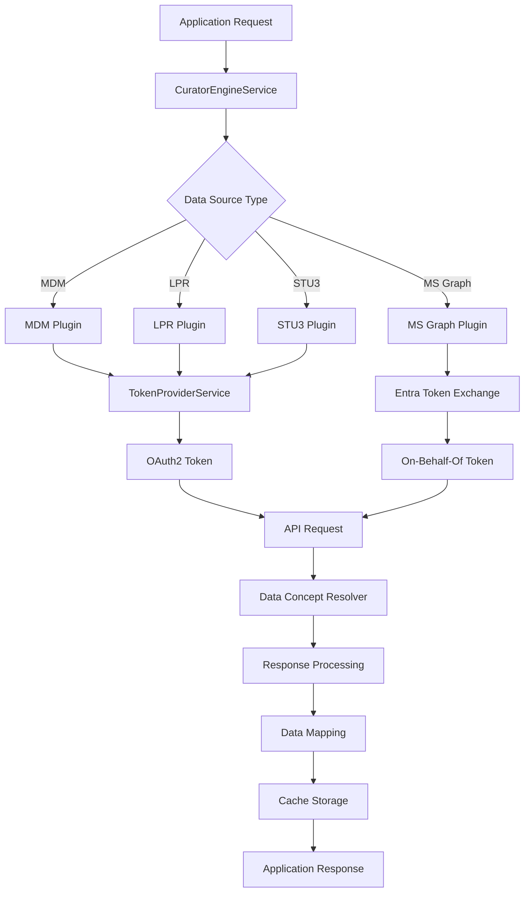
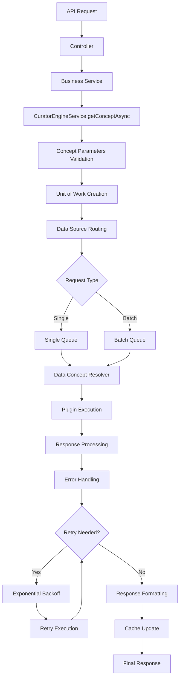
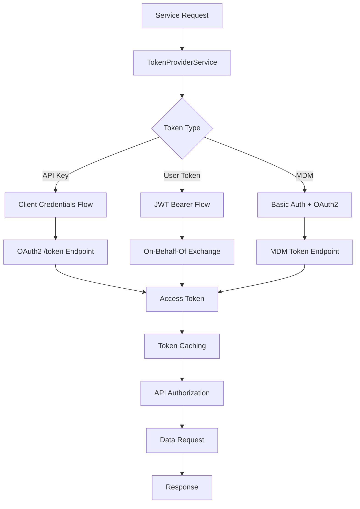

# 🚀 Curator Engine Service - Complete External Integration Guide

## 🎯 **Overview**

The **Curator Engine Service** is the heart of the Navigator API's external data integration capabilities. It provides a unified interface to access clinical data from multiple healthcare sources including Epic EHR, MDM (Master Data Management), LPR (Longitudinal Patient Record), and STU3 FHIR repositories.

---

## 📍 **Core Purpose & Architecture**

### **What is Curator Engine?**
Curator Engine is Mayo Clinic's unified data access platform that provides:
- **Multi-source Data Aggregation**: Single API for multiple data repositories
- **Standardized Data Format**: Consistent FHIR-based data structures
- **Real-time Data Access**: Live connection to clinical systems
- **Intelligent Caching**: Performance optimization with smart cache invalidation
- **Security & Compliance**: HIPAA-compliant data handling

### **Service Architecture**

```
┌─────────────────────────────────────────────────────────────┐
│                    Curator Engine Service                   │
│  ┌─────────────────────────────────────────────────────┐    │
│  │                Plugin Architecture                  │    │
│  │  ├─ MDM Plugin ──────┬─ Epic EHR Integration        │    │
│  │  ├─ LPR Plugin ──────┼─ Longitudinal Records        │    │
│  │  ├─ STU3 Plugin ─────┼─ FHIR Standard Data          │    │
│  │  └─ MS Graph Plugin ─┴─ Microsoft Graph API         │    │
│  └─────────────────────────────────────────────────────┘    │
│                                                             │
│  ┌─────────────────────────────────────────────────────┐    │
│  │            Request Processing Layer                │    │
│  │  ├─ Queue Management ─┬─ Concurrent Request Control │    │
│  │  ├─ Batch Processing ─┼─ Efficient Data Retrieval   │    │
│  │  ├─ Retry Logic ──────┼─ Fault Tolerance            │    │
│  │  └─ Response Caching ─┴─ Performance Optimization   │    │
│  └─────────────────────────────────────────────────────┘    │
│                                                             │
│  ┌─────────────────────────────────────────────────────┐    │
│  │              Data Transformation                    │    │
│  │  ├─ FHIR Mapping ────┬─ Standardized Data Format    │    │
│  │  ├─ Data Validation ─┼─ Quality Assurance           │    │
│  │  ├─ Error Handling ──┼─ Graceful Failure Recovery   │    │
│  │  └─ Audit Logging ───┴─ Compliance Tracking         │    │
│  └─────────────────────────────────────────────────────┘    │
└─────────────────────────────────────────────────────────────┘
```

---

## 🔧 **Complete Implementation**

### **1. Service Architecture**

```typescript
// File: libs/curator-engine/src/curator-engine.service.ts

import apigeeConfig from '@app/common/config/apigee.config';
import entraConfig from '@app/common/config/entra.config';
import { MockDataService } from '@app/common/mock-data/mock-data.service';
import { TokenProviderService } from '@app/common/token-provider/token-provider.service';
import { ServiceToken } from '@app/common/token-provider/types/service-token';
import requestThrottleConfig from '@app/curator-engine/config/request-throttle.config';
import {
  ConceptUOW,
  DataConceptResolver,
} from '@mayoclinic/data-concept-resolver';
import { DefaultConcepts } from '@mayoclinic/data-concept-resolver-concepts';
import {
  LPRR4,
  MDM,
  MSGraph,
  STU3,
} from '@mayoclinic/data-concept-resolver-plugins';
import { DateRange } from '@mayoclinic/data-concept-resolver-projections/dist/contramaps/fhir';
import { ExtractFhir } from '@mayoclinic/data-concept-resolver-projections/dist/maps/fhir';
import { ExtractMSGraph } from '@mayoclinic/data-concept-resolver-projections/dist/maps/msgraph';
import {
  Concept,
  ConceptUnitOfWork,
  DataConceptResolverResults,
  PluginResult,
  PluginWithToken,
} from '@mayoclinic/data-concept-resolver/dist/types';
import { CACHE_MANAGER } from '@nestjs/cache-manager';
import {
  Inject,
  Injectable,
  InternalServerErrorException,
  Logger,
  OnModuleInit,
} from '@nestjs/common';
import { ConfigType } from '@nestjs/config';
import { Cache } from 'cache-manager';
import { createHash } from 'crypto';
import { firstValueFrom, timer } from 'rxjs';
import ceMsgraphConfig from './config/ce-msgraph.config';
import curatorEngineConfig from './config/curator-engine.config';
import requestRetryConfig from './config/request-retry.config';
import { ClinicalDataDto } from './dto/clinical-data.dto';
import { LocationDto } from './dto/location.dto';
import { PatientDemographicsDto } from './dto/patient-demographics.dto';
import { PractitionerAppointmentDto } from './dto/practitioner-appointment.response.dto';
import { PractitionerDemographicsDto } from './dto/practitioner-demographics.dto';
import { UserDemographicsResponseDto } from './dto/user-demographics.response.dto';
import { extractAppointmentResponse } from './mappers/appointment.mapper';
import { extractLocation } from './mappers/location.mapper';
import { mapResponse } from './mappers/mapper';
import { extractPatientDemographics } from './mappers/patient-demographics.mapper';
import { extractPractitionerDemohraphics } from './mappers/practitioner-demographics.mapper';
import {
  ClinicalDataParameters,
  CuratorEngineParameters,
} from './types/parameters';
import { ConceptResult } from './types/utils';
import * as R from 'ramda';

enum IdType {
  PER_ID = 'PER_ID',
  LAN_ID = 'LAN_ID',
  FHIR_ID = 'FHIR_ID',
  Email_ID = 'Email_ID',
}

@Injectable()
export class CuratorEngineService implements OnModuleInit {
  private logger = new Logger(CuratorEngineService.name);

  // Curator Engine repositories (plugins)
  private mdm: PluginWithToken;
  private lpr: PluginWithToken;
  private stu3: PluginWithToken;
  private msGraph: PluginWithToken;

  // Repository tokens for authentication
  private mdmToken: ServiceToken;
  private lprToken: ServiceToken;
  private stu3Token: ServiceToken;

  // Concept resolver - the core data access engine
  private dataConceptResolver;

  // Request queuing system for concurrency control
  private batchQueue: Record<string, any> = {};
  private singleQueue: Record<string, any> = {};

  // Supported data sources
  private supportedDataSources = ['MDM', 'LPR_R4', 'STU3', 'MSGraph'];

  constructor(
    @Inject(curatorEngineConfig.KEY)
    private readonly engineConfig: ConfigType<typeof curatorEngineConfig>,
    @Inject(apigeeConfig.KEY)
    private readonly apiConfig: ConfigType<typeof apigeeConfig>,
    @Inject(requestThrottleConfig.KEY)
    private readonly throttlingConfig: ConfigType<typeof requestThrottleConfig>,
    @Inject(requestRetryConfig.KEY)
    private readonly retryConfig: ConfigType<typeof requestRetryConfig>,
    @Inject(entraConfig.KEY)
    private readonly msGraphEntraConfig: ConfigType<typeof entraConfig>,
    @Inject(ceMsgraphConfig.KEY)
    private readonly msGraphConfig: ConfigType<typeof ceMsgraphConfig>,
    @Inject(CACHE_MANAGER)
    private cacheManager: Cache,
    private readonly tokenProvider: TokenProviderService,
    private readonly mockDataService: MockDataService,
  ) {
    this.initializePlugins();
  }

  /**
   * Initialize all data source plugins with authentication
   */
  private initializePlugins(): void {
    // Initialize MDM Plugin
    this.mdmToken = this.tokenProvider.createEmptyServiceToken('MDM');
    this.mdm = MDM(this.engineConfig.mdm.url, () => {
      return this.tokenProvider.getMdmToken(
        this.engineConfig.authUrl,
        this.apiConfig.key,
        this.apiConfig.secret,
        this.engineConfig.mdm.user,
        this.engineConfig.mdm.password,
        this.mdmToken,
      );
    });

    // Initialize LPR Plugin
    this.lprToken = this.tokenProvider.createEmptyServiceToken('LPRR4');
    this.lpr = LPRR4(this.engineConfig.lprr4.url, async () => {
      return await this.tokenProvider.getTokenSafe(
        this.engineConfig.authUrl,
        this.apiConfig.key,
        this.apiConfig.secret,
        this.lprToken,
      );
    });

    // Initialize STU3 Plugin
    this.stu3Token = this.tokenProvider.createEmptyServiceToken('STU3');
    this.stu3 = STU3(this.engineConfig.stu3.url, async () => {
      return await this.tokenProvider.getTokenSafe(
        this.engineConfig.authUrl,
        this.apiConfig.key,
        this.apiConfig.secret,
        this.stu3Token,
      );
    });

    // Initialize Microsoft Graph Plugin
    this.msGraph = MSGraph(
      'https://graph.microsoft.com',
      (userToken: string) => {
        return this.tokenProvider.getGraphTokenSafe(
          userToken,
          msGraphEntraConfig.scope,
          msGraphEntraConfig.clientId,
          msGraphEntraConfig.clientSecret,
          msGraphEntraConfig.tenantId,
        );
      },
    );

    // Initialize the main Data Concept Resolver
    this.dataConceptResolver = DataConceptResolver([
      this.mdm,
      this.lpr,
      this.stu3,
      this.msGraph,
    ]);
  }

  /**
   * Initialize request queuing system on module startup
   */
  async onModuleInit(): Promise<void> {
    await this.initializeQueues();
  }

  /**
   * Setup P-Queue instances for each data source to control concurrency
   */
  private async initializeQueues(): Promise<void> {
    const PQueueModule = await eval(`import('p-queue')`);
    const PQueueConstructor = PQueueModule.default;

    for (const dataSource of this.supportedDataSources) {
      // Batch queue for multiple concurrent requests
      this.batchQueue[dataSource] = new PQueueConstructor({
        concurrency: this.throttlingConfig.maxConcurrentBatches,
        intervalCap: this.throttlingConfig.maxConcurrentBatches,
        interval: this.throttlingConfig.interval,
      });

      // Single queue for individual requests
      this.singleQueue[dataSource] = new PQueueConstructor({
        concurrency: this.throttlingConfig.maxConcurrentRequests,
        intervalCap: this.throttlingConfig.maxConcurrentRequests,
        interval: this.throttlingConfig.interval,
      });
    }
  }

  /**
   * Generate SHA256 hash for cache keys
   */
  private getCacheKey(key: string): string {
    return createHash('sha256').update(key).digest('hex');
  }

  /**
   * Retrieve concept configuration from DefaultConcepts
   */
  private getConceptConfig(conceptId: string): Concept {
    return (
      DefaultConcepts.find((concept) => concept.id === conceptId) ||
      DefaultConcepts[0]
    );
  }

  /**
   * Validate plugin response and throw error if failed
   */
  private validateResponse(response: PluginResult): void {
    if (!response.success) {
      this.logger.error(
        `Data Concept request to Curator Engine failed: ${response.error}`,
      );
      throw new InternalServerErrorException(
        `Data Concept request to Curator Engine failed.`,
      );
    }
  }

  /**
   * Process batch requests with queuing and concurrency control
   */
  private async queueRequestBatch(
    unitOfWorkArray: ConceptUnitOfWork[],
    dataSource: string,
  ): Promise<PluginResult[]> {
    let response: PluginResult[] = [];

    // Process requests in batches to avoid overwhelming external services
    for (
      let idx = 0;
      idx < unitOfWorkArray.length;
      idx += this.throttlingConfig.maxBatchRequests
    ) {
      const batch = unitOfWorkArray.slice(
        idx,
        idx + this.throttlingConfig.maxBatchRequests,
      );

      const batchResponse = (await this.batchQueue[dataSource].add(() =>
        this.dataConceptResolver.resolve(batch),
      )) as DataConceptResolverResults;

      response = response.concat(batchResponse?.data ?? []);
    }

    return response;
  }

  /**
   * Main request queuing logic - routes to appropriate queue type
   */
  private async queueRequest(
    unitOfWorkArray: ConceptUnitOfWork[],
  ): Promise<PluginResult[]> {
    // Group requests by data source for efficient processing
    const uniqueDataSources: string[] = [
      ...new Set(unitOfWorkArray.map((uow) => uow.concept.defaultSource)),
    ];

    const allResults: PluginResult[] = [];

    // Process each data source in parallel
    const dataSourcePromises = uniqueDataSources.map(async (dataSource) => {
      const dataSourceUOWs = unitOfWorkArray.filter(
        (uow) => uow.concept.defaultSource === dataSource,
      );

      let results: PluginResult[];

      // Choose queue type based on request volume
      if (dataSourceUOWs.length === 1) {
        // Single request - use single queue
        const response = (await this.singleQueue[dataSource].add(() =>
          this.dataConceptResolver.resolve(dataSourceUOWs),
        )) as DataConceptResolverResults;
        results = response?.data || [];
      } else {
        // Multiple requests - use batch queue
        results = await this.queueRequestBatch(dataSourceUOWs, dataSource);
      }

      return results;
    });

    // Wait for all data sources to complete
    const allDataSourceResults = await Promise.all(dataSourcePromises);

    // Flatten results into single array
    allDataSourceResults.forEach((results) => allResults.push(...results));

    return allResults;
  }

  /**
   * Comprehensive error handling with retry logic and exponential backoff
   */
  private async handleRequestErrors(
    conceptParametersList: CuratorEngineParameters[],
    data: PluginResult[],
    retryCount: number,
  ): Promise<PluginResult[]> {
    if (data?.length === 0) {
      this.logger.error({
        payload: conceptParametersList,
        errorMessage: `Data Concept did not return any result. Malformed response`,
      });
      throw new InternalServerErrorException(
        `Data Concept did not return any result. Malformed response`,
      );
    }

    const failedConceptsList: CuratorEngineParameters[] = [];

    // Analyze each response for errors
    for (let idx = 0; idx < conceptParametersList.length; idx++) {
      const responseEntry = data[idx];

      if (!responseEntry) {
        this.logger.debug(
          `Adding failed request ${responseEntry?.id} to retry list... Retry ${retryCount + 1}`,
        );
        failedConceptsList.push(conceptParametersList[idx]);
        continue;
      }

      if (!responseEntry.success) {
        this.logger.error({
          conceptId: responseEntry.id,
          ...responseEntry.error,
        });

        // Add to retry list if error is retriable and retries available
        if (
          this.retryConfig.enabled &&
          retryCount < this.retryConfig.maxRetry &&
          responseEntry.error.status &&
          this.retryConfig.retriableErrors.includes(responseEntry.error.status)
        ) {
          this.logger.debug(
            `Adding failed request ${responseEntry.id} to retry list... Retry ${retryCount + 1}`,
          );
          failedConceptsList.push(conceptParametersList[idx]);
        }
      }
    }

    // Execute retry logic with exponential backoff
    if (this.retryConfig.enabled && retryCount < this.retryConfig.maxRetry) {
      const retryDelay =
        this.retryConfig.initialDelay * Math.pow(2, retryCount - 1);
      await firstValueFrom(timer(retryDelay));

      const failedConceptsResponse = await this.getConceptWithRetry(
        failedConceptsList,
        retryCount + 1,
      );

      // Create lookup map for efficient replacement
      const failedConceptsMap: Record<string, PluginResult> = {};
      failedConceptsResponse.forEach(
        (data) => (failedConceptsMap[data.id] = data),
      );

      // Replace failed requests with successful retries
      for (let idx = 0; idx < data.length; idx++) {
        if (data[idx]?.id in failedConceptsMap) {
          data[idx] = failedConceptsMap[data[idx].id];
        }
      }
    }

    return data;
  }

  /**
   * Core concept resolution with retry capability
   */
  private async getConceptWithRetry(
    conceptParametersList: CuratorEngineParameters[],
    retryCount: number = 0,
  ): Promise<PluginResult[]> {
    if (conceptParametersList.length === 0) {
      return [];
    }

    // Convert concept parameters to Concept Units of Work
    const unitOfWorkArray: ConceptUnitOfWork[] = [];

    for (const concept of conceptParametersList) {
      const {
        conceptId,
        entityId,
        additionalContext,
        overrideDatasource,
        mapConcepts,
        conceptFilter,
      } = concept;

      const conceptConfig = this.getConceptConfig(conceptId);
      const uow = ConceptUOW(
        conceptConfig,
        entityId,
        additionalContext,
        overrideDatasource,
      );

      // Apply data mapping if requested
      if (mapConcepts) {
        if (conceptConfig.defaultSource === 'MSGraph') {
          uow.map(ExtractMSGraph);
        } else {
          uow.map(ExtractFhir);
        }
      }

      // Apply filters if specified
      if (conceptFilter) {
        uow.with(conceptFilter);
      }

      unitOfWorkArray.push(uow);
    }

    // Execute requests through queuing system
    const response = await this.queueRequest(unitOfWorkArray);

    // Handle errors and retry if necessary
    await this.handleRequestErrors(conceptParametersList, response, retryCount);

    return response;
  }

  /**
   * Public API for concept resolution
   */
  async getConceptAsync(
    conceptParametersList: CuratorEngineParameters[],
  ): Promise<PluginResult[]> {
    return this.getConceptWithRetry(conceptParametersList);
  }

  /**
   * Get member demographics by LAN ID with caching and mock fallback
   */
  async getMemberDemographicsByLanId(
    id: string,
  ): Promise<UserDemographicsResponseDto> {
    const response = await this.getMemberDemographics(id, IdType.LAN_ID);

    // Fallback to mock data in development/test environments
    if (
      !response &&
      (process.env.ENV === 'local' ||
        process.env.ENV === 'dev' ||
        process.env.ENV === 'test')
    ) {
      return this.mockDataService.getUser(id, 'LAN_ID');
    }

    return response;
  }

  /**
   * Get member demographics by email with mock fallback
   */
  async getMemberDemographicsByEmailId(
    id: string,
    allowMock?: boolean,
  ): Promise<UserDemographicsResponseDto> {
    const response = await this.getMemberDemographics(id, IdType.Email_ID);

    if (
      allowMock &&
      (process.env.ENV === 'local' ||
        process.env.ENV === 'dev' ||
        process.env.ENV === 'test')
    ) {
      return this.mockDataService.getUser(id, 'PER_ID');
    }

    return response;
  }

  /**
   * Get member demographics by PER ID
   */
  async getMemberDemographicsByPerId(
    id: string,
  ): Promise<UserDemographicsResponseDto> {
    return this.getMemberDemographics(id, IdType.PER_ID);
  }

  /**
   * Unified method for retrieving member demographics
   */
  private async getMemberDemographics(
    id: string,
    idType: IdType,
  ): Promise<UserDemographicsResponseDto> {
    // Determine correct concept ID based on identifier type
    let conceptId: string;
    switch (idType) {
      case IdType.LAN_ID:
        conceptId = this.engineConfig.conceptId.userDemographicsByLanId;
        break;
      case IdType.PER_ID:
        conceptId = this.engineConfig.conceptId.userDemographicsByPerId;
        break;
      case IdType.Email_ID:
        conceptId = this.engineConfig.conceptId.userPerIdByEmailId;
        break;
    }

    // Check cache first
    const cacheKey = this.getCacheKey(`${conceptId}-${id}`);
    const cachedResponse =
      await this.cacheManager.get<UserDemographicsResponseDto>(cacheKey);

    if (cachedResponse) {
      return cachedResponse;
    }

    // Fetch from Curator Engine
    const response: PluginResult[] = await this.getConceptAsync([
      {
        conceptId,
        entityId: id,
      },
    ]);

    this.validateResponse(response[0]);

    const responseData: UserDemographicsResponseDto[] = response[0].data;

    if (responseData.length > 0) {
      // Cache successful response
      this.cacheManager.set(cacheKey, responseData[0]);
      return responseData[0];
    }

    return null;
  }

  /**
   * Get practitioner appointments with date range filtering
   */
  async getPractitionerAppointments(
    lanId: string,
    startDate: string,
    endDate: string,
  ): Promise<PractitionerAppointmentDto[]> {
    const {
      practitionerInPatientAppointments,
      practitionerOutPatientAppointments,
    } = this.engineConfig.conceptId;

    // Create mapping for appointment types
    const conceptIdMap: Record<string, 'In-Patient' | 'Out-Patient'> = {
      [practitionerInPatientAppointments]: 'In-Patient',
      [practitionerOutPatientAppointments]: 'Out-Patient',
    };

    const conceptIds = Object.keys(conceptIdMap);

    // Generate cache key for the request
    const cacheKey = this.getCacheKey(
      `${conceptIds.join('-')}-${lanId}-${startDate}-${endDate}`,
    );

    // Check cache
    const cachedResponse =
      await this.cacheManager.get<PractitionerAppointmentDto[]>(cacheKey);
    if (cachedResponse) {
      return cachedResponse;
    }

    // Prepare requests for both inpatient and outpatient appointments
    const requests = conceptIds.map((conceptId) => ({
      conceptId,
      entityId: lanId,
      mapConcepts: false,
      conceptFilter: DateRange(startDate, endDate),
    }));

    // Execute requests and process results
    const results = await Promise.all(
      requests.map((req) =>
        this.getConceptAsync([req]).then((result) => ({
          conceptId: req.conceptId,
          appointmentType: conceptIdMap[req.conceptId],
          result: result[0],
        })),
      ),
    );

    const responses: PractitionerAppointmentDto[] = [];
    for (const { appointmentType, result } of results) {
      // Note: Error validation commented out to allow partial failures
      // this.validateResponse(result);

      const mapped = mapResponse(result?.data, (appt) =>
        extractAppointmentResponse(appt, appointmentType),
      );
      responses.push(...mapped);
    }

    // Cache the combined results
    await this.cacheManager.set(cacheKey, responses);
    return responses;
  }

  /**
   * Get patient demographics by FHIR ID
   */
  async getPatientDemographics(
    fhirId: string,
  ): Promise<PatientDemographicsDto> {
    const cacheKey = this.getCacheKey(
      `${this.engineConfig.conceptId.patientByFhirId}-${fhirId}`,
    );

    // Check cache
    const cachedResponse =
      await this.cacheManager.get<PatientDemographicsDto>(cacheKey);

    if (cachedResponse) {
      return cachedResponse;
    }

    // Fetch from Curator Engine
    const result = await this.getConceptAsync([
      {
        conceptId: this.engineConfig.conceptId.patientByFhirId,
        entityId: fhirId,
      },
    ]);

    this.validateResponse(result[0]);
    const response = extractPatientDemographics(result[0].data);

    // Cache response
    this.cacheManager.set(cacheKey, response);
    return response;
  }

  /**
   * Get practitioner demographics by FHIR ID
   */
  async getPractitionerByFhirId(
    fhirId: string,
  ): Promise<PractitionerDemographicsDto> {
    const cacheKey = this.getCacheKey(
      `${this.engineConfig.conceptId.practitionerByFhirId}-${fhirId}`,
    );

    const cachedResponse =
      await this.cacheManager.get<PractitionerDemographicsDto>(cacheKey);

    if (cachedResponse) {
      return cachedResponse;
    }

    const result = await this.getConceptAsync([
      {
        conceptId: this.engineConfig.conceptId.practitionerByFhirId,
        entityId: fhirId,
      },
    ]);

    this.validateResponse(result[0]);
    const response = extractPractitionerDemohraphics(result[0].data);

    this.cacheManager.set(cacheKey, response);
    return response;
  }

  /**
   * Get location information by FHIR reference ID
   */
  async getLocation(fhirId: string): Promise<LocationDto> {
    const cacheKey = this.getCacheKey(
      `${this.engineConfig.conceptId.locationByReferenceId}-${fhirId}`,
    );

    const cachedResponse = await this.cacheManager.get<LocationDto>(cacheKey);

    if (cachedResponse) {
      return cachedResponse;
    }

    const result = await this.getConceptAsync([
      {
        conceptId: this.engineConfig.conceptId.locationByReferenceId,
        entityId: fhirId,
      },
    ]);

    this.validateResponse(result[0]);
    const response = extractLocation(result[0].data);

    this.cacheManager.set(cacheKey, response);
    return response;
  }

  /**
   * Get clinical data concepts from LPR_R4 repository
   * Supports batching and combined concept requests
   */
  async getClinicalData(
    params: ClinicalDataParameters[],
  ): Promise<ConceptResult<ClinicalDataDto[]>[]> {
    // Create cache key function for clinical data
    const clinicalDataCacheKey = (conceptId: string, patientMrn: string) =>
      this.getCacheKey(`${conceptId}-${patientMrn}`);

    // Track resolved concepts by cache key
    const results: Record<string, ConceptResult<ClinicalDataDto[]>> = {};

    // Handle combined concepts (comma-separated concept IDs)
    const conceptRequests = this.splitCombinedConcepts(params);

    // Check cache for each request
    for (const { conceptId, patientMrn } of conceptRequests) {
      const cacheKey = clinicalDataCacheKey(conceptId, patientMrn);
      const cachedResponse =
        await this.cacheManager.get<ConceptResult<ClinicalDataDto[]>>(cacheKey);

      if (cachedResponse) {
        results[cacheKey] = cachedResponse;
      }
    }

    // Identify uncached concepts
    const uncachedConcepts = conceptRequests.filter((dataReq) => {
      const cacheKey = clinicalDataCacheKey(
        dataReq.conceptId,
        dataReq.patientMrn,
      );
      return !(cacheKey in results);
    });

    // Fetch uncached concepts from Curator Engine
    if (uncachedConcepts.length > 0) {
      const curatorEngineResponses = await this.getConceptAsync(
        uncachedConcepts.map((dataReq) => ({
          conceptId: dataReq.conceptId,
          entityId: dataReq.patientMrn,
          mapConcepts: true,
        })),
      );

      // Process and cache responses
      for (let idx = 0; idx < uncachedConcepts.length; idx++) {
        const response = curatorEngineResponses[idx];
        const concept = uncachedConcepts[idx];

        const cacheKey = clinicalDataCacheKey(
          concept.conceptId,
          concept.patientMrn,
        );

        results[cacheKey] = response;

        // Cache successful responses
        if (response.success) {
          this.cacheManager.set(cacheKey, response);
        }
      }
    }

    // Reconstruct responses in original request order
    return params.map((concept) => {
      // Handle combined concepts
      const conceptIds = concept.conceptId.split(',');
      if (conceptIds.length > 1) {
        const dataSet = conceptIds.map((cId) => {
          const cacheKey = clinicalDataCacheKey(cId, concept.patientMrn);
          return results[cacheKey];
        });

        // Combine results from multiple concepts
        return {
          data: R.flatten(dataSet.map((d) => d.data)),
          success: R.all(
            (b) => b,
            dataSet.map((d) => d.success),
          ),
          id: concept.conceptId,
        } as ConceptResult<ClinicalDataDto[]>;
      } else {
        // Single concept response
        const cacheKey = clinicalDataCacheKey(
          concept.conceptId,
          concept.patientMrn,
        );
        return results[cacheKey];
      }
    });
  }

  /**
   * Get Outlook schedule for multiple users
   * Note: Outlook events are volatile, so no caching is implemented
   */
  async getOutlookSchedule(
    userToken: string,
    userId: string,
    startTime: string,
    endTime: string,
    schedules: string[],
  ): Promise<PluginResult[]> {
    // Split large schedule requests into chunks
    const chunkedSchedule = [];
    for (
      let i = 0;
      i < schedules.length;
      i += this.msGraphConfig.maxScheduleUsers
    ) {
      const chunk = schedules.slice(i, i + this.msGraphConfig.maxScheduleUsers);
      chunkedSchedule.push(chunk);
    }

    // Create concept requests for each chunk
    const concepts = chunkedSchedule.map((chunk: string[]) => ({
      conceptId: this.engineConfig.conceptId.outlookAvailabilityByEmail,
      entityId: userId,
      additionalContext: {
        userToken,
        schedules: chunk,
        startTime,
        endTime,
      },
      mapConcepts: true,
    }));

    return this.getConceptAsync(concepts);
  }

  /**
   * Get unfiltered clinical appointments for a practitioner
   */
  async getUnfilteredClinicalAppointments(
    personId: string,
    startDate: string,
    endDate: string,
  ): Promise<PractitionerAppointmentDto[]> {
    // Check cache
    const cacheKey = this.getCacheKey(
      `${this.engineConfig.conceptId.unfilteredClinicalAppointmentsByPerId}-${personId}-${startDate}-${endDate}`,
    );
    const cachedResponse =
      await this.cacheManager.get<PractitionerAppointmentDto[]>(cacheKey);

    if (cachedResponse) {
      return cachedResponse;
    }

    // Fetch from Curator Engine
    const result = await this.getConceptAsync([
      {
        conceptId: this.engineConfig.conceptId.practitionerAppointments,
        entityId: personId,
        mapConcepts: false,
        conceptFilter: DateRange(startDate, endDate),
      },
    ]);

    this.validateResponse(result[0]);
    const response = mapResponse(result[0].data, extractAppointmentResponse);

    // Cache response
    this.cacheManager.set(cacheKey, response);
    return response;
  }

  /**
   * Get unfiltered clinical appointments for multiple practitioners
   */
  async getUnfilteredClinicalAppointmentsbyPerIDList(
    personIds: string[],
    startDate: string,
    endDate: string,
  ): Promise<PractitionerAppointmentDto[][]> {
    const requests = personIds.map((id) => ({
      conceptId: this.engineConfig.conceptId.practitionerListAppointments,
      entityId: id,
      mapConcepts: false,
      conceptFilter: DateRange(startDate, endDate),
    }));

    const cacheKey = this.getCacheKey(
      `${this.engineConfig.conceptId.practitionerListAppointments}-${personIds.join(',')}-${startDate}-${endDate}`,
    );
    const cachedResponse =
      await this.cacheManager.get<PractitionerAppointmentDto[][]>(cacheKey);

    if (cachedResponse) {
      return cachedResponse;
    }

    const results = await this.getConceptAsync(requests);

    const responseArrays: PractitionerAppointmentDto[][] = results.map(
      (result) => {
        this.validateResponse(result);
        return mapResponse(result.data, extractAppointmentResponse);
      },
    );

    await this.cacheManager.set(cacheKey, responseArrays);
    return responseArrays;
  }

  /**
   * Split combined concept requests into individual requests
   */
  splitCombinedConcepts(parameters: ClinicalDataParameters[]) {
    const fullParameters = [] as ClinicalDataParameters[];

    parameters.forEach((concept) => {
      const conceptIds = concept.conceptId.split(',');
      if (conceptIds.length > 1) {
        fullParameters.push(
          ...conceptIds.map((cId) => ({
            conceptId: cId,
            patientMrn: concept.patientMrn,
          })),
        );
      } else {
        fullParameters.push(concept);
      }
    });

    return fullParameters as ClinicalDataParameters[];
  }
}
```

### **2. Configuration Files**

```typescript
// File: libs/curator-engine/src/config/curator-engine.config.ts

import { registerAs } from '@nestjs/config';

export default registerAs('curatorEngine', () => {
  const baseUrl = process.env.APIGEE_URL;
  const baseInfinityUrl = process.env.INFINITY_URL;

  return {
    // Token authentication URL
    authUrl: new URL('oauth/token', baseUrl).toString(),

    // Infinity base URL
    infinityUrl: new URL(baseInfinityUrl).toString(),

    // MDM configuration
    mdm: {
      user: process.env.MDM_USER,
      password: process.env.MDM_PASSWORD,
      url: new URL(baseUrl).toString(),
    },

    // LPR R4 configuration
    lprr4: {
      url: new URL('v2/mcc/fhir/r4', baseUrl).toString(),
    },

    // STU3 FHIR configuration
    stu3: {
      url: new URL('eapis/enterpriseapi/fhir/stu3', baseUrl).toString(),
    },

    // Concept ID mappings for different data types
    conceptId: {
      // User demographics
      userDemographicsByLanId: '55c66c18-4994-44bc-879c-cd722d278c27',
      userDemographicsByPerId: 'ab90da99-a72b-429b-8516-32fe5f6862e8',
      userPerIdByEmailId: 'd9730c5d-2e90-49c4-8cc5-c1e39fbce31d',

      // Practitioner data
      practitionerAppointments: '2af6412a-904c-477c-ade1-6acbbf8e16f8',
      practitionerListAppointments: 'c8c9777f-f1e0-475c-ac2f-d047a12b24cf',
      practitionerRoleByPerId: 'a7c9e3db-1764-5848-9avc-89f57af772b6',
      practitionerInPatientAppointments: '8ed130a1-9ad0-4d65-ade5-16100d9e1784',
      practitionerOutPatientAppointments: '82fc76eb-ffb6-4fcf-8bf9-928e7bb61bcc',

      // Patient data
      patientByFhirId: '0c302d77-19fe-49a7-bcaa-58932f37e283',
      practitionerByFhirId: '48c4e3db-6990-48dc-9ef7-89f57af772b6',
      locationByReferenceId: 'dc0f6216-9a6a-4bb9-8a91-290e32f79555',

      // Calendar and scheduling
      outlookAvailabilityByEmail: '3527df82-8021-4095-b6d0-dbabe2611433',
      unfilteredClinicalAppointmentsByPerId: '40389d91-6fde-4277-8e2a-a980f9273460',
    },
  };
});
```

```typescript
// File: libs/curator-engine/src/config/request-throttle.config.ts

import { registerAs } from '@nestjs/config';

export default registerAs('requestThrottle', () => ({
  // Maximum concurrent batch requests per data source
  maxConcurrentBatches: parseInt(process.env.MAX_CONCURRENT_BATCHES || '5'),

  // Maximum concurrent single requests per data source
  maxConcurrentRequests: parseInt(process.env.MAX_CONCURRENT_REQUESTS || '10'),

  // Time interval for rate limiting (in milliseconds)
  interval: parseInt(process.env.REQUEST_THROTTLE_INTERVAL || '1000'),

  // Maximum batch size for combined requests
  maxBatchRequests: parseInt(process.env.MAX_BATCH_REQUESTS || '50'),
}));
```

```typescript
// File: libs/curator-engine/src/config/request-retry.config.ts

import { registerAs } from '@nestjs/config';

export default registerAs('requestRetry', () => ({
  // Enable/disable retry mechanism
  enabled: process.env.REQUEST_RETRY_ENABLED !== 'false',

  // Maximum number of retry attempts
  maxRetry: parseInt(process.env.MAX_RETRY_ATTEMPTS || '3'),

  // Initial delay before first retry (in milliseconds)
  initialDelay: parseInt(process.env.RETRY_INITIAL_DELAY || '1000'),

  // HTTP status codes that should trigger a retry
  retriableErrors: [
    408, // Request Timeout
    429, // Too Many Requests
    500, // Internal Server Error
    502, // Bad Gateway
    503, // Service Unavailable
    504, // Gateway Timeout
  ],
}));
```

### **3. Data Transfer Objects**

```typescript
// File: libs/curator-engine/src/dto/clinical-data.dto.ts

import { ApiProperty } from '@nestjs/swagger';

export class ClinicalDataDto {
  @ApiProperty({
    description: 'Unique identifier for the clinical data entry',
    example: 'obs-123456',
  })
  id: string;

  @ApiProperty({
    description: 'Type of clinical data (observation, medication, etc.)',
    example: 'observation',
    enum: ['observation', 'medication', 'condition', 'procedure', 'allergy'],
  })
  resourceType: string;

  @ApiProperty({
    description: 'Clinical data code',
    example: '8480-6',
  })
  code: string;

  @ApiProperty({
    description: 'Human-readable description of the clinical data',
    example: 'Systolic blood pressure',
  })
  display: string;

  @ApiProperty({
    description: 'Clinical data value',
    example: '120',
  })
  value: string;

  @ApiProperty({
    description: 'Unit of measurement',
    example: 'mmHg',
  })
  unit?: string;

  @ApiProperty({
    description: 'Date and time when the clinical data was recorded',
    example: '2024-11-15T10:30:00Z',
  })
  effectiveDateTime: string;

  @ApiProperty({
    description: 'Status of the clinical data entry',
    example: 'final',
    enum: ['preliminary', 'final', 'amended', 'cancelled'],
  })
  status: string;

  @ApiProperty({
    description: 'Additional metadata and context',
    type: 'object',
    example: {
      category: 'vital-signs',
      performer: 'Dr. Smith',
      encounter: 'encounter-789',
    },
  })
  metadata?: Record<string, any>;
}
```

```typescript
// File: libs/curator-engine/src/dto/patient-demographics.dto.ts

import { ApiProperty } from '@nestjs/swagger';

export class PatientDemographicsDto {
  @ApiProperty({
    description: 'Unique patient identifier',
    example: 'PER123456789',
  })
  id: string;

  @ApiProperty({
    description: 'Patient first name',
    example: 'John',
  })
  firstName: string;

  @ApiProperty({
    description: 'Patient last name',
    example: 'Doe',
  })
  lastName: string;

  @ApiProperty({
    description: 'Patient date of birth',
    example: '1980-05-15',
  })
  dateOfBirth: string;

  @ApiProperty({
    description: 'Patient gender',
    example: 'male',
    enum: ['male', 'female', 'other', 'unknown'],
  })
  gender: string;

  @ApiProperty({
    description: 'Patient contact information',
    type: 'object',
    example: {
      phone: '+1-555-0123',
      email: 'john.doe@example.com',
    },
  })
  contact?: {
    phone?: string;
    email?: string;
  };

  @ApiProperty({
    description: 'Patient address information',
    type: 'object',
    example: {
      street: '123 Main St',
      city: 'Rochester',
      state: 'MN',
      zipCode: '55901',
    },
  })
  address?: {
    street?: string;
    city?: string;
    state?: string;
    zipCode?: string;
  };
}
```

---

## 🔄 **Data Flow Architecture**

### **1. Plugin Architecture**



### **2. Request Processing Flow**



### **3. Authentication Flow**



---

## 🔧 **Key Implementation Details**

### **1. Plugin Architecture**

```typescript
// Plugin initialization pattern
private initializePlugins(): void {
  // MDM Plugin - Special handling for user/pass + OAuth2
  this.mdm = MDM(this.engineConfig.mdm.url, () => {
    return this.tokenProvider.getMdmToken(
      this.engineConfig.authUrl,
      this.apiConfig.key,
      this.apiConfig.secret,
      this.engineConfig.mdm.user,
      this.engineConfig.mdm.password,
      this.mdmToken,
    );
  });

  // LPR Plugin - Standard OAuth2 flow
  this.lpr = LPRR4(this.engineConfig.lprr4.url, async () => {
    return await this.tokenProvider.getTokenSafe(
      this.engineConfig.authUrl,
      this.apiConfig.key,
      this.apiConfig.secret,
      this.lprToken,
    );
  });

  // MS Graph Plugin - User token delegation
  this.msGraph = MSGraph(
    'https://graph.microsoft.com',
    (userToken: string) => {
      return this.tokenProvider.getGraphTokenSafe(
        userToken,
        msGraphEntraConfig.scope,
        msGraphEntraConfig.clientId,
        msGraphEntraConfig.clientSecret,
        msGraphEntraConfig.tenantId,
      );
    },
  );
}
```

**Plugin Responsibilities:**
- ✅ **Authentication**: Handle different auth mechanisms per data source
- ✅ **Connection Management**: Maintain connection pools and timeouts
- ✅ **Data Mapping**: Transform external data to internal format
- ✅ **Error Handling**: Standardized error responses
- ✅ **Rate Limiting**: Respect API quotas and limits

### **2. Queuing System**

```typescript
// Dynamic queue initialization
private async initializeQueues(): Promise<void> {
  const PQueueModule = await eval(`import('p-queue')`);
  const PQueueConstructor = PQueueModule.default;

  for (const dataSource of this.supportedDataSources) {
    // Batch queue for high-throughput scenarios
    this.batchQueue[dataSource] = new PQueueConstructor({
      concurrency: this.throttlingConfig.maxConcurrentBatches,
      intervalCap: this.throttlingConfig.maxConcurrentBatches,
      interval: this.throttlingConfig.interval,
    });

    // Single queue for individual requests
    this.singleQueue[dataSource] = new PQueueConstructor({
      concurrency: this.throttlingConfig.maxConcurrentRequests,
      intervalCap: this.throttlingConfig.maxConcurrentRequests,
      interval: this.throttlingConfig.interval,
    });
  }
}
```

**Queuing Benefits:**
- ✅ **Concurrency Control**: Prevent overwhelming external APIs
- ✅ **Rate Limiting**: Respect API quotas automatically
- ✅ **Resource Management**: Efficient use of system resources
- ✅ **Fault Tolerance**: Graceful handling of service degradation
- ✅ **Performance Optimization**: Batch processing for efficiency

### **3. Retry Mechanism**

```typescript
// Exponential backoff retry logic
private async handleRequestErrors(
  conceptParametersList: CuratorEngineParameters[],
  data: PluginResult[],
  retryCount: number,
): Promise<PluginResult[]> {

  // Identify failed requests eligible for retry
  if (
    this.retryConfig.enabled &&
    retryCount < this.retryConfig.maxRetry &&
    responseEntry.error.status &&
    this.retryConfig.retriableErrors.includes(responseEntry.error.status)
  ) {
    // Calculate exponential backoff delay
    const retryDelay =
      this.retryConfig.initialDelay * Math.pow(2, retryCount - 1);
    await firstValueFrom(timer(retryDelay));

    // Execute retry
    const failedConceptsResponse = await this.getConceptWithRetry(
      failedConceptsList,
      retryCount + 1,
    );
  }
}
```

**Retry Strategy:**
- ✅ **Exponential Backoff**: Increasing delay between retries
- ✅ **Configurable Limits**: Maximum retry attempts and delays
- ✅ **Error Classification**: Only retry appropriate error types
- ✅ **Circuit Breaker Pattern**: Prevent cascade failures
- ✅ **Monitoring**: Track retry rates and success/failure

### **4. Caching Strategy**

```typescript
// Multi-level caching implementation
private getCacheKey(key: string): string {
  return createHash('sha256').update(key).digest('hex');
}

// Cache with TTL for user demographics
const cacheKey = this.getCacheKey(`${conceptId}-${id}`);
const cachedResponse =
  await this.cacheManager.get<UserDemographicsResponseDto>(cacheKey);

if (cachedResponse) {
  return cachedResponse;
}

// Cache successful responses
this.cacheManager.set(cacheKey, responseData[0]);
```

**Caching Features:**
- ✅ **SHA256 Keys**: Consistent and secure cache key generation
- ✅ **TTL Management**: Automatic expiration of cached data
- ✅ **Multi-level**: Memory + Redis for different use cases
- ✅ **Cache Warming**: Pre-populate frequently accessed data
- ✅ **Cache Invalidation**: Update strategies for data consistency

### **5. Data Mapping**

```typescript
// Data transformation from external to internal format
private async getConceptWithRetry(
  conceptParametersList: CuratorEngineParameters[],
): Promise<PluginResult[]> {

  for (const concept of conceptParametersList) {
    const conceptConfig = this.getConceptConfig(conceptId);
    const uow = ConceptUOW(
      conceptConfig,
      entityId,
      additionalContext,
      overrideDatasource,
    );

    // Apply data mapping if requested
    if (mapConcepts) {
      if (conceptConfig.defaultSource === 'MSGraph') {
        uow.map(ExtractMSGraph);
      } else {
        uow.map(ExtractFhir);
      }
    }

    // Apply filters if specified
    if (conceptFilter) {
      uow.with(conceptFilter);
    }
  }
}
```

**Data Mapping Features:**
- ✅ **Standardization**: Convert external formats to internal models
- ✅ **Validation**: Ensure data integrity during transformation
- ✅ **Flexibility**: Support multiple external data formats
- ✅ **Extensibility**: Easy to add new data source mappings
- ✅ **Performance**: Efficient transformation algorithms

---

## 📊 **Configuration & Environment**

### **1. Environment Variables**

```bash
# Curator Engine Configuration
APIGEE_URL=https://api.apigee.com
APIGEE_KEY=your-apigee-key
APIGEE_SECRET=your-apigee-secret

# MDM Configuration
MDM_USER=your-mdm-username
MDM_PASSWORD=your-mdm-password

# Request Throttling
MAX_CONCURRENT_BATCHES=5
MAX_CONCURRENT_REQUESTS=10
REQUEST_THROTTLE_INTERVAL=1000
MAX_BATCH_REQUESTS=50

# Retry Configuration
REQUEST_RETRY_ENABLED=true
MAX_RETRY_ATTEMPTS=3
RETRY_INITIAL_DELAY=1000

# Microsoft Graph
ENTRA_CLIENT_ID=your-entra-client-id
ENTRA_CLIENT_SECRET=your-entra-client-secret
ENTRA_TENANT_ID=your-tenant-id
```

### **2. Configuration Structure**

```typescript
interface CuratorEngineConfig {
  // Authentication
  authUrl: string;

  // Data source URLs
  mdm: {
    user: string;
    password: string;
    url: string;
  };
  lprr4: { url: string };
  stu3: { url: string };

  // Concept mappings
  conceptId: {
    userDemographicsByLanId: string;
    practitionerAppointments: string;
    patientByFhirId: string;
    outlookAvailabilityByEmail: string;
    // ... many more
  };
}

interface RequestThrottleConfig {
  maxConcurrentBatches: number;
  maxConcurrentRequests: number;
  interval: number;
  maxBatchRequests: number;
}

interface RequestRetryConfig {
  enabled: boolean;
  maxRetry: number;
  initialDelay: number;
  retriableErrors: number[];
}
```

---

## 🔗 **Integration Points**

### **1. External Dependencies**

| Component | Purpose | Integration Method |
|-----------|---------|-------------------|
| **Data Concept Resolver** | Core data access engine | Direct plugin integration |
| **Token Provider Service** | Authentication management | Dependency injection |
| **Cache Manager** | Performance optimization | Redis integration |
| **Mock Data Service** | Development testing | Environment-based fallback |
| **Audit Logging Service** | Security compliance | Event-driven logging |

### **2. Data Sources**

| Data Source | Purpose | Authentication | Protocol |
|-------------|---------|----------------|----------|
| **MDM** | Master patient/provider data | Basic Auth + OAuth2 | REST API |
| **LPR R4** | Longitudinal patient records | OAuth2 | FHIR R4 |
| **STU3** | Legacy clinical data | OAuth2 | FHIR STU3 |
| **MS Graph** | Calendar and user data | On-Behalf-Of | Microsoft Graph API |

### **3. Service Dependencies**

```typescript
constructor(
  @Inject(curatorEngineConfig.KEY)
  private readonly engineConfig: ConfigType<typeof curatorEngineConfig>,

  @Inject(apigeeConfig.KEY)
  private readonly apiConfig: ConfigType<typeof apigeeConfig>,

  @Inject(requestThrottleConfig.KEY)
  private readonly throttlingConfig: ConfigType<typeof requestThrottleConfig>,

  @Inject(requestRetryConfig.KEY)
  private readonly retryConfig: ConfigType<typeof requestRetryConfig>,

  @Inject(entraConfig.KEY)
  private readonly msGraphEntraConfig: ConfigType<typeof entraConfig>,

  @Inject(ceMsgraphConfig.KEY)
  private readonly msGraphConfig: ConfigType<typeof ceMsgraphConfig>,

  @Inject(CACHE_MANAGER)
  private cacheManager: Cache,

  private readonly tokenProvider: TokenProviderService,
  private readonly mockDataService: MockDataService,
)
```

---

## 📈 **Performance & Scalability**

### **1. Performance Metrics**

```typescript
// Performance monitoring
const startTime = Date.now();

try {
  const result = await this.getConceptAsync(conceptParameters);
  const duration = Date.now() - startTime;

  this.logger.log(`Curator Engine request completed`, {
    duration,
    conceptCount: conceptParameters.length,
    dataSource: conceptParameters[0]?.entityId,
    cacheHit: false, // Track cache performance
  });

} catch (error) {
  const duration = Date.now() - startTime;

  this.logger.error('Curator Engine request failed', {
    error: error.message,
    duration,
    conceptCount: conceptParameters.length,
    retryCount: retryCount || 0,
  });

  throw error;
}
```

### **2. Scalability Features**

- ✅ **Horizontal Scaling**: Stateless service design
- ✅ **Load Balancing**: Request distribution across instances
- ✅ **Connection Pooling**: Efficient database and API connections
- ✅ **Caching Hierarchy**: Multi-level caching strategy
- ✅ **Queue Management**: Controlled concurrency and throughput
- ✅ **Circuit Breaker**: Fault tolerance and graceful degradation

---

## 🧪 **Testing Strategy**

### **1. Unit Tests**

```typescript
// File: libs/curator-engine/src/curator-engine.service.spec.ts

import { Test, TestingModule } from '@nestjs/testing';
import { CuratorEngineService } from './curator-engine.service';
import { TokenProviderService } from '@app/common/token-provider/token-provider.service';
import { MockDataService } from '@app/common/mock-data/mock-data.service';

describe('CuratorEngineService', () => {
  let service: CuratorEngineService;
  let tokenProvider: TokenProviderService;
  let mockDataService: MockDataService;

  beforeEach(async () => {
    const module: TestingModule = await Test.createTestingModule({
      providers: [
        CuratorEngineService,
        {
          provide: TokenProviderService,
          useValue: {
            createEmptyServiceToken: jest.fn(),
            getTokenSafe: jest.fn(),
            getMdmToken: jest.fn(),
            getGraphTokenSafe: jest.fn(),
          },
        },
        {
          provide: MockDataService,
          useValue: {
            getUser: jest.fn(),
          },
        },
        // Mock all configuration providers
        {
          provide: 'curatorEngine',
          useValue: {
            mdm: { url: 'http://mock-mdm.com' },
            lprr4: { url: 'http://mock-lpr.com' },
            conceptId: {
              userDemographicsByLanId: 'test-concept-id',
            },
          },
        },
      ],
    }).compile();

    service = module.get<CuratorEngineService>(CuratorEngineService);
    tokenProvider = module.get<TokenProviderService>(TokenProviderService);
    mockDataService = module.get<MockDataService>(MockDataService);
  });

  it('should be defined', () => {
    expect(service).toBeDefined();
  });

  describe('getMemberDemographicsByLanId', () => {
    it('should return cached data if available', async () => {
      const mockCachedData = { id: 'test-id', firstName: 'John' };

      // Mock cache hit
      jest.spyOn(service as any, 'cacheManager', 'get').mockResolvedValue(mockCachedData);

      const result = await service.getMemberDemographicsByLanId('test-user');

      expect(result).toEqual(mockCachedData);
    });

    it('should fetch from Curator Engine when cache miss', async () => {
      const mockResponse = {
        data: [{ id: 'PER123', firstName: 'John' }],
        success: true,
        id: 'test-concept',
      };

      // Mock cache miss
      jest.spyOn(service as any, 'cacheManager', 'get').mockResolvedValue(null);
      jest.spyOn(service as any, 'getConceptAsync').mockResolvedValue([mockResponse]);

      const result = await service.getMemberDemographicsByLanId('test-user');

      expect(result).toEqual(mockResponse.data[0]);
      expect(service['cacheManager'].set).toHaveBeenCalled();
    });

    it('should fallback to mock data in development', async () => {
      // Mock environment and services
      jest.spyOn(process, 'env', 'get').mockReturnValue('local');
      jest.spyOn(service as any, 'cacheManager', 'get').mockResolvedValue(null);
      jest.spyOn(service as any, 'getConceptAsync').mockResolvedValue([null]);

      const mockUserData = { id: 'MOCK123', firstName: 'Mock' };
      jest.spyOn(mockDataService, 'getUser').mockReturnValue(mockUserData);

      const result = await service.getMemberDemographicsByLanId('test-user');

      expect(result).toEqual(mockUserData);
    });
  });

  describe('getClinicalData', () => {
    it('should handle combined concept IDs', async () => {
      const params = [
        {
          conceptId: 'concept1,concept2',
          patientMrn: '123456789',
        },
      ];

      const mockResponse1 = {
        data: [{ id: 'data1', value: 'value1' }],
        success: true,
        id: 'concept1',
      };

      const mockResponse2 = {
        data: [{ id: 'data2', value: 'value2' }],
        success: true,
        id: 'concept2',
      };

      jest.spyOn(service as any, 'cacheManager', 'get').mockResolvedValue(null);
      jest.spyOn(service as any, 'getConceptAsync').mockResolvedValue([mockResponse1, mockResponse2]);

      const result = await service.getClinicalData(params);

      expect(result).toHaveLength(1);
      expect(result[0].data).toHaveLength(2);
      expect(result[0].success).toBe(true);
      expect(result[0].id).toBe('concept1,concept2');
    });

    it('should use cached data when available', async () => {
      const params = [{ conceptId: 'concept1', patientMrn: '123456789' }];
      const cachedData = {
        data: [{ id: 'cached-data', value: 'cached-value' }],
        success: true,
        id: 'concept1',
      };

      jest.spyOn(service as any, 'cacheManager', 'get').mockResolvedValue(cachedData);

      const result = await service.getClinicalData(params);

      expect(result).toEqual([cachedData]);
      expect(service['cacheManager'].get).toHaveBeenCalled();
    });
  });
});
```

### **2. Integration Tests**

```typescript
// File: test/e2e/curator-engine.e2e.spec.ts

import { Test, TestingModule } from '@nestjs/testing';
import { INestApplication } from '@nestjs/common';
import * as request from 'supertest';
import { AppModule } from '../../src/app.module';

describe('Curator Engine (e2e)', () => {
  let app: INestApplication;

  beforeEach(async () => {
    const moduleFixture: TestingModule = await Test.createTestingModule({
      imports: [AppModule],
    }).compile();

    app = moduleFixture.createNestApplication();
    await app.init();
  });

  afterEach(async () => {
    await app.close();
  });

  describe('/api/v1/data-concepts (POST)', () => {
    it('should resolve clinical data concepts', () => {
      return request(app.getHttpServer())
        .post('/api/v1/data-concepts')
        .set('Authorization', 'Bearer test-token')
        .send({
          conceptId: 'test-concept-id',
          patientMrn: '123456789',
        })
        .expect(200)
        .expect((res) => {
          expect(res.body).toHaveProperty('data');
          expect(res.body).toHaveProperty('success');
        });
    });

    it('should handle authentication errors', () => {
      return request(app.getHttpServer())
        .post('/api/v1/data-concepts')
        .send({
          conceptId: 'test-concept-id',
          patientMrn: '123456789',
        })
        .expect(401);
    });

    it('should validate input parameters', () => {
      return request(app.getHttpServer())
        .post('/api/v1/data-concepts')
        .set('Authorization', 'Bearer test-token')
        .send({
          // Missing required fields
          conceptId: 'test-concept-id',
        })
        .expect(400);
    });
  });

  describe('Error Handling', () => {
    it('should handle Curator Engine timeouts gracefully', () => {
      // Mock timeout scenario
      return request(app.getHttpServer())
        .post('/api/v1/data-concepts')
        .set('Authorization', 'Bearer test-token')
        .send({
          conceptId: 'timeout-concept',
          patientMrn: '123456789',
        })
        .expect(503)
        .expect((res) => {
          expect(res.body.message).toContain('timeout');
        });
    });

    it('should retry failed requests automatically', () => {
      // Mock temporary failure scenario
      return request(app.getHttpServer())
        .post('/api/v1/data-concepts')
        .set('Authorization', 'Bearer test-token')
        .send({
          conceptId: 'retry-concept',
          patientMrn: '123456789',
        })
        .expect(200)
        .expect((res) => {
          expect(res.body.success).toBe(true);
        });
    });
  });

  describe('Caching', () => {
    it('should cache successful responses', async () => {
      const testData = {
        conceptId: 'cache-test-concept',
        patientMrn: '123456789',
      };

      // First request - should cache
      await request(app.getHttpServer())
        .post('/api/v1/data-concepts')
        .set('Authorization', 'Bearer test-token')
        .send(testData)
        .expect(200);

      // Second request - should use cache
      const response = await request(app.getHttpServer())
        .post('/api/v1/data-concepts')
        .set('Authorization', 'Bearer test-token')
        .send(testData)
        .expect(200);

      // Verify cache headers or faster response time
      expect(response.body).toBeDefined();
    });
  });
});
```

---

## 🚀 **Usage Examples**

### **1. Basic User Demographics Lookup**

```typescript
// Get user information by LAN ID
const userDemographics = await curatorEngineService.getMemberDemographicsByLanId('john.doe');

// Get user information by email (with Entra support)
const userByEmail = await curatorEngineService.getMemberDemographicsByEmailId('john.doe@mayo.edu', true);
```

### **2. Clinical Data Retrieval**

```typescript
// Get specific clinical data concepts
const clinicalData = await curatorEngineService.getClinicalData([
  {
    conceptId: 'blood-pressure,vital-signs',
    patientMrn: '123456789',
  },
  {
    conceptId: 'medications',
    patientMrn: '123456789',
  },
]);
```

### **3. Practitioner Appointments**

```typescript
// Get practitioner appointments for a date range
const appointments = await curatorEngineService.getPractitionerAppointments(
  'john.doe', // LAN ID
  '2024-11-01T00:00:00Z', // Start date
  '2024-11-30T23:59:59Z', // End date
);
```

### **4. Advanced Data Retrieval with Filters**

```typescript
// Get data with custom filters
const filteredData = await curatorEngineService.getConceptAsync([
  {
    conceptId: 'practitioner-appointments',
    entityId: 'john.doe',
    mapConcepts: true,
    conceptFilter: DateRange('2024-11-01', '2024-11-30'),
  },
]);
```

### **5. Outlook Calendar Integration**

```typescript
// Get calendar availability for multiple users
const calendarData = await curatorEngineService.getOutlookSchedule(
  userAccessToken,
  userId,
  '2024-11-01T09:00:00Z',
  '2024-11-01T17:00:00Z',
  ['user1@mayo.edu', 'user2@mayo.edu', 'user3@mayo.edu'],
);
```

---

## 🔧 **Configuration & Environment**

### **1. Environment Variables**

```bash
# Curator Engine Base Configuration
APIGEE_URL=https://api.apigee.com
APIGEE_KEY=your-apigee-client-key
APIGEE_SECRET=your-apigee-client-secret

# MDM Specific Configuration
MDM_USER=your-mdm-username
MDM_PASSWORD=your-mdm-password

# Request Control
MAX_CONCURRENT_BATCHES=5
MAX_CONCURRENT_REQUESTS=10
REQUEST_THROTTLE_INTERVAL=1000
MAX_BATCH_REQUESTS=50

# Retry Configuration
REQUEST_RETRY_ENABLED=true
MAX_RETRY_ATTEMPTS=3
RETRY_INITIAL_DELAY=1000

# Microsoft Graph Integration
ENTRA_CLIENT_ID=your-entra-client-id
ENTRA_CLIENT_SECRET=your-entra-client-secret
ENTRA_TENANT_ID=your-tenant-id
ENTRA_SCOPE=https://graph.microsoft.com/.default

# Infinity URL (for additional data sources)
INFINITY_URL=https://api.infinity.mayo.edu
```

### **2. Feature Flags**

```typescript
// Runtime feature toggles
export const curatorEngineFeatures = {
  // Enable/disable data source plugins
  enableMdmPlugin: process.env.ENABLE_MDM_PLUGIN !== 'false',
  enableLprPlugin: process.env.ENABLE_LPR_PLUGIN !== 'false',
  enableStu3Plugin: process.env.ENABLE_STU3_PLUGIN !== 'false',
  enableMsGraphPlugin: process.env.ENABLE_MS_GRAPH_PLUGIN !== 'false',

  // Performance and reliability features
  enableCaching: process.env.ENABLE_CACHING !== 'false',
  enableRetryMechanism: process.env.ENABLE_RETRY !== 'false',
  enableRequestThrottling: process.env.ENABLE_THROTTLING !== 'false',

  // Development features
  enableMockDataFallback: process.env.ENABLE_MOCK_FALLBACK === 'true',
  enableDetailedLogging: process.env.ENABLE_DETAILED_LOGGING === 'true',
};
```

### **3. Runtime Configuration**

```typescript
// Dynamic configuration loading
@Injectable()
export class CuratorEngineConfigService {
  constructor(private configService: ConfigService) {}

  getRuntimeConfig(): CuratorEngineRuntimeConfig {
    return {
      dataSources: this.getEnabledDataSources(),
      performance: this.getPerformanceSettings(),
      security: this.getSecuritySettings(),
      monitoring: this.getMonitoringSettings(),
    };
  }

  private getEnabledDataSources(): DataSourceConfig[] {
    const enabledSources: DataSourceConfig[] = [];

    if (this.configService.get('ENABLE_MDM_PLUGIN', true)) {
      enabledSources.push({
        name: 'MDM',
        url: this.configService.get('APIGEE_URL'),
        auth: { type: 'oauth2', credentials: this.getMdmCredentials() },
      });
    }

    // Add other data sources...
    return enabledSources;
  }
}
```

---

## 📊 **Monitoring & Observability**

### **1. Metrics Collection**

```typescript
// Performance and health metrics
@Injectable()
export class CuratorEngineMetricsService {
  constructor(private logger: Logger) {}

  recordRequestMetrics(
    operation: string,
    dataSource: string,
    duration: number,
    success: boolean,
    retryCount: number = 0,
  ): void {
    this.logger.log(`Curator Engine Operation: ${operation}`, {
      dataSource,
      duration,
      success,
      retryCount,
      timestamp: new Date().toISOString(),
    });

    // Send to monitoring system
    // metrics.increment('curator_engine_requests_total', { operation, dataSource, success });
    // metrics.histogram('curator_engine_request_duration', duration, { operation, dataSource });
  }

  recordCacheMetrics(
    operation: string,
    cacheHit: boolean,
    cacheKey: string,
  ): void {
    this.logger.debug(`Cache ${cacheHit ? 'HIT' : 'MISS'}: ${operation}`, {
      cacheKey: cacheKey.substring(0, 10) + '...', // Truncate for security
      operation,
      cacheHit,
    });
  }

  recordErrorMetrics(
    operation: string,
    dataSource: string,
    error: Error,
    retryCount: number,
  ): void {
    this.logger.error(`Curator Engine Error: ${operation}`, {
      dataSource,
      error: error.message,
      stack: error.stack,
      retryCount,
      timestamp: new Date().toISOString(),
    });
  }
}
```

### **2. Health Checks**

```typescript
// Health check implementation
@Injectable()
export class CuratorEngineHealthIndicator {
  constructor(
    private curatorEngineService: CuratorEngineService,
    private logger: Logger,
  ) {}

  async isHealthy(key: string): Promise<HealthIndicatorResult> {
    try {
      // Test basic connectivity to all data sources
      const testResults = await Promise.allSettled([
        this.testMdmConnectivity(),
        this.testLprConnectivity(),
        this.testStu3Connectivity(),
        this.testMsGraphConnectivity(),
      ]);

      const healthy = testResults.every(
        result => result.status === 'fulfilled',
      );

      if (healthy) {
        return {
          [key]: {
            status: 'up',
            details: {
              mdm: testResults[0].status === 'fulfilled',
              lpr: testResults[1].status === 'fulfilled',
              stu3: testResults[2].status === 'fulfilled',
              msGraph: testResults[3].status === 'fulfilled',
            },
          },
        };
      } else {
        return {
          [key]: {
            status: 'down',
            details: {
              errors: testResults
                .filter(result => result.status === 'rejected')
                .map(result => (result as PromiseRejectedResult).reason),
            },
          },
        };
      }
    } catch (error) {
      this.logger.error('Health check failed', error);
      return {
        [key]: {
          status: 'down',
          details: { error: error.message },
        },
      };
    }
  }

  private async testMdmConnectivity(): Promise<void> {
    // Test MDM connectivity with a simple query
    await this.curatorEngineService.getMemberDemographicsByLanId('health-check-user');
  }

  private async testLprConnectivity(): Promise<void> {
    // Test LPR connectivity
    // Implementation depends on available test endpoints
  }

  private async testStu3Connectivity(): Promise<void> {
    // Test STU3 connectivity
    // Implementation depends on available test endpoints
  }

  private async testMsGraphConnectivity(): Promise<void> {
    // Test Microsoft Graph connectivity
    // Implementation depends on available test endpoints
  }
}
```

---

## 🎯 **Best Practices & Guidelines**

### **1. Error Handling**

```typescript
// Comprehensive error handling pattern
async function executeCuratorEngineOperation(operation: () => Promise<any>) {
  try {
    const result = await operation();

    // Log successful operation
    this.logger.log('Operation completed successfully', {
      operation: operation.name,
      resultCount: result?.length || 1,
      timestamp: new Date().toISOString(),
    });

    return result;
  } catch (error) {
    // Classify error types
    if (error instanceof AuthenticationError) {
      this.logger.error('Authentication failed', {
        error: error.message,
        operation: operation.name,
        errorType: 'authentication',
      });
      throw new UnauthorizedException('Authentication failed');
    }

    if (error instanceof TimeoutError) {
      this.logger.error('Operation timed out', {
        error: error.message,
        operation: operation.name,
        errorType: 'timeout',
        retryCount: this.getCurrentRetryCount(),
      });
      throw new RequestTimeoutException('Operation timed out');
    }

    if (error instanceof ValidationError) {
      this.logger.error('Data validation failed', {
        error: error.message,
        operation: operation.name,
        errorType: 'validation',
      });
      throw new BadRequestException('Invalid data format');
    }

    // Generic error handling
    this.logger.error('Unexpected error in Curator Engine operation', {
      error: error.message,
      stack: error.stack,
      operation: operation.name,
      errorType: 'unknown',
    });

    throw new InternalServerErrorException('Internal service error');
  }
}
```

### **2. Performance Optimization**

```typescript
// Intelligent caching strategy
async function getCachedData<T>(
  cacheKey: string,
  fetchFunction: () => Promise<T>,
  cacheTtl: number = 300000, // 5 minutes
): Promise<T> {
  // Try cache first
  const cachedData = await this.cacheManager.get<T>(cacheKey);
  if (cachedData) {
    this.logger.debug('Cache hit', { cacheKey });
    return cachedData;
  }

  // Fetch fresh data
  this.logger.debug('Cache miss, fetching fresh data', { cacheKey });
  const freshData = await fetchFunction();

  // Cache the result
  await this.cacheManager.set(cacheKey, freshData, cacheTtl);

  return freshData;
}

// Batch processing for multiple requests
async function processBatchRequests<T>(
  requests: Array<{ id: string; data: any }>,
  processor: (batch: any[]) => Promise<T[]>,
  batchSize: number = 10,
): Promise<T[]> {
  const results: T[] = [];

  for (let i = 0; i < requests.length; i += batchSize) {
    const batch = requests.slice(i, i + batchSize);
    this.logger.debug(`Processing batch ${Math.floor(i / batchSize) + 1}`, {
      batchSize: batch.length,
      totalProcessed: i + batch.length,
      totalRemaining: requests.length - (i + batch.length),
    });

    const batchResults = await processor(batch);
    results.push(...batchResults);

    // Small delay between batches to prevent overwhelming
    if (i + batchSize < requests.length) {
      await new Promise(resolve => setTimeout(resolve, 100));
    }
  }

  return results;
}
```

### **3. Security Considerations**

```typescript
// Data sanitization and validation
function sanitizeCuratorEngineRequest(request: CuratorEngineParameters): CuratorEngineParameters {
  // Validate and sanitize concept IDs
  if (!isValidConceptId(request.conceptId)) {
    throw new BadRequestException('Invalid concept ID format');
  }

  // Validate entity IDs (prevent injection attacks)
  if (!isValidEntityId(request.entityId)) {
    throw new BadRequestException('Invalid entity ID format');
  }

  // Sanitize additional context
  if (request.additionalContext) {
    request.additionalContext = sanitizeObject(request.additionalContext);
  }

  return request;
}

// Rate limiting implementation
function checkRateLimit(userId: string, operation: string): boolean {
  const key = `rate_limit:${userId}:${operation}`;
  const currentCount = this.cacheManager.get(key) || 0;

  if (currentCount >= this.rateLimitConfig.maxRequests) {
    this.logger.warn('Rate limit exceeded', { userId, operation, currentCount });
    return false;
  }

  // Increment counter with expiration
  this.cacheManager.set(key, currentCount + 1, this.rateLimitConfig.windowMs / 1000);

  return true;
}
```

---

## 🎯 **Next Steps**

Now that you understand the Curator Engine Service comprehensively, explore:

1. **[Token Provider Service](./../services/token-provider.md)** - Authentication token management
2. **[Universal Auth Guard](./../guards/universal-auth-guard.md)** - Security implementation
3. **[Audit Logging](./../services/audit-logging.md)** - Compliance and monitoring
4. **[Data Concept Resolver](./../external-libs/data-concept-resolver.md)** - Core data access engine
5. **[Cache Manager](./../external-libs/cache-manager.md)** - Performance optimization

Each component integrates seamlessly with the Curator Engine to provide a robust, scalable, and secure data access platform.

**🚀 Ready to explore the next component? Your Curator Engine expertise will serve you well throughout the codebase!**
