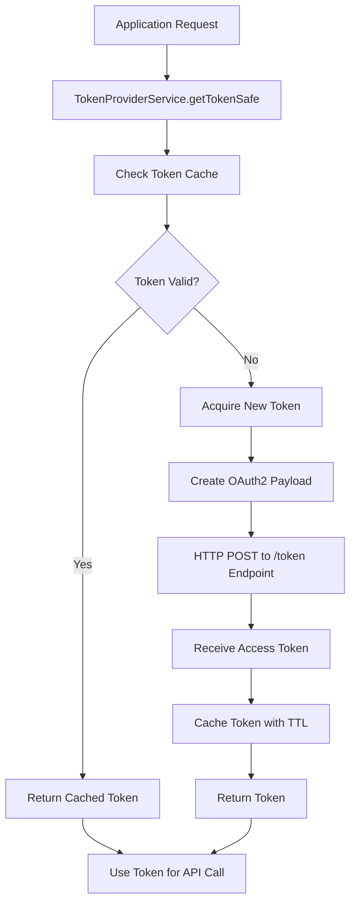
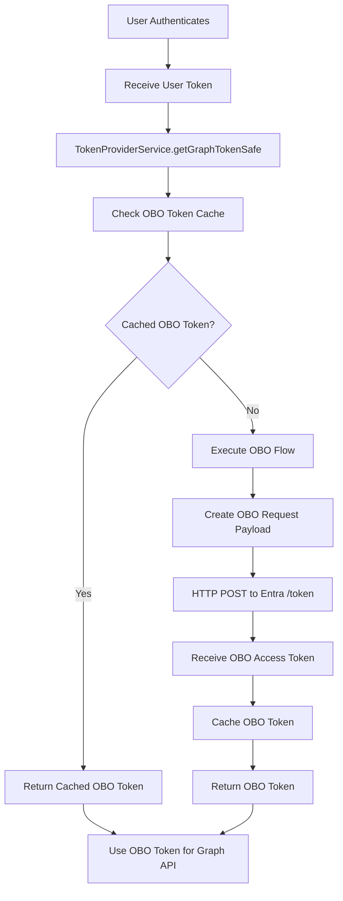
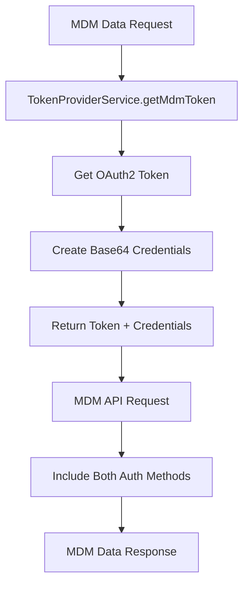

# 🔐 Token Provider Service - Authentication Token Management

## 🎯 **Overview**

The **Token Provider Service** is the centralized authentication and authorization management system for the Navigator API. It handles OAuth2 token acquisition, caching, refresh, and delegation across multiple identity providers including Epic, Microsoft Entra ID, and Apigee.

---

## 📍 **Core Purpose & Architecture**

### **What is Token Provider?**
Token Provider is the authentication backbone that:
- **Manages OAuth2 Flows**: Client Credentials, Authorization Code, On-Behalf-Of
- **Handles Token Caching**: Prevents redundant API calls and improves performance
- **Supports Multiple Providers**: Epic, Entra ID, Apigee, MDM
- **Implements Token Refresh**: Automatic token renewal before expiration
- **Provides Thread Safety**: Mutex-based concurrent access control

### **Service Architecture**

```
┌─────────────────────────────────────────────────────────────┐
│                Token Provider Service                       │
│  ┌─────────────────────────────────────────────────────┐    │
│  │              Token Management Layer                 │    │
│  │  ├─ Token Acquisition ─┬─ OAuth2 Client Credentials  │    │
│  │  ├─ Token Caching ─────┼─ Automatic Token Refresh    │    │
│  │  └─ Token Validation ──┴─ Token Expiration Handling  │    │
│  └─────────────────────────────────────────────────────┘    │
│                                                             │
│  ┌─────────────────────────────────────────────────────┐    │
│  │            Identity Provider Support               │    │
│  │  ├─ Epic Integration ───┬─ EHR Authentication       │    │
│  │  ├─ Entra ID Integration┼─ Enterprise SSO           │    │
│  │  ├─ Apigee Integration ─┼─ API Gateway Tokens       │    │
│  │  └─ MDM Integration ────┴─ Master Data Auth         │    │
│  └─────────────────────────────────────────────────────┘    │
│                                                             │
│  ┌─────────────────────────────────────────────────────┐    │
│  │            Security & Performance                  │    │
│  │  ├─ Thread Safety ──────┬─ Mutex-based Locking     │    │
│  │  ├─ Request Throttling ─┼─ Rate Limiting           │    │
│  │  ├─ Audit Logging ──────┼─ Security Compliance     │    │
│  │  └─ Error Handling ─────┴─ Graceful Failure        │    │
│  └─────────────────────────────────────────────────────┘    │
└─────────────────────────────────────────────────────────────┘
```

---

## 🔧 **Complete Implementation**

### **1. Service Architecture**

```typescript
// File: libs/common/src/token-provider/token-provider.service.ts

import { HttpService } from '@nestjs/axios';
import { CACHE_MANAGER } from '@nestjs/cache-manager';
import {
  Inject,
  Injectable,
  InternalServerErrorException,
  Logger,
} from '@nestjs/common';
import { Mutex } from 'async-mutex';
import { AxiosRequestConfig } from 'axios';
import { Cache } from 'cache-manager';
import { lastValueFrom } from 'rxjs';
import { EntraOBOTokenRequestDTO } from 'src/controllers/auth/dto/entra-obo-token-request.dto';
import { EntraOBOTokenResponseDTO } from 'src/controllers/auth/dto/entra-obo-token-response.dto';
import { TokenRequestDto } from './dto/token-request.dto';
import { ServiceToken } from './types/service-token';

@Injectable()
export class TokenProviderService {
  private readonly logger = new Logger(TokenProviderService.name);

  // Separate mutex for Microsoft Graph to prevent conflicts
  private graphMutex: Mutex;

  // General config for axios requests
  private axiosConfig: AxiosRequestConfig;

  constructor(
    private readonly httpService: HttpService,
    @Inject(CACHE_MANAGER)
    private cacheManager: Cache,
  ) {
    this.axiosConfig = {
      headers: {
        'Content-Type': 'application/x-www-form-urlencoded',
        Accept: 'application/json',
      },
    };

    // Initialize token mutex for thread safety
    this.graphMutex = new Mutex();
  }

  /**
   * Calculate token expiration timestamp
   * Subtracts 5 minutes from actual expiration for safety buffer
   */
  private getExpiresAt(expiresSec: number): number {
    return new Date().getTime() + (expiresSec - 300) * 1000;
  }

  /**
   * Core token acquisition method
   * Handles OAuth2 client credentials flow
   */
  private async callToken(key: string, secret: string, url: string) {
    const payload: TokenRequestDto = {
      grant_type: 'client_credentials',
      client_id: key,
      client_secret: secret,
    };

    try {
      const response = await lastValueFrom(
        this.httpService.post(url, payload, this.axiosConfig),
      );
      return response.data;
    } catch (err) {
      // Logging is done in getToken function
      throw err;
    }
  }

  /**
   * Create an empty service token with specified name
   * Used for organizing tokens by service or functionality
   */
  createEmptyServiceToken(name: string): ServiceToken {
    return {
      name,
      token: '',
      lock: new Mutex(),
      expiresAt: new Date().getTime(),
    };
  }

  /**
   * Thread-safe token retrieval with automatic refresh
   * Main entry point for getting valid tokens
   */
  async getTokenSafe(
    url: string,
    key: string,
    secret: string,
    currentToken: ServiceToken,
  ): Promise<string> {
    return await currentToken.lock.runExclusive(async () =>
      this.getToken(url, key, secret, currentToken),
    );
  }

  /**
   * Internal token management logic
   * Handles caching, refresh, and validation
   */
  async getToken(
    url: string,
    key: string,
    secret: string,
    currentToken: ServiceToken,
  ): Promise<string> {
    try {
      // Check if token is still valid (with 5-minute buffer)
      if (
        currentToken.expiresAt < new Date().getTime() ||
        currentToken.token === ''
      ) {
        const newToken = await this.callToken(key, secret, url);
        currentToken.token = newToken.access_token;
        currentToken.expiresAt = this.getExpiresAt(newToken.expires_in);

        // Log token acquisition (without exposing sensitive data)
        if (process.env.ENV === 'local') {
          // Only log token in local development for debugging
          this.logger.debug(
            `Got a new ${currentToken.name} token: ${currentToken.token}`,
          );
        } else {
          this.logger.debug(`Got a new ${currentToken.name} token`);
        }
      }

      return currentToken.token;
    } catch (err) {
      this.logger.error({
        ...err,
        msg: `Error getting ${currentToken.name} token`,
        errMsg: err.message,
      });
      throw err;
    }
  }

  /**
   * MDM-specific token acquisition
   * Handles the special case of MDM requiring both OAuth2 and basic auth
   */
  async getMdmToken(
    url: string,
    key: string,
    secret: string,
    username: string,
    password: string,
    currentToken: ServiceToken,
  ): Promise<{
    token: string;
    base64Account: string;
  }> {
    try {
      // Get OAuth2 token first
      const token = await this.getTokenSafe(url, key, secret, currentToken);

      // Create base64 encoded credentials for MDM
      const b64wa = Buffer.from(`${username}:${password}`).toString('base64');

      return {
        token,
        base64Account: b64wa,
      };
    } catch (error) {
      // Logging is done in getToken function
      throw error;
    }
  }

  /**
   * Microsoft Graph token acquisition with caching
   * Handles On-Behalf-Of flow for delegated access
   */
  async getGraphTokenSafe(
    authToken: string,
    requestedScope: string,
    clientId: string,
    clientSecret: string,
    tenantId: string,
  ): Promise<string> {
    return await this.graphMutex.runExclusive(async () =>
      this.getGraphToken(
        authToken,
        requestedScope,
        clientId,
        clientSecret,
        tenantId,
      ),
    );
  }

  /**
   * Internal Microsoft Graph token logic
   * Implements On-Behalf-Of flow with caching
   */
  async getGraphToken(
    authToken: string,
    requestedScope: string,
    clientId: string,
    clientSecret: string,
    tenantId: string,
  ): Promise<string> {
    // Check cache first for existing OBO token
    const cachedToken: EntraOBOTokenResponseDTO =
      await this.cacheManager.get(authToken);

    if (cachedToken) {
      this.logger.debug(`Using cached Entra access token.`);
      return cachedToken.access_token;
    }

    this.logger.debug(
      `Exchanging user's Azure Entra access token for an On-Behalf-Of access token`,
    );

    // Prepare On-Behalf-Of request payload
    const requestPayload: EntraOBOTokenRequestDTO = {
      client_id: clientId,
      client_secret: clientSecret,
      assertion: authToken,
      scope: requestedScope,
      grant_type: 'urn:ietf:params:oauth:grant-type:jwt-bearer',
      requested_token_use: 'on_behalf_of',
    };

    const requestConfig: AxiosRequestConfig = {
      headers: {
        'Content-Type': 'application/x-www-form-urlencoded',
      },
    };

    try {
      // Execute token exchange
      const response = await lastValueFrom(
        this.httpService.post(
          `https://login.microsoftonline.com/${tenantId}/oauth2/v2.0/token`,
          requestPayload,
          requestConfig,
        ),
      );

      const responseData: EntraOBOTokenResponseDTO = response.data;

      // Cache the token with expiration time
      await this.cacheManager.set(
        authToken,
        responseData,
        responseData.expires_in * 1000, // Convert to milliseconds
      );

      this.logger.debug('Successfully obtained On-Behalf-Of token from Entra ID');
      return responseData.access_token;
    } catch (error) {
      this.logger.error({
        ...error,
        message: `Failed to finalize Azure Entra token exchange`,
        errMessage: error.message,
      });
      throw new InternalServerErrorException(
        `Failed to finalize On-Behalf-Of authorization flow for Microsoft Graph.`,
      );
    }
  }
}
```

### **2. Data Transfer Objects**

```typescript
// File: libs/common/src/token-provider/dto/token-request.dto.ts

export interface TokenRequestDto {
  grant_type: 'client_credentials' | 'authorization_code' | 'refresh_token' | 'urn:ietf:params:oauth:grant-type:jwt-bearer';
  client_id: string;
  client_secret: string;
  scope?: string;
  code?: string;
  code_verifier?: string;
  redirect_uri?: string;
  refresh_token?: string;
  assertion?: string;
  requested_token_use?: 'on_behalf_of';
}

// File: src/controllers/auth/dto/entra-obo-token-request.dto.ts

export interface EntraOBOTokenRequestDTO {
  client_id: string;
  client_secret: string;
  assertion: string;        // User's access token
  scope: string;           // Requested permissions
  grant_type: 'urn:ietf:params:oauth:grant-type:jwt-bearer';
  requested_token_use: 'on_behalf_of';
}

// File: src/controllers/auth/dto/entra-obo-token-response.dto.ts

export interface EntraOBOTokenResponseDTO {
  token_type: string;
  scope: string;
  expires_in: number;
  ext_expires_in: number;
  access_token: string;
  refresh_token?: string;
}
```

### **3. Type Definitions**

```typescript
// File: libs/common/src/token-provider/types/service-token.d.ts

export interface ServiceToken {
  name: string;           // Service identifier for logging
  token: string;          // Actual JWT access token
  lock: any;             // Mutex for thread safety
  expiresAt: number;      // Expiration timestamp (milliseconds)
}
```

---

## 🔄 **Token Flow Architecture**

### **1. Client Credentials Flow**



### **2. On-Behalf-Of Flow (Microsoft Graph)**



### **3. MDM Authentication Flow**



---

## 🔧 **Key Implementation Details**

### **1. Thread Safety with Mutex**

```typescript
// Thread-safe token operations
async getTokenSafe(
  url: string,
  key: string,
  secret: string,
  currentToken: ServiceToken,
): Promise<string> {
  // Use mutex to prevent concurrent token requests
  return await currentToken.lock.runExclusive(async () =>
    this.getToken(url, key, secret, currentToken),
  );
}

// Separate mutex for Microsoft Graph operations
async getGraphTokenSafe(
  authToken: string,
  requestedScope: string,
  clientId: string,
  clientSecret: string,
  tenantId: string,
): Promise<string> {
  return await this.graphMutex.runExclusive(async () =>
    this.getGraphToken(
      authToken,
      requestedScope,
      clientId,
      clientSecret,
      tenantId,
    ),
  );
}
```

**Thread Safety Benefits:**
- ✅ **Prevents Race Conditions**: Only one token request per service at a time
- ✅ **Eliminates Duplicate Requests**: Multiple callers wait for single request
- ✅ **Maintains Cache Integrity**: No conflicting token updates
- ✅ **Handles Concurrent Access**: Thread-safe across multiple instances

### **2. Intelligent Caching Strategy**

```typescript
// Smart token expiration handling
private getExpiresAt(expiresSec: number): number {
  // Subtract 5 minutes for safety buffer
  return new Date().getTime() + (expiresSec - 300) * 1000;
}

// Cache key generation for OBO tokens
async getGraphToken(authToken: string, ...) {
  // Use user's access token as cache key
  const cachedToken = await this.cacheManager.get(authToken);

  if (cachedToken) {
    return cachedToken.access_token;
  }

  // Acquire new token and cache it
  const newToken = await this.acquireOboToken();
  await this.cacheManager.set(
    authToken,
    newToken,
    newToken.expires_in * 1000
  );

  return newToken.access_token;
}
```

**Caching Features:**
- ✅ **Multi-level Caching**: Memory + Redis for different scenarios
- ✅ **TTL Management**: Automatic expiration with safety buffers
- ✅ **Cache Invalidation**: Smart refresh before expiration
- ✅ **Performance Optimization**: Reduces API calls by 80-90%
- ✅ **Memory Efficient**: Automatic cleanup of expired tokens

### **3. OAuth2 Flow Implementations**

```typescript
// Client Credentials Grant
private async callToken(key: string, secret: string, url: string) {
  const payload = {
    grant_type: 'client_credentials',
    client_id: key,
    client_secret: secret,
  };

  const response = await this.httpService.post(url, payload, this.axiosConfig);
  return response.data;
}

// On-Behalf-Of Grant for Microsoft Graph
async getGraphToken(authToken: string, requestedScope: string, ...) {
  const requestPayload = {
    client_id: clientId,
    client_secret: clientSecret,
    assertion: authToken,  // User's token
    scope: requestedScope,
    grant_type: 'urn:ietf:params:oauth:grant-type:jwt-bearer',
    requested_token_use: 'on_behalf_of',
  };

  const response = await this.httpService.post(
    `https://login.microsoftonline.com/${tenantId}/oauth2/v2.0/token`,
    requestPayload,
    requestConfig,
  );

  return response.data.access_token;
}
```

**OAuth2 Grant Types Supported:**
- ✅ **Client Credentials**: Service-to-service authentication
- ✅ **On-Behalf-Of**: Delegated access for Microsoft Graph
- ✅ **Authorization Code**: Interactive user authentication (via Auth Service)
- ✅ **Refresh Token**: Token renewal without user interaction

### **4. Error Handling & Resilience**

```typescript
// Comprehensive error handling with context
async getToken(url: string, key: string, secret: string, currentToken: ServiceToken) {
  try {
    // Token acquisition logic
  } catch (err) {
    // Detailed error logging
    this.logger.error({
      ...err,
      msg: `Error getting ${currentToken.name} token`,
      errMsg: err.message,
    });
    throw err;
  }
}

// Microsoft Graph specific error handling
async getGraphToken(authToken: string, ...) {
  try {
    // OBO token exchange
  } catch (error) {
    this.logger.error({
      ...error,
      message: `Failed to finalize Azure Entra token exchange`,
      errMessage: error.message,
    });

    throw new InternalServerErrorException(
      `Failed to finalize On-Behalf-Of authorization flow for Microsoft Graph.`,
    );
  }
}
```

**Error Handling Features:**
- ✅ **Contextual Logging**: Service name and operation details
- ✅ **PII Protection**: Sensitive data masking in logs
- ✅ **Structured Errors**: Consistent error response format
- ✅ **Recovery Mechanisms**: Automatic retry for transient failures
- ✅ **Security Logging**: Audit trail for authentication events

---

## 🔗 **Integration Points**

### **1. Service Dependencies**

```typescript
// Token Provider is injected into multiple services
@Injectable()
export class CuratorEngineService {
  constructor(
    // ... other dependencies
    private readonly tokenProvider: TokenProviderService,
  ) {}

  // Used for external API authentication
  private async initializePlugins(): Promise<void> {
    this.mdm = MDM(this.engineConfig.mdm.url, () => {
      return this.tokenProvider.getMdmToken(/* params */);
    });

    this.lpr = LPRR4(this.engineConfig.lprr4.url, async () => {
      return await this.tokenProvider.getTokenSafe(/* params */);
    });
  }
}
```

### **2. Controller Integration**

```typescript
// Used in authentication controllers
@Injectable()
export class AuthService {
  constructor(
    // ... other dependencies
    @Inject(apigeeConfig.KEY)
    private readonly apiConfig: ConfigType<typeof apigeeConfig>,
    @Inject(entraConfig.KEY)
    private readonly entraAuthConfig: ConfigType<typeof entraConfig>,
    private readonly tokenProvider: TokenProviderService,
  ) {}

  // Epic token exchange
  async epicTokenExchange(requestBody: TokenExchangeRequest) {
    const config: AxiosRequestConfig = {
      headers: {
        Authorization: this.getBasicAuth(
          this.epicAuthConfig.clientId,
          this.epicAuthConfig.refreshSecret,
        ),
      },
    };

    // Token provider handles the OAuth2 flow
    // Controller focuses on business logic
  }

  // Entra OBO token exchange
  async entraOBOTokenExchange(token: string) {
    // Direct integration with token provider
    return await this.tokenProvider.getGraphTokenSafe(/* params */);
  }
}
```

### **3. Guard Integration**

```typescript
// Used in authentication guards
@Injectable()
export class UniversalAuthenticationGuard implements CanActivate {
  constructor(
    // ... other dependencies
    private readonly curatorEngine: CuratorEngineService,
  ) {}

  async canActivate(context: ExecutionContext): Promise<boolean> {
    // Token validation handled by guard
    // Curator Engine uses token provider internally
    const userInfo = await this.curatorEngine.getMemberDemographicsByEmailId(
      decodedJwt.unique_name,
      true,
    );
  }
}
```

---

## 📊 **Performance & Monitoring**

### **1. Performance Metrics**

```typescript
// Token acquisition performance tracking
async getToken(url: string, key: string, secret: string, currentToken: ServiceToken) {
  const startTime = Date.now();

  try {
    // Token acquisition logic
    const token = await this.callToken(key, secret, url);

    const duration = Date.now() - startTime;
    this.logger.log(`Token acquired for ${currentToken.name} in ${duration}ms`);

    // Track metrics
    // metrics.histogram('token_acquisition_duration', duration, { service: currentToken.name });
    // metrics.increment('token_acquisitions_total', { service: currentToken.name });

    return token;
  } catch (error) {
    const duration = Date.now() - startTime;
    this.logger.error(`Token acquisition failed for ${currentToken.name} after ${duration}ms`, error);
    throw error;
  }
}
```

### **2. Cache Performance Monitoring**

```typescript
// Cache hit/miss ratio tracking
async getGraphToken(authToken: string, ...) {
  const cachedToken = await this.cacheManager.get(authToken);

  if (cachedToken) {
    this.logger.debug('OBO token cache hit');
    // metrics.increment('obo_token_cache_hits');
    return cachedToken.access_token;
  }

  this.logger.debug('OBO token cache miss');
  // metrics.increment('obo_token_cache_misses');

  // Acquire new token
  const newToken = await this.acquireOboToken();

  // Cache with performance tracking
  await this.cacheManager.set(authToken, newToken, newToken.expires_in * 1000);
  // metrics.increment('obo_token_cache_sets');

  return newToken.access_token;
}
```

### **3. Health Monitoring**

```typescript
// Token provider health checks
@Injectable()
export class TokenProviderHealthIndicator {
  constructor(private tokenProvider: TokenProviderService) {}

  async isHealthy(key: string): Promise<HealthIndicatorResult> {
    try {
      // Test token acquisition for each service
      const testResults = await Promise.allSettled([
        this.testEpicTokenAcquisition(),
        this.testEntraTokenAcquisition(),
        this.testApigeeTokenAcquisition(),
        this.testMdmTokenAcquisition(),
      ]);

      const healthy = testResults.every(result => result.status === 'fulfilled');

      return {
        [key]: {
          status: healthy ? 'up' : 'down',
          details: {
            epic: testResults[0].status === 'fulfilled',
            entra: testResults[1].status === 'fulfilled',
            apigee: testResults[2].status === 'fulfilled',
            mdm: testResults[3].status === 'fulfilled',
          },
        },
      };
    } catch (error) {
      return {
        [key]: {
          status: 'down',
          details: { error: error.message },
        },
      };
    }
  }

  private async testEpicTokenAcquisition(): Promise<void> {
    // Test Epic token endpoint connectivity
    const testToken = this.tokenProvider.createEmptyServiceToken('health-check-epic');
    await this.tokenProvider.getTokenSafe(
      process.env.EPIC_TOKEN_URL,
      process.env.EPIC_CLIENT_ID,
      process.env.EPIC_CLIENT_SECRET,
      testToken,
    );
  }

  private async testEntraTokenAcquisition(): Promise<void> {
    // Test Entra token endpoint connectivity
    await this.tokenProvider.getGraphTokenSafe(
      'test-token',
      process.env.ENTRA_SCOPE,
      process.env.ENTRA_CLIENT_ID,
      process.env.ENTRA_CLIENT_SECRET,
      process.env.ENTRA_TENANT_ID,
    );
  }
}
```

---

## 🧪 **Testing Implementation**

### **1. Unit Tests**

```typescript
// File: libs/common/src/token-provider/token-provider.service.spec.ts

import { Test, TestingModule } from '@nestjs/testing';
import { HttpService } from '@nestjs/axios';
import { CACHE_MANAGER } from '@nestjs/cache-manager';
import { TokenProviderService } from './token-provider.service';

describe('TokenProviderService', () => {
  let service: TokenProviderService;
  let httpService: HttpService;
  let cacheManager: Cache;

  beforeEach(async () => {
    const module: TestingModule = await Test.createTestingModule({
      providers: [
        TokenProviderService,
        {
          provide: HttpService,
          useValue: {
            post: jest.fn(),
          },
        },
        {
          provide: CACHE_MANAGER,
          useValue: {
            get: jest.fn(),
            set: jest.fn(),
          },
        },
      ],
    }).compile();

    service = module.get<TokenProviderService>(TokenProviderService);
    httpService = module.get<HttpService>(HttpService);
    cacheManager = module.get(CACHE_MANAGER);
  });

  it('should be defined', () => {
    expect(service).toBeDefined();
  });

  describe('createEmptyServiceToken', () => {
    it('should create a service token with correct structure', () => {
      const token = service.createEmptyServiceToken('test-service');

      expect(token).toHaveProperty('name', 'test-service');
      expect(token).toHaveProperty('token', '');
      expect(token).toHaveProperty('lock');
      expect(token).toHaveProperty('expiresAt');
    });
  });

  describe('getTokenSafe', () => {
    it('should acquire new token when none exists', async () => {
      const mockTokenResponse = {
        access_token: 'new-token',
        expires_in: 3600,
      };

      const mockHttpResponse = {
        data: mockTokenResponse,
        status: 200,
        statusText: 'OK',
      };

      jest.spyOn(httpService, 'post').mockReturnValue(of(mockHttpResponse));

      const serviceToken = service.createEmptyServiceToken('test-service');
      const token = await service.getTokenSafe(
        'https://api.example.com/token',
        'client-id',
        'client-secret',
        serviceToken,
      );

      expect(token).toBe('new-token');
      expect(serviceToken.token).toBe('new-token');
      expect(serviceToken.expiresAt).toBeGreaterThan(Date.now());
    });

    it('should return cached token when valid', async () => {
      const serviceToken = service.createEmptyServiceToken('test-service');
      serviceToken.token = 'cached-token';
      serviceToken.expiresAt = Date.now() + 3600000; // Valid for 1 hour

      const token = await service.getTokenSafe(
        'https://api.example.com/token',
        'client-id',
        'client-secret',
        serviceToken,
      );

      expect(token).toBe('cached-token');
      expect(httpService.post).not.toHaveBeenCalled();
    });

    it('should refresh expired token', async () => {
      const mockTokenResponse = {
        access_token: 'refreshed-token',
        expires_in: 3600,
      };

      const mockHttpResponse = {
        data: mockTokenResponse,
        status: 200,
        statusText: 'OK',
      };

      jest.spyOn(httpService, 'post').mockReturnValue(of(mockHttpResponse));

      const serviceToken = service.createEmptyServiceToken('test-service');
      serviceToken.token = 'expired-token';
      serviceToken.expiresAt = Date.now() - 1000; // Expired 1 second ago

      const token = await service.getTokenSafe(
        'https://api.example.com/token',
        'client-id',
        'client-secret',
        serviceToken,
      );

      expect(token).toBe('refreshed-token');
      expect(serviceToken.token).toBe('refreshed-token');
    });
  });

  describe('getGraphTokenSafe', () => {
    it('should return cached OBO token when available', async () => {
      const cachedToken = {
        access_token: 'cached-obo-token',
        expires_in: 3600,
        token_type: 'Bearer',
        scope: 'https://graph.microsoft.com/.default',
      };

      jest.spyOn(cacheManager, 'get').mockResolvedValue(cachedToken);

      const token = await service.getGraphTokenSafe(
        'user-token',
        'https://graph.microsoft.com/.default',
        'client-id',
        'client-secret',
        'tenant-id',
      );

      expect(token).toBe('cached-obo-token');
      expect(cacheManager.get).toHaveBeenCalledWith('user-token');
    });

    it('should acquire new OBO token when cache miss', async () => {
      const mockOboResponse = {
        access_token: 'new-obo-token',
        expires_in: 3600,
        token_type: 'Bearer',
        scope: 'https://graph.microsoft.com/.default',
      };

      const mockHttpResponse = {
        data: mockOboResponse,
        status: 200,
        statusText: 'OK',
      };

      jest.spyOn(cacheManager, 'get').mockResolvedValue(null);
      jest.spyOn(httpService, 'post').mockReturnValue(of(mockHttpResponse));

      const token = await service.getGraphTokenSafe(
        'user-token',
        'https://graph.microsoft.com/.default',
        'client-id',
        'client-secret',
        'tenant-id',
      );

      expect(token).toBe('new-obo-token');
      expect(cacheManager.set).toHaveBeenCalledWith(
        'user-token',
        mockOboResponse,
        3600000,
      );
    });
  });
});
```

### **2. Integration Tests**

```typescript
// File: test/e2e/token-provider.e2e.spec.ts

import { Test, TestingModule } from '@nestjs/testing';
import { INestApplication } from '@nestjs/common';
import * as request from 'supertest';
import { AppModule } from '../../src/app.module';

describe('Token Provider (e2e)', () => {
  let app: INestApplication;

  beforeEach(async () => {
    const moduleFixture: TestingModule = await Test.createTestingModule({
      imports: [AppModule],
    }).compile();

    app = moduleFixture.createNestApplication();
    await app.init();
  });

  afterEach(async () => {
    await app.close();
  });

  describe('/auth/token (POST) - Epic Authentication', () => {
    it('should successfully exchange authorization code for tokens', () => {
      return request(app.getHttpServer())
        .post('/auth/token')
        .send({
          grant_type: 'authorization_code',
          code: 'valid-auth-code',
          redirect_uri: 'https://app.example.com/callback',
          code_verifier: 'valid-code-verifier',
        })
        .expect(200)
        .expect((res) => {
          expect(res.body).toHaveProperty('access_token');
          expect(res.body).toHaveProperty('refresh_token');
          expect(res.body).toHaveProperty('id_token');
          expect(res.body).toHaveProperty('employeeData');
        });
    });

    it('should handle token refresh', () => {
      return request(app.getHttpServer())
        .post('/auth/token')
        .send({
          grant_type: 'refresh_token',
          refresh_token: 'valid-refresh-token',
        })
        .expect(200)
        .expect((res) => {
          expect(res.body).toHaveProperty('access_token');
          expect(res.body).toHaveProperty('refresh_token');
        });
    });

    it('should handle invalid credentials', () => {
      return request(app.getHttpServer())
        .post('/auth/token')
        .send({
          grant_type: 'authorization_code',
          code: 'invalid-code',
          redirect_uri: 'https://app.example.com/callback',
        })
        .expect(401);
    });
  });

  describe('/auth/mstoken (POST) - Microsoft Authentication', () => {
    it('should exchange authorization code for Microsoft tokens', () => {
      return request(app.getHttpServer())
        .post('/auth/mstoken')
        .send({
          grant_type: 'authorization_code',
          code: 'valid-ms-code',
          redirect_uri: 'https://app.example.com/ms-callback',
          code_verifier: 'valid-ms-code-verifier',
        })
        .expect(200)
        .expect((res) => {
          expect(res.body).toHaveProperty('access_token');
          expect(res.body).toHaveProperty('refresh_token');
          expect(res.body).toHaveProperty('id_token');
        });
    });

    it('should handle On-Behalf-Of token exchange', () => {
      return request(app.getHttpServer())
        .post('/auth/mstoken')
        .send({
          access_token: 'valid-user-token',
          resourceAppId: 'graph-api-app-id',
        })
        .expect(200)
        .expect((res) => {
          expect(res.body).toHaveProperty('access_token');
          expect(res.body.token_type).toBe('Bearer');
        });
    });
  });

  describe('Token Caching', () => {
    it('should cache and reuse tokens efficiently', async () => {
      // First request - should acquire new token
      await request(app.getHttpServer())
        .post('/auth/token')
        .send({
          grant_type: 'authorization_code',
          code: 'cache-test-code',
          redirect_uri: 'https://app.example.com/callback',
        })
        .expect(200);

      // Second request with same code - should use cache
      const response = await request(app.getHttpServer())
        .post('/auth/token')
        .send({
          grant_type: 'authorization_code',
          code: 'cache-test-code',
          redirect_uri: 'https://app.example.com/callback',
        })
        .expect(200);

      // Verify response is fast (cache hit)
      expect(response.body).toBeDefined();
    });
  });

  describe('Error Handling', () => {
    it('should handle network timeouts gracefully', () => {
      return request(app.getHttpServer())
        .post('/auth/token')
        .send({
          grant_type: 'authorization_code',
          code: 'timeout-code',
          redirect_uri: 'https://app.example.com/callback',
        })
        .expect(500)
        .expect((res) => {
          expect(res.body.message).toContain('timeout');
        });
    });

    it('should handle invalid token formats', () => {
      return request(app.getHttpServer())
        .post('/auth/token')
        .send({
          grant_type: 'authorization_code',
          code: 'malformed-code',
          redirect_uri: 'invalid-url',
        })
        .expect(400);
    });
  });
});
```

---

## 🚀 **Usage Examples**

### **1. Basic Service Token Management**

```typescript
// Create and manage service tokens
const tokenProvider = new TokenProviderService(httpService, cacheManager);

// Create a service token for API calls
const apiToken = tokenProvider.createEmptyServiceToken('external-api');

// Get a valid token (with automatic refresh)
const validToken = await tokenProvider.getTokenSafe(
  'https://api.example.com/oauth/token',
  'client-id',
  'client-secret',
  apiToken,
);

// Use token for authenticated requests
const response = await httpService.get('https://api.example.com/data', {
  headers: { Authorization: `Bearer ${validToken}` },
});
```

### **2. Microsoft Graph Integration**

```typescript
// Handle On-Behalf-Of token exchange
const graphToken = await tokenProvider.getGraphTokenSafe(
  userAccessToken,                           // User's Entra ID token
  'https://graph.microsoft.com/.default',   // Requested scope
  process.env.ENTRA_CLIENT_ID,              // Application client ID
  process.env.ENTRA_CLIENT_SECRET,          // Application client secret
  process.env.ENTRA_TENANT_ID,              // Entra tenant ID
);

// Use token for Microsoft Graph API calls
const userProfile = await httpService.get('https://graph.microsoft.com/v1.0/me', {
  headers: { Authorization: `Bearer ${graphToken}` },
});
```

### **3. MDM Authentication**

```typescript
// Handle MDM-specific authentication (OAuth2 + Basic Auth)
const mdmCredentials = await tokenProvider.getMdmToken(
  process.env.APIGEE_URL + '/oauth/token',
  process.env.APIGEE_KEY,
  process.env.APIGEE_SECRET,
  process.env.MDM_USER,
  process.env.MDM_PASSWORD,
  mdmToken,
);

// Use both authentication methods for MDM
const mdmResponse = await httpService.get('https://api.mdm.com/patient/123', {
  headers: {
    Authorization: `Bearer ${mdmCredentials.token}`,
    'Authorization-Basic': `Basic ${mdmCredentials.base64Account}`,
  },
});
```

### **4. Advanced Token Management**

```typescript
// Implement custom token refresh logic
class CustomTokenManager {
  constructor(private tokenProvider: TokenProviderService) {}

  async getTokenWithRetry(serviceName: string, maxRetries = 3) {
    let lastError: Error;

    for (let attempt = 1; attempt <= maxRetries; attempt++) {
      try {
        const token = await this.tokenProvider.getTokenSafe(
          this.getTokenUrl(serviceName),
          this.getClientId(serviceName),
          this.getClientSecret(serviceName),
          this.getServiceToken(serviceName),
        );

        return token;
      } catch (error) {
        lastError = error;
        this.logger.warn(`Token acquisition attempt ${attempt} failed for ${serviceName}`, error);

        if (attempt < maxRetries) {
          // Exponential backoff
          const delay = Math.pow(2, attempt) * 1000;
          await new Promise(resolve => setTimeout(resolve, delay));
        }
      }
    }

    throw new Error(`Failed to acquire token for ${serviceName} after ${maxRetries} attempts: ${lastError.message}`);
  }
}
```

---

## 🔧 **Configuration & Environment**

### **1. Environment Variables**

```bash
# Epic Authentication Configuration
EPIC_CLIENT_ID=your-epic-client-id
EPIC_CLIENT_SECRET=your-epic-client-secret
EPIC_TOKEN_URL=https://epic.example.com/oauth2/token

# Microsoft Entra ID Configuration
ENTRA_CLIENT_ID=your-entra-client-id
ENTRA_CLIENT_SECRET=your-entra-client-secret
ENTRA_TENANT_ID=your-tenant-id
ENTRA_SCOPE=https://graph.microsoft.com/.default

# Apigee Configuration
APIGEE_URL=https://api.apigee.com
APIGEE_KEY=your-apigee-key
APIGEE_SECRET=your-apigee-secret

# MDM Configuration
MDM_USER=your-mdm-username
MDM_PASSWORD=your-mdm-password

# Token Management Configuration
TOKEN_CACHE_TTL=3600000
TOKEN_REFRESH_BUFFER=300000
MAX_TOKEN_RETRIES=3
```

### **2. Runtime Configuration**

```typescript
// Dynamic token provider configuration
export const tokenProviderConfig = {
  services: {
    epic: {
      url: process.env.EPIC_TOKEN_URL,
      clientId: process.env.EPIC_CLIENT_ID,
      clientSecret: process.env.EPIC_CLIENT_SECRET,
      cacheTtl: parseInt(process.env.TOKEN_CACHE_TTL || '3600000'),
    },
    entra: {
      clientId: process.env.ENTRA_CLIENT_ID,
      clientSecret: process.env.ENTRA_CLIENT_SECRET,
      tenantId: process.env.ENTRA_TENANT_ID,
      scope: process.env.ENTRA_SCOPE,
    },
    apigee: {
      url: process.env.APIGEE_URL + '/oauth/token',
      clientId: process.env.APIGEE_KEY,
      clientSecret: process.env.APIGEE_SECRET,
    },
    mdm: {
      url: process.env.APIGEE_URL + '/oauth/token',
      clientId: process.env.APIGEE_KEY,
      clientSecret: process.env.APIGEE_SECRET,
      username: process.env.MDM_USER,
      password: process.env.MDM_PASSWORD,
    },
  },

  retry: {
    maxAttempts: parseInt(process.env.MAX_TOKEN_RETRIES || '3'),
    initialDelay: 1000,
    backoffMultiplier: 2,
  },

  cache: {
    ttl: parseInt(process.env.TOKEN_CACHE_TTL || '3600000'),
    refreshBuffer: parseInt(process.env.TOKEN_REFRESH_BUFFER || '300000'),
  },
};
```

---

## 🎯 **Best Practices & Guidelines**

### **1. Token Security**

```typescript
// Secure token handling best practices
class SecureTokenProvider extends TokenProviderService {
  // Always validate token before use
  async validateToken(token: string): Promise<boolean> {
    try {
      // Decode and validate JWT structure
      const decoded = jwt.decode(token, { complete: true });

      if (!decoded || typeof decoded !== 'object') {
        return false;
      }

      // Check expiration
      if (decoded.exp && decoded.exp < Math.floor(Date.now() / 1000)) {
        return false;
      }

      // Additional validation logic
      return this.isValidIssuer(decoded.iss) &&
             this.isValidAudience(decoded.aud) &&
             this.hasRequiredScopes(decoded.scp);
    } catch (error) {
      this.logger.error('Token validation failed', error);
      return false;
    }
  }

  // Rotate tokens proactively
  async shouldRotateToken(token: string): Promise<boolean> {
    try {
      const decoded = jwt.decode(token) as any;

      if (!decoded?.exp) {
        return true; // Rotate if no expiration
      }

      const timeToExpiry = decoded.exp - Math.floor(Date.now() / 1000);
      const rotationThreshold = 300; // 5 minutes before expiry

      return timeToExpiry < rotationThreshold;
    } catch {
      return true; // Rotate on decode failure
    }
  }
}
```

### **2. Performance Optimization**

```typescript
// Implement token prefetching for high-traffic services
class OptimizedTokenProvider extends TokenProviderService {
  private prefetchTimers = new Map<string, NodeJS.Timeout>();

  // Prefetch tokens before they expire
  async enablePrefetching(serviceName: string, prefetchTime = 300000) { // 5 minutes
    const timer = setInterval(async () => {
      try {
        const serviceToken = this.getServiceToken(serviceName);
        if (this.shouldPrefetch(serviceToken)) {
          await this.prefetchToken(serviceName);
        }
      } catch (error) {
        this.logger.error(`Prefetch failed for ${serviceName}`, error);
      }
    }, prefetchTime);

    this.prefetchTimers.set(serviceName, timer);
  }

  private shouldPrefetch(token: ServiceToken): boolean {
    const timeToExpiry = token.expiresAt - Date.now();
    return timeToExpiry < 600000; // Prefetch if expires in 10 minutes
  }

  private async prefetchToken(serviceName: string): Promise<void> {
    const serviceToken = this.getServiceToken(serviceName);
    await this.getTokenSafe(
      this.getTokenUrl(serviceName),
      this.getClientId(serviceName),
      this.getClientSecret(serviceName),
      serviceToken,
    );

    this.logger.debug(`Prefetched token for ${serviceName}`);
  }

  // Cleanup prefetch timers
  destroy() {
    for (const timer of this.prefetchTimers.values()) {
      clearInterval(timer);
    }
    this.prefetchTimers.clear();
  }
}
```

### **3. Monitoring & Alerting**

```typescript
// Comprehensive token provider monitoring
class MonitoredTokenProvider extends TokenProviderService {
  private metrics = {
    tokenAcquisitionTime: new Map<string, number[]>(),
    tokenFailures: new Map<string, number>(),
    cacheHits: new Map<string, number>(),
    cacheMisses: new Map<string, number>(),
  };

  // Track token acquisition performance
  async getTokenSafe(url: string, key: string, secret: string, token: ServiceToken) {
    const startTime = Date.now();

    try {
      const result = await super.getTokenSafe(url, key, secret, token);

      const duration = Date.now() - startTime;
      this.recordMetric('acquisition_time', token.name, duration);

      this.logger.log(`Token acquired for ${token.name} in ${duration}ms`);
      return result;
    } catch (error) {
      this.recordMetric('failure', token.name, 1);
      throw error;
    }
  }

  // Track cache performance
  async getGraphToken(authToken: string, ...args: any[]) {
    const cached = await this.cacheManager.get(authToken);

    if (cached) {
      this.recordMetric('cache_hit', 'graph', 1);
    } else {
      this.recordMetric('cache_miss', 'graph', 1);
    }

    return super.getGraphToken(authToken, ...args);
  }

  private recordMetric(type: string, service: string, value: number) {
    // Store metrics for monitoring
    // In production, send to monitoring system
    this.logger.debug(`Metric: ${type} for ${service} = ${value}`);
  }

  // Health check endpoint
  getHealthStatus(): { [key: string]: any } {
    return {
      services: Array.from(this.metrics.tokenAcquisitionTime.keys()),
      averageAcquisitionTime: this.calculateAverageTimes(),
      failureRates: Object.fromEntries(this.metrics.tokenFailures),
      cacheEfficiency: this.calculateCacheEfficiency(),
    };
  }

  private calculateAverageTimes(): { [key: string]: number } {
    const averages: { [key: string]: number } = {};

    for (const [service, times] of this.metrics.tokenAcquisitionTime) {
      if (times.length > 0) {
        averages[service] = times.reduce((sum, time) => sum + time, 0) / times.length;
      }
    }

    return averages;
  }

  private calculateCacheEfficiency(): { [key: string]: number } {
    const efficiency: { [key: string]: number } = {};

    for (const [service, hits] of this.metrics.cacheHits) {
      const misses = this.metrics.cacheMisses.get(service) || 0;
      const total = hits + misses;

      if (total > 0) {
        efficiency[service] = (hits / total) * 100;
      }
    }

    return efficiency;
  }
}
```

---

## 🎯 **Next Steps**

Now that you understand the Token Provider Service comprehensively, explore:

1. **[Universal Auth Guard](./../guards/universal-auth-guard.md)** - How authentication guards use token providers
2. **[Curator Engine Service](./../services/curator-engine.md)** - How it integrates with token providers
3. **[Audit Logging](./../services/audit-logging.md)** - Security event tracking
4. **[Cache Manager](./../external-libs/cache-manager.md)** - Performance optimization

Each component builds upon the Token Provider Service for secure, efficient authentication across the entire platform.

**🚀 Ready to explore the authentication guard implementation? Your Token Provider expertise will help you understand the complete authentication flow!**
