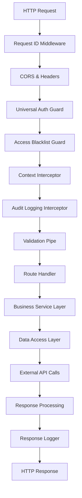
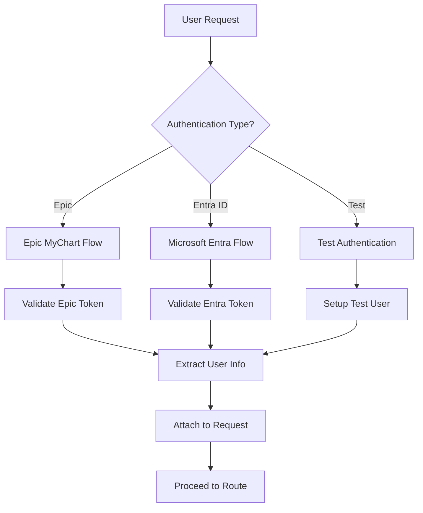
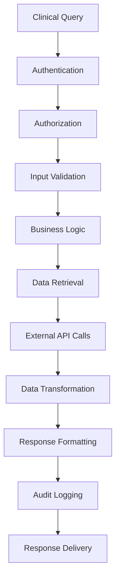

# 🏥 **Navigator API - Complete Healthcare Platform Documentation**

## 🎯 **Project Overview**

The **Navigator API** is a comprehensive healthcare platform developed by Mayo Clinic to support clinical decision-making and patient care coordination. This enterprise-grade system integrates multiple healthcare data sources, provides intelligent clinical insights, and enables seamless communication between healthcare providers.

---

## 📍 **System Architecture**

### **Core Components Overview**

```
┌─────────────────────────────────────────────────────────────────────┐
│                    Navigator API Platform                           │
│  ┌─────────────────────────────────────────────────────────────────┐  │
│  │                Application Layer                               │  │
│  │  ├─ Controllers: HTTP request handlers                        │  │
│  │  ├─ Services: Business logic implementation                   │  │
│  │  ├─ Guards: Authentication & authorization                    │  │
│  │  └─ Interceptors: Request/response processing                 │  │
│  └─────────────────────────────────────────────────────────────────┘  │
│                                                                     │
│  ┌─────────────────────────────────────────────────────────────────┐  │
│  │                Infrastructure Layer                            │  │
│  │  ├─ Database: PostgreSQL with TypeORM                         │  │
│  │  ├─ Cache: Redis for performance optimization                 │  │
│  │  ├─ External APIs: Epic, Curator Engine, Microsoft Graph     │  │
│  │  └─ Message Queue: Asynchronous processing                    │  │
│  └─────────────────────────────────────────────────────────────────┘  │
│                                                                     │
│  ┌─────────────────────────────────────────────────────────────────┐  │
│  │                Security & Compliance                           │  │
│  │  ├─ Authentication: Epic MyChart + Microsoft Entra ID         │  │
│  │  ├─ Authorization: Role-based access control                  │  │
│  │  ├─ Audit Logging: Comprehensive activity tracking            │  │
│  │  └─ HIPAA Compliance: Healthcare data protection              │  │
│  └─────────────────────────────────────────────────────────────────┘  │
└─────────────────────────────────────────────────────────────────────┘
```

---

## 🔧 **Technology Stack**

### **Backend Framework**
- **NestJS**: Node.js framework for scalable server-side applications
- **TypeScript**: Type-safe JavaScript with advanced language features
- **Node.js**: JavaScript runtime environment

### **Database & Storage**
- **PostgreSQL**: Primary relational database
- **Redis**: High-performance caching and session storage
- **TypeORM**: TypeScript ORM for database operations

### **Authentication & Security**
- **Epic MyChart**: Healthcare authentication system
- **Microsoft Entra ID**: Enterprise identity management
- **JWT**: JSON Web Tokens for secure API access
- **OAuth 2.0**: Industry-standard authorization framework

### **External Integrations**
- **Epic EHR**: Electronic Health Record system integration
- **Curator Engine**: Healthcare data aggregation service
- **Microsoft Graph API**: Enterprise communication and collaboration
- **Apigee**: API gateway for external service orchestration

### **AI & Machine Learning**
- **Ask Mayo Expert (AME)**: LLM-powered medical Q&A system
- **Ask Clinical Trials Network (ASKCTN)**: Clinical research AI assistant
- **Curator Engine Inference**: Healthcare data intelligence

### **Development Tools**
- **Docker**: Containerization for consistent deployments
- **Jest**: Testing framework for unit and integration tests
- **Winston**: Advanced logging and monitoring
- **Swagger/OpenAPI**: API documentation and testing

---

## 📚 **Complete Documentation Index**

### **🏗️ Infrastructure & Architecture**
1. **[System Overview](./architecture/system-overview.md)**
   - High-level system architecture
   - Component relationships and data flow
   - Integration patterns and external dependencies

2. **[Infrastructure Components](./infrastructure.md)**
   - Main application bootstrap (`main.ts`)
   - Root application module (`app.module.ts`)
   - Global guards, interceptors, and filters
   - Middleware system and request processing
   - Configuration management and environment setup

3. **[Type System & Migrations](./types-and-migrations.md)**
   - Complete TypeScript type definitions
   - Custom decorators and error classes
   - Database migration system and seeding
   - Express type extensions and utilities

### **🎯 Core Business Logic**
4. **[Authentication System](./controllers/auth.md)**
   - Epic MyChart authentication flow
   - Microsoft Entra ID integration
   - Multi-provider authentication handling
   - Token management and refresh logic

5. **[Clinical Summary](./controllers/clinical-summary.md)**
   - Patient clinical data aggregation
   - Multi-source data integration
   - Clinical narrative generation
   - Structured health information display

6. **[Data Concepts](./controllers/dataconcept.md)**
   - Clinical data concept management
   - Dynamic widget generation
   - Data source integration and mapping
   - Clinical data resolver implementation

7. **[User Preferences](./controllers/preferences.md)**
   - Personalized clinical data views
   - Preference management and storage
   - Dynamic UI configuration
   - User experience customization

### **🤖 AI-Powered Features**
8. **[Ask Mayo Expert (AME)](./controllers/ame.md)**
   - LLM-powered medical Q&A system
   - Natural language processing for clinical queries
   - Citation management and source verification
   - Healthcare knowledge integration

9. **[Ask Clinical Trials Network (ASKCTN)](./controllers/askctn.md)**
   - Clinical research AI assistant
   - Trial eligibility assessment
   - Research protocol information
   - Clinical trial discovery and matching

10. **[Preferred View](./controllers/preferred-view.md)**
    - Intelligent clinical data presentation
    - Specialty-specific view generation
    - Provider preference learning
    - Dynamic content organization

### **💬 Communication & Collaboration**
11. **[Secure Chat](./controllers/securechat.md)**
    - HIPAA-compliant secure messaging
    - Microsoft Teams integration
    - Group chat creation and management
    - File sharing and collaboration tools

12. **[Find An Expert (FAE)](./controllers/fae.md)**
    - Healthcare provider discovery system
    - Specialty-based expert search
    - Availability checking and scheduling
    - Referral coordination and communication

### **📅 Clinical Operations**
13. **[Appointments](./controllers/appointments.md)**
    - Clinical appointment management
    - Administrative scheduling
    - Calendar integration and availability
    - Appointment status tracking

14. **[Break The Glass](./controllers/break-the-glass.md)**
    - Emergency access override system
    - Provider access verification
    - Audit logging for emergency access
    - Compliance and security controls

### **🔧 Supporting Systems**
15. **[Health Monitoring](./controllers/health.md)**
    - System health checks and monitoring
    - Database connectivity verification
    - External service health monitoring
    - Performance metrics and alerting

16. **[Mobile Integration](./controllers/mobile.md)**
    - Mobile application authentication
    - Deep linking and app integration
    - Mobile-specific API endpoints
    - Cross-platform compatibility

### **🛡️ Security & Access Control**
17. **[Access Blacklist](./controllers/access-blacklist.md)**
    - User access restriction system
    - Security incident response
    - Access control and compliance
    - Audit trail maintenance

### **🔗 Service Layer Components**
18. **[Business Services](./business-services.md)**
    - Provider specialty mapping service
    - Specialty-to-role conversion
    - Token provider and caching
    - Audit logging infrastructure

19. **[External Service Integration](./services/curator-engine.md)**
    - Curator Engine API integration
    - Healthcare data aggregation
    - Multi-source data harmonization
    - Clinical data intelligence

---

## 🔄 **Request Processing Flow**

### **1. Complete API Request Lifecycle**



### **2. Authentication Flow**



### **3. Data Processing Flow**



---

## 🎯 **Key Features & Capabilities**

### **🔐 Security & Compliance**
- ✅ **Multi-Factor Authentication**: Epic MyChart + Microsoft Entra ID
- ✅ **HIPAA Compliance**: Healthcare data protection and privacy
- ✅ **Audit Logging**: Comprehensive activity tracking and monitoring
- ✅ **Access Control**: Role-based permissions and restrictions
- ✅ **Data Encryption**: Secure data transmission and storage

### **⚡ Performance & Scalability**
- ✅ **Redis Caching**: High-performance data caching and session management
- ✅ **Database Optimization**: Indexed queries and connection pooling
- ✅ **Asynchronous Processing**: Background job processing and queuing
- ✅ **Load Balancing**: Distributed request handling and scaling
- ✅ **Monitoring**: Real-time performance metrics and alerting

### **🔗 Integration Capabilities**
- ✅ **Epic EHR Integration**: Comprehensive electronic health record access
- ✅ **Microsoft Graph API**: Enterprise communication and collaboration
- ✅ **Curator Engine**: Healthcare data aggregation and intelligence
- ✅ **Apigee Gateway**: API orchestration and external service management
- ✅ **Mobile Applications**: Cross-platform mobile app integration

### **🤖 AI & Machine Learning**
- ✅ **Ask Mayo Expert**: LLM-powered medical knowledge and Q&A
- ✅ **Clinical Trial Intelligence**: AI-assisted research and trial matching
- ✅ **Clinical Decision Support**: Intelligent clinical workflow optimization
- ✅ **Natural Language Processing**: Advanced medical text analysis
- ✅ **Predictive Analytics**: Clinical outcome prediction and risk assessment

### **📊 Data Management**
- ✅ **Multi-Source Integration**: Unified healthcare data from multiple systems
- ✅ **Real-Time Synchronization**: Live data updates and synchronization
- ✅ **Structured Data Storage**: PostgreSQL with advanced querying capabilities
- ✅ **Data Quality Assurance**: Validation and consistency checking
- ✅ **Backup & Recovery**: Comprehensive data protection and disaster recovery

---

## 🚀 **Getting Started**

### **1. Prerequisites**
```bash
# Required software
- Node.js 18+
- PostgreSQL 13+
- Redis 6+
- Docker & Docker Compose
```

### **2. Environment Setup**
```bash
# Clone repository
git clone <repository-url>
cd navigator-api

# Install dependencies
npm install

# Setup environment variables
cp .env.example .env.local
# Edit .env.local with your configuration
```

### **3. Database Setup**
```bash
# Run database migrations
npm run migration:run

# Seed initial data
npm run seed:run
```

### **4. Development Server**
```bash
# Start development server
npm run start:dev

# Server will be available at http://localhost:3000
# Swagger documentation at http://localhost:3000/api
```

### **5. Testing**
```bash
# Run unit tests
npm run test

# Run integration tests
npm run test:e2e

# Run with coverage
npm run test:cov
```

---

## 📋 **Development Workflow**

### **1. Branching Strategy**
```bash
# Feature development
git checkout -b feature/feature-name
# Make changes
git commit -m "Add feature description"
git push origin feature/feature-name

# Pull request process
# Code review → Testing → Merge to main
```

### **2. Code Quality**
```bash
# Linting
npm run lint

# Type checking
npm run type-check

# Formatting
npm run format
```

### **3. Database Changes**
```bash
# Create migration
npm run migration:create -- --name=add-new-feature

# Generate migration from entity changes
npm run migration:generate -- --name=entity-changes
```

---

## 🔧 **Configuration Management**

### **Environment Variables**
```typescript
// .env structure
# Application
ENV=local
NODE_ENV=development
PORT=3000

# Database
DB_HOST=localhost
DB_PORT=5432
DB_USERNAME=navigator
DB_PASSWORD=password
DB_DATABASE=navigator_db

# Authentication
JWT_SECRET=your-jwt-secret
SWAGGER_USER=admin
SWAGGER_PASSWORD=password

# External Services
EPIC_BASE_URL=https://epic-api.example.com
ENTRA_CLIENT_ID=your-entra-client-id
ENTRA_CLIENT_SECRET=your-entra-secret
ENTRA_TENANT_ID=your-tenant-id

# Caching
REDIS_HOST=localhost
REDIS_PORT=6379
REDIS_PASSWORD=your-redis-password
```

### **Configuration Modules**
```typescript
// Configuration hierarchy
1. Environment variables (.env files)
2. Configuration modules (config/*.config.ts)
3. Default values and validation
4. Runtime overrides and feature flags
```

---

## 📊 **Monitoring & Observability**

### **Application Metrics**
- ✅ **Request/Response Metrics**: Latency, throughput, error rates
- ✅ **Database Performance**: Query performance, connection pooling
- ✅ **External API Health**: Service availability and response times
- ✅ **Cache Hit Rates**: Redis performance and effectiveness
- ✅ **Business Metrics**: User engagement and feature usage

### **Logging Strategy**
- ✅ **Structured Logging**: JSON format with consistent fields
- ✅ **Log Levels**: ERROR, WARN, INFO, DEBUG with appropriate filtering
- ✅ **Request Tracing**: Correlation IDs across service calls
- ✅ **Audit Logging**: Security and compliance event tracking
- ✅ **Performance Logging**: Slow query and operation monitoring

### **Health Checks**
- ✅ **Application Health**: Service availability and responsiveness
- ✅ **Database Connectivity**: Connection pool status and query performance
- ✅ **External Dependencies**: API gateway and external service health
- ✅ **Resource Utilization**: Memory, CPU, and disk space monitoring
- ✅ **Business Logic Health**: Critical business process validation

---

## 🔒 **Security Considerations**

### **Authentication & Authorization**
- ✅ **Multi-Provider Authentication**: Epic MyChart and Microsoft Entra ID
- ✅ **Token-Based Security**: JWT with secure signing and validation
- ✅ **Session Management**: Secure session handling with Redis
- ✅ **Access Control**: Role-based permissions and resource restrictions

### **Data Protection**
- ✅ **Encryption**: Data encryption at rest and in transit
- ✅ **Input Validation**: Comprehensive input sanitization and validation
- ✅ **SQL Injection Prevention**: Parameterized queries and ORM protection
- ✅ **XSS Protection**: Content Security Policy and input encoding
- ✅ **CSRF Protection**: Cross-site request forgery prevention

### **Compliance**
- ✅ **HIPAA Compliance**: Healthcare data protection standards
- ✅ **Audit Trails**: Comprehensive activity logging and monitoring
- ✅ **Data Retention**: Configurable data retention policies
- ✅ **Access Logging**: User access tracking and reporting
- ✅ **Incident Response**: Security incident handling procedures

---

## 🚀 **Deployment & Production**

### **Containerization**
```dockerfile
# Dockerfile example
FROM node:18-alpine

WORKDIR /app

COPY package*.json ./
RUN npm ci --only=production

COPY . .

RUN npm run build

EXPOSE 3000

CMD ["npm", "run", "start:prod"]
```

### **Orchestration**
```yaml
# docker-compose.yml
version: '3.8'
services:
  navigator-api:
    build: .
    environment:
      - ENV=production
      - DB_HOST=postgres
      - REDIS_HOST=redis
    depends_on:
      - postgres
      - redis

  postgres:
    image: postgres:13
    environment:
      POSTGRES_DB: navigator_db

  redis:
    image: redis:6-alpine
```

### **CI/CD Pipeline**
```yaml
# .github/workflows/deploy.yml
name: Deploy to Production
on:
  push:
    branches: [main]

jobs:
  deploy:
    runs-on: ubuntu-latest
    steps:
      - uses: actions/checkout@v2
      - name: Setup Node.js
        uses: actions/setup-node@v2
        with:
          node-version: '18'
      - name: Install dependencies
        run: npm ci
      - name: Run tests
        run: npm test
      - name: Build application
        run: npm run build
      - name: Deploy to production
        # Deployment steps
```

---

## 📞 **Support & Resources**

### **Documentation Resources**
- **[API Reference](./api/)**: Complete API documentation with examples
- **[Integration Guides](./integration/)**: External system integration documentation
- **[Troubleshooting](./troubleshooting/)**: Common issues and solutions
- **[Best Practices](./best-practices/)**: Development guidelines and patterns

### **Development Resources**
- **Code Repository**: GitHub repository with source code
- **Issue Tracking**: Bug reports and feature requests
- **Wiki**: Detailed documentation and guides
- **Code Reviews**: Pull request review process and guidelines

### **Production Support**
- **Monitoring Dashboards**: Real-time system monitoring
- **Incident Response**: 24/7 support for production issues
- **Performance Optimization**: System tuning and optimization
- **Security Updates**: Regular security patches and updates

---

## 🎯 **Future Roadmap**

### **Planned Enhancements**
- 🔄 **Microservices Architecture**: Decompose monolithic application
- 🤖 **Advanced AI Integration**: Enhanced machine learning capabilities
- 📱 **Mobile App Enhancements**: Improved mobile user experience
- 🔗 **Additional EHR Integration**: Support for additional healthcare systems
- 📊 **Advanced Analytics**: Enhanced reporting and business intelligence

### **Technology Upgrades**
- 🚀 **Node.js 20**: Latest LTS version with performance improvements
- 🗄️ **PostgreSQL 15**: Latest database features and optimizations
- ⚡ **Redis 7**: Enhanced caching and data structure capabilities
- 🔧 **NestJS 10**: Latest framework features and improvements

### **Feature Development**
- 💬 **Advanced Communication**: Enhanced secure messaging capabilities
- 📅 **Smart Scheduling**: AI-powered appointment optimization
- 🏥 **Telemedicine Integration**: Virtual care platform integration
- 📋 **Clinical Workflows**: Automated clinical process optimization

---

## 🙏 **Contributing**

We welcome contributions to the Navigator API project! Please see our [Contributing Guide](./CONTRIBUTING.md) for detailed information on:

- **Development Setup**: Getting started with local development
- **Code Standards**: Coding conventions and style guidelines
- **Testing**: Writing and running tests
- **Documentation**: Contributing to documentation
- **Pull Requests**: Submitting changes for review

### **Code of Conduct**
Please review our [Code of Conduct](./CODE_OF_CONDUCT.md) to understand our community standards and expectations for all contributors.

---

## 📄 **License**

This project is licensed under the Mayo Clinic Open Source License. See the [LICENSE](./LICENSE) file for complete license terms and conditions.

---

## 📞 **Contact Information**

### **Technical Support**
- **Email**: navigator-support@mayo.edu
- **Slack**: #navigator-api-support
- **Documentation**: [Internal Wiki](https://wiki.mayo.edu/navigator)

### **Security Issues**
- **Email**: security@mayo.edu
- **Emergency**: 1-800-SECURITY
- **Reporting**: [Security Incident Response](./security/)

### **General Inquiries**
- **Project Lead**: Navigator API Development Team
- **Location**: Rochester, MN
- **Department**: Center for Digital Health

---

**🎉 Thank you for exploring the Navigator API! This comprehensive healthcare platform represents the future of clinical decision support and patient care coordination. We hope this documentation helps you understand and contribute to this important healthcare technology initiative.**
