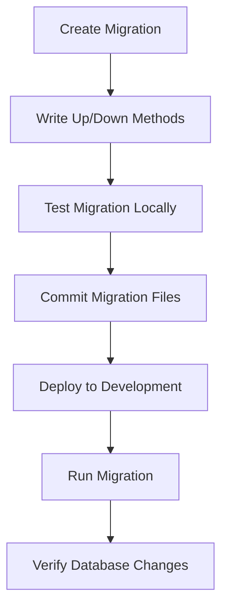
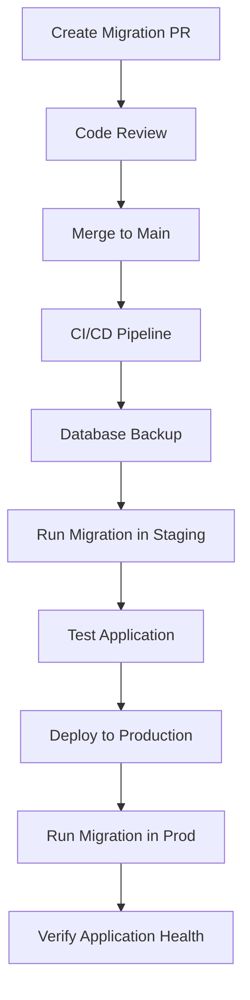
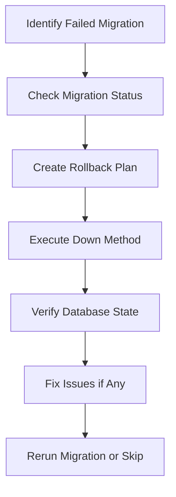

# 📋 **Type System & Migration System - Complete Data Architecture**

## 🎯 **Overview**

The **Type System & Migration System** represents the foundational data architecture of the Navigator API. This comprehensive documentation covers TypeScript type definitions, database migrations, seeding system, custom decorators, error classes, and the complete type safety infrastructure that powers the healthcare platform.

---

## 📍 **Type System Architecture**

### **1. Core Type Definitions**

```typescript
// File: src/types/request-user.d.ts

import { JwtPayload } from 'jsonwebtoken';
import { EntraAuthException } from 'src/errors/entra-auth.exception';

/**
 * Contains information about the request user
 * Extends Express.User for compatibility with Passport.js
 */
export interface RequestUser extends Express.User {
  /**
   * Entra ID (Azure AD) user information
   * Contains Microsoft authentication details
   */
  entraUser?: EntraUserInfo;

  /**
   * Epic EHR user information
   * Contains Epic MyChart/Open.Epic authentication details
   */
  epicUser?: EpicUserInfo;
}

/**
 * Contains information about the Epic EHR user
 */
export interface EpicUserInfo {
  /**
   * Epic user LAN_ID (unique identifier)
   * Used for user identification and access control
   */
  lanId: string;

  /**
   * User access token validation status
   * Indicates if the user's token is currently active
   */
  active: boolean;
}

/**
 * Contains information about the Entra ID (Azure AD) user
 */
export interface EntraUserInfo {
  /**
   * Original user access token payload
   * Contains decoded JWT claims from Azure AD
   */
  userTokenPayload?: JwtPayload;

  /**
   * On-Behalf-Of token for the user
   * Token used for accessing Microsoft Graph API on behalf of the user
   */
  oboToken?: string;

  /**
   * Unique name identifier from Azure AD
   * Typically the user's email address
   */
  unique_name?: string;

  /**
   * Error occurred during token validation or On-Behalf-Of authorization flow
   * Contains authentication failure details
   */
  error?: EntraAuthException;
}
```

**Type Safety Features:**
- ✅ **Interface Extensions**: Extends Express.User for Passport.js compatibility
- ✅ **Multi-Provider Support**: Handles both Epic and Entra ID authentication
- ✅ **JWT Integration**: Supports JSON Web Token payloads
- ✅ **Error Handling**: Integrated error tracking for authentication failures
- ✅ **Type Safety**: Full TypeScript type checking across the application

### **2. Express Type Extensions**

```typescript
// File: src/types/express/index.d.ts

import { RequestUser } from '../request-user';

/**
 * Extended Express Request interface
 * Adds Navigator API specific properties to Express Request
 */
declare global {
  namespace Express {
    /**
     * Extended Request interface with Navigator-specific properties
     */
    interface Request {
      /**
       * User information attached by authentication middleware
       * Contains Epic and/or Entra ID user details
       */
      user?: RequestUser;

      /**
       * Unique request identifier for tracing
       * Generated by RequestIdMiddleware
       */
      requestId?: string;

      /**
       * Request context for sharing data across services
       * Managed by RequestContextService
       */
      context?: RequestContext;

      /**
       * Introspection response from Epic API Gateway
       * Contains token validation results
       */
      introspect?: EpicIntrospectResponse;

      /**
       * Request start timestamp for performance monitoring
       * Set by performance tracking middleware
       */
      startTime?: number;

      /**
       * Correlation ID for distributed tracing
       * Used across microservices for request correlation
       */
      correlationId?: string;

      /**
       * Request metadata for audit logging
       * Contains additional context for compliance tracking
       */
      metadata?: RequestMetadata;
    }

    /**
     * Extended Response interface with Navigator-specific methods
     */
    interface Response {
      /**
       * Send structured API response
       * Standardizes response format across all endpoints
       */
      apiResponse(data: any, status?: number): Response;

      /**
       * Send paginated API response
       * Handles pagination metadata automatically
       */
      paginatedResponse(
        data: any[],
        pagination: PaginationInfo,
        status?: number,
      ): Response;
    }
  }
}

/**
 * Request context interface for data sharing
 */
export interface RequestContext {
  /**
   * User ID for audit logging
   */
  userId?: string;

  /**
   * Session ID for user session tracking
   */
  sessionId?: string;

  /**
   * Tenant ID for multi-tenant applications
   */
  tenantId?: string;

  /**
   * Request-specific configuration
   */
  config?: Record<string, any>;

  /**
   * Request-scoped cache
   */
  cache?: Map<string, any>;
}

/**
 * Epic introspection response structure
 */
export interface EpicIntrospectResponse {
  /**
   * Whether the token is active
   */
  active: boolean;

  /**
   * Token subject (user identifier)
   */
  sub?: string;

  /**
   * Token issuer
   */
  iss?: string;

  /**
   * Token audience
   */
  aud?: string;

  /**
   * Token expiration time
   */
  exp?: number;

  /**
   * Token issued at time
   */
  iat?: number;

  /**
   * User scopes/permissions
   */
  scope?: string;

  /**
   * Client ID that issued the token
   */
  client_id?: string;

  /**
   * Epic username/LAN ID
   */
  username?: string;

  /**
   * Additional Epic-specific claims
   */
  [key: string]: any;
}

/**
 * Request metadata for audit and monitoring
 */
export interface RequestMetadata {
  /**
   * Source IP address
   */
  ipAddress?: string;

  /**
   * User agent string
   */
  userAgent?: string;

  /**
   * Request origin (for CORS tracking)
   */
  origin?: string;

  /**
   * API version being used
   */
  apiVersion?: string;

  /**
   * Request priority level
   */
  priority?: 'low' | 'normal' | 'high' | 'critical';

  /**
   * Business context for the request
   */
  businessContext?: string;
}

/**
 * Pagination information for API responses
 */
export interface PaginationInfo {
  /**
   * Current page number
   */
  page: number;

  /**
   * Number of items per page
   */
  pageSize: number;

  /**
   * Total number of items
   */
  total: number;

  /**
   * Total number of pages
   */
  totalPages: number;

  /**
   * Whether there are more pages
   */
  hasNext: boolean;

  /**
   * Whether there are previous pages
   */
  hasPrevious: boolean;
}
```

**Express Extensions:**
- ✅ **Request Enhancement**: Adds user, context, and metadata properties
- ✅ **Response Methods**: Standardized API response helpers
- ✅ **Type Safety**: Full TypeScript support for extended interfaces
- ✅ **Audit Support**: Integrated audit logging properties
- ✅ **Performance Tracking**: Request timing and correlation support
- ✅ **Multi-tenancy**: Tenant-specific request handling

### **3. Custom Decorators**

#### **Current User Decorator**

```typescript
// File: src/decorators/current-user.decorator.ts

import { createParamDecorator, ExecutionContext } from '@nestjs/common';
import { RequestUser } from '../types/request-user';

/**
 * Parameter decorator to extract current user from request
 * Automatically injects authenticated user information
 */
export const CurrentUser = createParamDecorator(
  (data: string, ctx: ExecutionContext): RequestUser | undefined => {
    const request = ctx.switchToHttp().getRequest();

    if (!request.user) {
      return undefined;
    }

    // If specific property requested, return that property
    if (data) {
      return request.user[data];
    }

    // Return entire user object
    return request.user;
  },
);
```

#### **Entra Token Decorator**

```typescript
// File: src/decorators/entra-token.decorator.ts

import { createParamDecorator, ExecutionContext } from '@nestjs/common';

/**
 * Parameter decorator to extract Entra ID token from request
 * Used for accessing Microsoft Graph API on behalf of user
 */
export const EntraToken = createParamDecorator(
  (data: unknown, ctx: ExecutionContext): string | undefined => {
    const request = ctx.switchToHttp().getRequest();

    // Extract Entra token from headers
    const entraToken = request.headers['authorization-entra'] as string;

    if (!entraToken) {
      return undefined;
    }

    // Remove 'Bearer ' prefix if present
    return entraToken.replace('Bearer ', '');
  },
);
```

#### **Public Decorator**

```typescript
// File: src/decorators/public.decorator.ts

import { SetMetadata } from '@nestjs/common';

/**
 * Decorator to mark routes as public (no authentication required)
 * Used by UniversalAuthenticationGuard to skip authentication
 */
export const Public = () => SetMetadata('isPublic', true);
```

#### **User Identity Decorator**

```typescript
// File: src/decorators/user-identity.decorator.ts

import { createParamDecorator, ExecutionContext } from '@nestjs/common';

/**
 * Parameter decorator to extract user identity information
 * Returns user ID from either Epic or Entra ID authentication
 */
export const UserIdentity = createParamDecorator(
  (data: unknown, ctx: ExecutionContext): string | undefined => {
    const request = ctx.switchToHttp().getRequest();
    const user = request.user as any;

    if (!user) {
      return undefined;
    }

    // Try Epic user ID first
    if (user.epicUser?.lanId) {
      return user.epicUser.lanId;
    }

    // Try Entra user ID
    if (user.entraUser?.unique_name) {
      return user.entraUser.unique_name;
    }

    return undefined;
  },
);
```

**Decorator Features:**
- ✅ **Parameter Injection**: Automatic parameter extraction from requests
- ✅ **Type Safety**: Full TypeScript support with proper typing
- ✅ **Authentication Integration**: Seamless integration with auth system
- ✅ **Flexibility**: Support for different user identity sources
- ✅ **Security**: Safe token handling and validation

### **4. Custom Error Classes**

#### **Entra Authentication Exception**

```typescript
// File: src/errors/entra-auth.exception.ts

import { HttpException, HttpStatus } from '@nestjs/common';

/**
 * Custom exception for Entra ID (Azure AD) authentication errors
 * Provides detailed error information for Microsoft authentication failures
 */
export class EntraAuthException extends HttpException {
  /**
   * Error code for categorization
   */
  public readonly errorCode: string;

  /**
   * Additional error details
   */
  public readonly details?: any;

  /**
   * Timestamp when error occurred
   */
  public readonly timestamp: Date;

  constructor(
    message: string,
    errorCode: string = 'ENTRA_AUTH_ERROR',
    status: HttpStatus = HttpStatus.UNAUTHORIZED,
    details?: any,
  ) {
    super(message, status);

    this.errorCode = errorCode;
    this.details = details;
    this.timestamp = new Date();
    this.name = 'EntraAuthException';

    // Maintain proper stack trace
    Error.captureStackTrace(this, this.constructor);
  }

  /**
   * Create exception for invalid token
   */
  static invalidToken(details?: any): EntraAuthException {
    return new EntraAuthException(
      'Invalid or expired Entra ID token',
      'INVALID_TOKEN',
      HttpStatus.UNAUTHORIZED,
      details,
    );
  }

  /**
   * Create exception for missing token
   */
  static missingToken(): EntraAuthException {
    return new EntraAuthException(
      'Entra ID token is required',
      'MISSING_TOKEN',
      HttpStatus.UNAUTHORIZED,
    );
  }

  /**
   * Create exception for token validation failure
   */
  static tokenValidationFailed(details?: any): EntraAuthException {
    return new EntraAuthException(
      'Failed to validate Entra ID token',
      'TOKEN_VALIDATION_FAILED',
      HttpStatus.UNAUTHORIZED,
      details,
    );
  }

  /**
   * Create exception for On-Behalf-Of token generation failure
   */
  static oboTokenFailed(details?: any): EntraAuthException {
    return new EntraAuthException(
      'Failed to generate On-Behalf-Of token',
      'OBO_TOKEN_FAILED',
      HttpStatus.INTERNAL_SERVER_ERROR,
      details,
    );
  }

  /**
   * Create exception for insufficient permissions
   */
  static insufficientPermissions(requiredScopes?: string[]): EntraAuthException {
    return new EntraAuthException(
      `Insufficient permissions. Required scopes: ${requiredScopes?.join(', ') || 'unknown'}`,
      'INSUFFICIENT_PERMISSIONS',
      HttpStatus.FORBIDDEN,
      { requiredScopes },
    );
  }

  /**
   * Get error response for logging/monitoring
   */
  toJSON() {
    return {
      name: this.name,
      message: this.message,
      errorCode: this.errorCode,
      status: this.getStatus(),
      timestamp: this.timestamp.toISOString(),
      details: this.details,
      stack: this.stack,
    };
  }
}
```

#### **Microsoft Graph Exception**

```typescript
// File: src/errors/ms-graph.exception.ts

import { HttpException, HttpStatus } from '@nestjs/common';

/**
 * Custom exception for Microsoft Graph API errors
 * Handles errors from Microsoft Graph API calls
 */
export class MsGraphException extends HttpException {
  /**
   * Graph API error code
   */
  public readonly graphErrorCode?: string;

  /**
   * Graph API request ID for debugging
   */
  public readonly requestId?: string;

  /**
   * Timestamp when error occurred
   */
  public readonly timestamp: Date;

  constructor(
    message: string,
    status: HttpStatus = HttpStatus.INTERNAL_SERVER_ERROR,
    graphErrorCode?: string,
    requestId?: string,
  ) {
    super(message, status);

    this.graphErrorCode = graphErrorCode;
    this.requestId = requestId;
    this.timestamp = new Date();
    this.name = 'MsGraphException';

    Error.captureStackTrace(this, this.constructor);
  }

  /**
   * Create exception for Graph API authentication failure
   */
  static authenticationFailed(requestId?: string): MsGraphException {
    return new MsGraphException(
      'Microsoft Graph API authentication failed',
      HttpStatus.UNAUTHORIZED,
      'AuthenticationFailed',
      requestId,
    );
  }

  /**
   * Create exception for Graph API access denied
   */
  static accessDenied(requestId?: string): MsGraphException {
    return new MsGraphException(
      'Access denied to Microsoft Graph API resource',
      HttpStatus.FORBIDDEN,
      'AccessDenied',
      requestId,
    );
  }

  /**
   * Create exception for Graph API resource not found
   */
  static resourceNotFound(resourceId?: string, requestId?: string): MsGraphException {
    return new MsGraphException(
      `Microsoft Graph API resource not found: ${resourceId || 'unknown'}`,
      HttpStatus.NOT_FOUND,
      'ResourceNotFound',
      requestId,
    );
  }

  /**
   * Create exception for Graph API rate limiting
   */
  static rateLimited(retryAfter?: number, requestId?: string): MsGraphException {
    return new MsGraphException(
      `Microsoft Graph API rate limit exceeded${retryAfter ? `. Retry after ${retryAfter} seconds` : ''}`,
      HttpStatus.TOO_MANY_REQUESTS,
      'RateLimited',
      requestId,
    );
  }

  /**
   * Create exception for Graph API service unavailable
   */
  static serviceUnavailable(requestId?: string): MsGraphException {
    return new MsGraphException(
      'Microsoft Graph API service is currently unavailable',
      HttpStatus.SERVICE_UNAVAILABLE,
      'ServiceUnavailable',
      requestId,
    );
  }

  /**
   * Create exception from Graph API error response
   */
  static fromGraphError(graphError: any): MsGraphException {
    const message = graphError.message || 'Microsoft Graph API error';
    const status = MsGraphException.mapGraphStatus(graphError.code);
    const errorCode = graphError.code;
    const requestId = graphError.innerError?.requestId;

    return new MsGraphException(message, status, errorCode, requestId);
  }

  /**
   * Map Graph API error codes to HTTP status codes
   */
  private static mapGraphStatus(errorCode?: string): HttpStatus {
    const statusMap: Record<string, HttpStatus> = {
      'AuthenticationFailed': HttpStatus.UNAUTHORIZED,
      'AccessDenied': HttpStatus.FORBIDDEN,
      'ResourceNotFound': HttpStatus.NOT_FOUND,
      'RateLimited': HttpStatus.TOO_MANY_REQUESTS,
      'ServiceUnavailable': HttpStatus.SERVICE_UNAVAILABLE,
      'InvalidRequest': HttpStatus.BAD_REQUEST,
      'NotSupported': HttpStatus.NOT_IMPLEMENTED,
    };

    return statusMap[errorCode || ''] || HttpStatus.INTERNAL_SERVER_ERROR;
  }

  /**
   * Get error response for logging/monitoring
   */
  toJSON() {
    return {
      name: this.name,
      message: this.message,
      graphErrorCode: this.graphErrorCode,
      requestId: this.requestId,
      status: this.getStatus(),
      timestamp: this.timestamp.toISOString(),
      stack: this.stack,
    };
  }
}
```

**Error Class Features:**
- ✅ **Structured Errors**: Consistent error format across the application
- ✅ **Error Categorization**: Specific error codes for different failure types
- ✅ **Debugging Support**: Request IDs and detailed error information
- ✅ **HTTP Status Mapping**: Automatic HTTP status code assignment
- ✅ **Logging Integration**: Structured error data for monitoring systems
- ✅ **Type Safety**: Full TypeScript support with proper error typing

---

## 🗃️ **Migration System Architecture**

### **1. Database Migration Configuration**

```typescript
// File: src/typeorm.config.ts

import { DataSource } from 'typeorm';
import { ConfigService } from '@nestjs/config';
import { config } from 'dotenv';

// Load environment variables
config();

const configService = new ConfigService();

/**
 * TypeORM DataSource configuration for Navigator API
 * Handles database connections, migrations, and entity management
 */
export const AppDataSource = new DataSource({
  type: 'postgres',
  host: configService.get('DB_HOST', 'localhost'),
  port: configService.get('DB_PORT', 5432),
  username: configService.get('DB_USERNAME'),
  password: configService.get('DB_PASSWORD'),
  database: configService.get('DB_DATABASE'),

  // Entity configuration
  entities: [
    'dist/**/*.entity{.ts,.js}',
    'libs/**/*.entity{.ts,.js}',
  ],

  // Migration configuration
  migrations: [
    'dist/src/migrations/structure/*.js',
    'src/migrations/structure/*.ts',
  ],

  // Seeding configuration
  seeds: [
    'dist/src/migrations/seed/*.js',
    'src/migrations/seed/*.ts',
  ],

  // Migration table name
  migrationsTableName: 'migrations',

  // Database synchronization (disabled in production)
  synchronize: configService.get('ENV') === 'local',

  // Logging configuration
  logging: configService.get('ENV') === 'local' ? ['query', 'error'] : ['error'],

  // SSL configuration
  ssl: configService.get('DB_SSL', false),

  // Connection pool configuration
  poolSize: configService.get('DB_POOL_SIZE', 10),
  extra: {
    // Additional PostgreSQL-specific options
    connectionTimeoutMillis: 10000,
    query_timeout: 30000,
    statement_timeout: 30000,
  },
});
```

**Migration Configuration Features:**
- ✅ **Environment-Based**: Different configurations for different environments
- ✅ **Entity Discovery**: Automatic entity loading from multiple paths
- ✅ **Migration Management**: Structured migration file organization
- ✅ **Seeding Support**: Database seeding for initial data
- ✅ **Connection Pooling**: Optimized database connection management
- ✅ **Security**: SSL support and secure connection options

### **2. Migration Seeder Configuration**

```typescript
// File: src/typeorm-seeder.config.ts

import { DataSource } from 'typeorm';
import { SeederOptions } from 'typeorm-extension';
import { AppDataSource } from './typeorm.config';

/**
 * TypeORM Seeder configuration
 * Extends base DataSource with seeding capabilities
 */
export const SeederDataSource = new DataSource({
  ...AppDataSource.options,

  // Seeder-specific factories
  factories: [
    'dist/src/migrations/seed-utils/*.factory{.ts,.js}',
    'src/migrations/seed-utils/*.factory{.ts,.js}',
  ],

  // Seeder-specific seed files
  seeds: [
    'dist/src/migrations/seed/*.seeder{.ts,.js}',
    'src/migrations/seed/*.seeder{.ts,.js}',
  ],
} as DataSource & SeederOptions);
```

**Seeder Features:**
- ✅ **Factory Pattern**: Data factory support for test data generation
- ✅ **Seed Organization**: Structured seed file management
- ✅ **Environment Safety**: Controlled seeding for different environments
- ✅ **Data Consistency**: Consistent test data across development environments

### **3. Migration Structure Examples**

#### **Entity Creation Migration**

```typescript
// File: src/migrations/structure/001-create-user-preferences.ts

import { MigrationInterface, QueryRunner, Table, Index } from 'typeorm';

export class CreateUserPreferences001 implements MigrationInterface {
  public async up(queryRunner: QueryRunner): Promise<void> {
    // Create user_preferences table
    await queryRunner.createTable(
      new Table({
        name: 'user_preferences',
        columns: [
          {
            name: 'id',
            type: 'uuid',
            isPrimary: true,
            generationStrategy: 'uuid',
            default: 'uuid_generate_v4()',
          },
          {
            name: 'user_id',
            type: 'varchar',
            length: '255',
            isNullable: false,
          },
          {
            name: 'specialty',
            type: 'varchar',
            length: '100',
            isNullable: false,
          },
          {
            name: 'preference_data',
            type: 'jsonb',
            isNullable: false,
          },
          {
            name: 'created_at',
            type: 'timestamp',
            default: 'now()',
          },
          {
            name: 'updated_at',
            type: 'timestamp',
            default: 'now()',
          },
        ],
      }),
    );

    // Create indexes for performance
    await queryRunner.createIndex(
      'user_preferences',
      new Index('IDX_user_preferences_user_id', ['user_id']),
    );

    await queryRunner.createIndex(
      'user_preferences',
      new Index('IDX_user_preferences_specialty', ['specialty']),
    );

    await queryRunner.createIndex(
      'user_preferences',
      new Index('IDX_user_preferences_user_specialty', ['user_id', 'specialty'], {
        isUnique: true,
      }),
    );
  }

  public async down(queryRunner: QueryRunner): Promise<void> {
    // Drop indexes
    await queryRunner.dropIndex('user_preferences', 'IDX_user_preferences_user_specialty');
    await queryRunner.dropIndex('user_preferences', 'IDX_user_preferences_specialty');
    await queryRunner.dropIndex('user_preferences', 'IDX_user_preferences_user_id');

    // Drop table
    await queryRunner.dropTable('user_preferences');
  }
}
```

#### **Data Migration Example**

```typescript
// File: src/migrations/structure/002-migrate-preference-data.ts

import { MigrationInterface, QueryRunner } from 'typeorm';

export class MigratePreferenceData002 implements MigrationInterface {
  public async up(queryRunner: QueryRunner): Promise<void> {
    // Migrate existing preference data to new format
    await queryRunner.query(`
      UPDATE user_preferences
      SET preference_data = jsonb_build_object(
        'version', '2.0',
        'data', preference_data,
        'metadata', jsonb_build_object(
          'migrated_at', now(),
          'migration_version', '002'
        )
      )
      WHERE preference_data->>'version' IS NULL
    `);

    // Add migration metadata
    await queryRunner.query(`
      UPDATE user_preferences
      SET updated_at = now()
      WHERE preference_data->>'version' = '2.0'
    `);
  }

  public async down(queryRunner: QueryRunner): Promise<void> {
    // Revert preference data to old format
    await queryRunner.query(`
      UPDATE user_preferences
      SET preference_data = preference_data->'data'
      WHERE preference_data->>'version' = '2.0'
    `);
  }
}
```

#### **Index Optimization Migration**

```typescript
// File: src/migrations/structure/003-optimize-query-performance.ts

import { MigrationInterface, QueryRunner, Index } from 'typeorm';

export class OptimizeQueryPerformance003 implements MigrationInterface {
  public async up(queryRunner: QueryRunner): Promise<void> {
    // Add composite index for common query patterns
    await queryRunner.createIndex(
      'clinical_data',
      new Index('IDX_clinical_data_patient_date', ['patient_id', 'recorded_date'], {
        where: 'deleted_at IS NULL',
      }),
    );

    // Add partial index for active records
    await queryRunner.createIndex(
      'user_preferences',
      new Index('IDX_user_preferences_active', ['user_id'], {
        where: 'deleted_at IS NULL',
      }),
    );

    // Add GIN index for JSONB queries
    await queryRunner.query(`
      CREATE INDEX CONCURRENTLY IDX_clinical_data_metadata_gin
      ON clinical_data USING GIN (metadata)
      WHERE deleted_at IS NULL
    `);

    // Add trigram index for text search
    await queryRunner.query(`
      CREATE INDEX CONCURRENTLY IDX_providers_name_trgm
      ON providers USING GIN (name gin_trgm_ops)
    `);
  }

  public async down(queryRunner: QueryRunner): Promise<void> {
    // Drop indexes
    await queryRunner.dropIndex('clinical_data', 'IDX_clinical_data_patient_date');
    await queryRunner.dropIndex('user_preferences', 'IDX_user_preferences_active');

    await queryRunner.query('DROP INDEX CONCURRENTLY IF EXISTS IDX_clinical_data_metadata_gin');
    await queryRunner.query('DROP INDEX CONCURRENTLY IF EXISTS IDX_providers_name_trgm');
  }
}
```

**Migration Features:**
- ✅ **Transactional**: All migrations run in transactions for safety
- ✅ **Idempotent**: Safe to run multiple times
- ✅ **Versioned**: Timestamp-based migration ordering
- ✅ **Reversible**: Up and down methods for rollbacks
- ✅ **Indexed**: Performance optimization through proper indexing
- ✅ **Concurrent**: Safe index creation for production systems

### **4. Database Seeding System**

#### **Base Seeder Class**

```typescript
// File: src/migrations/seed-utils/base.seeder.ts

import { DataSource } from 'typeorm';
import { Seeder } from 'typeorm-extension';

/**
 * Base seeder class providing common seeding functionality
 */
export abstract class BaseSeeder implements Seeder {
  constructor(protected dataSource: DataSource) {}

  /**
   * Abstract method to be implemented by concrete seeders
   */
  abstract run(): Promise<void>;

  /**
   * Check if data already exists
   */
  protected async dataExists(table: string, condition: Record<string, any>): Promise<boolean> {
    const queryBuilder = this.dataSource
      .createQueryBuilder()
      .select('1')
      .from(table, 't')
      .where(condition)
      .limit(1);

    const result = await queryBuilder.getRawOne();
    return !!result;
  }

  /**
   * Insert data if it doesn't exist
   */
  protected async insertIfNotExists(
    table: string,
    data: Record<string, any>,
    condition: Record<string, any>,
  ): Promise<void> {
    const exists = await this.dataExists(table, condition);

    if (!exists) {
      await this.dataSource
        .createQueryBuilder()
        .insert()
        .into(table)
        .values(data)
        .execute();
    }
  }

  /**
   * Batch insert with conflict resolution
   */
  protected async batchInsert(
    table: string,
    data: Record<string, any>[],
    conflictColumns: string[] = ['id'],
  ): Promise<void> {
    if (data.length === 0) return;

    const queryBuilder = this.dataSource
      .createQueryBuilder()
      .insert()
      .into(table)
      .values(data);

    // Handle conflicts (PostgreSQL-specific)
    if (conflictColumns.length > 0) {
      queryBuilder.onConflict(`(${conflictColumns.join(',')}) DO NOTHING`);
    }

    await queryBuilder.execute();
  }

  /**
   * Clear table data (use with caution)
   */
  protected async clearTable(table: string): Promise<void> {
    await this.dataSource
      .createQueryBuilder()
      .delete()
      .from(table)
      .execute();
  }

  /**
   * Get random element from array
   */
  protected getRandomElement<T>(array: T[]): T {
    return array[Math.floor(Math.random() * array.length)];
  }

  /**
   * Generate sequential IDs for test data
   */
  protected generateId(prefix: string, index: number, length: number = 3): string {
    return `${prefix}${index.toString().padStart(length, '0')}`;
  }
}
```

#### **Medical Specialties Seeder**

```typescript
// File: src/migrations/seed/001-medical-specialties.seeder.ts

import { DataSource } from 'typeorm';
import { Seeder } from 'typeorm-extension';
import { BaseSeeder } from '../seed-utils/base.seeder';

/**
 * Seed medical specialties data
 */
export class MedicalSpecialtiesSeeder extends BaseSeeder implements Seeder {
  constructor(dataSource: DataSource) {
    super(dataSource);
  }

  async run(): Promise<void> {
    const specialties = [
      {
        id: 'cardiology',
        name: 'Cardiology',
        description: 'Heart and cardiovascular system',
        category: 'internal_medicine',
        is_active: true,
      },
      {
        id: 'neurology',
        name: 'Neurology',
        description: 'Brain and nervous system',
        category: 'internal_medicine',
        is_active: true,
      },
      {
        id: 'oncology',
        name: 'Oncology',
        description: 'Cancer treatment and research',
        category: 'internal_medicine',
        is_active: true,
      },
      {
        id: 'orthopedics',
        name: 'Orthopedics',
        description: 'Bones, joints, and musculoskeletal system',
        category: 'surgery',
        is_active: true,
      },
      {
        id: 'pediatrics',
        name: 'Pediatrics',
        description: 'Medical care for children and adolescents',
        category: 'primary_care',
        is_active: true,
      },
      {
        id: 'emergency_medicine',
        name: 'Emergency Medicine',
        description: 'Acute care and emergency medical services',
        category: 'emergency',
        is_active: true,
      },
    ];

    await this.batchInsert('medical_specialties', specialties, ['id']);
  }
}
```

#### **Data Concept Seeder**

```typescript
// File: src/migrations/seed/002-data-concepts.seeder.ts

import { DataSource } from 'typeorm';
import { Seeder } from 'typeorm-extension';
import { BaseSeeder } from '../seed-utils/base.seeder';

/**
 * Seed data concepts for clinical data management
 */
export class DataConceptsSeeder extends BaseSeeder implements Seeder {
  constructor(dataSource: DataSource) {
    super(dataSource);
  }

  async run(): Promise<void> {
    const dataConcepts = [
      {
        id: 'vital-signs',
        name: 'Vital Signs',
        description: 'Blood pressure, heart rate, temperature, respiration',
        category: 'observations',
        widget_type: 'TREND_CHART',
        is_active: true,
        metadata: {
          measurement_types: ['blood_pressure', 'heart_rate', 'temperature', 'respiration'],
          units: {
            blood_pressure: 'mmHg',
            heart_rate: 'bpm',
            temperature: '°F',
            respiration: 'breaths/min',
          },
        },
      },
      {
        id: 'medications',
        name: 'Medications',
        description: 'Current and historical medication records',
        category: 'medications',
        widget_type: 'MEDICAL_HISTORY',
        is_active: true,
        metadata: {
          includes: ['active_medications', 'medication_history', 'allergies'],
          display_format: 'chronological',
        },
      },
      {
        id: 'lab-results',
        name: 'Laboratory Results',
        description: 'Blood tests, urinalysis, and other lab work',
        category: 'diagnostics',
        widget_type: 'TREND_CHART',
        is_active: true,
        metadata: {
          categories: ['chemistry', 'hematology', 'microbiology', 'immunology'],
          reference_ranges: true,
          abnormal_flags: true,
        },
      },
      {
        id: 'conditions',
        name: 'Medical Conditions',
        description: 'Diagnosed medical conditions and problems',
        category: 'conditions',
        widget_type: 'CONDITION',
        is_active: true,
        metadata: {
          icd_codes: true,
          problem_status: ['active', 'resolved', 'chronic'],
          severity_levels: ['mild', 'moderate', 'severe'],
        },
      },
    ];

    await this.batchInsert('data_concepts', dataConcepts, ['id']);
  }
}
```

#### **Test Data Factory**

```typescript
// File: src/migrations/seed-utils/user.factory.ts

import { faker } from '@faker-js/faker';
import { setSeederFactory } from 'typeorm-extension';
import { User } from '../../entities/user.entity';

/**
 * User factory for generating test data
 */
export const UserFactory = setSeederFactory(User, (faker) => {
  const user = new User();

  // Generate realistic user data
  user.id = faker.string.uuid();
  user.firstName = faker.person.firstName();
  user.lastName = faker.person.lastName();
  user.email = faker.internet.email({
    firstName: user.firstName,
    lastName: user.lastName,
  });

  // Generate healthcare-specific data
  user.medicalRecordNumber = faker.string.alphanumeric(10).toUpperCase();
  user.dateOfBirth = faker.date.birthdate({ min: 18, max: 90, mode: 'age' });
  user.phoneNumber = faker.phone.number();

  // Set timestamps
  user.createdAt = faker.date.past({ years: 2 });
  user.updatedAt = faker.date.recent();

  return user;
});
```

**Seeding Features:**
- ✅ **Conflict Resolution**: Safe insertion with conflict handling
- ✅ **Base Classes**: Reusable seeding infrastructure
- ✅ **Factory Pattern**: Test data generation using Faker.js
- ✅ **Batch Operations**: Efficient bulk data insertion
- ✅ **Environment Safety**: Controlled seeding based on environment
- ✅ **Data Validation**: Consistent data structure validation

---

## 🔄 **Migration & Seeding Workflow**

### **1. Development Workflow**



### **2. Production Deployment**



### **3. Rollback Process**



---

## 📊 **Performance & Monitoring**

### **1. Migration Performance Metrics**

```typescript
// Migration performance monitoring
@Injectable()
export class MigrationPerformanceMonitor {
  constructor(private readonly metrics: MetricsService) {}

  // Track migration execution time
  async trackMigrationExecution(
    migrationName: string,
    direction: 'up' | 'down',
    duration: number,
    success: boolean,
  ): Promise<void> {
    this.metrics.histogram('migration_execution_duration', duration, {
      migration: migrationName,
      direction,
      success: success.toString(),
    });

    this.metrics.increment('migration_execution_count', {
      migration: migrationName,
      direction,
      success: success.toString(),
    });

    // Alert on slow migrations
    if (duration > 300000) { // More than 5 minutes
      this.logger.warn('Slow migration execution', {
        migrationName,
        direction,
        duration,
        success,
      });
    }
  }

  // Track seeding performance
  async trackSeedingPerformance(
    seederName: string,
    recordCount: number,
    duration: number,
    success: boolean,
  ): Promise<void> {
    this.metrics.histogram('seeding_execution_duration', duration, {
      seeder: seederName,
      success: success.toString(),
    });

    this.metrics.gauge('seeding_records_created', recordCount, {
      seeder: seederName,
    });

    this.metrics.increment('seeding_execution_count', {
      seeder: seederName,
      success: success.toString(),
    });
  }

  // Monitor database connection health
  async monitorDatabaseHealth(): Promise<void> {
    const startTime = Date.now();

    try {
      // Test database connectivity
      await this.dataSource.query('SELECT 1');

      const duration = Date.now() - startTime;

      this.metrics.gauge('database_connection_health', 1);
      this.metrics.histogram('database_query_duration', duration);

    } catch (error) {
      this.metrics.gauge('database_connection_health', 0);
      this.logger.error('Database health check failed', error);
    }
  }
}
```

---

## 🎯 **Best Practices & Guidelines**

### **1. Migration Best Practices**

```typescript
// Migration best practices implementation
@Injectable()
export class MigrationBestPractices {
  // Validate migration before execution
  async validateMigration(migration: MigrationInterface): Promise<ValidationResult> {
    const issues: string[] = [];

    // Check for required methods
    if (!migration.up || typeof migration.up !== 'function') {
      issues.push('Migration must have an up() method');
    }

    if (!migration.down || typeof migration.down !== 'function') {
      issues.push('Migration must have a down() method');
    }

    // Check migration name format
    const namePattern = /^\d{3,4}-[a-z-]+$/;
    if (!namePattern.test(migration.name || '')) {
      issues.push('Migration name must follow pattern: ###-description');
    }

    // Check for potentially dangerous operations
    if (await this.containsDangerousOperations(migration)) {
      issues.push('Migration contains potentially dangerous operations');
    }

    return {
      isValid: issues.length === 0,
      issues,
      recommendations: this.generateRecommendations(issues),
    };
  }

  // Check for dangerous operations
  private async containsDangerousOperations(migration: MigrationInterface): Promise<boolean> {
    // Implementation would analyze migration SQL for dangerous patterns
    // - DROP TABLE without CASCADE
    // - DELETE without WHERE clause
    // - ALTER TABLE DROP COLUMN
    // etc.

    return false; // Placeholder
  }

  // Generate recommendations for migration issues
  private generateRecommendations(issues: string[]): string[] {
    const recommendations: string[] = [];

    issues.forEach(issue => {
      switch (issue) {
        case 'Migration must have an up() method':
          recommendations.push('Add an up() method to implement the migration');
          break;
        case 'Migration must have a down() method':
          recommendations.push('Add a down() method to allow rollback');
          break;
        case 'Migration name must follow pattern':
          recommendations.push('Use format: ###-descriptive-name (e.g., 001-create-users)');
          break;
        default:
          recommendations.push('Review migration for best practices compliance');
      }
    });

    return recommendations;
  }

  // Backup database before migration
  async createBackup(): Promise<BackupResult> {
    const timestamp = new Date().toISOString().replace(/[:.]/g, '-');
    const backupFile = `backup-${timestamp}.sql`;

    try {
      // Implementation would create database backup
      // pg_dump, mysqldump, etc.

      return {
        success: true,
        backupFile,
        size: 0, // Would be actual file size
      };
    } catch (error) {
      return {
        success: false,
        error: error.message,
      };
    }
  }

  // Test migration in isolated environment
  async testMigration(migration: MigrationInterface): Promise<TestResult> {
    // Implementation would:
    // 1. Create temporary database
    // 2. Run migration up
    // 3. Verify database state
    // 4. Run migration down
    // 5. Clean up

    return {
      success: true,
      upDuration: 0,
      downDuration: 0,
      issues: [],
    };
  }
}
```

### **2. Seeding Best Practices**

```typescript
// Seeding best practices implementation
@Injectable()
export class SeedingBestPractices {
  // Validate seed data quality
  async validateSeedData(seeder: Seeder): Promise<ValidationResult> {
    const issues: string[] = [];

    // Check data consistency
    if (!await this.isDataConsistent(seeder)) {
      issues.push('Seed data contains consistency issues');
    }

    // Check for required fields
    if (!await this.hasRequiredFields(seeder)) {
      issues.push('Seed data missing required fields');
    }

    // Check referential integrity
    if (!await this.hasValidReferences(seeder)) {
      issues.push('Seed data contains invalid references');
    }

    // Check data volume
    const volume = await this.getDataVolume(seeder);
    if (volume > 10000) {
      issues.push('Large seed data set may impact performance');
    }

    return {
      isValid: issues.length === 0,
      issues,
      recommendations: this.generateSeedingRecommendations(issues, volume),
    };
  }

  // Check data consistency
  private async isDataConsistent(seeder: Seeder): Promise<boolean> {
    // Implementation would check:
    // - No duplicate primary keys
    // - Valid foreign key references
    // - Consistent data formats
    // - Valid enum values

    return true; // Placeholder
  }

  // Check for required fields
  private async hasRequiredFields(seeder: Seeder): Promise<boolean> {
    // Implementation would validate required fields are present
    return true; // Placeholder
  }

  // Check referential integrity
  private async hasValidReferences(seeder: Seeder): Promise<boolean> {
    // Implementation would validate foreign key relationships
    return true; // Placeholder
  }

  // Get data volume estimate
  private async getDataVolume(seeder: Seeder): Promise<number> {
    // Implementation would estimate number of records to be seeded
    return 100; // Placeholder
  }

  // Generate seeding recommendations
  private generateSeedingRecommendations(issues: string[], volume: number): string[] {
    const recommendations: string[] = [];

    if (volume > 10000) {
      recommendations.push('Consider splitting large seed files into smaller chunks');
      recommendations.push('Use batch insertion for better performance');
    }

    issues.forEach(issue => {
      switch (issue) {
        case 'Seed data contains consistency issues':
          recommendations.push('Review seed data for duplicates and inconsistencies');
          break;
        case 'Seed data missing required fields':
          recommendations.push('Ensure all required fields are populated in seed data');
          break;
        case 'Seed data contains invalid references':
          recommendations.push('Fix foreign key references in seed data');
          break;
      }
    });

    return recommendations;
  }

  // Monitor seeding performance
  async monitorSeedingPerformance(seederName: string): Promise<void> {
    const metrics = {
      startTime: Date.now(),
      recordsProcessed: 0,
      errors: 0,
      warnings: 0,
    };

    // Implementation would track seeding metrics in real-time
    // and provide progress updates
  }

  // Handle seeding errors gracefully
  async handleSeedingError(error: Error, seederName: string): Promise<void> {
    // Log error details
    this.logger.error(`Seeding failed for ${seederName}`, {
      error: error.message,
      stack: error.stack,
    });

    // Attempt cleanup if necessary
    // Send notifications
    // Update monitoring dashboards
  }
}
```

---

## 🎯 **Next Steps**

Now that you understand the Type System & Migration System comprehensively, explore:

1. **[Configuration Management](./../configuration/)** - Environment configuration and secrets management
2. **[API Documentation](./../api/)** - Complete API reference and integration guides
3. **[Deployment Strategies](./../deployment/)** - Production deployment and scaling approaches

Each component integrates seamlessly to provide a robust, type-safe, and maintainable foundation for the entire Mayo Care Team Navigator platform.

**🚀 Ready to explore the configuration management system that powers environment-specific settings across this healthcare platform? Your type system expertise will help you understand how configuration works seamlessly with the established type definitions!**
